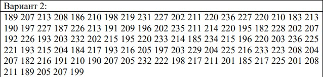

# Постановка задачи

**Цель работы** – научиться вычислять основные статистические характеристики выборки.

Пусть есть вариационный ряд из 100 элементов.  


# Обработка и анализ данных

Для данного набор была построена эмпирическая функция распределения:  


Для построения гистограммы был выбран интервал $c/\sqrt[3]n = 11$  


Ящик с усами. Данная реализация имеет границы 1 и 3 квартили, а усы - минимальное и максимальное значения выборки.  


## Метрики
Основные статистические оценки:

```
Среднее значение: 209.07
Дисперсия: 203.9851
Стандартная ошибка: 20.39851
Мода: 211.375
Первый квартиль: 198
Второй квартиль (медиана): 208.5
Третий квартиль: 220
Стандартное отклонение: 14.2823352432297
Эксцесс: 0.00387617547740092
Коэффициент асимметрии: 2.14619755674932
Минимальное значение: 182
Максимальное значение: 236
```

## Доверительный интервал

$$Доверительный\space интервал = (\overrightarrow{X} - (1.96\cdot\sigma); \overrightarrow{X} + (1.96\cdot\sigma))$$
$$|Доверительный\space интервал| = 2\cdot1.96\cdot\sigma = 14.28234\cdot1.96\cdot2\cdot0.05 = 2.79933864$$

# Контрольные вопросы:
## Статистические оценки

Статистикой называется произвольная борелевская функция
$$θ^∗ = θ^∗(X_1, ..., X_n) $$
от элементов выборки.

- Мат ожидание
- Дисперсия
- ОММ

## Эмпирическая функция распределения, гистограмма

Эмпирической функцией распределения, построенной по выборке $\overrightarrow{X} = (X_1, ..., X_n)$ объёма $n$, называется случайная
функция $F^∗_n : R × \Omega \to [0, 1]$, при каждом $y\in R$ равная
$$
F^∗_n(y) = \frac{количество X_i ∈ (−∞, y)}{n}
= \frac{1}{n}\sum^n_{i=1}I(X_i < y)
$$

Гистограмма - построенная по группированным данным визуализация плотности на отрезках. (или в точках, но это уже совсем другая история)

## Гипотезы и ошибки разных родов

**Гипотезой** $H$ называется любое предположение о распределении наблюдений:
$$H = {F = F_1}\space или\space H={F\in\Bbb{F}}$$
где $\Bbb{F}$ — некоторое подмножество в множестве всех распределений.

**Критерием** $δ = δ(X_1, ..., X_n)$ называется измеримое отображение
$$ δ:R^n \to \{H_1, ..., H_k\}$$
из множества всех возможных значений выборки в множество гипотез.

[1, с. 82] Говорят, что произошла **ошибка i-го рода** критерия δ, если критерий отверг верную гипотезу H_i. Вероятностью ошибки i-го рода критерия δ называется число
$$ α_i(δ) = P_{H_i}(δ(\overrightarrow{X})\ne H_i)$$

## Критерии согласия

> ...критериями согласия будем называть любые критерии, устроенные по одному и тому же принципу. [1, с. 91]

Критерий δ для проверки гипотезы $H_1$ против сложной альтернативы $H_2$ называется состоятельным, если для любого распределения $F_2$, отвечающего альтернативе $H_2$, вероятность ошибки второго рода стремится к нулю с ростом объёма выборки:
$$ α_2(δ, F_2) = P_{F_2}(δ(\overrightarrow{X})=H_1) \to0\space при\space n\to\infty$$

[1, с. 92]

## Интервальное оценивание
Доверительный интервал для параметра $\theta$ уровня доверия $1-\epsilon$ называется интервал со случайными концами 
$$
(\theta^−, \theta^+)
= (\theta^−(\overrightarrow{X}, \epsilon), \theta^+(\overrightarrow{X}, \epsilon))
$$
если для любого $\theta\in\Theta$ выполняется 
$$P(θ^− < θ < θ^+) \geq 1 −\epsilon$$


# Список литературы
1. Чернова Н.И., Математическая статистика - https://nsu.ru/mmf/tvims/chernova/ms/ms_nsu07.pdf