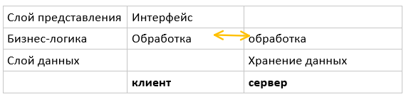
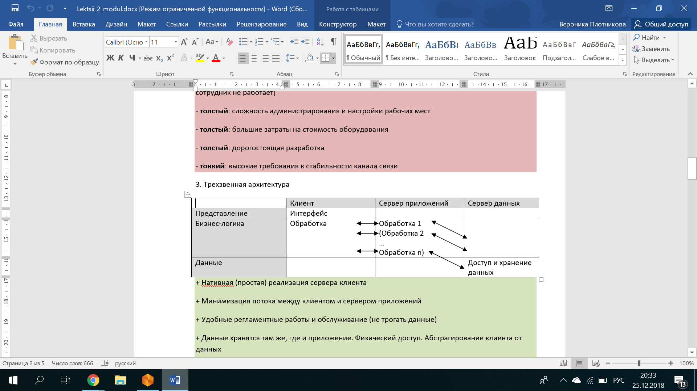
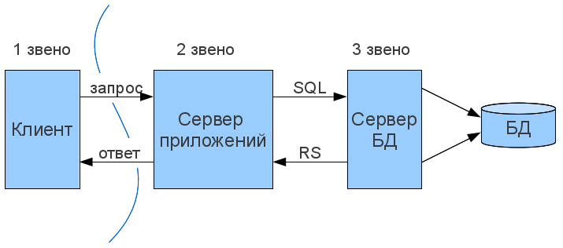
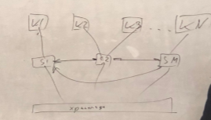
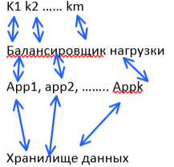
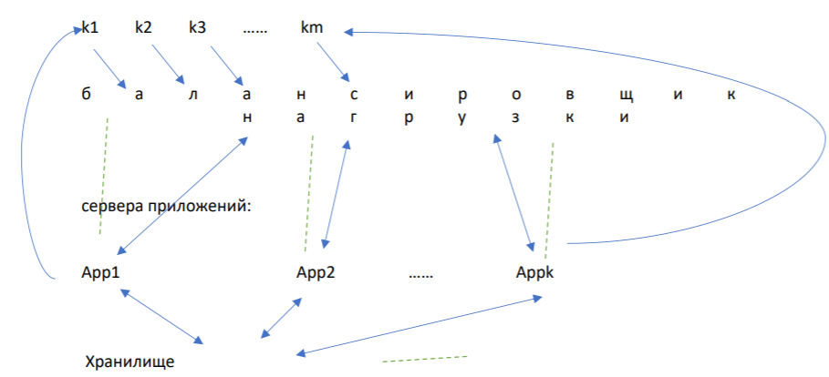
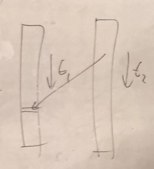
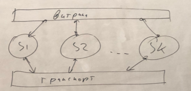

## 1. Понятие информационной системы. Обязательные элементы информационной системы.
--------------------------------------------------------------------------------

**Информационный объект** -- совокупность данных и методов их обработки.

**Информационный поток** -- множество объектов с одинаковым поведением к
характеристикам.

**Информационные технологии** --- это воспроизводимая совокупность
методов и средств (сбор, обработка, передача, хранение, представление).

**Информационная Система** (конструктивное определение) -- вся
инфраструктура предприятия, задействованная в процессе управления
информационными потоками и включающая следующие обязательные элементы:

-   **Информационная модель** -- совокупность правил и алгоритмов
    функционирования ИС. (Какую информацию собираем, по каким правилам.
    Как храним, по каким правилам и тд)
-   Регламент развития информационной модели. Так как все меняется,
    системы должны как-то меняться. (Как и когда менять?)
-   Кадровое обеспечение: пользователи, обслуживающий персонал. ИС
    должна быть поддержана кадрами на всех уровнях.
-   Программное обеспечение (Обеспечение какого-то процесса)
-   Аппаратно-техническая база (и непосредственно сервера, и
    инфраструктура)
-   Организационно-документационное обеспечение. Все модели, все
    системы, все принятые решения должны быть задокументированы

## 2. Понятие ситуативного управления.
-----------------------------------

Нет истории и прогнозов, real-time. Принимаем уникальные решения в
зависимости от ситуации (например, тушение пожаров). Рассматриваем всю
деятельность компании как множество уникальных ситуаций, в каждой из
которых мы принимаем решение.

Ситуативное управление рассматривают как управление, в котором
поставлено определенным образом, анализ ее симптомов и мер по снижению
негативных последствий в ее устранении, а также использование
полученного опыта для последующего развития.

1.  Выделить набор шагов, которые мы должны предпринять
2.  Спланировать оперативные мероприятия
3.  Реализовать оперативные мероприятия
4.  Проконтролировать изменения
5.  (доп) Определить источник возникновения ситуации (понять причину пожара)
6.  (доп) Запланировать действия по предотвращению
7.  (доп) Отследить выполнение действий
-   Основные объекты и субъекты
    -   Информационные объекты: задача, документ (распоряжения)
    -   Пользователи: менеджеры-исполнители
-   Механизмы обеспечения контроля исполнения
    -   факт исполнения
-   Цели
    -   контролировать факт исполнения атомарного действия
-   Глубина автоматизации
    -   Контурная глубина оптимизации (задачи "размазаны" между отделами)
-   Классы программного обеспечения
    -   Task Management System (напр. Jira), системы корпоративной почты.

## 3. Понятие проектного управления.
---------------------------------

*Проект* -- целенаправленный, заранее спланированный комплекс
взаимосвязанных мероприятий по созданию или изменению какого-либо
объекта, направленный на достижение заранее определенных целей в течение
заданного периода времени

Есть атрибуты, по которым можно сказать что проект завершился.
Нерегулярное производство

-   Основные объекты и субъекты
    -   Информационные объекты: проект, задача, документ
    -   Пользователи: руководители проекта, руководители этапа, исполнители
-   Механизмы обеспечения контроля исполнения
    -   Объекты контроля: сроки и ресурсы
-   Цели
    -   достижение целей проекта с помощью достижения целей каждого этапа
-   Глубина автоматизации
    -   Проект
-   Классы программного обеспечения
    -   PMS (Project Management System)

## 4. Понятие директивного управления.
-----------------------------------

Все действия на всех уровнях выполняются по инструкциям. Суть
управления: получить подтверждение, что ситуация возникла, выдать
распоряжение, убедиться в исполнении. Нужен большой документооборот

-   Основные объекты и субъекты
    -   Информационные объекты: документ, задание, резолюция (ознакомление, согласование)
    -   Пользователи: администраторы и исполнители
-   Механизмы обеспечения контроля исполнения
    -   Объекты контроля: факт, сроки исполнения заданий
-   Цели
    -   Контролирование движения и исполнение документов
-   Глубина автоматизации
    -   практически полностью
-   Классы программного обеспечения
    -   СЭД - системы электронного документооборота
    -   CMS - Content Managment System (Для вариации директивного
        управления, в котором участвуют не только документы, а
        контент. К документам привязывается контент. Контент связан
        между собой. Например, веб-страницы и документы)
    -   ECM - Enterprise Content Management

Зрелость процесса - уровень его формализации. Самый высокий уровень
зрелости - полностью документированный процесс (ISO 9000).

## 5. Понятие процессного управления.
----------------------------------

Устоявшиеся процессы со своими этапами, методами управления и т. п.
(включает директивное в рамках процесса). Применяется для выделенных
процессов (в идеале - зрелых).

-   Основные объекты и субъекты
    -   Информационный объект: процесс, задание, форма (шаблон, в рамках
        которого работает исполнитель), метрика (ключевые показатели
        эффективности процесса)
    -   Пользователи: администраторы процессов и исполнители заданий
-   Механизмы обеспечения контроля исполнения
    -   Объекты контроля: показатели процесса
-   Цели
    -   иметь актуальные сведения о процессе для оперативного управления
-   Глубина автоматизации
    -   адаптирована к степени формализации процесса. (Если процесс формализован, то процесс автоматизирован хорошо)
-   Классы программного обеспечения
    -   WorkFlow системы. (Поток процесса с исполнителями, этапами, вариантами для ветвления)
    -   BPM - business process model (Позволяют автоматизировать процесс
        (например, задавать время), моделировать процессы для принятия оптимальной)

## 6. Понятие операционного управления.
------------------------------------

В рамках всего предприятия все процессы сильно формализованы. Внутри
каждого процесса выделены операции. Операция имеет 4 компонента: вход,
выход, ресурсы, управление (как выполнять). (Пример - банковская сфера,
крупные предприятия)

Операционное управление -- управление операциями, длительностью
несколько часов и проблемами, возникающими по мере выполнения этих
задач. Операционное управление хорошо в случае наличия в компании
стабильных процессов. Работа идет по принципу "конвейера" -- формируются
задачи, передаются в конвейер, а дальше самостоятельно распределяются
между освободившимися участниками команды.

-   Основные объекты и субъекты
    -   Информационный объект: первичный документ (любая операция
        регламентируется), агрегат (срез данных для аналитики), отчёт (типовые агрегаты)
    -   Пользователи:
-   Механизмы обеспечения контроля исполнения
    -   
-   Цели
    -   повысить эффективность работы производственных и обеспечивающих подсистем компании за счет согласованности бизнес- процессов
    -   максимальная оптимизация издержек процессов
-   Глубина автоматизации
    -   кажется что почти полностью
-   Классы программного обеспечения
    -   ERP -Enterprise Resource Planning
    -   MRP2 - Material Resource Planning

7. Понятие Case Management.
---------------------------

Адаптивное-ситуационное управление - AСM.

В широком смысле кейс-менеджмент -- это управление неструктурированными
или частично структурированными бизнес-процессами.

В фокусе такого подхода не документ и его исполнение, а бизнес-процесс
(конкретный кейс/задача), который документируется в ходе достижения
результата. Ни одна инструкция, даже самая детальная, не может
предусмотреть все. Кейс же дает возможность специалисту проявить свои
знания, навыки и опыт, решая задачи не по жесткому алгоритму, а так, как
этого требует конкретный случай, и исходя из всей имеющейся у него
информации.

-   Основные объекты и субъекты
    -   Информационные объекты: **кейс** --- набор задач и поручений, связанных с исполнением целого бизнес-процесса
    -   Пользователи: исполнители кейса
-   Механизмы обеспечения контроля исполнения
    -   Контроль по факту исполнения
-   Цели
    -   достижения цели бизнес-процесса через кейсы
-   Глубина автоматизации
    -   Разная
-   Классы программного обеспечения
    -   Машинное обучение: множество случаев и динамическое развитие ситуации. Изначально - медицина. Показатели отличаются в зависимости от сферы применения этой системы.

## 8. Понятие корпоративной информационной системы. Основные принципы построения.
------------------------------------------------------------------------------

**Корпоративная ИС** (КИС) -- совокупность технических и программных
средств предприятия, реализующих методы автоматизации.

Лоскутная автоматизация - это плохо (без интеграции между разными
способами управления). Пример: ИСУ и ЦДО

### Виды автоматизируемых процессов

-   Технологические процессы - преобразование материалов или энергии.
-   Прикладные процессы - решения отдельных задач, не связанные с получением прибыли, но необходимые для деятельности компании (например, реализуется отделом кадров)
-   Бизнес-процессы - связано с получением прибыли или выполнения миссии компании, если основная деятельность не связана с получением прибыли
-   Информационные процессы - необходимость работы с информационными потоками (для реализации других процессов)

### 3 принципа, на которых основывается логика КИС:

-   Принцип интеграции - первичные данные вводятся 1 раз и могут использоваться различными компонентами КИС. В таком случае уменьшается риск ошибки.
-   Принцип системности (необходимых и достаточных данных) - для принятия решения одна и та же информация должна перерабатываться и исполняться на уровне необходимости и достаточности. Для человека, принимающего решения необходимо агрегировать информацию, представлять ее в срезе. Для принятия решения 7 +- 2 фактора
-   Принцип комплексности - автоматизация на всех стадиях. Например, при электронном документообороте бумажные документы на каких-то этапах нарушают автоматизацию, что повышает риск ошибки, увеличивает время.

### Жизненный цикл(этапы проектирования) КИС:

1.  Этап обследования и создания модели деятельности - анализ и моделирование бизнес/прикладных/инф. процессов предприятия, анализ функциональной архитектуры. Выход: требования и функциональная архитектура. Занимаются бизнес-аналитики.
2.  Этап проектирования - разработка информационной архитектуры, иногда - модель данных (если дата-центрированная архитектура). Проектирование потоков данных - информационная архитектура.
3.  Этап разработки. Программная архитектура.
4.  Интеграция и тестирование - интеграция разработанных компонентов в процессы и с существующими ИС.
5.  Внедрение - деплой системы (в условиях эксплуатации)
6.  Сопровождение - регистрация, диагностика ошибок системы, исправление

## 9. Системы класса MRP. 
----------------------

### Предназначение

**MRP-** material requirements(resource) planning. Основана на
планировании материальных потребностей отдела предприятия, организации в
целом.

Для производственных предприятий со сложным многоступенчатым
производством. Например: критично - синхронизация конвейеров (если части
поступают из разных мест)

В основе структуры:

-   BoM (bill of materials) - любое изделие представляется в виде набора материалов
-   Technology chain - материалы должны появляться к нужному сроку

Связка этих технологий составляет алгоритм поставки.0

План производства -> план поставок материалов

### Функции 

На разных этапах -- разные потребности в материалах: где-то нужны
полуфабрикаты, где-то нужны исходные материалы. Если на каком-то этапе
нет нужного материала, то весь конвейер производства приостанавливается
(и этапы после, и этапы до). Существуют буферные склады, чтобы
компенсировать какие-то ситуации, но на ограниченный объем.\
Системы зародились для производственных предприятий (в том числе для
сложных многоступенчатых производств) с необходимой потребностью в
планировании поставок с целью сокращения издержек на хранение.

### Недостатки

Такая модель работает, если мы не зависим от заказов (работаем по
плану). Негибкая система - не подстроиться под рынок (Например, изменить
соотношение товаров).

## 10. Системы класса MRP II.
--------------------------

### Предназначение

Идея: стартуем не от плана производства, а от плана продаж. В MRP2 на
первый план вышли финансовый анализ и финансовое планирование.

В MRP2: план продаж (в т ч предзаказы) -> план производства -> план
поставок материалов. Производить в последний момент, чтобы сэкономить на
хранении, подстроиться под рынок.

### Функции 

Как и в MRP, только появилась возможность подстраиваться под рынок и,
тем самым, снижать издержки производства

### Недостатки

1. MRP II имеют ориентацию только на заказ.
2. MRP II, являясь применимой преимущественно для производственных
предприятий со сложным производством, весьма требовательна к уровню
организации процесса внедрения и качеству исходных данных.
3. Модули MRP II позволяют прогнозировать возможные проблемы, но не
пытаются вовремя решить выявленные проблемы, оставляя их на усмотрение
персонала.
4. MRP II системы не позволяют планировать такие ресурсы предприятия,
как человеческие.

## 11. Системы класса ERP. 
-----------------------

### Предназначение

**ERP** - enterprise resource planning.

Ступень, с которой начинать производство мы выбираем сами в зависимости
от ситуации (план продаж / план производства / план поставок
материалов), исходя из анализа ресурсов.\
Например, спросом можно управлять. Нашли выгодного поставщика (не
вписывается в план продаж) -> стимулируем спрос (сбыт)

### Функции 

Модули ERP систем:

1.  Управление запасами. Управлять запасами не только с позиции
    временного хранения для последующего производства. Поддержка
    определенного уровня запасов
    - Мониторинг запасов (приход/ внутреннее движение /уход сырья, данные по складским возможностям / данные по текущей фактической финансовой стоимости).
    - Регулирование складских остатков. Например, при повышении фактической стоимости можно продать остатки.
2.  Управление снабжением - обеспечение уровня запасов
    - Заказы на закупку
    - Графики поставок
3.  Управление сбытом
    - Механизмы для квотирования продаж (квоты на продажу)
    - Управление заказами на продажу (предыдущие, текущие)
    - Механизмы анализа продаж (для принятия решения о квотах)
    - Конфигурирование продуктов
4.  Управление производством
    -   Спецификации изделий (BoM)
    -   Управление производственными мощностями. Может быть реализовано с помощью линейных алгоритмов, динамического, нейронками и т.п.
    -   Управление технологическими процессами (график простоев, профилактики)
    -   Управление людьми (нарядами)
-   Управлением качеством (метрики, которые мы оцениваем в контексте продаж)
5.  Сквозное планирование
    -   Финансовое планирование товарно-номенклатурных групп
    -   Календарное планирование(по конкретным объемам продукции)
    -   План распределения ресурсов (энергетические, кадровые, материалы)
    -   Планирование потребности в материалах
6.  Управление сервисным обслуживанием - всё работает, если за ним
    следят (плановые работы, прогнозирование выходов из строя).
7.  Управление цепочками поставок. Материалы для производства зависят от
    их материалов. Иногда непрямое воздействие. Например, кредитование
    непрямых поставщиков.
8.  Управление финансами
    -   Управление платежами
    -   Бухгалтерский учет
    -   Управление себестоимостью продукции
    -   Учет основных средств

### Недостатки

· дороговизна программного комплекса\
· дороговизна внедрения и обслуживания\
· сложность внедрения, настройки, обслуживания, эксплуатации\
· сложность обучения сотрудников работе с системой

## 12. Системы класса CRM.
-----------------------

### Предназначение

**CRM** (Customer Relationship Management) - система взаимодействия с
клиентами.

Есть менеджер по работе с клиентами. Клиенты, создают различного рода
задачи, которые нужно помещать на таймлайн, отслеживать их выполнение.

CRM-система помогает автоматизировать работу предприятия с клиентами,
создать клиентскую базу и использовать ее в целях эффективности своего
дела.

### Функции 

Автоматизация бизнес-процессов по взаимоотношению с клиентом, контроль
абсолютно всех сделок.

-   управление контактами --- поддержка информации о клиенте и истории контактов с ним, может включать информацию о точках цикличных продаж или периодичности пополнения клиентских запасов своей продукцией;
-   управление деятельностью --- предоставляет календарь и деловой дневник для торговых представителей, работающих в \"поле\";
-   управление связью --- выражается в самостоятельном программном модуле, отвечающем за передачу информации с использованием модема или мобильного телефона, ее сохранность и репликацию;
-   прогнозирование --- предоставляет информацию о перспективных планах продаж, а также прогнозы исследовательских организаций или данные маркетинговых исследований подразделений компании;
-   управление возможностями --- управление побуждающими факторами привлечения потенциальных клиентов;
-   управление заказами --- получение информации о наличии товара на складе и размещение заказов на доставку или производство продукции в он-лайн режиме;
-   управление документацией --- разработка и внедрение стандартов и настраиваемых отчетов и информационно-рекламных материалов;\ анализ продаж --- предоставление аналитических возможностей в данные о продажах;

Следующий функционал, который стал появляться и развиваться в CRM
системах --- повышение точности прогнозов взаимодействия с клиентом и
продаж. Фиксирую все точки взаимодействия с клиентами =\> анализировать
все закономерности, могу прогнозировать, что будет происходить дальше.

Дальнейшее развитие --- спрос и продажи не только прогнозировать, но и
стимулировать. CRM получили маркетинговый функционал: программы
лояльности/другие системы повышения продаж.

Все это привело к появлению поточной организации продаж: у менеджера
существуют процессы (переход к процессному управлению), для него
существует поток продаж. Существуют WF (набор операций) работы с
клиентом, которые в совокупности организуют WF менеджера.

## 13. Системы класса CAD/CAM/CAE.
-------------------------------

Используются на производстве

**Computed-aided Design** --средства автоматизированного проектирования,
предназначенные для автоматизации двумерного и/или трехмерного
геометрического проектирования, создания конструкторской и/или
технологической документации; система, упрощающая построение чертежей.\
То есть результат -- чертеж/схема\
\
**Computer-aided Manufacturing** -- система, управляющая самим
производством: станком, линией станков.\
Получает на вход чертеж из CAD и на его основании запускает
производство. На выходе системы появляется микропрограмма, которая
уходит в станок, который начинает функционировать.\
\
**Computer-aided Engineering** -- средства автоматизации инженерных
расчётов, анализа и симуляции физических процессов; система, позволяет
имитировать реальные условия эксплуатации. Берет чертежи из CAD,
навешивает материалы, забивает параметры и строит стимуляцию, что будет
происходить. Цель - обнаружение ошибок, прочностные расчеты, оптимизация
производственных возможностей.

14. Системы класса MES. 
-----------------------

### Предназначение

**MES** (manufacturing execution system) --- система управления
производственными процессами

### Функции 

Позволяет перераспределять нагрузки, управлять последовательностью
использования станков, позволит перенастроить линию, если что-то
сломалось: перераспределить нагрузку, максимизировать скорость
производства.

MES-система охватывает следующие задачи:
-   распределение и контроль статуса ресурсов (построение модели производства, централизованное хранение,.);
-   диспетчеризация производственных процессов (управление заказами на производство, управление сырьем и полуфабрикатами, контроль выполнения плана, контроль остатков);
-   сбор данных, управление качеством
-   управление техническим обслуживанием;
-   анализ производительности
-   составление производственных расписаний;
-   контроль документов (электронный документооборот);
-   управление трудовыми ресурсами (управление персоналом);
-   координация технологических процессов и отслеживание готовой продукции.

15. Системы класса СЭД. 
-----------------------

### Предназначение

Системы электронного документооборота - комплекс программ для
догконтролируемого управления и создания документов на предприятии в
соответствии с правилами работы с документами.\
Внедряя СЭД, организации чаще всего планируют решить следующие задачи:

-   повышение эффективности управления путем автоматизации контроля выполнения, большей прозрачности деятельности подразделений, отдельных сотрудников;
-   автоматизация бизнес-процессов с их одновременной оптимизацией;
-   обеспечение поддержки накопления, управления и организации доступа к корпоративной информации, знаниям;
-   протоколирование деятельности компании в целом, ее отдельных подразделений, рабочих групп, сотрудников с использованием этой информации для поддержки принятия решений т.д.;
-   сокращение оборота бумажных документов (с целью снижения издержек);
-   упрощение, удешевление хранения документов, использующихся в текущей деятельности, за счет создания оперативного электронного архива.

### Функции 

-   Безопасность. Вся информация, имеющаяся в базах обмена данными, должна быть надлежащим образом защищена. Одним из способов защиты и заверения цифровых документов стала электронная цифровая подпись.
-   Версионность.
-   Моментальный поиск.
-   Своевременное предоставление уведомлений.
-   Наличие маршрутизаторов, а также заданий для пользователей.
-   Интеграция с электронной почтой.
-   Сканирование и полное распознавание информации.
-   Информационная поддержка на всех уровнях работы.

16. Системы класса SCM. 
-----------------------

### Предназначение 

**SCM** (Supply Chain Management) ---система управления цепочками
поставок. Появились, когда стало понятно, что большой сложный элемент
продукции нерентабельно производить силами одного предприятия.

Функции

Системы позволяют выстраивать системы поставок и сборки с них готового
решения.

Позволяют построить модель бизнес-процесса: сделать виртуальную модель,
запустить, проверить работоспособность с учетом всех затрат.

17. Системы класса PDM.
-----------------------

### Предназначение

Индивидуальные требования к продукту.

**PDM** (Product Data Management) - система управления данными о
продукте. С помощью PDM-систем осуществляется отслеживание больших
массивов данных информации, необходимых на этапах проектирования,
производства или строительства, а также поддержка эксплуатации.

**PLM** (Product lifecycle management) - система управления жизненным
циклом продукции, развитие PDM: когда поняли, что может меняться
специфика производства в зависимости от размера, например --- или других
показателей. Для наблюдения за жизненным циклом кастомизированного
продукта.

### Функции 

Основная функция системы PLM -- накопление и управление данными и
документами об изделиях и объектах, на всех этапах жизненного цикла этих
изделий и объектов.

18. Системы класса EAM. 
-----------------------

### Предназначение

**EAM** (Enterprise Asset Management) --- система управления фондами
компании.

### Функции 

инвентаризация и паспортизация оборудования (иерархия фондов). Видим
какой диск куда установлен, когда введен в эксплуатацию. Смотрим сколько
времени безотказной работы. С помощью этого прогнозируем отказы. Тут же
возникает управление работами по ТО и эксплуатации. Не каждого работника
можно отправить ремонтировать, есть допуски.

19. Системы класса Help Desk, Service Desk. 
-------------------------------------------

### Предназначение

HelpDesk/ServiceDesk системы --- системы для поддержки пользователей.

**HelpDesk** -- плоская система поддержки. Для записи тех или иных
ситуаций о продукте, заведение тикетов, отслеживание статусов обращений;
просто зафиксировать поломку и то, что инцидент решен.

**ServiceDesk** -- иерархическая тех поддержка.\
Первый уровень -- простые люди, которые умеют читать\\писать и отвечают
на элементарные вопросы -- обезьянка. То есть первичная обработка
запроса, зарегистрированного на портале техподдержки специалистами
службы. Если не помогло, то происходит эскалация, переходим на уровень
выше.\
Второй уровень -- рассмотрение технических специалистов, имеющих
соответствующие знания по технологиям и программам.\
Третий уровень -- проблемы решаются на системном уровне группой
экспертов

20. Системы класса BPMS.
------------------------

### Предназначение

**BPM(Business Process Management System/Solution) -** Система управления бизнес-процессами

BPMS реализуют процессный подход к управлению компанией и позволяют
автоматизировать сквозные бизнес-процессы, быстро вносить в них
изменения. BPMS нужны прежде всего компаниям с уникальными процессами
(например, госструктуры), так как способны устранять функциональные
барьеры --- результат разрозненности подразделений или корпоративных
приложений в компании.

### Функции 

BPMS представляет собой интегрированный набор инструментов для
моделирования бизнес-процессов, автоматизации их выполнения и измерения
эффективности. BPM отвечает на вопросы где, когда, зачем, как и какая
работа выполняется и кто отвечает за ее выполнение.

21. Системы класса WMS.
-----------------------

### Предназначение

#### **WMS** (warehouse management system) --- система управления складами

Проблема: держать все товары сложно, если не держать - сложно
гарантировать время доставки. Один склад - сложная логистика.
WMS-системы позволяют учитывать что, где хранится и планировать что и
куда нужно перемещать

### Функции 

1.  Позволяют управлять множеством складов и распределять товары между ними.
2.  Позволяют управлять размещением товара на определенном складе (было бы хорошо знать когда и какой товар понадобится + есть разные зоны разных условий)
3.  Все что связано с инвентаризацией (Например, сроки хранение)

## 22. Системы класса HRM. 
-----------------------

### Предназначение

#### **HRM (human resource management)** - система управления кадровыми ресурсами.

Стало понятно, что кадры - это не только ресурс, который нужно
учитывать, а еще ресурс, которым нужно управлять (монетизация
лояльности, например).

Основная цель таких систем - привлечение и удержание ценных для
предприятия кадровых специалистов. HRM-системы решают две главные
задачи: упорядочение всех учетных и расчетных процессов, связанных с
персоналом, и снижение процента ухода сотрудников.

### Функции 

-   Поиск персонала; Подбор и отбор персонала
-   Информация о сотрудниках: их стаж, уровень допуска, различные учеты (военный, страховой, медицинский) и так далее.
-   Строительство набора компетенций, распределение по позициям.
-   Управление мотивацией персонала: баллы, бонусы.
-   Контуры управления компетенции: сотрудник во время работы развивается в определенном направлении, это нужно учитывать и использовать. Интеграция с базами новых кадров.

## 23. Виды архитектур ИС и основные объекты, характеризующие описание ИС в рамках каждого вида архитектуры.
---------------------------------------------------------------------------------------------------------

5 уровней описания архитектуры ИС:
1.  **Функциональная архитектура.** Описывает представление ИС как
    совокупность функциональных компонентов. (Какие функции выполняет
    система?)
2.  **Информационная архитектура.** Единица с которой мы работаем это
    информационный объект.
    a.  Информационный объект -- совокупность данных и методов их
        обработки.
    b.  Информационный поток -- множество объектов с одинаковым
        поведением к характеристикам.{пример - книжка, личная карточка}
    c.  Не показывает архитектуру с точки зрения ПО.
3.  **Системная архитектура**. Выделяются аппаратные компоненты, на них
    разворачивается системное ПО, на них работает прикладное ПО.
    Появляются программные компоненты. Включает в себя и аппаратные, и
    программные компоненты, и людские ресурсы (не только непосредственно
    взаимодействующие с ПО, но и обслуживающие), энергетические и т. п.
4.  **Программная архитектура.** Описывает архитектуру ПО. (Как
    организован код?)
5.  **Архитектура данных**. Организация данных с точки зрения системы;
    работа с потоками данных (какие типы данных, как происходит
    сериализация, как хранятся и т. п.)

**Информационные процессы**:
-   Сбор
-   Хранение
-   Обработка
-   Передача
-   Представления

**Задача системы** -- реализовать информационные процессы.

**Технология** - воспроизводимая совокупность методов и средств.
Информационная технология != компьютерная технология. Компьютер лишь
расширяет возможности.

**Управление** -- информационный процесс, поэтому для построения АСУ
(автоматическая система управления) нужно построить ИСУ

24. Файл-серверная архитектура. 
-------------------------------

Выделим три слоя в изначальной функциональной архитектуре \[Любая
информационная система реализует 5 информационных процессов: сбор,
обработка, хранение, передача и представление информации. Любые операции
в ИС комбинации этих функций

Слой представлений (решает задачи сбора+представления ---это интерфейс)

Слой бизнес-логики (решает задачу обработки)

Слой данных (решает задачу хранения) Передача размазана между ними,
обеспечивая взаимодействие слоев между собой.

-   Описание
> 
-   Преимущества
    -   Дешевизна и простота организации
-   Недостатки
    -   Низкая безопасность
    -   Низкая производительность
    -   Плохо масштабируется
    -   Нет параллельной обработки

1.  Классическая (двухзвенная) клиент-серверная архитектура. Распределение функций ИС по слоям (звеньям).
---------------------------------------------------------------------------------------------------------

-   Описание

Клиент-серверная архитектура --- архитектура приложения, в которой
сетевая нагрузка распределена между поставщиками услуг, называемыми
серверами, и заказчиками услуг, называемыми клиентами. Фактически
клиент и сервер --- это программное обеспечение. Обычно эти программы
расположены на разных вычислительных машинах и взаимодействуют между
собой через вычислительную сеть посредством сетевых протоколов.
Программы-серверы ожидают от клиентских программ запросы и
предоставляют им свои ресурсы в виде данных.

Существуют толстый(большая часть обработки на клиенте) и тонкий(большая
часть обработки на сервере) клиенты

-   Преимущества
    -   высокая безопасность
-   Недостатки
    -   высокая сложность настройки рабочих мест
    -   толстый клиент требует затрат на аппаратное обеспечение рабочих мест
    -   Тонкий клиент: требования к стабильности информационного канала и высокой пропускной способности

1.  Трехзвенная (трехслойная) клиент-серверная архитектура.
-----------------------------------------------------------

-   Описание

 Физическое разделение программ, отвечающих за хранение данных (СУБД)
 от программ эти данные обрабатывающих (сервер приложения (СП)). Такое
 разделение программных компонент позволяет оптимизировать нагрузки как
 на сетевое, так и на вычислительное оборудование комплекса.

 

 Заточено под тонкие клиенты. Простая нативная реализация тонкого
 клиента, минимизация потока между клиентом и сервером приложений.
 Нативная высокая безопасность. Минимизирован поток между клиентом и
 сервером приложений (упаковываем данные).

 Сервер данных в отдельной виртуальной сети, что повышает безопасность.
 Всё ещё подразумевается строго централизованное хранилище данных

-   Преимущества
    -   Высокая безопасность
    -   Масштабируемость
-   Недостатки
    -   Балансировка нагрузки
    -   Высокие расходы на администрирование и разработку серверной части.

1.  Толстый и тонкий клиент. Преимущества и недостатки реализации трехслойной архитектуры с тонким и толстым клиентом. Web-клиент.
----------------------------------------------------------------------------------------------------------------------------------

**Толстый клиент**--большая часть обработки информации происходит на
клиент, т.е. клиент имеет полную функциональность и независимость от
центрального сервера

Достоинства:
-   возможность работы даже при обрывах связи с сервером
-   высокое быстродействие

Недостатки:
-   Проблема кеширования данных: нужно отслеживать актуальность данных на клиенте(ису синхронизируется в 3 часа ночи)
-   Сложность администрирования и настройки рабочих мест пользователей
-   Ресурсные затраты на клиентские рабочие места
-   Высокая сложность и стоимость разработки всей системы в целом
-   Плохая масштабируемость

**Тонкий клиент** -- большая часть обработки информации происходит на
сервере

Достоинства:
-   Полноценная поддержка многопользовательской работы
-   Гарантия целостности данных

Недостатки:
-   Высокие требования к пропускному каналу и качеству связи
-   Высокие требования к производительности серверной компоненты

**Web-клиент** -- то же самое, что и тонкий клиент, но клиентская часть
- браузер и общение между клиентом и сервером происходит по
стандартизированным протоколам(типа http)

28. Цели построения распределенных ИС.
--------------------------------------

Распределенная ИС представляют собой территориально рассредоточенные
системы, состоящие из взаимодействующих компьютеров и терминалов,
связанных между собой каналами передачи данных; набор независимых
компьютеров, представляющийся их пользователям как единая система.\
Основная задача - облегчение доступа к удаленным ресурсам и контроль
совместного использования этих ресурсов.

Цели
-   Повысить производительность за счёт параллельной обработки
-   Снизить телекоммуникационные расходы за счёт приближения обрабатывающих узлов к потребителю, проблема кеширования
-   Повысить надёжность за счёт дублирования узлов и хранилищ данных
-   Повысить масштабируемость за счёт абстрагирования функций узлов (Одновременно могут приходить сложные и простые запросы. Можно настроить определенные узлы на один тип запросов, остальные - на второй. )

29. Проблемы, возникающие при построении распределенных ИС и подходы к их устранению.
-------------------------------------------------------------------------------------

Проблемы распределенных ИС

-   Обеспечение целостности данных (сохранение транзакционности операций)
-   Оптимизирование использования ресурсов при неравномерной нагрузке(чем больше узлов тем сложнее балансировать, алгоритмы балансировки далеко не линейны)
-   Синхронизация событий и взаимоблокировок(целостность данных ведет к блокировкам, существуют атомарные действия)
-   Проблема стандартизации интерфейсов(зоопарк железа и интерфейсов между ними, любой стандартный интерфейс - проблема с производительностью)
-   Проблема мониторинга и диагностики(сложно уследить за всеми узлами)
    -   Решение: многоагентные системы, очереди

Типовые решения

-   усовершенствования трёхзвенной архитектуры

Есть вариант распределенной работы: каждый клиент привязан к конкретному
серверу (клиент знает свой сервер) и обращается только к нему. Балансировщика
нет. Но тогда мы разрешаем серверам между собой обмениваться задачами. \[т.е. некий
сервер получил задание, он сейчас занят, но есть рядом свободный сервер.
Отправим ему и клиенту отдадим результат. Или видим, что какую-то операцию можно
параллельно выполнить на другом сервере. Или лучше выполнить на другом сервере.\]

-   далее см. следующий билет (**Методы организации взаимодействия
 программных компонентов)**

30. Методы организации взаимодействия программных компонентов при построении распределенной трехзвенной клиент-серверной архитектуры.
-------------------------------------------------------------------------------------------------------------------------------------

 

 Еще одна тенденция в клиент-серверных технологиях связана со все
 большим использованием распределенных вычислений. Они реализуются на
 основе модели сервера приложений, где сетевое приложение разделено на
 две и более частей, каждая из которых может выполняться на отдельном
 компьютере. Выделенные части приложения взаимодействуют друг с другом,
 обмениваясь сообщениями в заранее согласованном формате. В этом случае
 двухзвенная клиент-серверная архитектура становится **трехзвенной
 (three-tier, 3-tier)**.

 Как правило, третьим звеном в трехзвенной архитектуре становится
 сервер приложений, т.е. компоненты распределяются следующим образом
 ([рис.
 4](http://www.4stud.info/networking/lecture5.html#three-tiers-model)):

1.  Представление данных --- на стороне клиента.
2.  Прикладной компонент --- на выделенном сервере приложений (как вариант, выполняющем функции [промежуточного ПО](http://www.4stud.info/networking/lecture6.html)).
3.  Управление ресурсами --- на сервере БД, который и представляет запрашиваемые данные.

**Методы организации взаимодействия программных компонентов**

-   RPC (Remote Procedure Call): модель, удобная тем, что не требуются ООП-решения. На серверах может быть что угодно, хоть скриптовые решения.

Удаленный вызов процедуры --- каждое приложение, выполняемое на сервере,
живёт в своём адресном пространстве и верит в то, что адресное
пространство защищено и незыблимо, и умеет обращаться только в его
пределах. Так как напрямую на другой сервер обратиться не можем, делаем
процедуры-заглушки. Они находятся в адресном пространстве этого сервера,
но на самом деле это заглушка, которая говорит: "да, сейчас отвечу", при
этом на самом деле создаёт пакет (сериализует), отправляет другому
серверу и там выполняется аналогичная ситуация. Тоже заглушка, которая
думает, что это нормальный внутренний вызов процедуры. После этого
происходит обработка и точно так же ответ. Все думают, что выполнили в
своем окружении, но на самом деле данные мигрировали между серверами.
Получаем необходимость постоянной настройки каналов связи. Когда есть
типовые операции всё ок. Если что-то меняем, то надо менять на всех
серверах и при этом учитывать связи. Итого, RPC --- хорошо, но сложно в
реализации.

**объектно-ориентированные решения**

-   сериализация объектов (берем конкретно объект, сериализуем-сжимаем, передаем в другое окружение, и он там выполняется. То есть его методы над его данными выполняются в другом окружении. Потом измененный объект вернется обратно нам). Сложности: --- абсолютно одинаковое окружение на всех серверах (надо получить объект, объект должен выполниться используя методы и зависимости точно так же, как он бы выполнялся на другом сервере) --- надо обработать немного данных, а сериализуем и передаем мы весь огромный объект
-   RMI --- remote method invocation удаленный вызов метода на другом узле (и получаем результат работы). Удобно, если мы имеем гарантированно общее хранилище данных. Так мы поймем, что удаленный метод будет использовать те же данные. Опять надо использовать схожие технологии.
-   CORBA -\> SOA common object request broker architecture / service-oriented architecture каждое приложение --- брокер есть единая витрина/пул опубликованных методов различных объектов, можно вызвать любой из них, причем прозрачно. Мы не знаем где физически будет выполняться, но это не нужно, нужен результат. Привело к тому, что надо унифицированно описывать интерфейсов. Привело к необходимости создания языков для унифицированного описания.
-   IDL (Interface Definition Language): позволяет унифицировано описать интерфейсы. сложный
-   WSDL --- web-service definition language и подобные языки, которые позволили удобно и компактно описывать интерфейсы этих объектов.

Все эти решения основываются на принципе --- хранилище единое и
неделимое. Только это обеспечивает целостность данных и возможность
работы методов наверху. Хранилище в какой-то момент становится узким
местом. Можно пропробовать распараллелить хранение данных, но сохраняя
требования к надежности и целостности.

1.  Балансировка нагрузки при построении распределенных ИС. 
-----------------------------------------------------------
Цели балансировки:
-   Улучшение производительности системы
-   Повышение отказоустойчивости
-   Обеспечение бесперебойной нагрузки

### Виды балансировки

-   Синхронная балансировка (например настройки nginx)

 

 При синхронной балансировке и входной поток и выходной поток
 происходит через балансировщик. Это позволяет очень четко отследить
 состояние каждого сервера. Балансировщик знает (я его отправил и
 столько требований было. Сколько ответов получил и тд) у какого
 сервера сколько сейчас в обработке. Знаем кто вышел из строя (не
 получаем ответов). Хороший балансировщик может кешировать запросы, и,
 если ответа нет, отправлять на другой сервер. Удалять кеш только при
 получении ответа. Можем очень эффективно использовать ресурсы серверов
 приложений.

-   Преимущества
-   Недостатки
    -   Балансировщик - узкое место по производительности т.к входной поток сильно меньше выходного.
    -   проблемы с безопасностью(вскрыли балансировщик -\> пролезть дальше)

-   Асинхронная балансировка

 

 Балансировщик не может проверить, насколько всё ок работает. Он что-то
 отправляет как в черный ящик и ничего не знаем. Вводим систему
 мониторинга с своими приложениями (балансировщик опрашивает сервера:
 живы ли они, всё ли хорошо, сколько свободно памяти, сколько сейчас
 висит процессов в обработке). Но попадаем в проблему мониторинга: либо
 мы будем мониторингом нагружать систему, либо иметь недостоверные
 данные.

 Решение:

 **Многоагентные системы**. На каждом сервере агент, который следит за
 состоянием своего сервера. У него есть некие требования (пороговые
 значения) для реакции. Если что он сам сообщит это балансировщику.
 Балансировщик либо снизит нагрузку, либо скажет держитесь там. Всё ещё
 остается проблема централизации. Выход из строя балансировщика нарушит
 работу системы. Третий путь (не классическая балансировка).

 **Использование общей (управляемой) очереди**. Кролик (RabbitMQ)
 обслуживает очередь. с одной стороны приходят запросы от клиентов, с
 другой контракты со стороны серверов (сервер который свободен кидает
 туда возможность выполнить тот или иной запрос). Задача очереди
 организовать встречу клиента и контракта. Неплохой вариант, но в этой
 ситуации сложно утилизировать ресурсы (как сервер должен понять что он
 может выполнить запрос --- сложно). Сложно гарантировать время отклика
 (может возникнуть ситуация голодания, например) --- нет механизма
 управления очередью (а если писать сложные механизмы обработки, то мы
 просто напишем балансировки). Можно писать
 многоуровневые/универсальные очереди --- но чем более сложный алгоритм
 --- тем больше накладные ресурсы на реализацию этого алгоритма.

-   Преимущества
    -   балансировщик разгружен за счет того, что ответ возвращается напрямую
-   Недостатки
    -   Сложно гарантировать время отклика
    -   балансировщик не контролирует серверы, поэтому нужно дополнительно системы мониторинга.
    -   безопасность (разные сертификаты шифрования у балансировщика и сервера)

И в случае и синхронной, и асинхронной балансировки, пула ресурсов
имеем общее **хранилище данных**. хранилище становится узким местом.
Нужно разделить хранилище, одновременно обеспечив целостность данных:
перейти к **распределенной системе**.

1.  Системы с распределенным хранением данных. Виды систем и особенности их реализации и использования.
-------------------------------------------------------------------------------------------------------

Есть три пути (не путю)

1.  Перемещаемый фрагмент данных. Не важно, какое хранилище (SQL/NoSQl/...) --- есть фрагмент данных и его можно перемещать. И только перемещать. Это обеспечивает целостность данных. С другой стороны, сложно, когда есть транзакции, связывающие множество объектов/структур данных. Транзакция тянет задачу перенести ещё объект, а может и не один. Может начинаться Трэшинг --- когда несколько узлов начинают конкурировать за фрагмент данных. (Против кешинга таймаут можно поставить, можно какие-то алгоритмы написать). Реально распараллеливания не происходит

2.  Копирование фрагмента данных при запросе, при этом разрешаем доступ только на чтение. Целостность сохраняем. Каждый узел работает со своей копией. Минус: а что произойдет, если я хочу изменить фрагмент данных, а у меня 1000 копией, не понятно где расположенных? Если поменять в одном месте и с него начнут копировать, то по сети будут расползаться разные версии. Пока моя копия дойдет до какого-то узла пройдет много времени. Другой вариант: транзакционность. Обращаемся к записи в некоторый фрагмент данных. Делается рассылка по всем узлам "умничтожьте, если у вас есть копия", но там может быть активная операция чтения, поэтому ждем, пока чтение закончится, потом уничтожим копии, от всех придет отклик, что всё уничитожено и только тогда операция на запись будет произведена. Ожидание этой операции может быть по времени очень большим. Так что это удобно если операций чтения у нас многократно больше операций записи. Пример: dns-таблицы

3.  Разрешено всё. Изменять что угодно и где угодно. Любой узел читать и писать. Если надо для чтения --- копию, если для записи тоже копию, вносим изменеия и всем рассылаем уведомление "в эту копию внесены такие изменения". Когда дойдет до когонибудь это изменение он и решит, что с ним делать. Понятно, что возникают конфликты по данным. Может быть ситуация, что вносятся противоречивые изменения в две копии. Тогда настраиваем те или иные алгоритмы, которые решают эти конфликты. В основном создаются структуры данных с невозможностью изменения или удаления записей. (Никогда нет операций update/delete/drop) --- только Insert. Просто новые данные делают неактуальными некоторые предыдущие.

Возникает задача: синхронизация времени. Она должна быть точной. Создать
универсальные часы нельзя. Но нам это и не надо. Ланпорт доказал, что мы
можем конкретно установить, произошло это событие раньше или позже в
двух случаях: либо два события произошли в одной системе, либо это
событие содержит метку времени из другой системы и является посылкой из
этой системы. Дальше если один узел делает второму посылку он снабжает
меткой: когда он ее посылал. Если получается, что метка оказалась раньше
(сервер отстает по времени), то мы ускоряем время. Иначе пропускаем пару
тактов

Эффект ускорения времени. Уходим от астрономического. Поэтому надо
иногда синхронизировать с астрономическим. Проблема в том, что мы всё
делим, и при этом пытаемся обеспечить целостность данных. другая
концепция

1.  Сервисно-ориентированная архитектура ИС. 
--------------------------------------------

-   Особенности построения

 Сервис - совокупность данных и методов для их обработки, чёрные ящики,
 кот. Характеризуются интерфейсами

 Каждый сервис просто умеет обмениваться данными с другими сервисами,
 но за любой фрагмент данных отвечает конкретный сервис, он
 "инкапсулирован" вместе с обработкой в конкретный сервер.\
 Транспорт - умеет доставлять данные между сервисами

 Витрина - некоторый сервис хочет получить результат от другого
 сервиса. Ищет в витрине опубликованный интерфейс, который ему
 подходит. Узнает адрес и специфику интерфейса и используя транспорт по
 этому адресу этому сервису кидает соответствующие данные, в ответ
 получает отклик и тд. Сервисы могут выстраиваться в цепочки любой
 длины и взаимодействовать между собой.

 

-   Преимущества
    -   стимул для анализа и оптимизации бизнес-процессов компании;
    -   возможность обеспечить интеграцию при консолидации компаний (систем);
    -   возможность снизить ТСО систем.
    -   способность быстро адаптировать ИТ к меняющимся задачам бизнеса;
-   Недостатки
    -   Достаточно большое время отклика
    -   Некоторой избыточностью пересылаемой информации, что при
    -   больших нагрузках может привести к перегруженности сетевого
    -   трафика
    -   Сложность развертывания
    -   Затратность развертывания

1.  Облачная архитектура построения дзюдо ИС. Классы облачных систем.
---------------------------------------------------------------------

Возникла задача интероперабельности между собой
Взаимодействие сервисов между собой **--интероперабельность**.
-   техническая интероперабельность -- способность принять структуру данных
-   семантическая интероперабельность --- смысл который сервисы вкладывают в эти структуры данных (например, время в разных поясах --- плохо)

Появилась необходимость в удобной витрине (сервисы публикуют данные о
себе). Если разношерстные интерфейсы, то будет мало сервисов, которые
смогут с ними работать

-   REST, делаем на витринах урлы, а интерфейсы считаем унифицированными (там стандартный CRUD --- create/read/update/delete). И только с этими операциями по этому URL мы и работаем. Все тогда можно сделать универсальным с точки зрения витрины, но не разбежишься с точки зрения возможностей внутри.

-   wsdl и близкие -- полноценное описание сложного интерфейса
-   amqp и похожие протоколы --- подписные модели. Сервис подписывается на некую очередь сообщений, публикует свой интерфейс в очередь.

Абстрагирование интерфейсов удобно тем, что нам не важно на чём написан
сервис

Облако --- это виртуальная среда, в которой можно запускать виртуальные
компьютеры (серверы), к которым обеспечен удалённый доступ. Физически,
оно состоит из аппаратной части (мощных «железных» компьютеров) и
виртуализирующего программного обеспечения (гипервизора).

В рамках концепций облаков мы решаем баланс между производительностью,
стоимостью и рисками

Концепции облаков:

1.  SAAS (software as a service) --- ни за что не отвечаем. Весь сервис далеко. И железо, и ОС и системное ПО, и само приложение. Нам дают только клиент.

2.  PAAS (platform as a service) --- предоставляется платформа. в рамках этого загружаем код/данные. Не имеем админов, администрирующих железо. Например дают сервер с нодой, postgresql и вперед

3.  IAAS (infrastructure as a service) --- инфраструктура как сервис. Дают виртуалку любую и делай что хочешь.

Регламент проведения экзамена:
------------------------------

1\. Билет содержит 2 вопроса.

2\. Время на подготовку к ответу -- 30 минут.

3\. В процессе подготовки нельзя пользоваться никакими источниками
информации.

4\. Во время ответа по билету студент может использовать только записи
на отдельном листе, составленные в процессе подготовки к ответу.

5\. Во время ответа по билету преподаватель задает студенту вопросы, как
по материалу билета, так и по другим вопросам для детальной оценки его
знаний.

6\. Максимальное количество баллов за экзамен -- 20.

7\. После окончания экзамена преподаватель выставляет баллы в de.ifmo.ru
и утверждает ведомость. Сдача лабораторных работ, написание или
переписывание рубежных аттестаций или другие изменения в баллах и как
следствие изменение оценки после сдачи экзамена невозможны.
