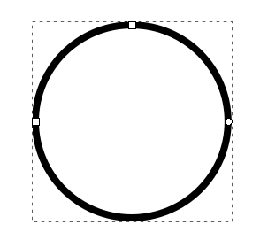

МИНИСТЕРСТВО ОБРАЗОВАНИЯ И НАУКИ РОССИЙСКОЙ ФЕДЕРАЦИИ\
ФЕДЕРАЛЬНОЕ ГОСУДАРСТВЕННОЕ АВТОНОМНОЕ ОБРАЗОВАТЕЛЬНОЕ УЧРЕЖДЕНИЕ
ВЫСШЕГО ОБРАЗОВАНИЯ

«Санкт-Петербургский национальный исследовательский университет
информационных технологий, механики и оптики»

Кафедра информационных систем

Лабораторная работа №5

**Векторная графика. Построение сложных объектов на основе векторных
примитивов.**

> Выполнил студент группы M3105:\
> *Лосицкий Евгений Игоревич*
>
> Проверил:\
> *Иванов Роман Владимирович*

САНКТ-ПЕТЕРБУРГ\
2017

**Задание 1**

Создадим прозрачный круг с толщиной обводки 3**\
**{width="2.097909011373578in"
height="2.0in"}

Создадим ещё один круг с такой же обводкой, вместе с первым выравниваем
его по центру страницы\
{width="2.1948042432195973in"
height="2.2235192475940506in"}

Копируем меньший круг 3 раза, каждый из экземпляров смещаем
(трансформирование -- смещение) на 37 миллиметров**\
**{width="2.4155839895013123in"
height="2.406392169728784in"}

Выделим все круги, применим Контур -- Сумма\
{width="3.5340857392825895in"
height="3.2857141294838144in"}\
**\
**

**Задание 2\
**Создаем окружность с серой заливкой и толщиной обводки 1

{width="2.533674540682415in"
height="2.4155839895013123in"}**\
**Создаем звезду с теми же параметрами\
{width="3.034692694663167in"
height="2.8571423884514435in"}\
Выделяем всё, применяем Контур -- Исключающее ИЛИ\
{width="3.1884930008748906in"
height="3.0in"}

**Задание 3\
**Создаем залитый шестиугольник, толщина заливки -- 3\
{width="2.1942825896762903in"
height="1.9740255905511812in"}\
Создаем шестиконечную звезду, настраиваем Стиль обводки -- Соединение --
Острый\
{width="2.1736909448818897in"
height="1.9610389326334208in"}\
Создаем ещё один шестиугольник, выравниваем всё по центру страницы\
{width="2.2309798775153107in"
height="1.9480522747156606in"}\
Выделяем все, применяем Контур - Исключающее ИЛИ\
{width="2.3116874453193352in"
height="2.049339457567804in"}

**Задание 4\
**Создаем эллипс и два треугольника, с заливкой и толщиной обводки 1.\
Выравниваем по вертикальной оси относительно страницы.\
{width="2.51753280839895in"
height="2.5584416010498687in"}\
Применяем Исключающее ИЛИ для треугольников\
{width="2.935064523184602in"
height="2.8939720034995626in"}\
Для двух получившихся фигур применяем Разность\
{width="3.0909087926509184in"
height="1.9955916447944007in"}

**Задание 5\
**Создаем окружность без заливки, дублируем её и уменьшаем в 2 раза,
дублируем копию. Выравниваем всё по центру относительно страницы.
Размещаем две малые окружности по двум сторонам большой окружности.\
{width="1.9636996937882765in"
height="2.0in"}\
Дублируем и уменьшаем в 2 раза каждую малую окружность\
{width="2.200203412073491in"
height="2.2077930883639545in"}\
Применяем Заливку к нужным областям\
Убираем обводку у одной из окружностей\
{width="2.433973097112861in"
height="2.5064938757655293in"}
