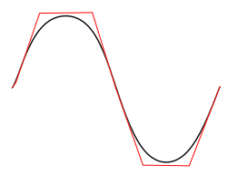
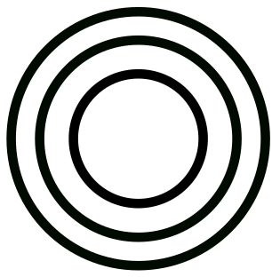
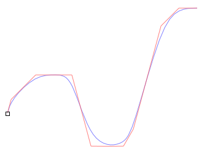
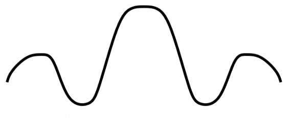

МИНИСТЕРСТВО ОБРАЗОВАНИЯ И НАУКИ РОССИЙСКОЙ ФЕДЕРАЦИИ\
ФЕДЕРАЛЬНОЕ ГОСУДАРСТВЕННОЕ АВТОНОМНОЕ ОБРАЗОВАТЕЛЬНОЕ УЧРЕЖДЕНИЕ
ВЫСШЕГО ОБРАЗОВАНИЯ

«Санкт-Петербургский национальный исследовательский университет
информационных технологий, механики и оптики»

Кафедра информационных систем

Лабораторная работа №6

**Векторная графика. Построение групп перетекания**

> Выполнил студент группы M3105:\
> *Лосицкий Евгений Игоревич*
>
> Проверил:\
> *Иванов Роман Владимирович*

САНКТ-ПЕТЕРБУРГ\
2017

**Задание 1**

Создаем кривую Безье\
{width="1.1421150481189852in"
height="0.8961034558180228in"}

Копируем полученный объект и перемещаем вправо\
{width="3.4245286526684167in"
height="0.778740157480315in"}\
Выделяем обе фигуры и применяем интерполяцию\
{width="3.858490813648294in"
height="0.8487773403324584in"}\
{width="1.9365583989501312in"
height="2.155844269466317in"}

Копируем полученную фигуру 3 раза и располагаем копии друг над другом\
{width="5.898651574803149in"
height="2.6132075678040243in"}

**Задание 2\
**Создаем эллипс\
{width="2.4482753718285215in"
height="0.3828412073490814in"}\
Копируем и поворачиваем на 90 градусов\
{width="1.5139938757655294in"
height="1.5172419072615924in"}\
Применяем интерполяцию\
{width="2.0282753718285216in"
height="2.0517235345581804in"}{width="1.9412740594925635in"
height="2.155171697287839in"}\
Копируем полученную фигуру, поворачиваем на 90 градусов, выравниваем всё
по центру\
{width="3.3834569116360456in"
height="3.226087051618548in"}

**Задание 3\
**Создаем две перпендикулярные прямые\
{width="1.1744181977252843in"
height="0.9917333770778652in"}\
Накладываем их друг на друга\
{width="1.3255818022747157in"
height="1.2866622922134734in"}\
Применяем интерполяцию\
{width="2.5465113735783027in"
height="2.5465113735783027in"}{width="2.2906977252843395in"
height="2.5048097112860894in"}\
Копируем и переворачиваем, выравниваем по центру\
{width="3.232557961504812in"
height="3.070929571303587in"}

**Задание 4\
**Аналогично создаем две пересекающиеся прямые и накладываем их друг на
друга**\
**{width="1.5170548993875765in"
height="1.4767443132108486in"}\
Перед интерполяцией вертикальную прямую переворачиваем\
Применяем интерполяцию**\
**{width="2.616279527559055in"
height="2.6718427384076993in"}{width="2.465115923009624in"
height="2.7183519247594052in"}\
Копируем и переворачиваем копию, располагаем по центру страницы**\
**{width="4.0465277777777775in"
height="3.91875in"}**\
**

**Задание 5\
**Создаем три круга разного размера без заливки с обводкой**\
**{width="1.3632731846019248in"
height="1.348837489063867in"}\
Меняем цвет обводки у крайних окружностей на серый **\
**{width="1.3255818022747157in"
height="1.3402110673665792in"}**\
**Уменьшаем ширину обводки**\
**{width="1.802325021872266in"
height="1.7587478127734033in"}\
Применяем интерполяцию для всех окружностей**\
**{width="4.961883202099737in"
height="2.651162510936133in"}**\
\
**

**Задание 6\
**Создаем кривую Безье с помощью инструмента BSpline**\
**{width="1.3604647856517935in"
height="1.0403543307086613in"}**\
**{width="1.4305621172353455in"
height="1.046512467191601in"}

Копируем и отражаем элемент зеркально, объединяем их**\
**{width="2.5473753280839895in"
height="1.0581397637795276in"}\
Копируем и переворачиваем копию**\
**{width="2.8263943569553804in"
height="2.0465113735783027in"}

Применяем интерполяцию**\
**{width="3.514990157480315in"
height="2.639534120734908in"}{width="2.2325590551181103in"
height="2.469856736657918in"}\
Копируем полученную фигуру и располагаем копию слева от исходной**\
**{width="5.45913167104112in"
height="2.220930664916885in"}**\
**
