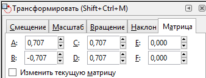

МИНИСТЕРСТВО ОБРАЗОВАНИЯ И НАУКИ РОССИЙСКОЙ ФЕДЕРАЦИИ\
ФЕДЕРАЛЬНОЕ ГОСУДАРСТВЕННОЕ АВТОНОМНОЕ ОБРАЗОВАТЕЛЬНОЕ УЧРЕЖДЕНИЕ
ВЫСШЕГО ОБРАЗОВАНИЯ

«Санкт-Петербургский национальный исследовательский университет
информационных технологий, механики и оптики»

Кафедра информационных систем

Лабораторная работа №7

**Векторная графика. Трансформация векторных объектов. Аффинные
преобразования**

> Выполнил студент группы M3105:\
> *Лосицкий Евгений Игоревич*
>
> Проверил:\
> *Иванов Роман Владимирович*

САНКТ-ПЕТЕРБУРГ\
2017

**Задание 1\
Правая грань**

Масштабирование:\
{width="1.6166666666666667in"
height="1.6218482064741908in"}{width="3.5520833333333335in"
height="1.3958333333333333in"}

Скос:\
{width="1.6612707786526684in"
height="2.4479166666666665in"}{width="3.5520833333333335in"
height="1.4479166666666667in"}\
Сдвиг:\
{width="1.7291666666666667in"
height="1.7291666666666667in"}{width="3.59375in"
height="1.46875in"}\
Результирующая матрица:\
{width="1.6666666666666667in"
height="1.6666666666666667in"}{width="3.5625in"
height="1.4479166666666667in"}\
\
**Верхняя грань**\
Масштабирование:**\
**{width="1.903888888888889in"
height="1.9166666666666667in"}{width="3.6145833333333335in"
height="1.40625in"}\
Скос:\
{width="1.70168416447944in"
height="1.7395833333333333in"}{width="3.5729166666666665in"
height="1.40625in"}\
Сдвиг:\
{width="1.72540791776028in"
height="1.7291666666666667in"}{width="3.5729166666666665in"
height="1.4270833333333333in"}\
Результирующая матрица:\
{width="2.8310400262467192in"
height="2.837209098862642in"}{width="3.5652777777777778in"
height="1.4520833333333334in"}

**Задание 2\
Верхняя грань\
**Поворот:\
{width="1.7093022747156605in"
height="1.9943635170603675in"}{width="3.176537620297463in"
height="1.2093022747156605in"}\
Масштабирование:\
{width="1.7090277777777778in"
height="1.6042497812773404in"}{width="2.7906977252843395in"
height="1.07962489063867in"}

Сдвиг:\
{width="1.8255818022747157in"
height="1.9067629046369203in"}{width="2.9883716097987754in"
height="1.1808027121609799in"}\
Результирующая матрица:\
{width="1.9069761592300962in"
height="1.7289107611548555in"}{width="3.2906977252843395in"
height="1.2704800962379703in"}\
\
**Нижняя левая грань**

Масштабирование:

{width="1.9076257655293087in"
height="1.9166666666666667in"}{width="3.59375in"
height="1.3854166666666667in"}\
Скос:\
{width="1.8905588363954506in"
height="2.3541666666666665in"}{width="3.5729166666666665in"
height="1.375in"}

Результирующая матрица:\
{width="1.8897823709536308in"
height="2.2083333333333335in"}{width="3.5520833333333335in"
height="1.375in"}\
\
**Нижняя правая грань**

Масштабирование:\
{width="1.4856397637795276in"
height="1.71875in"}{width="3.5520833333333335in"
height="1.3854166666666667in"}**\
**Скос:**\
**{width="1.5287423447069117in"
height="1.8125in"}{width="3.5104166666666665in"
height="1.375in"}**\
**Сдвиг:\
{width="1.5060903324584427in"
height="1.9767443132108486in"}{width="3.546527777777778in"
height="1.3486111111111112in"}\
Результирующая матрица:\
{width="2.581395450568679in"
height="2.975939413823272in"}{width="3.546527777777778in"
height="1.4416666666666667in"}
