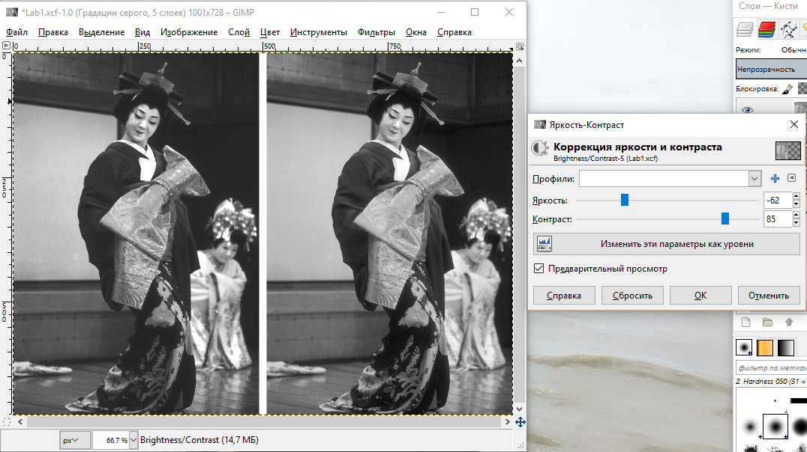
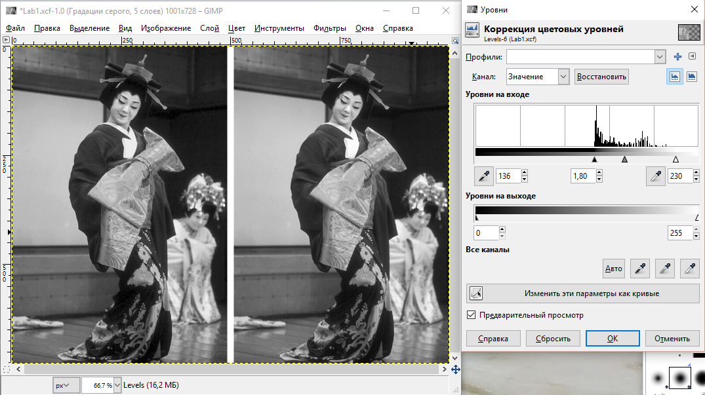
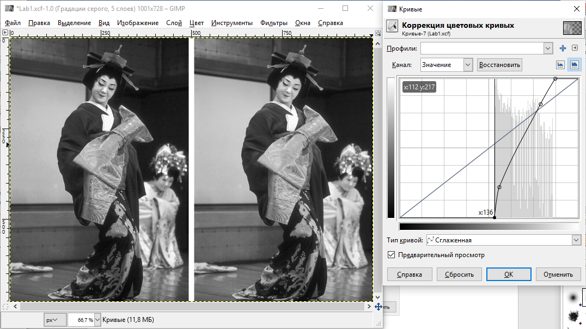

Минимтерство образования и науки Российской федерации\
федеральное государственное автономное образовательное учреждение
высшего образования

«Санкт-Петербургский национальный исследовательский университет\
информационных технологий, механики и оптики»

Факультет информационных технологий и программирования

Кафедра информационных систем

Лабораторная работа № 1

**Цветовые модели. Тоновая коррекция изображения с использованием
уровней и кривых**

> Выполнил студент группы №М3105:\
> Ивницкий Алексей Андреевич
>
> Проверил:\
> Иванов Роман Владимирович

Санкт-Петербург\
2017

**Brightness/Contrast**

{width="6.979166666666667in"
height="3.9166666666666665in"}

**Levels**

{width="6.989583333333333in"
height="3.9166666666666665in"}

**Curves**

{width="6.989583333333333in"
height="3.923520341207349in"}

вЫВОД

-   Brightness/Contrast -- инструмент, который позволяет изменять два
    > параметра: усредненной яркости и контрастности. Только с помощью
    > этих показателей почти невозможно получить исходное изображение.
    > Очевидно, что из всех используемых в лабораторной работе
    > инструментов, этот является наименее функциональным.

-   Levels -- инструмент, в основе которого лежит построение гистограммы
    > яркостей пикселей, где по одной оси лежит значения яркостей, а в
    > соответствии им -- количество точек на изображении, которые имеют
    > такую яркость. Изменять изображение можно с помощью трех
    > параметров: смещение правого бегунка превращает все точки, по
    > правую сторону в белые; смещение вправо левого -- в черный;
    > смещение центрального бегунка позволяет указать, значение яркости
    > каких пикселей нужно принять за 50% яркости и перераспределить
    > яркости пикселей слева и справа от нового положения серого
    > бегунка. Яркости всех остальных точек после изменения положения
    > черного и белого бегунков пересчитываются, чтобы равномерно
    > распределится по новому тоновому диапазону.

-   Curves -- это график функции, отображающий какие значения яркостей
    > пикселей изображения на какие новые значения нужно быть изменены.
    > Исходно график представляет собой прямую линию под углом 45
    > градусов к осям. На этой линии можно смещать произвольные точки
    > изменяя их яркость. Используя данный инструмент можно добиться
    > картинки, идентичной исходной. Так же с помощью него можно
    > реализовать функционал двух предыдущих инструментов.

-   Оценив функционал всех инструментов, можно утверждать, что каждый
    > следующий может в полной мере реализовать предыдущие. Так яркость
    > в первом изменяется «серым» ползунком, а контрастность -- «белым»
    > и «черным». В свою очередь, изменения яркости можно добиться
    > смещением функции вверх/вниз не изменяя угол, а контрастность --
    > перемещая начальную и конечную точки.
