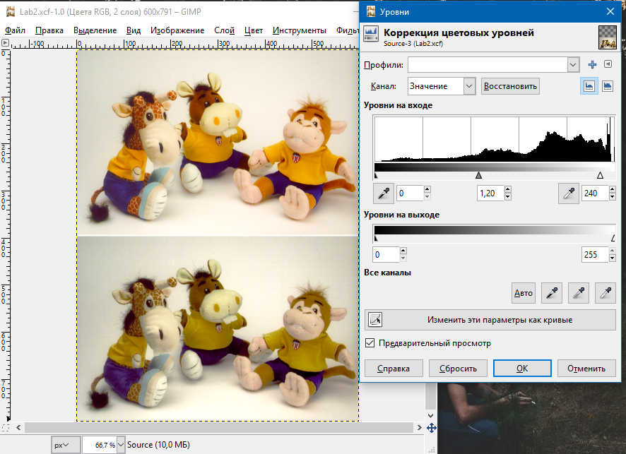
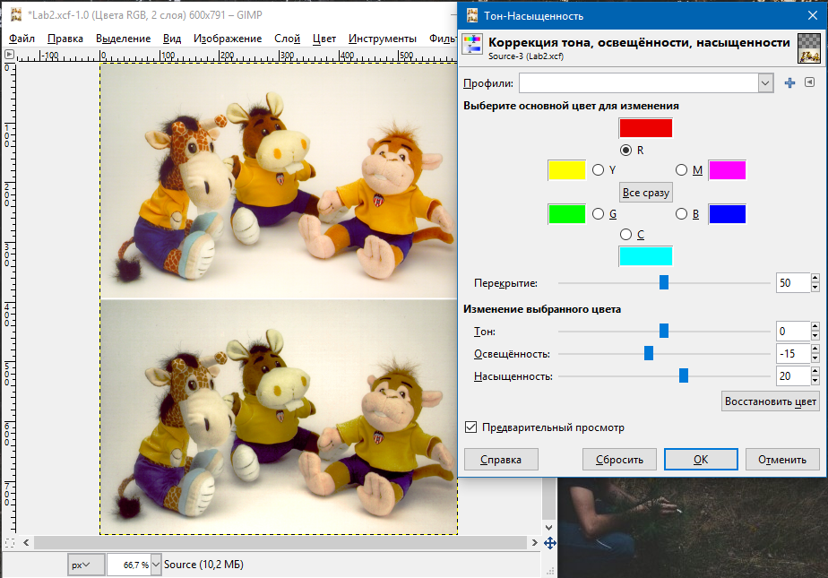
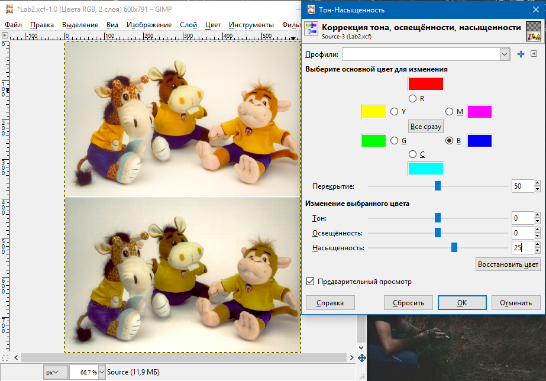
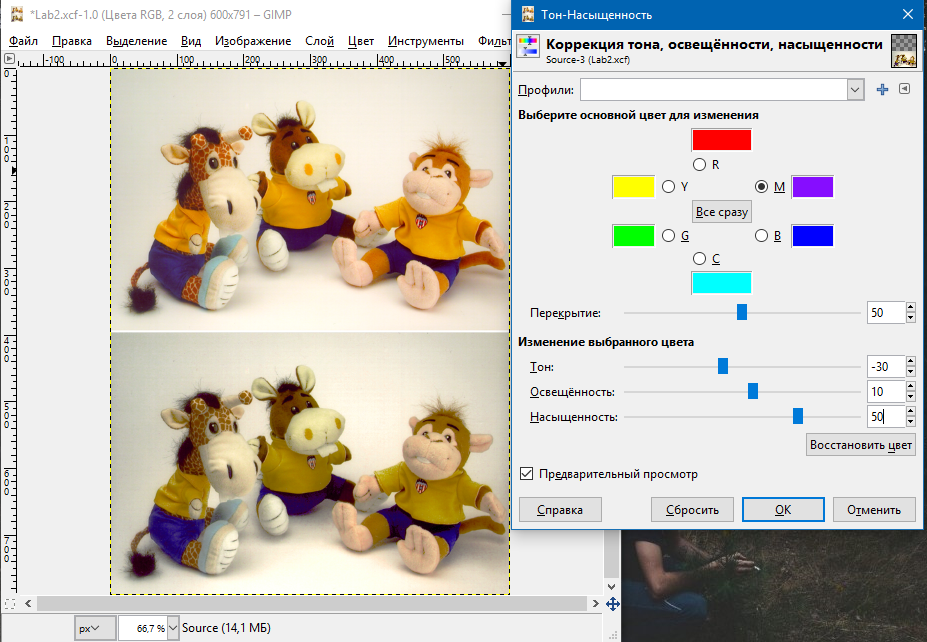
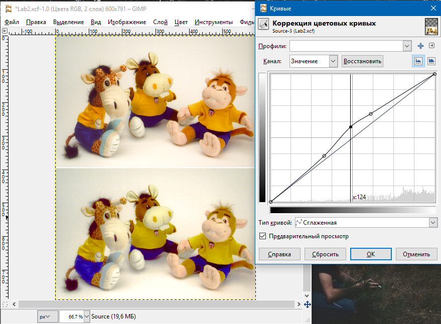
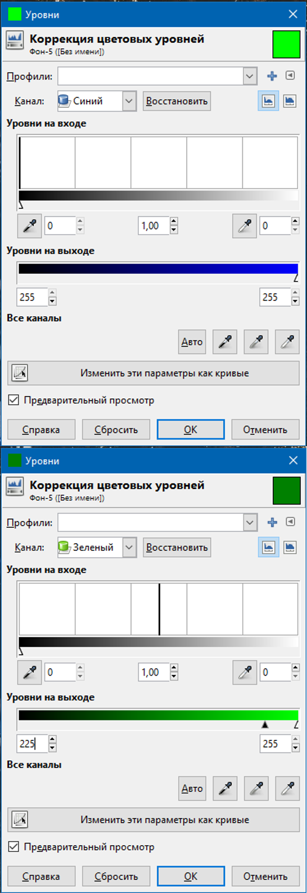
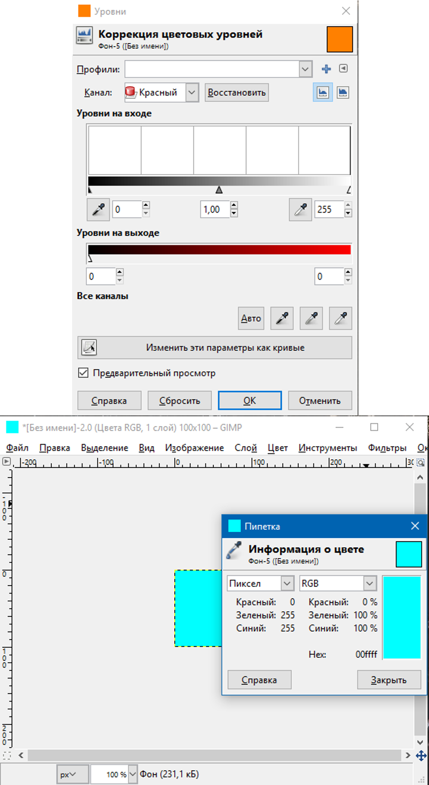
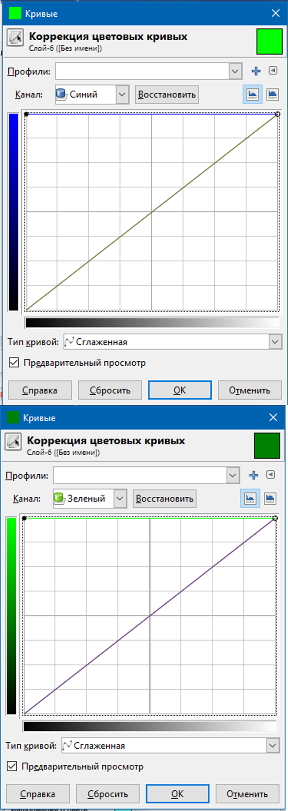
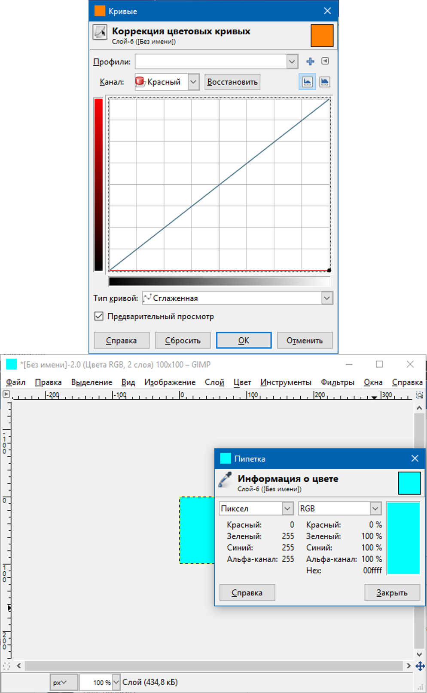
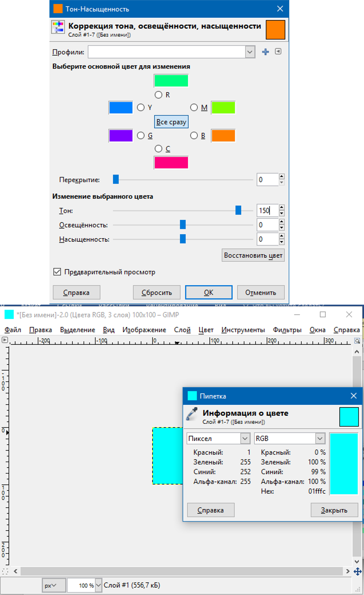

Минимтерство образования и науки Российской федерации\
федеральное государственное автономное образовательное учреждение
высшего образования

«Санкт-Петербургский национальный исследовательский университет\
информационных технологий, механики и оптики»

Факультет информационных технологий и программирования

Кафедра информационных систем

Лабораторная работа № 2

**Цветовые модели. Цветокоррекция с использованием уровней, кривых и HSL
модели**

> Выполнил студент группы №М3105:\
> Ивницкий Алексей Андреевич
>
> Проверил:\
> Иванов Роман Владимирович

Санкт-Петербург\
2017

Задание 2
---------

Уровни{width="6.133333333333334in"
height="4.165662729658792in"}

Коррекция тона (Красный)
{width="6.165277777777778in"
height="4.25in"}

Коррекция тона (Синий)
{width="6.989583333333333in"
height="4.876805555555555in"}

Коррекция тона (фиолетовый)
{width="6.989583333333333in"
height="4.840682414698163in"}

Кривые{width="6.989583333333333in"
height="5.1368274278215225in"}

Задание 3
---------

Уровни:\
{width="3.1683213035870517in"
height="9.235227471566054in"}

{width="5.555940507436571in"
height="10.161424978127734in"}**\
**

Кривые\
{width="3.516117672790901in"
height="9.892656386701661in"}{width="5.205067804024497in"
height="8.449281496062993in"}

Тон-Насыщенность

{width="5.398339895013123in"
height="8.813018372703413in"}

вЫВОД

**Задание 2.**

Данные инструменты можно использовать для цветокоррекции как отдельно,
так и комбинируя в зависимости от поставленной задачи. К примеру, с
помощью уровней и кривых можно добиться изменения общего состояния с
минимальной болью для глаз при этом не нарушая общую цветовую палитру. В
то время как HSL дает возможность скорректировать определенные цвета,
получать результат максимально приближенный к реальности.

К примеру, во втором задании в первую очередь были использованы уровни
чтобы проанализировать светлые и темные участки, которые не сильно
зависят от корректности цвета. Далее был использован HSL в попытке
привести цвета к относительно нормальному виду, а потом уже использована
кривая для исправления яркости на нормальных цветах.

**Задание 3.**

Требовалось получить голубой цвет(\#00ffff). Для этого будем изменять
цвета на выходе для уровней. Красный на 0, синий и зеленый -- на 255.
Для кривых эти операции эквивалентны смещению графика в самую нижнюю и
самую верхнюю точки соответственно. С HSV ситуация сложнее.
Проанализировав цвета, определяем, что исходный задается 30/100/100 в
HSV, а требуемый -- 180/100/100. Попытка добавить 150 к первому
параметру увенчалась успехом.
