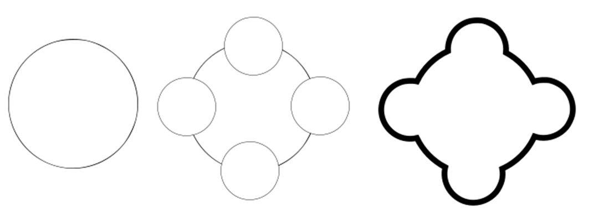
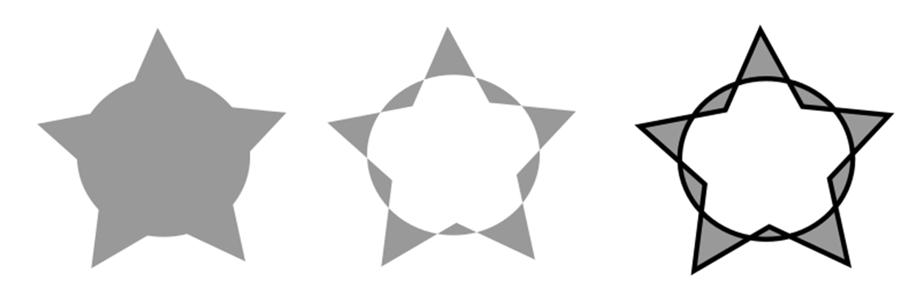
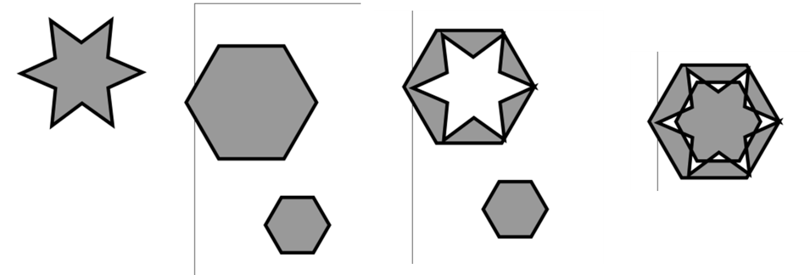
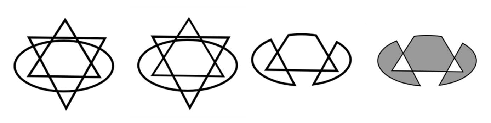
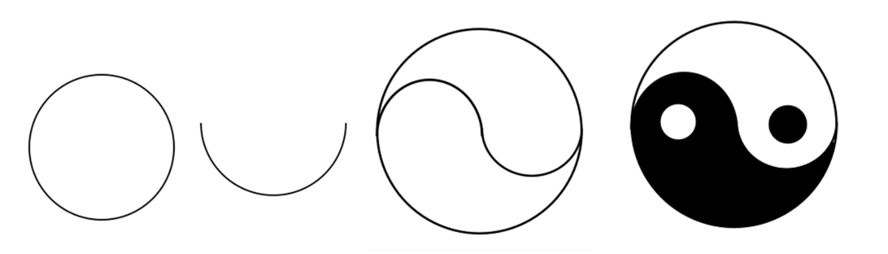

Минимтерство образования и науки Российской федерации\
федеральное государственное автономное образовательное учреждение
высшего образования

«Санкт-Петербургский национальный исследовательский университет\
информационных технологий, механики и оптики»

Факультет информационных технологий и программирования

Кафедра информационных систем

Лабораторная работа № 5

**Векторная графика. Построение сложных объектов на основе векторных
примитивов**

> Выполнил студент группы №М3105:\
> Ивницкий Алексей Андреевич
>
> Проверил:\
> Иванов Роман Владимирович

Санкт-Петербург\
2017

Задание 1
---------

{width="6.25in"
height="2.2857556867891513in"}

1.  Добавляем круг

2.  Добавляем еще 4 круга на исходный

3.  Применить «Сумму» к всем фигурам

4.  Устанавливаем толщину обводки 5 мм

Задание 2
---------

{width="6.2659722222222225in"
height="2.0448643919510063in"}

1.  Добавляем две фигуры: круг и звезду (заливка RGB \#999999)

2.  Применяем к ним «Исключающие ИЛИ».

3.  Устанавливаем толщину обводки 3,265 мм

Задание 3
---------

{width="6.576388888888889in"
height="2.237338145231846in"}

1.  Создаем 3 фигуры: два шестиугольника и шестиугольную звезду (RGB
    \#999999, обводка 3,265 мм)

2.  Применяем к большему шестиугольнику и звезде «Исключающие ИЛИ»

3.  Применяем к получившийся фигуре и меньшему шестиугольнику
    «Исключающее ИЛИ»

Задание 4
---------

{width="6.280807086614173in"
height="1.5796751968503937in"}

1.  Добавляем 3 фигуры: два треугольника и эллипс. (без заливки, обводка
    5 мм)

2.  Применяем к двум треугольника «Исключающее ИЛИ» (что очень трудно
    заметить на скриншоте)

3.  Применяем разность к эллипсу и полученной фигуре разность

4.  Устанавливаем заливку RGB \#999999 и обводкк 3,265 мм

Задание 5
---------

{width="6.3404669728783905in"
height="1.8125in"}

1.  Добавляем круг

2.  Создаем из него полукруг

3.  С помощью одного круга и двух полукругов создаем контур фигуры

4.  Применяем заливку к нижней части фигуры

5.  Добавляем еще два круга -- черный и белый.
