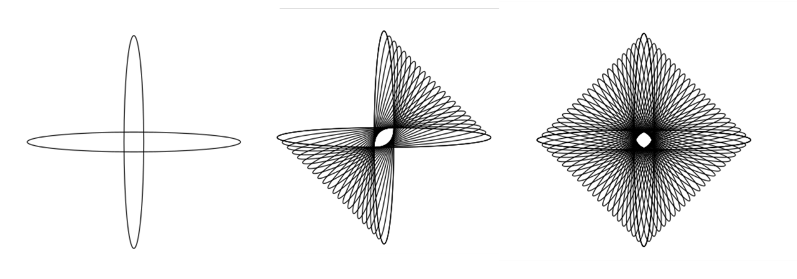

Минимтерство образования и науки Российской федерации\
федеральное государственное автономное образовательное учреждение
высшего образования

«Санкт-Петербургский национальный исследовательский университет\
информационных технологий, механики и оптики»

Факультет информационных технологий и программирования

Кафедра информационных систем

Лабораторная работа № 6

**Векторная графика. Построение групп перетекания**

> Выполнил студент группы №М3105:\
> Ивницкий Алексей Андреевич
>
> Проверил:\
> Иванов Роман Владимирович

Санкт-Петербург\
2017

Задание 1
---------

> {width="5.604166666666667in"
> height="1.010582895888014in"}{width="1.3125in"
> height="1.4931135170603675in"}

1.  Создаем кривую

2.  Копируем ее, делаем для них интерполяцию

3.  Копируем созданные объекты

Задание 2
---------

{width="5.760416666666667in"
height="2.02082895888014in"}

{width="1.65625in"
height="1.8791918197725284in"}

1.  Создаем эллипс, его копию, которую поворачиваем на 90 гардусов.

2.  Интерполируем

3.  Полученную фигуру копируем и поворачиваем.

Задание 3
---------

{width="5.795819116360455in"
height="2.026922572178478in"}

1.  Создаем две перпендикулярные прямые

2.  Интерполируем

3.  Создаем копию, поворачиваем на 180 градусов

Задание 4
---------

{width="6.6343777340332455in"
height="2.3042793088363953in"}

{width="1.7145647419072616in"
height="1.9166666666666667in"}

1.  Создаем две перпендикулярные прямые

2.  Интерполируем

3.  Создаем копию, поворачиваем на 180 градусов

Задание 5
---------

{width="6.0998687664041995in"
height="1.9626082677165355in"}

1.  Создаем круг

2.  Копируем его, изменяя размер

3.  Изменяем цвет обводки новых кругов

4.  Поочередно делаем интерполяцию для центрального и двух остальных

Задание 5
---------

{width="5.767530621172353in"
height="1.3644488188976378in"}

{width="3.5909722222222222in"
height="1.5534667541557305in"}

1.  Создаем кривую

2.  Копируем ее 3 раза, попарно интерполируем верхние и нижние

3.  Копируем созданную фигуру
