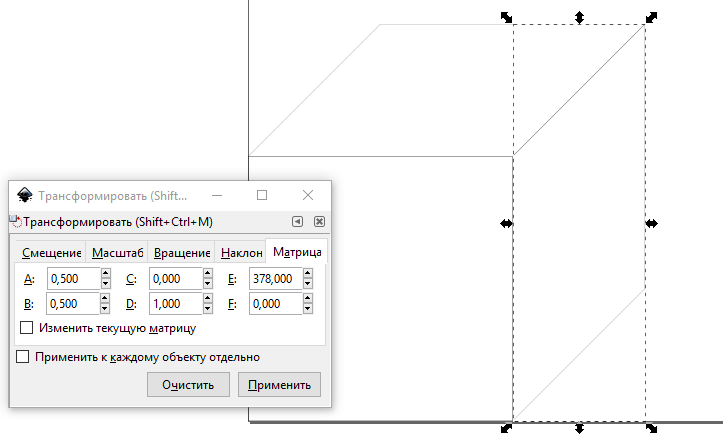

Министерство образования и науки Российской федерации\
федеральное государственное автономное образовательное учреждение
высшего образования

«Санкт-Петербургский национальный исследовательский университет\
информационных технологий, механики и оптики»

Факультет информационных технологий и программирования

Кафедра информационных систем

Лабораторная работа № 7

**Векторная графика. Трансформация векторных объектов. Аффинные
преобразования**

> Выполнил студент группы №М3105:\
> Ивницкий Алексей Андреевич
>
> Проверил:\
> Иванов Роман Владимирович

Санкт-Петербург\
2017

Задание 1
---------

1.  Создаем квадрат\
    {width="2.34375in"
    height="2.130074365704287in"}

2.  Применяем трансформации:

    a.  Изменение масштаба на 50% по вертикали:

  1   0     0
  --- ----- ---
  0   0,5   0

b.  Скос на 45 граусов:

  1   1   0
  --- --- ---
  0   1   0

c.  Перемещение на 100мм (378 пикселей) вверх:

  1   0   0
  --- --- -----
  0   1   378

d.  Результат умножения матриц (в обратном порядке):\
    {width="3.6979166666666665in"
    height="2.540508530183727in"}

  1   0,5   0
  --- ----- -----
  0   0,5   378

3.  {width="4.445833333333334in"
    height="2.6875in"}Схожий алгоритм для второй грани, итоговая
    матрица:

  0,5   0   378
  ----- --- -----
  0,5   1   0

Задание 2
---------

1.  Масштабируем по горизонтали (86%, 100 \* $\cos\frac{\pi}{6}$)

  0.86   0   0
  ------ --- ---
  0      1   0

2.  Делаем скос на 60 градусов (-0.577, $c\text{tg}\frac{\pi}{3})$

  1        0   0
  -------- --- ---
  -0,577   1   0

3.  Делаем сдвиг на 50 мм (378 / 2 = 189 пикселей)

  1   0   0
  --- --- -----
  0   1   189

4.  Перемножаем матрицы

  0,86     0   0
  -------- --- -----
  -0,496   1   189

5.  Результат:\
    \
    {width="6.114444444444445in"
    height="3.9876815398075243in"}

6.  Аналогично делаем для второй грани:

  0,86    0   325
  ------- --- -----
  0,496   1   0

{width="6.48952646544182in"
height="3.497215660542432in"}

Верхняя грань:

1.  Поворот на 45 градусов

  0.7    0.7   0
  ------ ----- ---
  -0.7   0.7   0

2.  Масштабируем (1,22 по х, 0,7 по y)

  1.22   0     0
  ------ ----- ---
  0      0.7   0

3.  Сдвигаем вверх на 567

  1   0   0
  --- --- -----
  0   1   567

4.  Итоговая матрица

  0.854   0.854   0
  ------- ------- -----
  -0.49   0.49    567

{width="6.989583333333333in"
height="4.581688538932633in"}

Задание 2 (без матрицы)
-----------------------

1.  Создаем 3 квадрата\
    {width="2.34375in"
    height="2.130074365704287in"}

2.  Сделаем верхнюю грань. Сначала повернем на 45 градусов\
    {width="5.353741251093613in"
    height="2.7634755030621174in"}

3.  Сжимаем по вертикале\
    {width="5.093069772528434in"
    height="2.422037401574803in"}

4.  Смещаем на место верхней грани\
    {width="5.624296806649169in"
    height="2.79203302712161in"}

5.  Сделаем левую грань. Сжимаем для начала по горизонтали\
    {width="5.374259623797025in"
    height="2.809970472440945in"}

6.  Делаем скос\
    {width="5.8430139982502185in"
    height="3.106732283464567in"}

7.  Смещаем на свое место\
    {width="5.802015529308837in"
    height="3.6242049431321086in"}

8.  Аналогично сделаем для правой грани\
    {width="5.98913167104112in"
    height="3.3949529746281715in"}\
    {width="5.31237532808399in"
    height="3.120449475065617in"}\
    {width="5.477975721784777in"
    height="2.9226290463692037in"}
