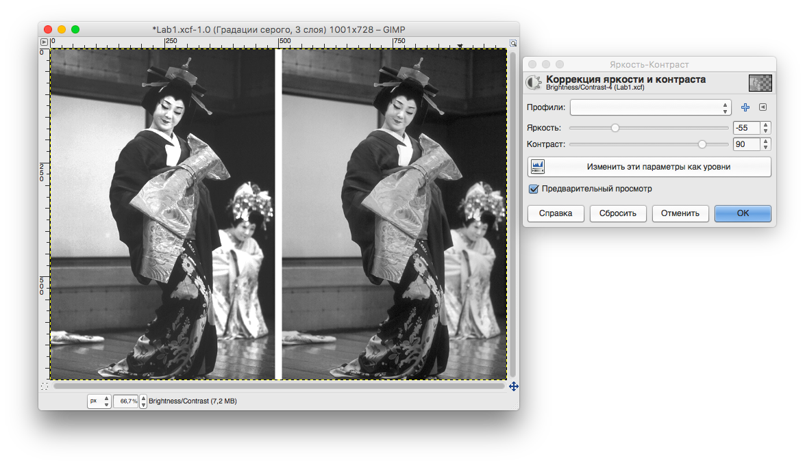
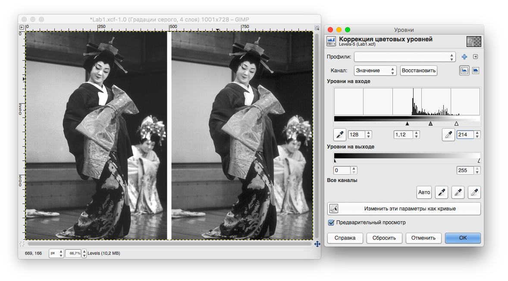
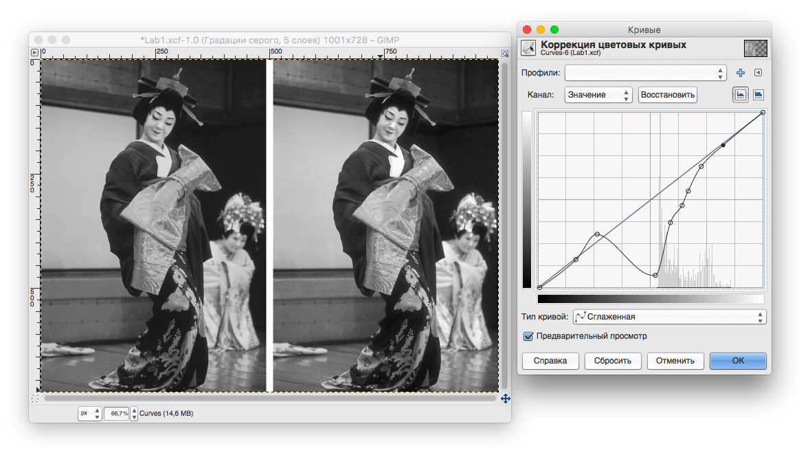

Министерство образования и науки российской федерации\
федеральное государственное автономное образовательное учреждение
высшего образования

«Санкт-Петербургский национальный исследовательский университет
информационных технологий, механики и оптики»

Факультет информационных технологий и программирования

Кафедра информационных систем

Лабораторная работа № 1

Цветовые модели. Тоновая коррекция изображения с использованием уровней
и кривых

Выполнил студент группы № M3105\
Баркалов Максим Максимович

Проверил

Иванов Роман Владимирович

Коррекция через яркость и
контрастность:{width="8.07833442694663in"
height="4.6678401137357834in"}

Коррекция с помощью уровней:

{width="8.499781277340333in"
height="4.722008967629046in"}

Коррекция с помощью кривой:

{width="8.436688538932634in"
height="4.7498840769903765in"}

Вывод:

Для выполнения одной и той же задачи может существовать несколько
инструментов. Очевидно, что различные способы корректировки изображений
будут выдавать не совсем одинаковый результат, а также будут
варьироваться по сложности использования, удобству и применимости для
работы с определёнными задачами, необходимым навыкам конечного
пользователя (иначе зачем нужны все эти инструменты).

При выполнении этой лабораторной работы я ознакомился с такими способами
для корректировки изображений, как "Коррекция яркости и контрастности",
"Коррекция цветовых уровней", "Коррекция цветовых кривых". Поставленная
задача исправления изображения была выполнена каждым из этих способов.

Хотя каждый инструмент позволил приблизить изображение к образцу, каждый
инструмент сделал это с разной точностью. Так как коррекция яркости и
контрастности относительно грубый инструмент, который измеряет
усредненные значения величин, с помощью него удалось добиться наименее
хорошей точности. С другой стороны, этот инструмент очень прост в
использовании и может позволить быстро исправить изображение человеку
без какой-либо подготовки.

Коррекция цветовых уровней дала более точный результат, так как в её
основе лежит пересчет уровней яркости всего изображения для равномерного
распределения яркостей. Инструмент более сложен в использовании.

Самый точный результат мне удалось получить с помощью коррекции цветовой
кривой. Её идея, как и коррекция цветовых уровней, основана на пересчете
яркостей для изображения. Однако, в отличие от уровней, здесь идёт не
равномерный пересчет относительно какого-либо центра, а пересчет в
соответствии с функцией, заданной пользователем. Составить эту функцию
довольно сложно, но и даёт она самый качественный результат. Другими
словами, правка кривых может заменить первые два инструмента, однако не
для каждой задачи нужна точная корректировка цвета, и более грубые
инструменты будут более удобны, а значит и более полезны для конечного
пользователя, которому нужно обработать изображения: они помогут
сэкономить его время и нервы.
