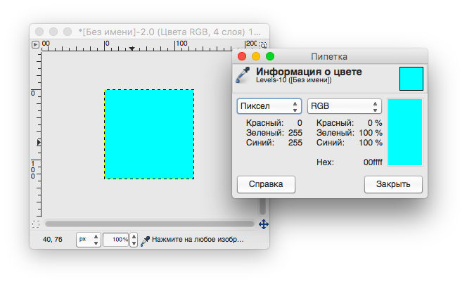
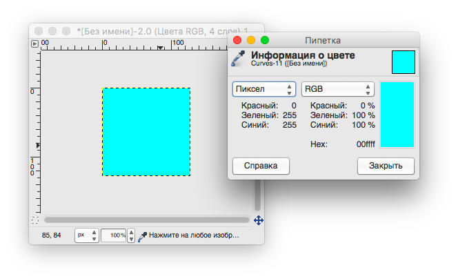

Министерство образования и науки российской федерации\
федеральное государственное автономное образовательное учреждение
высшего образования

«Санкт-Петербургский национальный исследовательский университет
информационных технологий, механики и оптики»

Факультет информационных технологий и программирования

Кафедра информационных систем

Лабораторная работа № 2

Цветовые модели. Цветокоррекция с использованием уровней, кривых и HSL
модели

Выполнил студент группы № M3105\
Баркалов Максим Максимович

Проверил

Иванов Роман Владимирович

Задание 2

Коррекция уровней:

{width="6.969444444444444in"
height="4.430555555555555in"}

Коррекция тона, насыщенности, освещённости:

{width="6.60470363079615in"
height="4.262392825896763in"}

{width="6.9847222222222225in"
height="4.507638888888889in"}{width="6.9847222222222225in"
height="4.507638888888889in"}{width="6.9847222222222225in"
height="4.507638888888889in"}{width="6.9847222222222225in"
height="4.507638888888889in"}

Коррекция цветовых кривых:

{width="6.9847222222222225in"
height="4.784722222222222in"}

Задание 3

Коррекция цветовых уровней:

{width="2.4724234470691164in"
height="3.61252624671916in"}{width="2.55457895888014in"
height="3.612261592300962in"}

{width="2.452448600174978in"
height="3.458660323709536in"}{width="4.465563210848644in"
height="2.714501312335958in"}

Коррекция цветовых кривых:

{width="2.0694805336832895in"
height="2.6554461942257217in"}{width="2.048208661417323in"
height="2.6594860017497814in"}{width="1.9678127734033246in"
height="2.6368055555555556in"}{width="4.58702646544182in"
height="2.789542869641295in"}

Коррекция тона:\
{width="4.091814304461942in"
height="3.017483595800525in"}{width="2.5059536307961503in"
height="3.003127734033246in"}

Вывод:

При выполнении второго пункта этой лабораторной работы я выбрал порядок
действий Уровни -\> Тон, Насыщенность, Освещённость -\> Кривые.

Для начала, с помощью уровней я произвел оптимальную светокоррекцию. В
качестве эталона я сравнивал светлые и тёмные места изображения и
эталонного изображения, так как ориентироваться на цвет довольно
затруднительно, если он неправильный. В дальнейшем это поможет уже при
цветокоррекции.

С помощью корректировки Тона, Насыщенности и Освещённости я исправил
цвета изображения изменением соответствующих значений для каждого
отдельного цвета, при этом используя перекрытие из-за близости некоторых
цветов (для предотвращения появления артефактов).

После этого мною было выполнена финальная корректировка изображения при
помощи кривой. Был окончательно исправлен свет, теперь с ориентированием
на уже скорректированные цвета.

Все эти инструменты можно использовать для проведения цветокоррекции.
Когда проблема с изображением простая можно ограничиться одним
инструментом, например небольшую неточность в оттенке можно исправить с
помощью Тона/Насыщенности/Освещенности, когда больше проблем с
освещением, нежели с оттенками цветов, то это можно поправить с помощью
уровней, или, при более сложной ситуации, с помощью кривой.

Особенности выполнения третьего пункта:

Нам необходимо получить 0 255 255 в RGB, или 180 100 100 в HSV

-   Коррекция цветовых уровней

    -   Для красного "Уровни на выходе" устанавливаем на 0

    -   Для синего и зелёного на 255

-   Коррекция цветовых кривых

    -   Для красного цвета опускаем график вниз

    -   Для синего и зелёного поднимаем наверх

-   Коррекция тона, освещённости, насыщенности

    -   Добавляем к тону 150, так как изначальный цвет имеет 30 100 100
        в HSV
