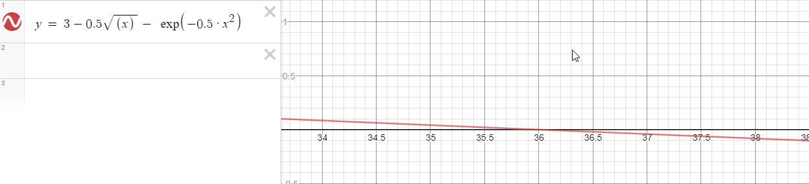

#### Ивницкий Алексей, M3205
## Лабораторная работа №2

Найти $x$ при $f(x) = 3 - 0.5\sqrt{x}-exp(-0.5x^2) = 0$



1. Решение методом половинного деления
```C
for (var i = 0; i < 1000; i++)
{
    var middle = (left + right) / 2;
    if (f(middle) >= 0 && f(left) < (right)
        || f(middle) <= 0 && f(left) > (right))
        right = middle;
    else
        left = middle;
}
return left;
```
Результат = 36.000

2. Решение методом хорд
```C
for (var i = 0; i < 1000; ++i)
{
    var x1 = left;
    var x2 = right;
    var y1 = f(left);
    var y2 = f(right);
    var middle = -y1 / (y2 - y1) * (x2 - x1) + x1;

    if (f(middle) < 0 && f(left) <= 0 || f(middle) > 0 && f(left) >= 0)
        left = middle;
    else right = middle;
}
return right;
```
Результат = 36.000

3. Решение методом касательных
```C
for (var i = 0; i < 1000; i++)
{
    var y = f(point);
    var x = point;
    point = (x * f_sh(x) - y) / f_sh(x);
}

return point;
```
Результат = 36.000