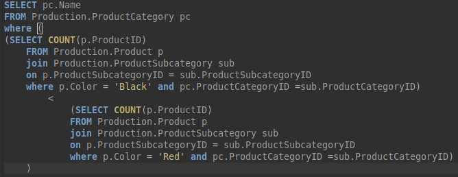

**1.найти название и айдишники продуктов, у которых цвет совпадает с
такими товарами цена на которые была меньше 5000**

```SQL
select [Name], ProductID

from Production.product

where color in

(select Color

from Production.product

where ListPrice < 5000)
```


### Вывести на экран товары и ид у которых цвет совпадает с цветом самого дорогого товара

```SQL
SELECT Name, ProductID

FROM Production.Product

WHERE Color in

(SELECT Top 1 Color

FROM Production.Product

WHERE ListPrice =

(SELECT MAX(ListPrice)

FROM Production.Product))

\-

SELECT Name, ProductID

From Production.Product

Where Color IN

(SELECT Color From Production.Product

Where ListPrice =

(SELECT MAX(ListPrice) From Production.Product))
```

**3.Вывести названия товаров, чей цвет совпадает с цветом одного из
товаров, чья цена меньше 4000**

```SQL
SELECT Name

FROM Production.Product

WHERE Color = ANY

(SELECT Color

FROM Production.Product

WHERE ListPrice < 4000)

\-
```
**4.найти название подкатегории где содержится самый дорогой товар с красным цветом**

```SQL
select Name

from Production.ProductSubcategory

where ProductSubcategoryID in

(select ProductSubcategoryID

from Production.Product

where Color = 'Red' and ListPrice =

(select max(ListPrice)

from Production.Product

where Color = 'Red'))
```

**5.Найти название категории с наибольшим количеством товаров (с подзапросом)**

! сдавала второй вариант Вопышу, он сказал, цитирую: "технически
правильно,

есть до чего докопаться, но, Валерия, решение оригинальное, так что
сойдет". //дешевка вопыша (с другими так не сработает)

яхз какой правильный, вот оба

Вот этот вариант у меня принял

```SQL
select ppc.Name

from Production.ProductCategory as ppc

where ppc.ProductCategoryID = (select top 1 pps.ProductCategoryID

from Production.Product as pp

join Production.ProductSubcategory as pps on pp.ProductSubcategoryID =

pps.ProductSubcategoryID

group by pps.ProductCategoryID

order by count(ProductID) desc)
```
Либо

```SQL
SELECT

pc.Name

FROM

Production.ProductCategory as pc

WHERE

pc.ProductCategoryID =

(SELECT TOP 1

ps.ProductCategoryID

FROM

Production.Product as p

JOIN

Production.ProductSubcategory as ps

ON

p.ProductSubcategoryID = ps.ProductSubcategoryID

GROUP BY

ps.ProductCategoryID

ORDER BY

COUNT(*) DESC)
```
либо

(Вопышу не сдавал, но по идее так)
```SQL
SELECT PC.Name

FROM Production.ProductCategory AS PC

WHERE PC.ProductCategoryID =

(SELECT PSC.ProductCategoryID

FROM Production.ProductSubCategory AS PSC

WHERE PSC.ProductSubcategoryID =

(SELECT TOP 1 P.ProductSubCategoryID

FROM Production.Product AS P

WHERE P.ProductSubcategoryID IS NOT NULL

GROUP BY P.ProductSubcategoryID

ORDER BY COUNT(*) DESC))
```

**6. Название товаров, чей цвет совпадает с товаром, чья цена больше 2000**

```SQL
SELECT name

FROM Production.Product AS P1

WHERE Color IN

(SELECT COLOR

FROM Production.Product as p2

WHERE ListPrice > 2000)
```

**7.Найти номер покупателя и самый дорогой купленный им товар для каждого покупателя**

(Вопышу не сдавал, но по идее так)

```SQL
SELECT SOH.CustomerID, (SELECT MAX(SOD.UnitPrice)

FROM Sales.SalesOrderDetail AS SOD

WHERE SOD.SalesOrderID = SOH.SalesOrderID) AS MaxPrice

FROM Sales.SalesOrderHeader AS SOH
```
Скорее всего так:

```SQL
select

distinct soh.[CustomerID],
(select
MAX(sod1.[UnitPrice])
from
[Sales].SalesOrderDetail as sod1 join
[Sales].SalesOrderHeader as soh1
on
sod1.[SalesOrderID] = soh1.[SalesOrderID]
where
soh1.[CustomerID] = soh.[CustomerID])

from

> [Sales].SalesOrderHeader as soh
```

**8.Самый дорогой товар красного цвета в каждой подкатегории**

```SQL
SELECT

Name

FROM

Production.Product as p

WHERE Color = 'RED' AND ListPrice =

(SELECT

MAX(ListPrice)

FROM

Production.Product as s

WHERE

s.ProductSubcategoryID = p.ProductSubcategoryID)
```
Либо
```SQL
SELECT

(​SELECT​ ​TOP​ ​1

p.Name

​FROM

Production.Product ​as​ p

​JOIN

Production.ProductSubcategory ​as​ ps

​ON

p.ProductSubcategoryID = ps.ProductSubcategoryID

​WHERE

Color = ​'red'

​AND

ps.ProductCategoryID = pc.ProductCategoryID

​ORDER BY

p.ListPrice ​DESC​)

FROM

Production.ProductCategory ​as​ pc
```
Сдала - приняли:
```SQL
select Name from Production.Product as p

where Color = 'RED' AND ListPrice in

(select MAX(ListPrice)

from Production.Product as s

where s.ProductSubcategoryID = p.ProductSubcategoryID and color =
'red')
```

**9.UNSORTED (хз на какой вопрос)**

```SQL
SELECT [Name]

FROM [Production].[ProductSubcategory] AS p3

WHERE [ProductSubcategoryID] IN

(SELECT [ProductSubcategoryID]

FROM [Production].[Product] as p1

WHERE [ListPrice] =

(SELECT MAX([ListPrice])

FROM [Production].[Product]))
```

**10.Найти номера чеков, таких что покупатели, к которым относятся эти
чеки, ходили в магазин более трех раз, т.е. имеют более трех чеков**

```SQL
SELECT​ soh.SalesOrderID

FROM​ Sales.SalesOrderHeader ​as​ soh

WHERE​ soh.CustomerID ​NOT​ ​IN

(

​SELECT​ soh1.CustomerID

​FROM​ Sales.SalesOrderHeader ​as​ soh1

​GROUP BY​ soh1.CustomerID

​HAVING​ COUNT(*) >= ​3

)
```

**11.Найти номера категорий товаров, такие что в них товаров с красным
цветом больше, чем с черным. Решить с помощью подзапроса**

```SQL
SELECT

PC.​Name

FROM

Production.ProductCategory ​AS ​PC

WHERE ​(

SELECT

COUNT( ​ ​ProductID​)

FROM

Production.Product ​AS ​P

JOIN

Production.ProductSubcategory ​AS ​PSC

ON

P.​ProductSubcategoryID ​= PSC.​ProductSubcategoryID
```

Более читаемый синтаксис последнего кода.

{width="6.5in"
height="2.513888888888889in"}


**12.Найти название категории самого продаваемого товара (по количеству
чеков на которые он был продан)**

```SQL
select
[pc1.Name](https://vk.com/away.php?to=http%3A%2F%2Fpc1.Name&cc_key=)
from Production.ProductCategory as pc1

where pc1.ProductCategoryID =

(select top 1 pc.ProductCategoryID from Production.ProductCategory as pc

inner join Production.ProductSubcategory as psc

on psc.ProductCategoryID = pc.ProductCategoryID

inner join Production.Product as p

on p.ProductSubcategoryID = psc.ProductSubcategoryID

inner join Sales.SalesOrderDetail as sod

on sod.ProductID = p.ProductID

inner join Sales.SalesOrderHeader as soh

on soh.SalesOrderID = sod.SalesOrderID

group by pc.ProductCategoryID

order by count(soh.SalesOrderID) desc)
```

### Найти все товары, названия, которые куплены более трех раз, и которые имеют более трех покупателей**

```SQL
SELECT
[p1.name]

FROM
Production.Product as p1
WHERE p1.ProductID IN\
(\
SELECT sod.ProductID
FROM Sales.SalesOrderDetail as sod
JOIN Sales.SalesOrderHeader as soh
ON sod.SalesOrderID = soh.SalesOrderID
GROUP BY sod.ProductID
HAVING COUNT(DISTINCT soh.SalesOrderID) > 3 AND COUNT(DISTINCT
soh.CustomerID) > 3\
)
```

13 Найти название подкатегории с наибольшим количеством товаров (с
подзапросом)

```SQL
SELECT Name

FROM Production.ProductSubcategory

WHERE ProductSubCategoryID = ANY

(SELECT ProductSubcategoryID

FROM Production.Product

GROUP BY ProductSubcategoryID HAVING COUNT(*) =

(SELECT TOP 1 COUNT(ProductSubCategoryID)

FROM Production.Product

GROUP BY ProductSubcategoryID

ORDER BY 1 DESC))
```
Найти название категорий, где есть минимум три товара красного цвета.
Использовать подзапрос.

**Найти номера покупателей покупавших товары минимум двух подкатегорий.
Использовать подзапрос. (Повыш принял)**

```SQL
select​ distinct CustomerID

from​ Sales.SalesOrderHeader

where​ CustomerID ​in (select​ soh1.CustomerID

​from​ Sales.SalesOrderHeader ​as​ SOH1

join Sales.SalesOrderDetail as SOD1

on SOH1.SalesOrderID = SOD1.SalesOrderID

join Production.Product as SOD2

on SOD1.ProductID = SOD2.ProductID

​group by​ SOH1.CustomerID

​having​ count (SOD2.ProductSubcategoryID) >= ​2

)
```

**Найти номер покупателя и чек с наибольшим количеством товаров (по
наименованию) для каждого покупателя**
```SQL
SELECT

A.CustomerID, A.SalesOrderID

FROM

Sales.SalesOrderHeader AS A

WHERE

SalesOrderID in

(

SELECT TOP 1

C.SalesOrderID

FROM

Sales.SalesOrderDetail AS B

join Sales.SalesOrderHeader as C on B.SalesOrderID = C.SalesOrderID

WHERE

A.CustomerID = C.CustomerID

GROUP BY

CustomerID, C.SalesOrderID

order by count(C.SalesOrderID) desc

)
```