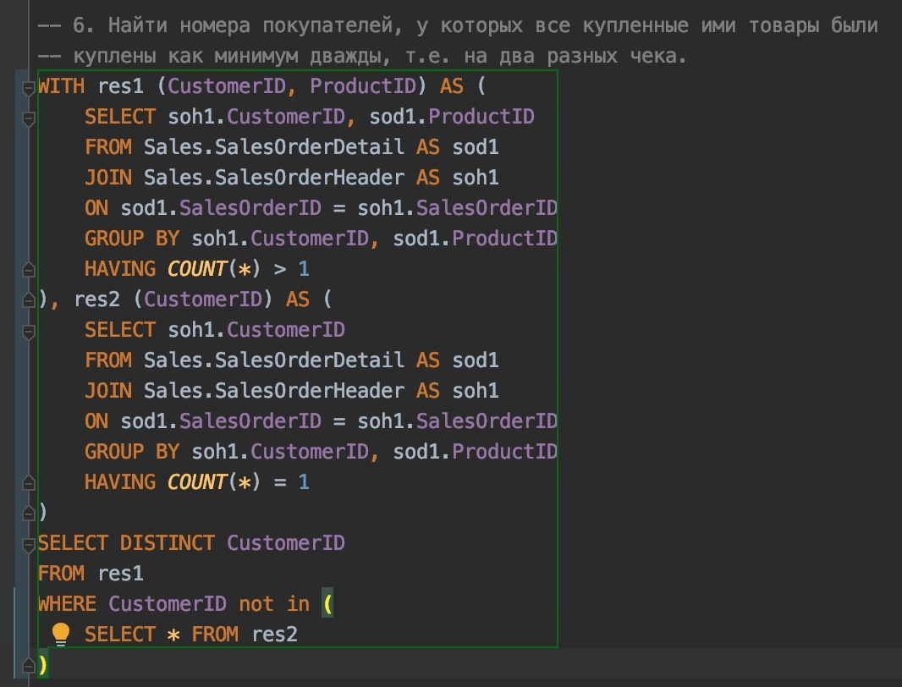
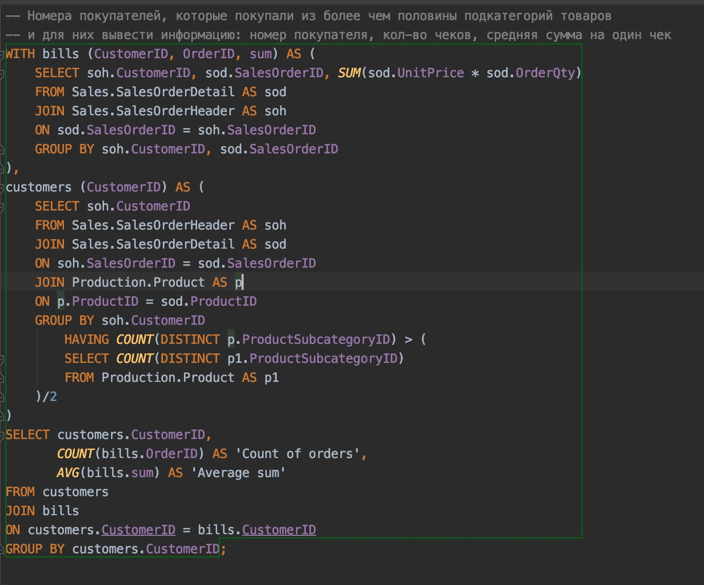

#### **Вывести на экран, для каждого продукта, количество его продаж, и соотношение числа покупателей этого продукта, к числу покупателей, купивших товары из категории, к которой относится данный товар (2 запроса) (НЕ ПОВЫШ)**

```SQL
select [t1.cn],
(t2.c * 100 / (t3.c)) as cust\
from\
(select COUNT(ProductID) as cn\
from [Sales].[SalesOrderDetail]\
group by SalesOrderID) t1,\
(select COUNT(soh.CustomerID) as c\
from [Sales].[SalesOrderHeader] as\
soh join\
[Sales].[SalesOrderDetail] as sod on sod.SalesOrderID =
soh.SalesOrderID\
group by sod.ProductID) t2,\
(select COUNT(soh.CustomerID) as c\
from [Sales].[SalesOrderHeader] as soh join\
[Sales].[SalesOrderDetail] as sod\
on sod.SalesOrderID = soh.SalesOrderID\
join [Production].[Product] as P\
on sod.ProductID = P.ProductID\
join [Production].[ProductSubcategory] as psc\
on P.ProductSubcategoryID = psc.ProductSubcategoryID\
group by psc.ProductCategoryID) t3
```

**Второй вариант(ПОВЫШ ПРИНЯЛ)**:

```SQL
select p1.ProductID, p1.c1, p10.c3 / p2.c2
from (
select p4.ProductID, p8.ProductCategoryID, count(*) as c1
from Sales.SalesOrderHeader as p3 join
Sales.SalesOrderDetail as p4
on p3.SalesOrderID = p4.SalesOrderID join
Production.Product as p7
on p4.ProductID = p7.ProductID join
Production.ProductSubcategory as p8
on p7.ProductSubcategoryID = p8.ProductSubcategoryID
group by p4.ProductID, p8.ProductCategoryID
) as p1 join
(
select p6.ProductID, count(distinct p5.CustomerID) as c2
from Sales.SalesOrderHeader as p5 join
Sales.SalesOrderDetail as p6
on p5.SalesOrderID = p6.SalesOrderID
group by p6.ProductID
) as p2
on p1.ProductID = p2.ProductID join
(
select p8.ProductCategoryID, count(distinct p5.CustomerID) as c3
from Sales.SalesOrderHeader as p5 join
Sales.SalesOrderDetail as p6
on p5.SalesOrderID = p6.SalesOrderID join
Production.Product as p7
on p6.ProductID = p7.ProductID join
Production.ProductSubcategory as p8
on p7.ProductSubcategoryID = p8.ProductSubcategoryID
group by p8.ProductCategoryID
) as p10
on p1.ProductCategoryID = p10.ProductCategoryID
```

**Третий вариант(ПОВЫШ):**

```SQL
with

tmp1(pid, sc) as(select ProductID, count(SalesOrderID) SalesCount from

Sales.SalesOrderDetail group by ProductID),

tmp2(cid, pc1) as (select pps.ProductCategoryID, count(distinct
soh.SalesPersonID) PersonsCount

from Sales.SalesOrderDetail sod

left join Sales.SalesOrderHeader soh on soh.SalesOrderID =
sod.SalesOrderID and soh.SalesPersonID is not NULL

left join Production.Product pp on pp.ProductID = sod.ProductID

left join Production.ProductSubcategory pps on pps.ProductSubcategoryID
= pp.ProductSubcategoryID

left join Production.ProductCategory ppc on ppc.ProductCategoryID =
pps.ProductCategoryID

group by pps.ProductCategoryID),

tmp3(pid, pc2) as

(select sod.ProductID, count(distinct soh.SalesPersonID)

from Sales.SalesOrderDetail sod

left join Sales.SalesOrderHeader soh on soh.SalesOrderID =
sod.SalesOrderID

where soh.SalesPersonID is not null

group by sod.ProductID),

tmp4(pid, cid) as

(select pp.ProductID, pps.ProductCategoryID

from Production.Product pp

left join Production.ProductSubcategory pps on pps.ProductSubcategoryID
= pp.ProductSubcategoryID

left join Production.ProductCategory ppc on ppc.ProductCategoryID =
pps.ProductCategoryID

where pps.ProductCategoryID is not null)

select pp.ProductID, tmp1.sc, round(100 * cast(tmp3.pc2 as float) /
cast(tmp2.pc1 as float), 2) perc

from Production.Product pp

left join tmp1 on pp.ProductID = tmp1.pid

left join tmp3 on pp.ProductID = tmp3.pid

left join tmp4 on pp.ProductID = tmp4.pid

left join tmp2 on tmp2.cid = tmp4.cid

where sc is not null;
```

### Найти всех покупателей, их номера, для которых верно утверждение - они ни разу не покупали товары более чем из трёх подкатегорий на один чек. Для данных покупателей вывести следующую информацию: номер покупателя, номер чека, количество подкатегорий к которым относятся товары данного чека, и количество подкатегорий, из которых покупатель приобретал товары за все покупки

```SQL
 select p1.CustomerID, p1.SalesOrderID, p1.c1, p2.c2

 from (

 select p3.CustomerID, p3.SalesOrderID, count(distinct
 p7.ProductSubcategoryID) as c1

 from Sales.SalesOrderHeader as p3 join

 Sales.SalesOrderDetail as p4

 on p3.SalesOrderID = p4.SalesOrderID join

 Production.Product as p7

 on p4.ProductID = p7.ProductID

 group by p3.CustomerID, p3.SalesOrderID

 having count(distinct p7.ProductSubcategoryID) \<= 3

 ) as p1 left join(

 select p3.CustomerID, count(distinct p7.ProductSubcategoryID) as c2

 from Sales.SalesOrderHeader as p3 join

 Sales.SalesOrderDetail as p4

 on p3.SalesOrderID = p4.SalesOrderID join

 Production.Product as p7

 on p4.ProductID = p7.ProductID

 group by p3.CustomerID

 ) as p2

 on p2.CustomerID = p1.CustomerID

 where p2.CustomerID is not null
```
 вариант 2
```SQL
select t1.CustomerID, t1.SalesOrderID, t1.cnt

from (

select CustomerID, sod.SalesOrderID, count (distinct
psc.ProductSubcategoryID) as cnt

from Sales.SalesOrderHeader as soh

join Sales.SalesOrderDetail as sod

on sod.SalesOrderID = soh.SalesOrderID

join Production.Product as p

on p.ProductID = sod.ProductID

join Production.ProductSubcategory as psc

on psc.ProductSubcategoryID = p.ProductSubcategoryID

group by soh.CustomerID, sod.SalesOrderID

having count (distinct psc.ProductSubcategoryID) \<= 3

) as t1 left join(

select soh.CustomerID, count(distinct p.ProductSubcategoryID) as cnt2

from Sales.SalesOrderDetail as sod

join Sales.SalesOrderHeader as soh

on sod.SalesOrderID = soh.SalesOrderID

join Production.Product as p

on sod.ProductID = p.ProductID

group by soh.CustomerID

) as t2

on t2.CustomerID = t1.CustomerID

where t2.CustomerID is not null
```

### Вывести на экран следующую информацию: название товара, название категории к которой он относится и общее количество товаров в этой категории

//!!! Повыш поругался на Full join, должно быть 32 ответа а вывело
больше

```SQL
select t1.Product, t1.Category, t2.Amount

from

(select p.Name as Product, pc.Name as Category

from Production.Product as p

full join Production.ProductSubcategory as psc

on p.ProductSubcategoryID = psc.productSubcategoryID

full join production.ProductCategory as pc

on psc.ProductCategoryID = pc.ProductCategoryID

where p.Name is not null) as t1

full join

(select pc.Name as Category, count(distinct p.Name) as Amount

from Production.Product as p

full join Production.ProductSubcategory as psc

on p.ProductSubcategoryID = psc.productSubcategoryID

full join production.ProductCategory as pc

on psc.ProductCategoryID = pc.ProductCategoryID

group by pc.Name) as t2

on t1.Category = t2.Category

where t1.Product is not null

order by t2.Amount desc
```

```SQL
with

ProductsPerCategory (CategoryID, Amount)

AS

(

SELECT psc.ProductCategoryID, COUNT(*)

FROM Production.ProductSubcategory AS psc

JOIN Production.Product AS p

ON p.ProductSubcategoryID = psc.ProductSubcategoryID

WHERE p.ProductSubcategoryID IS NOT NULL AND psc.ProductCategoryID IS
NOT NULL

GROUP BY psc.ProductCategoryID

)

SELECT p.Name AS ProductName, pc.Name AS SubCategory,
ProductsPerCategory.Amount AS ProductsInCategory

FROM Production.Product AS p

JOIN Production.ProductSubcategory AS psc

ON p.ProductSubcategoryID = psc.ProductSubcategoryID

JOIN Production.ProductCategory AS pc

ON psc.ProductCategoryID = pc.ProductCategoryID

JOIN ProductsPerCategory

ON ProductsPerCategory.CategoryID = pc.ProductCategoryID
```

```SQL
with

pair_product_cat(n, cat)

as

(

select pp.Name as n, ppc.ProductCategoryID as cat

from Production.Product as pp join

Production.ProductSubcategory as pps on

pp.ProductSubcategoryID = pps.ProductSubcategoryID join

Production.ProductCategory as ppc on

pps.ProductCategoryID = ppc.ProductCategoryID

),

pair_categoty_quantity(cat, qnt)

as

(

select ppc.ProductCategoryID as cat, count(pp.ProductID) as qnt

from Production.ProductCategory as ppc join

Production.ProductSubcategory as pps on

ppc.ProductCategoryID = pps.ProductCategoryID join

Production.Product as pp on

pp.ProductSubcategoryID = pps.ProductSubcategoryID

group by ppc.ProductCategoryID

)

select distinct ppc_.n, ppc_.cat, pcq_.qnt

from pair_product_cat as ppc_ join

pair_categoty_quantity as pcq_ on

ppc_.cat = pcq_.cat

order by ppc_.cat
```

### Вывести на экран номера покупателей, количество купленных ими товаров, и количество чеков, которые у них были

```SQL
with irun(CustomerId, ProductID)\--делаем выборку(табличку) номер
покупателя и номер продукта

as

(

select CustomerId, ProductID

from Sales.SalesOrderHeader as p inner join Sales.SalesOrderDetail as ps

on p.SalesOrderID = ps.SalesOrderID

)

, shar (CustomerId, SalesOrderID)\--номер покупателя и номер чека для
него

as

(

select CustomerId, SalesOrderID

from Sales.SalesOrderHeader

)

, otv1 ( CustomerId, conProductID)\--считаем количество количество
товаров

as(

select CustomerId, count(distinct ProductID)

from irun

group by CustomerId

)

, otv2 ( CustomerId, conSalesOrderID)\--считаем количество чеков

as(

select CustomerId, count(distinct SalesOrderID)

from shar

group by CustomerId

)

select t1.CustomerId, conProductID, conSalesOrderID

from otv1 as t1 inner join otv2 as t2

on t1.CustomerId = t2.CustomerId
```

### Найти номера покупателей, у которых все купленные ими товары были куплены как минимум дважды, т.е на два разных чека

{width="6.270833333333333in"
height="4.777777777777778in"}

### Найти номера покупателей, которые покупали товары из более чем половины подкатегорий товаров, и для них вывести информацию: номер покупателя, количество чеков, средняя сумма на один чек.

```SQL
with

t1(CustomerId, SalesOrderID, ProductID)

as(

select CustomerId, p.SalesOrderID, ProductID

from Sales.SalesOrderHeader as p inner join Sales.SalesOrderDetail as ps

on p.SalesOrderID = ps.SalesOrderID),

t2(SalesOrderID, ListPrice)

as(

select SalesOrderID, sum(ListPrice)

from t1 as pt inner join Production.Product as pp

on pt.ProductID = pp.ProductID

group by SalesOrderID),

t0(CustomerId, conSalesOrderID)

as(

select CustomerId, count(SalesOrderID)

from t1

group by CustomerId),

t(CustomerId, conSalesOrderID, avgPrise)

as(

select k.CustomerId, conSalesOrderID, sum(ListPrice)

from t0 as k inner join t1 as d

on k.CustomerId = d.CustomerId inner join t2 as r

on d.SalesOrderID = r.SalesOrderID

group by grouping sets (k.CustomerId, conSalesOrderID)),

subc(CustomerId, ProductSubcategoryID)

as(

select CustomerID, count(distinct ProductSubcategoryID)

from t1 inner join Production.Product as pp

on t1.ProductID = pp.ProductID w

group by CustomerID)

select CustomerId, conSalesOrderID, avgPrise/conSalesOrderID as 'avg'

from t

where CustomerId =any (select CustomerId from subc

where ProductSubcategoryID \< 3)
```

#### Найти для каждого товара соотношение количества покупателей купивших товар к общему количеству покупателей совершавших когда-либо покупки]

```SQL
with tmp(ProductID, c)

as

(

select productid, *count*(distinct CustomerID)

from Sales.SalesOrderDetail as sod

> join Sales.SalesOrderHeader as soh on sod.SalesOrderID =
> soh.SalesOrderID

group by ProductID

)

select tmp.ProductID,

*cast*(tmp.c as float) /

(select *count*(distinct customerid)

from Sales.SalesOrderHeader

where CustomerID is not null)

from tmp

WITH

OneProduct (Product, Customer) AS

(

SELECT SOD.ProductID as Product, COUNT(DISTINCT CustomerID)

FROM Sales.SalesOrderDetail AS SOD

JOIN Sales.SalesOrderHeader AS SOH

ON SOD.SalesOrderId = SOH.SalesOrderId

GROUP BY ProductID

),

AllProducts (CustomerNumber) AS

(

SELECT COUNT(DISTINCT CustomerID)

FROM Sales.SalesOrderHeader

)

SELECT

OneProduct.Product, (CAST (Customer AS real) /

(

SELECT CustomerNumber

FROM AllProducts

)) AS \"Ratio\"
```

{width="5.538880139982502in"
height="4.567708880139983in"}

### Вывести на экран, для каждого продукта, количество его продаж, и соотношение числа покупателей этого продукта, к числу покупателей, купивших товары из категории, к которой относится данный товар

### Номера покупателей, кол-во категорий товаров которые их купили больше половины и для них вывести количество чеков, номер покупателя и сумму чека.

```SQL
with

CustomerBillCount(CustomerID, BillCount) as

(select s.CustomerID, count(*)

from AdventureWorks2017.Sales.SalesOrderHeader as s

group by s.CustomerID

having count(*) \> (select count(*) / 2

from AdventureWorks2017.Production.ProductCategory)),

CustomerBillSum(CustomerID, BillSum) as

(select c.CustomerID, avg(s.SubTotal)

from AdventureWorks2017.Sales.SalesOrderHeader as s

join AdventureWorks2017.Sales.Customer as c

on s.CustomerID = c.CustomerID

group by c.CustomerID

having count(*) \> (select count(*) / 2

from AdventureWorks2017.Production.ProductCategory))

select sh.CustomerID, BillCount, BillSum

from

(select CustomerBillCount.CustomerID, BillCount, BillSum

from CustomerBillCount

join CustomerBillSum on

CustomerBillCount.CustomerID = CustomerBillSum.CustomerID) as tmp

join AdventureWorks2017.Sales.SalesOrderHeader on

AdventureWorks2017.Sales.SalesOrderHeader.CustomerID = tmp.CustomerID,

AdventureWorks2017.Sales.SalesOrderHeader as sh

join AdventureWorks2017.Sales.SalesOrderDetail as sd

on sh.SalesOrderID = sd.SalesOrderID

join AdventureWorks2017.Production.Product as p

on sd.ProductID = p.ProductID

join AdventureWorks2017.Production.ProductSubcategory as subCat

on p.ProductSubcategoryID = subCat.ProductSubcategoryID

join AdventureWorks2017.Production.ProductCategory as cat

on subCat.ProductCategoryID = cat.ProductCategoryID
```

// Другое решение (Маятин принял)

### Вывести на экран следующую информацию: название товара, название категории к которой он относится, общее количество товаров в этой категории количество покупателей данного товара.

```SQL
WITH Category(ProductCategoryID, Cnt) AS

(

SELECT

s.ProductCategoryID,

COUNT(*) AS Cnt

FROM

Production.ProductSubcategory AS s

JOIN

Production.Product AS p

ON

s.ProductSubcategoryID = s.ProductSubcategoryID

GROUP BY

s.ProductCategoryID

), Customer(ProductId, Cnt) AS

(

SELECT

sod.ProductID, COUNT(DISTINCT soh.CustomerID) AS Cnt

FROM

Sales.SalesOrderDetail AS sod

JOIN

Sales.SalesOrderHeader AS soh

ON

sod.SalesOrderId = soh.SalesOrderID

GROUP BY

sod.ProductID

)

SELECT

[p.Name](https://vk.com/away.php?utf=1&to=http%3A%2F%2Fp.Name),

Category.Cnt as [Category products count],

Customer.Cnt as [Customers count]

FROM

Production.Product AS p

JOIN

Production.ProductSubcategory AS s

ON

p.ProductSubcategoryID = s.ProductSubcategoryID

JOIN

Production.ProductCategory AS c

ON

s.ProductCategoryID = c.ProductCategoryID

JOIN

Category

ON

c.ProductCategoryID = Category.ProductCategoryID

LEFT JOIN

Customer

ON

p.ProductID = Customer.ProductId
```

### Найти для каждого товара соотношение количества покупателей купивших товар к общему количеству покупателей совершавших когда-либо покупки]{.underline}**

```SQL
with rto(answ) as(

select cast(count(distinct soh.CustomerID) as float) as Result

from Sales.SalesOrderHeader as soh

)

select p.Name,((

select count(distinct soh.CustomerID)

from Sales.SalesOrderDetail as sod

join Sales.SalesOrderHeader as soh

on sod.SalesOrderID = soh.SalesOrderID

where sod.ProductID = p.ProductID

) / rto.answ) as Ratio

from Production.Product as p,
```

```SQL
with t(prod, num) as

(select sod.ProductID, count(distinct soh.CustomerID)

from Sales.SalesOrderDetail as sod join

Sales.SalesOrderHeader as soh

on sod.SalesOrderID=soh.SalesOrderID

group by sod.ProductID)

select cast(t.num as float)/

(select count(distinct soh.CustomerID)

from Sales.SalesOrderHeader as soh)

from t
```

### Найти для каждого чека вывести его номер, количество категорий и подкатегорий, товары из которых есть в чеке]{.underline}**

```SQL
SELECT t1.SalesOrderID AS 'Номер чека', t1.cps AS 'Количество
подкатегорий', t1.cpc AS 'Количество категорий'

FROM (

SELECT sod.SalesOrderID, *COUNT*(DISTINCT ps.ProductSubcategoryID) AS
cps, *COUNT*(DISTINCT ps.ProductCategoryID) AS cpc

FROM Sales.SalesOrderDetail AS sod

JOIN Production.Product AS p

ON p.ProductID = sod.ProductID

JOIN Production.ProductSubcategory AS ps

ON p.ProductSubcategoryID = ps.ProductSubcategoryID

GROUP BY SalesOrderID

) AS t1

ORDER BY SalesOrderID
```

### Найти номера покупателей, которые покупали товары из более чем половины подкатегорий товаров, и для них вывести информацию: номер покупателя, количество чеков, средняя сумма на один чек

```SQL
with CustCat(CustomerID, NUm) as

(select soh.CustomerID, count(distinct psc.ProductSubcategoryID)

from Sales.SalesOrderHeader as soh join

Sales.SalesOrderDetail as sod

on sod.SalesOrderID = soh.SalesOrderID

join Production.Product as p

on sod.ProductID = p.ProductID join

Production.ProductSubcategory as psc

on psc.ProductSubcategoryID = p.ProductSubcategoryID

group by soh.CustomerID),

CustOrder(CustomerID, Num) as

(select soh.CustomerID, count(distinct soh.SalesOrderID)

from Sales.SalesOrderHeader as soh

group by soh.CustomerID),

OrderAvg(CustomerID, avgp) as

(select soh.CustomerID, avg(soh.TotalDue)

from Sales.SalesOrderHeader as soh

group by soh.CustomerID)

select cc.CusomerID, co.Num, oa.avgp

from CustCat as cc join CustOrder as co

on cc.CusomerID = co.CustomerID join

OrderAvg as oa on

oa.CustomerID = co.CustomerID

where cc.Num \> (select count(ProductCategoryID)/2 from
Production.ProductCategory)
```
### Найти для каждого чека количество категорий и подкатегорий товаров, которые встречаются в этом чеке]{.underline}**

```SQL
WITH Products_INFO

(Product, SubCategory, Category)

AS

(

SELECT P.ProductID AS Product, PSC.ProductSubcategoryID AS SubCategory,
PSC.ProductCategoryID AS Category

FROM [Production].[Product] AS P

JOIN [Production].[ProductSubcategory] AS PSC

ON P.ProductSubcategoryID = PSC.ProductSubcategoryID

)

SELECT SOD.SalesOrderID, COUNT(DISTINCT P1.SubCategory) AS
Count_SubCategory, COUNT(DISTINCT P1.Category) AS Count_Category

FROM [Sales].[SalesOrderDetail] AS SOD

JOIN Products_INFO AS P1

ON SOD.ProductID = P1.Product

GROUP BY SOD.SalesOrderID
```

### Найти всех покупателей, их номера, для которых верно утверждение --- они ни разу не покупали товары более чем из трёх подкатегорий на один чек. Для данных покупателей вывести следующую информацию: номер покупателя, номер чека, количество подкатегорий к которым относятся товары данного чека, и количество подкатегорий, из которых покупатель приобретал товары за все покупки

```SQL
select t1.CustomerID, t1.SalesOrderID, t1.cnt

from (

select CustomerID, sod.SalesOrderID, count (distinct
psc.ProductSubcategoryID) as cnt

from Sales.SalesOrderHeader as soh

join Sales.SalesOrderDetail as sod

on sod.SalesOrderID = soh.SalesOrderID

join Production.Product as p

on p.ProductID = sod.ProductID

join Production.ProductSubcategory as psc

on psc.ProductSubcategoryID = p.ProductSubcategoryID

group by soh.CustomerID, sod.SalesOrderID

having count (distinct psc.ProductSubcategoryID) \<= 3

) as t1 left join(

select soh.CustomerID, count(distinct p.ProductSubcategoryID) as cnt2

from Sales.SalesOrderDetail as sod

join Sales.SalesOrderHeader as soh

on sod.SalesOrderID = soh.SalesOrderID

join Production.Product as p

on sod.ProductID = p.ProductID

group by soh.CustomerID

) as t2

on t2.CustomerID = t1.CustomerID

where t2.CustomerID is not null
```
### Вывести на экран следующую информацию: название товара, название подкатегории к которой он относится и общее количество товаров в этой подкатегории]{.underline}**
```SQL
Select result2.Tag, result2.subcategory, result1.coun

From

(Select pps.Name as subcategory, count(distinct pp.Name) as coun

From Production.Product as PP

join Production.ProductSubcategory as pps

on PP.ProductSubcategoryID = pps.productSubcategoryID

Group by pps.Name) as result1

join

(Select pp.Name as Tag, pps.Name as subcategory

From Production.Product as pp

join Production.ProductSubcategory as pps

on PP.ProductSubcategoryID = pps.productSubcategoryID

where pp.Name is not NULL) as result2

on result1.subcategory = result2.subcategory
```
### Вывести на экран следующую информацию: название товара, название подкатегории к которой он относится и общее количество товаров в этой подкатегории, общее количество товаров того же цвета]{.underline}**
```SQL

WITH t (subID, cnt) AS (

SELECT p1.ProductSubcategoryID, COUNT(*)

FROM Production.Product AS p1

GROUP BY p1.ProductSubcategoryID

), t2 (color, cnt) AS (

SELECT p1.Color, COUNT(*)

FROM Production.Product AS p1

GROUP BY p1.Color

)

SELECT p.Name, sub.Name, t.cnt, t2.cnt

FROM Production.Product AS p

JOIN t

ON p.ProductSubcategoryID = t.subID

JOIN t2

ON p.Color = t2.color

JOIN Production.ProductSubcategory AS sub

ON p.ProductSubcategoryID = sub.ProductSubcategoryID
```
#### **Название товара, название подкатегории, общее кол-во товаров в подкатегории общее кол-во товаров того же цвета**
```SQL
WITH t (subID, cnt) AS (

SELECT p1.ProductSubcategoryID, COUNT(*)

FROM Production.Product AS p1

GROUP BY p1.ProductSubcategoryID

), t2 (color, cnt) AS (

SELECT p1.Color, COUNT(*)

FROM Production.Product AS p1

GROUP BY p1.Color

)

SELECT [p.Name],
[sub.Name],
t.cnt, t2.cnt

FROM Production.Product AS p

JOIN t

ON p.ProductSubcategoryID = t.subID

JOIN t2

ON p.Color = t2.color

JOIN Production.ProductSubcategory AS sub

ON p.ProductSubcategoryID = sub.ProductSubcategoryID;
```
#### **Вывести на экран имена покупателей(ФИО), кол-во купленных ими товаров, и кол-во чеков, которые у них были**
```SQL
WITH t1 (id, cnt) AS (

SELECT soh.CustomerID, COUNT(*)

FROM Sales.SalesOrderHeader AS soh

GROUP BY soh.CustomerID

), t2 (id, cnt) AS (

SELECT soh.CustomerID, COUNT(*)

FROM Sales.SalesOrderHeader AS soh

JOIN Sales.SalesOrderDetail AS sod

ON soh.SalesOrderID = sod.SalesOrderID

GROUP BY soh.CustomerID

)

SELECT p.FirstName, p.LastName, t1.cnt, t2.cnt

FROM Sales.Customer AS c

JOIN Person.Person AS p

ON c.PersonID = p.BusinessEntityID

JOIN t1

ON [t1.id] =
c.CustomerID

JOIN t2

ON [t2.id] =
c.CustomerID
```
#### **Вывести на экран, для каждого продукта, название, кол-во его продаж, общее число покупателей этого продукта, название подкатегории, к которой данный продукт**

```SQL
WITH tmp1 (ProductId, CustomerCnt, OrderCnt) as (

SELECT pp.ProductID, COUNT(ssoh.CustomerID) as CustomerCnt,
SUM(OrderQty) as OrderCnt

FROM Production.Product as pp

JOIN Sales.SalesOrderDetail as ssod

ON pp.ProductID = ssod.ProductID

JOIN Sales.SalesOrderHeader as ssoh

ON ssod.SalesOrderID = ssoh.SalesOrderID

GROUP BY pp.ProductID

)

SELECT pp.ProductID, pp.Name, tmp1.OrderCnt, tmp1.CustomerCnt,
pps.ProductSubcategoryID

FROM Production.Product as pp

JOIN Production.ProductSubcategory as pps

ON pp.ProductSubcategoryID = pps.ProductSubcategoryID

JOIN tmp1

ON pp.ProductID = tmp1.ProductId
```