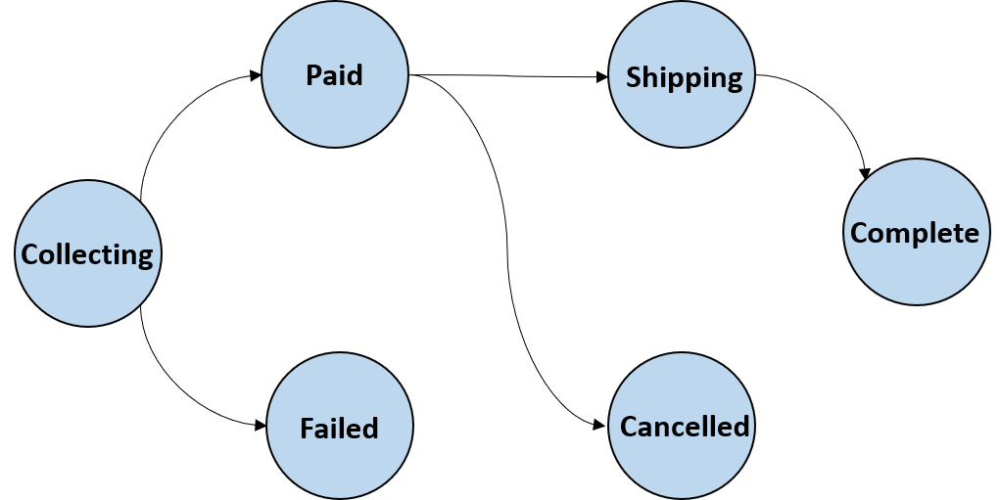

Организация лабораторных работ
==============================

Лабораторные работы представляют собой поэтапные (инкрементальные)
работы по проектированию и разработке микросервисной системы. Общее
количество работ - 6, общее количество баллов, которые можно получить за
лабораторные работы - 60.

Некоторые работы состоят из 2 этапов - этап проектирования и этап
разработки в соответствии с созданным на первом этапе проектом. На
текущем занятии студент должен сдать этап разработки для предыдущей
работы и этап проектирования для текущей лабораторной работы. Например,
на первом занятии сдается этап проектирования для первой работы, на
втором - этап разработки для первой работы и этап проектирования для
второй.

Работы выполняются студентами в командах по 3-4 человека и принимается
преподавателем практики после ответов на контрольные вопросы каждым из
членов команды. Обязанности распределяются между членами команды самими
студентами, данное разделение фиксируется и предъявляется преподавателю
в процессе защиты работы.

Результатом этапа проектирования является пакет документов (диаграммы,
схемы, описания сущностей и т.д.). Он предоставляется студентом в
электронном виде преподавателю и включает стандартный титульный лист и
набор необходимых артефактов. Этап проектирования оценивается в 5
баллов, порог сдачи, то есть минимальный балл, который позволяет перейти
к следующему этапу - 2. Пакет необходимых документов описан в задании на
лабораторную работу. Баллы за работу определяются преподавателем
практики в соответствие со следующими критериями:

-   качество проделанной работы (соответствие заявленным требованиям,
    полнота проектирования, обоснованность решений, состав
    представленных документов);

-   срок сдачи;

-   личностные качества студента, участие в защите л/р;

Результатом этапа разработки являются - артефакты проектирования (с
предыдущего этапа), возможно, с внесенными изменениями, одобренный
преподавателем и влитый pull request в ветку development git репозитория
студента. Некоторые из лабораторных работ включают требования по
использованию той или иной технологии, паттерна проектирования или
разработки. Если технологии не были заданы в лабораторной работе, стек
реализации должен быть согласован с преподавателем на лекции или
практике. Этап разработки максимально оценивается в 7 или 8 баллов, в
зависимости от работы. Порог сдачи, то есть минимальный балл, который
позволяет перейти к следующему этапу - 3, такое количество баллов можно
получить за решение, которое удовлетворяет функциональным требованиям
(== проходит тесты преподавателя) и соответствует ранее созданному
проекту. Баллы за работу определяются преподавателем практики в
соответствии со следующими критериями:

-   соответствие функциональным/нефункциональным требованиям, проектной
    документации;

-   внесенные в проектную документацию изменения;

-   использование заявленных технологий разработки;

-   качество кода (читаемость, структурированность, модульность,
    соответствие той или иной парадигме, производительность и т.д. на
    усмотрение преподавателя);

-   срок сдачи;

-   личностные качества студента, участие в защите л/р.

Soft deadline для сдачи лабораторной работы (этапа работы) - следующее
практическое занятие после выдачи лабораторной работы. Это означает, что
на следующем занятии можно сдать лабораторную работу без потери баллов
за нее. Каждое последующее занятие будет отнимать один балл от каждого
из не вовремя сданных *этапов.*

Рубежная аттестация и зачет
===========================

Рубежная аттестация будет разделена на набор тестов, проводимых на
каждой лекции. В зависимости от количества и сложности вопросов за
каждый тест можно будет получить от 1,5 до 4 баллов. Общее количество
баллов за все тесты - 20. На последней лекции будет предоставлена
возможность сдать один из ненаписанных ранее тестов.

К зачету допускаются студенты, сдавшие все лабораторные работы и
получившие более 35 баллов за все типы работ.

Пример микросервисной системы
=============================

Мы разрабатываем небольшой пример приложения на основе микросервисной
архитектуры. Вы можете использовать его в качестве примера реализации
некоторых из паттернов, про которые будет рассказано на лекциях. Кроме
того, кто-то из вас может попробовать сделать fork проекта и построить
свое решение на его основе.
[[https://github.com/microservices-course-itmo/designing\_microservices\_course]{.underline}](https://github.com/microservices-course-itmo/designing_microservices_course)

В течение семестра в проекте будут появляться issue, за решение которых
можно будет получить дополнительные баллы. Также баллы можно будет
получить за нахождение и фикс багов в проекте.

Исследовательские проекты
=========================

На данный момент я могу предложить несколько вариантов небольших
исследовательско-практических проектов, которые можно выполнить вместо
лабораторных работ. Формат предусматривает еженедельные встречи в офисе
DELL EMC, изучение статей, материалов по теме, реализацию прототипа.
Темы:

1.  **Consumer contract driven testing in microservice architecture**

2.  **Limited orchestration of choreography SAGAs for ensuring
    transaction atomicity**

Техническое задание
===================

Описание системы
----------------

Система представляет очень упрощенный вариант интернет-магазина.
Пользователь имеет возможность запросить список товаров/доступных
товаров, формировать "корзину"/заказ из данных товаров. Произвести
оплату заказа, используя свою банковскую карту.

Техническое задание описывает далеко не все аспекты системы. Это сделано
**намеренно**, для того, чтобы оставить простор и относительную свободу
при проектировании и разработке системы. При этом публичное API системы
специфицировано специально, чтобы оставить возможность автоматизировано
протестировать приложение.

{width="4.317708880139983in"
height="2.154067147856518in"}

*Машина состояний заказа*

На изображении выше представлены состояния, в которых может находится
заказ в процессе функционирования системы, а также разрешенные переходы
из одного состояния в другое:

a.  Collecting -\> Paid - переход происходит при подтверждении, что
    заказ был успешно оплачен, в противном случае происходит переход
    Collecting -\> Failed

b.  Paid -\> Shipping - переход происходит при изменении статуса заказа
    путем вызова метода REST API **"Change order status"** (см. ниже)

c.  Paid -\> Cancelled - переход происходит при отмене пользователем
    заказа путем вызова метода REST API **"Change order status"**

d.  Shipping -\> Complete - переход происходит при изменении статуса
    заказа путем вызова метода REST API **"Change order status"**

В случае успешного выполнения REST вызова, должен возвращаться HTTP код
200. Случаи ошибок остаются на усмотрение студента, должны быть описаны
в проектной документации, корректно обрабатываться или сопровождаться
генерацией исключительной ситуации и возвращаемым кодом HTTP отличным от
2\*\*.

Описание публичного REST API
----------------------------

Ниже представлено описание публичного REST API, которое должна
предоставлять система (API Gateway REST API). Однако API отдельных
сервисов не обязательно соответствует заявленному API системы и
полностью является предметом последующего проектирования и разработки.

**Name:** Get items

**Method:** GET

**Path:** api/warehouse/items

**Parameters:**

**Input:**

**Returns:** коллекцию объектов представляющих товар (ItemDto),
обязательные поля: идентификатор (id: integer), наименование (name:
string), количество доступных для заказа (amount: integer), цена (price:
double precision)

**Invariants:**

**Name:** Get item by id

**Method:** GET

**Path:** api/warehouse/items/{item\_id}

**Parameters:** not null {item\_id} - идентификатор товара

**Input:**

**Returns:**

-   ItemDto {id, name, amount, price}

**Invariants:**

**Name:** Create item

**Method:** POST

**Path:** api/warehouse/items

**Parameters:**

**Input:** ItemCreationDto {name, amount, price}

**Returns:**

-   ItemDto {id, name, amount, price}

**Invariants:**

-   До вызова объект не существует в базе данных, после вызова
    количество товаров с данным идентификатором становится равно amount

**Name:** Add existing items

**Method:** PUT

**Path:** api/warehouse/items/{id}/addition/{amount}

**Parameters:** id - идентификатор товара, 0 \> amount \> 10\_000 -
количество добавляемых товаров

**Input:**

**Returns:** ItemDto {id, name, amount} - обновленное состояние объекта

**Invariants:**

**Name:** Get orders

**Method:** GET

**Path:** api/orders

**Parameters:**

**Input:**

**Returns:** коллекцию объектов представляющих заказ (OrderDto),
обязательные поля: идентификатор (id: integer), статус заказа (status
{COLLECTING, PAYED, SHIPPING, COMPLETE, FAILED, CANCELLED} : string/enum
), суммарная стоимость (totalCost: money), количество товаров в заказе
(totalAmount: integer), идентификатор пользователя (username: string),
коллекция объектов представляющих товар (ItemDto\[\]).

**Invariants:**

**Name:** Get order by id

**Method:** GET

**Path:** api/orders/{order\_id}

**Parameters:** not null {order\_id} - идентификатор заказа

**Input:**

**Returns:** OrderDto {id, status, username, totalCost, totalAmount,
ItemDto\[\]} - актуальное состояние объекта.

**Invariants:**

**Name:** Add item to order

**Method:** POST

**Path:** api/orders/{order\_id}/item

**Parameters:** nullable {order\_id} - идентификатор заказа

**Input:** not null ItemAdditionParametersDto {id, 0\< amount \< 100,
username}

**Returns:**

-   OrderDto { id } - **как минимум** идентификатор заказа, которому
    была добавлена деталь.

**Invariants:**

-   если переданный идентификатор заказа null, то в результате вызова в
    базе данных создается новый заказ и его идентификатор возвращается
    клиенту

-   после вызова заказ содержит товары, которые содержал до вызова и
    новый товар с характеристиками, переданными в
    ItemAdditionParametersDto

-   после вызова количество доступных товаров с данным идентификатором
    становится меньше на amount, но не может стать меньше нуля.

**Name:** Perform payment

**Method:** PUT

**Path:** api/orders/{order\_id}/payment

**Parameters:** not null {order\_id} - идентификатор заказа

**Input:** UserDetailsDto {username, cardAuthorizationInfo {AUTHORIZED,
UNAUTHORIZED}: string/enum} - оплата производится в зависимости от
статуса карты.

**Returns:**

-   OrderDto { id } - **как минимум** идентификатор заказа.

**Invariants:**

-   статус заказа меняется в соответствие с машиной состояний в
    зависимости от результата вызова

-   в случае неуспешной попытки количество доступных товаров, которые
    были включены в данный заказ, увеличивается на количество их в
    заказе

**Name:** Change order status

**Method:** PUT

**Path:** api/orders/{order\_id}/status/{status}

**Parameters:** not null {order\_id} - идентификатор заказа, not null
{status} - {COLLECTING, PAID, SHIPPING, COMPLETE, FAILED, CANCELLED} -
статус, в который переводится заказ.

**Input:**

**Returns:** OrderDto {id, status} - **как минимум** идентификатор и
статус заказа

**Invariants:**

-   статус заказа меняется в соответствии с машиной состояний в
    зависимости от результата вызова

-   в случае перевода в состояния {FAILED, CANCELLED} количество
    доступных товаров, которые были включены в данный заказ,
    увеличивается на количество их в заказе

Описание лабораторных работ
===========================

Лабораторная работа 1 - 13 баллов
---------------------------------

1.  Выделение и проектирование микросервисов.

    a.  Описание предметной области (домена), например, в виде ER
        диаграммы, описывающей основные сущности и связи между ними.

    b.  Выделение функциональных областей и границ сервисов и
        обоснование разделения.

    c.  Описание архитектуры данных для каждого из сервисов (описание
        субдоменов).

    d.  Описание API каждого из сервисов.

2.  Разработка сервисов

    a.  Создание ранее спроектированных сервисов. Каждый сервис
        представляет собой приложение, предоставляющее REST API и
        взаимодействующее с локальным хранилищем данных (отдельная БД
        или изолированная схема в разделяемой БД).

    b.  Реализация логирования всех значимых событий в сервисах.

Лабораторная работа 2 - 13 баллов
---------------------------------

1.  Проектирование межпроцессного взаимодействия

    a.  Описание структуры, названий, триггеров для создания
        *событий/команд/запросов,* которыми обмениваются сервисы.

    b.  Определение характера (синхронное/асинхронное) и способа
        взаимодействия (HTTP/Messaging/RPC).

    c.  Создание схем иллюстрирующих прохождение запроса через сервисы,
        для всех запросов, вовлекающих в исполнение более одного сервиса
        с указанием характера взаимодействия.

2.  Реализация межпроцессного взаимодействия

    a.  Описание классов и схем *событий/команд/запросов* в программном
        коде.

    b.  Создание API для межсервисного взаимодействия

    c.  Создание логики обработки входящих событий/команд/запросов в
        соответствии с созданным проектом. Реализация REST
        взаимодействия или взаимодействия через шину событий.

    d.  Интеграция сервисов - проверка взаимодействия на тест-кейсах,
        вовлекающих в исполнение более одного сервиса, в соответствии с
        заявленными в техническом задании операциями.

Лабораторная работа 4 - 7 баллов
--------------------------------

1.  Этап реализации. Контейнеризация, регистрация и обнаружение сервисов
    (service discovery), проверки жизнеспособности (health check)

    a.  Создание Docker контейнеров для каждого из сервисов
        (микросервисов и инфраструктурных сервисов) на базе образов из
        общедоступных репозиториев

    b.  Создание Docker-compose файла, способного запустить всю систему
        в работоспособном состоянии

    c.  Интегрирование механизма service discovery (client side /
        service side). Поддержание его при развертывании с помощью
        Docker-compose.

Лабораторная работа 3 - 13 баллов
---------------------------------

1.  Проектирование API Gateway- единой точки входа приложения, куда
    приходят все клиентские запросы

    a.  Описание последовательности действий (в виде соответствующий UML
        диаграммы) взаимодействия сервисов через API Gateway для каждой
        из заданных в условии операций, вовлекающих в исполнение более
        одного сервиса. Описание должно включать как позитивные
        сценарии, так и покрывать случаи исключительных ситуаций

    b.  Проектирование как минимум одного запроса, требующего получать и
        агрегировать (создавать новую структуру данных на основе
        полученных данных) данные из более чем одного сервиса

2.  Реализация API Gateway

    a.  Реализация роутинга (направления) запросов к целевым сервисам.

    b.  Реализация API Gateway на основе созданного проекта

    c.  Интегрирование механизма балансировки нагрузки (client size /
        service side). Поддержание его при развертывании с помощью
        Docker-compose

    d.  Использование паттерна circuit breaker

    e.  Запуск системы в Docker Swarm. Проверка *работоспособности*
        системы при наличии нескольких работающих экземпляров каждого из
        сервисов. Проверка *работоспособности (здесь речь скорее о
        правильной обработке частичных падений и т.д.)* при отсутствии
        работающих экземпляров каждого из сервисов.

Технологии, подходы и паттерны для распределения заданий на лабораторные работы
===============================================================================

Преподаватели практики распределяют между группами следующие технологии
и паттерны, которые нужно будет использовать для реализации системы.

1.  Log tailing / Data capture (DDIA p.161) \*

2.  Transactional messaging

3.  API composition

4.  API aggregation

5.  Spring Flux with functional endpoint definition

6.  Spring Cloud Gateway / Spring Cloud Zuul

7.  Spring Cloud (Consul / Eureka / Zookeeper / manual)

8.  Spring Cloud Config (using different backends)

9.  Spring Open feign -

10. Spring Cloud Function -

11. Kafka / RabbitMQ / NSQ / ZeroMQ(ZMQ) / Redis /
    ([[https://github.com/yandex-money-tech/db-queue]{.underline}](https://github.com/yandex-money-tech/db-queue))

12. Queues model - (direct / publish-subscribe)

13. gRPC

14. Protocol Buffers / Thrift / Json / Avro / Smile

15. HATEOAS pattern

16. CQRS pattern

17. Centralized logging

18. Distributed tracing (Zipkin / Jaeger)

19. Orchestration saga / Choreography saga

20. Microservices monitoring and (alerting\*)

21. Product metrics dashboards creation

22. Circuit breaker pattern

23. Spring Statemachine -

24. Istio
