# Системы управления репозиториями

В данной лабораторной работе будут рассмотрены такие системы управления репозиториями:
- Github
- Gitlub
- Bitbucket

# BitBucket

Битбакет является наименее распространенной системой из всех выше перечисленных. Для работы с репозиторием, его нужно сначала создать. Битбакет, помимо обычного создания репозитория, умеет импортировать их с GitHub.  
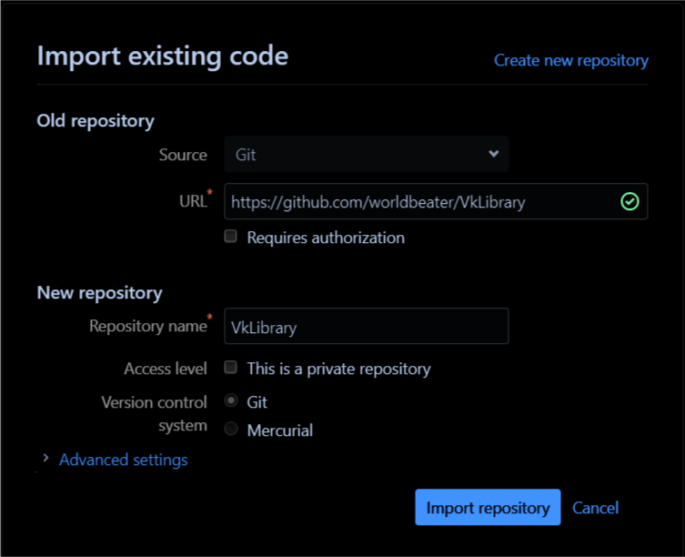

После создания или добавления репозитория, Битбакет дает доступ к обзору файлов данного репозитория.  
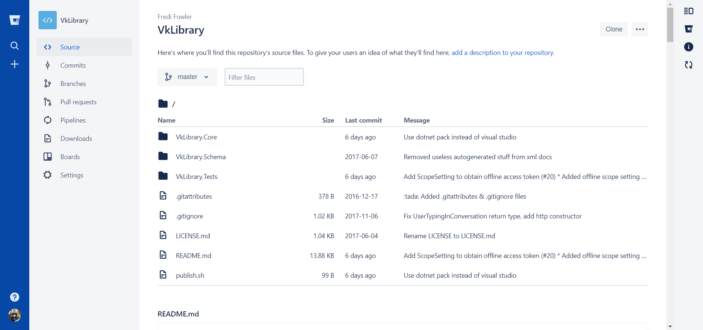

По-умолчанию, файл репозитория `Readme.md` рассматривается как описание проекта и отображается в обозревателе репозитория. По странному стечению обстоятельств, Битбакет не смог в форматирование `md-`файла:  
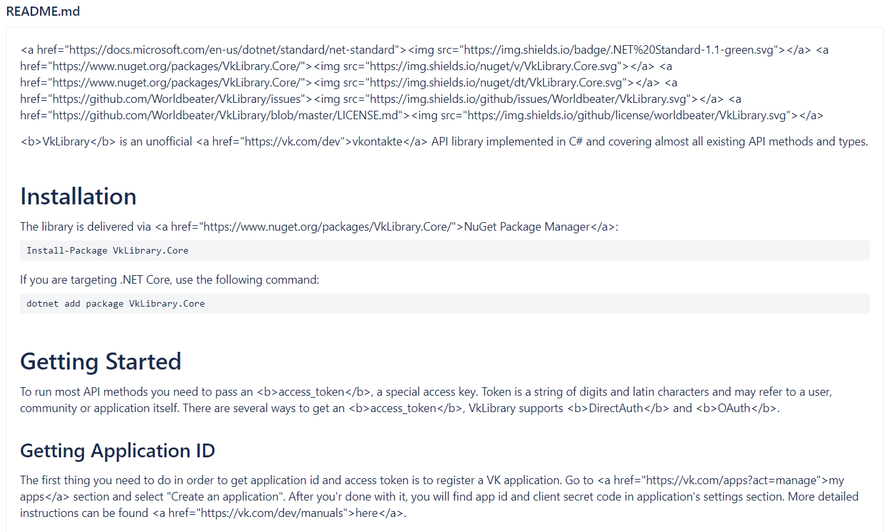

Помимо хранения, системы управления репозиториями предоставляют возможность просмотра содержимого прямо в браузере. Увы, битбакет также не полностью смог отобразить подсветку синтаксиса файла с C#-кодом:  
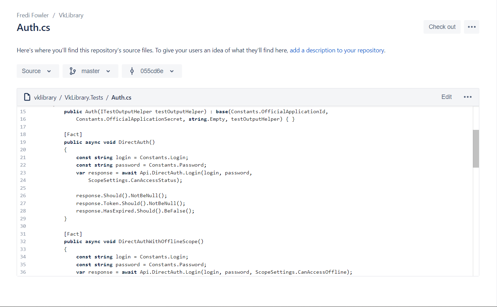

Когда мы говорим о системах работы с репозиториями, нас в первую очередь интересует работа с фичами гита:
- Обзор коммитов  
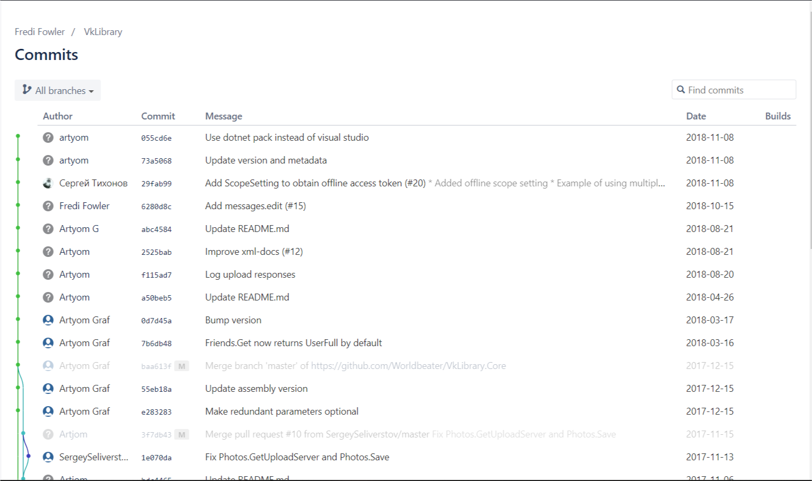
- Просмотр веток  
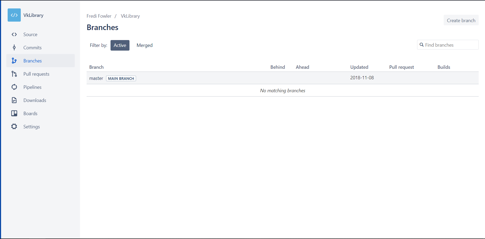
- Просомтри пул-реквестов  
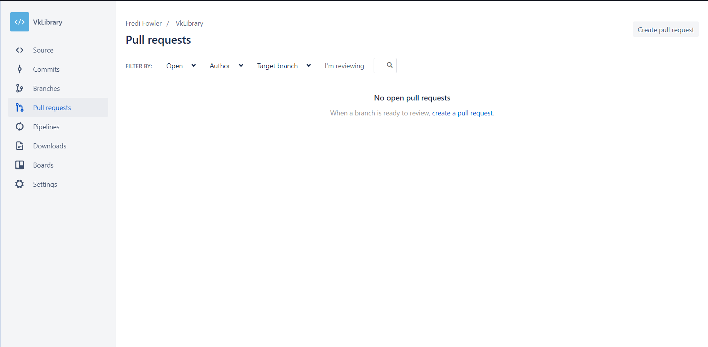
- Создание бордов не реализовано в системе. Вместо этого добавленна интеграция с Trello
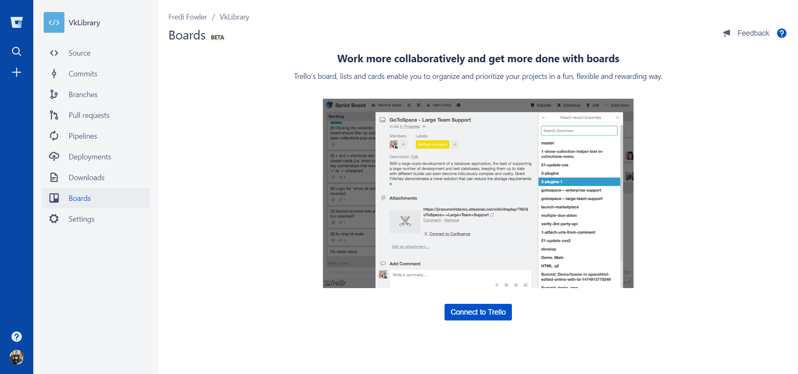

# Gitlab

Система Gitlab стоит отметить ввиду наличия уникальной возможности, которая предоставляется им - деплой на локальном сервере. Это ключевая особенность. Развертывание на локальном сервере дает возможность получить весь (на самом деле, не весь) на своем локальном сервере.

Стоит отметить, что в Gitlab'е, есть возможность залогиниться с помощью GitHub. Это очень удобно, т.к. скорее всего, пользователи, которые только пришли на GitLab уже знакомы с GitHub:  
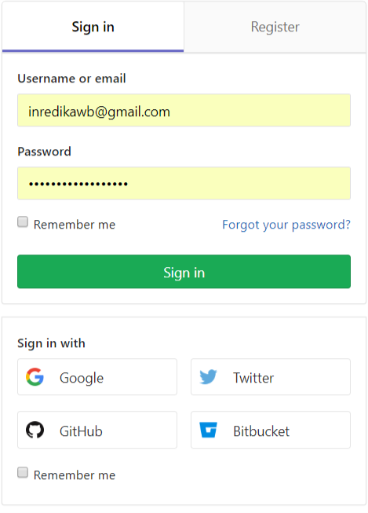

Как и у BitBacket'а, в данной системе есть обозреватель проектов, возможность импорта с других источников:  
  
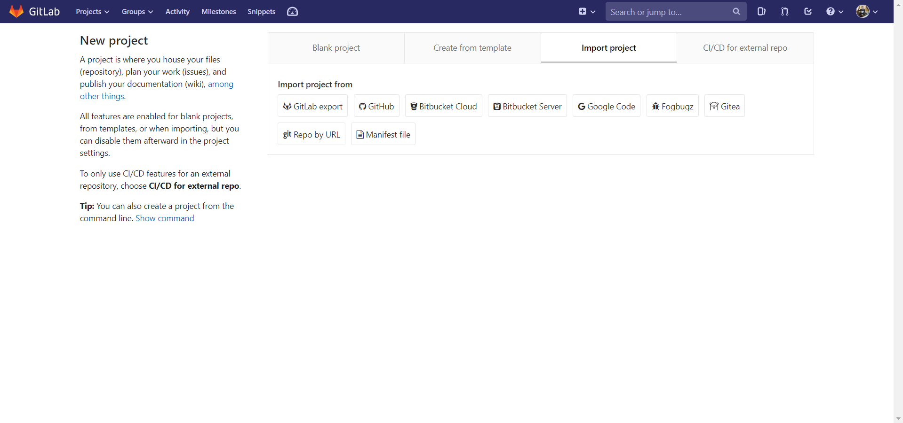

GitLab немного иначе отработал `.md` файл, но также не смог справится с его парсингов:  

Рассмотрим основной функционал связанный с работой с git'ом:
- Просмотр коммитов и веток. Оформление этой части системы выглядит немного устаревшим на фоне остальной стилистики сайта  

- По-умолчанию для репозитория строятся различные метрики. Скорее всего, они не смогут в полной мере заменить метрики agile-систем, которые часто используются в командах для таких случаев, но могут быть информативными в роли билд-ин системы отслеживания разработки:  
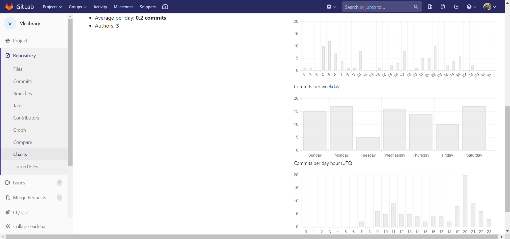

Важной механикой, на основе которой реализуют фидбек-систему, баг-трекер и таск-менеджер, является система issues. Issue - это определенная информация, которую формирует пользователь по отношению к конкретному репозиторию. Как уже было сказано выше, данная информация может быть различного рода:
- описание бага, баг-репорт
- отзыв пользователя о своем опыте использования, предложенные правка
- реквест фичи, недостающего функционала
- вопрос адресованный автору или комьюнити по работе с данным проектом

При работе с issues, можно изменять ее состояние: привязывать лейблы, асигнить на конкретного исполнителя, комментировать.

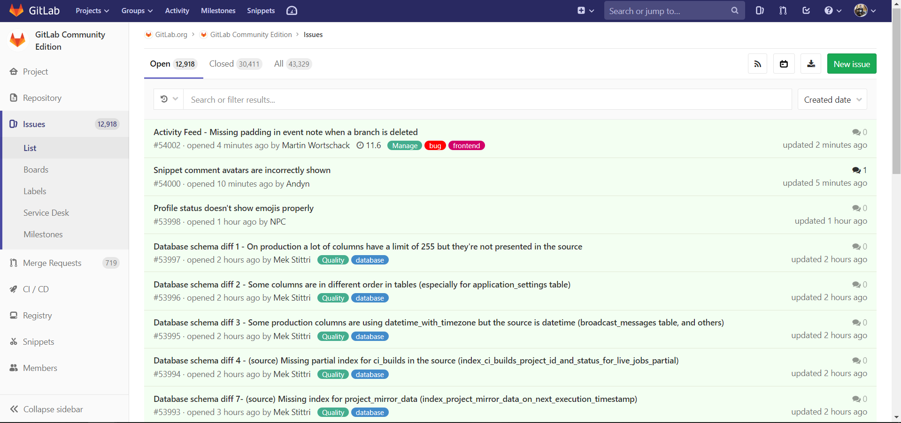

## GitHub

Github - крупнейший веб-сервис для хостинга IT-проектов и их совместной разработки. С недавних времен он еще и заручился поддержкой Microsoft.  
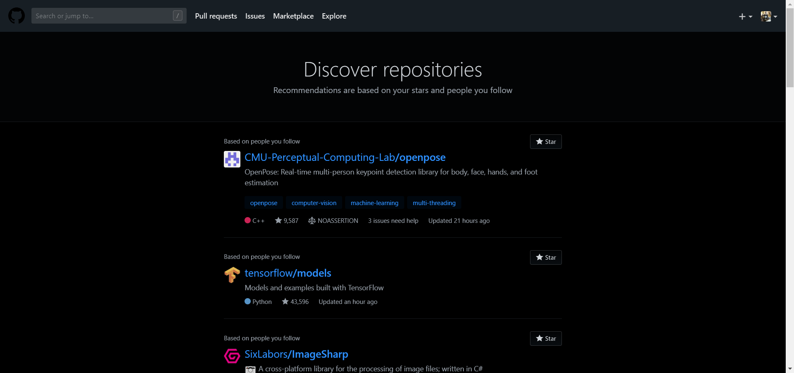  

Основной идеей GitHub'а является позиционирование себя как социальная сеть для кодинга, а также продвижение open-source. Пользователи - не работники конкретного проекта, а контрибуторы всего опенсорса.  
  

Проекты на Github'е, как во всех других системах управления репозиториями, имеет интерфейс файлового проводника, отображает все файлы (даже `.md` с правильным рендерингом):  
  
  

Сервис предоставляет возможность создавать в репозиториях доски с issues тасками по аналогии с GitLab
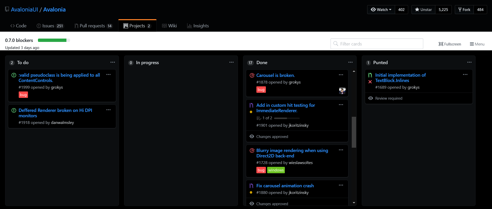  

В роле баг-трекера выступает система issues. Их может создавать любой пользователь, описывать баги или пожелания. Каждый issue создает тред с возможностью обсуждать, прикрепить пул-реквест решением проблемы.  
  

Есть некий аналог спринтов - просто набор тасков, которые менеджеры репозитория могут объединить логически:  
  

Важно отметить, что гитхаб имеет множество фичей для взаимодействия между пользователями. Например, лента обновлений аккаунтов, на которые подписан пользователь:  
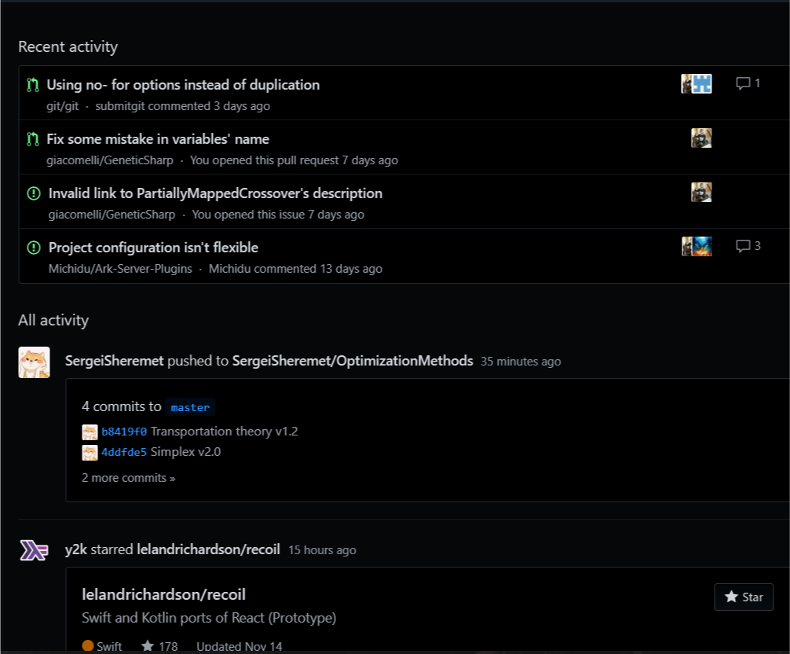  

# Выводы

1. Хостинг: все системы предоставляются ввиде веб-сервиса. BitBucket также можно развернуть на выделенном сервере за определенную плату. GitLab можно развернуть на своем сервере бесплатно.
2. DevOps: по-умолчанию, BitBucket и GitLab предоставляют различные тулзы для CI/CD. GitHub из коробки такого не имеет функционала, но есть расширения.
3. Отображение markdown: GitHub отлично отображает базовый markdown, но не реализован парсинг Katex/Latex/etc. GitLab и BitBucket не смогли отобразить markdown (html-теги в нем, если быть точным)
4. Обозреватель репозиториев: BitBucket нацелен на командную работу с репозиторием. В GitHub и GitLab есть возможность просмотра популярных репозиториев, а также репозитории других пользователей
5. GitHub имеет расширения. Можно подключить расширения дял интеграции таск менеджеров, чатов (slack, gitter), CI, кодревью, прочее.
