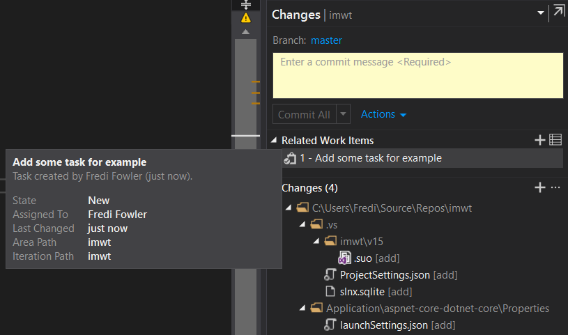

**Цель работы** - изучить используемую IDE, выделить основные элементы среды, которые автоматизируют определенные процессы при разработке.

# Описание IDE
**Visual Studio** - интегрированная среда разработки (IDE) предоставляемая Microsoft. Данная IDE разрабатывает во многом для фреймворка **.NET** и его языков (C++/CLI, C#, F#), но также имеет поддержку и тулзы для работы с SQL, Python, Javascript/Typescript, Java etc.  
Важно отметить, что используется именно **VisualStudio** для Windows. **Microsoft** выпустили IDE с таким же названием под **MacOS**, но это не аналогичная IDE, а переделанная XamarinStudio, которая не имеет большинства упомянутых далее компонентов.  

# Настройка IDE

Как и любая другая IDE, VisualStudio имеет ряд настроек для повышение гибкости и удобности в использовании.

## Учетная запись и синхронизация
VS работает с учетными записями Microsoft. Это упрощает дальнейшую работу со сторонними ресурсами (например, Azure). Помимо этот, настройки IDE синхронизируются с учетной записью и автоматически подтягиваются при авторизации в только что установленной студии. Также, все настройки IDE можно импортировать и экспортировать, что позволяет очень легко настроить рабочее окружение для команды.

## Шрифт
Очень важным для любой среды разработки являются шрифты. VS позволяет без проблем изменять и ставить любой шрифт, доступный в системе. На просторах GitHub можно найти примеры шрифтов специально разработанных для написания код, например, Fira Code [1].

  

## Хоткеи
VS предоставляет тулзы для полной кастомизации хоткеев, но почти всегда используется один из двух наборов: стандартные хоткеии VS [2] или хоткеи, которые предоставляет ReSharper [3]. Рассмотрим базовые команды, которые можно выполнить с помощью хоткеев:  
- Build.BuildSolution - Ctrl+Shift+B
- Build.Cancel - Ctrl+Break
- Debug.Start - F5
- Debug.StopDebugging - Shift+F5
- Debug.RunToCursor - Ctrl+F10
- Debug.StartWithoutDebugging - Ctrl+F5
- Debug.StepInto - F11
- Debug.StepIntoCurrentProcess - Ctrl+Alt+F11
- Debug.StepOut - Shift+F11
- Debug.StepOutCurrentProcess - Ctrl+Shift+Alt+F11
- Debug.StepOver - F10
- Debug.StepOverCurrentProcess - Ctrl+Alt+F10
- Edit.Copy - Ctrl+C (если не выделен текст, то копируется вся строка, на которой расположен курсор)
- Edit.Cut - Ctrl+X (если не выделен текст, то вырезается вся строка, на которой расположен курсор)
- Edit.Paste - Ctrl+V (если в буфере лежит строка, то она вставляется перед строкой с курсором)
- Edit.CycleClipboardRing - Ctrl+Shift+V (буфер всех скопированных данных)
- Edit.Undo - Ctrl+Z
- Edit.Redo - Ctrl+Y
- Edit.CommentSelection - Ctrl+K, Ctrl+C
- Edit.UncommentSelection - Ctrl+K, Ctrl+U
- File.SaveSelectedItems - Ctrl+S
- File.SaveAll - Ctrl+Shift+S
- Project.AddNewItem - Ctrl+Shift+A
- Refactor.ExtractInterface - Ctrl+R, Ctrl+I
- Refactor.Rename - Ctrl+R, Ctrl+R
- Refactor.ReorderParameters - Ctrl+R, Ctrl+O
- Code cleanup - Ctrl + E, C 

# Визуализация и рефакторинг
Одни из самых важный фичей любой IDE - возможность в удобном виде воспринимать проект, а также его рефакторить. Для этого в VS есть такой инструмент как "**Code map**" - он автоматически генерирует карту зависимостей в проекте. На ней весь код проекта группируется по сборкам, пространствам имен и классам создавая нужную вложенность, а зависимости, вызовы и ссылки между элементами отображается стрелками.  

Одним из инструментов для анализа код является "**Code metrics**". Он используется для анализа качества написанного кода, позволяет находить места, которые подлежат рефакторингу. С описанием критериев можно ознакомится на официальном сайте Майкрософт [4]. Пример:  

Для более подробного анализа можно воспользоваться "**Code issues**". Это инструмент, который анализирует код и выводит информацию о всех возможных ошибках и предупреждения в коде:  
  

# VCS
В Visual Studio есть поддержка git и VSTS. Работа с git очень упрощается за счет встроенного UI, которым можно выполнить большинство базовых задач git'а не прибегая к консоли:  
- Просмотр информации о репозитории с возможностью перейти сразу в нужную вкладку на GitHub  
  
- Создание, удаление и мердж веток  
  
- Комит изменений  
  

При создании нового проекта, можно сразу же инициализировать. Студия автоматически создаст в папке нужные git файлы, в тои числе .gitignore с прописанными правилами под Visual Studio:  
  
Во время работы с проектом, который является git-репозиторием, на панели отображается информация о текущем репозитории, рабочей ветке с возможностью ее тут же изменить, количестве измененных файлов, а также новых не запушенных комитов.  
  
Также, по каждому методу Visual Studio пишет все изменения из git-а.  
  

# Azure DevOps (VSTS/TFS)
У Microsoft есть своя разработка для организации командной работы - **Azure DevOps** (который ранее существовал под названием Visual Studio Team Services(который ранее существовал под названием Visual Studio Online(который ранее существовал под названием Team Foundation Server Cloud))) [5]  
Это набор большого количества различных тулзов для DevOps и Agile, который интегрирован в Visual Studio:  
  
В лучших традициях Agile, в системе (а также в Visual Studio) есть таски, к которым привязываются коммиты.

  

# Разработка
## Навигация
Visual Studio предоставляет возможности для удобной навигации по проекту:
    - Ctrl + клик на тип (класс, структуру, перечисление) - переход к месту определения типа
    - Для любого типа или его метода можно увидеть список референсов (и сразу же открыть карту кода для него):  

## Task list
Отображение всех комментариев, которые начинаются с "TODO", чтобы их можно было легко найти и открыть.  

## Дебаг
Одной из важнейших частей разработки является откладка. Visual studio имеет один из самый функциональных инструментов для этого. Во время выполнения кода можно поставить паузу и проанализировать, что происходит в данный момент:  

На скрине можно увидеть участок, на котором было остановлено выполнение. Слева отображается дебаг панель, которая выводит информацию о использовании ресурсов (CPU, memory) на протяжении всего периода выполнения. Кроме этого, во время остановки выполнения можно посмотреть информацию о всех доступных переменных, их значение:  

Если выполняется сразу несколько потоков, то между ними можно переключаться, чтобы увидеть, где они выполняются:  

## Unit-test
Неотъемлемой часть разработки любого продукта является написание Unit test'ов. Такие тесты нацелены на проверку небольших блоков кода, чтобы проверить не привело ли к возникновению ошибок очередное изменение кода. В Visual Studio есть специальное окно, в котором отображается информация о всех существующих тестах в решении:  
  
Отдельно стоит отметить Live unit testing. Этот инструмент в реальном времени при изменении кода перевыполняет связанные с данным участком юнит-тесты, отображает информацию об успешности их прохождения:  
  
В случае возникновения ошибок в юнит-тестах, над каждым тестом можно узнать информацию о его выполнении:
  

# Ссылки
1. FiraCode - https://github.com/tonsky/FiraCode
2. Default keyboard shortcuts in Visual Studio - https://docs.microsoft.com/en-us/visualstudio/ide/default-keyboard-shortcuts-in-visual-studio?view=vs-2017
3. Resharper default keymap - https://www.jetbrains.com/resharper/docs/ReSharper_DefaultKeymap_VSscheme.pdf
4. Code metrics - https://docs.microsoft.com/en-us/visualstudio/code-quality/code-metrics-values?view=vs-2017
5. Azure DevOps - https://azure.microsoft.com/en-us/blog/introducing-azure-devops/