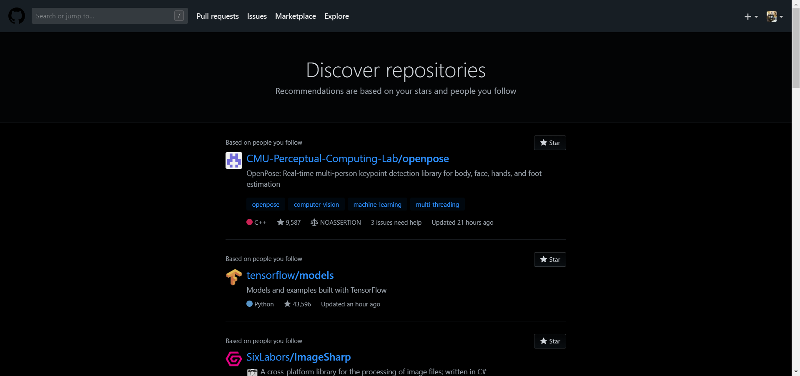
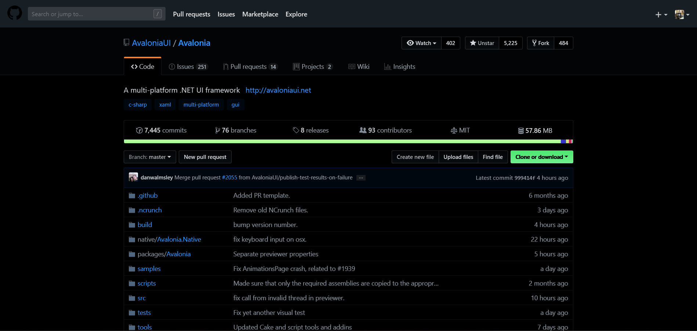
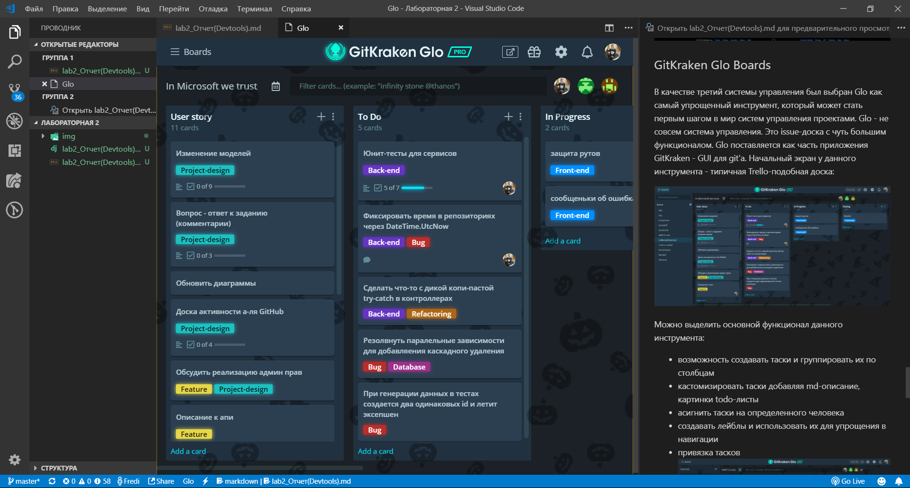
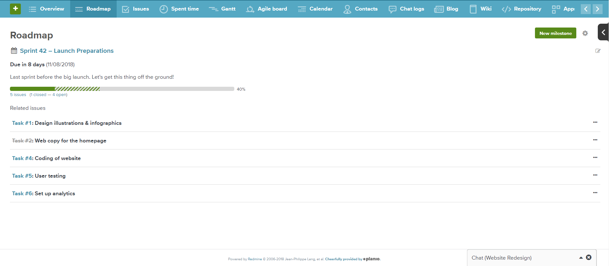

# Задание на лабораторную работу

Рассмотреть, изучить, описать и сравнить три системы управления проектами.

# Системы управления проектами

Дадим определение термину "Системы управления проектами", который является наиболее точным в контексте данной лабораторной работы:
- это информационная и автоматизированная система для планирования, организации и управления средствами и ресурсами разработки в ходе работы над проектом.

# Применение систем управления

Разработка любого хоть немного сложного проекта связано с командной работой, ее организацией и оптимальным управлением. Рассмотрим системы с трех позиций:
1. Для разработчиков подобные инструменты дают возможность кооперироваться при работе над один участком проекта, а также отслеживать таски, которые заасигнили конкретно на них.
2. Для PM'ов системы управления проектом предоставляют возможности управлением персонала, распределения задач, данные для оценки производительности и дальнейшего прогнозирования.
3. Для PO и кастомеров данные решения приоткрывают занавес, позволяют в каком-то относительно интерактивном виде отслеживать работу над проектом.

# Примеры систем управления проектами

Рассмотрим несколько систем, дадим краткий анализ их функционала и применения.

## Azure DevOps

Azure DevOps (более известна как Team Foundation Server, TFS) - изначально система управления кодом, которая в дальнейшем развилась до полноценной системы управления проектом. Данная система имеет огромное количество различных фич для управления проектами. Рассмотрим все по порядку. При открытие проекта, Azure DevOps встречает пользователя весьма юзер-френдли интерфейсом.  
  

На главной странице (могла быть) предоставлена информация о проекте, описание из readme, а также список использованых языков и их процент в проекте:  

Не менее важной информацией является сводка о коммитах, активных пул-реквестах, статистика по успешности сборки и развертывании проекта. Здесь же находится информация об участниках данного проекта.  

Для проекта можно создать свою wiki - набор страниц, где хранится нужна по проекту информация. Azure Devops позволяет в удобной форме создавать (с использованием Markdown) и поддерживать подобную фичу.  

Несложными манипуляциями, можно получить информативную и хорошо сверстаную страницу с описанием какой-то важной части проекта:  

Важной частью управления проект является SCRUM-доска. На ней отображаются UserStory, таски, баги и прочие важные элементы игры в Agile. Популярность имеет деление таск-борды на 4 группы:
- New: юзер стори, которые недавно сформулировали, еще не разделили на таски/не выбрали исполнителя/отложили на потом
- Active: таски и/или юзер стори, которые заасигнели на конкретного человека и выполняются в данный момент:
- Resolved: выполненные и ожидающие обработки/дальнейшего развития таски.
- Closed: закрытые (законченные) таски и/или юзерстори
- Иногда (например в старой версии TFS) выделяют этап "Testing" куда помешают выполненные таски, которые отправлены на рассмотрение тестерам. Это связано в тем, что почти всегда разработчик и тестер - это разные люди и складывать выполнение и тестирование компонента в одну таску - идея не из лучших.  

Обратим внимание на интерфейс добавления задач/баг-репортов. При добавлении можно внести такую информацию:
- названием таски
- описание таски
- (для багов) описание действий, которые нужно выполнить, чтобы воспроизвести баг
- состояние (New / Active)
- итерация, в которой будет выполняться данная таска
- приоритет/важность
- количество стори поинтов данной таски
- время выполнения в часах  

Доступна более информативная (по субъективному заключении автора) таск-доска итераций. Ее особенность в том, что отображаются таски и баги только выбранной итерации. На ней выделены строками юзер-стори, а все связанные элементы размешаются вдоль строки юзер-стори. О каждой таске приводится краткая информация: название, исполнитель, стори поинты  

Присутствуют основные инструменты для работы с CVS (git).  

Просмотр сделанных комитов с подробной информацией и деревом бранчей:  

Помимо функционала, который предоставляет каждый второй Trello, Azure DevOps предоставляет возможность для настройки CI/CD:

  
  
  
  

## GitHub

Github - крупнейший веб-сервис для хостинга IT-проектов и их совместной разработки.  
  

Основной идеей GitHub'а является позиционирование себя как социальная сеть для кодинга, а также продвижение open-source. Пользователи - не работники конкретного проекта, а контрибуторы всего опенсорса.  
  

Проекты на Github'е представлены ввиде репозиториев с кодом и сопутствующей информацией:  
  
  

Сервис предоставляет возможность создавать в репозиториях доски с заданиями. Во многом повторяет Scrum-доску, но без духа Agile:  
  

В роле баг-трекера выступает система issues. Их может создавать любой пользователь, описывать баги или пожелания. Каждый issue создает тред с возможностью обсуждать, прикрепить пул-реквест решением проблемы.  
  

Есть некий аналог спринтов, но опять же без фанатизма по Agile - просто набор тасков, которые объединили единой целью:  
  

## GitKraken Glo Boards

В качестве третий системы управления был выбран Glo как самый упрощенный инструмент, который может стать первым шагом в мир систем управления проектами. Glo - не совсем система управления. Это issue-доска с чуть большим функционалом. Glo поставляется как часть приложения GitKraken - GUI для git'а. Начальный экран у данного инструмента - типичная Trello-подобная доска:

  

Можно выделить основной функционал данного инструмента:
- возможность создавать таски и группировать их по столбцам
- кастомизировать таски добавляя md-описание, картинки todo-листы
- асигнить таски на определенного человека
- создавать лейблы и использовать их для упрощения в навигации
- привязка тасков  
  
- удобные фильтры и поиск по таскам
- есть возможность включить синхронизацию с Github

Кроме того, ввиду простоты Glo, не сложно было портировать его для использования не только внутри GitKraken:
- Glo доступен с браузера (веб-сервис)
- есть удобные клиентые для Andoroid и iOS  
  
- Glo также можно внедрить в VS Code  
  

# Planio

Planio - опен-соурсный программное написанное на Ruby on Rails. Является форком Redmine и имеет много общего функционала.

Ниже представлен интерфейс создания нового проекта. Можно заметить настройку подключаемых модулей: можно отелюить не используемые модули, чтобы они не отвлекали во время работы. При открытии проекта отображаются новостная лента, где отображаются таск, изменения и прочее.  
  

Как и любая систему управления проектами, Planio имеет поддержку типичных для SCRUM компонентов:
- Таски  
  

- Диаграммы Гранта  

- Интеграция тасков с календарем    
  
- Информация о работниках и связанных с ними задачами  
  

Важный инструментом отслеживания процесса продвижения проекта является Roadmap. Это логическое структурирование комитов (соответствует спринтам в SCRUM'е). Здесь также отображает диаграмма сгорания, статистика по открытым/закрытым комитам:  
  
  

Так как Planio open-source, комьюнити создает плагины, расширения. Например, как плагин распространяется фича интеграция с Github:
  

# Вывод

Было проанализированно три совершенно разные в подходе системы управления проектами. Выделим основные поинты.  
Почему стоит выбрать **Azure**:
+ Надежность
+ Превосходная интеграция с экосистемой Microsoft (и не только)
+ Много готовых решений (например: конфиги сборок для CI, CD)

Чего не стоит ждать от **Azure**:
- Подходящей цены, если не студент
- Легкость знакомства с инструментом
- Понимание особенностей работы различных фич, которых очень много

Все используют **Github** и вот почему:
+ открытость, прозрачность, доступность каждому
+ социальных аспект, активное взаимодействие между пользователями
+ популярен, негласный стандарт
+ имеет все необходимые фичи
+ все проблемы CI/CD, devops и прочего могут решить расширения
+ Open-source, поддержка комьюнити

Почему все же не стоит использовать **Github**?:
- стандартная учетная записать github не подразумевает закрытых репозиториев, таск-доску нельзя сделать не публичной. 

О **Glo** почти никто не знает, почему им таки стоит узнать о нем?:
+ Минималистичность, простота
+ Нулевой порог вхождения в использования подобных инструментов. Дальше можно переходить на любую другую систему
+ Широкий спектр применения: от todo-листа для себя и организации взаимодействия студентов во время обучения до полноценного менеджмента проекта (без devops)
+ Доступен всюду: в гит-клиенте, браузере, телефоне, IDE

Какие проблемы не стоит решать с помощью **Glo**?:
- в Glo не заточен под какую-то область, у него нет специальных фич
- ограниченный функционал (отсутствие devops, интеграции с git), который не сильно поддается расширению

Плюсы Planio:
+ полноценный набор инструментов для SCRUM
+ удобный user-friendly интерфейс
+ open-source, поддержка комьюнити и как следствие расширение функционала системы

Подводя итоги можно сказать, что **Azure** отлично подходит для крупных проектов, для централизации всех процессов (git, управление проектом, devops) в одном месте. Gitkraken **Glo** - минимальный пак для любой задачи от таск-менеджера до управления небольшим проектом. Github в поли систему управления проектами - бесплатный инструмент, который стоит освоить вчера.