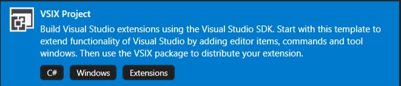
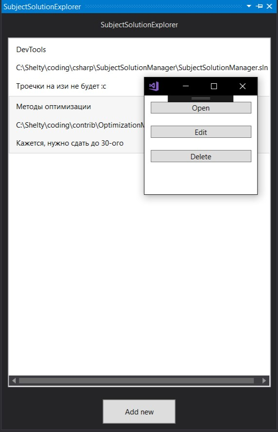

# Лабораторная работа 5. Разработка плагинов

1. Словарь
2. Идея и цель проекта
3. Необходимые средства и стек-технологий
4. Ресурсы и документация
5. Шаблон проекта
   1. Тестирование расширения
   2. Создание команды
6. Основные компоненты SDK
   1. Menus and Commands
   2. FindToolWindow
   3. IVsSolution
7. Разработка расширение SubjectSolutionManager 
   1. Постановка проблемы
   2. Описание модели данных, которые будут использоваться
   3. Добавление кнопки запуска расширения
   4. UI для отображения информации
   5. Способы хранения информации
   6. Работа с проектами

# Словарь

Солюшен - решение; тип файла, который описывает группу проектов в среде Visual Studio и конфиги при сборке.  
Студия, IDE - Visual Studio  
Расширение, плагин, экстеншен - VSPackage, пакет расширения для Visual Studio  

# Идея и цель проекта

Современные IDE - набор универсальных решений, которые помогают решать пользователю много задач разного рода. Но по мере развития технологий с которыми работаю по средствам отдельно взятой IDE, появляются различные, местами весьма специфичные запросы на функциональность. Конечно, можно попытаться все их покрыть добавив все в стандартную сборку IDE, но это закончится как-то так:  
  
(именно столько места может занять Visual Studio 17 со всеми своими компонентами)

Но данную проблему можно решить с помощью расширений. На данный момент все хоть немного популярные IDE предоставляют SDK для работы с внутренним API самого среды позволяя тем самым создать пользователю решения для его конкретных задач.

В данном материале будет представлен некий "Hello world" в сфере разработки расширений. Основная цель - агрегировать базовую информацию о написании собственных расширений, ознакомиться с возможностями, которые предоставляет IDE для этого.

# Необходимые средства и стек-технологий

В роли IDE была выбранная Visual Studio.  
**Visual Studio** - интегрированная среда разработки (IDE) предоставляемая Microsoft. Данная IDE разрабатывает во многом для фреймворка **.NET** и его языков (C++/CLI, C#, F#), но также имеет поддержку и тулзы для работы с SQL, Python, Javascript/Typescript, Java etc.  
Важно отметить, что используется именно **Visual Studio** для Windows. **Microsoft** выпустили IDE с таким же названием под **MacOS**, но это не аналогичная IDE, а переделанная Xamarin Studio, которая не имеет большинства упомянутых далее компонентов.  

На момент написания актуальными являются Visual Studio 2017 (15.9.3 и 15.9.3 Preview 1).  
Для написания расширений также требуется установленный пакет инструментов `"Visual Studio extension development"`. Установить его в свою IDE можно используя `Visual Studio Installer`:  
  

Расширение пишет на .NET Framework'е, использовать можно любую версию. Актуальной является .NET Framework 4.7.2, который и будет использован. Если он еще не установлен в Visual Studio, то его также нужно отдельно установить. Что касается языка, для написания можно использовать C# и Visual Basic, но по очевидным причинам, выбор остановился на первом.

# Ресурсы и документация

- Официальная документация: https://docs.microsoft.com/en-us/visualstudio/extensibility/starting-to-develop-visual-studio-extensions
- Официальная документация: https://docs.microsoft.com/en-us/visualstudio/extensibility/starting-to-develop-visual-studio-extensions
- Репозиторий с примерами  
https://github.com/Microsoft/VSSDK-Extensibility-Samples
- Список SDK:
https://docs.microsoft.com/en-us/visualstudio/extensibility/visual-studio-sdk-reference?view=vs-2017
- Маркет-плейс:  
https://marketplace.visualstudio.com/

# Шаблон проекта

Чтобы приступить к разработке, нужно создать новый VSIX-проект.  
  

Созданный проект должен выглядеть так:  
  

Рассмотрим файл "*.vsixmanifest", так как это единственный важный файл из тех, что создается из коробки. Манифест - это файл в котором хранится как информация о расширении, так и его настройки. Здесь можно указать:
- Название продукта, версию и id
- Автора
- Описание, лицензия
  

## Тестирование расширений

Для тестирования расширений Visual Studio создает отдельную изолированную среду, чтобы тестируемое расширение не повредило саму среду. При первом запуске будет создаваться новый инстанс студии с указанной версией для расширения. Для полной изоляции, также создаются новые записи в реестре, отдельная папка для логов и прочее.

## Создание команды

Одним из самых простых вариантов как-то расширить возможности IDE является добавление кнопки с определенным функционалом. Сделать это можно добавив в проект элемент "Custom Command", который можно найти в секции "Extensibility". При добавлении ее в проекте также создадутся несколько конфигурационных файлов.  
  

В дальнейшем будет ссылка на файлы с названием `SomeCommandPackage.cs` и `SomeCommand.cs`. Они описывают кнопку и логику ее нажатия что будет изложено далее. Эти файлы создаются самой средой и по-умолчанию  вместо `SomeCommand` будет то название, которое пользователь указывает при создании.
Рассмотрим класс `*Package.cs`. Он наследуется от AsyncPackage и представляет собой набор настроек для запуска расширения в IDE. Особенности асинхронного пакета в том, что он будет инициализировать в background-потоке, что позволит меньше нагружать основной поток при запуске IDE или открытии проекта.  
При создании класса, к нему вешаются определенные атрибуты:
- `[PackageRegistration(UseManagedResourcesOnly = true, AllowsBackgroundLoading = true)]` - указывает на то, что расширение может запускаться в бекграунде
- `[Guid(SomeCommandPackage.PackageGuidString)]` - закрпеляет за расширением уникальный идентификатор
- `[ProvideAutoLoad(UIContextGuid, PackageAutoLoadFlags.BackgroundLoad)]` - 

```C
[PackageRegistration(UseManagedResourcesOnly = true, AllowsBackgroundLoading = true)]
[InstalledProductRegistration("#110", "#112", "1.0", IconResourceID = 400)]
[ProvideMenuResource("Menus.ctmenu", 1)]
[Guid(SomeCommandPackage.PackageGuidString)]
public sealed class SomeCommandPackage : AsyncPackage
{
    public const string PackageGuidString = "dbcb981c-2ad9-44e6-b277-a6e4a559997e";

    public SomeCommandPackage()
    {
    }

    #region Package Members

    protected override async Task InitializeAsync(CancellationToken cancellationToken, IProgress<ServiceProgressData> progress)
    {
        await this.JoinableTaskFactory.SwitchToMainThreadAsync(cancellationToken);
        await SomeCommand.InitializeAsync(this);
    }

    #endregion
}
```
Стоит отметить особенность разделение логики инициализации в классе `SomeCommandPackage`. Во-первых, у него есть обычный конструктор класса, который используется для описания логики, которая нужна для дальнейшей работы. С другой же стороны, есть унаследованный метод `InitializeAsync`, который должен не в себе выполнять логику непосредственной инициализации, которая связанна со взаимодействие с IDE, ее компонентами. Стоит отметить, что для оптимизации, этот метод является асинхронным, но из этого следует, что он выполняется не в главном потоке и, например, не может получить доступ к UI [1]. В шаблоне этого файла созданном средой, нет ничего интересно помимо вызова инициализации непосредственно команды: `await SomeCommand.InitializeAsync(this)`. 

Перейдем к рассмотрению `SomeCommand`:  
```C
public const int CommandId = 0x0100;

public static readonly Guid CommandSet = new Guid("9fcf337c-a968-4a53-abb6-f10a3ecc9596");

private readonly AsyncPackage package;

private SomeCommand(AsyncPackage package, OleMenuCommandService commandService)
{
    this.package = package ?? throw new ArgumentNullException(nameof(package));
    commandService = commandService ?? throw new ArgumentNullException(nameof(commandService));
            
    var menuCommandID = new CommandID(CommandSet, CommandId);
    var menuItem = new MenuCommand(this.Execute, menuCommandID);
    commandService.AddCommand(menuItem);
}
```
При создании класса, среда генерирует ему уникальный ID. Это сделано для того, чтобы IDE могла в дальнейшем отличать данное расширение от других и обращаться к нему по ID (например, можно удалить расширение передав в команду его ID).

# Основные компоненты SDK

## Menus and Commands

Как уже было сказано ранее, наиболее очевидный способ внесения дополнительного функционала в IDE - добавление новой конпки на тулбар. Рассмотрим основные особенности команд, тулбара и меню.
- Меню - это кнопки на верхней панели IDE или в контекстном меню. Они являются контейнером для команд, которые размещаются внутри меню.
- Тулбар - это строка с кнопками или другими элементами управления, которые размещаются в верхней части различных окон. Каждому элементу управления на тулбаре соотносится какая-то команда.
- Команды - это описание делегатов и связанных с их выполнением данных, которые хендлятся по средствам IDE при вызове (нажатии на кнопку и т.п.)

Для настроект комманд и тулбаров создается специальных файл `*.vsct` (`command table`) в котором настраивается различное параметры:
- хоткеи
- иконки
- место положение на меню-панели

Подробнее ознакомится можно на странице с документацией по `VSCT`. [2]

Помимо обычных нажатий на кнопку для запуска, существуют различные другие способы запуска команд. Если не говорить о контексте или взаимодействии с конкретными событиями, то останутся еще приоритетные команды. Это обычные команды, которые зарегистрированы в `IVsRegisterPriorityCommandTarget`. Их особенность заключается в том, что они вызываются на каждый любой другой вызов команд. Иными словами, они всегда обрабатывают действия пользователя. Не сложно догадаться, что подобные решения могут очень плохо сказаться на производительность.

### FindToolWindow
При написании плагина были рассмотренны и использованы некоторые компоненты IDE SDK.  
Все окна, как разработанные в плагине, так и стандартные из Visual Studio, можно получить используя метод класса `AsyncPackage`. Это метод `package.FindToolWindow`, который создает инициализирует внутренние настройки окна, чтобы не заставлять пользователя описывать это в своем коде, а также выступает синглтоном, чтобы отслеживать, что определенные окна не создаются больше одного раза. Например, чтобы получить некий `ExtensionWindowExplorer` используется следующий код:
```C
ToolWindowPane window = package.FindToolWindow(typeof(ExtensionWindowExplorer), 0, true);
```

### IVsSolution
Интерфейс IVsSolution в себе агрегирует функционал работы с проектами и солюшенами. Его реализация скрыта внутри самой IDE, пользователю предоставляется лишь абстракция. Получить экземпляр данного интерфейса можно используя метод `Task<object> GetServiceAsync(Type serviceType)` класса `AsyncPackage`. Логика получения нужных компонентов SDK описывается в методе `InitializeAsync`:
```C
protected override async Task InitializeAsync(CancellationToken cancellationToken, IProgress<ServiceProgressData> progress)
{
    await this.JoinableTaskFactory.SwitchToMainThreadAsync(cancellationToken);
    await SubjectSolutionExplorerCommand.InitializeAsync(this);
    IVsSolution pSolution = await GetServiceAsync(typeof(SVsSolution)) as IVsSolution;
    Configuration.SolutionManager = pSolution;
}
```
Как аргумент метода `GetServiceAsync` нужно передать тип `SVsSolution`[4]. Рассмотрим основные методы, которые можно использовать при разработке расширения. На первый взгляд описания не кажутся юзер-френдли и местами не очень то похожи на C#. Это связано с тем, что подобные интерфейсы являются оберткой над WinAPI, использьют маршалинг, COM-объекты и много других не типичных для менедж код вещей[5]. Первым примером является метод создания проекта:
```C
[MethodImpl(MethodImplOptions.PreserveSig | MethodImplOptions.InternalCall, MethodCodeType = MethodCodeType.Runtime)]
int CreateProject(
      [ComAliasName("Microsoft.VisualStudio.OLE.Interop.REFGUID"), In] ref Guid rguidProjectType,
      [ComAliasName("Microsoft.VisualStudio.OLE.Interop.LPCOLESTR"), MarshalAs(UnmanagedType.LPWStr), In] string lpszMoniker,
      [ComAliasName("Microsoft.VisualStudio.OLE.Interop.LPCOLESTR"), MarshalAs(UnmanagedType.LPWStr), In] string lpszLocation,
      [ComAliasName("Microsoft.VisualStudio.OLE.Interop.LPCOLESTR"), MarshalAs(UnmanagedType.LPWStr), In] string lpszName,
      [ComAliasName("Microsoft.VisualStudio.Shell.Interop.VSCREATEPROJFLAGS"), In] uint grfCreateFlags,
      [ComAliasName("Microsoft.VisualStudio.OLE.Interop.REFIID"), In] ref Guid iidProject,
      out IntPtr ppProject);
```

Это метод позволяет создавать или открывать уже существующие проекты. Для создания нужно передать в качестве аргумента `lpszMoniker` путь к файлу, а как `lpszName` - имя создаваемого проекта. Если метод используется для создания - достаточно просто указать путь. Схожим образом работает метод создания/открытия солюшена:
```C
[MethodImpl(MethodImplOptions.PreserveSig | MethodImplOptions.InternalCall, MethodCodeType = MethodCodeType.Runtime)]
int CreateSolution([ComAliasName("Microsoft.VisualStudio.OLE.Interop.LPCOLESTR"), MarshalAs(UnmanagedType.LPWStr), In] string lpszLocation, [ComAliasName("Microsoft.VisualStudio.OLE.Interop.LPCOLESTR"), MarshalAs(UnmanagedType.LPWStr), In] string lpszName, [ComAliasName("Microsoft.VisualStudio.Shell.Interop.VSCREATESOLUTIONFLAGS"), In] uint grfCreateFlags);
```

При в качестве метода также передается флаг `grfCreateFlags`, который задает параметры открытия. Это экземпляр перечисления `__VSCREATESOLUTIONFLAGS` и он может принимать такие значени:
- CSF_DELAYNOTIFY - указывает, что событие `OnAfterOpenSolution` нужно вызывать строго после того, как будет создан проект в этом солюшене
- CSF_OVERWRITE - перезаписывает солюшен, если уже существует с таким же названием в указаной директории

Это битовые флаги, которые можно мерджить логическим И, если нужно передать больше одного.
Если проект открыли, то скорее всего, его нужно и закрыть. Для это есть метод `CloseSolutionElement`:
```C
[MethodImpl(MethodImplOptions.PreserveSig | MethodImplOptions.InternalCall, MethodCodeType = MethodCodeType.Runtime)]
int CloseSolutionElement([ComAliasName("Microsoft.VisualStudio.Shell.Interop.VSSLNCLOSEOPTIONS"), In] uint grfCloseOpts, [MarshalAs(UnmanagedType.Interface), In] IVsHierarchy pHier, [ComAliasName("Microsoft.VisualStudio.Shell.Interop.VSCOOKIE"), In] uint docCookie);
```

### IVsSolutionEvents

Кроме реакции на прямое действие пользователей, расширение может работать с событиями самой студии. Например, с солюшеном, его запуском/закрытием. Весь возможный функционал описан в интерфейсе `IVsSolutionEvents`. Примеры методов этого интерфейса:
- OnAfterCloseSolution
- OnAfterOpenProject
- OnBeforeCloseProject
- OnBeforeCloseSolution 

Для привязки кастомной логики к событию из `IVsSolutionEvents`, нужно реализовать данный интерфейс, написать там нужный код. Для того, чтобы сказать студии, что данный класс должен будет вызываться, его нужно подписать. Это делается через `AdviseSolutionEvents`:
```C
public int AdviseSolutionEvents (IVsSolutionEvents pSink, out uint pdwCookie);
```
При передаче туда экземпляра IVsSolutionEvents, он будет зарегистрирован. После этого, соответствующие методы будут вызываться на соответствующие события.

# Разработка плагина SubjectSolutionManager

## Постановка проблемы

Представим ситуацию, когда существует некий пользователь IDE, который часто контрибутит в опен-сорс или других не свои проекты. Из-за этого появляется большое количество различных проектов на локальной машине. Visual Studio на главном экране показывает историю открытых солюшенов. Но если мы уточним, что этот пользователь студент и его опен-сорс - это хобби, то появится проблема. Скорее всего, ему нужно делать какие-то проекты для учебы. И проекты эти выполняются в течении всего семестра, они должны быть на видном месте. А это сделать сложно, если история в студии быстро забивается другими солюшенами.

## Задача

Разработать расширение, которое позволит запинить определенный проекты упрощая к ним доступ. Реализовать UI для него, добавить возможность добавлять/удалять закрепленные солюшены. Дополнительно, реализовать возможность оставлять комментарии к проекту (например, указать день дедлайна).

Определим основные компоненты, которые должны быть реализованны:
1. Описание модели данных, которые будут использоваться
2. Добавление кнопки запуска расширения
3. UI для отображения информации
4. Способы хранения информации
5. Работа с проектами

## Описание модели данных, которые будут использоваться

Опишем данные, которые будут использоваться для работы расширения. Приведен код дата-класса `SubjectSolutionModel`:
```C
public Guid Id { get; set; }            //уникальный идентификатор записи
public string Title { get; set; }       //название проекта
public string Path { get; set; }        //путь к файлу *.sln
public string Description { get; set; } //дополнительное описание
```

## Добавление кнопки запуска расширения

Перейдем к созданию точки запуска расширения. Это будет UI-панель в студии. Создаем шаблон используя контекстное меню прооект `Add > New Item > Custom Tools Window`. Будет создано 3 файла:
- Класс `SubjectSolutionExplorer`, который наследуется от `ToolWindowPane`. Он наследует всю логику отображения окна. 
- Класс `SubjectSolutionExplorerCommand` - команда, которая будет открывать окно. Как было сказано, класс `SubjectSolutionExplorer` хранит логику отображения. Именно его нужно запустить при выполнении команды. в случае расширений используется метод `package.FindToolWindow` (package - экземпляр типа AsyncPackage, в нашем случае `SubjectSolutionExplorerPackage`). Листинг кода вызывающего окно расширения:
```C
private void Execute(object sender, EventArgs e)
{
    ThreadHelper.ThrowIfNotOnUIThread();
    ToolWindowPane window = this.package.FindToolWindow(typeof(SubjectSolutionExplorer), 0, true);
    if ((null == window) || (null == window.Frame))
    {
        throw new NotSupportedException("Cannot create tool window");
    }
    IVsWindowFrame windowFrame = (IVsWindowFrame)window.Frame;
    Microsoft.VisualStudio.ErrorHandler.ThrowOnFailure(windowFrame.Show());
}
```
- `SubjectSolutionExplorerPackage` наследует класс `AsyncPackage` и представляет собой настройки расширения и его точку инициализации. 

## UI для отображения информации

При создании окна UI для расширения можно использовать две основные технологии из .NET Framework - WinForm и WPF.  
  

В качестве контента для окна расширения будем использовать WPF Toolbox[3]. Добавим заголовок, список (куда будут добавляться элементы):  
  

Код данного тулбокса:
```xml
<UserControl
    x:Class="SubjectSolutionManager.Views.SubjectSolutionExplorerControl"
    xmlns="http://schemas.microsoft.com/winfx/2006/xaml/presentation"
    xmlns:x="http://schemas.microsoft.com/winfx/2006/xaml"
    xmlns:d="http://schemas.microsoft.com/expression/blend/2008"
    xmlns:mc="http://schemas.openxmlformats.org/markup-compatibility/2006"
    xmlns:views="clr-namespace:SubjectSolutionManager.Views"
    xmlns:vsshell="clr-namespace:Microsoft.VisualStudio.Shell;assembly=Microsoft.VisualStudio.Shell.15.0"
    d:DesignHeight="500"
    d:DesignWidth="400"
    Background="{DynamicResource {x:Static vsshell:VsBrushes.WindowKey}}"
    Foreground="{DynamicResource {x:Static vsshell:VsBrushes.WindowTextKey}}"
    mc:Ignorable="d">
    <Grid>
        <TextBlock
            Height="15"
            Margin="10"
            HorizontalAlignment="Center"
            VerticalAlignment="Top"
            Text="SubjectSolutionExplorer" />
        <ListBox
            Name="SolutionListBox"
            MinHeight="150"
            Margin="10,40,10,70"
            SelectionChanged="OnSelectingElement">
            <ListBox.ItemTemplate>
                <DataTemplate>
                    <StackPanel>
                        <Label Margin="2" Content="{Binding Title}" />
                        <Label
                            Margin="2"
                            HorizontalAlignment="Stretch"
                            HorizontalContentAlignment="Left"
                            Content="{Binding Path}" />
                        <Label Margin="2" Content="{Binding Description}" />
                    </StackPanel>
                </DataTemplate>
            </ListBox.ItemTemplate>
        </ListBox>
    </Grid>
</UserControl>
```

## Способы хранения информации

Данные о проектах нужно сохранять от запуска к запуску. Для этого был описан типичный CRUD-интерфейс:
```C
public interface ISubjectSolutionRepository
{
    SubjectSolutionModel Create(SubjectSolutionModel solution);
    List<SubjectSolutionModel> Read();
    SubjectSolutionModel Read(Guid id);
    SubjectSolutionModel Update(SubjectSolutionModel solution);
    void Delete(Guid id);
}
```  
Такое решение, во-первых, позволит абстрагироваться в коде от способа хранения. Во-вторых, во время разработки прототипа была сделана реализация, в которой данные не выгружались:
```C
public class MemoryRepository : ISubjectSolutionRepository
{
    private readonly List<SubjectSolutionModel> _solutionList;

    public MemoryRepository()
    {
        _solutionList = new List<SubjectSolutionModel>();
    }
    public SubjectSolutionModel Create(SubjectSolutionModel solution)
    {
        _solutionList.Add(solution);
        return solution;
    }

    public List<SubjectSolutionModel> Read()
    {
        return _solutionList;
    }

    public SubjectSolutionModel Read(Guid id)
    {
        return _solutionList.Find(s => s.Id == id);
    }

    public SubjectSolutionModel Update(SubjectSolutionModel solution)
    {
        int i = _solutionList.FindIndex(s => s.Id == solution.Id);
        _solutionList[i] = solution;
        return _solutionList[i];
    }

    public void Delete(Guid id)
    {
        SubjectSolutionModel item = _solutionList.Find(s => s.Id == id);
        _solutionList.Remove(item);
    }
}
``` 

Это упростило процесс разработки т.к. в проекте был провайдер репозитория, который без проблем заменялся любой другой реализацией:
```C
public static class RepositoryProvider
{
    public static ISubjectSolutionRepository GetRepository()
    {
        return new MemoryRepository();
    }
}
```

В процессе разработки, для реализации возможность сохранить данные после закрытия студии, была добавлена реализация метода для хранения в файле в формате `.json`:
```C
public class JsonSubjectSolutionRepository : ISubjectSolutionRepository
{
    private const string RepositoryPath = "SubjectData.json";
    public void Create(SubjectSolutionModel solution)
    {
        List<SubjectSolutionModel> list = Read();
        list.Add(solution);
        SaveToFile(list);
    }
    public List<SubjectSolutionModel> Read()
    {
        var dataList = new List<SubjectSolutionModel>();
        if (File.Exists(RepositoryPath))
        {
            string jsonData = File.ReadAllText(RepositoryPath);
            dataList = JsonConvert.DeserializeObject<List<SubjectSolutionModel>>(jsonData);
        }
        return dataList;
    }
    public SubjectSolutionModel Update(SubjectSolutionModel solution)
    {
        List<SubjectSolutionModel> solutions = Read();
        SubjectSolutionModel newSolution = solutions.First(s => s.Id == solution.Id);
        newSolution.Id = solution.Id;
        newSolution.Description = solution.Description;
        newSolution.Title = solution.Title;
        newSolution.Path = solution.Path;
        SaveToFile(solutions);
        return newSolution;
    }
    public void Delete(Guid id)
    {
        List<SubjectSolutionModel> list = Read();
        SaveToFile(list.Where(e => e.Id != id));
    }
    private static void SaveToFile(IEnumerable<SubjectSolutionModel> solutions)
    {
        File.WriteAllText(RepositoryPath, JsonConvert.SerializeObject(solutions));
    }
}
```
## Работа с проектами

Планируемый функционал заключался в:
- создании/редактировании записи
- удаление записи
- открытие проекта при клике на запись

Добавление записей было реализовано добавлением кнопки тулбок, которая открывает окно ввода информации:
  

```XML
<Window
    x:Class="SubjectSolutionManager.Views.SolutionCreationWindow"
    xmlns="http://schemas.microsoft.com/winfx/2006/xaml/presentation"
    xmlns:x="http://schemas.microsoft.com/winfx/2006/xaml"
    xmlns:d="http://schemas.microsoft.com/expression/blend/2008"
    xmlns:mc="http://schemas.openxmlformats.org/markup-compatibility/2006"
    Width="450"
    Height="275"
    MinWidth="450"
    MinHeight="275"
    d:DesignHeight="275"
    d:DesignWidth="500"
    mc:Ignorable="d">

    <StackPanel>
        <Grid Height="60">
            <Label
                Margin="15,15,85,15"
                HorizontalAlignment="Left"
                Content="Subject title" />
            <TextBox
                Name="SubjectInput"
                Width="250"
                Height="25"
                Margin="15"
                HorizontalAlignment="Right"
                TextWrapping="Wrap" />
        </Grid>
        <Grid Height="60">
            <Label
                Margin="15,15,85,15"
                HorizontalAlignment="Left"
                Content="Description" />
            <TextBox
                Name="DescriptionInput"
                Width="250"
                Height="25"
                Margin="15"
                HorizontalAlignment="Right"
                TextWrapping="Wrap" />
        </Grid>
        <Grid Height="60">
            <TextBlock
                Name="PathToFileBlock"
                Margin="20"
                HorizontalAlignment="Left"
                VerticalAlignment="Top"
                Text="Select path"
                TextWrapping="Wrap" />
            <Button
                Width="70"
                Margin="20,20,10,20"
                HorizontalAlignment="Right"
                Click="PathSelecting"
                Content="Open file" />
        </Grid>
        <Button
            Width="70"
            Margin="15"
            HorizontalAlignment="Center"
            Click="ValidateSolution"
            Content="Add solution" />
    </StackPanel>
</Window>
```

Из интересного, можно выделить фильтрацию файлов. Для выбора пути к солюшену открывается нативное виндовое окно выбора файла с фильтрацией только файлов `*.sln`:  
```C
var openFileDialog = new OpenFileDialog
{
    Filter = "Solution (*.sln)|*.sln"
};
if (openFileDialog.ShowDialog() == true)
{
    PathToFileBlock.Text = openFileDialog.FileName;
}
```

Чтобы можно было изменять записи или удалять их, при клике на элемент реализован вызов окна со списком действий:
  
Был добавлен обработчик нажатия на список записей:
```C
private void OnSelectingElement(object sender, SelectionChangedEventArgs e)
{
    var list = sender as ListBox;
    if (e.AddedItems.Count == 1)
    {
        var solution = e.AddedItems[0] as SubjectSolutionModel;
        var dialog = new ActionSelectWindow();
        dialog.ShowDialog();
        ElementAction(dialog.State, solution);
    }
    UpdateUi();
    list.UnselectAll();
}
```

Окно имеет простую логику, просто возвращается выбранную команду как Enum:
```C
private void OpenButtonOnClick(object sender, RoutedEventArgs e)
{
    State = ActionSelectedState.Open;
    Close();
}
private void EditButtonOnClick(object senderRoutedEventArgs e)
{
    State = ActionSelectedState.Edit;
    Close();
}
private void DeleteButtonOnClick(object senderRoutedEventArgs e)
{
    State = ActionSelectedState.Delete;
    Close();
}
```

Далее представлен код, которые обрабатывает действия пользователя:
```C
private void ElementAction(ActionSelectedState? state, SubjectSolutionModel solution)
{
    Microsoft.VisualStudio.Shell.ThreadHelper.ThrowIfNotOnUIThread();
    try
    {
        switch (state)
        {
            case ActionSelectedState.Delete:
                _repository.Delete(solution.Id);
                return;
            case ActionSelectedState.Edit:
                OnEdit(solution);
                return;
            case ActionSelectedState.Open:
                Configuration.SolutionManager.OpenSolutionFile(4, solution.Path);
                return;
        }
    }
    catch (Exception e)
    {
        MessageBox.Show(e.Message, "Exception catch");
    }
}
``` 

# Вывод

Во время написания, основным источником знаний была документация `docs.microsoft`. Но увы, в некоторых местах, описание и примеры не соответствовали действительности. Так например, на странице в описанием создания команды, приведен старый код, который не актуален для VS2017. В студии изменили вид файла, который создается по-умолчанию, но документацию обновить не успели. К счастью, вся документация опен-сорсная и доступная на гите. Пул-реквест с фиксом был принят и смерджен в мастер. Link to pull-request: https://github.com/MicrosoftDocs/visualstudio-docs/pull/2027 

Был разработан плагин, релизован весь нужный функционал. В дальнейшем можно дополнить и расширить его:
- заменить сохранение в .json на локальную базу данных
- использование подхода MVVM для разделения логики приложение и UI
- разработка отдельного приложения, которое выводило бы информацию. Не всегда удобно запускать IDE (особенно, если это тяжелая студия) чтобы посмотреть, что за информация была записана

В целом, IDE имеет большое количество различных элементов SDK с которыми можно взаимодействовать используя плагины. Это позволит покрыть почти все запросы пользователей. Но это также может вести к тому, что некоторые плагины будут использовать очень много всего нагружая этим систему, как это делает ReSharper. Это приведет к просадке перфоманса даже не достаточно мощных устройствах. По-этому, такие решения как плагины должны профилироваться с особой скрупулезностью.

Хорошо это или плохо, но на данный момент Microsoft более чем полностью отказалась от старых концепций расширений (т.е. add-in) и перешли на новую технологи сделав весь старый код деприкейтед. Только Visual Studio 15/17 поддерживают новый формат расширений и это значит, что не нужно заботится о том, какие сайд-эффекты ждут ваш плагин при работе со старыми версиями продукта.

Для добавления UI расширением используются WinForms и WPF - основные библиотеки разработки интерфейса в .NET Framework. Это позволяет очень легко вкатиться в разработку людям, которые хоть немного работали с данной эко-системой, использовать свои наработки, шейрить код UI между проектом и расширением, использовать любый библиотеки для UI.

---

Источники:
1. Docs MS, о доступе к UI элементам с разных потоков: https://docs.microsoft.com/en-us/dotnet/api/system.windows.threading.dispatcher.invoke?redirectedfrom=MSDN&view=netframework-4.7.2#overloads
2. VSCT: https://docs.microsoft.com/en-us/visualstudio/extensibility/commandtable-element?view=vs-2017
3. Windows Presentation Foundation: https://docs.microsoft.com/en-us/dotnet/framework/wpf/index
4. Документация по SVsSolution: https://docs.microsoft.com/en-us/dotnet/api/microsoft.visualstudio.shell.interop.svssolution?view=visualstudiosdk-2017
5. Manage/Unmanage код в .NET: https://msdn.microsoft.com/en-us/library/ms973872.aspx
6. Experimental instance: https://docs.microsoft.com/en-us/visualstudio/extensibility/the-experimental-instance?view=vs-2017