МИНИСТЕРСТВО ОБРАЗОВАНИЯ И НАУКИ РОССИЙСКОЙ ФЕДЕРАЦИИ\
ФЕДЕРАЛЬНОЕ ГОСУДАРСТВЕННОЕ АВТОНОМНОЕ ОБРАЗОВАТЕЛЬНОЕ УЧРЕЖДЕНИЕ
ВЫСШЕГО ОБРАЗОВАНИЯ

«Санкт-Петербургский национальный исследовательский университет

информационных технологий, механики и оптики»

Факультет информационных технологий и программирования

Кафедра информационных систем

Лабораторная работа № 1

Настройка IDE\
Webstorm

> Выполнил студент группы № M3303:\
> Шипкова Мария Александровна
>
> Проверил:
>
> Липкин Евгений Олегович

САНКТ--ПЕТЕРБУРГ

2018

1.  Навигация

    a.  По коду проекта

> Для того чтобы перейти к определению класса/модуля/функции и т.д.
> можно использовать ПКМ/Go To/Jump to Navigation bar или использовать
> горячие клавиши Ctrl + B , Ctrl + Click
>
> 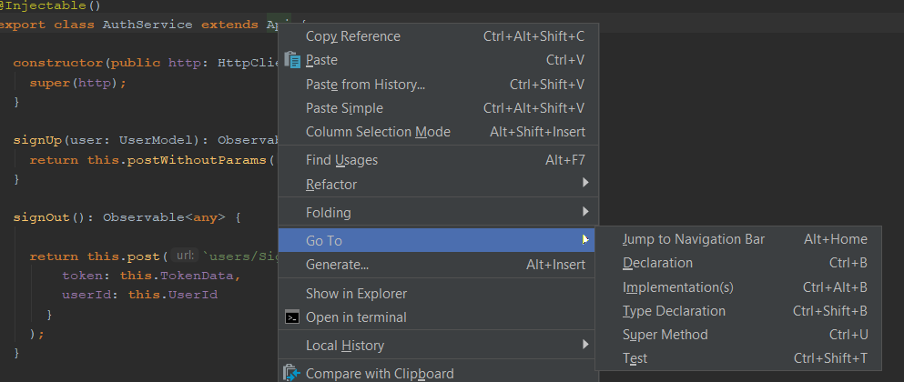{width="5.122417979002624in"
> height="2.1667946194225722in"}
>
> Также можно вызвать окно поиска по проекту:
>
> 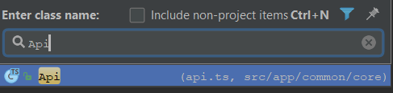{width="3.9097222222222223in"
> height="0.9312685914260718in"}
>
> Ctrl+N -- поиск класса
>
> Ctrl+Shift+N -- поиск файла
>
> Ctrl+Shift+Alt+N -- поиск символа, полезно при поиске по config-файлам
>
> Для перемещения между вкладками используются сочетания Ctrl + Alt +
> Right и Ctrl + Alt + Left

b.  Регулярки

```{=html}
<!-- -->
```
2.  Лаунчеры

Все настройки по лаунчерам хранятся в Settings/ Languages& Frameworks

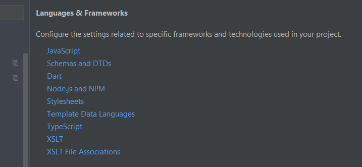{width="3.4965277777777777in"
height="1.6141568241469817in"}

a.  Компиляторы

> Встроенные компиляторы: JS, Sass, Less, and SCSS

b.  Линтеры

> Список поддерживаемых линтеров JS и их настройку можно посмотреть в
> Code Quality tools
>
> 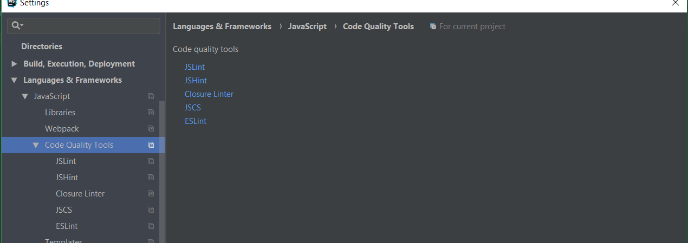{width="4.533214129483815in"
> height="1.6024978127734033in"}
>
> 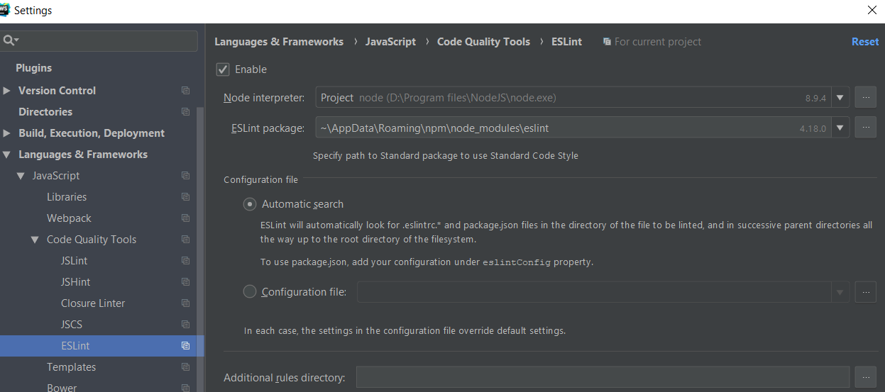{width="4.588888888888889in"
> height="2.0350087489063866in"}
>
> Кроме того, из коробки имеется поддержка StyleLint для CSS и TSLint
> для TypeScript

c.  Интерпретаторы

> В Webstorm можно использовать и настраивать интерпретаторы Dart и
> Node.js
>
> 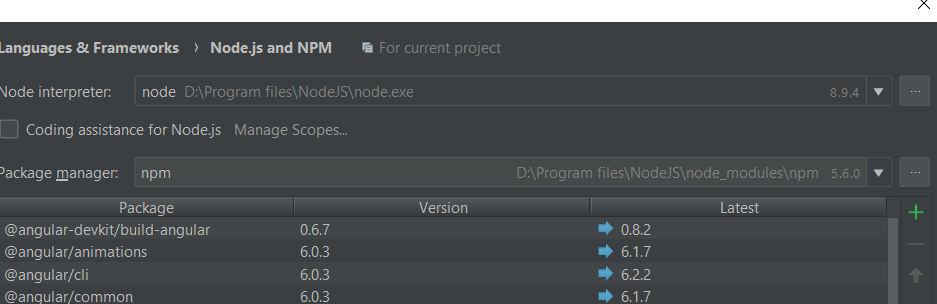{width="5.013888888888889in"
> height="1.6264840332458443in"}

d.  Трансляторы

> IDE поддерживает трансляторы для ES6, Typescript и CoffeeScript
>
> 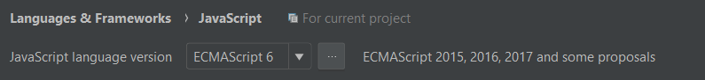{width="7.873611111111111in"
> height="0.9013888888888889in"}

e.  Линкеры

> Интегрированные линкеры: Webpack, Bower

f.  Скрипты

> Grunt, Gulp

3.  Горячие клавиши

Посмотреть список активных горячих клавиш и изменить их можно в меню
Settings/Keymap.

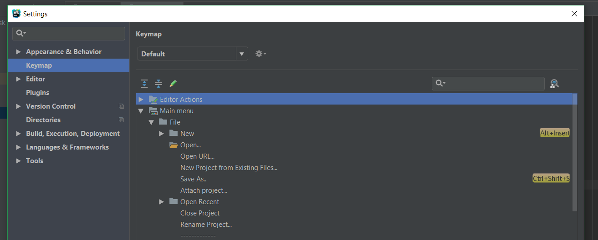{width="4.902777777777778in"
height="1.9714041994750655in"}

Также есть pdf файл с горячими клавишами в help/keymap reference

Самые популярные сочетания клавиш:

Ctrl+Shift+A -- Find action -- поиск по всем доступным командам и
настройкам IDE

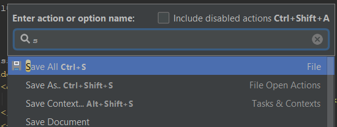{width="3.1875in"
height="1.1996587926509186in"}

Ctrl+E -- показывает список недавно открытых файлов

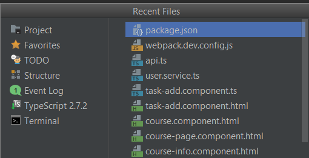{width="3.0625in"
height="1.5672790901137357in"}

Alt+Enter -- показывает список возможных действий

{width="3.6180555555555554in"
height="0.7331321084864392in"}

Ctrl+Space -- дописывает имена классов, методов и т.д.

Ctrl+/ - закомментировать/раскомментировать код

Ctrl+Shift+/ - закомментировать/раскомментировать блочный код

Ctrl+Shift+F7 -- показывает все использования выбранного фрагмента в
файле

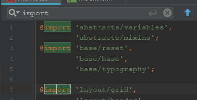{width="3.298611111111111in"
height="1.6865080927384077in"}

Ctrl+Shift+Alt+T - рефакторинг

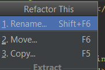{width="1.4513888888888888in"
height="0.9622462817147857in"}

Ctrl+Alt+L -- форматирование кода

4.  VCS

Настроить работу с VCS можно в меню Settings/VCS, здесь нужно прописать
путь к нужному файлу, в данному случае, к git.exe

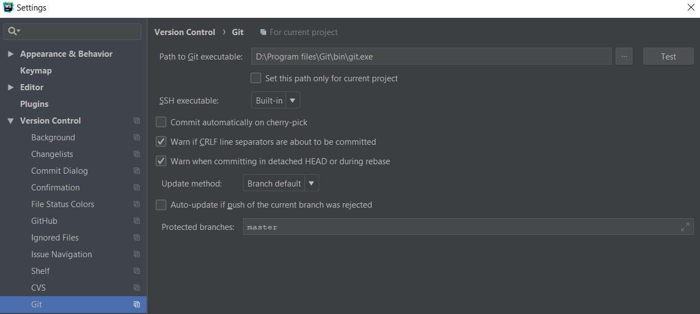{width="5.055555555555555in"
height="2.270051399825022in"}

Alt+\` - просмотр возможных операций VCS

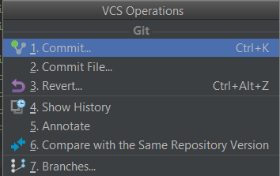{width="2.2569444444444446in"
height="1.4217475940507436in"}

a.  Pull Request

b.  Commit (ctrl+k)

> 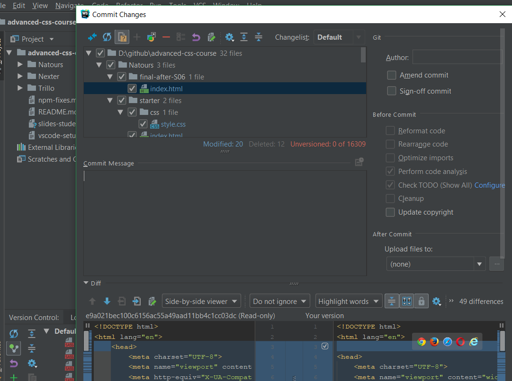{width="3.211537620297463in"
> height="2.394630358705162in"}
>
> 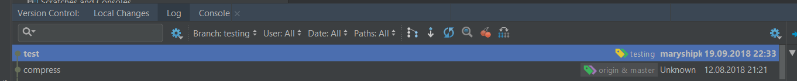{width="6.412073490813648in"
> height="0.6588517060367454in"}

c.  Push

> 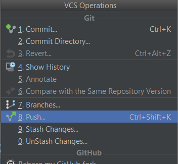{width="2.2438035870516186in"
> height="2.072387357830271in"}
>
> {width="3.0590813648293964in"
> height="2.7042836832895887in"}

d.  Rebase

> Пкм на окне VCS в нужной ветке
>
> 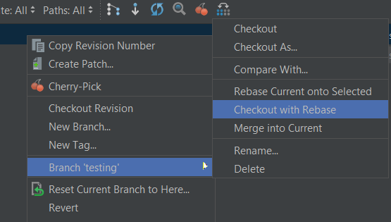{width="3.7374464129483815in"
> height="2.1224660979877514in"}

e.  Diff

> Показывается в окне
> коммита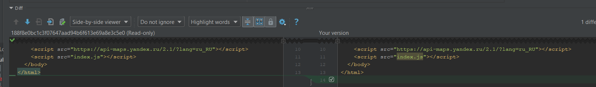{width="6.995406824146982in"
> height="1.0316032370953632in"}

f.  History

> Историю изменений файла можно посмотреть в VCS/Local history
>
> 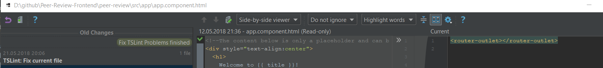{width="6.741666666666666in"
> height="0.7634765966754156in"}
>
> Историю всех коммитов можно посмотреть на окне version control на
> нижней панели
>
> 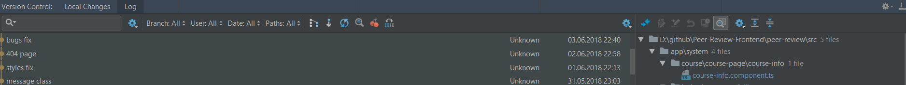{width="7.533333333333333in"
> height="0.7149289151356081in"}

5.  Стили

Настроить внешний вид IDE можно в меню Settings/Appearance & Behaviors

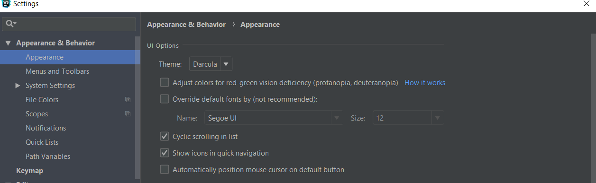{width="7.3805555555555555in"
height="2.2724923447069116in"}

Стиль кода настраивается в Settings/Editor

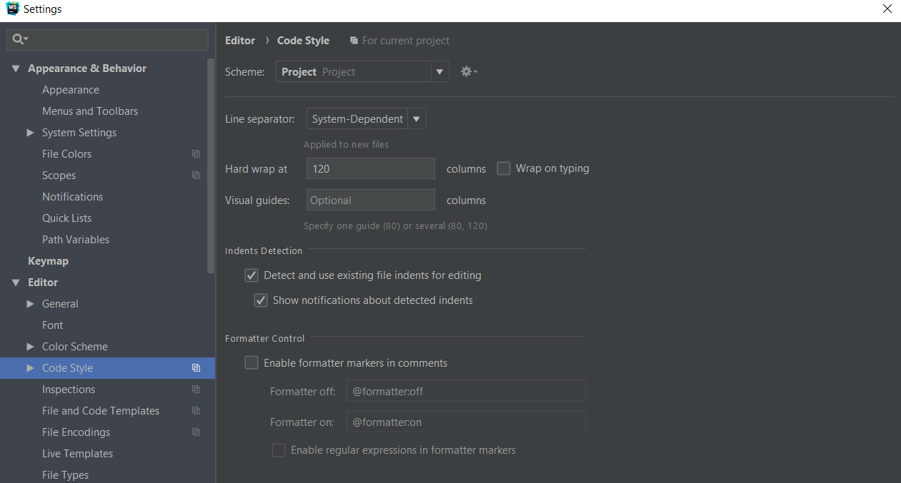{width="5.275215441819772in"
height="2.8320898950131235in"}

Тут также можно настроить автодополнение кода (Emmet).
