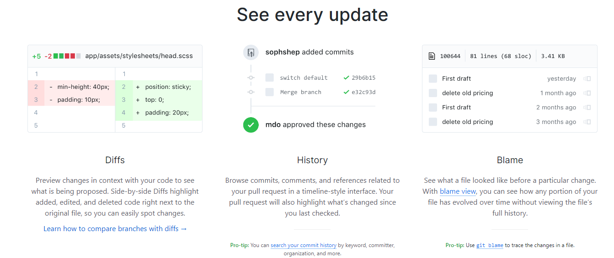
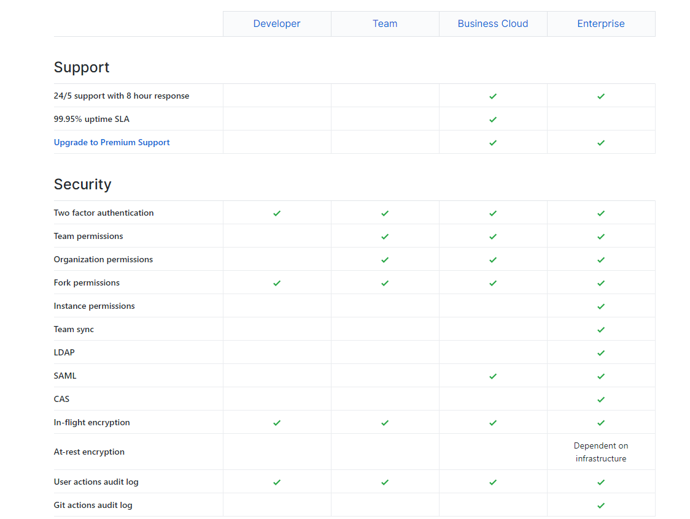
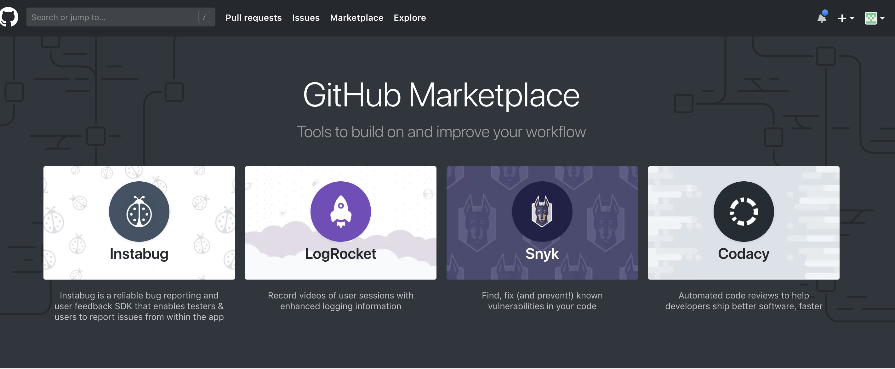
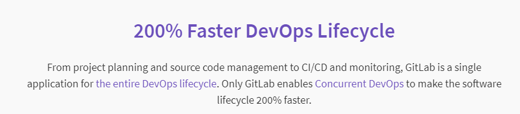
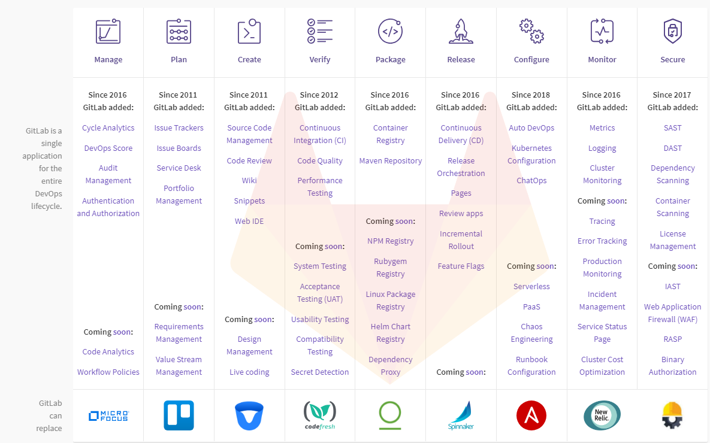
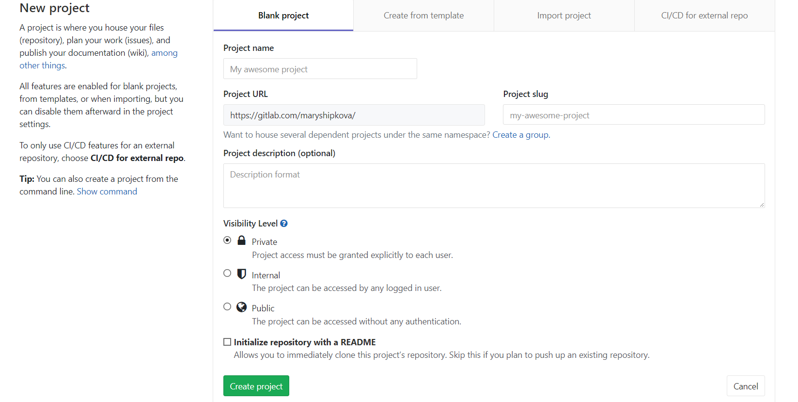
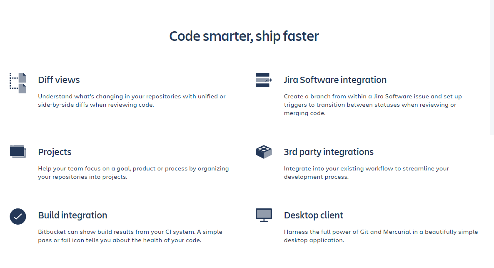
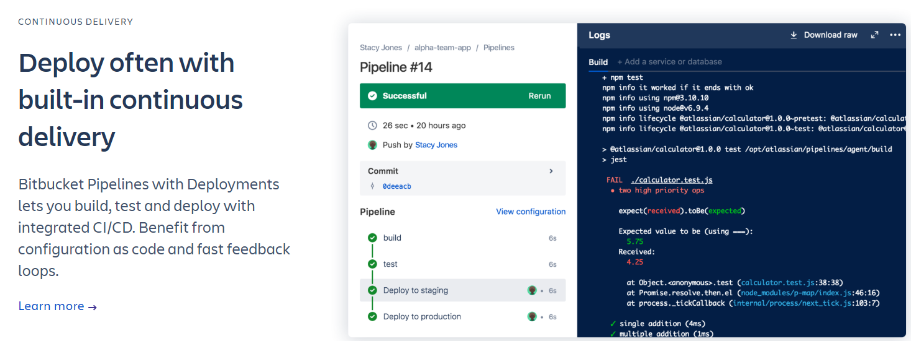
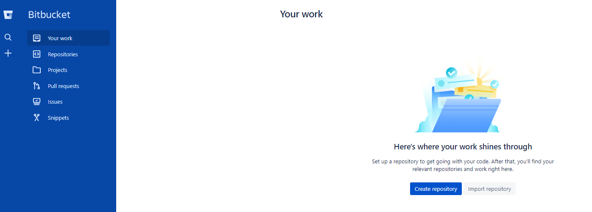
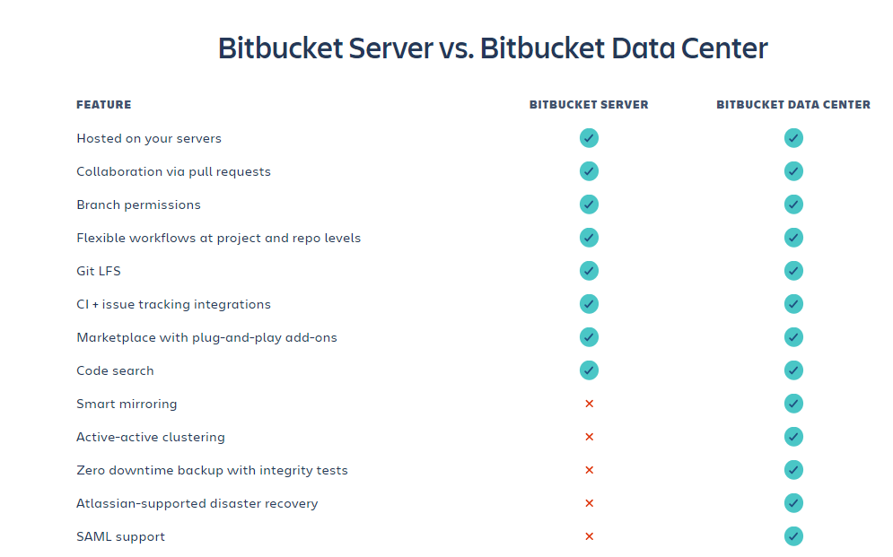

МИНИСТЕРСТВО ОБРАЗОВАНИЯ И НАУКИ РОССИЙСКОЙ ФЕДЕРАЦИИ\
ФЕДЕРАЛЬНОЕ ГОСУДАРСТВЕННОЕ АВТОНОМНОЕ ОБРАЗОВАТЕЛЬНОЕ УЧРЕЖДЕНИЕ
ВЫСШЕГО ОБРАЗОВАНИЯ

«Санкт-Петербургский национальный исследовательский университет

информационных технологий, механики и оптики»

Факультет информационных технологий и программирования

Кафедра информационных систем

Лабораторная работа № 4

Системы управления репозиториями

> Выполнили студенты:\
> Шипкова Мария M3303
>
> Проверил:
>
> Липкин Евгений Олегович

САНКТ--ПЕТЕРБУРГ

2018

1.  Github

Самая популярная система управления репозиториями. Имеет множество
build-in функций: интеграция с Git, code-sharing, bug-tracking и т.д. .
Используется не только для open-source проектов: имеется возможность
создания приватных репозиториев, но платно.

Основные фичи с самого сайта

{width="6.155129046369204in"
height="2.1818186789151355in"}

Удобная визуализация гита

{width="5.626793525809274in"
height="2.3712128171478564in"}

Присутствуют элементы соц сети: можно фолловить других пользователей,
ставить звёздочки репозиториям и отслеживать активность пользователей.

{width="6.607226596675416in"
height="1.5in"}

{width="5.94323709536308in"
height="1.6899803149606298in"}

Доски только для организаций

{width="6.149575678040245in"
height="1.8495363079615048in"}

Бесплатен для проектов с открытым исходным кодом, но есть и тарифные
планы:

{width="5.341839457567804in"
height="3.4318186789151355in"}

{width="5.5091119860017495in"
height="4.151514654418198in"}

{width="5.2364260717410325in"
height="3.8333333333333335in"}

Плагины для github

{width="6.306681977252843in"
height="2.600991907261592in"}

Полезны для тех, кто использует CI, например для pull-request

{width="5.046839457567804in"
height="2.9943635170603673in"}

Примеры плагинов для интеграции github, например с Jira.

{width="5.771248906386702in"
height="3.5249518810148732in"}

{width="5.010926290463692in"
height="2.1439402887139107in"}

2.  Gitlab

Позиционирует себя как единственное приложение, нужное для DevOps,
включая в себя тулзы для CI/CD, систему управления проектами,
баг-трекинг, интеграция с другими системами управления репозиториями и
др.

{width="5.6375in"
height="1.236590113735783in"}

{width="5.727245188101487in"
height="3.5763713910761155in"}

Github можно бесплатно установить на собственный сервер и настроить под
свои нужды. При этом он существует еще и в качестве SaaS --- после
регистрации можно бесплатно создавать приватные репозитории для
совместной работы.

Интерфейс похож на Github

{width="5.588888888888889in"
height="2.8131758530183726in"}

Подписки и их возможности:

{width="4.932638888888889in"
height="4.072538276465441in"}

3.  Bitbucket

Bitbucket --- продукт компании Atlassian, поэтому поддерживает
интеграцию с другими их проектами, такими как JIRA, Trello.

Платформа ориентирована на большие компании, но предлагает и бесплатный
тариф для команд до пяти человек. Позволяет создавать неограниченное
количество приватных репозиториев

С главной страницы предлагает импортировать репозитории с Github.

> {width="5.2347222222222225in"
> height="3.4627285651793525in"}
>
> Основные фичи с главной страницы
>
> {width="6.320581802274716in"
> height="3.426760717410324in"}
>
> Также предлагает CI/CD из коробки
>
> {width="5.866666666666666in"
> height="2.204786745406824in"}
>
> И туториалы по гиту.
>
> {width="5.838888888888889in"
> height="3.1048392388451442in"}
>
> При регистрации спрашивает про нужды пользователя.
>
> {width="5.500947069116361in"
> height="3.5912478127734033in"}
>
> Интерфейс как у JIRA
>
> {width="5.699368985126859in"
> height="2.0453991688538933in"}
>
> Создание проекта
>
> {width="4.729755030621172in"
> height="4.467847769028872in"}

Подписки:

{width="5.9711614173228345in"
height="4.39121062992126in"}

BitBucket Сервер

{width="5.820580708661417in"
height="3.632600612423447in"}

Сервис интегрирован c инструментами развёртывания приложений AWS
CodeDeploy и Deploy to Azure, Docker, npm и др.

Выводы

Github хороший сервис для open-source, однако Gitlab предоставляет
гораздо больше инструментов для enterprise разработки. Bitbucket, по
моему мнению полезен только тем командам, которые используют Jira,
однако если по некоторым причинам команде не нравится Gitlab, то
Bitbucket оптимальная альтернатива.
