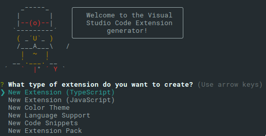
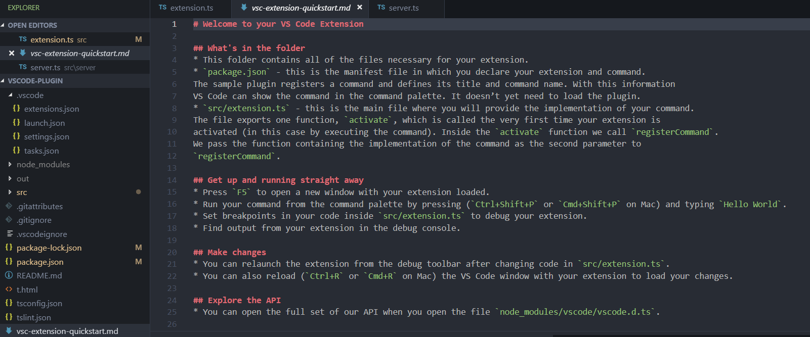
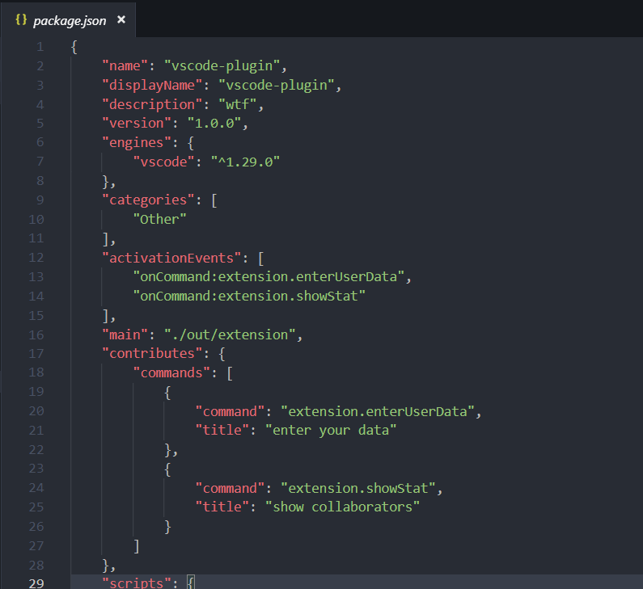
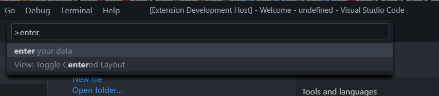
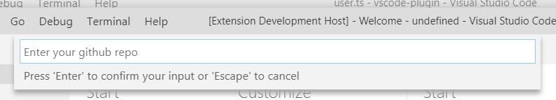
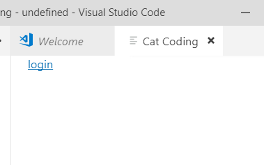
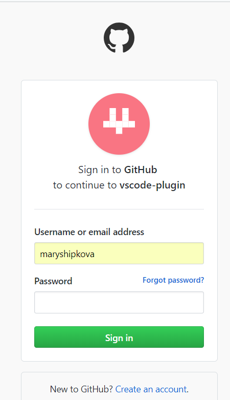
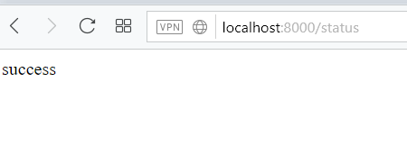
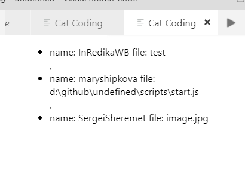

МИНИСТЕРСТВО ОБРАЗОВАНИЯ И НАУКИ РОССИЙСКОЙ ФЕДЕРАЦИИ\
ФЕДЕРАЛЬНОЕ ГОСУДАРСТВЕННОЕ АВТОНОМНОЕ ОБРАЗОВАТЕЛЬНОЕ УЧРЕЖДЕНИЕ
ВЫСШЕГО ОБРАЗОВАНИЯ

«Санкт-Петербургский национальный исследовательский университет

информационных технологий, механики и оптики»

Факультет информационных технологий и программирования

Кафедра информационных систем

Лабораторная работа № 5

Руководство по созданию плагинов для IDE VS Code

> Выполнили студенты:\
> Шипкова Мария M3303
>
> Проверил:
>
> Липкин Евгений Олегович

САНКТ--ПЕТЕРБУРГ

2018

О VS Code

VS Code -- редактор, написанный на языке Typescript на движке Electron,
который позволяет писать настольные приложения при помощи
веб-технологий. Расширения для VS Code также пишутся на typescript или
javascript.

All VS Code extensions share a common model of contribution
(registration), activation (loading) and access to the VS Code
extensibility API. There are however two special flavors of VS Code
extensions, language servers and debuggers, which have their own
additional protocols and are covered in their own sections of the
documentation.

-   Extensions -- базовый блок

-   Языковые сервера (Language Server) - расширения, улучшающие
    возможности редактирования с помощью протокола языкового сервера
    (Language server protocol).

> Языковые сервера используются для создания расширений, направленных на
> улучшения поддержки различных языков программирования в VS code, таких
> как

autocomplete, error-checking.

В документации разработчики выделили 3 основных проблемы, возникающих
при работе с языковыми серверами.

Во-первых, сами сервера зачастую имплементируются в своём нативном
языке, что может быть не очень удобно интегрировать с VS Code и Node.js

Во-вторых, эти сервера едят довольно много ресурсов. Например, чтобы
валидировать файл, серверу нужно сначала распарсить кучу файлов,
построить дерево файлов и только потом произвести статический анализ.

В-третьих, интеграция множеств средств поддержки языков со множеством
редакторов требует различных костылей для адаптации API

> Для решения этих проблем, в Microsoft'е придумали Language server
> protocol, который помогает стандартизировать коммуникацию между
> инструментами языка и редактором кода, таким образом языковые сервера
> могут быть написаны на любом языке и вызываться в своём потоке для
> того, чтобы не падала производительность.

{width="7.369122922134733in"
height="3.408333333333333in"}

-   Debug adapter- wire up an external debugger through a Debug Adapter

VS Code implements a generic debugger UI and relies on debugger
extensions and so called \"debug adapters\" to connect the debug UI to a
real debugger or runtime. A debug adapter is a dedicated process that
communicates with VS Code through the *VS Code Debug Protocol* and can
be implemented in any language.

{width="7.113532370953631in"
height="4.4in"}

The reasons for implementing the debug adapters as standalone
executables are twofold: first, it makes it possible to implement the
adapter in the language most suitable for the given debugger or runtime.
Second, a standalone program can more easily run in elevated mode if
this is required by the underlying debugger or runtime.

In order to avoid problems with local firewalls, VS Code communicates
with the adapter through stdin/stdout instead of using a more
sophisticated mechanism (e.g. sockets).

Every debug extension defines a debug type which is referenced from a VS
Code launch configuration. When a debug session is started, VS Code
looks up the debug extension based on the debug type and launches the
extension\'s debug adapter executable as a separate process. When the
debug session ends, the adapter is stopped.

{width="5.373166010498688in"
height="3.9405424321959757in"}

Visual Studio Code ships with a debug extension for Node.js. Many more
debugger extensions are available from the VS Code Marketplace or you
can create a debugger extension yourself.

The rest of this document shows how to develop a debugger extension.

Все расширения работают в отдельном процессе, это сделано не только для
повышения производительности, но и для того, чтобы поломка одного
расширения не привела к краху всего редактора.

Расширения включают в себя поддержку настроек:

-   Активации -- запуск плагина при открытии файла специального вида,
    например запуск Markdown viewer при открытии .md файлов. Также
    запуск плагина можно настроить на комбинацию клавиш или выбор из
    списка команд.

-   Редактора -- плагины могут читать и редактировать текст.

-   Рабочего окружения -- возможность управлять различными окнами и
    сообщения редактора.

-   Событий -- возможность прослушивания и подписки на различные
    события, генерируемые редактором.

-   Расширенного редактирования -- разработка расширения для улучшений
    IntelliSense, линтеров и др.

VSCode поддерживает режим отладки для плагинов: во время отладки
открывается отдельное окно редактора, в котором можно запустить
написанный плагин. Однако режим дебага открывается очень медленно и не
всегда запускаются плагины.

Как начать

На официальном сайте можно найти подробный гайд по быстрой установке
всех необходимых компонентов для разработки с помощью генератора Yeoman
<https://code.visualstudio.com/docs/extensions/yocode>

{width="5.563141951006124in"
height="2.841666666666667in"}

В результате появляется множество различных файлов для разработки
плагинов, кроме того, в одном из файлов можно найти подробное объяснение
для чего они нужны и с чего начать разрабатывать расширение.

{width="7.873611111111111in"
height="3.2805555555555554in"}

Вся мета-информация о плагине находится в файле package.json, там же
можно зарегистрировать команды, которые можно ввести в поисковую строку
VS Code и запустить плагин.

{width="5.558333333333334in"
height="5.097017716535433in"}

{width="7.348611111111111in"
height="1.6177569991251093in"}

VSCode API

API подробно расписано в файле деклараций index.d.ts.

Для того, чтобы использовать VSCode extension API нужно сделать import
модуля vscode. VSCode использует CommonJS модули, так что в javascript
нужно использовать функцию require()

import \* as vscode from \'vscode\';

После запуска редактора запускаются и плагины, чтобы можно было вызвать
команды нужно сначала имплементировать функцию activate(), которая
вызывается при активации плагинов

export function activate(context: vscode.ExtensionContext) {

Внутри этой функции регистрируются команды и добавляются в контекст
расширения.

let disposable = vscode.commands.registerCommand(\'extension.sayHello\',
() =\> {

// весь код здесь будет выполнен каждый раз при запуске команды

// показ окна с сообщением

vscode.window.showInformationMessage(\'Hello World!\');

});

// добавление команды в подписчики контекста расширения

context.subscriptions.push(disposable);

}

В подписчики контекста расширения также можно добавить обработчик
события

context.subscriptions.push(vscode.window.onDidChangeActiveTextEditor(()
=\> {

//вывод открытого файла

console.log(vscode.window.activeTextEditor.document.uri.fsPath);

}));

Webview API

Данный вид API позволяет использовать окна с полностью кастомизируемым
содержимым в редакторе: веб-отображение может отрендерить любой валидный
HTML код, что полезно при, например, отображение вёрстки Markdown. Кроме
того, в веб-отображение возможно передавать сообщения и получать
сообщения из него.

import \* as vscode from \'vscode\';

export function activate(context: vscode.ExtensionContext) {

context.subscriptions.push(vscode.commands.registerCommand(\'catCoding.start\',
() =\> {

// создание и показ веб-отображения

const panel = vscode.window.createWebviewPanel(

\'catCoding\', // тип отображение

\"Cat Coding\", // название, которое будет отображено сверху

vscode.ViewColumn.One, // показывает колонну, в которой будет открыто
отображение

{ } // контент

);

}));

}

Выглядит оно так

{width="7.022548118985127in"
height="4.5679385389326335in"}

Создание контента (HTML) в веб-отображении

import \* as vscode from \'vscode\';

export function activate(context: vscode.ExtensionContext) {

context.subscriptions.push(vscode.commands.registerCommand(\'catCoding.start\',
() =\> {

// Create and show panel

const panel = vscode.window.createWebviewPanel(\'catCoding\', \"Cat
Coding\", vscode.ViewColumn.One, { });

// And set its HTML content

panel.webview.html = getWebviewContent();

}));

}

function getWebviewContent() {

return \`\<!DOCTYPE html\>

\<html lang=\"en\"\>

\<head\>

\<meta charset=\"UTF-8\"\>

\<meta name=\"viewport\" content=\"width=device-width,
initial-scale=1.0\"\>

\<title\>Cat Coding\</title\>

\</head\>

\<body\>

\

\</body\>

\</html\>\`;

}

{width="6.4319444444444445in"
height="4.168453630796151in"}

Данная панелька может быть закрыта, например, с помощью вызова функции
dispose(), а если мы хотим ещё и избавиться от каких-нибудь обработчиков
внутри панели, то можно имплементировать событие onDidDispose

// After 5sec, pragmatically close the webview panel

const timeout = setTimeout(() =\> panel.dispose(), 5000)

panel.onDidDispose(() =\> {

// Handle user closing panel before the 5sec have passed

clearTimeout(timeout);

}, null, context.subscriptions)

Также панель можно обновлять с помощью события onDidChangeViewState, в
данном примере панель обновляется каждый раз когда в ней изменяется
html.

panel.onDidChangeViewState(e =\> {

const panel = e.webviewPanel;

switch (panel.viewColumn) {

case vscode.ViewColumn.One:

updateWebviewForCat(panel, \'Coding Cat\');

return;

case vscode.ViewColumn.Two:

updateWebviewForCat(panel, \'Compiling Cat\');

return;

case vscode.ViewColumn.Three:

updateWebviewForCat(panel, \'Testing Cat\');

return;

}

}, null, context.subscriptions);

}));

}

function updateWebviewForCat(panel: vscode.WebviewPanel, catName: keyof
typeof cats) {

panel.title = catName;

panel.webview.html = getWebviewContent(cats\[catName\]);

}

Передача сообщений в функцию

Мы можем в отображении подписаться на событие 'message', а в плагине
использовать конструкцию currentPanel.webview.postMessage()

currentPanel.webview.postMessage({ command: \'refactor\' });

}));

}

function getWebviewContent() {

return \`\<!DOCTYPE html\>

\<html lang=\"en\"\>

\<head\>

\<meta charset=\"UTF-8\"\>

\<meta name=\"viewport\" content=\"width=device-width,
initial-scale=1.0\"\>

\<title\>Cat Coding\</title\>

\</head\>

\<body\>

\

\<h1 id=\"lines-of-code-counter\"\>0\</h1\>

\<script\>

const counter = document.getElementById(\'lines-of-code-counter\');

let count = 0;

setInterval(() =\> {

counter.textContent = count++;

}, 100);

// Handle the message inside the webview

window.addEventListener(\'message\', event =\> {

const message = event.data; // The JSON data our extension sent

switch (message.command) {

case \'refactor\':

count = Math.ceil(count \* 0.5);

counter.textContent = count;

break;

}

});

\</script\>

\</body\>

\</html\>\`;

Передача сообщений из панели

В следующем примере в теге \<script\> прописывается самовызывающаяся
функция, которая использует встроенные возможности API для передачи
сообщения наружу. В свою очередь панель может подписаться на событие
получения сообщения onDidReceiveMessage

panel.webview.html = getWebviewContent();

// Handle messages from the webview

panel.webview.onDidReceiveMessage(message =\> {

switch (message.command) {

case \'alert\':

vscode.window.showErrorMessage(message.text);

return;

}

}, undefined, context.subscriptions);

}));

}

function getWebviewContent() {

return \`\<!DOCTYPE html\>

\<html lang=\"en\"\>

\<head\>

\<meta charset=\"UTF-8\"\>

\<meta name=\"viewport\" content=\"width=device-width,
initial-scale=1.0\"\>

\<title\>Cat Coding\</title\>

\</head\>

\<body\>

\

\<h1 id=\"lines-of-code-counter\"\>0\</h1\>

\<script\>

(function() {

const vscode = acquireVsCodeApi();

const counter = document.getElementById(\'lines-of-code-counter\');

let count = 0;

setInterval(() =\> {

counter.textContent = count++;

// Alert the extension when our cat introduces a bug

if (Math.random() \< 0.001 \* count) {

vscode.postMessage({

command: \'alert\',

text: \'🐛 on line \' + count

})

}

}, 100);

}())

\</script\>

\</body\>

\</html\>\`;

}

Имплементация github collaborators viewer.

В данном плагине используется 2 команды:

-   одна команда просит ввести имя пользователя на гитхабе и ссылку на
    репозиторий, из которого будут браться коллабораторы. Затем
    открывается окно, где нужно перейти по ссылке на OAuth авторизацию
    на гитхабе, там же нужно предоставить доступ приложению к данным
    пользователя.

> {width="6.877384076990376in"
> height="1.2416666666666667in"}
>
> {width="3.089583333333333in"
> height="1.9320089676290464in"}
>
> {width="4.6875in"
> height="8.135416666666666in"}
>
> Отправка токена на сервер, для сохранения в БД
>
> {width="4.3055577427821525in"
> height="1.55in"}

-   Вторая команды вызывается после первой и каждый раз открывает окно
    со списком коллабораторов и файлами, над которыми они работают.

{width="4.1375in"
height="3.1384448818897637in"}

Для работы с данными пользователей можно использовать такой класс.

export class User {

username: string;

repo: string;

currFile ? : string \| null;

access\_token ? : string \| null;

login?: any;

constructor(username: string, repo: string, currFile ? : string) {

this.username = username;

this.repo = repo;

this.currFile = currFile ? currFile : \'\';

}

post(currFile ? : string \| null) {

this.currFile = currFile ? currFile : \'\';

let options = {

uri: \'http://localhost:8000/user\',

body: {

user: this

},

json: true // Automatically stringifies the body to JSON

};

return rp.post(options).then(function (response){

return response.user;

});

}

update(item){

if( this.username === item.username){

if( item.currFile && item.currFile.length){

this.currFile = item.currFile;

}

if( item.access\_token && item.access\_token.length){

this.access\_token = item.access\_token;

}

if( item.repo && item.repo.length){

this.repo = item.repo;

}

}

}

}

В БД хранятся следующие данные пользователя

{

\"username\": \"maryshipkova\",

\"access\_token\": \"5c2466131be173f5836b8dd8d0aef172b827c3b7\",

\"repo\": \"https://api.github.com/repos/TEF-Dev/UML-Peer-Review\",

\"currFile\": \"d:\\\\github\\\\undefined\\\\server\\\\log.json\"

},

Имплементация первой команды

let user: User;

context.subscriptions.push(vscode.commands.registerCommand(\'extension.enterUserData\',
() =\> {

let username = \'\';

let repo = \'\';

vscode.window.showInputBox({

placeHolder: \"Enter your github username\"

}).then(value =\> {

if (!value) {

return;

}

username = value;

}).then(() =\>

vscode.window.showInputBox({

placeHolder: \"Enter your github repo\"

}).then(value =\> {

if (!value) {

return;

}

repo = value;

user = new User(username, repo);

> //отправка данных на сервер

user.post().then((data) =\> {

user.update(data);

openPanel();

});

}));

}));

Функция openPanel() открывает панель с данными, в случае, если там не
передаются данные коллабораторов, то функция показывается ссылку на
логин на гитхабею Если в функцию передаются данные, то открывается окно
со списком коллабораторов.

function openPanel(collaborators ? : User\[\]) { //user: User

const panel = vscode.window.createWebviewPanel(\'catCoding\', \"Cat
Coding\", vscode.ViewColumn.Two, {

// Enable scripts in the webview

enableScripts: true

});

// set its HTML content

panel.webview.html = getWebviewContent(collaborators);

}

function getWebviewContent(collaborators ? : User\[\]) {

let htmlLiElements = \[\'\'\];

let login = \'\';

if (collaborators){

htmlLiElements = collaborators.map(element =\> \`\<li\>name:
\${element.username} file: \${element.currFile?element.currFile: \'not
found\'}\</li\>\`);

}else{

login = \'\<a
href=\"https://github.com/login/oauth/authorize?client\_id=b339d81d4106e3c963d6&scope=user,read:org,repo\"
target=\"\_blank\"\>login\</a\>\';

}

return \`\<!DOCTYPE html\>

\<html lang=\"en\"\>

\<head\>

\<meta charset=\"UTF-8\"\>

\<meta name=\"viewport\" content=\"width=device-width,
initial-scale=1.0\"\>

\<title\>Cat Coding\</title\>

\</head\>

\<body\>

\${login}

\<ul\>

\${htmlLiElements}

\</ul\>

\</body\>

\</html\>\`;

}

Имплементация второй команды

context.subscriptions.push(vscode.commands.registerCommand(\'extension.showStat\',
() =\> {

getCollaborators(user).then((users) =\> {

const options = {

method: \'POST\',

url: \'http://localhost:8000/users\',

body:{

users

},

json: true // Automatically stringifies the body to JSON

};

rp(options).then((body) =\> {

openPanel(body.users);

});

});

//подписка на изменения открытого файла

context.subscriptions.push(vscode.window.onDidChangeActiveTextEditor(()
=\> {

user.post(vscode.window.activeTextEditor.document.uri.fsPath);

}));

}));

Получение данных коллабораторов

function getCollaborators(user: User) {

const options = {

method: \'GET\',

url:
\`\${user.repo}/collaborators?access\_token=\${user.access\_token}\`,

headers: {

\'User-Agent\': \'vscode-plugin\'

},

json: true // Automatically stringifies the body to JSON

};

return rp(options).then((body) =\> {

return body.map(c =\> c.login);

});

}

Серверная часть

Класс работы с БД

const low = require(\'lowdb\');

const FileSync = require(\'lowdb/adapters/FileSync\');

export class DbApi {

db: any;

constructor(filePath) {

const adapter = new FileSync(filePath);

this.db = low(adapter);

}

setUserData(user:User){

// console.log(this.getData());

// this.setData(user);

let currUserArray = this.getData().filter(item =\> item.username ===
user.username);

if(currUserArray.length){

this.updateUserData(user);

}else{

this.setData(user);

}

}

setData(data:any) {

this.db.get(\'data\')

.push(data)

.write();

return true;

}

//TODO: refactoring

updateUserData(user:User) {

let newState = this.db.getState();

newState.data.map(item =\>{

if( item.username === user.username){

if( user.currFile && user.currFile.length){

item.currFile = user.currFile;

}

if( user.access\_token && user.access\_token.length){

item.access\_token = user.access\_token;

console.log(item.access\_token);

}

if( user.repo && user.repo.length){

item.repo = user.repo;

}

console.log(\'upd\', item);

}

return item;

});

this.db.setState(newState).write();

return true;

}

getData() {

return this.db.getState().data;

}

getUserData(username:string) {

return this.getData().filter(item =\> item.username === username)\[0\];

}

}

Обработка OAuth гитхаба

app.get(\"/status\", (request: express.Request, response:
express.Response) =\> {

let token = \"\";

req.post(

\'https://github.com/login/oauth/access\_token\', {

json: {

code: request.query.code,

client\_id: \"b339d81d4106e3c963d6\",

client\_secret: \"43c030a10001495119d0e5057ab9dd6a5747b395\"

}

},

function (error, response, body) {

if (!error && response.statusCode === 200) {

if (body.access\_token) {

token = body.access\_token;

req({

url:
\`https://api.github.com/user?access\_token=\${token}&client\_id=b339d81d4106e3c963d6\`,

headers: {

\'User-Agent\': \'vscode-plugin\'

}

},

(error, response, body) =\> {

let user = new User(JSON.parse(body).login, \'\');

console.log(\'body\', user, body.login);

user.access\_token = token;

dbApi.setUserData(user);

});

}

}

}

);

response.send(\"success\");

});

Сохранение и обновление данных пользователя

app.post(\"/user\", (request: express.Request, response:
express.Response) =\> {

let {

user

} = request.body;

dbApi.setUserData(user);

console.log(user.username, dbApi.getUserData(user.username));

response.json({

user: dbApi.getUserData(user.username)

});

});
