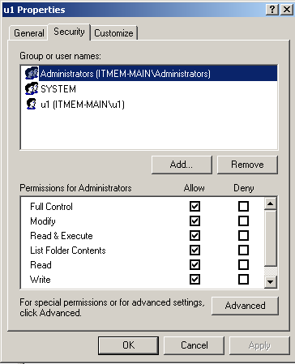

МИНИСТЕРСТВО ОБРАЗОВАНИЯ И НАУКИ РОССИЙСКОЙ ФЕДЕРАЦИИ

ФЕДЕРАЛЬНОЕ ГОСУДАРСТВЕННОЕ АВТОНОМНОЕ ОБРАЗОВАТЕЛЬНОЕ УЧРЕЖДЕНИЕ
ВЫСШЕГО ОБРАЗОВАНИЯ

«Санкт -- Петербургский национальный исследовательский университет
информационных технологий, механики и оптики»

Факультет информационных технологий и программирования

Кафедра информационных систем

Лабораторная работа №1

**Разграничение доступа к папкам, файлам и к разделам реестра.**

> > Выполнил студент группы №M3405:
>
> > Малинин Александр Сергеевич
>
> Проверил
>
> Хегай Максим Вилорьевич

САНКТ -- ПЕТЕРБУРГ

2020

Разграничение доступа к папкам
------------------------------

1.11

{width="3.3119291338582677in"
height="4.031914916885389in"}

1.13

{width="3.110793963254593in"
height="3.97872375328084in"}

{width="3.129309930008749in"
height="4.0in"}

{width="3.0720669291338583in"
height="3.9680850831146106in"}

{width="3.287234251968504in"
height="4.2174136045494315in"}

{width="3.095744750656168in"
height="3.926932414698163in"}

{width="3.138390201224847in"
height="3.97872375328084in"}

1.14

{width="3.5392738407699036in"
height="3.0106386701662293in"}

1.18

{width="2.9680850831146106in"
height="3.641175634295713in"}

1.19

{width="2.915084208223972in"
height="3.5106386701662293in"}

{width="3.8130325896762907in"
height="4.646481846019247in"}

2.2

{width="3.781778215223097in"
height="5.209060586176728in"}

{width="5.740384951881015in"
height="4.813171478565179in"}

{width="3.8234503499562553in"
height="4.875680227471566in"}

{width="3.771359361329834in"
height="4.854844706911636in"}

{width="3.802613735783027in"
height="4.834008092738408in"}

{width="3.7921959755030623in"
height="4.834008092738408in"}

{width="3.802613735783027in"
height="4.834008092738408in"}

3.2

{width="3.8130325896762907in"
height="4.604809711286089in"}

{width="3.8442869641294837in"
height="4.594390857392826in"}

{width="3.875541338582677in"
height="4.552718722659668in"}

{width="3.865122484689414in"
height="4.604809711286089in"}

{width="3.875541338582677in"
height="4.615227471566055in"}

3.3.

{width="3.875541338582677in"
height="4.542300962379702in"}

{width="3.802613735783027in"
height="4.667318460192476in"}

4.2.

{width="3.7921959755030623in"
height="4.677736220472441in"}

{width="3.8338681102362204in"
height="4.6360640857392825in"}

{width="3.8338681102362204in"
height="4.698572834645669in"}

4.4.

{width="3.854704724409449in"
height="4.677736220472441in"}

{width="3.854704724409449in"
height="4.667318460192476in"}

{width="3.8234503499562553in"
height="4.625645231846019in"}

{width="3.854704724409449in"
height="4.604809711286089in"}

{width="3.8338681102362204in"
height="4.688153980752406in"}

6\.

В чем отличие определения прав на доступ к разделам реестра посравнению
с определением прав на доступ к папкам и файлам?

Определять может только админ

Какие конкретно ветки и ключи доступны пользователю хотя бы на чтение;
только Администратору; только System. (Перечислить их названия.)?

Пользователю доступны все ветки на чтение. System и Admins полный доступ
ко всем.

Как обеспечивается операционной системой разграничение доступа к личным
документам пользователей (по умолчанию).

Папка per user в Documents and settings

Где (по умолчанию) должны находиться документы, предназначенные для
совместного использования.

All Users.
