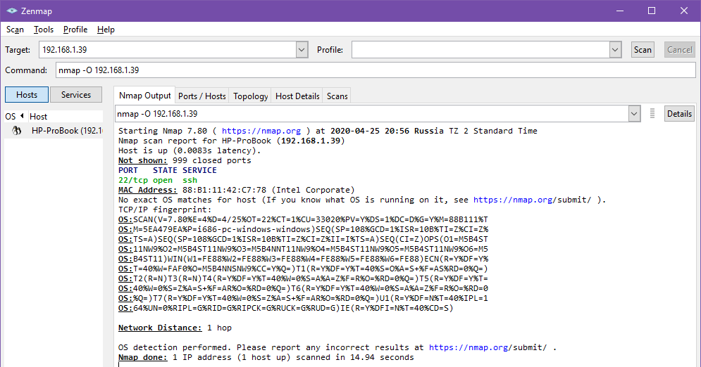
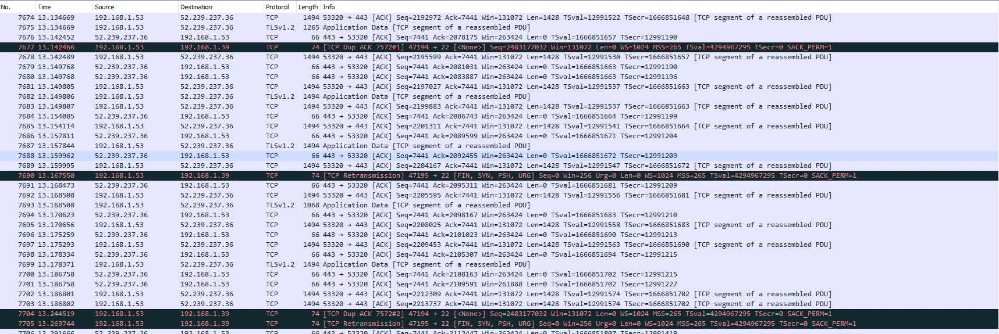
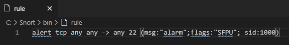
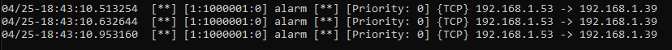

МИНИСТЕРСТВО НАУКИ И ВЫСШЕГО ОБРАЗОВАНИЯ РОССИЙСКОЙ ФЕДЕРАЦИИ

ФЕДЕРАЛЬНОЕ ГОСУДАРСТВЕННОЕ АВТОНОМНОЕ ОБРАЗОВАТЕЛЬНОЕ УЧРЕЖДЕНИЕ
ВЫСШЕГО ОБРАЗОВАНИЯ

«Санкт-Петербургский национальный исследовательский университет\
информационных технологий механики и оптики»

Факультет информационных технологий и программирования

Лабораторная работа №3

**\
Сетевая безопасность**

**\
\
\
\
\
\
\
\
**

> Выполнили\
> студенты группы М3405\
> Ивницкий Алексей\
> Лосицкий Евгений Игоревич
>
> Проверил:\
> Хегай Максим Вилорьевич

Санкт-Петербург\
2020

**Пункт 1. NMAP**

{width="6.5in"
height="3.4097222222222223in"}

**Пункт 2. Wireshark под NMAP**

{width="6.5in"
height="2.176388888888889in"}

Подозрительными пакетами оказались пакеты на 22 порт, отличительной
чертой были -- \[FIN, SYN, PSH, URG\].

При запуске без ключа -O не выявлено таких пакетов

**Пункт 3. Snort**

Описываем правило:

{width="6.000837707786527in"
height="0.9480489938757656in"}

Запускаем snort с аргументом "-c rule", обнаруживаем в логах ожидаемые
строчки

{width="6.5in"
height="0.48680555555555555in"}
