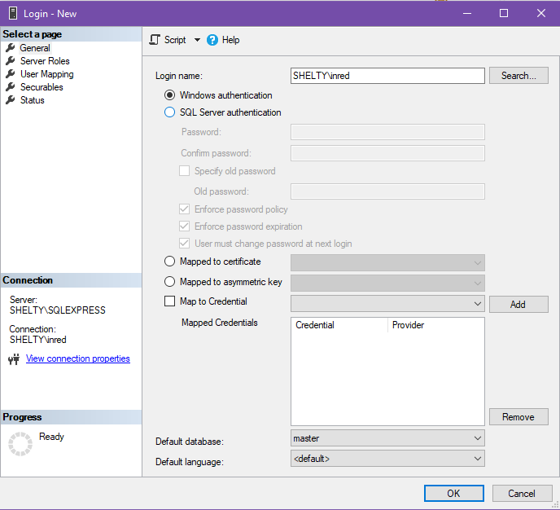
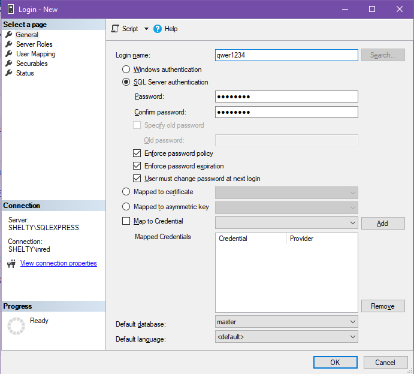

МИНИСТЕРСТВО НАУКИ И ВЫСШЕГО ОБРАЗОВАНИЯ РОССИЙСКОЙ ФЕДЕРАЦИИ

ФЕДЕРАЛЬНОЕ ГОСУДАРСТВЕННОЕ АВТОНОМНОЕ ОБРАЗОВАТЕЛЬНОЕ УЧРЕЖДЕНИЕ
ВЫСШЕГО ОБРАЗОВАНИЯ

«Санкт-Петербургский национальный исследовательский университет\
информационных технологий механики и оптики»

Факультет информационных технологий и программирования

Лабораторная работа №5

**\
Управление SQL сервером**

**\
\
\
\
\
\
\
\
**

> Выполнили\
> студенты группы М3405\
> Ивницкий Алексей\
> Лосицкий Евгений Игоревич
>
> Проверил:\
> Хегай Максим Вилорьевич

Санкт-Петербург\
2020

**Пункт 1.**

В качестве демонстрации будут взяты две таблицы из базы Chinook и
добавлена одна процедура:

CREATE TABLE \[Artist\]

(

\[ArtistId\] INTEGER NOT NULL,

\[Name\] NVARCHAR(120),

CONSTRAINT \[PK\_Artist\] PRIMARY KEY (\[ArtistId\])

);

CREATE TABLE \[Album\]

(

\[AlbumId\] INTEGER NOT NULL,

\[Title\] NVARCHAR(160) NOT NULL,

\[ArtistId\] INTEGER NOT NULL,

CONSTRAINT \[PK\_Album\] PRIMARY KEY (\[AlbumId\]),

FOREIGN KEY (\[ArtistId\]) REFERENCES \[Artist\] (\[ArtistId\])

ON DELETE NO ACTION ON UPDATE NO ACTION

);

CREATE PROCEDURE GetAlbumsByArtist

\@artist\_id INT

AS

BEGIN

SELECT \*

FROM \[Album\]

WHERE \[Album\].\[ArtistId\] = \@artist\_id

END

GO

**Пункт 2.**

Создание пользователя с логином и паролем подразумевает аутентификацию
по средствам SQL Server. Скрипт создания:\
CREATE LOGIN \[qwer1234\] WITH PASSWORD = 'qwer1234'

Пользователь с проверкой на уровне ОС -- это учетная запись, которая
соотноситься с учеткой из домена Active Directory. Для данонго
пользователя не требуется дополнительная аутентификация в SQL Server --
он использует домен для проверки подлинности. Создание сводиться к
добавлению имени пользователя AD в список логинов:\
CREATE LOGIN \[Shelty\\inred\] FROM WINDOWS

**Пункт 3.**

{width="6.5in"
height="5.914583333333334in"}

{width="6.5in"
height="5.870138888888889in"}

**Пункт 4.**

Роль сервера -- группы для управления правами доступа. Стандартные роли
(взяты с docs.microsoft.com):

  -----------------------------------------------------------------------------------------------------------------------------------------------------------------------------------------------------------------------------------------------------------------------------------------------------------------------------------------------------------------------------------------------------------------------------------------------
  **Предопределенная роль уровня сервера**   **Description**
  ------------------------------------------ ----------------------------------------------------------------------------------------------------------------------------------------------------------------------------------------------------------------------------------------------------------------------------------------------------------------------------------------------------------------------------------------------------
  **sysadmin**                               Члены предопределенной роли сервера **sysadmin** могут выполнять любые действия на сервере.

  **serveradmin**                            Элементы предопределенной роли сервера **serveradmin** могут изменять параметры конфигурации на уровне сервера, а также выключать сервер.

  **securityadmin**                          Элементы предопределенной роли сервера **securityadmin** управляют именами входа и их свойствами. Это могут быть разрешения на уровне сервера GRANT, DENY и REVOKE. Они также могут предоставлять, запрещать и отменять разрешения на уровне базы данных (инструкции GRANT, DENY и REVOKE) при наличии доступа к базе данных. Кроме того, они могут сбрасывать пароли для имен входа SQL Server .\
                                             \
                                             **ВНИМАНИЕ!** Возможность предоставления доступа к компоненту Компонент Database Engine и настройки разрешений пользователей позволяет администратору безопасности назначать большинство разрешений сервера. Роль **securityadmin** должна считаться эквивалентной роли **sysadmin** .

  **processadmin**                           Члены предопределенной роли сервера **processadmin** могут завершать процессы, работающие на экземпляре SQL Server.

  **setupadmin**                             Члены предопределенной роли сервера **setupadmin** могут добавлять или удалять связанные серверы с помощью инструкций Transact-SQL. (Членство в роли **sysadmin** необходимо при использовании службы Среда Management Studio.)

  **bulkadmin**                              Элементы предопределенной роли сервера **bulkadmin** могут выполнять инструкцию BULK INSERT.

  **diskadmin**                              Предопределенная роль сервера **diskadmin** используется для управления файлами на диске.

  **dbcreator**                              Члены предопределенной роли сервера **dbcreator** могут создавать, изменять, удалять и восстанавливать любые базы данных.

  **public**                                 Каждое имя для входа SQL Server принадлежит к роли сервера **public**. Если для участника на уровне сервера не были предоставлены или запрещены конкретные разрешения на защищаемый объект, он наследует разрешения роли public на этот объект. Разрешения роли public следует назначать только тому объекту, который будет доступен всем пользователям. Нельзя изменить членство в роли public.\
                                             \
                                             **Примечание**. Роль **public** реализуется не так, как другие роли. В разрешениях может быть отказано, они могут предоставляться либо отменяться для предопределенных ролей public.
  -----------------------------------------------------------------------------------------------------------------------------------------------------------------------------------------------------------------------------------------------------------------------------------------------------------------------------------------------------------------------------------------------------------------------------------------------

Сопоставленные пользователи -- это мапинг креденшиалов для
аутентификации на пользователей с определенными правами авторизации.

Скрипты:

CREATE USER userasadmin FOR LOGIN qwer1234\
GO\
ALTER SERVER ROLE sysadmin ADD MEMBER qwer1234;

CREATE USER userascreator for login \[MAX-ПК\\test2\]\
GO\
ALTER SERVER ROLE dbcreator ADD MEMBER \[SHELTY\\inred\];

**Пункт 5.**

GRANT доступ на работу с таблицами:\
GRANT SELECT, INSERT, UPDATE, DELETE ON Chinook TO userascreator

GRANT доступ на выполнение хранимой процедуры:\
GRANT EXECUTE ON GetAlbumsByArtist TO userascreator

GRANT полного доступа:\
GRANT CONTROL TO userascreator
