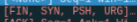
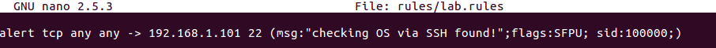

МИНИСТЕРСТВО НАУКИ И ВЫСШЕГО ОБРАЗОВАНИЯ РОССИЙСКОЙ ФЕДЕРАЦИИ

ФЕДЕРАЛЬНОЕ ГОСУДАРСТВЕННОЕ АВТОНОМНОЕ ОБРАЗОВАТЕЛЬНОЕ УЧРЕЖДЕНИЕ
ВЫСШЕГО ОБРАЗОВАНИЯ

«Санкт-Петербургский национальный исследовательский университет\
информационных технологий механики и оптики»

Факультет информационных технологий и программирования

Лабораторная работа №3

**\
Сетевая безопасность**

**\
\
\
\
\
\
\
**

> Выполнили\
> студент группы М3405\
> Баркалов Максим Максимович\
> \
> студент группы М3403\
> Шипкова Мария Александровна
>
> Проверил:\
> Хегай Максим Вилорьевич

Санкт-Петербург\
2020

Развернуты две ОС Linux, проведем сканирование с помощью NMAP

{width="6.491666666666666in"
height="2.720833333333333in"}

Наблюдаем через Wireshark, с помощью чего выполняется сканирование ОС.

Видим перебор портов, а затем множественные запросы на 22 порт\
{width="6.491666666666666in"
height="2.154166666666667in"}

Запускаем NMAP без опции O, убеждаемся, что множественных запросов на
порт 22 нет:

{width="6.491666666666666in"
height="2.25in"}

Видим, что NMAP использует пакеты, в том числе с одновременным
присутствием флагов

FIN, SYN, PSH, URG

{width="1.9027777777777777in"
height="0.3055555555555556in"}

Проверим, что при обычном ssh-соединении таких нет:\
{width="6.491666666666666in"
height="1.7270833333333333in"}

Напишем соответствующую сигнатуру для Snort

{width="6.491666666666666in"
height="0.43680555555555556in"}

Проверим работу:{width="6.491666666666666in"
height="1.8583333333333334in"}

Проверим отсутствие ложных срабатываний:\
{width="6.491666666666666in"
height="1.582638888888889in"}
