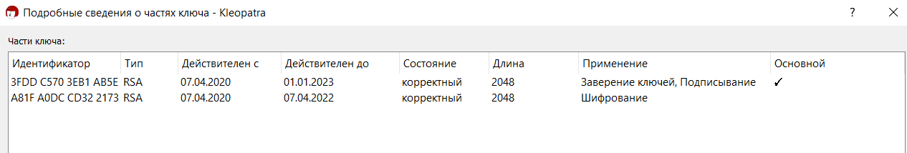
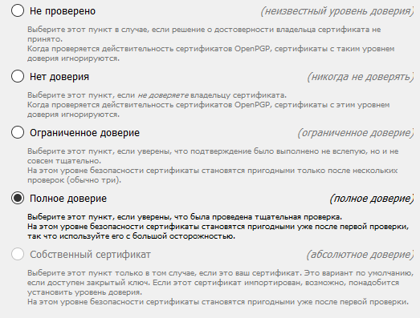

МИНИСТЕРСТВО НАУКИ И ВЫСШЕГО ОБРАЗОВАНИЯ РОССИЙСКОЙ ФЕДЕРАЦИИ

ФЕДЕРАЛЬНОЕ ГОСУДАРСТВЕННОЕ АВТОНОМНОЕ ОБРАЗОВАТЕЛЬНОЕ УЧРЕЖДЕНИЕ
ВЫСШЕГО ОБРАЗОВАНИЯ

«Санкт-Петербургский национальный исследовательский университет\
информационных технологий механики и оптики»

Факультет информационных технологий и программирования

Лабораторная работа №4

**\
Электронные цифровые подписи**

**\
\
\
\
\
\
**

> Выполнили\
> студент группы М3405\
> Баркалов Максим Максимович\
> \
> студент группы М3403\
> Шипкова Мария Александровна
>
> Проверил:\
> Хегай Максим Вилорьевич

Санкт-Петербург\
2020

1.  Экспортируемая часть сертификата

\-\-\-\--BEGIN PGP PUBLIC KEY BLOCK\-\-\-\--

Comment: Идентификатор пользователя: maksim \<maks\@fizmatspb.ru\>

Comment: Дата создания: 07.04.2020 21:57

Comment: Действителен до: 01.01.2023 12:00

Comment: Тип: 2048-битный RSA (доступен секретный ключ)

Comment: Применение: Подпись, Шифрование, Заверение идентификаторов
пользователя

Comment: Отпечаток: C224476B2A8E01578B9BDD303FDDC5703EB1AB5E

mQENBF6MzSABCADYkD4rESZJ03Uy1+Ak87ADRJfftkeqqNVTN855R7u3+EETU/Nj

wpCaImM4dOGTRoDD3OcXB0/Unw1DL0uXdI2uO3K1YmF9YeMAszW1BKmqDscauKRZ

QZP6+ug0oYEEYQ/Y+cbRSUlbwFg9OtXQBJKRaILeZcpLfHgnYjjuGZyJW20qUGRV

GB1wP+2oUk6UqI2A+N/diAHfyp69Nowrv6ME96Rb71Iljh6CGMcio1ae9BQB1+tT

BMk+5ww+ObT25Jy/VNDwwzgRF9lgJnRi3SJgEgfcDjxIz9B7C3G+6BaZyo0VJDkD

lY/rIqAfdzvG+sgGgjNkZx+1r1hOJSSV/jwDABEBAAG0Gm1ha3NpbSA8bWFrc0Bm

aXptYXRzcGIucnU+iQFUBBMBCAA+AhsDBQsJCAcCBhUKCQgLAgQWAgMBAh4BAheA

FiEEwiRHayqOAVeLm90wP93FcD6xq14FAl6MzdgFCQUkfnAACgkQP93FcD6xq16Z

Jgf+OE/C5+PMBPF2GXmqkQqgGs6fmFkZj/wDhxaWCjyGvMaDVTj6nhKJk0NE6+Of

kOkYK0NSyBT4khcpiItZ/5L0Qqgvl0ccCk6f15yA1QhIQkSSCtjVbZ0+DMeU6B7J

+8rXe6oKwxl2D+EOE0ya6j+TkvlRoPoLFpqxaHH0m6ZstNWXrfpGiAfkMGVR3fXk

b/4Gd/HwSOnWjOvoqBHGTCd4kS6fnMlY1AkgfNTHnzTYbPXjdQmV3Plu5dasG3ar

02oujvU1cB9eKB9O756faLcmxpdbzskBV9ho2dxa34p3HxWhDX7pO6obkpHhLAVw

ErDzZqE7jsJn4eeb0yHDE0H2yrkBDQRejM0gAQgAqKDzdhmxi7v5IkLoV0nKjUtx

iIL1VAVxJVl6q4LtYXNbBjlLMjjWTMCu86zdQGcQm2dcagUYxADt53iWqBOUbenf

7D1ZTWnxxLrT3UfQgF36xrJuQXqorOrHiPfih+g4WVMKQTNqoJ13GX6jvUA43mOf

giwHVfLvOHn2BvzSdJ5qDH3dwE4tIqT3aj8C+zzNbQgOnGoADyfXWlEzUR3rIWlI

4scS1DeGdQcVZVIjVwmvKmpoMGJ16rSDMYPIjZdMB+KVno/W1uqF00XAtcNgKXyD

hQdMZLZHNgd9MpMWI+qGsmnF5MCuq/Ita8+dUt1BHocLcM3uIcBbJt78q+w0SQAR

AQABiQE8BBgBCAAmFiEEwiRHayqOAVeLm90wP93FcD6xq14FAl6MzSACGwwFCQPB

2vAACgkQP93FcD6xq14t+Qf+M0NzySiWi2ZNk/6IKb7XyOHCPLRY6QQQBRlPA5QO

tL70gv3vP0CVG0f4HK0a1KE0cDb2U85meQgWDx8fMJvHCdyIM1K1hlFDmYeOlNOd

gUuDhPJxrkLlMolhkj3s6yj8KjmqICMmcVG20IcZCDRvrkD2N3A7n5yQ7gSMfliA

R9pNOI2zEpQ8ioZjiSjYFKpUf4zuN+uWXl2jCZiCdqsjnDEGCFOdHKLi7SxNtuAW

MKeGIG410D09SE8kcWCcoFqViVHBVtX94GPD1tcRJOkPe7emMJeqQqg2HWm6iMp8

L//k5BBiKzBE6cHxPs6DNklqL6gFT9Qzo53FFxpgQ5VD3Q==

=rEKG

\-\-\-\--END PGP PUBLIC KEY BLOCK\-\-\-\--

2.  Свойства\
    {width="5.45in"
    height="0.921159230096238in"}

> Идентификатор -- номер сертификата
>
> Тип -- Криптографический алгоритм (например RSA, DSA)\
> Сроки действия
>
> Состояние -- валидный ли сертификат
>
> Длина -- длина ключа
>
> Применение -- для чего может быть использован сертификат: заверение
> ключей, подписывание, шифрование
>
> Основной -- флаг, является ли ключ основным для сертификата

3.  Да, так как был сверен отпечаток через достоверный источник
    (видеозвонок)

4.  Сверка отпечатка при звонке через видеосвязь

5.  Уровни доверия:

> {width="4.666666666666667in"
> height="3.542384076990376in"}
>
> Достоверность:
>
> Документ действительно подписан этим сертификатом
>
> Доверие:\
> Сертификат действительно принадлежит человеку, который в нём указан

6.  Так как подпись не содержит внутри себя документ, а лишь подписывает
    его ключом фиксированной длины

7.  Файлы 1 и 3 действительно подписаны приложенным сертификатом.
    Подпись файла 2 не действительна. О доверии самой ЭЦП сказать
    нельзя, так как сверка отпечатков не была произведена

8.  В пункте 3е студенты провели сверку сертификатов друг друга\
    В пункте 6g сертификаты были подписаны третьей стороной, которой
    доверяют оба студента: они провели сверку с третьей стороной
    (преподавателем), но не проводили сверку между собой. Доверие одного
    студента к сертификату другого студента обеспечено тем, что
    сертификат подписан преподавателем.
