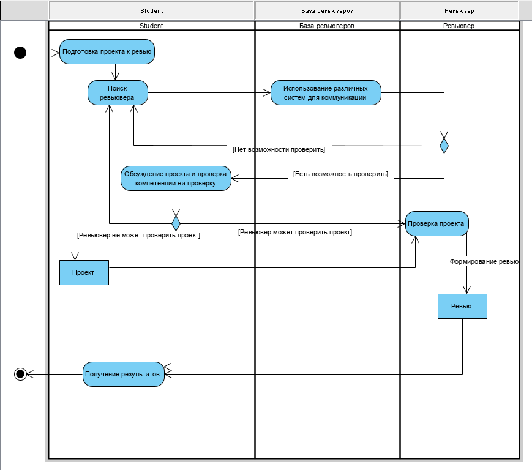
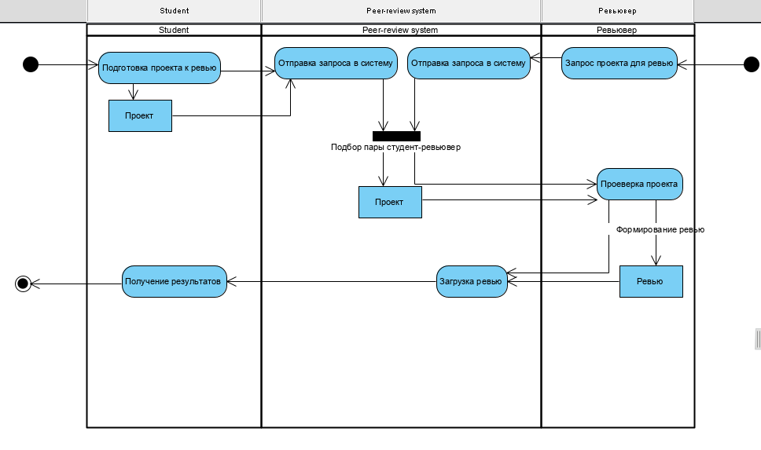
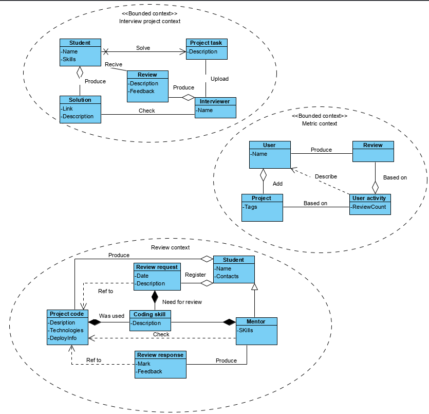
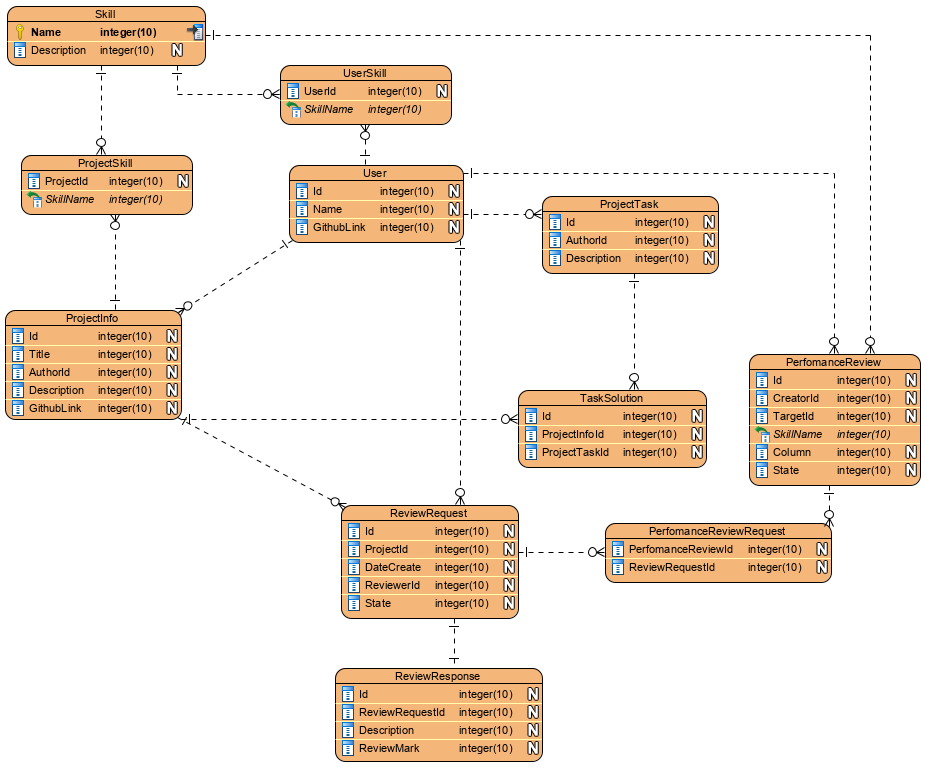
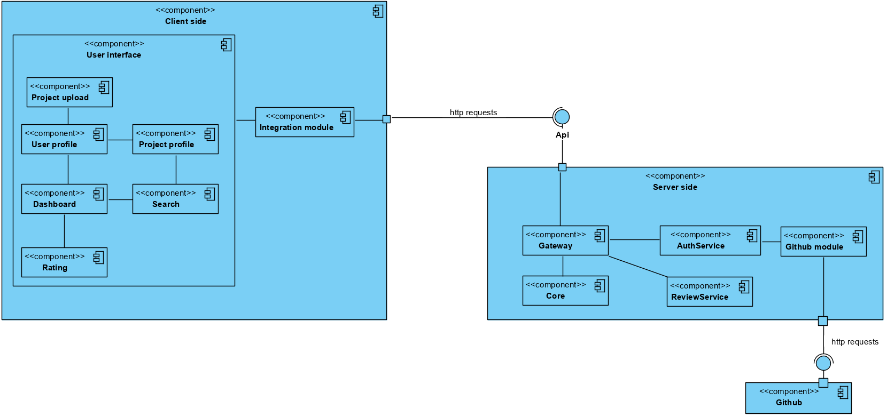
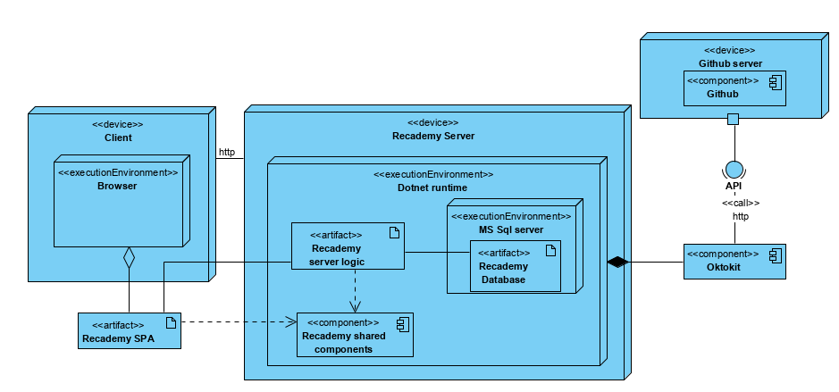

# Этап 0. Интро

Peer-review system.

# Этап 1.
На этом этапе необходимо сформулировать объект автоматизации (тот бизнес-процесс на предприятии, который требует оптимизации через автоматизацию).
Для того, чтобы понять, успешно ли бы автоматизирован процесс, необходимо выработать вместе со стейкхолдерами критерии «успешности» автоматизации. С т.з. стейкхолдеров такими
критериями являются бизнес-цели или по-другому бизнес-требования предприятия. Такие требования также подвергаются отслеживанию (трассировке) и нумеруются.
Задачами автоматизации могут являться те функции, которые полученный бизнес-процесс направлен оптимизировать.
Задачи этапа:
- Определить объект автоматизации;
- Сформулировать характеристику объекта автоматизации(условия эксплуатации системы и общие сведения);
- Определить бизнес-цели предприятия;
- Определить задачи автоматизации.

## src/

Recademy - платформа обучающей тематики, которая упрощает менторам работу со студентами - мониторинг их активности, проектов, ревью кода. Студентам должна предоставляться возможность загрузить информацию о своем проекте (описание/ссылка на GH) и запросить его ревью. Менторы должны иметь возможность в удобном формате просмотривать эти ревью-реквесты. Дополнительные фичи - реализация peer-review (работу студента может проверить другой студент которые достаточно компетентен в вопросе), геймификация образования (сбор активности, рейтинги и ачивменты, которые должны вовлекать студентов в процесс). 

Объект автоматизации - учебный процесс в котором появляется необходимость проверять результат работы более компетентными членами системы. С одной стороны есть студенты, которые разрабатывают свои проекты, которые нужно проверять. По результатам разработки своих проектов они генерируют review-реквесты. С другой стороны выступают сотрудник с достаточной компетенцией, которые выполняют проверку по реквесту. Компетенция определяется выданным грейдом (индикатор в системе, который подтвреждает навык), которые выдаются либо системой, либо в результате perfomance review, где несколько уже компетентных сотрудников подтверждают наличие навыков.

Бизнес-цели:
- Автоматизация и повышение качества процесса отбора новых сотрудников по средствам тестовых процессов (Retention rate) - процент сотрудников, которые остаются после испытательного срока (?? -> ??)
- Внедрение способа взаимодействия между участниками, которое уменьшает кол-во высококвалифицированных разработчиков, которые нужны для процесса (понижение уровня требований к кадрам для расширения сферы деятельности) - процент реквестов, которые обрабатывают высококвалифицированные разработчики (100 -> ??)
- Сокращение издержек на удержание сотрудников за счет повышение мониторинга его активности - процент времени рабочего процесса, который тратится на синхронизацию работы в разных системах (?? -> ??)

Задачи автоматизации:
- Автоматизация поиска ревьюверов
- Система компетенций: механизм верификации скиллов сотрудников, который должен использоваться для выдачи разрешения брать запросы на ревью
- Реализация возможности проведения perfomance review - расширенный вид ревью, которое включает множество проектов одного сотрудника и несколько ревьюверов, основная цель которого - получить подтверждение о наличии достаточного уровня навыков для определенного грейда
- Создание единого места для просмотра всех запросов на ревью
- Автоматический сбор данных и генерация инфографики по работе сотрудников

<!-- //Выглядит как минорные реки -->
<!-- - Реализация возможности отправить ревью-реквесты без необходимости создавать на гитхаб проектах пул-реквесты и добавлять человека как участника проекта -->
<!-- - Создание возможности находить и определять подходящее ревью по уровню и тематике-->
<!-- - Реализация системы оцениания поведения для вычисления уровня "репутации" сотрудников - дополнительные метрики дял сотрудников, которые могут использоваться для оценки стоимости его работы -->
<!-- - Внедрение механизма мониторинга отправленных запросов для ревью - сокращение времени сотрудников, которое уходит на согласование процесса ревью -->

# Этап 2.
На данном этапе требуется построить бизнес-процесс, который мы хотим автоматизировать («as-is») и целевой бизнес-процесс («to-be»).
Бизнес-процессы должны быть похожи: на вход обычно подаются одни и те же данные или играют роль одни и те же триггеры, на выходе состояние также обычно схоже. Разница только во внутренних действиях процесса.
Задачи этапа
- Построить существующий на предприятии бизнес-процесс;
- На основе бизнес-целей построить желаемый бизнес-процесс (процесс «to-be»).

## Наброски сценариев
> Код ревью

1. Подготовка проекта к ревью
2. Использование различных систем для коммуникации для поиска ревьювера
3. Уточнение возможности проверить проект
4. Уточнение компетенции на проверку конкретного проекта
5. Запрос ревью
6. Проверка кода, отправка результатов, фидбека

Для студента:
1. Подготовка проекта к ревью
2. Отправка запроса в систему
3. Получение уведомления о принятии ревью
4. Получение результатов 

Для ревьювера:
2. Отправка запроса на проекта в систему
3. Принятие реквеста и проверка проекта
4. Загрузка фидбека

# Этап 3.
Логическая модель данных требуется для определения внутренней структуры системы, которую планируют внедрить на производство. Данные, отражённые на диаграмме классов,
должны соответствовать тем, которые используются в функциональных требованиях и на мокапах.

Функциональные требования могут иметь представление в виде Use Case (рекомендуется), User Story или в текстовом виде с декомпозицией. Уровень детализации функциональных требований должен позволять разработать систему «с нуля» и пройти тестирование полного цикла сценариев по бизнес-процессу (Е2Етестирование).
Замечание. Необходимо предоставить детализированные требования! Например,
«пользователь кликает по кнопке «Сохранить», система отправляет запрос в модуль интеграции
на сохранение данных формы под клиентом с Customer ID = идентификатор авторизованного
пользователя…» и пр.

Задачи этапа
- Построить логическую модель данных
- Диаграмма классов,
- диаграмму объектов (опционально);
- Сформировать функциональные требования к проектируемому модулю (системе);
- Определить существующие допущения к требованиям (если есть).

## src/
Логическая модель данных

## Use cases

Действующие лица системы:
- Пользователь - обобщенное описание любого зарегестрированного пользователя системы, который с ней можем взаимодействовать. Все остальные роли являются производными от этой.
- Студент
- Ментор

### Название: Добавление проекта
- Действующие лица: Пользователь
- Предусловие: Пользователь должен быть зарегистрированным
- Шаги исполнения:
  - Пользователь открывает свой профиль и нажимает кнопку "Добавить проект"
  - Пользователь вводит обязательную информацию про проект - название, описание, ссылка на исходный код (пользовательская ссылка на внешний сервис, например github)
  - Пользователь может указать теги для проекта
  - Система проверяет, что все обязательные поля введены, проверяет уникальность названия и ссылки
  - Система добавляет информацию о проекте
- Результат: В профиле пользователя отображается добавленный проект
<!-- - Есть возможность указывать дополнительные данные (теги) -->
<!-- - У ментора есть возможность указывать дополнительные данные (теги) -->
<!-- Добавить что-то про оценку в ревью-респонсе - хорошо или плохо, или шкалу-->

### Название: Создание ревью реквеста
- Действующие лица: Студент
- Предусловие: Студен добавил хотя бы один проект в систему
- Шаги исполнения:
  - Студент открывает страницу добавления ревью
  - Студен видит список своих проектов, которые не отправлены на ревью и может выбрать один из них
  - Студент выбирает проект - нажимает на него в списке, нажимает на кнопку "Отправить реквест" - в системе создается реквест на ревью
- Результат:
  - Реквест добавляется в общий пул реквестов
  - Реквест в состоянии "Requested"

### Название: Поиск ревью-реквеста
- Действующие лица: Ментор
- Предусловие: 
- Шаги исполнения:
  - Ментор открывает страницу поиска ревью-реквестов
  - Ментору может выбрать фильтр по тегу из списка доступных ему
  - Ментор может применить фильтр по названию проекта или идентификатору студента
- Результат: В списке должны отображаться ревью-реквесты, которые соответствуют фильтрам

### Название: Принятие ревью-реквеста
- Действующие лица: Ментор
- Предусловие: Ментор имеет доступ к ревью данного проекта
- Шаги исполнения:
  - Ментор открывает страницу с информацией о ревью-реквесте
  - Ментор видит информацию о проекте и реквесте - название проекта, его описание и ссылку на исходники
  - Ментор Нажимает на кнопку "Принять ревью-реквест"
- Результат:
  - Состояние реквеса изменилось на "In inspecting"
  - Ревью отображаеся как активное у пользователя, который принял ревью
<!-- Тут нужно определиться с кейсами а-ля >1 ревьювера или "я не хочу чтобы этот мог ревьювить" -->

### Название: Отправка фидбека по ревью
- Действующие лица: Ментор
- Предусловие: У ментора есть хотя бы один принятый ревью-реквест
- Шаги исполнения:
  - Ментор открывает ревью-реквест - отображается информация о проекте, ссылка на него
  - Ментор знакомится с проектом и заполняет форму фидбека - текстовое описание, оценка проекта
  - Заполнив информацию ментор нажимает на кнопку "Загрузить фидбек"
- Результат:
  - Состояние ревью-реквеста изменилось на "Reviewed"
  - Ревью не отображается в пуле активных реквестов
  - Фидбек по ревью отображается при просмотре проекта
<!-- А это точно? -->

### Название: Просмотр активности
- Действующие лица: Пользователь (студент или ментор)
- Предусловие: 
- Шаги исполнения:
  - Пользователь открывает профиль другого пользователя
- Результат:
  - На странице отображается информация о пользователе
  - Отображается список его проектов
  - Отображается кол-во отправленных им ревью реквестов
  - Отображается список его скиллов (тегов)

# Этап 4.
Нефункциональные требования представляют из себя требования к качеству системы: с какой скоростью должна работать система, под какими нагрузками и пр.
Задачи этапа - сформулировать нефункциональные требования:
- Требования к информационной безопасности;
- Требования к тестированию;
- Прочие требования;
- План жизненного цикла системы. 

## src/

- Требования к информационной безопасности: система должна требовать от аутентифицироваться для выполнения любых операций. Система не должна не в каких сценариях давать доступ к сенсетив данным пользователей (токенам внешних сервисов).
- Требования к тестированию: автоматическое тестирование должно покрывать все базовые тест-кейсы системы, которые не зависят от внешних сервисов. Все сценарии интеграции с внешними сервисами должны покрыться ручным тестированием, чтобы гарантировать, что система не может повредить данные на внешних ресурсах.
- Требования к нагрузке: система не является высоконагруженной, он нее не требуется обработка в реальном времени. Также, система предоставляется как внутренее корпоративное решение, исходя из этого предполагаемое кол-во одновременных пользователей не больше 100. 

Для реализации системы больше всего подходит спиральная модель ЖЦ системы. Это обосновано отсутствием четких изначальных требований и клиентоориентированость.
Таким образом подразумевается последовательность:
1. Определение требований (анализ запросов от пользователей и баг-репортов)
2. Анализ (определение ключевых требования на текущую итерацию)
3. Проектирование (Планирование функционала)
4. Реализация и тестирование
5. Интеграция
6. Внедрение (Деплой изменений на продакшен сервис)

Это многократный цикл, который между итерациями дополняется фидбеком пользователей, ссылаясь на которые формируются требования следующей итерации.

# Этап 5.
Диаграмму компонентов рекомендуется начать делать сразу перед написанием
функциональных требований и логической модели данных и обновлять по мери выполнения
этапов.
Диаграмма должна представлять из себя высокоуровневые компоненты и связи между
ними, для того, чтобы понимать, какой компонент отвечает за какую функциональность и как эти
компоненты «общаются» между собой.
Замечание. Для построения диаграммы необходимо использовать нотацию UML.
Задачи этапа
- Построить диаграмму компонентов;
- (Опционально) Определить требования к интерфейсам системы.

## src/

# Этап 6.

Физическая архитектура отражает требования к инфраструктуре получившегося решения:
какие сервера необходимы для поддержания нефункциональных требований, какой физический
канал будет между модулями, какой протокол используется при передаче данных.
Также, она отражает физическое размещение компонентов системы на физических
устройствах.
Замечание. Для построения диаграммы необходимо использовать нотацию UML.
Задачи этапа
- Спроектировать физическую архитектуру системы;
- Оформить требования к аппаратной и программной частям системы;
- (Опционально) Отобразить макеты визуального представления системы.

## src/

Требования к программной части системы:
- .NET Core
- MS Sql Server
- MS Nano server

Исходя из программных требования можно сформулировать требования к аппаратной части:
- [.NET Core](https://docs.microsoft.com/ru-ru/dotnet/framework/get-started/system-requirements):
  - Процессор - 1ГГц
  - ОЗУ - 512МБ
  - Дисковое пространство - 4,5 ГБ
- [MS Sql Server](https://docs.microsoft.com/ru-ru/sql/sql-server/install/hardware-and-software-requirements-for-installing-sql-server?view=sql-server-ver15)
  - .NET Framework 4.6.2
  - Дисковое пространство - 6 ГБ
  - ОЗУ - 512МБ
  - Процессор - x64, 1.4 Ghz
- [MS Nano server](https://docs.microsoft.com/en-us/windows-server/get-started/system-requirements)
  - Процессор - x64, 1.4 Ghz
  - ОЗУ - 512МБ
  - Дисковое пространство - 32GB

Требования к клиентской стороне:
- Основным требованием к клиентской стороне - наличие браузера с поддержкой WebAssembly:
  - Chrome 57+
  - Edge 15+
  - Firefox52
- Поддерживаемые расширения устройств отображения - от 1366×768. Это обусловленно тем, что юз-кейсы системы не предполагают использование мобильных клиентов т.к. для пользователей будет не удобно просматривать код - выполнять основное действие в системе.

Наброски макетов:

