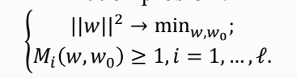
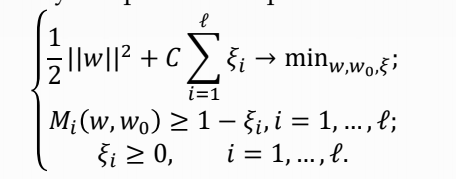
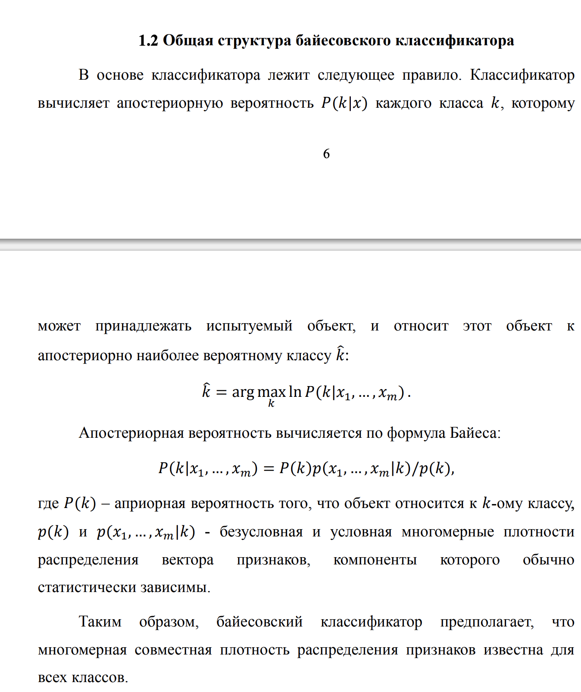
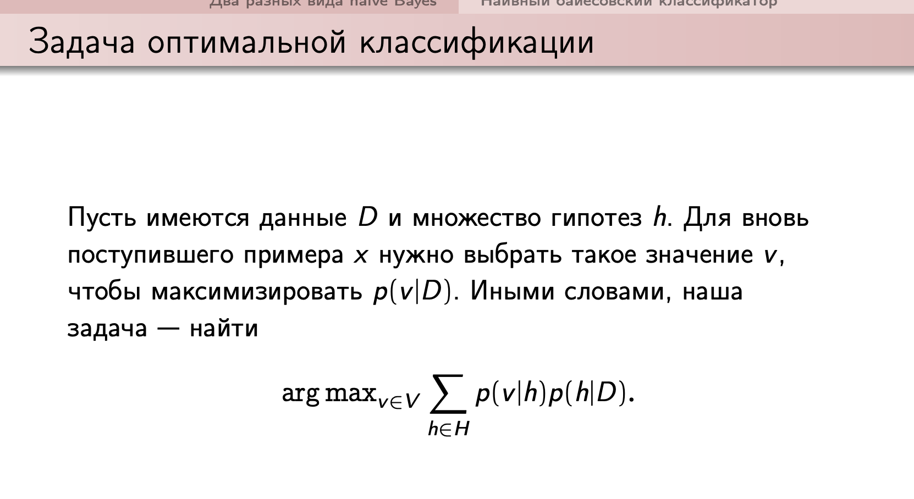
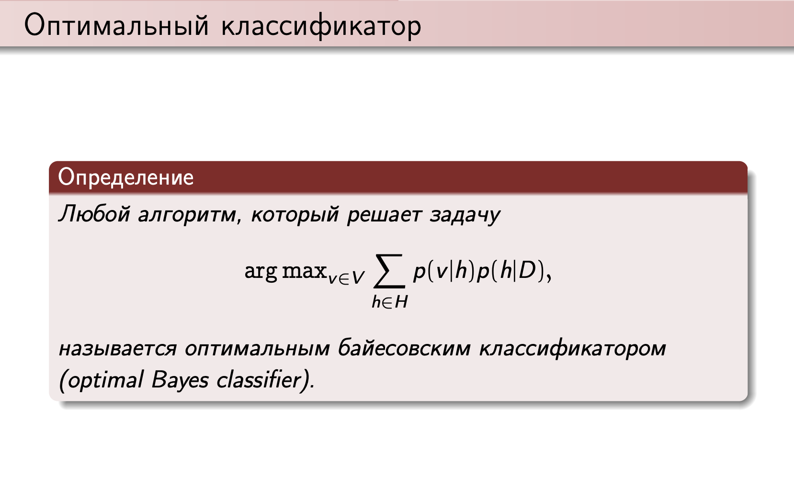
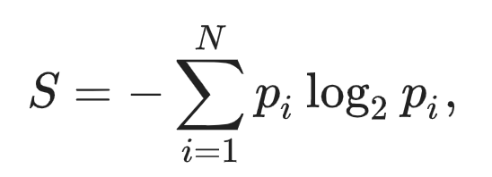
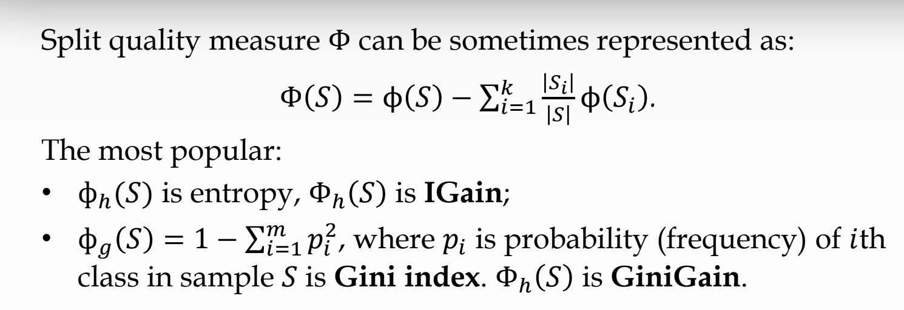
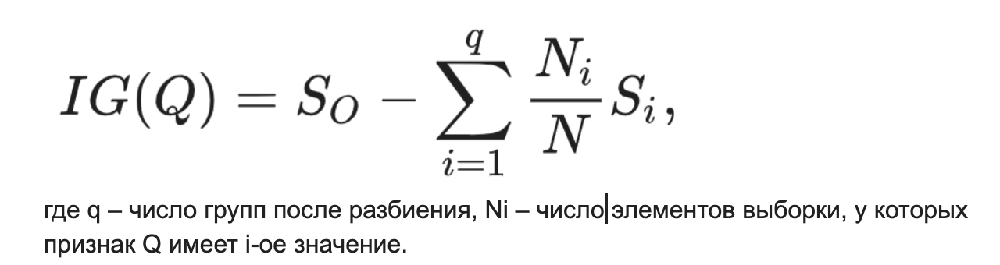
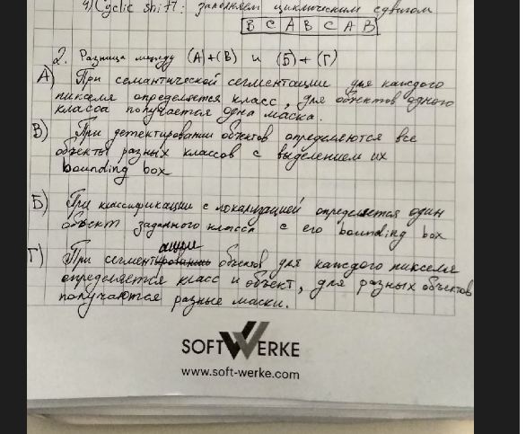
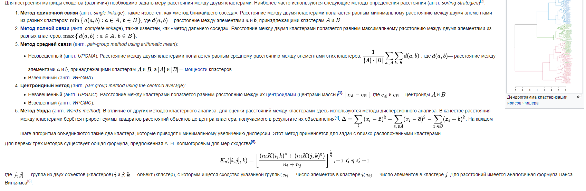

**Задание 1.**

**Что такое модель? Что такое параметр и гиперпараметр модели, в чём
их** **отличие?**

**С нирка:**

Пусть дана обучающая выборка (X,Y), где X --- множество признаков,
описывающих объекты, а Y --- конечное множество меток.

Пусть задана функция g:X×Θ→Y, где Θ --- множество дополнительных
параметров (весов) функции.

Описанная выше функция g для фиксированного значения весов θ∈Θ
называется решающим правилом.

Модель --- совокупность всех решающих правил, которые получаются путем
присваивания весам всех возможных допустимых значений.

Формально модель A={g(x,θ)\|θ∈Θ}.

Модель определяется множеством допустимых весов Θ и структурой решающего
правила g(x,θ).

**Гиперпараметр** - параметр, который заведомо известный и не меняется в
процессе обучения.

Понятие гиперпараметров модели

Гиперпараметры модели --- параметры, значения которых задается до начала
обучения модели и не изменяется в процессе обучения. У модели может не
быть гиперпараметров.

Параметры модели --- параметры, которые изменяются и оптимизируются в
процессе обучения модели и итоговые значения этих параметров являются
результатом обучения модели.

Примерами гиперпараметров могут служить количество слоев нейронной сети,
а также количество нейронов на каждом слое. Примерами параметров могут
служить веса ребер нейронной сети.

Для нахождения оптимальных гиперпараметров модели могут применяться
различные алгоритмы настройки гиперпараметров

Стремный сурс, но для начала:\
Обучаемая модель - это аналитическая модель, способная самостоятельно, в
процессе обучения, настраивать параметры в состояние, при котором модель
сможет выполнить требуемые преобразования данных. Поскольку в основу
многих методов обучения положены процессы интеллектуальной деятельности
человека, технологии обучения традиционно относят к области
искусственного интеллекта, а именно к машинному обучению.

Такие модели могут автоматически обнаруживать в наборах данных скрытые,
ранее неизвестные зависимости и закономерности, извлекать правила,
знание которых позволит аналитику строить прогнозы, классифицировать
объекты и наблюдения, устанавливать связи между ними и т.д.

К наиболее популярным моделям, основанным на обучении, относятся
нейронные сети, деревья решений, карты Кохонена, ассоциативные правила и
др. Они широко применяются для решения задач классификации, регрессии,
кластеризации и прогнозирования.

**Задание 2.**

**Зачем вводятся релаксационные переменные ξ в постановку задачи SVM?**

Система для линейно разделимого случая выглядит так:

{width="3.8229166666666665in"
height="1.0104166666666667in"}

где w - норма вектора весов, её мы минимизируем

M - расстояние между объектами разных классов

Но также возможен и линейно неразделимый случай, где мы не можем
построить разделяющую гиперплоскость и полосу возле неё, так что ни одна
точка не попадет в эту полосу (а также за её пределы с обратной
стороны).

Задача - постараться найти максимально подходящую поверхность.

Первая система трансформируется в такую:

{width="4.75in"
height="1.8645833333333333in"}

Добавляем суррогатную переменную **ξ,** которая дает допуск на попадание
элементов в margin гиперплоскости.

Чем она больше, тем больше этот допуск, соответственно **ξ** тоже должна
быть минимизирована.

**Задание 3.**

**Что такое оптимальный байесовский классификатор?**

оптимальный байесовский классификатор - классификатор, максимизирующий
апостериорную вероятность

{width="6.270833333333333in"
height="7.472222222222222in"}

{width="6.270833333333333in"
height="3.4305555555555554in"}

{width="6.270833333333333in"
height="3.8472222222222223in"}

оптимальный байесовский классификатор в отличие от наивного не имеет
допущения о независимости признаков

**Задание 4.**

**Опишите популярные критерии информативности разделяющих правил в
деревьях решений, которые вы знаете? (минимум 2)**

В основе популярных алгоритмов построения дерева решений,лежит принцип
жадной максимизации прироста информации -- на каждом шаге выбирается тот
признак, при разделении по которому прирост информации оказывается
наибольшим. Дальше процедура повторяется рекурсивно, пока энтропия не
окажется равной нулю или какой-то малой величине

Энтропия

{width="3.9114588801399823in"
height="1.4132644356955382in"}

{width="6.270833333333333in"
height="2.1527777777777777in"}

-   Information gain(прирост информации), прирост информации -
    > уменьшение энтропии

Поскольку энтропия -- по сути степень хаоса (или неопределенности) в
системе, уменьшение энтропии называют приростом информации.

{width="6.270833333333333in"
height="1.6666666666666667in"}

-   Индекс Джини ( см пикчу сверху)

**Задание 5.**

**(А) Семантическая сегментация (Б) Классификация с локализацией (В)
Детектирование объектов (Г) Сегментация объектов.Разница между (А)+(Б) и
(В)+(Г).**

{width="6.270833333333333in"
height="4.513888888888889in"}

{width="6.104166666666667in"
height="5.03125in"}

{width="6.270833333333333in"
height="3.7083333333333335in"}

**Задание 6.**

**Опишите принцип работы иерархической кластеризации? Опишите различные
меры расстояния между кластерами.**

Иерархическая кластеризация (англ. hierarchical clustering) ---
множество алгоритмов кластеризации, направленных на создание иерархии
вложенных разбиений исходного множества объектов.

Иерархические алгоритмы кластеризации часто называют **алгоритмами
таксономии**. Для визуального представления результатов кластеризации
используется **дендрограмма** --- дерево, построенное по матрице мер
близости между кластерами. В узлах дерева находятся подмножества
объектов из обучающей выборки. При этом на каждом ярусе дерева множество
объектов из всех узлов составляет исходное множество объектов.
Объединение узлов между ярусами соответствует слиянию двух кластеров.
При этом длина ребра соответствует расстоянию между кластерами.

{width="6.270833333333333in"
height="2.0416666666666665in"}
