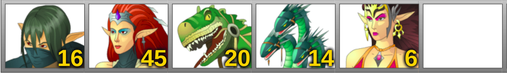
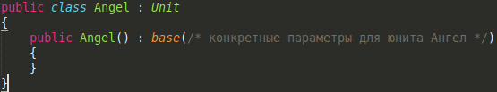

Описание
========

По миру путешествуют армии (мы не разрабатываем этот модуль). Армии
состоят из 6 ячеек. Ячейка может быть пустой, а может быть занята стеком
существ. Стек существ - это набор одинаковых существ, например, черных
драконов. В одном стеке может быть не более 999 999 существ. У существ
есть параметры, присущие всем существам (например, инициатива, урон и
т.п.) и сроки быть уникальные способности (как активные, так и
пассивные).

Пример армии на картинке ниже.

Путешествуя по миру (мы все еще не делаем этот модуль путешествий),
армии вступают в сражения с другими армиями (мы делаем как раз вот этот
модуль - модуль сражений). В сражении существа (точнее стеки, отдельно
каждое существо не рассматривается) ходят по очереди, в соответствии с
параметром существа - \"Инициатива\": чем выше инициатива, тем раньше
ходит стек существ. Ход заключается в нанесении урона вражескому стеку
существ или в применении какой-либо активной способности (если существо
обладает активными способностями). Чем больше количество существ в стеке
- тем сильнее эффект хода - больше урон, мощнее проявляет себя активная
способность. Все параметры существ могут быть изменены в ходе сражения.

Сражение длится до тех пор, пока одна из армий не останется пустой
(будут убиты все стеки существ) или пока кто-то не сдастся. Сдаться
можно только в ход своего стека существ (то есть нельзя сдаться, пока
ходит соперник).

Как только закончено сражение - объявляются результаты (кто победил,
какие понес потери, кто проиграл, какие понес потери, причина окончания:
проигравший пал в сражении или сбежал).

После окончания сражения должны быть обновлены состояния исходных армий
в соответствии с понесенными потерями (те, которые путешествуют по
миру).

Механика
========

1.  Должна быть возможность сформировать описание \"походной\" армии (той, которая путешествует), т.е. указать из каких юнитов и какого количества состоит армия. В этой армии должны быть \"походные\" стеки существ (просто описатели: что и сколько, без динамического изменения).

2.  Из проходной армии необходимо получить \"боевую\" (ту, в которой стеки существ могут добавляться/удаляться динамически). Эта армия должна содержать \"боевые\" стеки существ, у которых в ходе сражения будет меняться количество существ и их характеристики.

3.  Базовая механика такая: юниты по очереди (в зависимости от инициативы) совершают действия (атакуют врагов, кастуют заклинания, ожидают, обороняются и т.п.). Раунд - последовательность ходов юнитов, такая, что каждый юнит ходит (совершает действие) как минимум по одному разу. Когда каждый юнит совершил действие - раунд окончен. Если на поле боя еще остались юниты - начинается новый раунд. По умолчанию каждый юнит дает сдачу один раз за раунд, то есть если в одном раунде юнит был атакован, он дает сдачу; если в этом же раунде юнит был еще раз атакован, то сдачу уже не дает (если иного поведения не предусмотрено особенностями юнита).

4.  Каждый юнит должен обладать уникальными характеристиками и
    > особенностями. Характеристики и особенности (как и юнитов) можно
    > придумать самостоятельно, можно взять предложенный ниже набор.

+---------+---------+---------+---------+---------+---------+---------+
| *       | **здо   | **      | **з     | *       | **иници | *       |
| *юнит** | ровье** | атака** | ащита** | *урон** | атива** | *особен |
|         |         |         |         |         |         | ности** |
+=========+=========+=========+=========+=========+=========+=========+
| Арб     | 10      | 4       | 4       | 2-8     | 8       | Стрелок |
| алетчик |         |         |         |         |         |         |
|         |         |         |         |         |         | Точный  |
|         |         |         |         |         |         | выстрел |
+---------+---------+---------+---------+---------+---------+---------+
| Скелет  | 5       | 1       | 2       | 1-1     | 10      | Нежить  |
+---------+---------+---------+---------+---------+---------+---------+
| Фурия   | 16      | 5       | 3       | 5-7     | 16      | Враг не |
|         |         |         |         |         |         | сопроти |
|         |         |         |         |         |         | вляется |
+---------+---------+---------+---------+---------+---------+---------+
| Гидра   | 80      | 15      | 12      | 7-14    | 7       | Удар по |
|         |         |         |         |         |         | всем    |
|         |         |         |         |         |         |         |
|         |         |         |         |         |         | Враг не |
|         |         |         |         |         |         | сопроти |
|         |         |         |         |         |         | вляется |
+---------+---------+---------+---------+---------+---------+---------+
| Ангел   | 180     | 27      | 27      | 45-45   | 11      | Каст:   |
|         |         |         |         |         |         | К       |
|         |         |         |         |         |         | арающий |
|         |         |         |         |         |         | удар    |
+---------+---------+---------+---------+---------+---------+---------+
| К       | 150     | 27      | 28      | 15-30   | 11      | Нежить  |
| остяной |         |         |         |         |         |         |
| дракон  |         |         |         |         |         | Каст:   |
|         |         |         |         |         |         | Пр      |
|         |         |         |         |         |         | оклятие |
+---------+---------+---------+---------+---------+---------+---------+
| Дьявол  | 166     | 27      | 25      | 36-66   | 11      | Каст:   |
|         |         |         |         |         |         | Осл     |
|         |         |         |         |         |         | абление |
+---------+---------+---------+---------+---------+---------+---------+
| Циклоп  | 85      | 20      | 15      | 18-26   | 10      | Стрелок |
+---------+---------+---------+---------+---------+---------+---------+
| Грифон  | 30      | 7       | 5       | 5-10    | 15      | Беск    |
|         |         |         |         |         |         | онечный |
|         |         |         |         |         |         | отпор   |
+---------+---------+---------+---------+---------+---------+---------+
| Шаманка | 40      | 12      | 10      | 7-12    | 10.5    | Каст:   |
|         |         |         |         |         |         | Ус      |
|         |         |         |         |         |         | корение |
+---------+---------+---------+---------+---------+---------+---------+
| Лич     | 50      | 15      | 15      | 12-17   | 10      | Нежить  |
|         |         |         |         |         |         |         |
|         |         |         |         |         |         | Каст:   |
|         |         |         |         |         |         | Воск    |
|         |         |         |         |         |         | решение |
|         |         |         |         |         |         |         |
|         |         |         |         |         |         | Стрелок |
+---------+---------+---------+---------+---------+---------+---------+

Описание особенностей:

-   Стрелок - враг не наносит ответный удар, но и при атаке это существо тоже не дает сдачи.
-   Точный выстрел - игнорируется параметр защиты цели (как будто защита = 0).
-   Нежить - существо может быть воскрешено.
-   Враг не сопротивляется - враг не наносит ответный удар.
-   Удар по всем - все враги получают урон.
-   Бесконечный отпор - на каждый вражеский удар существо дает сдачи.
-   Касты (можно применять только один раз за сражение):
    -   Карающий удар - увеличивает параметр "атака" у цели на 12 единиц.
    -   Проклятие - уменьшает параметр "атака" у цели на 12 единиц ("атака" не может стать меньше 0).
    -   Ослабление - уменьшает параметр "защита" у цели на 12 единиц ("защита" не может стать меньше 0).
    -   Ускорение - увеличивает параметр "инициатива" у цели на 40%.
    -   Воскрешение - воскрешает 100 единиц здоровья за каждое существо, которое колдует. Пример: 3 Лича воскрешают на 300 единиц здоровья, 5 личей - 500 единиц здоровья и т.д. Нельзя воскресить существ больше, чем было изначально. Пример: изначально в армии было 50 скелетов (у скелета 5 единиц здоровья), погибло 7, 1 лич кастует воскрешение на скелетов - воскрешаются только 7 скелетов (а не 20).
5.  Окончание сражения происходит когда одна из армий лишилась всех своих юнитов или кто-то сдался.
6.  После окончания сражения должны обновиться \"походные\" армии и должен быть получен результат сражения: какая армия какие потери понесла.

ЛР 2: Создание базовых сущностей движка
=======================================

Необходимо определить базовые классы для функционирования движка. Во
всех классах должна быть защита от прямого доступа к полям! Модификация
полей только через методы или свойства.

Определить класс **Unit** со следующими полями:
-   Name - уникальный идентификатор типа юнита, строка
-   HitPoints - количество жизней юнита (здоровье)
-   Attack - показатель атаки юнита (будет использоваться при определении наносимого урона)
-   Defence - показатель защиты юнита (будет использоваться при определении полученного юнитом урона)
-   Damage - диапазон значений (от-до), определяющий разброс базового урона юнита. Подумать как его задать
-   Initiative - дробное значение, будет использоваться при определении приоритета хода юнита в каждом раунде

Значения всех полей заполняются через конструктор. Этот класс является
описателем, то есть не должен модифицироваться в ходе работы программы,
вся информация доступна только на чтение.

Определить класс **UnitsStack**, который содержит следующее:
-   класс юнита
-   количество юнитов

Значения всех полей заполняются через конструктор. Этот класс является
описателем, то есть не должен модифицироваться в ходе работы программы,
вся информация доступна только на чтение.

Определить класс **Army**. Данный класс содержит стеки юнитов. Максимум
в одной армии может быть 6 стеков.

Должны быть реализованы безопасные методы добавления и удаления стеков
из армии. При этом ни при каких условиях нельзя давать возможность
изменить состав армии в обход безопасных методов.

Создать классы-наследники от Unit - конкретные юниты с определенными
параметрами. Пример:

Удобно для этого создать папку Units и в ней создать всех доступных
юнитов.

Весь функционал необходимо продемонстрировать (создать юнита, стек и
армию, получить доступ к данным): можно как с помощью тестов, так и с
помощью демо примера.

ЛР 3: Боевые сущности
=====================

Определить класс **BattleUnitsStack**. Этот класс должен описывать всю
необходимую информацию для участия стека в сражении (следует учесть
возможность воскрешения, изменения параметров и т.п.). Экземпляр должен
формироваться на основе "походного" аналога. Реализовать все необходимые
методы для управления параметрами.

Определить класс **BattleArmy**. Этот класс должен описывать всю
необходимую информацию о "боевой" армии (содержит "боевые" стеки).
Следует учесть возможность добавления стеков (например, магия "Призвать
элементалей" - добавляет стек элементалей). Максимальное количество
стеков в боевой армии - девять. Реализовать все необходимые методы для
управления армией.

Определить класс **Battle**. Это основной класс движка, все
взаимодействие должно происходить через него. Экземпляр создается на
основании двух боевых армий (при желании можно сделать боевку не для
двух, а произвольного количества армий). Класс должен предоставлять
информацию о текущем ходе (какой юнит ходит, какие действия доступны) и
возможность совершить действие. Также необходимо получать информацию о
статусе сражения: завершено или нет, кто победил.

Пока реализацию данного класса можно полностью не делать (то, что
связано с информацией о ходе и совершении действия), достаточно будет
продемонстрировать интерфейс с "заглушками". Эти заглушки заменятся на
нормальную реализацию в следующей лабе.

Весь функционал необходимо продемонстрировать - создание "боевой"
армии/стека, управление параметрами, создание экземпляра сражения,
проведение сражения. Можно как с помощью тестов, так и с помощью демо
примера.

ЛР 4: Очередность ходов и действия
==================================

**Действия**

В движке необходимо реализовать следующие действия:
-   атаковать;
-   использовать заклинание/способность;
-   ожидать;
-   обороняться;
-   сдаться.

Действие ***Атаковать***: нанести урон выбранному стеку (или нескольким,
если есть такая возможность).

*Формула урона:*

-   Если **Attack** атакующего стека больше **Defence** обороняющегося стека, то:

Суммарный урон = количество атакующих существ \* Damage \* \[1 + 0.05 \*
(Attack - Defence)\]

-   Если **Attack** атакующего стека меньше **Defence** обороняющегося стека, то:

Суммарный урон = количество атакующих существ \* Damage / \[1 + 0.05 \*
(Defence - Attack)\]

Так как Damage - диапазон, то и суммарный урон - тоже диапазон.
Конкретный урон выбирается рандомно из полученного диапазона.

Действие ***Использовать заклинание/способность***: применяется активная
способность юнита или заклинание доступное юниту. Целью может быть как
конкретный юнит, так и несколько юнитов или вообще все юниты. Количество
использований заклинаний/способностей задается самостоятельно.

***Ожидать***: стек перемещается в конец шкалы инициативы в текущем
раунде. При этом, если несколько стеков ожидают, то порядок - обратный
для прямой шкалы инициативы (подробнее описано в пункте **Шкала
инициативы**).

***Обороняться***: стек пропускает ход (в текущем раунде он больше не
ходит). Бонусом получает дополнительно 30% к защите от текущего
показателя.

***Сдаться***: бежать с поля боя. То есть противник становится
победителем, но сражение прекращается и армии остаются в текущем
состоянии.

**Шкала инициативы**

Шкала инициативы - очередность ходов юнитов (стеков). Очередность
определяется параметром "Инициатива". Стоит учесть, что этот параметр
может меняться в ходе сражения, следовательно и шкала инициативы должна
обновляться в соответствии с этими изменениями. Также необходимо
корректно отработать действие "Ожидать": стек должен переместиться в
конец шкалы в текущем раунде. Если несколько стеков ожидают, то их
очередность в конце шкалы обратна изначальной очередности.

Пример:

На поле боя три стека (в скобках указана инициатива): Фурии (16), Ангелы
(10), Гидры (7).

Шкала инициативы: Фурии -\> Ангелы -\> Гидры.

Ходят Фурии. Фурии ожидают.

Шкала инициативы: Ангелы -\> Гидры -\> **Фурии**.

Ходят Ангелы. Ангелы ожидают.

Шкала инициативы: Гидры -\> **Ангелы** -\> Фурии.

Ходят Гидры. Гидры атакуют.

Шкала инициативы: Ангелы -\> Фурии.

Ходят Ангелы. Ангелы атакуют.

Шкала инициативы: Фурии.

Ходят Фурии. Фурии атакуют.

Конец раунда.

Помимо шкалы инициативы на текущий раунд необходимо предоставить
функционал получения шкалы инициативы на следующий раунд.

Пример:

На поле боя три стека (в скобках указана инициатива): Фурии (16), Ангелы
(10), Гидры (7).

Шкала инициативы (вертикальной чертой показана граница раундов):\
Фурии -\> Ангелы -\> Гидры \| Фурии -\> Ангелы -\> Гидры.

Ходят Фурии. Фурии ожидают.

Шкала инициативы: Ангелы -\> Гидры -\> Фурии \| Фурии -\> Ангелы -\>
Гидры.

Ходят Ангелы. Ангелы ожидают.

Шкала инициативы: Гидры -\> Ангелы -\> Фурии \| Фурии -\> Ангелы -\>
Гидры.

Ходят Гидры. Гидры атакуют.

Шкала инициативы: Ангелы -\> Фурии \| Фурии -\> Ангелы -\> Гидры.

и т.д.

ЛР 5: Модификаторы и особенности юнитов
=======================================

Реализовать возможность добавлять юнитам модификаторы: постоянные и
временные, врожденные (присутствуют с самого начала) и
приобретенные/добавленные (в ходе сражения).

Также у юнитов необходимо определить уникальные способности и
особенности, например, возможность наколдовать "Замедление" или
активировать способность "Ядовитый удар" (следующая атака помимо
обычного урона вдобавок отравит цель = наложит заклинание "Отравление").
Для использования заклинаний и способностей во время хода стека
выбирается действие ***Использовать заклинание/способность***.

Все модификаторы должны применяться к стекам, чтобы поддерживать
актуальной шкалу инициативы и параметры стеков.

Стеки должны реализовывать механику ответных ударов: по одному ответному
удару за раунд, если модификатор или особенность не предписывают иного.

Весь функционал необходимо продемонстрировать - демо бой с атакой,
ответным ударом, применением заклинания/особенности, ожиданием,
обороной. Шкала инициативы должна соответственно перестраиваться, если
какое-то действия оказывает на нее эффект. Демонстрация возможна как с
помощью тестов, так и с помощью демо примера.

ЛР 6: API для модов
===================

Проработать интерфейс для расширения игрового движка. Как минимум -
должна быть возможность добавлять с помощью модов новые юниты. В идеале
- еще и заклинания/способности, особенности, действия.

Создать новый проект, который зависит от движка. Реализовать несколько
новых сущностей. Продемонстрировать способность движка подгружать новые
сущности и работать с ними.

Демонстрация аналогична предыдущей работе, только обязательно
использовать сущности из мода.

ЛР 7: Создание пользовательского интерфейса
===========================================

Необходимо разработать консольный/графический/web интерфейс, который
позволит:

1.  Укомплектовывать армии;

2.  Проводить сражение (отображать состояние шкалы ходов, управлять выбором атаки, отображать результаты действий).
