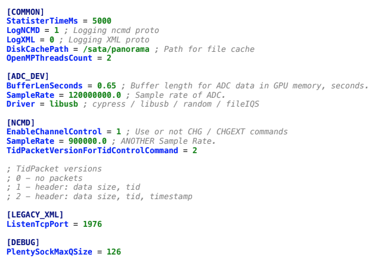

Все работы должны обрабатывать исключительные ситуации! Причем не
бездумно везде try/catch писать, а обрабатывать, по возможности, другими
механизмами (использовать TryParse при считывании с консоли, проверять
существование перед обращением, логические ошибки аккуратно обрабатывать
и т.д.). Try/catch тоже можно, но там, где это оправдано.

Лабораторная 1
==============

1.  Прочитать из файла input.txt набор чисел и вывести в файл output.txt
    > их сумму. Примечание: удобно использовать StreamReader и
    > StreamWriter для работы с файлами.

2.  Вывести первые n чисел Фибоначчи на консоль. На вход программе в
    > качестве единственного аргумента передается число n - количество
    > чисел Фибоначчи.

3.  Сделать преобразователь из римской системы счисления в десятичную.
    > На вход программе в качестве единственного аргумента передается
    > строка - число в римской системе счисления. Необходимо вывести на
    > консоль соответствующее число в десятичной системе счисления.

Пример:

III = 3

IV = 4

MMXIX = 2019

Лабораторная 2
==============

> Определить класс \"Рациональная дробь\" в виде пары чисел m и n

-   Определить класс \"Набор дробей\". Должна быть возможность добавлять
    > дробь в набор, и набор должен уметь выдавать следующую статистику:

    -   максимальную дробь в наборе

    -   минимальную дробь в наборе

    -   количество дробей в наборе больше заданной

    -   количество дробей в наборе меньше заданной

> Плюсом будут следующие возможности:

-   кеширование максимальной/минимальной дроби до изменения набора.
    > Ответ на количество дробей больше/меньше заданной может быть
    > закеширован по нескольким последним запросам (то есть
    > предполагаем, что если мы спросили, сколько дробей больше 1, то и
    > в следующий раз нас снова заинтересует именно сравнение с
    > единицей)

-   загрузка набора дробей из файла (формат файла задаёте вы сами)

```{=html}
<!-- -->
```
-   Определить класс \"Полином\" с коэффициентами в виде дроби. Полином
    > должен иметь возможность задаваться через Набор дробей.
    > Реализовать вычисление суммы полиномов

Лабораторная 3
==============

> Реализовать Каталог музыки.
>
> Есть Артисты, они выпускают Альбомы, в которых содержатся Песни (или
> треки). Также есть музыкальные жанры. У жанров есть поджанры
> (например, Тяжелый рок - это поджанр Рока)
>
> Кроме альбомов, в каталоге содержатся Сборники - в сборниках
> содержатся треки разных артистов, возможно, разных жанров.
>
> Спроектировать и реализовать классовую модель такого Каталога, и
> сделать в нём небольшой поисковый движок. Например, чтобы можно было
> найти все альбомы и сборники, содержащие треки жанра Рок, вышедшие в
> 2017 году (при этом должны найтись и альбомы жанра Тяжелый рок, как
> поджанра Рока). Движок должен уметь искать а) артистов, б) альбомы и
> сборники, в) песни по ряду критериев (критерии определите сами) Для
> реализации вам нужно продумать, какими свойствами должен обладать тот
> или иной объект (например, у песни точно есть название). Кроме того,
> можно задать некоторые ограничения для упрощения работы. Я приведу
> примеры таких ограничений (вы можете им следовать или нет, по желанию)

-   Вы можете задать определенный жанр (или жанры) Артисту и считать,
    > что все его треки сделаны в этом жанре. Или же считать, что каждый
    > трек может иметь свой жанр (или альбом, или ещё как-то)

-   Считаем, что артисты не могут выпустить альбом вместе (один альбом -
    > один артист)

-   Можно считать, что трек не существует вне альбома. То есть если трек
    > выпущен, он должен присутствовать хотя бы в одном альбоме, даже
    > если там этот трек - единственный (такие альбомы называются
    > синглами)

-   Жанры можно представить в виде дерева (в этом случае у каждого
    > поджанра может быть только один предок). Но можно реализовать и
    > другие отношения (например, считать, что жанр Поп-рок имеет
    > родительские жанры Рок и Поп). Так или иначе, нужно реализовать
    > минимум два уровня жанров (то есть базовые родительские, и
    > поджанры)

-   Можем считать, что Сборник - это произвольный набор треков из
    > вышедших ранее альбомов (разных исполнителей)

> Кроме этих ограничений вы можете придумать свои, если вы посчитаете их
> необходимыми (но помните, что преподаватель может вас попросить их
> ослабить)
>
> Общие пожелания по реализации:

-   Пожалуйста, не выдумывайте искусственных идентификаторов объектов,
    > работайте с объектами напрямую. Помните, что переменная хранит
    > только ссылку на существующий где-то в памяти объект, то есть по
    > сути она хранит его идентификатор.

-   Поисковый движок можно сделать двумя способами - либо набором
    > конкретных методов, либо также написать его в объектном стиле,
    > сделав Конструктор запросов

-   Если вы хотите что-то добавить в объектную модель, или добавить свои
    > ограничения, но в чем-то не уверены, спросите преподавателя. Он с
    > радостью выслушает любые ваши идеи. То же самое касается вопросов
    > по реализации (если вы зашли в тупик)

Лабораторная 4
==============

Создать инструмент для обработки конфигурационного INI файла.

Описать и реализовать необходимые классы, которые позволят производить
обработку конфигурационного файла, который представляет собой текстовый
файл, разделенный на СЕКЦИИ, которые содержат пары ИМЯ, ЗНАЧЕНИЕ.

Пример файла:

{width="6.59375in"
height="4.614583333333333in"}

Все имена параметров и секций -- это строки без пробелов, состоящие из
символов латинского алфавита, цифр и знаков нижнего подчеркивания. Имена
секций заключены в квадратные скобки, без пробелов. Значения параметров
отделены от имен параметров знаком = (равенство)

Значения параметров могут быть одним из типов:

• целочисленным,

• вещественным,

• строковым: без пробелов, но в отличие от имени параметра может
содержать

также символ «точка».

Файл может содержать комментарии. Комментарием считается всё, что
находится после знака «точка с запятой». Комментарии, как и сам знак
«точка с запятой» должны быть проигнорированы.

Должны быть реализованы методы «получить значение определенного типа с
таким-то именем из такой-то секции» (например, получить целое
ListenTcpPort из секции LEGACY\_XML)

Должны быть обработаны ошибки:

• Ошибка файловой подсистемы (например, если файл не найден)

• Ошибка формата файла (если файл имеет неверный формат)

• Неверный тип параметра (ошибка при приведении типа)

• Заданной пары СЕКЦИЯ ПАРАМЕТР нет в конфигурационном файл

и другие, при необходимости.

Для реализации предлагается использовать Generics, коллекции,
исключения.

Если у вас есть вопросы по заданию, или вы хотите как-то его изменить
(что-то туда добавить, или упростить, или ещё что-то), обратитесь к
преподавателю

Лабораторная 5
==============

Есть Товары, которые продаются в Магазинах. У магазинов есть код
(уникальный), название (можно уникальное) и адрес. У товаров есть
уникальное название. В каждом магазине установлена своя цена на товар и
есть в наличии определенное количество единиц товара (какого-то товара
может и не быть)

Написать методы для следующих операций:

1\) Создать магазин

2\) Создать товар

3\) Завезти партию товаров в магазин (набор товар-количество с
возможностью

установить/изменить цену)

4\) Найти магазин, в котором определенный товар самый дешевый

5\) Понять, какие товары можно купить в магазине на некоторую сумму
(например, на 100 рублей можно купить три мороженки или две шоколадки)

6\) Купить партию товаров в магазине (параметры - сколько каких товаров
купить, метод возвращает общую стоимость покупки либо её невозможность,
если товара не хватает)

7\) Найти, в каком магазине партия товаров (набор товар-количество)
имеет

наименьшую сумму (в целом). Например, «в каком магазине дешевле всего
купить 10 гвоздей и 20 шурупов». Наличие товара в магазинах учитывается!

(во всех пунктах «магазин» --- это конкретный магазин, код или название
которого передается в параметрах)

Приложение должно содержать обособленные слои -- клиент (в простейшем
случае -- функция main) обращается к сервисному слою, а за данными
сервисный слой идёт в слой DAO. Слой DAO имеет две имплементации --
реляционную базу данных либо файлы. Какая из имплементаций подключается,
определяется в конфигурационном файле (.property).

Программа при старте создаёт необходимые имплементации и сервисные
классы, которыми потом может пользоваться клиентский тестовый метод.

Требования к реляционной базе: схему определяем сами, запросы тоже, одна
просьба -- не использовать хранимые процедуры.

Требования к файлам: два файла -- для магазинов и для товаров в формате
csv

Для магазинов: на каждой строчке два значения -- код магазина и название

Пример:

1,Магнит

2,Ашан

Для товаров: в каждой строчке название товара, за которым идут тройки
вида -- код магазина, где продается товар, количество в магазине, цена

Пример:

Шоколад 'Аленка',1,50,40.00,2,60,45.00

Телевизор PHILIPS,2,1,21000.00

В качестве дополнительного бонуса (и для удобства) можно написать скрипт
(с отдельной точкой входа) для преобразования данных из файлов в базу
данных и обратно

Лабораторная 6
==============

В данной работе необходимо к каждой задаче подобрать паттерн (или
несколько) и реализовать требуемый функционал с использованием
выбранного паттерна. На защите - обосновать, почему этот паттерн
подходит в данном задании.

**Задание 1**
=============

Имеется коллекция товаров (список). Товар имеет набор характеристик:
цена, цвет, размер, тип (перечисление). Пользователи хотят иметь
возможность фильтровать список товаров в зависимости от своих
предпочтений. Должны быть фильтры на каждую характеристику. Необходимо
реализовать функционал, позволяющий удовлетворить потребность
пользователей в фильтрации. Следует учесть, что в будущем у товара могут
добавляться новые характеристики, возможно, экзотических типов, на
которые тоже должны будут появиться фильтры со своей логикой. Бонусом
будет реализация комбинирования существующих фильтров (как во многих
современных интернет-магазинах)

**Задание 2**
=============

Необходимо реализовать логику создания (сборки) системного блока
персонального компьютера. Системный блок имеет:

1\. Материнскую плату (модель и производитель, можно сделать типом
string) - обязательный элемент

2\. Процессор (модель+производитель (string), тактовая частота (double))
- обязательный элемент

3\. Хранилище данных (тип - жёсткий диск/SSD (лучше использовать enum) и
производитель+марка (тут можно string) - обязательный элемент

4\. Оперативная память (тип - DDR3/DDR4(enum),
производитель+марка(string), ёмкость(int) - обязательный элемент.
Учтите, что может стоять несколько плашек.

5\. Видеокарта - модель+производитель, string - опциональный элемент

6\. Жидкостное охлаждение - модель+производитель, string - опциональный
элемент.

Кроме того, нужно также реализовать создание документации по собранному
системному блоку, которая бы отражала его элементы (это должен быть
отдельный класс) . При этом есть стандартные конфигурации компьютеров,
составные элементы которых заранее известны (эконом, средний, комфорт,
топовый). Конкретные значения для элементов и конфигураций можете
придумать сами

Лабораторная 7
==============

Есть несколько Банков, которые предоставляют финансовые услуги по
операциям с деньгами. В банке есть Счета и Клиенты. У клиента есть имя,
фамилия, адрес и номер паспорта (имя и фамилия обязательны, остальное --
опционально). Счета бывают трёх видов: Дебетовый счет, Депозит и
Кредитный счет. Каждый счет принадлежит какому-то клиенту. Дебетовый
счет -- обычный счет с фиксированным процентом на остаток. Деньги можно
снимать в любой момент, в минус уходить нельзя. Комиссий нет. Депозит --
счет, с которого нельзя снимать и переводить деньги до тех пор, пока не
закончится его срок (пополнять можно). Процент на остаток зависит от
изначальной суммы, например, если открываем депозит до 50 000 р. - 5%,
если от 50 000 р. до 100 000 р. - 5.5%, больше 100 000 р. - 6%. Комиссий
нет. Кредитный счет -- имеет кредитный лимит, в рамках которого можно
уходить в минус (в плюс тоже можно). Процента на остаток нет. Есть
фиксированная комиссия за использование, если клиент в минусе. Процент
на остаток начисляется ежедневно от текущей суммы в этот день, но
выплачивается раз в месяц (и для дебетовой карты и для депозита).
Например, 3.65% годовых. Значит в день: 3.65% / 365 дней = 0.01%. У
клиента сегодня 100 000 р. на счету - запомнили, что у него уже 10 р.
Завтра ему пришла ЗП и стало 200 000 р. За этот день ему добавили ещё 20
р. На следующий день он купил себе новый ПК и у него осталось 50 000 р.
- добавили 5 р. Таким образом, к концу месяца складываем все, что
запоминали. Допустим, вышло 300 р. - эта сумма добавляется к счету или
депозиту в текущем месяце. Разные банки предлагают разные условия. В
каждом банке известны величины процентов и комиссии. Каждый счет должен
предоставлять механизм снятия, пополнения и перевода денег (то есть
счетам нужны некоторые идентификаторы). Если при создании счета у
клиента не указаны адрес или номер паспорта, мы объявляем такой счет
(любого типа) сомнительным, и запрещаем операции снятия и перевода выше
определенной суммы (у каждого банка своё значение). Периодически банки
проводят операции по выплате процентов и вычету комиссии. Еще
обязательный механизм, который должны иметь банки - отмена транзакций.
Если вдруг выяснится, что транзакция была совершена злоумышленником, то
такая транзакция должна быть отменена.
