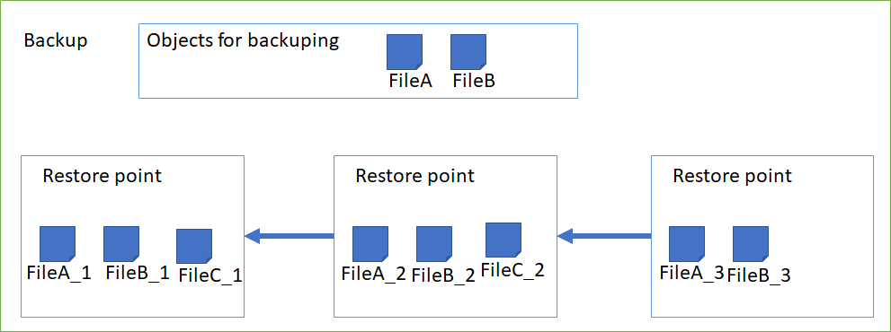
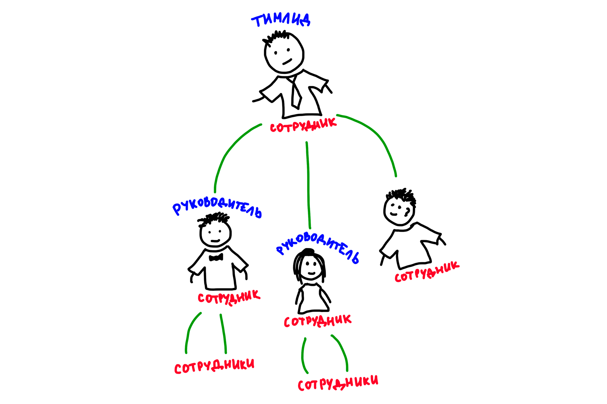

## Info

Все работы должны обрабатывать исключительные ситуации! Причем не бездумно везде try/catch писать, а обрабатывать, по возможности, другими механизмами (использовать TryParse при считывании с консоли, проверять существование перед обращением, логические ошибки аккуратно обрабатывать и т.д.). Try/catch тоже можно, но там, где это оправдано.

# Лабораторная 1

Создать инструмент для обработки конфигурационного INI файла.

Описать и реализовать необходимые классы, которые позволят производить обработку конфигурационного файла, который представляет собой текстовый файл, разделенный на СЕКЦИИ, которые содержат пары ИМЯ, ЗНАЧЕНИЕ.

Пример файла:

```scheme
[COMMON]
StatisterTimeMs = 5000
LogNCDM = 1 ;Logging ncdm proto
LogXML = 0 ;Logging XML proto
DiskCachePath = /sata/panorama ;path for the file cache

OpenMPTThreadsCount = 2
[ADC_DEV]
BufferLenSecons = 0.65 ;Buffer length for ADC data in GPU memory, seconds.
SampleRate = 120000000.0 ;Sample rate of ADC.
Driver = libusb ;cypress / libusb / random / fileIQS

[NCMD]
EnableChannelControl = 1 ;Use or not CHG / CHGEXT commands
SampleRate = 900000.0 ;ANOTHER Sample Rate.
TidPacketVersionForTidControlCommand = 2
;TidPacket versions
; 0 - no packets
; 1 - header: data size, tid
; 2 - header: data size, tid, timestamp

[LEGACY_XML]
ListenTcpPort = 1976

[DEBUG]
PlentySockMaxSize = 126
```

Все имена параметров и секций – это строки без пробелов, состоящие из символов латинского алфавита, цифр и знаков нижнего подчеркивания. Имена секций заключены в квадратные скобки, без пробелов. Значения параметров отделены от имен параметров знаком = (равенство)

Значения параметров могут быть одним из типов:

- целочисленным,
- вещественным,
- строковым: без пробелов, но в отличие от имени параметра может содержать также символ «точка».

Файл может содержать комментарии. Комментарием считается всё, что находится после знака «точка с запятой». Комментарии, как и сам знак «точка с запятой» должны быть проигнорированы.

Должны быть реализованы методы «получить значение определенного типа с таким-то именем из такой-то секции» (например, получить целое ListenTcpPort из секции LEGACY_XML)

Должны быть обработаны ошибки:

- Ошибка файловой подсистемы (например, если файл не найден)
- Ошибка формата файла (если файл имеет неверный формат)
- Неверный тип параметра (ошибка при приведении типа)
- Заданной пары СЕКЦИЯ ПАРАМЕТР нет в конфигурационном файл
- Другие, при необходимости.

### Дополнительная информация

1. Пример, как должно выглядеть использование парсера: [https://pastebin.com/AqaDBacW](https://pastebin.com/AqaDBacW)
2. Best practice для методов с названием по типу TryGet(...) это иметь сигнатуру а-ля **:`bool TryGetString(string key, out string value)`**

## Definition of done

Готова лабораторная работа подразумевает:

1. Загруженный исходный код на github
2. Написанные тесты для кейсов:
    1. Чтение параметров всех трех типов
    2. Валидный парсинг с комментариями
    3. Случай с отсутствием секции и/или ключа
    4. Не валидные строки - нет знака равно
3. Сдача теории по лабораторной работе практику

## FAQ

- Q: Нужно ли  как то парсить массивы данных и вообще как  то обрабатывать ситуации которые не указаны  в самом ТЗ, но используются в ini файлах?
- Не обязательно.

- Q: Если в каком-то месте в файле перед параметром не будет секции, это обрабатывать как ошибку или добавлять секцию по умолчанию (например назвать ее [ROOT]) ?
- A: Можно бросать ошибку или использовать дефолтную секцию

- Q: Что делать если имена секций повторяются?
- A: Мерджить либо брать только первую/последнюю

- Q: Необходимо ли учёт регистра при попытке получить некоторое значение из определённой секции?
- A: Можно учитывать либо не учитывать

- Q: Что делать если после `=` нет значения?
- A: Бросать ошибку либо считаться за значение пустую строку

# Лабораторная 2

Есть **Товары**, которые продаются в **Магазинах**.
У **магазинов** есть код (уникальный), название (не обязательно уникальное) и адрес.
У **товаров** есть код (уникальный), название (не обязательно уникальное).
В каждом магазине установлена своя цена на товар и есть в наличии некоторое количество единиц товара (какого-то товара может и не быть вовсе).

Написать методы для следующих операций:

1. Создать магазин;
2. Создать товар;
3. Завезти партию товаров в магазин (набор товар-количество с возможностью установить/изменить цену);
4. Найти магазин, в котором определенный товар самый дешевый;
5. Понять, какие товары можно купить в магазине на некоторую сумму (например, на 100 рублей можно купить три кг огурцов или две шоколадки);
6. Купить партию товаров в магазине (параметры - сколько каких товаров купить, метод возвращает общую стоимость покупки либо её невозможность, если товара не хватает);
7. Найти, в каком магазине партия товаров (набор товар-количество) имеет наименьшую сумму (в целом). Например, «в каком магазине дешевле всего купить 10 гвоздей и 20 шурупов». Наличие товара в магазинах учитывается!

Для демонстрации необходимо создать минимум 3 различиных магазина, 10 типов товаров и наполнить ими магазины.

### **Указанные ваше методы должны быть отображены в тестах**.
## FAQ
- Q: Нужно ли указывать id при создании?
- Т.к. id должен гарантировать уникальность - очень странно давать его указывать

# Лабораторная 3

Разработать примитивный движок для фэнтезийного симулятора гонок.

В симуляторе присутствуют несколько типов транспортных средств:

- двугорбый верблюд;
- верблюд-быстроход;
- кентавр;
- ботинки-вездеходы;
- ковер-самолет;
- ступа;
- метла.

Можно добавить свои собственные типы.

При этом все типы транспортных средств делятся на два класса:

- наземные;
- воздушные.

Наземные типы транспорта обладают следующими характеристиками:

- скорость, в условных единицах;
- время движения до отдыха, в условных единицах;
- длительность отдыха, в условных единицах, задается формулой (зависит от номера остановки по счету).

Воздушные типы транспорта обладают следующими характеристиками:

- скорость, в условных единицах;
- коэффициент сокращения расстояния за счет перелетов, в % от расстояния, задается формулой (зависит от расстояния).

В симуляторе присутствуют несколько типов гонок:

- только для наземного транспорта;
- только для воздушного транспорта;
- для любого типа транспорта.

Движок должен иметь возможность:

1. Создать гонку;
2. Зарегистрировать на гонку транспортное средство в соответствии с допустимым классом транспортного средства (нельзя зарегистрировать воздушное транспортное средство на гонку только для наземных транспортных средств и наоборот);
3. Запустить гонку (определить победителя).

[Таблица с характеристиками наземных транспортных средств](https://www.notion.so/0c9e1ba9e3bb4984afd828197b58fe33)

[Таблица с характеристиками воздушных транспортных средств](https://www.notion.so/669bda3ed1b8492290398ae05dc9daf0)

## FAQ
Q: Под "можно добавлять свои типы" подразумевается интерфейс для пользователя или возможность расширения кода?
A: Это значит, что можно создать свои классы транспортных средств, если захотите.

Q: И как понимать "коэффициент сокращения расстояния" - как процент пути, который не учитывается при расчете?
A: Этот коэффициент уменьшает расстояние, которое необходимо преодолеть. Например, расстояние 100, при коэффициенте 10% надо будет преодолеть всего 90 единиц расстояния.

# Лабораторная 4

## Теормин

**Бекап** — в общем случае, это резервная копия каких-то данных, которая делается для того, чтобы в дальнейшем можно было восстановить эти данные, то есть откатиться до того момента, когда она была создана.

**Точка восстановления** — резервная копия объектов, созданная в определенный момент. Представлена датой создания и список резервных копий объектов, которые бекапились. Есть два типа точек восстановления - полноценные и инкрементальные. Полноценные точки содержат всю информацию про объекты, которые забекапились. Инкрементальные поинты - это разница (дельта) относительно предыдущей точки, т.е. мы храним только изменения.



## Условие

В рамках лабораторной работы подразумевается разработка системы, которая управляет процессом создания бекапов. Для упрощения выполнения лабораторной, создавать физически резервные копии указанных файлов не требуется. Достаточно будет создать запись о том, что было сделано резервное копирование.

```scheme
FileRestoreCopyInfo CreateRestore(string filePath)
{
		var fileInfo = new FileInfo(filePath);
    var fileRestoreCopyInfo = new FileRestoreCopyInfo(filePath, fileInfo.Size, DateTime.Now);
		//File.Copy(filePath, _pathWhereWeNeedToStoreOurBackup); <- Вот эту часть мы можем скипать
		return fileRestoreCopyInfo;
}
```

Информация о бекапе представлена в виде набора параметров: Id, CreationTime, BackupSize и список точек восстановления.

### Алгоритмы создания и хранения

Для создания бекапа указываются объекты: список файлов. Должна быть реализована возможность в последствии этот список редактировать - добавлять и удалять объекты из списка объектов которые будут обрабатываться в алгоритме.

Система должна поддерживать несколько алгоритмов создания точек восстановления для бекапа, а также возможность увеличивать их количество. Результатом работы алгоритма является создание новой точки восстановления для указанного бекапа. Точка восстановления хранит о себе информацию о том, какие объекты были в ней забекаплены. В алгоритме должна быть возможность указать требуется ли создать полноценную точку или только дельту с прошлого раза (т.е. инкремент).

Требуется реализовать как минимум два алгоритма хранения:

1. Алгоритм раздельного хранения — файлы копируются в специальную папку и хранятся там раздельно.
2. Алгоритм общего хранения — все указанные в бекапе объекты складываются в один архив.

### Алгоритмы очистки точек

Помимо создания, нужно контролировать количество хранимых точек восстановления. Чтобы не допускать накопления большого количества старых и неактуальных точек, требуется реализовать механизмы их очистки — они должны контролировать, чтобы цепочка точек восстановления не выходила за допустимый лимит. В рамках лабораторной подразумеваются такие типы лимитов:

1. По количеству - ограничивает длину цепочки точек восстановления (храним последние N точек)
2. По дате - ограничивает насколько старые точки будут хранится (храним все точки, которые были сделаны не позднее указанной даты)
3. По размеру - ограничивает суммарный размер, занимаемый бекапом (храним все последние бекапы, суммарный размер которых не превышает лимит)
4. Гибрид - возможность комбинировать лимиты. Пользователь может указывать, как комбинировать:
    - нужно удалить точку, если вышла за хотя бы один установленный лимит
    - нужно удалить точку, если вышла за все установленные лимиты

    Например, пользователь выбирает гибрид алгоритмов "по количеству" и "по дате". Если по одному из алгоритмов необходимо оставить 3 точки, а по другому — 5, то выбирается количество точек в соответствии с параметром, указанном при создании "гибрида" (использовать максимальное или минимальное значение отобранных точек).

Алгоритм должен учитывать то, что инкрементальные точки не должны остаться без точки, от которой взята дельта. В случае, если пришлось оставить точек больше, чем планировалось, результат выполнения алгоритма должен вернуть соответствующее предупреждение.

### Тесты

Для проверки работоспособности разработанной системы предлагается реализовать юз-кейсы (пользовательские сценарии использования программы):

1. Кейс №1
    1. Я создаю бекап, в который добавляю 2 файла.
    2. Я запускаю алгоритм создания точки для этого бекапа — создается точка восстановления.
    3. Я должен убедиться, что в этой точке лежит информация по двум файлам.
    4. Я создаю следующую точку восстановления для цепочки
    5. Я применяю алгоритм очистки цепочки по принципу ограничения максимального количества указав длину 1.
    6. Я убеждаюсь, что в ответ получу цепочку длиной 1.
2. Кейс №2
    1. Я создаю бекап, в который добавляю 2 файла размером по 100 мб.
    2. Я создаю точку восстановления для него.
    3. Я создаю следующую точку, убеждаюсь, что точки две и размер бекапа 400 мб.
    4. Я применяю алгоритм очистки с ограничением по размеру, указываю 250 мб для цепочки и убеждаюсь, что остается один бекап.
3. Кейсы с инкрементами на тестирование алгоритмов сохранения.
4. Кейсы на два способа комбинации в гибридном лимите.

## Notes

1. Для проверки работоспособности алгоритма работы со временем вам нужно будет продумать механизм путешествия во времени.
2. [https://www.backupsolution.ru/backup-types/](https://www.backupsolution.ru/backup-types/)

В рамках 4-ой лабораторной работы был сделан акцент на абстракциях, что можно было понять по тому, что вся логика разделена на алгоритмы. Если вы хорошо закрыли прошлый семестр программирования, то возможно помните про open–closed principle - "A class is closed, since it may be compiled, stored in a library, baselined, and used by client classes. But it is also open, since any new class may use it as parent, adding new features". И абстрагирование над алгоритмами - отличная демонстрация OCP. Решение в рамках лабораторной может быть реализовано таким образом, чтобы оно было закрыто (читать как "его не нужно будет изменять чтобы добавить функционал") но с возможностью расширять (добавить алгоритм для обратных инкрементов, алгоритм удаления, который не будет удалять бекапы за понедельник и алгоритм хранения, который будет сразу заливать бекапы на гугл диск).
Например, хорошим решением будет реализовать подобный интерфейс взаимодействия :

```CS
public BackupJob(
    Backup backup,
    IFileCopyCreateAlgorithm fileCopyCreateAlgorithm,
    IPointCreateAlgorithm pointCreateAlgorithm,
    IPointDeleteAlgorithm pointDeleteAlgorithm)
{
    _backup = backup;
    _fileCopyCreateAlgorithm = fileCopyCreateAlgorithm;
    _pointCreateAlgorithm = pointCreateAlgorithm;
    _pointDeleteAlgorithm = pointDeleteAlgorithm;
}

public void Run()
{
    //_fileCopyCreateAlgorithm.CreateFor(_backup);
    //_pointCreateAlgorithm.CreateFor(_backup);
    //_pointDeleteAlgorithm.RemoveFrom(_backup);
}
```

## FAQ
- Q: мы храним информацию о бэкапе, но сам бэкап не храним. Что мы делаем с инкрементным бэкапом: сохраняем изменения куда-то или храним также только информацию о бэкапе и его тип(инкрементность)?
-  В случае инкрементов ситуация аналогичная т.к. мы упростили и не делаем бекапы) Разница только в том, что точки будут инкрементальные и их нужно по особому обработать.

- Q: в случае, если пользователь выбирает при создании первой точки восстановления инкрементальный способ, то лучше кидать пользователю предупреждение, что мы создаём полноценную точку восстановления и осуществляем это процесс; или лучше кинуть ошибку пользователю, что первая точка восстановления обязана быть полноценной и потребовать от него повторный выбор?
- Мне кажется, главное обработать корректно ситуацию. Бросать эксепшен кажется приемлемым решением. Но если есть идеи как предупреждение пользователю кинуть - можно попробовать (спойлер: в бизнес логику добавить WriteLine - идея крайне плохая).

- Q: Что такое BackupSize? Как мы считаем его размер
- Размер точки - это сумма размеров файлов, которые в нее входят. Размер бэкапа- сумма размеров его точек
  
- Q: Принцип ограничения/лимитов задается сразу бекапу или его в последствии можно менять?
- Алгоритмы лимита применяются к бекапу, но он бекап не должен зависить от алгоритмов очистки.

- Q: У нас есть Backup  - в нем есть список файлов и директорий , которые надо забэкапить и есть точки восстановления. Получается точки восстановления делают список копий файлов , которые в бэкапе? 
- Да, точки де-юре состоят из резервных копий файлов, которые добавили в бекап. И да, пункт пункт про папки убрали почти сразу, не усложняет себе жизнь)

- Q: алгоритм хранения определяется для всего бекапа или отдельно для каждой точки сохранения? Другими словами, могут ли в одном бекапе быть точки с разными алгоритмами хранения?
- варианта вполне приемлемы, если реализовать нормально

# Лабораторная 5

Есть несколько **Банков**, которые предоставляют финансовые услуги по операциям с деньгами.

В банке есть **Счета** и **Клиенты**. У клиента есть имя, фамилия, адрес и номер паспорта (имя и фамилия обязательны, остальное – опционально).

Счета бывают трёх видов: **Дебетовый счет**, **Депозит** и **Кредитный счет**. Каждый счет принадлежит какому-то клиенту.

**Дебетовый счет** – обычный счет с фиксированным процентом на остаток. Деньги можно снимать в любой момент, в минус уходить нельзя. Комиссий нет.

**Депозит** – счет, с которого нельзя снимать и переводить деньги до тех пор, пока не закончится его срок (пополнять можно). Процент на остаток зависит от изначальной суммы, например, если открываем депозит до 50 000 р. - 3%, если от 50 000 р. до 100 000 р. - 3.5%, больше 100 000 р. - 4%. Комиссий нет.

**Кредитный счет** – имеет кредитный лимит, в рамках которого можно уходить в минус (в плюс тоже можно). Процента на остаток нет. Есть фиксированная комиссия за использование, если клиент в минусе.

Процент на остаток начисляется ежедневно от текущей суммы в этот день, но выплачивается раз в месяц (и для дебетовой карты и для депозита). Например, 3.65% годовых. Значит в день: 3.65% / 365 дней = 0.01%. У клиента сегодня 100 000 р. на счету - запомнили, что у него уже 10 р. Завтра ему пришла ЗП и стало 200 000 р. За этот день ему добавили ещё 20 р. На следующий день он купил себе новый ПК и у него осталось 50 000 р. - добавили 5 р. Таким образом, к концу месяца складываем все, что запоминали. Допустим, вышло 300 р. - эта сумма добаляется к счету или депозиту в текущем месяце.

Разные банки предлагают разные условия. В каждом банке известны величины процентов и комиссий.

Каждый счет должен предоставлять механизм **снятия**, **пополнения** и **перевода** денег (то есть счетам нужны некоторые идентификаторы).

Клиент должен создаваться по шагам. Сначала он указывает имя и фамилию (обязательно), затем адрес (можно пропустить и не указывать), затем паспортные данные (можно пропустить и не указывать).

Если при создании счета у клиента не указаны адрес или номер паспорта, мы объявляем такой счет (любого типа) сомнительным, и запрещаем операции снятия и перевода выше определенной суммы (у каждого банка своё значение). Если в дальнейшем клиент указывает всю необходимую информацию о себе - счет перестает быть сомнительным и может использоваться без ограничений.

Периодически банки проводят операции по выплате процентов и вычету комиссии. Это значит, что нужен механизм проматывания времени, чтобы посмотреть, что будет через день/месяц/год и т.п.

Еще обязательный механизм, который должны иметь банки - **отмена транзакций**. Если вдруг выяснится, что транзакция была совершена злоумышленником, то такая транзакция должна быть отменена.

# Лабораторная 6

Требуется реализовать механизм автоматизации создания отчётов о проделанной командой работе за определённый период разработки (далее - спринт), интегрируя это с системой управления задачами, используемой командой. В команде один из сотрудников - тимлид, он составляет итоговый отчёт о проделанной работе команды в конце каждого спринта.

### Ход событий:

1. Сотрудник может добавлять новые задачи, вносить изменения в существующие и, наконец, выполнять их.
2. Сотрудник должен писать отчёт о проделанной работе за каждый рабочий день. Чтобы это сделать он использует список всех изменений, произведённых с момента создания предыдущего отчёта. На основе ежедневных отчётов и будет составляться отчёт за спринт - итог проделанной каждым сотрудником работы. В течение дня сотрудник делает отчёт, прикрепляя к нему выполненные за этот день задачи.
3. В конце спринта сотрудник должен написать отчёт за спринт. Для этого у него имеется доступ к выполненным за время спринта задачам и к ежедневным отчётам.
4. Тимлид в конце спринта пишет отчёт за всю команду, просматривая список выполненных задач и отчётов.

## Сущности

- Сотрудник
- Задача, существующая в системе управления задачами
- Отчёт (за один день и за весь спринт)

### Сотрудник

Сотрудник представлен следующим набором атрибутов:

- имя
- руководитель (необязательный)
- список подчиненных (необязательный)

В реализованной системе должна быть возможность добавлять новых сотрудников, изменять руководителя сотрудника и получать иерархию всех сотрудников.

Иерархия сотрудников представляется следующим образом: тимлид - сотрудник, руководитель - корень дерева, которому подчиняются другие сотрудники, которые могут иметь или не иметь подчинённых.



### Задача

Задача представлена следующим набором атрибутов:

- название
- описание
- назначенный за ней сотрудник (только один на задачу)

Задача может находиться в одном из трёх состояний:

1. Open - задача создана, но к её выполнению ещё не приступили.
2. Active - задача находится в процессе выполнения.
3. Resolved - задача выполнена.

Задача находится в системе управления задачами, которую также необходимо реализовать как отдельную сущность.
Сотрудник должен иметь возможность добавить комментарий к задаче.

Все изменения (состояние/назначенный сотрудник/комментарий) должны фиксироваться во времени. При этом в системе должна быть возможность просмотреть, когда было сделано определённое изменение.

**Система управления задачами** должна поддерживать следующий функционал:

- поиск задач по ID
- поиск задач по времени создания/последнего изменения
- поиск задач, закреплённых за определённым пользователем (сотрудником команды)
- поиск задач, в которые пользователь вносил изменения
- создание задачи, изменение её состояния, добавления к ней комментария, изменение назначенного за ней сотрудника
- получение списка задач, которые назначены подчинённым определённого сотрудника

### Отчёт

**За день**

Необходимо реализовать возможность создания отчёта за текущий день и его редактирования в течение этого дня. Также у сотрудника должна быть возможность просмотреть задачи, которые были выполнены за этот период.

**За спринт**

Необходимо реализовать возможность написания отчётов за весь спринт. В системе на каждый спринт создается драфт отчёта (то есть черновик, начальный проект отчёта за спринт, который в дальнейшем будет корректироваться), который заполняет каждый сотрудник. Для написания отчёта пользователю системы должна предоставляться возможность получить список всех своих задач за спринт, а также список отчётов своих подчиненных за спринт.

После окончания написания отчёта за спринт сотрудник должен сохранить его в системе. После этого отчёт считается завершённым, доступ на его редактирование закрывается. Тимлид должен иметь возможность видеть статус отчёта. Если отчёт завершённый, то он агрегирует в командный отчёт за спринт.

## Детали реализации

Должна быть реализована многослойная архитектура - вы должны явно показать 3 слоя.
реализовать можно одним проектом (хотя рекомендую дробить на несколько - самим проще будет).
Если делаете одним проектом - как минимум должны быть отдельные файлы и папки (папка со слоем dal, в нем контракты и модели, папка со слоем bll и т.д.)

На усмотрение студента можно добавить:

- хранение в базе данных, использованием ORM

# Some more...

### Вложенность
По мотивам пачки отсмотренных лаб напишу небольшой ремайндер.
Очередной раз пихая if в if в if, задумайтесь о том как много контекста нужно держать в голове чтобы ваш код прочитать и сколько нужно отмотать строк в низ, чтобы увидеть что там произойдет в else. Вложенность стоит минимизировать особенно в случаях, когда это ничего не стоит. Например, если это проверки, которые бросают эксепшены - лучше проверить и бросать эксепшен, если не удалось, а не расписывать if/else.
```Cs
if (File.Exists(path))
{
    if (new FileInfo(path).Extension == "ini")
    {
        return Parse(File.ReadAllLine(path));
    }
    else
    {
        throw new Exception("Invalid extension");
    }
}
else
{
    throw new Exception("File does not exist");
}
//======================================
if (!File.Exists(path))
    throw new Exception("File does not exist");

if (new FileInfo(path).Extension != "ini")
    throw new Exception("Invalid extension");

return Parse(File.ReadAllLine(path));
```