**БИЛЕТЫ, ОС, 2 КУРС\
\
**Документы:\

1. [Конспект лекций](https://drive.google.com/file/d/1f9g5-D2Hcn96sl4GZvNUDpSjz0XC8azv/view?usp=sharing)
2. [Краткий конспект лекций](https://drive.google.com/file/d/1gxWgFSRLeUyCRChIsaXTfLZU3zEoky6L/view?usp=sharing)
3.  [Лекции МГУ](http://jaffar.cs.msu.su/mash/os/2017-2018/%CA%EE%ED%F1%EF%E5%EA%F2/%CE%EF%E5%F0%E0%F6%E8%EE%ED%ED%FB%E5%20%F1%E8%F1%F2%E5%EC%FB%202017.pdf)
4. [Документ по межпроцессному взаимодействию](http://www.nrjetix.com/fileadmin/doc/publications/Lectures/Lecture3-3.pdf)
5. [Ответы на вопросы к экзамену](https://studfiles.net/preview/1910846/)

Преподаватель: Александр Владимирович Маятин

Документ оформляли:
-   Лосицкий Е.И.
-   Баркалов М.М
-   Шин Э.А.
-   Григорьев В.М.
-   Наумов О.В.
-   Ивлиев М.

2017-2018 уч. год.

1. Функции и механизмы ОС, появившиеся на этапе программ-диспетчеров, предшественников операционных систем.
===========================================================================================================

В первых компьютерах операционные системы отсутствовали. Обращение к
памяти в них осуществлялось по реальным (физическим) адресам, а
обращение к внешним устройствам (например, к устройству ввода с
перфокарт или накопителю на магнитной ленте) осуществлялось специальными
командами, также по физическим адресам.

Каждый пользователь перед уходом \"с машины\" останавливал и \"обнулял\"
ее нажатием кнопок на пульте и уступал место следующему пользователю,
который вводил свою программу и данные с перфокарт или перфоленты,
набирал ее начальный адрес тумблерами на пульте и запускал ее с помощью
специальной кнопки. При любом сбое или ошибке в программе, в ситуации
приходилось разбираться, изучая показания лампочек на пульте,
воспроизводящие в двоичном виде содержимое регистров.

Первый этап в развитии операционных систем - **операционные
диспетчеры.**

Пользователи передают перфокарты с программами оператору машинного зала.
В машинном зале оператор вводил очередное задание с перфокарт.
Программа-диспетчер копировала образ введенной колоды перфокарт с
заданием на ленту ввода, на которой хранились все образы заданий в
хронологическом порядке их ввода, независимо от требуемых для них
ресурсов -- времени и объема памяти.

Диспетчер осуществлял запуск по принципу FIFO.

Выбирая из очереди некоторое задание, диспетчер размещал его в памяти и
запускал. По окончании задания (или при его прерывании вследствие
ошибки) на печатающее устройство выдавалась распечатка результатов.
Затем управление передавалось следующему заданию.

Недостаток метода в том, что, во-первых, программы пропускались по
очереди (отсутствовала одновременная обработка нескольких заданий),
во-вторых, ресурсы, требуемые для выполнения задания, никак не
учитывались, и программа, требующая для выполнения всего 1 мин., должна
была ожидать завершения большой задачи, требовавшей для выполнения,
например, пяти часов, - только потому, что последняя была раньше введена
в систему.

ЭВМ Фон-Неймана:

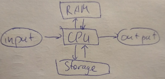

Функции диспетчеров:\
**1. *Повторное использование кода, организация линковки.***\
**Линковка** - системная программа преобразует ссылку в подпрограмму.

**2. *Оптимизация взаимодействия с Input/Output/Storage***

Взаимодействие с input/output/storage занимало очень много времени из-за
однозадачности CPU.

Будем совершать это через простейший процессор - контроллер.

Спулинг (SPOOL, Simultaneous Peripheral Output On-Line) - процесс
взаимодействия ram/storage через контроллер

SPOOL (спулинг) --- спулинг это буферизация данных перед их обработкой\
Контроллер сохранял в своих регистрах не только те данные, которые
запрашивались, но и те, которые могут потребоваться в ближайшее время.

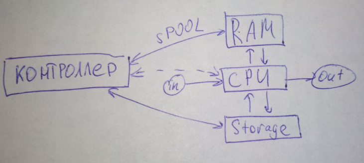

**Прерывание (Interrupt)** - специальный сигнал от контроллера к CPU
сообщающий о некотором событии (наступлении события), прерывающий ход
выполнения текущей программы и передающий управление обработчику
прерываний.

**3. Однопрограммная *пакетная обработка***\
**Пакет** - совокупность программных модулей, обрабатываемых данных и
конфигураций.

Загрузка пакета в память, планирование выполнения пакетов.

1. Функции и механизмы ОС, появившиеся на этапе мультипрограммных операционных систем.
======================================================================================

Мультипрограммные = многопрограммные

В это время появляется сам термин ОС. **Операционная система** - базовое
системное программное обеспечение, управляющее работой компьютера и
являющееся интерфейсом между аппаратурой, прикладным программным
обеспечением и пользователем.

Идея - выполнять одновременно несколько задач, появление
псеводопараллельности\
1. *Псевдопараллельность*\
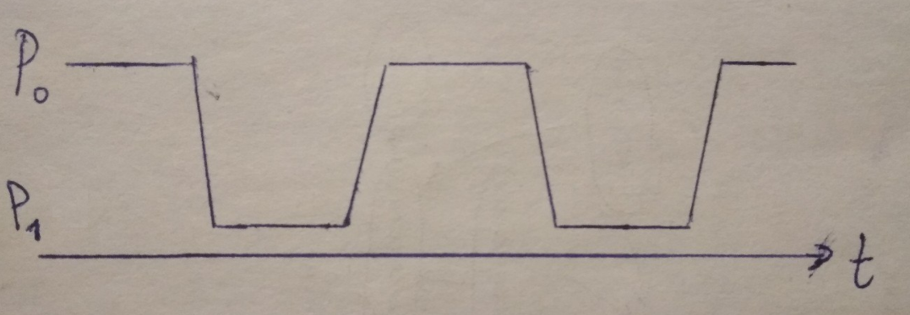
Переключение между процессами занимает время.

Новый вид прерывания - по таймеру или по тактам, со своим обработчиком
прерывания.\
При переключении необходимо сохранить контекст процесса (то, что он
хранит в регистрах) и заменить его контекстом другого процесса.\
1. *Разделение памяти для процессов*

**Virtual Memory** - способ адресации, при котором каждой программе
выделяется виртуальное пространство, адресуемое с нуля. ОС подменяет
виртуальный адрес на реальный.\
Появляется задача защиты областей памяти.\
3. *Access Violation* (нарушение доступа) - прерывание для защиты
памяти.\
Программы могут по обращаться к чужим областям памяти.

4. *Планирование памяти и процессорного времени*

Каждый процесс считает, что он имеет полное адресное пространство, но
физическая память ограничена, поэтому нужно планировать использование
памяти процессами.\
ОС также должна решать когда и какой процесс будет выполняться, при
каких условиях переключаться.\
5. *Коммуникация между программами*

6. *Разделение доступа к внешней информации, файлам*\
Все эти механизмы были объединены **концепцией виртуализации**:

ОС обеспечивает изоляцию приложения от ненужных ему ресурсов.\
(Первая полноценная реализация - Main Control Program (MCP), компьютер
Barrows B5000, 1963г)

**Системный вызов** - обращение программы к ОС с требованием
дополнительного ресурса или выполнения привилегированной операции.\
ОС работает в привилегированном режиме, имеет доступ ко всей памяти и
ресурсам.

3. Функции и механизмы, появившиеся на этапе сетевых и мобильных операционных систем. 
=====================================================================================

В начале 70-х годов появились первые **сетевые операционные системы**,
позволившие организовать распределенное хранение и обработку данных
между несколькими связанными компьютерами.\
Сетевая ОС выполняет все функции локальной операционной системы, а также
обладает некоторыми дополнительными средствами, позволяющими ей
взаимодействовать по сети с операционными системами других компьютеров.

**Многотерминальность** - поддержка ввода данных с разных машин. Идея
передачи данных через модем.\
\
Первые результаты по объединению компьютеров были получены в конце 60-х
годов, когда с помощью глобальных связей и техники коммутации пакетов
удалось реализовать взаимодействие машин класса мейнфреймов и
суперкомпьютеров.\
В 1969 году Министерство обороны США инициировало работы по объединению
суперкомпьютеров оборонных и научно-исследовательских центров в единую
сеть. Эта сеть получила название ARPANET и являлась предшественником
Интернета. Сеть ARPANET объединяла компьютеры разных типов, работавшие
под управлением различных ОС с добавленными модулями, реализующими
коммуникационные протоколы, общие для всех компьютеров сети.\
В 1974 IBM создала собственную сетевую архитектуру для своих
мейнфреймов. Она называлась SNA (System Network Architecture).\
В это же время в Европе велись активные работы по созданию и
стандартизации сетей Х.25.\
Эти сети с коммутацией пакетов не были привязаны к какой-либо конкретной
операционной системе.\
После получения статуса международного стандарта в 1974 году протоколы
Х.25 стали поддерживаться многими операционными системами. С 1980 года
компания IBM включила поддержку протоколов Х.25

Разработка каждой ОС на ассемблере для каждой новой модели компьютера
занимала слишком много времени. Возникла идея мобильных (переносимых)
ОС.\
**Мобильные (переносимые) ОС** -- операционные системы, которые могли бы
использоваться на нескольких семействах компьютеров путем переноса их
кода (возможно, с небольшими изменениями) с более старых моделей на
более новые.\
Первая мобильная ОС была разработана в 1970 г. Брайаном Керниганом (B.
Kernighan) и Деннисом Ритчи (D. Ritchie) в фирме AT & T и получила
название UNICS (UNIX).\
Основная идея UNIX -- унификация и упрощение представления файлов и
операций над ними (в UNIX файл -- это последовательность байтов),
пользовательских программ и процессов.**\
**Унифицированным, не зависимым от целевой аппаратной платформы, был
также исходный код UNIX, который был полностью написан на специально
разработанном новом языке Си (основными авторами Си, как и UNIX,
являются Томпсон, Керниган, Ритчи).\
Язык Си был разработан на основе языка Би.

Использование языка высокого уровня для разработки UNIX было
революционным шагом в истории ОС и позволило, во-первых, значительно
ускорить и облегчить разработку, во-вторых -- перенести UNIX на многие
модели компьютеров (для которых при этом необходимо было разработать
компилятор с языка Си).

Впервые система UNIX была использована в 1970 г. на миникомпьютере
PDP-10. Nextstep -\> MacOS. GNU Not Unix -\> Linux

4. Задачи и механизмы, реализуемые в рамках функции операционной системы по обеспечению интерфейса между пользовательскими приложениями и аппаратным обеспечением вычислительного узла.
=======================================================================================================================================================================================

Функции ОС:

**1.** Организация интерфейса между ПО и аппаратным обеспечением. Задачи
функции:

**1. *Предоставление API для взаимодействия с ОС***

ОС представляет программисту разнообразные инструменты разработки
приложений. Ему не обязательно знать, как функционируют различные
электронные узлы и устройства компьютера.\
Возможно, здесь стоит упомянуть про GUI (graphical user interface).\
В начале 1980-х гг. фирма Apple выпустила персональные компьютеры Lisa и
Macintosh с операционной системой MacOS. MacOS стала первой ОС с
развитой поддержкой GUI.\
\
**2. *Управление запуском и исполнением программ****\
*Для запуска программы нужно выполнить ряд действий: загрузить в
основную память программу и данные, инициализировать устройства
ввода-вывода и файлы, подготовить другие ресурсы. ОС выполняет всю эту
рутинную работу вместо пользователя.

**3. *Доступ к устройствам ввода-вывода****\
*Для управления каждым устройством используется свой набор команд. ОС
предоставляет пользователю единообразный интерфейс, который скрывает все
эти детали и обеспечивает программисту доступ к устройствам ввода-вывода
с помощью простых команд чтения и записи.\
Также сюда можно отнести механизм Plug-and-Play (подключение нового
устройства без остановки компьютера) с большим набором встроенных
драйверов для различных устройств.\
Впервые появился в Windows 95

**4. *Контролируемый доступ к файлам***

При работе с файлами управление со стороны ОС предполагает не только
глубокий учет природы устройства ввода-вывода, но и знание структур
данных, использованных для организации работы с файлами.

**5. *Обнаружение ошибок и их обработка***

Обработка исключений, проверка на корректность перед выполнением,
генерация исключений.\
Вывод сообщений об ошибках, аварийная остановка программы.

**6. *Учёт использования ресурсов*** (для оптимизации работы конкретного
приложения)\
ОС имеет средства учета использования ресурсов каждым процессом. Эта
информация важна для оптимизации вычислительной системы с целью
повышения производительности.

В результате реальная машина, способная выполнить только небольшой набор
элементарных действий, с помощью ОС превращается в виртуальную машину,
выполняющую широкий набор гораздо более мощных функций.\
Виртуальная машина тоже управляется командами, но уже командами более
высокого уровня, например: удалить файл с определенным именем, запустить
на выполнение прикладную программу, повысить приоритет задачи, вывести
текст файла на печать и т.д.

Дополнение к билету 4, **5 целей ОС:**

1. Обеспечение эффективности, надежности и безопасности *выполнения
пользовательских программ (ПО).*

2. Обеспечение эффективности, надежности и безопасности *использования
аппаратного обеспечения.*

3. Обеспечение эффективности, надежности и безопасности *хранения
данных*

4. Обеспечение доступа к *телекоммуникационным ресурсам*

5. Организация *диалога с пользователем*.

Дополнение к билету 4, остальные функции:\
2. *Оптимизация использования ресурсов* (это билет 5)\
Невозможно адекватно оценить "оптимальность" использования решения

3. *Обеспечение надежности эксплуатации аппаратных и программных
средств*. Задачи функции:

1. резервирование данных

2. профилактические работы

3. восстановление утилитами после сбоя

Проще предсказать сбой, чем исправить

4. *Поддержка развития ОС*

Новое оборудование, ПО, уязвимости (избыточность при разработке)\
Механизм обновлений (совместимость, сохранение архитектуры)

5. Принципы организации эффективного использования ресурсов компьютера. Критерии эффективности. Подходы к решению многокритериальной задачи.
============================================================================================================================================

*[//НЕ ТОЧНО]{.underline}* **\
**

Управление ресурсами включает решение ряда общих, не зависящих от типа
ресурса задач:

 1. *планирование ресурса* -- определение, какому процессу, когда и в
 каком качестве (если ресурс может выделяться частями) следует выделить
 данный ресурс;

 2. *удовлетворение запросов на ресурсы* -- выделение ресурса
 процессам;

 3. *отслеживание состояния и учет использования ресурса* --
 поддержание оперативной информации о занятости ресурса и
 распределенной его доли;

 4. *разрешение конфликтов между процессами*, претендующими на один и
 тот же ресурс.

Существуют разные критерии: эффективность, надежность, безопасность,
масштабируемость и т д. Среди них приходиться искать компромисс, понять,
чем пожертвовать, что в данной задаче важнее.

PDCA (Цикл Деминга)

"Балансировка критериев". С помощью цикла Деминга находим подходящие
соотношения.

Plan -- do -- check -- act

**Многокритериальная задача -** набор из нескольких критериев, некоторые
из них могут противоречить друг другу.

Подходы к решению:

1)  *Суперкритерий (свертка).* K = a\*k1 + b\*k2

Каждый критерий умножается на весовой коэффициент.

1.  *Привести к одной шкале все критерии (нормировать)*

2.  *Делаем коэф a, b.., чтобы их сумма была 1*

3.  *Находим максимальный суперкритерий*

2\) *Условный критерий.* max (или min) K \| k1 \> z, k2 \< z

Выбирается максимальный критерий с учетом заданных условий.

6. Принципы разработки архитектуры современной операционной системы. 
====================================================================

Под архитектурой операционной системы понимают структурную и
функциональную организацию ОС на основе некоторой совокупности
программных модулей. В состав ОС входят исполняемые и объектные модули
стандартных для данной ОС форматов, программные модули специального
формата (например, загрузчик ОС, драйверы ввода-вывода),
конфигурационные файлы, файлы документации, модули справочной системы и
т.д.

**Принципы разработки архитектуры ОС:**

**1. *Принцип модульной организации***

Выделение некоторого количества отдельных подструктур в ОС (сложность
внутри модуля должна быть больше, чем интерфейс модуля). Если
внутренность модуля меняется, интерфейс не должен меняться.

**2. *Принцип функциональной избыточности. ***

Принцип функциональной избыточности подразумевает заложение в ОС больших
функций, чем требуется и потенциально может потребоваться. Раньше не
предполагали о беспроводнылх устройствах и способах передачи данных,
однако в ОС Windows XP изначально разрабатывалась скорость передачи до 1
Гб/с. ОС должна предусматривают подключение разных устройств.

**3. *Принцип функциональной избирательности***

ОС должна предусматривать разнообразные устройства, программы. Но
пользователь должен иметь возможность отключить или не устанавливать то,
что ему не нужно.\
Современные ОС ввиду этого имеют разнообразные конфигурации (в Linux
конфигурации пользователь выбирает сам, в Microsoft -- все сборки
одинаковы, но в некоторых, в зависимости от версии, функции бывают
ограничены).

***4. Параметрическая универсальность***\
Меньше констант в коде

**5. *Принцип поддержки многослойности ***

(минимум два слоя: режим работы ядра и режим работы пользовательского
ПО, слоев может быть больше).\
ОС должна иметь некий эксклюзивный доступ (привилегированный режим) для
регулирования работы всей системы. Существуют специальные средства на
уровне чипсета в материнской памяти для прерывания программы.\
Ядро ОС имеет доступ ко всей физической памяти (в том числе и к
обработчикам прерывания), пользовательское ПО имеет доступ только к
выделенным ОС частям физической памяти. Прерывание ПО возможно в любом
случае, однако прерывание ОС невозможно в некоторых случаях, оно будет
игнорироваться.\
У кода ядра ОС есть две особенности: он выполняется в привилегированном
режиме и код ядра **резидентен** (полностью находится в оперативной
памяти).

В коде ядра записаны все критические ситуации ОС. ПО могут быть не
резидентны в оперативной памяти и не имеют привилегированного режима.

1. Виды архитектур ядер операционных систем. Общая характеристика каждого вида, достоинства и недостатки.
==================================================================================================================================================================================================

Архитектуры ядра:**\
1. *Монолитное ядро***

Все компоненты видят друг друга. (полная прозрачность всех процедур и
подпрограмм).\
Весь код ядра находится в одном общедоступном адресном пространстве.

Три слоя монолитного ядра: верхний слой содержит главную программу
(точка входа), средний - сервисные процедуры, системные вызовы, третий
слой - утилиты для работы с аппаратным обеспечением.

Программное обеспечение перед тем как выполнять системный вызов помещает
системный данные в качестве параметров в памяти (код данных и операций)
\> главная программа считывает, что требуется ПО \> выбирается сервисная
процедура (сколько нужно выполнить столько и будет сервисных процедур)
\> сервисная процедура может вызвать несколько соответствующих утилит \>
утилиты взаимодействует с аппаратурой \> главная программа возвращает ПО
ответ либо можно делать / либо сообщение об ошибке.

Преимущества:
-   надежность (никакое ПО не может вмешаться в работу ядра ОС)
-   минимальные накладные расходы (все прозрачно, без дополнительных интерфейсов)

Недостатки:
-   очень плохая изменяемость - изменение одной функции ведет к изменению всей ОС, (исходный код ядра менялся под новые версии драйверов и тд, перекомпиляция ядра).

Применяются во встраиваемых системах.

**2. *Многослойная архитектура***

*Слой 1: аппаратные средства поддержки ядра* (микропрограммы записанные
в чипсете материнской платы, например, для перехода в привилегированном
режим ОС, защита памяти, системный таймер, механизм прерываний, смена
контекста).\
Именно из-за первого слоя не на все железо можно поставить определенные
ОС. (если на первом слое это не реализовано, то невозможно).\
*Слой 2* (первый программный слой)*: машинно-зависимые модули* (слой
абстракции железа HAL)\
фактически драйвера для железа (чтобы ОС не зависела от конкретной
аппаратной платформы).
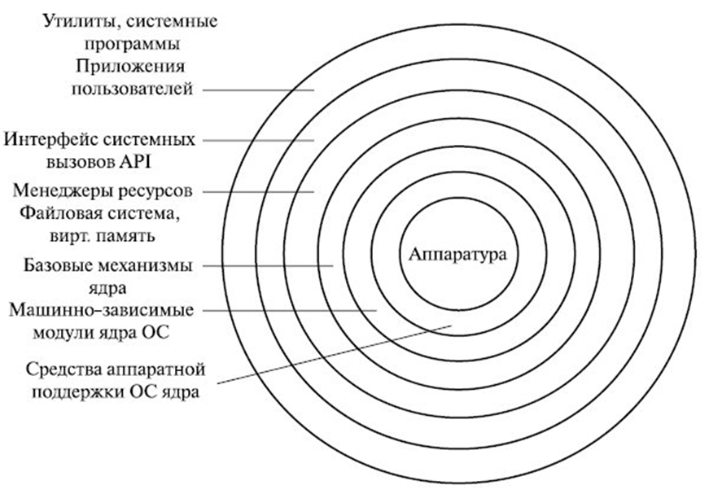

*Слой 3: базовые механизмы ядра*\
На нем реализуется все основные функции ОС (открытие/закрытие файлов,
подкачка и тд). Однако данный уровень является только исполнительным,
принятие решений здесь не происходит.

*Слой 4: менеджеры ресурсов* (слой принятия решения)

реализованы все алгоритмы принятия решений (какой процесс будет
выполняться следующим, какие файлы открыть).

*Слой 5: системные вызовы (интерфейс API)*

слой отвечает за взаимодействие ПО и ОС (ПО знает о существовании только
этого слоя).

В таком режиме все слои резиденты в оперативной памяти.

Преимущества:

-   реорганизация ядра становится легче (изменение требуется только на одном слое),

-   процессорная производительность довольно высока (на переключение между режимами ядра и приложения время минимально 2дельтаТ(туда-обратно)).\ 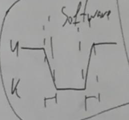

Недостатки:

-   большие накладные расходы по оперативной памяти,

-   ПО не может выполняться на нескольких аппаратных средствах (ядра не взаимодействует друг с другом).

***3. Микроядерная архитектура***

(4 и 5 слои вынесем в отдельные программы).
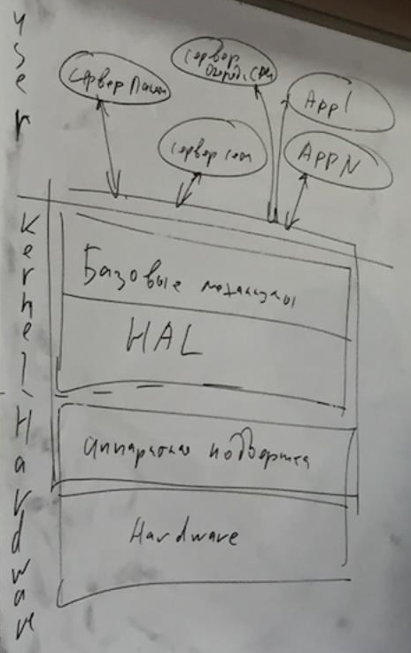

В ядре будет содержатся два слоя: машинно-зависимые модули и базовые
механизмы ядра.

В пользовательское режимы будут находиться сервера (памяти, вычислений),
ПО, и все они равноправно могут вызывать ядро.

Идея заключается в том, что есть вещи, которые обязательно нужно
выполнять в ядре (выделение памяти), а принятие решений будут
существовать отдельно как пользовательское ПО (в Microsoft это
называется службами).

Отсюда сервера не находятся в оперативной памяти, и появляются там
только по требованию. В такой ситуации накладные расходы 4дельтаТ.

Недостатки:
-   большие процессорные накладные расходы
-   резкое снижение надежности

Преимущество:
-   удобство работы с несколькими аппаратными системами
-   занимаем мало оперативной памяти

Микроядерная архитектура предоставляет только элементарные функции
управления процессами и минимальный набор абстракций для работы с
оборудованием. Большая часть работы осуществляется с помощью специальных
пользовательских процессов, называемых сервисами. В микроядерной
операционной системе можно, не прерывая ее работы, загружать и выгружать
новые драйверы, файловые системы и т. д.

***4. Наноядерная архитектура***

В ядро входят только машинно-зависимые модули, выполняет лишь обработку
аппаратных прерываний, генерируемых устройствами компьютера. Защищает
драйвера, не защищает уровень планировщика. Удобно, когда стабильный
набор приложений.

***5. Экзоядро (внешнее)***

Удобно для гетерогенных систем для различных объединённых устройств для
работы одного приложения. Защищает уровень планировщика, не защищает
железо. Удобно, когда стандартное, немодифицируемое железо. В режиме
ядра работают только менеджеры ресурсов.

***6. Гибридные ядра***

Можно менять \"ядерность\" от монолитной и далее. Абстрактность кода.

В случае гибридного ядра можно менять что в ядре, что не в ядре в
процессе работы. Самостоятельное решение, что в защищенном режиме, что в
пользовательском.

1. Монолитная архитектура ядра операционной системы. Подробное описание компонентов, их назначение и взаимодействие между собой. Достоинства и недостатки монолитной архитектуры ядра. 
======================================================================================================================================================================================

см билет 7

9. Многослойная архитектура ядра операционной системы. Подробное описание слоев, их назначение. Достоинства и недостатки многослойной архитектуры ядра.
=======================================================================================================================================================

см билет 7

10. Микроядерная архитектура операционной системы. Подробное описание компонентов, их назначение и взаимодействие между собой. Достоинства и недостатки микроядерной архитектуры ядра.
======================================================================================================================================================================================

см билет 7

1.  Понятия процесса, потока, нити (волокно), задания. Их назначения и различия между собой. 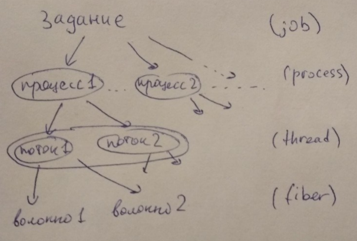
=====================================================================================================================================================================================

**Процесс**(process) - совокупность набора исполняемых команд,
ассоциированных с ними ресурсов и статуса исполнения, находящаяся под
управлением ОС.\
Процесс существует до тех пор, пока система может им управлять.\
Каждый процесс уникален для ОС.\
Существует возможность запустить один и тот же процесс несколько раз, но
у каждого из запущенных процессов будет свой (различный) статус.

Процессу выделяется адресное пространство, при этом ОС следит за тем,
чтобы процессы не трогали чужие адресные пространства (идея изоляции
процессов)\
**Поток**(thread) - подчасть процесса.

Разделение процесса на потоки происходит на уровне ОС.

Несколько потоков одного процесса имеют доступ к одним и тем же
ресурсам.\
Потоки не защищены друг от друга.\
Потоки имеют разное время исполнения, т.е. происходит изолирование
потоков.\
**Волокно**(fiber) - управляется приложением, самостоятельный набор
команд.

С точки зрения ОС волокон не существует, ОС не управляет волокнами.

Волокно находится в адресном пространстве своего процесса. Волокно в
основном используется, если не хочется полагаться на планировщик ОС\
**Задание**(job)\
Несколько процессов объединяются в задания для ограничения общих
ресурсов. Повышается безопасность.

**12. Функции подсистемы управления процессами.\
**Подсистема управления процессами состоит из планировщика (набор
алгоритмов подпрограмм для планирования) и механизма PCB (Process
Control Block).

**8 функций подсистемы управления процессами:\
**1. *Создание процесса*\
Создание процесса -- создание структуры данных в памяти (PCB). Любой
процесс порождается другим существующим процессом (идеология ОС). Первый
процесс порождается ядром ОС, остальные порождаются от этого процесса.\
\
2. *Обеспечение процессов и потоков ресурсами*

ОС необходимо обеспечивать процессы ресурсами не только при рождении, но
и при работе.

3. *Изоляция процессов*\
Невозможность обращения одного процесса к ресурсам другого процесса.\
\
4. *Планирование выполнения процессов*\
Когда и на сколько запустить процесс\
\
5. *Диспетчеризация процессов* -- смена одного процесса на другой. Здесь
нужна защита от сбоев.

· сохранение контекста выполнявшегося процесса.

· загрузка контекста нового процесса.

· изменение статусов этих процессов.\
\
6. *Организация межпроцессного взаимодействия* - буфер обмена.

добавить\
\
7. *Синхронизация процессов* (битва за общие ресурсы)

8. *Завершение и уничтожение процессов*\
Завершить процесс -- освободить все ресурсы, которые он занимал, и
уничтожить структуру данных процесса в памяти.

 

13. Методы создания процессов в различных операционных системах. Структуры данных о процессах.
==============================================================================================

*В Linux* используется иерархия процессов. Родитель всех процессов -
процесс init с PID =1.

Дочерний процесс не может получить больше ресурсов и прав, чем
родительский.

Дочерний процесс отдает код возврата по ppid.

Если процесс-родитель аварийно завершился, то его дочерние процессы
усыновляются процессом-родителем, вышестоящим по иерархии.\
Зомби-процесс - завершившийся процесс, у которого нет родительского
процесса. Процесс посылает сигнал родительскому, но родительский
завершается перед тем, как получить его. Такой процесс нельзя завершить.

В PCB: pid - process ID, ppid - parent process ID, uid - user ID.

*В Windows* нет иерархии процессов.

За создание процессов отвечает менеджер процессов.

Менеджер процессов управляет всеми процессами и несет за них
ответственность (освобождение памяти при аварийном завершении программы
и тд).

Нет требований к наследованию, как в Linux. Из-за этого могут возникать
проблемы с безопасностью.

В дескрипторе процесса хранится только pid.

~~Еще одно отличие Windows и Linux заключается в том, что в Linux
процессы размножаются клонированием, в Windows создается с чистого
листа.~~

~~Так же в PCB хранится статус процесса (status word). С точки зрения ОС
нельзя попытаться родить процессы с одинаковым статусом. Данные о
ресурсах, история (статистика) процесса - сколько процесс потреблял
процессорного времени, сколько ожидал процессорное время - данные для
планировщиков~~

?? можно добавить рисунки

14. Модель жизненного цикла процесса: состояния процесса, правила переходов между состояниями.
==============================================================================================

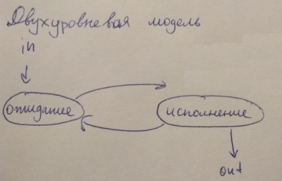

*Двухуровневая модель*: исполняется или ожидает.

-   Любому процессу при его рождении присваивается статус «ожидание».

-   Как только планировщик выбирает этот процесс для исполнения, процесс получает статус «исполняется».

-   После исполнения он может завершиться, либо снова получить статус «не исполняется» и ожидать время на исполнение.

В данной модели невозможно различить, по какой причине процесс получил
статус «ожидание». Данная модель сейчас нигде не
реализуется.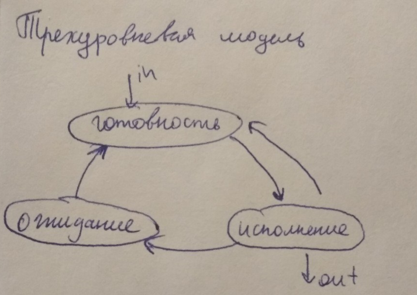


*Трехуровневая модель*: исполнение, готовность, ожидание.

Процесс при порождении может выполняться.

-   Из готовности планировщик переводит процесс в статус «исполняется».

-   После исполнения процесс либо завершается, либо отправляется в готовность (напр при прерывании по таймеру), либо в ожидание (если процесс себя прервал сам. Напр при ожидании какого-то сигнала). За состоянием ожидания следит определенный процесс ядра ОС.

-   После прерывания ожидания процесс переходит в статус готовности. И снова к исполнению.

Любая современная ОС поддерживает данную модель.\
\
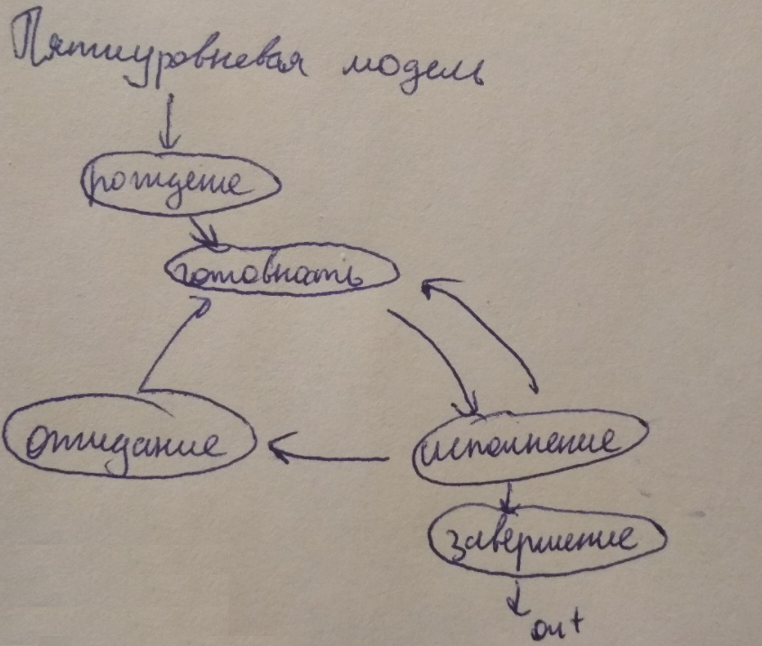

Пятиуровневая модель: исполняется, готовность, ожидание, рождение,
завершение.

-   Рождение -- растянутый этап, на котором ОС решает, стоит ли рождать этот процесс. На этом этапе у процесса нет PCB. Есть свой планировщик.

-   После рождения процесс переходит в статус «готовность».

-   Завершение -- растянутый этап завершения процесса: освобождения памяти, нахождение родителя. Процесс находится в завершении значительное время пока ОС в поисках.

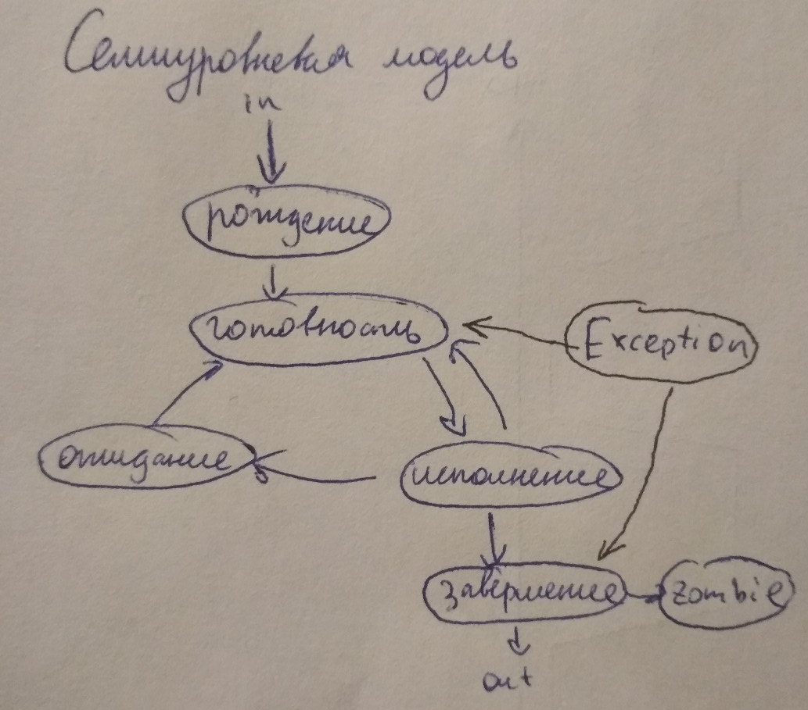

Семиуровневая модель: пятиуровневая модель + исключительная ситуация +
зомби-состояние (только для Linux).

-   Если в процессе исполнения возникает ошибка, процесс отправляется в исключительную ситуацию. После решения ошибки из исключительной ситуации процесс получает статус готовности. Иногда - просто ожидание по времени.

-   Выход из зомби процесса невозможен.

1.  Виды планирования и их место в жизненном цикле процесса.
============================================================

Основная цель планирования вычислительного процесса заключается в
распределении времени процессора (нескольких процессоров) между
выполняющимися заданиями пользователей таким образом, чтобы
удовлетворять требованиям, предъявляемым пользователями к вычислительной
системе. Такими требованиями могут быть, как это уже отмечалось,
пропускная способность, время отклика, загрузка процессора и др.

Все виды планирования, используемые в современных ОС, в зависимости от
временного масштаба, делятся на долгосрочное, среднесрочное,
краткосрочное и планирование ввода-вывода. Рассматривая частоту работы
планировщика, можно сказать, что долгосрочное планирование выполняется
сравнительно редко, среднесрочное несколько чаще. Краткосрочный
*планировщик*, обычно работает, определяя, какой процесс или *поток*
будет выполняться следующим.

1.  Долгосрочное --- между рождением и готовностью (запуск процесса влечёт за собой требование процессорного времени и памяти)

2.  Среднесрочное --- Решение о добавлении процесса к числу процессов, полностью или частично размещенных в основной памяти. Сбрасывание из оперативной памяти не скоро выполняющихся процессов. (Механизм SWAP - ассоциированные с процессом ресурсы помещаются в основную память компьютера)

3.  Краткосрочное --- между готовностью и исполнением. Решение о том, какой из доступных процессов (потоков) будет выполняться процессором следующим.

4.  Планирование доступа к внешним устройствам. Например, планирование устройств ввода-вывода, планировщик будет столько, сколько устройств ввода-вывода\ Решение о том, какой из запросов процессов (потоков) на операцию ввода-вывода будет выполняться свободным устройством ввода-вывода (хз что это значит)

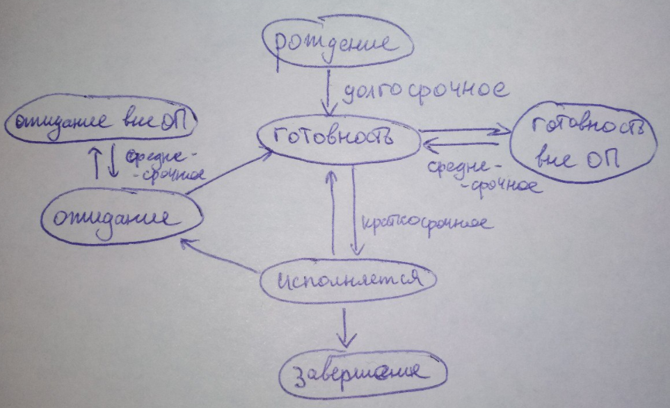

1.  Критерии эффективности и свойства методов планирования процессов, параметры планирования процессов.
=======================================================================================================

Для каждого уровня планирования процессов можно предложить много
различных алгоритмов. Выбор конкретного алгоритма определяется классом
задач, решаемых вычислительной системой, и целями, которых мы хотим
достичь, используя планирование.

Критерии:

1. Справедливость - равномерно раздавать ресурсы всем потребителям.
Утопическое понятие. Противоречие эффективности.\
Гарантировать каждому заданию или процессу определенную часть времени
использования процессора в компьютерной системе, стараясь не допустить
возникновения ситуации, когда процесс одного пользователя постоянно
занимает процессор, в то время как процесс другого пользователя
фактически не начинал выполняться.
2. Эффективность - постараться занять процессор на все 100% рабочего
времени, не позволяя ему простаивать в ожидании процессов, готовых к
исполнению.
3. Полное время выполнения - время от того как процесс впервые попал
в готовность до того: как он завершился
4. Время ожидания - сократить время, которое проводят процессы в
состоянии готовность о
5. Время отклика -- минимизироват время, которое требуется процессу в
интерактивных системах для ответа на запрос пользователя

Независимо от поставленных целей (критериев) планирования желательно
также, чтобы алгоритмы обладали следующими свойствами:

1. Предсказуемость - одна и та же задача должна выполняться за одинаковое время (случайные мутации хороши, но не всегда)
2. Минимальные накладные расходы (В ОС нет сложных алгоритмов) -
соотношения времени выборки процесса на исполнение и времени
исполнения должны быть существенны.\
Если на каждые 100 миллисекунд, выделенные процессу для использования
процессора, будет приходиться 200 миллисекунд на определение того,
какой именно процесс получит процессор в свое распоряжение, и на
переключение контекста, то такой алгоритм применять не стоит.
3. Масштабируемость - алгоритмы не должны терять работоспособность
при увеличении нагрузки.

Улучшая работу алгоритма с точки зрения одного критерия, мы ухудшаем ее
с точки зрения другого.

Параметры:

+----------------------+----------------------+----------------------+
|                      | Системы              | Процесса             |
+======================+======================+======================+
| Статические          | Размер памяти,       | Какой приоритет, кто |
| параметры            | частота процессора   | запустил. Какие      |
|                      |                      | выделены ресурсы,    |
|                      |                      | адресное             |
|                      |                      | пространство.        |
+----------------------+----------------------+----------------------+
| Динамические         | Сколько сейчас       | CPU-burst            |
| параметры            | свободно ---         | (предсказание)       |
|                      | постоянно меняется   |                      |
|                      |                      | I/O - burst          |
+----------------------+----------------------+----------------------+

Существует два основных вида планирования:

1. Вытесняющие - процесс может быть вытеснен более актуальным
процессом
2. Не вытесняющие - если дать процессу ресурсу, то он его имеет, пока
не освободит сам

 

17. Методы планирования без внешнего управления приоритетами (FCFS, RR, SJF), гарантированное планирование. Описание каждого метода, их достоинства и недостатки.
=================================================================================================================================================================

***First-Come, First-Served (FCFS)***

Простейший алгоритм планирования, "первым пришел - первым обслужен".\
Процессы, находящиеся в состоянии "готовность", выстроены в очередь.\
Когда процесс переходит в готовность, он (ссылка на его PCB) помещается
в конец очереди.\
Новый процесс для исполнения выбирается из начала очереди с удалением
оттуда его ссылки. Очередь подобного типа называется FIFO, "first in,
first out"\
Такой алгоритм выбора процесса осуществляет **невытесняющее
планирование**.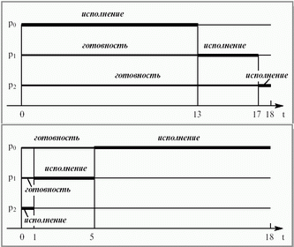

Процесс, получивший в свое распоряжение процессор, занимает его до
истечения текущего CPU burst.\
Преимущество FCFS - простота реализации.\
Недостаток - [среднее время ожидания]{.underline} и\
[среднее полное время выполнения]{.underline} для этого алгоритма
существенно зависят от порядка расположения процессов в очереди. Если у
нас есть процесс с длительным CPU burst , то короткие процессы,
перешедшие в состояние готовность после длительного процесса, будут
очень долго ждать начала выполнения.\
\
Поэтому алгоритм FCFS практически неприменим для систем разделения
времени -- слишком большим получается среднее время отклика в
интерактивных процессах.\
\
***Round Robin***

Round Robin - модификация алгоритма FCFS.\
По сути, это тот же самый алгоритм, только реализованный в режиме
**вытесняющего планирования**.
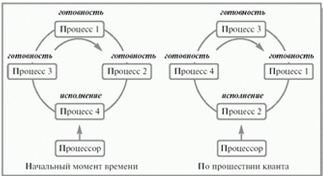

Можно представить себе все множество готовых процессов организованным
циклически -- процессы сидят на карусели. Карусель вращается так, что
каждый процесс находится около процессора небольшой фиксированный квант
времени (10-100 миллисекунд).\
Пока процесс находится рядом с процессором, он получает процессор в свое
распоряжение и может исполняться.

Реализуется такой алгоритм так же, как и предыдущий, с помощью
организации процессов, находящихся в состоянии готовность, в очередь
FIFO.\
Планировщик выбирает для очередного исполнения процесс, расположенный в
начале очереди, и устанавливает таймер для генерации прерывания по
истечении определенного *кванта времени*.\
При выполнении процесса возможны два варианта:

-   Время непрерывного использования процессора, необходимое процессу (остаток текущего *CPU burst* ), меньше или равно продолжительности *кванта времени*. Тогда процесс по своей воле освобождает процессор до истечения *кванта времени*, на исполнение поступает новый процесс из начала очереди, и таймер начинает отсчет *кванта* заново.

-   Продолжительность остатка текущего *CPU burst* процесса больше, чем *квант времени*. Тогда по истечении этого *кванта* процесс прерывается таймером и помещается в конец очереди процессов, готовых к исполнению, а процессор выделяется для использования процессу, находящемуся в ее начале.

Рассмотрим пример:\
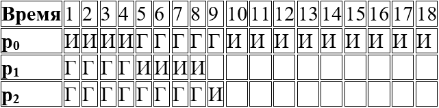

Первым для исполнения выбирается процесс p~0~. Продолжительность его CPU
burst больше, чем величина кванта времени, и поэтому процесс исполняется
до истечения кванта, т. е. в течение 4 единиц времени. После этого он
помещается в конец очереди готовых к исполнению процессов, которая
принимает вид p~1~, p~2~, p~0~. Следующим начинает выполняться процесс
p~1~. Время его исполнения совпадает с величиной выделенного кванта,
поэтому процесс работает до своего завершения. Теперь очередь процессов
в состоянии готовность состоит из двух процессов, p~2~ и p~0~. Процессор
выделяется процессу p~2~. Он завершается до истечения отпущенного ему
процессорного времени, и очередные кванты отмеряются процессу p~0~ --
единственному не закончившему к этому моменту свою работу.

На производительность алгоритма RR сильно влияет величина кванта
времени.

При очень больших величинах кванта времени, когда каждый процесс
успевает завершить свой CPU burst до возникновения прерывания по
времени, алгоритм RR вырождается в алгоритм FCFS.\
При очень малых величинах создается иллюзия того, что каждый из n
процессов работает на собственном виртуальном процессоре с
производительностью \~ 1/n от производительности реального процессора.
Правда, это справедливо лишь при теоретическом анализе при условии
пренебрежения временами переключения контекста процессов.\
\
***Shortest Job First***

Если выполнять кратчайшую задачу первой, это может ускорить работу. Так
появился алгоритм **SJF**.\
\
SJF-алгоритм краткосрочного планирования может быть как **вытесняющим**,
так и **невытесняющим**:

При *невытесняющем SJF*-планировании процессор предоставляется
избранному процессу на все необходимое ему время.

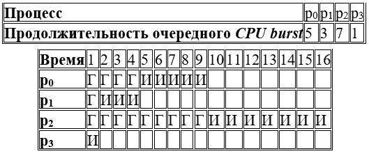

При *вытесняющем SJF* планировании учитывается появление новых процессов
в очереди, готовых к исполнению (из числа вновь родившихся или
разблокированных) во время работы выбранного процесса. Если CPU burst
нового процесса меньше, чем остаток CPU burst у исполняющегося, то
исполняющийся процесс вытесняется новым. Также можно задать квант
больший, чем 1.\
Большие задачи очень долго ждут своей
очереди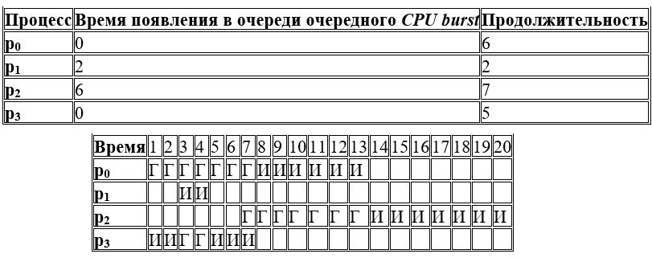

Гарантированное планирование\
***При интерактивной работе N пользователей в вычислительной системе
можно применить алгоритм планирования, который гарантирует, что каждый
из пользователей будет иметь в своем распоряжении \~1/N часть
процессорного времени.

Пронумеруем всех пользователей от 1 до N.

Для каждого пользователя с номером i введем две величины:

T~i~ - время нахождения пользователя в системе, время сеанса
пользователя

t ~i~ - суммарное процессорное время уже выделенное всем его процессам в
течение сеанса.\
Справедливым для пользователя было бы получение T~i~/N процессорного
времени.

Если происходит ситуация, когда\


значит процесс был обделен процессорным временем.\
Если происходит обратная ситуация, то есть\
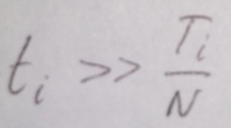\
значит процессу выделялось слишком много процессорного времени.\
\
Для каждого процесса вычислим "коэффициент справедливости", равный\
\
и будем предоставлять очередной *квант времени* готовому процессу с
наименьшим коэффициентом.\
\
К сожалению, не всегда можно предугадать поведение пользователей.\
Если пользователь включит компьютер утром, но не будет им пользоваться
какое-то время, то при возвращении к работе его процессы будут получать
приоритет над процессами остальных пользователей.

1.  Приоритетное планирование с внешним управлением приоритетами, многоуровневые очереди. Описание методов, их достоинства и недостатки.
========================================================================================================================================

***Приоритетное планирование***

При **приоритетном планировании** каждому процессу присваивается
определенное числовое значение - приоритет, в соответствии с которым ему
выделяется процессор.

Процессы с одинаковыми приоритетами планируются в порядке FCFS.

Алгоритмы [SJF]{.underline} и [гарантированного
планирования]{.underline} представляют собой частные случаи
приоритетного планирования:

В *SJF* в качестве такого приоритета выступает оценка продолжительности
следующего CPU burst. Чем меньше значение этой оценки, тем более высокий
приоритет имеет процесс.

Для *гарантированного планирования* приоритетом служит вычисленный
коэффициент справедливости. Чем он меньше, тем больше приоритет у
процесса.

Принципы назначения приоритетов могут опираться как на внутренние
критерии вычислительной системы, так и на внешние по отношению к ней.\
Внутренние используют различные количественные и качественные
характеристики процесса для вычисления его приоритета, например:

-   определенные ограничения по времени использования процессора

-   требования к размеру памяти

-   число открытых файлов и используемых устройств ввода-вывода

-   отношение средних продолжительностей I/O burst к CPU burst

Внешние критерии исходят из таких параметров, как:

-   важность процесса для достижения каких-либо целей

-   стоимость оплаченного процессорного времени

и других факторов.

Планирование с использованием приоритетов может быть как вытесняющим,
так и невытесняющим. При вытесняющем планировании процесс с более
высоким приоритетом, появившийся в очереди готовых процессов, вытесняет
исполняющийся процесс с более низким приоритетом. В случае
невытесняющего планирования он просто становится в начало очереди
готовых процессов.\
\
Разберем невытесняющее и вытесняющее приоритетное планирование на
примерах.\
Возьмем меньшее значение приоритета предпочтительным.

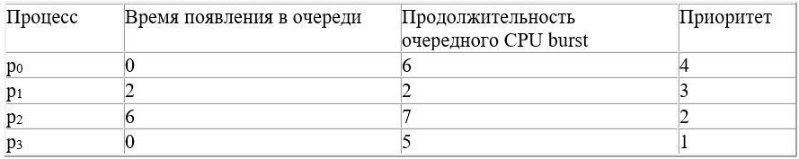

Для невытесняющего алгоритма:

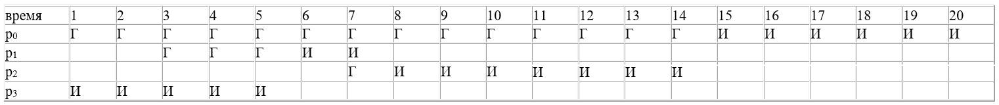\
Для вытесняющего алгоритма:\
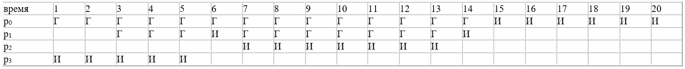\
В рассмотренном выше примере приоритеты процессов не изменялись с
течением временем (статические приоритеты). Статические приоритеты не
реагируют на изменения ситуации в вычислительной системе.

Более гибкими являются динамические приоритеты процессов, изменяющие
свои значения по ходу исполнения процессов.

Изменение приоритета процессов может проводиться согласованно с
совершением других операций:

-   при рождении нового процесса

-   по истечении определенного кванта времени

-   по завершении процесса

Схемы с динамической приоритетностью гораздо сложнее в реализации и
связаны с большими издержками по сравнению со статическими схемами.
Однако их использование предполагает, что эти издержки оправдываются
улучшением поведения системы.\
Главная проблема заключается в том, что при ненадлежащем выборе
приоритетов низкоприоритетные процессы могут быть не запущены
неопределенно долгое время.\
Решение этой проблемы может быть достигнуто с помощью увеличения со
временем значения приоритета процесса, находящегося в состоянии
готовность:

Пусть изначально процессам присваиваются приоритеты от 128 до 255.
Каждый раз, по истечении определенного промежутка времени, значения
приоритетов готовых процессов уменьшаются на 1.

При остановке IBM 7094 в Массачусетском технологическом институте в 1973
году были найдены процессы, запущенные в 1967 году и ни разу с тех пор
не исполнявшиеся.

***Многоуровневые очереди (Multilevel Queue)***

Используются в системах, где процессы могут быть рассортированы на
разные группы.\
Для каждой группы - своя очередь процессов, находящихся в состоянии
"готовность".

У этих очередей - фиксированные приоритеты.\
Например, у системных процессов приоритет выше, чем у пользовательских.
Ни один пользовательский процесс не будет выбран, пока есть хоть один
системный.

Внутри этих очередей могут применяться разные алгоритмы планирования.

Например, для счетных процессов, не требующих взаимодействия с юзером,
может использоваться FCFS.\
А для интерактивных - RR.\
Подход многоуровневых очередей обеспечивает гибкость планирования.\
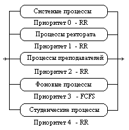

***Многоуровневые очереди с обратной связью (Multilevel Feedback
Queue)***

Дальнейшее развитие - добавление механизма обратной связи.\
Процесс не привязан к одной очереди, а может мигрировать в зависимости
от своего поведения.\
Рассмотрим пример из предыдущего пункта. Планирование - на основе
вытесняющего приоритетного механизма.\
\
Родившийся процесс поступает в очередь 0. При выборе на исполнение он
получает в свое распоряжение квант времени размером 8 единиц. Если
продолжительность его CPU burst меньше этого кванта времени, процесс
остается в очереди 0. В противном случае, он переходит в очередь 1. Для
процессов из очереди 1 квант времени имеет величину 16. Если процесс не
укладывается в это время, он переходит в очередь 2. Если укладывается
--- остается в очереди 1. В очереди 2 величина кванта времени составляет
32 единицы. Если и этого мало для непрерывной работы процесса, процесс
поступает в очередь 3, для которой квантование времени не применяется,
и, при отсутствии готовых процессов в других очередях, он может
исполняться до окончания своего CPU burst. Чем больше значение
продолжительности CPU burst, тем в менее приоритетную очередь попадает
процесс, но тем на большее процессорное время он может рассчитывать для
своего выполнения. Таким образом, через некоторое время все процессы,
требующие малого времени работы процессора окажутся размещенными в
высокоприоритетных очередях, а все процессы, требующие большого счета и
с низкими запросами к времени отклика, --- в низкоприоритетных.

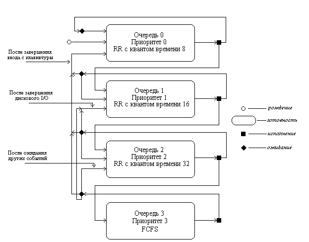\
Миграция процессов в обратном направлении может осуществляться по
различным принципам. Например, после завершения ожидания ввода с
клавиатуры процессы из очередей 1, 2 и 3 могут помещаться в очередь 0,
после завершения дисковых операций ввода-вывода процессы из очередей 2 и
3 могут помещаться в очередь 1, а после завершения ожидания всех других
событий из очереди 3 в очередь 2. Перемещение процессов из очередей с
низкими приоритетами в очереди с большими приоритетами позволяет более
полно учитывать изменение поведения процессов с течением времени.

Для полного описания их конкретного воплощения такой очереди необходимо
указать:

-   Количество очередей для процессов, находящихся в состоянии
    > готовность.

-   Алгоритм планирования, действующий между очередями.

-   Алгоритмы планирования, действующие внутри очередей.

-   Правила помещения родившегося процесса в одну из очередей.

-   Правила перевода процессов из одной очереди в другую.

1.  Организация планирования процессов в ОС семейств Microsoft Windows и GNU/Linux.
===================================================================================

***Windows***

В ОС семейства Windows разделение очереди многоуровневой на системную и
пользовательскую. Пользовательские процессы никогда не будут
приоритетнее системных.

На изображении представлено разделение приоритетов:

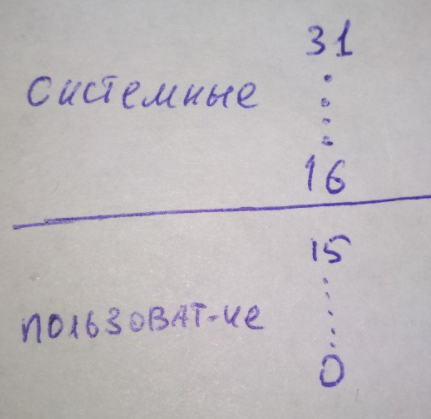

По истечении кванта Windows пытается передать управление потоку с тем же
приоритетом. Если такого нет, очередной квант отводится тому же потоку,
что и выполнялся. Если и это не нужно, то идет спуск на приоритет ниже.

(см. многоуровневые очереди / многоуровневые очереди с обратной связью,
см. билет 18)\
Базовый приоритет процесса устанавливается при его создании. В
пользовательских можно изменять приоритет.

Если базовый приоритет процесса не указан, то он наследуются от
родительского процесса. Базовый приоритет потока устанавливается в
соответствии с унаследованным приоритетом процесса и собственным
относительным приоритетом. Кроме базового приоритета, каждый поток имеет
текущий приоритет, на основании которого принимаются все решения
относительно планирования потока.

***Linux***

-   FIFO --- Никто не сможет прервать. Атомарность. Например, нужно для планировщика.

-   RR --- высоко приоритетные

-   Other --- все остальные. 140 очередей. 140 делятся на 100 и 40. 40 для юзера: От -19 до +20. 100 для системы. Мы управляем лишь кусочком.

1.  Проблемы взаимодействующих процессов. Проблема обедающих философов, проблема писателей и читателей.
=======================================================================================================

Проблемы использования различных методов синхронизации процессов.

***Парадокс обедающих философов:***

Есть круглый стол, 5 философов, 5 тарелок спагетти. Философ либо ест,
либо думает.

Есть нужно двумя вилками. Вилка общая попарная с
кем-то.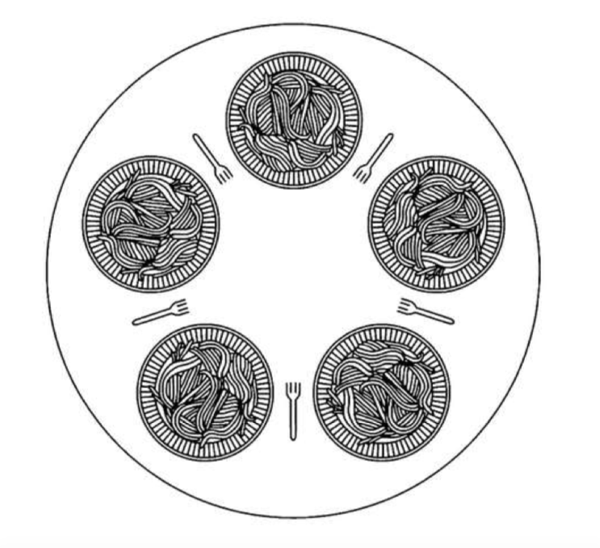
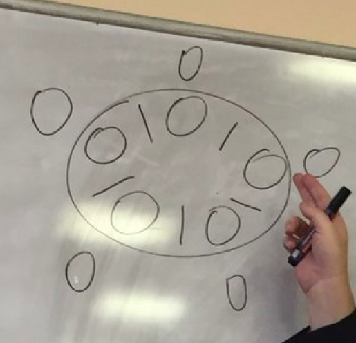

Можно ли написать алгоритм, который моделирует эти действия для каждого
философа и никогда не застревает?

Например у всех алгоритм "возьми левую, потом правую". Все взяли левую,
никто не ест.

Все заблокировали друг друга.

Можно изменить программу так, чтобы после получения левой вилки
программа проверяла доступность правой вилки. Если эта вилка недоступна,
философ кладет на место левую вилку, ожидает какое-то время, а затем
повторяет весь процесс. Это предложение также ошибочно, но уже по другой
причине. При некоторой доле невезения все философы могут приступить к
выполнению алгоритма одновременно, взяв левые вилки и увидев, что правые
вилки недоступны, опять одновременно положить на место левые вилки, и
так до бесконечности. Подобная ситуация, при которой все программы
бесконечно работают, но не могут добиться никакого прогресса, называется
**голоданием**, или зависанием процесса.

Можно подумать, что стоит только заменить одинаковое для всех философов
время ожидания после неудачной попытки взять правую вилку на случайное,
шансы, что все они будут топтаться на месте хотя бы в течение часа,
будут очень малы. Это правильное рассуждение, и практически для всех
приложений повторная попытка через некоторое время не вызывает проблемы.

//можно дописать про улучшение с семафорами и макросами. см док \[4\]

***Проблема читателей и писателей*** \[док 4\]

В ней моделируется доступ к базе данных. Представим, к примеру, систему
бронирования авиабилетов, в которой есть множество соревнующихся
процессов, желающих обратиться к ней по чтению и записи. Вполне
допустимо наличие нескольких процессов, одновременно считывающих
информацию из базы данных, но если один процесс обновляет базу данных
(проводит операцию записи), никакой другой процесс не может получить
доступ к базе данных даже для чтения информации. Вопрос в том, как
создать программу для читателей и писателей?

*В одном из решении, первый читатель для получения доступа к базе данных
выполняет в отношении семафора db операцию down. А все следующие
читатели просто увеличивают значение счётчика rc. Как только читатели
прекращают свою работу, они уменьшают значение счётчика, а последний из
них выполняет в отношении семафора операцию up, позволяя
заблокированному писателю, если таковой имеется, приступить к работе.*

В представленном здесь решении есть одна достойная упоминания
недостаточно очевидная особенность. Допустим, что какой-то читатель уже
использует базу данных, и тут появляется еще один читатель. Поскольку
одновременная работа двух читателей разрешена, второй читатель
допускается к базе данных. По мере появления к ней могут быть допущены и
другие дополнительные читатели.

Теперь допустим, что появился писатель. Он может не получить доступ к
базе данных, поскольку писатели должны иметь к базе данных
исключительный доступ, поэтому писатель приостанавливает свою работу.
Позже появляются и другие читатели. Доступ дополнительным читателям
будет открыт до тех пор, пока будет активен хотя бы один читатель.
Вследствие этой стратегии, пока продолжается наплыв читателей, они все
будут получать доступ к базе по мере своего прибытия. Писатель будет
приостановлен до тех пор, пока не останется ни одного читателя. Если
новый читатель будет прибывать, скажем, каждые 2 с, и каждый читатель
затрачивает на свою работу по 5 с, писатель доступа никогда не дождётся.

Чтобы предотвратить такую ситуацию, программу можно слегка изменить:
когда писатель находится в состоянии ожидания, то вновь прибывающий
читатель не получает немедленного доступа, а приостанавливает свою
работу и встает в очередь за писателем. При этом писатель должен
переждать окончания работы тех читателей, которые были активны при его
прибытии, и не должен пережидать тех читателей, которые прибывают уже
после него. Недостаток этого решения заключается в снижении
производительности за счет меньших показателей параллельности в работе.

Дополнение (из 21):

Задачи при взаимодействии процессов:

-   *Обеспечить взаимоисключаемость при использовании неразделяемого ресурса. "Критическая секция"*
-   *Обеспечить прогресс (не было ситуации, когда ресурс свободен, но процессы не могут его юзать)*
-   *Избежать тупика - кольцевого взаимодействия процессов*
-   *Не допускать "голодания" процессов*

1.  Алгоритмы реализации взаимоисключений. Формальное описание алгоритмов, их недостатки.
=========================================================================================

\[из документа \[2\]\]

Пять условий, которые должны выполняться для хорошего программного
алгоритма организации взаимодействия процессов, имеющих критические
участки, если они могут проходить их в произвольном порядке:

1. Задача должна быть решена чисто программным способом на обычной
машине, не имеющей специальных команд взаимоисключения. При этом
предполагается, что основные инструкции языка программирования (такие
примитивные инструкции как load, store, test) являются атомарными
операциями.

2. Не должно существовать никаких предположений об относительных
скоростях выполняющихся процессов или числе процессоров, на которых они
исполняются.

3. Если процесс Pi исполняется в своем критическом участке, то не
существует никаких других процессов, которые исполняются в своих
соответствующих критических секциях. Это условие получило название
**условия взаиамоисключения** (mutual exclusion).

4. Процессы, которые находятся вне своих критических участков и не
собираются входить в них, не могут препятствовать другим процессам
входить в их собственные критические участки. Если нет процессов в
критических секциях, и имеются процессы, желающие войти в них, то только
те процессы, которые не исполняются в remainder section, должны
принимать решение о том, какой процесс войдет в свою критическую секцию.
Такое решение не должно приниматься бесконечно долго. Это условие
получило название **условия прогресса** (progress).

5. Не должно возникать бесконечного ожидания для входа процесса в свой
критический участок. От того момента, когда процесс запросил разрешение
на вход в критическую секцию, и до того момента, когда он это разрешение
получил, другие процессы могут пройти через свои критические участки
лишь ограниченное число раз.

Это условие получило название **условия ограниченного ожидания** (bound
waiting).

***Алгоритм блокирующей глобальной переменной или алгоритм замка***

Возьмем некоторую переменную, доступную всем процессам, и положим ее
начальное значение равным 0. Процесс может войти в критическую секцию
только тогда, когда значение этой переменной-замка равно 0, одновременно
изменяя ее значение на 1 --- закрывая замок.

При выходе из критической секции процесс сбрасывает ее значение в 0 ---
замок открывается.

```
**shared int lock = 0;**

**p0() {**

**while( lock );**
**lock = 1;**
**{critical section}**
**lock = 0;**

**}**
```
Такое решение не удовлетворяет **условию взаимоисключения**

Действие while(lock); lock = 1; не является атомарным.

Допустим, что процесс P0 протестировал значение переменной lock и принял
решение двигаться дальше. В этот момент, еще до присваивания переменной
lock значения 1, планировщик передал управление процессу P1. Он тоже
изучает содержимое переменной lock и тоже принимает решение войти в
критический участок. **Мы получаем два процесса одновременно выполняющих
свои критические секции.**

***Алгоритм строгого чередования***

Подход будет также использовать общую для них обоих переменную с
начальным значением 0. Только теперь она будет играть не роль замка для
критического участка, а явно указывать, кто может следующим войти в
него. Для i-го процесса это выглядит так:

```
**shared int turn = 0;**

**pi() {**

**while( turn != i );**
**{critical section}**
**turn=1-i;**

**}**
```

Взаимоисключение гарантируется, процессы входят в критическую секцию
строго по очереди: P0, P1, P0, P1, P0, ... Но наш алгоритм **не
удовлетворяет условию прогресса**. Например, если значение turn равно 1
и процесс P0 готов войти в критический участок, он не может сделать
этого, даже если процесс P1 находится в remainder (не critical) section.

***Алгоритм флагов готовности***

Недостаток предыдущего алгоритма заключается в том, что процессы ничего
не знают о состоянии друг друга в текущий момент времени. Исправим эту
ситуацию. Пусть два наши процесса имеют разделяемый массив флагов
готовности входа процессов в критический участок

> **shared int ready\[2\] = {0,0};**

Когда i-й процесс готов войти в критическую секцию, он присваивает
элементу массива ready\[i\] значение равное 1. После выхода из
критической секции он, естественно, сбрасывает это значение в 0. Процесс
не входит в критическую секцию, если другой процесс уже готов ко входу в
критическую секцию или находится в ней.
```
**Pi(){**

> **ready\[i\]=1;**
>
> **while( ready\[1-i\] );**
>
> **{critical section}**
>
> **ready\[i\] = 0;**

**}**
```

Полученный алгоритм обеспечивает взаимоисключение, позволяет процессу,
готовому к входу в критический участок, войти в него сразу после
завершения эпилога в другом процессе, но все равно **нарушает условие
прогресса.** Пусть процессы практически одновременно подошли к
выполнению пролога. После выполнения присваивания ready\[0\] = 1
планировщик передал процессор от процесса 0 процессу 1, который также
выполнил присваивание ready\[1\] = 1. После этого оба процесса
бесконечно долго ждут друг друга на входе в критическую секцию.
Возникает ситуация, которую принято называть **тупиковой (deadlock)**.

***Алгоритм Петерсона (алгоритм взаимной вежливости)***

Пусть оба процесса имеют доступ к массиву флагов готовности и к
переменной очередности.
```
**shared int ready\[2\] = {0,0};**

**shared int turn = 0;**

**Pi() {**

> **ready\[i\] = 1;**
>
> **turn = 1-i;**
>
> **while ( ready\[1-i\] && turn=1-i )**
>
> **{critical section}**
>
> **ready\[i\] = 0;**

**}**
```
При исполнении пролога критической секции процесс Pi заявляет о своей
готовности выполнить критический участок и одновременно предлагает
другому процессу приступить к его выполнению. Если оба процесса подошли
к прологу практически одновременно, то они оба объявят о своей
готовности и предложат выполняться друг другу. При этом одно из
предложений всегда последует после другого. Тем самым работу в
критическом участке продолжит процесс, которому было сделано последнее
предложение.

ДОКАЗАТЕЛЬСТВО УДОВЛЕТВОРЕНИЯ ПЯТИ ТРЕБОВАНИЙ К АЛГОРИТМУ:

Удовлетворение требований 1 и 2 очевидно.

Докажем выполнение условия взаимоисключения методом от противного. Пусть
оба процесса одновременно оказались внутри своих критических секций.
Заметим, что процесс Pi может войти в критическую секцию, только если
ready\[1-i\] == 0 или turn == i. Заметим также, что если оба процесса
одновременно выполняют свои критические секции, то значения флагов
готовности для обоих процессов совпадают и равны 1. Могли ли оба
процесса войти в критические секции из состояния, когда они оба
одновременно находились в процессе выполнения цикла while? Нет, так как
в этом случае переменная turn должна была бы одновременно иметь значения
0 и 1 (когда оба процесса выполняют цикл, то значения переменных
измениться не могут). Пусть процесс P0 первым вошел в критический
участок, тогда процесс P1 должен был выполнить перед вхождением в цикл
while, по крайней мере, один предваряющий оператор (turn = 0;). Однако
после этого он не может выйти из цикла до окончания критического участка
процесса P0, так как при входе в цикл ready\[0\] == 1 и turn == 0, и эти
значения не могут измениться до тех пор, пока процесс P0не покинет свой
критический участок. Мы получили противоречие. Следовательно, имеет
место взаимоисключение.

Докажем выполнение условия прогресса. Возьмем, без ограничения общности,
процесс P0. Заметим, что он не может войти в свою критическую секцию
только при совместном выполнении условий ready\[1\] == 1 и turn == 1.
Если процесс P1 не готов к выполнению критического участка, то
ready\[1\] == 0 и процесс P0 может осуществить вход. Если процесс P1
готов к выполнению критического участка, то ready\[1\] == 1 и переменная
turn имеет значение либо 0, либо 1, позволяя либо процессу P0, либо
процессу P1 начать выполнение критической секции. Если процесс P1
завершил выполнение критического участка, то он сбросит свой флаг
готовности ready\[1\] == 0 , разрешая процессу P0 приступить к
выполнению критической работы. Таким образом, условие прогресса
выполняется.

Отсюда же вытекает выполнение условия ограниченного ожидания. Так как в
процессе ожидания разрешения на вход процесс P0 не изменяет значения
переменных, то он сможет начать исполнение своего критического участка
после не более чем одного прохода по критической секции процесса P1.

***Аппаратная поддержка взаимоисключений***

На аппаратном уровне реализована атомарность операции проверки общей
переменной и установки её в блокирующее значение

**shared int lock = 0;**

**while( Test\_and\_Set(&lock) );**

**{critical section}**

**lock = 0;**

22. Семафоры Дейкстра. Решение проблемы «производитель-потребитель» с помощью семафоров.
========================================================================================

Предложил Дейкстра в 1965 году. Это один из первых механизмов для
синхронизации поведения процессов.

Семафор --- общедоступная неотрицательная переменная. Над ней разрешены
только две атомарных операций.
```
**P(s)** \[от датского proberen проверять\] **while s==0;**

**s=s-1;**

**V(S)** \[от датского Verhogen увеличивать\]

**s=s+1**

**semaphore empty = N;**

**semaphore full = 0;**

**semaphore mutex = 1;**

**producer() {**

**while(true){**

> **produce\_data;**
>
> **P(empty);**
>
> **P(mutex);**
>
> **put\_data;**
>
> **V(mutex);**
>
> **V(Full);**
>
> **}**

**}**

**Consumer() {**

**while(true) {**

> **P(full);**
>
> **P(mutex);**
>
> **get\_data;**
>
> **V(mutex);**
>
> **V(empty);**
>
> **consumer\_data;**
>
> **}**

**}**
```
В итоге имеем:

-   Потребитель и производитель не зайдут в секцию одновременно

-   Потребитель не будет читать данные, если их нет

-   Производитель не будет помещать данные, если хранилище переполнено

23. Тупики. Условия возникновения и методы борьбы с тупиками.
=============================================================

Концепция ресурсов

За ресурсы отвечает планировщик (менеджер) ресурсов. Ресурсами могут
быть как устройства, так и данные. Ресурсы могут быть разделяемые или
неразделяемые. Разделяемые допускают одновременный доступ, неразделяемые
(выделенные) допускают доступ только в порядке очереди.

Условия возникновения тупиков были сформулированы Коффманом, Элфиком и
Шошани в 1970:

-   *Условие взаимоисключения (Mutual exclusion*). Одновременно использовать ресурс может только один процесс.

-   *Условие ожидания ресурсов (Hold and wait)*. Процессы удерживают ресурсы, уже выделенные им, и могут запрашивать другие ресурсы.

-   *Условие неперераспределяемости (No premetion)*. Ресурс, выделенный ранее, не может быть принудительно забран у процесса. Освобождены они могут быть только процессом, который их удерживает.

-   *Условие кругового ожидания (Circular wait*). Существует кольцевая цепь процессов, в которой каждый процесс ждет доступа к ресурсу, удерживаемому другим процессом цепи.

Решения:

1. Игнорировать (используется в Windows)

2. Предотвращать

3. Обнаруживать и восстанавливать

Обнаружение взаимоблокировки сводится к фиксации тупиковой ситуации
выявлению вовлеченных в нее процессов. Для этого производится проверка
наличия циклического ожидания в случаях, когда выполнены первые три
условия возникновения тупика. Методы обнаружения активно используют
графы распределения ресурсов.

MacOS удаляет процесс, который считает ненужным

Можно круговое ожидание исправить: дать разрешение брать ресурсы только
с бОльшими номерами. т.е. если взял 5, то дальше можно только 6, 9.. при
этом периодически проходит перенумерация.

Пробовать анализировать нереально.

24. Принципы управления памятью вычислительной системы. Виртуальная память и преобразование адресов.
====================================================================================================

Виды памяти различаются: чем меньше объем, тем выше скорость и тем
больше стоимость 1 единицы памяти.

Иерархия памяти:

Регистры cpu: время доступа \~0.1 нс переносимые объёмы данных \~1 байт

Кэш Level 1: \~0.5 нс \~10 Кбайт

Кэш Level 2: \~1 нс \~1 Мбайт

Ram: \~50 нс \~1 Гбайт

...

HDD \~10 мс \~1 Тбайт

Управление памятью
-   Первоначальное и динамическое выделение памяти процессу
-   Настройка адресов на конкретную область физической памяти. (Ассоциация с физ адресами)
-   Отслеживание/учёт свободной и занятой памяти.
-   Полное или частичное вытеснение в более медленную память и подъем обратно. (подкачка)
-   Защита памяти Память процесса защищена от других процессов
-   Дефрагментация памяти. Стратегия размещения данных в памяти или дефрагментация существующих данных

Виртуализация памяти возможна на основе двух возможных подходов:
-   ***свопинг (swapping)*** -- образы процессов выгружаются на диск и возвращаются в оперативную память целиком;
-   *виртуальная память (virtual memory)* -- между оперативной памятью и диском перемещаются части образов (сегменты, страницы, блоки и т.п.) процессов.

Недоста
-   избыточность перемещаемых данных и отсюда замедление работы системы и неэффективное использование памяти;
-   невозможность загрузить процесс, виртуальное пространство которого превышает имеющуюся в наличии свободную память.

Достоинство свопинга
-   меньшие затраты времени на преобразование адресов в кодах программ, поскольку оно делается один раз при загрузке с диска в память

В unix --подобных системах имеем раздел подкачки, в win -- файл
подкачки.

Стратегии управления виртуальной памятью:

-   *Стратегия вталкивания*, определяющая, когда следует переписать страницу или сегмент из внешней памяти в ОП.

a)  *вталкивание по запросу* - система ожидает ссылки на страницу/сегмент от выполняющегося процесса (прерывание по отсутствию страницы);

b)  *упреждающее вталкивание* предполагает, что система может предвидеть необходимость использования в дальнейшем страницы/сегмента. Если вероятность обращений высока и есть свободная ОП, то соответствующие блоки переписываются в ОП.

-   *Стратегия размещения,* определяющая, куда поместить поступающую страницу/сегмент. В страничных системах - тривиально: в любой свободный блок. В сегментных системах те же самые стратегии, что и для реальной ОП (в первую подходящую область, в наиболее подходящую, в наименее подходящую).

-   *Стратегия выталкивания (замещения),* определяющая, какую страницу/сегмент удалить из ОП для освобождения места поступающей страницы.

a)  *выталкивание случайной страницы* - в реальных системах не применяется;
b)  *выталкивание первой пришедшей страницы* (*FIFO* - очередь). Для ее реализации необходимо устанавливать временные метки страниц.
c)  *выталкивание дольше всего неиспользованных страниц.* Для реализации необходимо реализовать обновляемые временные метки.
d)  *выталкивание реже всего используемых страниц* - предполагает наличие счетчиков страниц
e)  *выталкивание не использующихся в последнее время страниц* - самый распространенный алгоритм с малыми издержками. Реализуется двумя аппаратными битами на страницу: 1 - признак обращения, 2 - признак модификации записи

Преобразование адресов:

1.  Символьные имена. Исходный код. С языков высокого уровня\ ↓ Работает транслятор
2.  Виртуальные адреса. Байт-код\ ↓Перемещающий загрузчик/динамическое преобразование (преобразование адресов виртуальной памяти при попытке обращения к ним).
3.  Физические адреса. Исполняемый код.

## 25. Методы распределения оперативной памяти без использования внешней памяти.
=============================================================================

 Используется для разграничения памяти процессов, не используя
 виртуальную память.

 Без использования внешней памяти:

-   Фиксированными разделами - изначально память делится на блоки.
    -   Одинакового размера.
    -   Разного размера. Заняты все подходящие блоки

-   Произвольные разделы - память делится на блоки по запросу процесса
    -   Неперемещаемые. Фрагментированность данных
    -   Перемещаемые. При освобождении памяти процессом адреса всех процессов "после него" пересчитываются. "Сдвигаются к началу"

С использованием внешней памяти:
-   Сегментное распределение
-   Страничное распределение
-   Сегментно-страничное распределение

Возникающие проблемы:
-   Вылезание за выделенную память и занятая память, если заняты не все 8 мб
-   Проблема при появлении отсутствия свободного места нужного размера
-   После работы множества программ, могут оставаться данные, появляется "полосочность", когда много свободной памяти, но выделить подряд нужный объём - нельзя

***Распределение памяти фиксированными разделами***
---------------------------------------------------

Самым простым способом управления оперативной памятью является
разделение ее на несколько разделов фиксированной величины. Это может
быть выполнено вручную оператором во время старта системы или во время
ее генерации. Очередная задача, поступившая на выполнение, помещается
либо в общую очередь (рисунок 2.9,а), либо в очередь к некоторому
разделу (рисунок 2.9,б).

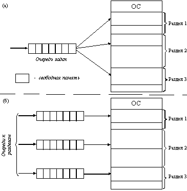

Подсистема управления памятью в этом случае выполняет следующие задачи:
-   сравнивая размер программы, поступившей на выполнение, и свободных разделов, выбирает подходящий раздел,
-   осуществляет загрузку программы и настройку адресов.

При очевидном преимуществе - простоте реализации - данный метод имеет
существенный недостаток - жесткость. Так как в каждом разделе может
выполняться только одна программа, то уровень мультипрограммирования
заранее ограничен числом разделов не зависимо от того, какой размер
имеют программы.

***Распределение памяти разделами переменной величины***
--------------------------------------------------------

В этом случае память машины не делится заранее на разделы. Сначала вся
память свободна. Каждой вновь поступающей задаче выделяется необходимая
ей память. Если достаточный объем памяти отсутствует, то задача не
принимается на выполнение и стоит в очереди. После завершения задачи
память освобождается, и на это место может быть загружена другая задача.

Таким образом, в произвольный момент времени оперативная память
представляет собой случайную последовательность занятых и свободных
участков (разделов) произвольного размера.

Задачами операционной системы при реализации данного метода управления
памятью является:

-   ведение таблиц свободных и занятых областей, в которых указываются начальные адреса и размеры участков памяти,
-   при поступлении новой задачи - анализ запроса, просмотр таблицы свободных областей и выбор раздела, размер которого достаточен для размещения поступившей задачи,
-   загрузка задачи в выделенный ей раздел и корректировка таблиц свободных и занятых областей,
-   после завершения задачи корректировка таблиц свободных и занятых областей.

Выбор раздела для вновь поступившей задачи может осуществляться по
разным правилам, таким, например, как \"первый попавшийся раздел
достаточного размера\", или \"раздел, имеющий наименьший достаточный
размер\", или \"раздел, имеющий наибольший достаточный размер\".

По сравнению с методом распределения памяти фиксированными разделами
данный метод обладает гораздо большей гибкостью, но ему присущ очень
серьезный недостаток - *фрагментация памяти*. **Фрагментация** - это
наличие большого числа несмежных участков свободной памяти очень
маленького размера (фрагментов).

***Перемещаемые разделы\
***Одним из методов борьбы с фрагментацией является перемещение всех
занятых участков в сторону старших либо в сторону младших адресов, так,
чтобы вся свободная память образовывала единую свободную область. В
дополнение к функциям, которые выполняет ОС при распределении памяти
переменными разделами, в данном случае она должна еще время от времени
копировать содержимое разделов из одного места памяти в другое,
корректируя таблицы свободных и занятых областей. Эта процедура
называется \"сжатием\". Сжатие может выполняться либо при каждом
завершении задачи, либо только тогда, когда для вновь поступившей задачи
нет свободного раздела достаточного размера. В первом случае требуется
меньше вычислительной работы при корректировке таблиц, а во втором -
реже выполняется процедура сжатия.

1.  Страничная организация виртуальной памяти. Вычисление физических адресов при страничной организации виртуальной памяти.
===========================================================================================================================

Виртуальное адресное пространство каждого процесса делится на части
одинакового, фиксированного для данной системы размера, называемые
**виртуальными страницами**. В общем случае размер виртуального
адресного пространства не является кратным размеру страницы, поэтому
последняя страница каждого процесса дополняется **фиктивной областью**.
Вся оперативная память машины также делится на части такого же размера,
называемые физическими страницами (или блоками). Размер страницы обычно
выбирается равным степени двойки.

При загрузке процесса часть его виртуальных страниц помещается в
оперативную память, а остальные - на диск. Виртуальные страницы процесса
могут физически находиться в разных частях памяти. ОС создает для
каждого процесса **таблицу страниц**, в которой устанавливается
соответствие между номерами виртуальных и физических страниц для
страниц, загруженных в оперативную память, или делается отметка о том,
что виртуальная страница выгружена на диск. Кроме того, в таблице
страниц указана управляющая информация, такая, как данные о запрете
выгрузки, количестве обращений, данные о модификации итп.

При обращении к виртуальной странице, которая находится в оперативной
памяти, происходит преобразование адреса в физический. Если страница еще
не размещена в оперативной памяти, то сам происходит **страничное
прерывание**. Процесс переводится в состояние ожидания, а обработчик
прерывания подгружает нужную страницу. Если для этого необходимо
выгрузить какую-то страницу из ОП (нет помеченных, как свободные), могут
быть использованы разные критерии. Наиболее популярные:

*· дольше всего не использовавшаяся страница,*

*· первая попавшаяся страница,*

*· страница, к которой в последнее время было меньше всего обращений.*

(При выгрузке проверяется признак модификации и при необходимости
страница переписывается на диске)

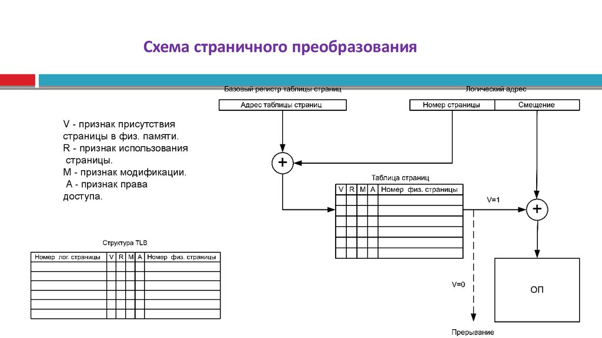
========================================================================================

Виртуальный адрес при страничном распределении может быть представлен в
виде пары (p, s), где p - номер виртуальной страницы процесса (нумерация
страниц начинается с 0), а s - смещение в пределах виртуальной страницы.
При записи в двоичном представлении - p - старшие разряды, s - младшие
(их количество определяется степенью 2 в размере страницы).

При преобразования виртуального адреса в физический на основании
виртуального адреса p по таблице определяется физический, к нему
добавляется смещение s. Адрес таблицы хранится в специальном регистре.

При страничной организации памяти много времени может тратиться на
страничное прерывание, на преобразование виртуального адреса в
физический. Для уменьшения количества прерываний и уменьшения размеров
таблиц можно увеличить размер страницы, однако это увеличивает фиктивную
область последней виртуальной страницы каждого процесса.

 

1.  Методы выделения дискового пространства и записи последовательности блоков данных: непрерывная последовательность блоков, связный список, таблица размещения файлов.
========================================================================================================================================================================

***Непрерывная последовательность блоков.***

Необходимо хранить имя файла, номер первого блока и размер. Поделив
размер файла на размер блока узнаем сколько считать блоков, остаток ---
сколько данных из блока мои. Эта схема имеет два преимущества.
Во-первых, ее легко реализовать, так как выяснение местонахождения файла
сводится к вопросу, где находится первый блок. Во-вторых, она
обеспечивает хорошую производительность, так как целый файл может быть
считан за одну дисковую операцию.Проблема --- фрагментированность
данных. TODS (table of the contents) хранится в конце.

CDFS и аналогичные файловые системы так и работают.

***Связные списки***. В конце каждого блока пишем где продолжение.
Недостаток --- надежность. При потере блока теряется все, что после
него. Проблема позиционирования (нельзя просто переместить, надо
пробегать всё). Проблема расчета свободного места.
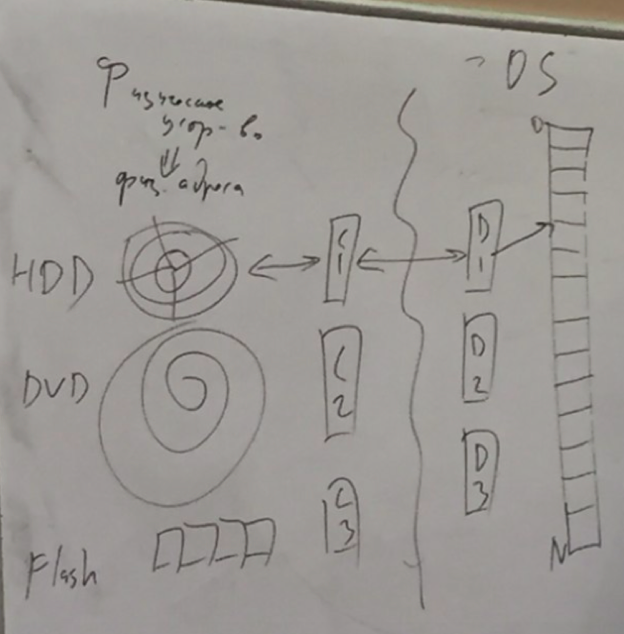

Преимущества: нет необходимости декларировать размер файла в момент
создания. Файл может расти неограниченно. Отсутствие фрагментации.

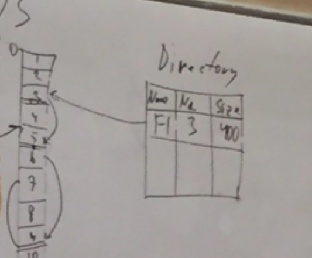
=========================================================================================

***Таблицы размещения.*** File allocation table (FAT). Хранение остатков
выносится в отдельную таблицу. Так работали первые вирусы, перемешивали
таблицу FAT*.* Этой схемы придерживаются многие ОС (MS-DOS, OS/2, MS
Windows и др.)

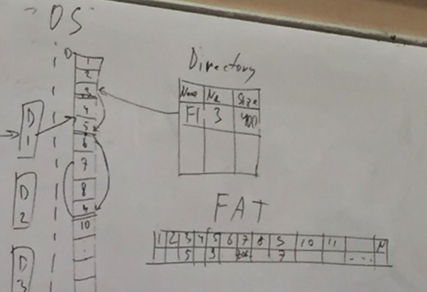

Минусы:

-   *Ограничение на максимальный размер файла. Бывает, что используется несколько таблиц.*
-   *Надежность (вирусы)*
-   *Таблицу надо постоянно хранить в оперативной памяти.*

Плюсы:
-   Быстро
-   Просто

1.  Методы выделения дискового пространства и записи последовательности блоков данных: индексные дескрипторы.
=============================================================================================================

*ext2*
======

делим диск на некие области
===========================

1) Суперблок - хранятся метаданные файловой системы (например, размер блока). Константы, которые задают структуру.
==================================================================================================================

2) Индексные дескрипторы i-nodes - 
==================================

3) Битовая карта для файлов - показывает количество свободных блоков
====================================================================

4) Битовая карта для i-nodes - показывает количество свободных блоков
=====================================================================

5) Данные
=========

область i-nodes нарезается на некоторое количество отдельных блоков
===================================================================

i-node хранит метаданные и 16 блоков под адреса. Первые 12 блоков --- прямая адресация: где искать. Последние 4 отведены под косвенную адресацию --- тогда блоки будут восприняты как адреса, а не как данные. В первой из них содержится ссылка на таблицу в которой по 1024 ссылки на данные. В остальных - ссылки на таблицы из 1024 ссылок на таблиц, в которых находится по 1024 ссылки на данных. 
=======================================================================================================================================================================================================================================================================================================================================================================================================

+ надежность
============

- ограничение на количество i-nodes
===================================

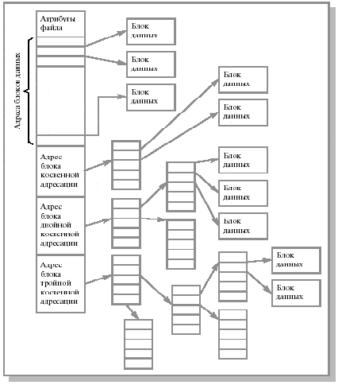

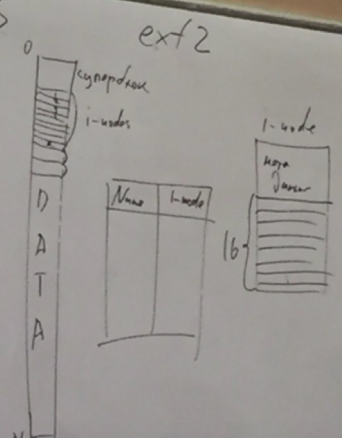
=========================================================================================

*В NTFS* граница между i-nodes и data может изменяться
======================================================

- сложность вычислений = скорость
=================================

- меньшая надежность
====================

+ гибкость
==========

 

Битовая карта: показывает количество свободных блоков
=====================================================

доп:

ext4

максимальный раздел одного раздела 2\^60 байт, файла 16 терабайт.

extended для ускорения --- вместо изменения в конец дописыванием
сценарий изменения.

Добавляем хеш для быстрого поиска i-node. Хэш может быть кластерный или
плотный. Дело в том, что для поиска i-node по имени файла нам придется
сравнивать символы в строках. А это довольно непредсказуемая по времени
операция: файл может быть в начале и мы найдем его практически
мгновенно, а может быть в конце, а название состоять из 31 символа и
отличаться в 31-ом (то есть мы будем тратить очень много времени, всё
время обнаруживая, что данная строка не является искомой только на
последнем символе). Поэтому введём хеширование.

Для каждого имени файла вычислим хеш, а хеши будем хранить в виде
B-дерева, тем самым позволяя быстро найти файл благодаря
сбалансированности дерева. Такой хеш называется плотным.

Такое решение не идеально: если файлы будут постоянно добавляться, то
нам придется постоянно перебалансировать дерево, что очень долго.
Поэтому давайте брать хеш не полностью по имени файла, а по его части.
Например, по первым пяти символам. Тогда по дереву, которое нам надо
будет перестраивать реже (или вообще никогда в некоторых случаях) --- мы
находим блок с именами, которым соответствует хеш, а уже в этом блоке
делаем поиск сравнением строк. Такой хеш называется кластерным или
разреженным. *\
*

 

1.  Журналируемые файловые системы. Назначение и виды журналов.
===============================================================

Журналируемая файловая система --- файловая система (ФС), в которой
осуществляется ведение журнала, хранящего список изменений и, в той или
иной степени, помогающего сохранить целостность файловой системы при
сбоях.

Заплатим производительностью за надежность. Более чем в два раза
увеличивается время выполнения. Создаём план того, что будем делать.
Делаем. Если что-то произошло, по журналу откатываем или доделываем.

Режимы журналирования:
 1 Journal --- полное журналирование как метаданных ФС, так и пользовательских данных. Самый медленный, но и самый безопасный режим; может гарантировать целостность данных при хранении журнала на отдельном разделе. Относятся XFS, ext3.
 2 Ordered --- В этом режиме в журнал заносятся также только метаданные, но сами данные записываются до журналирования метаданных. Этим гарантируется согласованность данных файловой системы после восстановления. JFS2, ext3 (по умолчанию), ReiserFS.
 3 Write-back --- журналированию подвергаются только метаданные, а блоки с данными записываются непосредственно на диск. Это способствует нерушимости структуры файловой системы и защищает от повреждений, однако повреждение самих данных все же возможно (например, если крах системы наступает после записи метаданных в журнал, но до записи блока с данными). ext3.

Иногда пишут журнал на другой диск.
