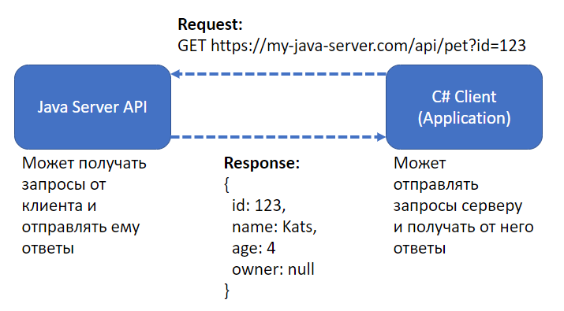
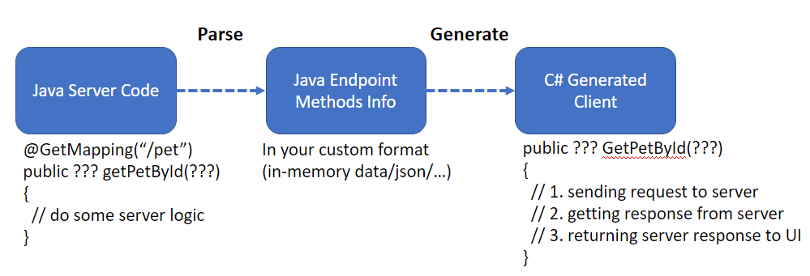

# Labs

## lab-1. Hello world

Задания на лабораторную работу:вк

Везде, где написана Java можно использовать котлин

1. Изучить механизм интеропа между языками, попробовать у себя вызывать C/C++ (Не C++/CLI) код (суммы чисел достаточно) из Java и C#. В отчёте описать логику работы, сложности и ограничения этих механизмов.
2. Написать немного кода на Scala **и** F# с использованием уникальных возможностей языка - Pipe operator, Discriminated Union, Computation expressions и т.д. . Вызвать написанный код из обычных соответствующих ООП языков (Java **и** С#) и посмотреть во что превращается написанный раннее код после декомпиляции в них. 
3. Написать алгоритм обхода графа (DFS и BFS) на языке Java, собрать в пакет и опубликовать (хоть в Maven, хоть в Gradle, не имеет значения). Использовать в другом проекте на Java/Scala этот пакет. Повторить это с C#/F#. В отчёте написать про алгоритм работы пакетных менеджеров, особенности их работы в C# и Java мирах.
4. Изучить инструменты для оценки производительности в C# и Java. Написать несколько алгоритмов сортировок (и взять стандартную) и запустить бенчмарки (в бенчмарках помимо времени выполнения проверить аллокации памяти). В отчёт написать про инструменты для бенчмаркинга, их особености, анализ результатов проверок.
5. Используя инструменты dotTrace, dotMemory, всё-что-угодно-хоть-windbg, проанализировать работу написанного кода для бекапов. Необходимо написать сценарий, когда в цикле будет выполняться много запусков, будут создаваться и удаляться точки. Проверить два сценария: с реальной работой с файловой системой и без неё. В отчёте неоходимо проанализировать полученные результаты, сделать вывод о написанном коде. Опционально: предложить варианты по модернизации или написать альтернативную имплементацию.

**Опционально**:

1. Бенчмарк памяти для джавы
2. Ознакомиться с исходным кодом dotnet runtime. Склонировать репозиторий, собрать его локально. Вспомнить какого метода вам не хватало в стандартной библиотеке при выполнении лабораторных на ООП и добавить его. Собрать с добавленным методом, убедиться, что он работает.

## lab-2. Codegen

### Glossary

- HTTP-сервер — приложение, которое умеет обрабатывать обращения посредством HTTP-запросов.
- HTTP-клиент — набор моделей и методов, которые позволяют взаимодействовать с HTTP-сервером.

### Theory

- [roslyn/source-generators.md at main · dotnet/roslyn · GitHub](https://github.com/dotnet/roslyn/blob/main/docs/features/source-generators.md)
- [roslyn/source-generators.cookbook.md at main · dotnet/roslyn · GitHub](https://github.com/dotnet/roslyn/blob/main/docs/features/source-generators.cookbook.md#use-functionality-from-nuget-packages)
- Генерация HTTP-клиентов - [Swagger Documentation](https://swagger.io/docs/open-source-tools/swagger-codegen/)
- [C# HttpClient - creating HTTP requests with HttpClient in C# (zetcode.com)](https://zetcode.com/csharp/httpclient/)
- [Что такое REST API? | learnapidoc-ru (starkovden.github.io)](https://starkovden.github.io/what-is-rest-api.html)
- Jason Bock, .NET Development Using the Compiler API
- Для джавы, гайд по развёртыванию простого приложения: [Getting Started | Building an Application with Spring Boot](https://spring.io/guides/gs/spring-boot/)

Цель: используя инструмент Roslyn API написать программу, которая генерирует HTTP-клиент для сервера написанного на другом языке.

### Задание

#### Написание сервиса с которым будет выполняться работ

Написать HTTP-сервер, которые предоставляет несколько методов (в качестве примера, можно взять 2-3 лабораторные второго подпотока). Рекомендуемый язык - Java ввиду простоты поднятия и прочего. Можно использовать любой другой (лучше заранее согласовать). Примеры необходимого функционала:

1. GET, POST запросы
2. Запросы с аргументами в Query, в Body
3. Сложные модели с Response (не примитивы, хотя бы классы с полями)
4. Аргументы, которые являются коллекциями, респонсы, которые коллекции содержат



#### Написание парсера

Написать упрощённый парсер (на C#) для этого сервера, чтобы можно было получить семантическую модель (можно использовать любые библиотеки для этого), а именно:

1. Описание методов из API - url, список аргументов, возвращаемое значение
2. Модели, которые используются в реквестах и респонсах



В качестве примера расмотрим процесс парсинга сервиса на языке, который имеет такой синтаксис:

```csharp
@HttpGet("/pet")
public Pet getPet(int id) { ... }
```

Допускаем, что по такому описанию будет сгенерирован эндпоинт, который умеет принимать запросы `GET /pet?id=...` . Из этого описания мы должны получать необходимую для создания клиента информацию:

- Тип запроса - GET, POST, PUT, etc.
- URL запроса (`/pet` в нешем случае)
- Имя метода
- Список аргументов
- Тип возвращаемого значения

На вход парсинг должен уметь принимать путь до исходного кода сервиса, обрабатывать его и возвращать какое-то представление нашего сервиса. Например, список описаний всех найденных методов, которые можно вызывать через HTTP запросы, может выглядеть так:

```csharp
class MethodDeclaration 
{
    string MethodName
    string ReturnType
    List<ArgDeclaration> ArgList
    string Url
    string HttpMethodName
}
```

#### Генерация клиента

Используя Roslyn API реализовать генерацию HTTP-клиента для данного сервера. Для API должны генерироваться все нужные модели, методы. Можно посмотреть на Swager codegen, примеры его работы и результат его генерации.

На защите нужно продемонстрировать написанные сервер и генератор, генерацию методов и моделей.

#### Детали реализации

В качестве примера рассмотрим как можно было бы реализовать упрощённый вариант задания, а именно создание метода для вызова запроса с помощью StringBuilder. Для описанного выше метода из сервера клиентский код можно написать так:

 

```csharp
public Pet GetPet(int id)
{
    return new HttpClient().Get("/pet?id=" + id);
}
```

Код генерации подобного метода используя введённую структуру (MethodDescriptor) тогда будет таким:

```csharp
foreach (var md in methods)
{
    var sb = new StringBuilder();
    sb.Append("public ");
    sb.Append(md.ReturnType); // Pet
    sb.Append(md.MethodName) // GetPet
		sb.Append("(");
    foreach (var arg in md.ArgList) //int id
    {
        // ...
    }

    // { return new ...
}
```

<aside>
❗ Обратите внимание, что пример выше реализован **без использования Roslyn API**.

В рамках выполнения лабораторной работы необходимо реализовать решение, базирующееся на использовании инструментов Roslyn API (необходимо будет оперировать такими понятиями, как SyntaxFactory, CompilationUnitSyntax, SyntaxTree, SyntaxNode, SyntaxKind, SyntaxTrivia).

</aside>

### Дополнительные задания (не обязательные)

1. Интегрировать генерацию клиента в процесс компиляции по средствам Source Generator.
2. Должна быть реализована возможность инкрементально сгенерировать обновления - не заменять файл, а добавлять в него недостающие методы (не ломаю при этом те методы, которые были добавлены ранее, если они не относятся к API)
3. Реализовать с помощью Roslyn более реалистичный аналог [HackerType](https://hackertyper.net/). Под более реалистичным подразумевается то, что, например, для if statement’а будет сначала генерироваться `if (...) { }`, а потом код внутри.
4. Сделать генерацию клиента из C# сервера используя Roslyn API. Провести сравнение и анализ разницы между подходами.

## lab-3. Roslyn analyzer

| Номер | Name | Что нужно учесть | Сложность |
| --- | --- | --- | --- |
| И1 | Для проверки на null использовать конструкции is null и is not null вместо == null и != null. |  | Изи |
| И2 | Вместо вызова методов Convert.ToType использовать Type.Parse (Например, int.Parse вместо Convert.ToInt32). | Все перегрузки Convert. Проверить, что у типа есть метод TryParse (посмотреть для строк и подобного) | Изи |
| И3 | Заменять магические числа на константное поле и давать ему имя по умолчанию MagicNumberN (где N — порядковый номер поля с именем MagicNumber в классе для случаев, если таких полей будет несколько).  | Константы, которые сетятся в локальные переменные, передаются в методы аргументами и используются в if/for. Реализовать возможность заменить всех одинаковых литералов сразу на одно поле. | Изи |
| И4 | Заменять все булевые переменные с отрицанием в названии (например, notAvailable на available) инвертируя юзаджи. | Локальные переменные в методах и аргументы методов | Изи |
| И5 | Инвертировать if, если в else бросание эксепшена или return | Бросание эксепшена, return выражение, ситуации, когда помимо return и бросания ещё выполняется какое-то действие | Изи |
| И6 | Мёрдж вложенного в else выражения if, если это возможно | Случаи, когда можно заменить, когда перед или после вложенного ифа есть ещё действия  | Изи |
| И7 | В методах, у которых возвращаемое значение является коллекцией, вместо null возвращать пустую коллекцию (заменять возвращаемое значение null на List<T> или Array.Empty<T>). | Кейсы, когда из метода по сигнатуре возвращается IEnumerable, List и массив. Кейс, когда в методе есть yield возвращение | Изи |
| И8 | При передаче в метод константных значений (например 228617, false, null вместо id, isAdmin, studyGroup) явно указывать имя аргумента | Передача в методы, индексаторы, вызовы экземпляра Func. Учесть, что проверка не должна срабатывать, если передаётся переменная. | Изи |
| О1 | В сигнатурах свойств и публичных методов использовать IReadOnlyCollection<T> вместо List<T> и Array<T>. | Замена обычного метода класса и метода, который является реализацией интерфейса | Ок |
| О2 | Находить использование непереопределённого оператора == для сравнения типов и заменять на вызов Equals. | Позитивные сценарии, когда сравнивается два типа у которых нет перегрузки оператора.
Сценарий, когда у одного из типа переопределён оператор (у правого или левого)
Сценарий, когда оператор передаётся по наследству
Сценарий сравнения с экземпляром интерфейса | Ок |
| О3 | Приватные поля, которые используются только в качестве локальных переменных методов, преобразовывать в локальные переменные методов | Кейс, когда аргумент сразу записывается и потом читается. Кейс, когда аргумент читается, потом записывается (в таком случае инлайнить нельзя). Кейс, когда переменная используется в другом методе | Ок |
| О4 | Backing field и свойство, которое его возвращает / Backing field и метод, который его возвращает, которые можно заменить на автосвойство | Замена свойства на автосвойство
Замена поля с методом на автосвойство
Замена поля с методом, где поле также используется для записи на свойство с { get; private set; } | Ок |
| О5 | В методах, которые имеют префикс Try в названии и при этом возвращают не bool-значение, выполнять замену сигнатуры, чтобы она возвращала bool + out параметр | Рассмотреть простой кейс, когда у нас выражения только return new в нескольких if. Поддержать сценарий, когда return делается из локальной переменной. | Ок |
| О6 | Лямбды, которые не body expression заменять на вызов метода, а их тело выносить в этот метод | Лямбды с аргументами, лямбды без аргументов. Лямбды, которые сетятся в переменную типа Func<>. Лябмда в лямбде. | Ок |
| О7 | Заменять несколько out-параметров на один out-параметор, который является классом содержащим все другие параменты | Можно задачу упроситить и не рассматривать очень сложные вложенности if’ов в if’ы и подобное | Ок |
| О8 | Детектить вызов метода ToString, который вызывается базовый метод из Object | Учесть ситуации, когда может быть оперделён в классе, от которого наследование идёт. | Ок |
| П1 | Проверять (если такой проверки ещё нет) на null значения аргументов публичных методов и конструкторов. Строки проверять на .IsNullOrEmpty(). | Подумать про NRT, атрибуты, валидации вида `if (list.Any(v => v is null)) throw new Exception...` | Подумать |
| П2 | Находить конструкции, в которых выражение всегда имеет значение true, и упрощять код удаляя их | Проверить ситуации вида `bool value = true; if (value) {...}` и подобные | Подумать |
| П3 | Для О8 нагенерировать максимально большое количество кейсов, когда должна проверка триггериться | Помимо очевидных ToString, есть ещё ряд сценариев, которые стоит учесть. Например, вызов у интерфейсов, интерполяция |  |

- Драфт, который не взяли
  - Свойства, которые называются по типу `GetStudents`, переименовывать в `Students`.
  - Поля, свойства, аргументы конструкторов и методов, названные по типу `listOfStudents` (приставка collectionOf), переименовывать `students`.
  - Убирать лишние переносы строк: не должны быть подряд несколько (больше одной) пустых строк.
  - столбикализация и линки в столбец раздельными тасками делать?
  - Следовать семантике в определении возвращаемых значений методов Get и Find:
    - Get не должен возвращать null.
    - Find в случае, когда искомый объект не найден, для ссылочных типов должен возвращать `null`, а для структур `Nullable<T>`.
  - Не передавать в качестве аргументов данные как вызовы LINQ-конструкций:
      
      ```csharp
      alg.Invoke(arr.Where().Select().ToList());
      ```
      
      Выносить вычисление LINQ-конструкций до вызова метода и передавать в метод полученное значение в отдельной переменной.
      
  - Заменять выбрасывание базового исключения `Exception` типом исключения, выбранным одним из способов:
      - поиск типов исключений, созданных в проекте, и использование какого-то из них (давать пользователю выбрать);
      - конфигурация самостоятельно придуманным способом списка исключений, которые можно придлагать пользователю для замены;
  - имена в другом порядке
  - проверка
  - Если метод содержит несколько (более двух) out-параметров, следует выносить эти параметры в отдельный класс.
    
    ============================================
    
    Ультраизи варианты:
    
    1. Проперти, которые называются GetName менять на Name
    2. listOfStudent → students
    3. Форсить линки в столбец
    4. Используйте Type.Parse вместо Convert.ToType (например, int.Parse вместо Convert.ToInt32).
    5. Для проверки на null использовать конструкции `is null` и `is not null`.
    6. Минимизируйте переносы строк
    7. При передаче констант указывать явно имя аргумента
    8. Столбикализация - Не писать длинные строки. Если вызов метода или его сигнатура длинная, то стоит делать переносы после каждого аргумента или заводить отдельные типы для аргументов
    
    Ок варианты:
    
    1. Magic numbers
    2. Не использовать отрицание в именах булевских аргументов, полей и методов возвращающих булеан
    3. В сигнатурах публичных методов использовать IReadOnlyCollection<T> вместо List и Array
    4. Находить if-else внутри else { ... } и выстраивать в if - else if - else
    5. if (...) { *** } else thr → invert to if (!...) { thr } *** (и return)
    6. Get не должен возвращать null, Find должен возвращать Nullable<T> для структур
    7. Не возвращать null место коллекций из методов. В кодфиксе заменять на new List или Array.Empty
    8. Заменять == на вызов Equals, находить == для не числовых типов и банить
    9. Не писать LINQ конструкции внутри вызова метода (alg.Invoke(arr.Where().Select().ToList())
    10. Проверка на null аргументов публичных методов и конструтора (можно ещё строки на IsNullOrEmpty
    11. Замена thr new Exception на thr new ShopException (с возможностью конфигать какие эксепшены? Поиск эксепшенов из проджекта?)
    12. Искать места, где always true
    13. Private fields only used as local variables in methods should become local variables
    14. Бесполезная комбинация backing field + get-only prop ⇒ backing fiels → get-only prop. Проверять, что для поля или свойства нет метода с Get*
    15. Shop TryGet() → bool TryGet(out Shop shop)
    16. Лямбды, которые не body expression заменять на вызов метода, а их тело выносить в локальную функцию или метод(можно конфиг сделать!)
    17. Попытаться детектить случаи, когда имена аргументов похожи на имена параметров, но в другом порядке
    18. Проверка результата выполнения методов Find* на null. После вызова метода Get убрать проверку на null. Или как вариант заменять Find на Get.
    
    Кажется довольно сложными:
    
    1. Для `var shop = new Shop();shop.Id = 1;` генерировать конструктор, который бы сетил id и заменять на его вызов
    2. Не использовать Tuple, ValueTuple и KVP в сигнатурах методов и в полях типов

## lab-4. Perf tips

Цель: ознакомиться с инструментами и подходами, которые позволяют минимизировать аллокации памяти, расходы на GC. Написать решение, которое было бы оптимальным с точки зрения аллокаций и перфоманса.

### Подход к решению лабораторной работы

1. Ознакомьтесь с прикладной областью представленных вариантов, выберите какой-то из них.
2. Напишите минимальную реализацию поставленной задачи, опишите решение в первом пункте отчёта.
3. Соберите метрики: запустите бенчмарки тех частей алгоритмов, которые кажутся наиболее важными, сохраните результаты.
    
    Протестируйте реализацию в dotTrace и dotMemory, сохраните полученные результаты (лучше их как-то подписать, т.к. их будет много).
    
    Во второй пункт отчёта вставьте полученные результаты, а также дополните анализом: опишите проблемы, которые вы можете видеть на трейсах, предполагаемые причины и возможные фиксы.
    
4. Возьмите один из предложенных вариантов исправлений, которые были получены в пункте 3 и
    - реализуйте его,
    - соберите повторно метрики,
    - сравните.
5. Повторите действия из пункта 4. Результаты (как успешные, так и не очень), добавьте в третий пункт отчёта.

### Вариант 1. Генетический алгоритм

Требуется реализовать алгоритм, который по заданным ограничениям будет подбирать оптимальное решение задачи, используя подходы, построенные на генетических алгоритмах.

#### Задание

Есть материальная точка, которая находится в точке (0, 0) на плоскости. Точка поддаётся законам механики (у точки есть скорость, а прикладывание силы создаёт ускорение); к ней каждые dt единиц времени прикладывается вектор силы, чтобы повлиять на траекторию движения.

Есть материальная точка, которая находится в точке (0, 0) на плоскости. В каждый момент времени точку можно сдвигать на определённый вектор. Требуется за минимальное количество движений переместиться в позицию (1, 1). При этом нельзя выходить за пределы квадрата.

Входные параменты:

- Максимальная длинна вектор, на которую можно точку сдвинуть за одну единицу времени.
- Пространство, в которое нельзя попадать точке, которое задаётся координатами центра и радиусом (т.е. круги, которые нужно обходить).

Пример конфигурационного файла:

```json
{
  "dt": 0.001,
  "Fmax": 1,
  "circles": [
    {
      "X": 0.33218833804130554,
      "Y": 0.15921106934547424,
      "R": 0.23818166553974152
    },
    {
      "X": 0.9211785793304443,
      "Y": 0.21001200377941132,
      "R": 0.24298787117004395
    },
    {
      "X": 0.6558014154434204,
      "Y": 0.7025460004806519,
      "R": 0.21127113699913025
    },
    {
      "X": 0.05513463541865349,
      "Y": 0.7919896245002747,
      "R": 0.20693418383598328
    }
  ]
}
```

#### Теоретическая часть

Введём основные понятия:

- Ген — атомарный элемент генотипа и/или хромосомы.
- Хромосома — упорядоченный набор генов.
- Генотип — набор хромосом данной особи.
- Особи — хромосомы с закодированными в них параметрами задачи.
- Популяция — множество особей.

Идея генетических алгоритмов заключается в попытке найти решение для задач, где этот поиск очень сложен или невозможен.

В процессе решения через генетический алгоритм задачу сводят к генам, хромосомам и фитнес функциям. В контексте описанной выше задачи геном можно называть минимальную операцию, а именно применение определённого вектора силы на точку. Из векторов выстраивается список векторов, т.е. некоторая хромосома, которая и представляет собой решение задачи (i-ый ген — это сила, которая прикладывается в i-ый момент времени).

Фитнес функция — это метрика успешности особи. Если говорить про конкретную задачу планирования движения, то такой функцией можно считать количество применённых сил для достижения конца. Но также можно предположить, что далеко не все применения сил будут успешным доведением точки до конца, а значит можно подобрать фитнес функцию, которая поможет лучше добираться до конца.

На хромосому можно применить мутацию. Под мутацией подразумевается процесс создания копии хромосомы с изменёнными генами. Насколько изменёнными — вопрос реализации, но обычно подразумевается изменение одного гена.

Один из сложных вопросов при применении геналго — выбор начальной хромосомы. Самым простым способом может являться взятие рандомных значений или предположительно хорошего решения, которое нужно улучшить.

Более подробно можно изучить тему по книге “Рутковская. - Нейронные сети, генетические алгоритмы и нечеткие системы”.

<aside>
💡 Воспринимать решение чуть проще, если есть визуализация. Шаблон репозитория с визуализацией появится чуть позже.

</aside>

### Вариант 2. Распределённая файловая система

Реализовать функционал распределённой файловой системы.

#### Glossary

Распределённая файловая система — файловая система, которая может содержать распределённые ноды.

Нода — место хранения файлов, которое подключается к файловой системе и умеет обрабатывать запросы на добавление и удаление файлов. В рамках лабораторной работы подразумевается, что взаимодействие файловой системы с нодами будет происходить через TCP.

Относительный путь — это путь, который используется для размещения файла на ноде. Например, мы можем запросить у файловой системы разместить файл C:/file.txt на любой из нод с относительным путём /tmp/file.txt.

#### Задание

Список поддерживаемых команд:

- /add-node <name> <ip> <size> — добавляет ноду.
- /add-file <path> <partial-path> — копирует указанный файл на файловую систему в одну из нод. Сохраняет по указанному относительному пути.
- /remove-file <path> — удаляет файл.
- /remove-file <path> — удаляет файл с ноды, на которой файл лежит.
- /exec <path> — выполнить команды, которые описаны в текстовом файле, путь к которому передаётся.
- /clean-node <name> — выгружает все файлы, которые находятся на указанной ноде, на другие ноды.
- /balance-node — перераспределяет файлы между нодами так, чтобы на всех нодах был максимально одинаковый процент нагрузки.

Для корректной работы нужно реализовать два вида запускаемых приложений: основной сервер и ноды. Ноды должны уметь обрабатывазать запросы от основного сервера. Основной сервер должен обрабатывать описанные выше команды. Формат общения между сервером и нодой остаются на усмотрение автора (здесь имеется в виду то, что будет использоваться во взаимодейтсвии поверх TCP: протоколы/спецификации/др.).

#### Алгоритм работы для демонстрации

1. Запустить клиенты на трёх нодах, которые будут обрабатывать запросы от основного сервера. Можно запустить несколько нод на одной машине с разными TCP портами.
2. Написать файл с командами, который бы добавлял указанные три ноды, какое-то количество файлов разных размеров и выполнял ряд операций выгрузки, балансировки.
3. Запустить основной сервер и запустить выполнение команд из написанного файла.

---

## lab-N. Bonus

Постановка задачи. Есть набор задач, которые нужно выполнить. Например, подсчёт хеша набора строк. Выполнение может сильно варьироваться по времени. Для ускорения выполнения применили функционал PLINQ, который позволяет выполнять параллельно.

```csharp
var result = taskQueue
  .AsParallel()
  .Select(element => Execute(element))
  .ToList();
```

Такая реализация позволяет ускорить обработку, но имеет ряд недостатков. Один из таких недостатоков - это плохое управление вычислительными ресурсами. При определённом наборе данных может получиться ситуация, когда выполнение использует 8 потоков и 100% CPU, а через время уже 4 потока и 50%, а под конец выполняться уже в 1 поток.

Задание:

1. Подобрать такой набор тестов, чтобы получить описанную проблему
2. Сделать вывод о том, когда такая проблема появляется
3. Написать собсвенное решение, которое позволило бы заменить PLINQ и решить описанные проблемы
4. Написать бенчмарки (проблемный сценарий и сценарий, когда задачи выполняются за около одинаковое время), собрать информацю о времени выполнения, аллокации
5. Провести анализ полученных результатов, описать применённые оптимизации
  