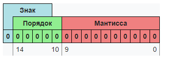
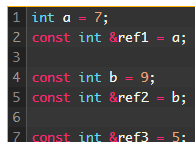
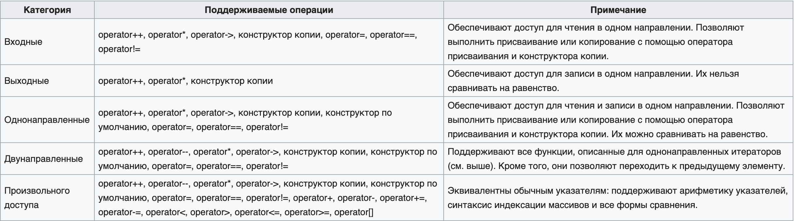
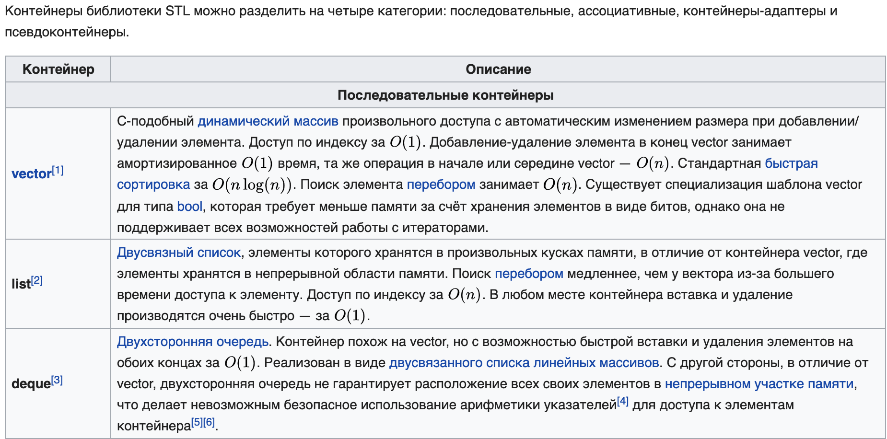
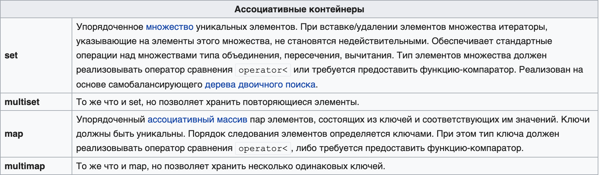

**1. Встроенные типы данных. Представление чисел в памяти. Прямой,**

**обратный и дополнительный код. Числа с плавающей точкой.**

С++ предоставляет набор встроенных типов данных: символьный, целый,
вещественный -- и набор составных и расширенных типов: строки, массивы,
комплексные числа. Кроме того, для действий с этими данными имеется
базовый набор операций: сравнение, арифметические и другие операции.
Есть также операторы переходов, циклов, условные операторы.

Int -- целочисленный тип данных (4 байта)

Float -- число с плавающей точкой (4 байта)

Double -- число с плавающей точкой двойной точности (8 байт)

Bool -- логический тип данных (1 байт)

Char -- символьный тип данных (1 байт)

[Представление чисел в памяти:]{.underline}

Целые положительные числа представляются в прямом коде, просто переводим
число в двоичную СИС

Целые отрицательные числа хранятся в дополнительном коде

Натуральные числа:

В этом формате вещественное число (R) представляется в виде произведения
мантиссы (m) и основания системы счисления (P) в целой степени (n),
называемой **порядком**.

Представим это в общем виде, как: R=m⋅pow(P,n).

Порядок n указывает, на какое количество позиций и в каком направлении
должна сместиться в мантиссе точка (запятая), отделяющая дробную часть
от целой. Мантисса, как правило, нормализуется, то есть представляется в
виде правильной дроби 0 \< m \< 1.

Мантисса должна быть правильной дробью, у которой первая цифра после
точки (запятой в обычной записи) отлична от нуля. Если это требование
выполнено, то число называется **нормализованным**.

{width="3.7083333333333335in"
height="1.2708333333333333in"}

**2. Хранение данных в памяти. Доступ к данным в памяти. Указатели.**

**Операции с указателями.**

Оперативная память представляет собой упорядоченную последовательность
ячеек --- байт, предназначенных для размещения данных, которыми
оперирует программа во время своего выполнения.

Упорядоченность означает, что каждая ячейка памяти имеет свой порядковый
номер, его называют **адресом** ячейки памяти --- адресом байта.
Непрерывный диапазон ячеек, доступный для адресации в конкретной
операционной системе, называют **адресным пространством**.

Современные операционные системы в своём большинстве представлены 32- и
64-разрядными версиями. В 32-разрядных операционных системах для работы
с номерами ячеек памяти используются 32-разрядные (4-байтные) типы
данных. Адресовать в таких системах можно до 4294967296 ячеек ---
максимальное число, которое можно представить 32 разрядами, что в
точности соответствует 4 Гб адресного пространства. В 64-разрядных
операционных системах для работы с номерами ячеек памяти используются
64-разрядные (8-байтные) типы данных.

Доступ к объектам в памяти осуществляется посредствам указателей.
**Указатели** --- это особый вид *объектов*, предназначенных для
хранения информации о местоположении в памяти других объектов.

Значением объекта-указателя является адрес другого объекта.

Операции с указателями:

\- разыменовывание

\- операции сравнения

\- приведение типов

\- математические операции (например сложение)

**3. Массивы. Объявление и инициализация. Устройство в памяти.**

**Операции над массивами. Двумерные массивы. Арифметика указателей.**

Массив -- структура данных выглядящая, как таблица. Все элементы массива
в памяти лежат последовательно.

[Инициализация статического массива:]{.underline} \<тип\> \<имя
массива\> \[\<размер\>\]

Размер должен быть известен в момент компиляции

[Инициализация статического массива:]{.underline} \<тип\> \*\<имя\> =
new \<тип\> \[\<размер\>\]

Размер может быть неизвестен в момент компиляции

Двумерные массивы -- массивы элементами которых являются тоже массивы

Array\[0\] = \*Array

Array\[1\] = \*(Array+1) и т.д. увеличение указателя на константу =
сдвигу указателя на следующую ячейку константное число раз

**4. Ссылки. Разница между ссылкой и указателем. Зачем в С++ были**

**добавлены ссылки.**

**Ссылка** --- это тип переменной в C++, который работает как псевдоним
другого объекта или значения. **C++ поддерживает три типа ссылок**:

\- **Ссылки на неконстантные значения** (обычно их называют просто
«ссылки» или «неконстантные ссылки»).

Ссылки обычно ведут себя идентично значениям, на которые они ссылаются.
В этом смысле ссылка работает как псевдоним объекта, на который она
ссылается.

\- **Ссылки на константные значения** (обычно их называют «константные
ссылки»)

Объявить ссылку на константное значение можно путём добавления
**ключевого слова const перед типом данных**

{width="2.03125in"
height="1.4791666666666667in"}

\- В C++11 добавлены **ссылки r-value**

Обычно r-values имеют область видимости выражения, что означает, что они
уничтожаются в конце выражения, в котором созданы

Однако, когда константная ссылка инициализируется значением r-value,
время жизни r-value продлевается в соответствие со временем жизни ссылки

!!!Ссылки обязательно надо инициализировать.

!!!После инициализации изменить объект, на который указывает ссылка ---
нельзя.

Ссылки введены для более лёгкого доступа к объекту. При передаче объекта
в функцию по ссылке не надо её разыменовывать и логика работы с объектом
сводится к работе с его оригиналом.

**5. Сборка программ. Препроцессор, компилятор, компоновщик. Сборка**

**проекта, состоящего из нескольких файлов. Макросы**

Сборка:
[[https://habr.com/ru/sandbox/114988/]{.underline}](https://habr.com/ru/sandbox/114988/)

1)  Препроцессинг

2)  Компиляция

3)  Ассемблирование

4)  Компоновка

5)  Загрузка

Макросы:
[[https://tproger.ru/translations/c-macro/]{.underline}](https://tproger.ru/translations/c-macro/)

Макросы - это препроцессорные \"функции\" , т.е. лексемы, созданные с
помощью директивы \#define, которые принимают параметры подобно
функциям. После директивы \#define указывается имя макроса, за которым в
скобках (без пробелов) параметры, отделенные запятыми и определение
макроса, отделенное пробелом.

**6. Запуск программ. Процессы и потоки. Виды памяти. Стек вызова**

**функций.**

При старте процесса создается единица выполнения кода --- *поток*.
Потоку передается точка входа --- адрес нахождения первой команды
программы в адресном пространстве. Можно считать, что поток передает
команду и ее аргументы процессору, тот выполняет ее и сообщает
результат, после этого поток переходит на следующую команду с помощью
счетчика команд. Каждая команда в адресном пространстве занимает
несколько байт, не обязательно постоянное число.

**Процесс** -- это некоторая часть работы ОС, обладающая уникальным
идентификационным номером -- id, и адресное пространство. Адресное
пространство -- некоторый список адресов в памяти, с которыми происходит
работа этого процесса. С другими адресами процессу приходится работать
через системный вызов. Одна программа может включать как несколько
процессов, так и один, причем последнее используется наиболее часто.
Разбиение на процессы позволяет распараллелить задачи, благодаря чему
ускорить работу, но в большинстве случаев для этого проще и выгоднее
использовать потоки, которые намного быстрее взаимодействуют друг с
другом и обладают рядом других положительных моментов, что и привело к
меньшей используемости процессов.

**Поток** -- это часть уже самого процесса, выполняющая определенный
список действий. У каждого процесса есть как минимум один поток, и их
увеличение обеспечивает распараллеливание процесса. Каждый поток, как
часть процесса, имеет доступ ко всему адресному пространству процесса,
ко всем его устройствам и переменным. Поэтому взаимодействие двух
отдельных потоков реализуется очень просто и не требует обращения к
системе. По этой причине использование потоков более распространено, чем
процессов.

Сам поток представляет собой стек команд со счетчиком, обладающий
несколькими важными свойствами, такими как состояние и приоритет.
Состояний потока всего три: состояние активности, то есть поток
выполняется на данный момент, состояние неактивности, когда поток
ожидает выделения процессора для перехода в состояние активности, и
третье -- состояние блокировки, когда потоку не выделяется время
(соответственно он не занимает место в очереди, освобождая ресурсы) вне
зависимости от его приоритета.

Память в С++ организована на стеке и куче. Память выделяется на куче при
динамическом выделении, в силу большего размера кучи по сравнению со
стеком (создание объектов и переменных через new).

**Куча имеет свои преимущества и недостатки:**

-   Выделение памяти в куче сравнительно медленное.

-   Выделенная память остается выделенной до тех пор, пока не будет
    > освобождена (остерегайтесь утечек памяти) или пока программа не
    > завершит своё выполнение.

-   Доступ к динамически выделенной памяти осуществляется только через
    > указатель. Разыменование указателя происходит медленнее, чем
    > доступ к переменной напрямую.

-   Поскольку куча представляет собой большой резервуар памяти, то
    > именно она используется для выделения больших
    > [массивов](https://ravesli.com/urok-74-massivy-chast-1/),
    > [структур](https://ravesli.com/urok-61-struktury/) или классов.

**Стек имеет свои преимущества и недостатки:**

-   Выделение памяти в стеке происходит сравнительно быстро.

-   Память, выделенная в стеке, остаётся в области видимости до тех пор,
    > пока находится в стеке. Она уничтожается при выходе из стека.

-   Вся память, выделенная в стеке, обрабатывается во время компиляции.
    > Следовательно, доступ к этой памяти осуществляется напрямую через
    > переменные.

-   Поскольку размер стека является относительно небольшим, то не
    > рекомендуется делать что-либо, что съест много памяти стека
    > (например: [передача по
    > значению](https://ravesli.com/urok-97-peredacha-argumentov-po-znacheniyu/)
    > или создание локальных переменных больших массивов или других
    > затратных структур данных).

**7. ООП. Базовые принципы. Абстракция, инкапсуляция, наследование**

**полиморфизм. Принцип подстановки Барбары-Лисков**

**Объе́ктно-ориенти́рованное программи́рование (ООП)** --- методология
программирования, основанная на представлении программы в виде
совокупности
[[объектов]{.underline}](https://ru.wikipedia.org/wiki/%D0%9E%D0%B1%D1%8A%D0%B5%D0%BA%D1%82_(%D0%BF%D1%80%D0%BE%D0%B3%D1%80%D0%B0%D0%BC%D0%BC%D0%B8%D1%80%D0%BE%D0%B2%D0%B0%D0%BD%D0%B8%D0%B5)),
каждый из которых является экземпляром определённого
[[класса]{.underline}](https://ru.wikipedia.org/wiki/%D0%9A%D0%BB%D0%B0%D1%81%D1%81_(%D0%BF%D1%80%D0%BE%D0%B3%D1%80%D0%B0%D0%BC%D0%BC%D0%B8%D1%80%D0%BE%D0%B2%D0%B0%D0%BD%D0%B8%D0%B5)),
а классы образуют иерархию наследования.

**Основные
[[принципы]{.underline}](https://ru.wikipedia.org/wiki/%D0%9F%D1%80%D0%B8%D0%BD%D1%86%D0%B8%D0%BF)**
структурирования в случае ООП связаны с различными аспектами базового
понимания предметной задачи, которое требуется для оптимального
управления соответствующей моделью:

-   [[абстрагирование]{.underline}](https://ru.wikipedia.org/wiki/%D0%90%D0%B1%D1%81%D1%82%D1%80%D0%B0%D0%BA%D1%86%D0%B8%D1%8F_%D0%B4%D0%B0%D0%BD%D0%BD%D1%8B%D1%85)
    > для выделения в моделируемом предмете важного для решения
    > конкретной задачи по предмету, в конечном счёте --- контекстное
    > понимание предмета, формализуемое в виде класса;

-   [[инкапсуляция]{.underline}](https://ru.wikipedia.org/wiki/%D0%98%D0%BD%D0%BA%D0%B0%D0%BF%D1%81%D1%83%D0%BB%D1%8F%D1%86%D0%B8%D1%8F_(%D0%BF%D1%80%D0%BE%D0%B3%D1%80%D0%B0%D0%BC%D0%BC%D0%B8%D1%80%D0%BE%D0%B2%D0%B0%D0%BD%D0%B8%D0%B5))
    > для быстрой и безопасной организации собственно иерархической
    > управляемости: чтобы было достаточно простой команды «что делать»,
    > без одновременного уточнения как именно делать, так как это уже
    > другой уровень управления;

> \[свойство системы, позволяющее объединить данные и методы, работающие
> с ними, в классе и скрыть детали реализации от пользователя.\]

-   [[наследование]{.underline}](https://ru.wikipedia.org/wiki/%D0%9D%D0%B0%D1%81%D0%BB%D0%B5%D0%B4%D0%BE%D0%B2%D0%B0%D0%BD%D0%B8%D0%B5_(%D0%BF%D1%80%D0%BE%D0%B3%D1%80%D0%B0%D0%BC%D0%BC%D0%B8%D1%80%D0%BE%D0%B2%D0%B0%D0%BD%D0%B8%D0%B5))
    > для быстрой и безопасной организации родственных понятий: чтобы
    > было достаточно на каждом иерархическом шаге учитывать только
    > изменения, не дублируя всё остальное, учтённое на предыдущих
    > шагах;

-   [[полиморфизм]{.underline}](https://ru.wikipedia.org/wiki/%D0%9F%D0%BE%D0%BB%D0%B8%D0%BC%D0%BE%D1%80%D1%84%D0%B8%D0%B7%D0%BC_(%D0%B8%D0%BD%D1%84%D0%BE%D1%80%D0%BC%D0%B0%D1%82%D0%B8%D0%BA%D0%B0))
    > для определения точки, в которой единое управление лучше
    > распараллелить или наоборот --- собрать воедино.

> \[virtual functions//свойство системы использовать объекты с
> одинаковым интерфейсом без информации о типе и внутренней структуре
> объекта.\]

**Принцип подстановки Барбары Лисков** (англ. *Liskov Substitution
Principle, LSP*) в объектно-ориентированном программировании является
специфичным определением *подтипа*, предложенным Барбарой Лисков в 1987
году на конференции в основном докладе под названием *Абстракция данных
и иерархия*
[^[\[1\]]{.underline}^](https://ru.wikipedia.org/wiki/%D0%9F%D1%80%D0%B8%D0%BD%D1%86%D0%B8%D0%BF_%D0%BF%D0%BE%D0%B4%D1%81%D1%82%D0%B0%D0%BD%D0%BE%D0%B2%D0%BA%D0%B8_%D0%91%D0%B0%D1%80%D0%B1%D0%B0%D1%80%D1%8B_%D0%9B%D0%B8%D1%81%D0%BA%D0%BE%D0%B2#cite_note-FamilyValues-1).

В последующей
статье[^[\[2\]]{.underline}^](https://ru.wikipedia.org/wiki/%D0%9F%D1%80%D0%B8%D0%BD%D1%86%D0%B8%D0%BF_%D0%BF%D0%BE%D0%B4%D1%81%D1%82%D0%B0%D0%BD%D0%BE%D0%B2%D0%BA%D0%B8_%D0%91%D0%B0%D1%80%D0%B1%D0%B0%D1%80%D1%8B_%D0%9B%D0%B8%D1%81%D0%BA%D0%BE%D0%B2#cite_note-subtyping-2)
Лисков кратко сформулировала свой принцип следующим образом:

> *Пусть q(x) является свойством, верным относительно объектов x
> некоторого типа T. Тогда q(y) также должно быть верным для объектов y
> типа S, где S является подтипом типа T.*

Роберт С. Мартин определил этот принцип так:

> *Функции, которые используют базовый тип, должны иметь возможность
> использовать подтипы базового типа, не зная об этом.*

**8. ООП. Классы. Устройство в памяти. Инкапсуляция. Модификаторы**

**доступа. Наследование. Множественное наследование. Проблемы**

**множественного наследование.**

**Объе́ктно-ориенти́рованное программи́рование (ООП)** --- методология
программирования, основанная на представлении программы в виде
совокупности
[[объектов]{.underline}](https://ru.wikipedia.org/wiki/%D0%9E%D0%B1%D1%8A%D0%B5%D0%BA%D1%82_(%D0%BF%D1%80%D0%BE%D0%B3%D1%80%D0%B0%D0%BC%D0%BC%D0%B8%D1%80%D0%BE%D0%B2%D0%B0%D0%BD%D0%B8%D0%B5)),
каждый из которых является экземпляром определённого
[[класса]{.underline}](https://ru.wikipedia.org/wiki/%D0%9A%D0%BB%D0%B0%D1%81%D1%81_(%D0%BF%D1%80%D0%BE%D0%B3%D1%80%D0%B0%D0%BC%D0%BC%D0%B8%D1%80%D0%BE%D0%B2%D0%B0%D0%BD%D0%B8%D0%B5)),
а классы образуют иерархию наследования.

***устройство в памяти***

В памяти компьютера поля класса лежат последовательно, согласно
объявлению в классе (может содержать пробелы или "мусорные ячейки" если
данные не выровнены). Выравнивание данных следует проводить по
максимальному типу, чтобы объект класса занимал меньше места в памяти.

\[см.
h[[ttp://scrutator.me/post/2014/01/29/objects\_memory\_layout\_p1.aspx]{.underline}](http://scrutator.me/post/2014/01/29/objects_memory_layout_p1.aspx)\]

**Инкапсуляция**
([[англ.]{.underline}](https://ru.wikipedia.org/wiki/%D0%90%D0%BD%D0%B3%D0%BB%D0%B8%D0%B9%D1%81%D0%BA%D0%B8%D0%B9_%D1%8F%D0%B7%D1%8B%D0%BA)
*encapsulation*, от
[[лат.]{.underline}](https://ru.wikipedia.org/wiki/%D0%9B%D0%B0%D1%82%D0%B8%D0%BD%D1%81%D0%BA%D0%B8%D0%B9_%D1%8F%D0%B7%D1%8B%D0%BA)
*in capsula*) --- в
[[информатике]{.underline}](https://ru.wikipedia.org/wiki/%D0%98%D0%BD%D1%84%D0%BE%D1%80%D0%BC%D0%B0%D1%82%D0%B8%D0%BA%D0%B0)
упаковка данных и функций в единый компонент.

В ООП инкапсуляция тесно связана с принципом [[абстракции
данных]{.underline}](https://ru.wikipedia.org/wiki/%D0%90%D0%B1%D1%81%D1%82%D1%80%D0%B0%D0%BA%D1%86%D0%B8%D1%8F_%D0%B4%D0%B0%D0%BD%D0%BD%D1%8B%D1%85)
(не путать с [[абстрактными типами
данных]{.underline}](https://ru.wikipedia.org/wiki/%D0%90%D0%B1%D1%81%D1%82%D1%80%D0%B0%D0%BA%D1%82%D0%BD%D1%8B%D0%B9_%D1%82%D0%B8%D0%BF_%D0%B4%D0%B0%D0%BD%D0%BD%D1%8B%D1%85),
реализации которых предоставляют возможность инкапсуляции, но имеют иную
природу). Это, в частности, приводит к другому распространённому
заблуждению --- рассмотрению инкапсуляции неотрывно от
[[сокрытия]{.underline}](https://ru.wikipedia.org/wiki/%D0%A1%D0%BE%D0%BA%D1%80%D1%8B%D1%82%D0%B8%D0%B5_(%D0%BF%D1%80%D0%BE%D0%B3%D1%80%D0%B0%D0%BC%D0%BC%D0%B8%D1%80%D0%BE%D0%B2%D0%B0%D0%BD%D0%B8%D0%B5)).
В частности, в сообществе
[[С++]{.underline}](https://ru.wikipedia.org/wiki/%D0%A1%2B%2B) или
[[Java]{.underline}](https://ru.wikipedia.org/wiki/Java) принято
рассматривать инкапсуляцию без сокрытия как неполноценную.

В общем случае в разных [[языках
программирования]{.underline}](https://ru.wikipedia.org/wiki/%D0%AF%D0%B7%D1%8B%D0%BA_%D0%BF%D1%80%D0%BE%D0%B3%D1%80%D0%B0%D0%BC%D0%BC%D0%B8%D1%80%D0%BE%D0%B2%D0%B0%D0%BD%D0%B8%D1%8F)
термин «инкапсуляция» относится к одной или обеим одновременно следующим
нотациям:

-   механизм языка, позволяющий ограничить доступ одних компонентов
    > программы к другим;

-   языковая конструкция, позволяющая связать данные с методами,
    > предназначенными для обработки этих данных.

Пренебрегая формализмом и способствуя интуитивному восприятию,
инкапсуляцию можно определить с помощью
[[латинского]{.underline}](https://ru.wikipedia.org/wiki/%D0%9B%D0%B0%D1%82%D0%B8%D0%BD%D1%81%D0%BA%D0%B8%D0%B9_%D1%8F%D0%B7%D1%8B%D0%BA)
*in capsula* --- размещение в оболочке, изоляция, закрытие чего-либо
инородного с целью исключения влияния на окружающее, обеспечение
доступности главного, выделение основного содержания путём помещения
всего мешающего, второстепенного в некую условную капсулу ([[чёрный
ящик]{.underline}](https://ru.wikipedia.org/wiki/%D0%A7%D1%91%D1%80%D0%BD%D1%8B%D0%B9_%D1%8F%D1%89%D0%B8%D0%BA)).
Однако данное определение является лишь приближением.

Модификаторы доступа:

**Public** --- доступ открыт всем, кто видит определение данного класса.

**Private** --- доступ открыт самому классу (т.е. функциям-членам
данного класса) и друзьям (friend) данного класса, как функциям, так и
классам.

**Protected** --- доступ открыт классам, производным от данного.

**Наследование** (англ.
[[inheritance]{.underline}](https://en.wikipedia.org/wiki/Inheritance_(object-oriented_programming)))
---
[[концепция]{.underline}](https://ru.wikipedia.org/wiki/%D0%9A%D0%BE%D0%BD%D1%86%D0%B5%D0%BF%D1%86%D0%B8%D1%8F)
[[объектно-ориентированного
программирования]{.underline}](https://ru.wikipedia.org/wiki/%D0%9E%D0%B1%D1%8A%D0%B5%D0%BA%D1%82%D0%BD%D0%BE-%D0%BE%D1%80%D0%B8%D0%B5%D0%BD%D1%82%D0%B8%D1%80%D0%BE%D0%B2%D0%B0%D0%BD%D0%BD%D0%BE%D0%B5_%D0%BF%D1%80%D0%BE%D0%B3%D1%80%D0%B0%D0%BC%D0%BC%D0%B8%D1%80%D0%BE%D0%B2%D0%B0%D0%BD%D0%B8%D0%B5),
согласно которой [[абстрактный тип
данных]{.underline}](https://ru.wikipedia.org/wiki/%D0%90%D0%B1%D1%81%D1%82%D1%80%D0%B0%D0%BA%D1%82%D0%BD%D1%8B%D0%B9_%D1%82%D0%B8%D0%BF_%D0%B4%D0%B0%D0%BD%D0%BD%D1%8B%D1%85)
может наследовать данные и функциональность некоторого существующего
типа, способствуя повторному использованию компонентов [[программного
обеспечения]{.underline}](https://ru.wikipedia.org/wiki/%D0%9F%D1%80%D0%BE%D0%B3%D1%80%D0%B0%D0%BC%D0%BC%D0%BD%D0%BE%D0%B5_%D0%BE%D0%B1%D0%B5%D1%81%D0%BF%D0%B5%D1%87%D0%B5%D0%BD%D0%B8%D0%B5).

**При множественном наследовании**, у класса может быть более одного
предка. В этом случае
[[класс]{.underline}](https://ru.wikipedia.org/wiki/%D0%9A%D0%BB%D0%B0%D1%81%D1%81_(%D0%BF%D1%80%D0%BE%D0%B3%D1%80%D0%B0%D0%BC%D0%BC%D0%B8%D1%80%D0%BE%D0%B2%D0%B0%D0%BD%D0%B8%D0%B5))
наследует
[[методы]{.underline}](https://ru.wikipedia.org/wiki/%D0%9C%D0%B5%D1%82%D0%BE%D0%B4_(%D0%BF%D1%80%D0%BE%D0%B3%D1%80%D0%B0%D0%BC%D0%BC%D0%B8%D1%80%D0%BE%D0%B2%D0%B0%D0%BD%D0%B8%D0%B5))
*всех* предков. Достоинства такого подхода в большей гибкости.

Множественное наследование реализовано в
[[«C++»]{.underline}](https://ru.wikipedia.org/wiki/C%2B%2B). Из других
языков, предоставляющих эту возможность, можно отметить
[[«Python»]{.underline}](https://ru.wikipedia.org/wiki/Python) и
[[«Eiffel»]{.underline}](https://ru.wikipedia.org/wiki/Eiffel).
Множественное наследование поддерживается в языке
[[«UML»]{.underline}](https://ru.wikipedia.org/wiki/UML).

**Множественное наследование --- потенциальный источник ошибок**,
которые могут возникнуть из-за наличия одинаковых имён методов в
предках. В языках, которые позиционируются как наследники
[[«C++»]{.underline}](https://ru.wikipedia.org/wiki/C%2B%2B)
([[«Java»]{.underline}](https://ru.wikipedia.org/wiki/Java),
[[«C\#»]{.underline}](https://ru.wikipedia.org/wiki/C_Sharp) и другие),
от множественного наследования было решено отказаться в пользу
[[интерфейсов]{.underline}](https://ru.wikipedia.org/wiki/%D0%98%D0%BD%D1%82%D0%B5%D1%80%D1%84%D0%B5%D0%B9%D1%81_(%D0%9E%D0%9E%D0%9F)).
Практически всегда можно обойтись без использования данного механизма.
Однако, если такая необходимость всё-таки возникла, то для разрешения
конфликтов использования наследованных методов с одинаковыми именами
возможно, например, применить операцию расширения видимости --- «::» ---
для вызова конкретного метода конкретного родителя.

Попытка решения проблемы наличия одинаковых имён методов в предках была
предпринята в языке
[[«Eiffel»]{.underline}](https://ru.wikipedia.org/wiki/Eiffel), в
котором при описании нового класса необходимо явно указывать
импортируемые члены каждого из наследуемых классов и их именование в
дочернем классе.

Большинство современных объектно-ориентированных языков программирования
([[«C\#»]{.underline}](https://ru.wikipedia.org/wiki/C_Sharp),
[[«Java»]{.underline}](https://ru.wikipedia.org/wiki/Java),
[[«Delphi»]{.underline}](https://ru.wikipedia.org/wiki/Delphi_(%D1%8F%D0%B7%D1%8B%D0%BA_%D0%BF%D1%80%D0%BE%D0%B3%D1%80%D0%B0%D0%BC%D0%BC%D0%B8%D1%80%D0%BE%D0%B2%D0%B0%D0%BD%D0%B8%D1%8F))
и другие) поддерживают возможность одновременно наследоваться от
класса-предка и реализовать методы нескольких интерфейсов одним и тем же
классом. Этот механизм позволяет во многом заменить множественное
наследование --- методы интерфейсов необходимо переопределять явно, что
исключает ошибки при наследовании функциональности одинаковых методов
различных классов-предков.

**9. ООП. Классы. Инициализация и уничтожение. Виды конструкторов**

**Виртуальные методы. Таблица виртуальных функций. Виртуальные**

**деструкторы.**

**Объе́ктно-ориенти́рованное программи́рование (ООП)** --- методология
программирования, основанная на представлении программы в виде
совокупности
[[объектов]{.underline}](https://ru.wikipedia.org/wiki/%D0%9E%D0%B1%D1%8A%D0%B5%D0%BA%D1%82_(%D0%BF%D1%80%D0%BE%D0%B3%D1%80%D0%B0%D0%BC%D0%BC%D0%B8%D1%80%D0%BE%D0%B2%D0%B0%D0%BD%D0%B8%D0%B5)),
каждый из которых является экземпляром определённого
[[класса]{.underline}](https://ru.wikipedia.org/wiki/%D0%9A%D0%BB%D0%B0%D1%81%D1%81_(%D0%BF%D1%80%D0%BE%D0%B3%D1%80%D0%B0%D0%BC%D0%BC%D0%B8%D1%80%D0%BE%D0%B2%D0%B0%D0%BD%D0%B8%D0%B5)),
а классы образуют иерархию наследования.

**Класс** --- универсальный, комплексный [[тип
данных]{.underline}](https://ru.wikipedia.org/wiki/%D0%A2%D0%B8%D0%BF_%D0%B4%D0%B0%D0%BD%D0%BD%D1%8B%D1%85),
состоящий из тематически единого набора «полей» (переменных более
элементарных типов) и «методов» (функций для работы с этими полями), то
есть он является моделью информационной сущности с внутренним и внешним
[[интерфейсами]{.underline}](https://ru.wikipedia.org/wiki/%D0%98%D0%BD%D1%82%D0%B5%D1%80%D1%84%D0%B5%D0%B9%D1%81_(%D0%BE%D0%B1%D1%8A%D0%B5%D0%BA%D1%82%D0%BD%D0%BE-%D0%BE%D1%80%D0%B8%D0%B5%D0%BD%D1%82%D0%B8%D1%80%D0%BE%D0%B2%D0%B0%D0%BD%D0%BD%D0%BE%D0%B5_%D0%BF%D1%80%D0%BE%D0%B3%D1%80%D0%B0%D0%BC%D0%BC%D0%B8%D1%80%D0%BE%D0%B2%D0%B0%D0%BD%D0%B8%D0%B5))
для оперирования своим содержимым (значениями полей). В частности, в
классах широко используются специальные блоки из одного или чаще двух
спаренных методов, отвечающих за элементарные операции с определённым
полем (интерфейс присваивания и считывания значения), которые имитируют
непосредственный доступ к полю. Эти блоки называются «свойствами» и
почти совпадают по конкретному имени со своим полем (например, имя поля
может начинаться со строчной, а имя свойства --- с заглавной буквы).
Другим проявлением интерфейсной природы класса является то, что при
копировании соответствующей переменной через присваивание копируется
только интерфейс, но не сами данные, то есть класс ---
[[ссылочный]{.underline}](https://ru.wikipedia.org/wiki/%D0%A1%D1%81%D1%8B%D0%BB%D0%BA%D0%B0_(%D0%BF%D1%80%D0%BE%D0%B3%D1%80%D0%B0%D0%BC%D0%BC%D0%B8%D1%80%D0%BE%D0%B2%D0%B0%D0%BD%D0%B8%D0%B5))
тип данных. Переменная-объект, относящаяся к заданному классом типу,
называется экземпляром этого класса. При этом в некоторых исполняющих
системах класс также может представляться некоторым объектом при
выполнении программы посредством [[динамической идентификации типа
данных]{.underline}](https://ru.wikipedia.org/wiki/%D0%94%D0%B8%D0%BD%D0%B0%D0%BC%D0%B8%D1%87%D0%B5%D1%81%D0%BA%D0%B0%D1%8F_%D0%B8%D0%B4%D0%B5%D0%BD%D1%82%D0%B8%D1%84%D0%B8%D0%BA%D0%B0%D1%86%D0%B8%D1%8F_%D1%82%D0%B8%D0%BF%D0%B0_%D0%B4%D0%B0%D0%BD%D0%BD%D1%8B%D1%85).
Обычно классы разрабатывают таким образом, чтобы обеспечить отвечающие
природе объекта и решаемой задаче целостность данных объекта, а также
удобный и простой интерфейс. В свою очередь, целостность предметной
области объектов и их интерфейсов, а также удобство их проектирования,
обеспечивается наследованием.

Проблема поддержания правильного состояния переменных актуальна и для
самого первого момента выставления начальных значений. Для этого в
классах предусмотрены специальные методы/функции, называемые
**конструкторами**. Ни один объект (экземпляр класса) не может быть
создан иначе, как путём вызова на исполнение кода конструктора, который
вернет вызывающей стороне созданный и правильно заполненный экземпляр
класса. Во многих языках программирования тип данных «структура», как и
класс, может содержать переменные и методы, но экземпляры структур,
оставаясь просто размеченным участком оперативной памяти, могут
создаваться в обход конструкторов, что запрещено для экземпляров классов
(за исключением специальных исключительных методов обхода всех подобных
правил ООП, предусмотренных в некоторых языках и платформах). В этом
проявляется отличие классов от других типов данных --- вызов
конструктора обязателен.

**Виды конструкторов**

-   Конструктор по умолчанию

> Конструктор с пустым списком параметров (задаёт константные значения)

-   Конструктор копирования

> Вызывается при создании объекта на основе существующего (например в
> вызове функции)

-   Конструктор с параметрами

> Конструктор в который передаются параметры, записываемые в поля класса

**Виртуальные методы.**

Методы класса, которые можно изменить при наследовании (изменения
допустимы в классе-наследнике)

**Виртуальные функции** --- специальный вид функций-членов класса.
Виртуальная функция отличается об обычной функции тем, что для обычной
функции связывание вызова функции с ее определением осуществляется на
этапе компиляции. Для виртуальных функций это происходит во время
выполнения программы.

Определение того, какой экземпляр виртуальной функции вызывается по
выражению вызова функции, зависит от класса объекта, адресуемого
указателем или ссылкой, и осуществляется во время выполнения программы.
Этот механизм называется динамическим (поздним) связыванием или
разрешением типов во время выполнения.

**Таблица виртуальных функций.**

[[координирующая
таблица]{.underline}](https://ru.wikipedia.org/w/index.php?title=%D0%9A%D0%BE%D0%BE%D1%80%D0%B4%D0%B8%D0%BD%D0%B8%D1%80%D1%83%D1%8E%D1%89%D0%B0%D1%8F_%D1%82%D0%B0%D0%B1%D0%BB%D0%B8%D1%86%D0%B0&action=edit&redlink=1)
или vtable --- механизм, используемый в [[языках
программирования]{.underline}](https://ru.wikipedia.org/wiki/%D0%AF%D0%B7%D1%8B%D0%BA_%D0%BF%D1%80%D0%BE%D0%B3%D1%80%D0%B0%D0%BC%D0%BC%D0%B8%D1%80%D0%BE%D0%B2%D0%B0%D0%BD%D0%B8%D1%8F)
для поддержки динамического соответствия (или метода позднего
связывания).

Допустим, программа содержит несколько классов в иерархии наследования:
[[базовый
класс]{.underline}](https://ru.wikipedia.org/wiki/%D0%A1%D1%83%D0%BF%D0%B5%D1%80%D0%BA%D0%BB%D0%B0%D1%81%D1%81_(%D0%B8%D0%BD%D1%84%D0%BE%D1%80%D0%BC%D0%B0%D1%82%D0%B8%D0%BA%D0%B0))
Cat и два
[[подкласса]{.underline}](https://ru.wikipedia.org/wiki/%D0%9F%D0%BE%D0%B4%D0%BA%D0%BB%D0%B0%D1%81%D1%81_(%D0%B8%D0%BD%D1%84%D0%BE%D1%80%D0%BC%D0%B0%D1%82%D0%B8%D0%BA%D0%B0))
DomesticCat и Lion. Класс Cat определяет [[виртуальную
функцию]{.underline}](https://ru.wikipedia.org/wiki/%D0%92%D0%B8%D1%80%D1%82%D1%83%D0%B0%D0%BB%D1%8C%D0%BD%D1%8B%D0%B9_%D0%BC%D0%B5%D1%82%D0%BE%D0%B4)
speak, так что его подклассы могут обеспечивать соответствующую
реализацию (т.е. «мяу» или «рык»).

Когда программа вызывает метод speak по указателю Cat (который может
указывать на класс Cat или любой подкласс Cat), контекстное окружение
(среда запуска) должна уметь определять, какая именно реализация
вызывается, в зависимости от текущего типа указываемого объекта.

**Виртуальные деструкторы.**

В языке программирования C++ деструктор полиморфного базового класса
должен объявляться виртуальным. Только так обеспечивается корректное
разрушение объекта производного класса через указатель на
соответствующий базовый класс.

В функции main указателю на базовый класс присваивается адрес
динамически создаваемого объекта производного класса Derived. Затем
через этот указатель объект разрушается. При этом наличие виртуального
деструктора базового класса обеспечивает вызовы деструкторов всех
классов в ожидаемом порядке, а именно, в порядке, обратном вызовам
конструкторов соответствующих классов.

Если базовый класс предназначен для полиморфного использования, то его
деструктор должен объявляться виртуальным. Для реализации механизма
виртуальных функций каждый объект класса хранит указатель на таблицу
виртуальных функций vptr, что увеличивает его общий размер. Обычно, при
объявлении виртуального деструктора такой класс уже имеет виртуальные
функции, и увеличения размера соответствующего объекта не происходит.

**10.ООП. Операторы. Перегрузка операторов.**

**Объе́ктно-ориенти́рованное программи́рование (ООП)** --- методология
программирования, основанная на представлении программы в виде
совокупности
[[объектов]{.underline}](https://ru.wikipedia.org/wiki/%D0%9E%D0%B1%D1%8A%D0%B5%D0%BA%D1%82_(%D0%BF%D1%80%D0%BE%D0%B3%D1%80%D0%B0%D0%BC%D0%BC%D0%B8%D1%80%D0%BE%D0%B2%D0%B0%D0%BD%D0%B8%D0%B5)),
каждый из которых является экземпляром определённого
[[класса]{.underline}](https://ru.wikipedia.org/wiki/%D0%9A%D0%BB%D0%B0%D1%81%D1%81_(%D0%BF%D1%80%D0%BE%D0%B3%D1%80%D0%B0%D0%BC%D0%BC%D0%B8%D1%80%D0%BE%D0%B2%D0%B0%D0%BD%D0%B8%D0%B5)),
а классы образуют иерархию наследования.

Оператор - это символ (или слово), который сообщает компилятору о
необходимости выполнения некоторых математических или логических
действий.

Для некоторых операторов можно изменить операцию, выполняемую
оператором, в соответствии с типами данных при вызове оператора.

Можно перегрузить все арифметические операторы, операторы сравнения,
логические операторы, операторы составного присваивания (+=), операторы
работы с указателями, кроме a.b (.) и a.\*b, также функторы, операторы
приведения типа и операторы выделения, освобождения памяти.

**11.Исключения. Обработка ошибок в Си. Assert. Исключения.**

**Преимущества и недостатки исключений.**

Исключения - реакция программы на внештатную ситуация, возникшую в
процессе выполнения, позволяющая передать управление из одной части
программы в другую.

Реализовано в языке в виде блоков try-catch

try - пробует выполнить участок кода

throw - генерирует исключение

catch - ловит исключение, и выполняет код внутри блока (т.е. код
выполняется при отлове исключения)

Assert - это специальная конструкция, позволяющая проверять
предположения о значениях произвольных данных в произвольном месте
программы. Assert проверяет корректность данных. (Assert отключается в
момент компиляции). Assert предназначен для отлова багов программы.

Т.к. assert\'ы могут быть удалены на этапе компиляции либо во время
исполнения программы, они не должны менять поведение программы. Если в
результате удаления assert\'а поведение программы может измениться, то
это явный признак неправильного использования assert\'а. Таким образом,
внутри assert\'а нельзя вызывать функции, изменяющие состояние программы
либо внешнего окружения программы.

1.  ***[Доводы в пользу использования исключений]{.underline}***

    1.  Исключения отделяют код обработки ошибок от нормального
        > алгоритма программы, тем самым повышая разборчивость,
        > надежность и расширяемость кода.

    2.  Генерация исключения -- единственный чистый способ сообщить об
        > ошибке из конструктора.

    3.  Исключения трудно игнорировать, в отличие от кодов ошибок.

    4.  Объекты исключений сопоставляются с обработчиками с помощью
        > системы типов.

2.  ***[Доводы против использования исключений]{.underline}***

    1.  Исключения нарушают структуру кода, создавая множество скрытых
        > точек выхода, что затрудняет чтение и изучение кода.

    2.  Исключения дорогостоящие и нарушают обещание платить лишь за
        > используемое.

    3.  Исключения тяжело ввести в устаревший код.

    4.  Исключения неверно используются для выполнения задач,
        > относящихся к нормальному алгоритму программы.

**12.Шаблоны. Шаблоны функций, классов. Частичная специализация.**

**Шабло́ны
([[англ.]{.underline}](https://ru.wikipedia.org/wiki/%D0%90%D0%BD%D0%B3%D0%BB%D0%B8%D0%B9%D1%81%D0%BA%D0%B8%D0%B9_%D1%8F%D0%B7%D1%8B%D0%BA)
*template*) ---** средство языка
[[C++]{.underline}](https://ru.wikipedia.org/wiki/C%2B%2B),
предназначенное для кодирования [[обобщённых
алгоритмов]{.underline}](https://ru.wikipedia.org/wiki/%D0%9E%D0%B1%D0%BE%D0%B1%D1%89%D1%91%D0%BD%D0%BD%D0%BE%D0%B5_%D0%BF%D1%80%D0%BE%D0%B3%D1%80%D0%B0%D0%BC%D0%BC%D0%B8%D1%80%D0%BE%D0%B2%D0%B0%D0%BD%D0%B8%D0%B5),
без привязки к некоторым параметрам (например, [[типам
данных]{.underline}](https://ru.wikipedia.org/wiki/%D0%A2%D0%B8%D0%BF_%D0%B4%D0%B0%D0%BD%D0%BD%D1%8B%D1%85),
размерам буферов, значениям по умолчанию).

В [[C++]{.underline}](https://ru.wikipedia.org/wiki/C%2B%2B) возможно
создание шаблонов
[[функций]{.underline}](https://ru.wikipedia.org/wiki/%D0%A4%D1%83%D0%BD%D0%BA%D1%86%D0%B8%D1%8F_(%D0%BF%D1%80%D0%BE%D0%B3%D1%80%D0%B0%D0%BC%D0%BC%D0%B8%D1%80%D0%BE%D0%B2%D0%B0%D0%BD%D0%B8%D0%B5))
и
[[классов]{.underline}](https://ru.wikipedia.org/wiki/%D0%9A%D0%BB%D0%B0%D1%81%D1%81_(%D0%BF%D1%80%D0%BE%D0%B3%D1%80%D0%B0%D0%BC%D0%BC%D0%B8%D1%80%D0%BE%D0%B2%D0%B0%D0%BD%D0%B8%D0%B5)).

Шаблоны позволяют создавать параметризованные классы и функции.
Параметром может быть любой тип или значение одного из допустимых типов
(целое число, enum, указатель на любой объект с глобально доступным
именем, ссылка).

Source:
[[https://ru.wikipedia.org/wiki/Шаблоны\_C%2B%2B]{.underline}](https://ru.wikipedia.org/wiki/%D0%A8%D0%B0%D0%B1%D0%BB%D0%BE%D0%BD%D1%8B_C%2B%2B)

**13.Variadic template**

**Вариативный шаблон или шаблон с переменным числом аргументов в
[[программировании]{.underline}](https://ru.wikipedia.org/wiki/%D0%9F%D1%80%D0%BE%D0%B3%D1%80%D0%B0%D0%BC%D0%BC%D0%B8%D1%80%D0%BE%D0%B2%D0%B0%D0%BD%D0%B8%D0%B5)
---**
[[шаблон]{.underline}](https://ru.wikipedia.org/wiki/%D0%A8%D0%B0%D0%B1%D0%BB%D0%BE%D0%BD%D1%8B_C%2B%2B)
с заранее неизвестным числом аргументов, которые формируют один или
несколько так называемых [[пакетов
параметров]{.underline}](https://ru.wikipedia.org/wiki/%D0%9F%D0%B0%D0%BA%D0%B5%D1%82_%D0%BF%D0%B0%D1%80%D0%B0%D0%BC%D0%B5%D1%82%D1%80%D0%BE%D0%B2_%D1%88%D0%B0%D0%B1%D0%BB%D0%BE%D0%BD%D0%B0).

Вариативный шаблон позволяет использовать параметризацию типов там, где
требуется оперировать произвольным количеством аргументов, каждый из
которых имеет произвольный
тип[^[\[1\]]{.underline}^](https://ru.wikipedia.org/wiki/%D0%92%D0%B0%D1%80%D0%B8%D0%B0%D1%82%D0%B8%D0%B2%D0%BD%D1%8B%D0%B9_%D1%88%D0%B0%D0%B1%D0%BB%D0%BE%D0%BD#cite_note-_c09a94d98e027dd1-1).
Он может быть очень удобен в тех ситуациях, когда сценарий поведения
шаблона может быть обобщён на неизвестное количество принимаемых
данных[^[\[2\]]{.underline}^](https://ru.wikipedia.org/wiki/%D0%92%D0%B0%D1%80%D0%B8%D0%B0%D1%82%D0%B8%D0%B2%D0%BD%D1%8B%D0%B9_%D1%88%D0%B0%D0%B1%D0%BB%D0%BE%D0%BD#cite_note-_49143dac4e2a45d5-2).

Вариативные шаблоны поддерживаются в
[[C++.]{.underline}](https://ru.wikipedia.org/wiki/C%2B%2B)

Код тут
[[https://ru.wikipedia.org/wiki/Вариативный\_шаблон]{.underline}](https://ru.wikipedia.org/wiki/%D0%92%D0%B0%D1%80%D0%B8%D0%B0%D1%82%D0%B8%D0%B2%D0%BD%D1%8B%D0%B9_%D1%88%D0%B0%D0%B1%D0%BB%D0%BE%D0%BD).

**14.Стандартная библиотека. Итераторы. Алгоритмы. Основные классы**

**алгоритмов.**

**Библиотека стандартных шаблонов (STL)
([[англ.]{.underline}](https://ru.wikipedia.org/wiki/%D0%90%D0%BD%D0%B3%D0%BB%D0%B8%D0%B9%D1%81%D0%BA%D0%B8%D0%B9_%D1%8F%D0%B7%D1%8B%D0%BA)
*Standard Template Library*) ---** набор согласованных
[[обобщённых]{.underline}](https://ru.wikipedia.org/wiki/%D0%9E%D0%B1%D0%BE%D0%B1%D1%89%D1%91%D0%BD%D0%BD%D0%BE%D0%B5_%D0%BF%D1%80%D0%BE%D0%B3%D1%80%D0%B0%D0%BC%D0%BC%D0%B8%D1%80%D0%BE%D0%B2%D0%B0%D0%BD%D0%B8%D0%B5)
[[алгоритмов]{.underline}](https://ru.wikipedia.org/wiki/%D0%90%D0%BB%D0%B3%D0%BE%D1%80%D0%B8%D1%82%D0%BC),
[[контейнеров]{.underline}](https://ru.wikipedia.org/wiki/%D0%9A%D0%BE%D0%BD%D1%82%D0%B5%D0%B9%D0%BD%D0%B5%D1%80_(%D0%BF%D1%80%D0%BE%D0%B3%D1%80%D0%B0%D0%BC%D0%BC%D0%B8%D1%80%D0%BE%D0%B2%D0%B0%D0%BD%D0%B8%D0%B5)),
средств доступа к их содержимому и различных вспомогательных функций в
[[C++]{.underline}](https://ru.wikipedia.org/wiki/C%2B%2B).

В библиотеке STL для доступа к элементам в качестве посредника
используется обобщённая абстракция, именуемая
[**[итератором]{.underline}**](https://ru.wikipedia.org/wiki/%D0%98%D1%82%D0%B5%D1%80%D0%B0%D1%82%D0%BE%D1%80_(%D0%BF%D1%80%D0%BE%D0%B3%D1%80%D0%B0%D0%BC%D0%BC%D0%B8%D1%80%D0%BE%D0%B2%D0%B0%D0%BD%D0%B8%D0%B5)).
Каждый контейнер поддерживает «свой» вид итератора, который представляет
собой «модернизированный» [[интеллектуальный
указатель](https://en.wikipedia.org/wiki/Smart_pointer)[^\[7\]^](https://ru.wikipedia.org/wiki/%D0%A1%D1%82%D0%B0%D0%BD%D0%B4%D0%B0%D1%80%D1%82%D0%BD%D0%B0%D1%8F_%D0%B1%D0%B8%D0%B1%D0%BB%D0%B8%D0%BE%D1%82%D0%B5%D0%BA%D0%B0_%D1%88%D0%B0%D0%B1%D0%BB%D0%BE%D0%BD%D0%BE%D0%B2#cite_note-7)]{.underline},
«знающий» как получить доступ к элементам конкретного контейнера.
Стандарт C++ определяет пять категорий итераторов, описанных в следующей
таблице:

{width="6.267716535433071in"
height="1.7638888888888888in"}

Алгоритм
([[англ.]{.underline}](https://ru.wikipedia.org/wiki/%D0%90%D0%BD%D0%B3%D0%BB%D0%B8%D0%B9%D1%81%D0%BA%D0%B8%D0%B9_%D1%8F%D0%B7%D1%8B%D0%BA)
*algorithm*) --- определение вычислительной процедуры.

Алгоритмы STL
[[http://amse.ru/courses/cpp2/2011\_03\_14.html]{.underline}](http://amse.ru/courses/cpp2/2011_03_14.html)

**15.Стандартная библиотека. Контейнеры. Последовательные контейнеры.**

**Библиотека стандартных шаблонов (STL)
([[англ.]{.underline}](https://ru.wikipedia.org/wiki/%D0%90%D0%BD%D0%B3%D0%BB%D0%B8%D0%B9%D1%81%D0%BA%D0%B8%D0%B9_%D1%8F%D0%B7%D1%8B%D0%BA)
*Standard Template Library*) ---** набор согласованных
[[обобщённых]{.underline}](https://ru.wikipedia.org/wiki/%D0%9E%D0%B1%D0%BE%D0%B1%D1%89%D1%91%D0%BD%D0%BD%D0%BE%D0%B5_%D0%BF%D1%80%D0%BE%D0%B3%D1%80%D0%B0%D0%BC%D0%BC%D0%B8%D1%80%D0%BE%D0%B2%D0%B0%D0%BD%D0%B8%D0%B5)
[[алгоритмов]{.underline}](https://ru.wikipedia.org/wiki/%D0%90%D0%BB%D0%B3%D0%BE%D1%80%D0%B8%D1%82%D0%BC),
[[контейнеров]{.underline}](https://ru.wikipedia.org/wiki/%D0%9A%D0%BE%D0%BD%D1%82%D0%B5%D0%B9%D0%BD%D0%B5%D1%80_(%D0%BF%D1%80%D0%BE%D0%B3%D1%80%D0%B0%D0%BC%D0%BC%D0%B8%D1%80%D0%BE%D0%B2%D0%B0%D0%BD%D0%B8%D0%B5)),
средств доступа к их содержимому и различных вспомогательных функций в
[[C++]{.underline}](https://ru.wikipedia.org/wiki/C%2B%2B).

**Конте́йнер** в
[[программировании]{.underline}](https://ru.wikipedia.org/wiki/%D0%9F%D1%80%D0%BE%D0%B3%D1%80%D0%B0%D0%BC%D0%BC%D0%B8%D1%80%D0%BE%D0%B2%D0%B0%D0%BD%D0%B8%D0%B5)
--- тип, позволяющий
[[инкапсулировать]{.underline}](https://ru.wikipedia.org/wiki/%D0%98%D0%BD%D0%BA%D0%B0%D0%BF%D1%81%D1%83%D0%BB%D1%8F%D1%86%D0%B8%D1%8F_(%D0%BF%D1%80%D0%BE%D0%B3%D1%80%D0%B0%D0%BC%D0%BC%D0%B8%D1%80%D0%BE%D0%B2%D0%B0%D0%BD%D0%B8%D0%B5))
в себе
[[объекты]{.underline}](https://ru.wikipedia.org/wiki/%D0%9E%D0%B1%D1%8A%D0%B5%D0%BA%D1%82_(%D0%BF%D1%80%D0%BE%D0%B3%D1%80%D0%B0%D0%BC%D0%BC%D0%B8%D1%80%D0%BE%D0%B2%D0%B0%D0%BD%D0%B8%D0%B5))
других типов. Контейнеры, в отличие от
[[коллекций]{.underline}](https://ru.wikipedia.org/wiki/%D0%9A%D0%BE%D0%BB%D0%BB%D0%B5%D0%BA%D1%86%D0%B8%D1%8F_(%D0%BF%D1%80%D0%BE%D0%B3%D1%80%D0%B0%D0%BC%D0%BC%D0%B8%D1%80%D0%BE%D0%B2%D0%B0%D0%BD%D0%B8%D0%B5)),
реализуют конкретную [[структуру
данны]{.underline}](https://ru.wikipedia.org/wiki/%D0%A1%D1%82%D1%80%D1%83%D0%BA%D1%82%D1%83%D1%80%D0%B0_%D0%B4%D0%B0%D0%BD%D0%BD%D1%8B%D1%85)х{width="6.267716535433071in"
height="3.236111111111111in"}

**16.Стандартная библиотека. Контейнеры. Ассоциативные контейнеры.**

**Библиотека стандартных шаблонов (STL)
([[англ.]{.underline}](https://ru.wikipedia.org/wiki/%D0%90%D0%BD%D0%B3%D0%BB%D0%B8%D0%B9%D1%81%D0%BA%D0%B8%D0%B9_%D1%8F%D0%B7%D1%8B%D0%BA)
*Standard Template Library*) ---** набор согласованных
[[обобщённых]{.underline}](https://ru.wikipedia.org/wiki/%D0%9E%D0%B1%D0%BE%D0%B1%D1%89%D1%91%D0%BD%D0%BD%D0%BE%D0%B5_%D0%BF%D1%80%D0%BE%D0%B3%D1%80%D0%B0%D0%BC%D0%BC%D0%B8%D1%80%D0%BE%D0%B2%D0%B0%D0%BD%D0%B8%D0%B5)
[[алгоритмов]{.underline}](https://ru.wikipedia.org/wiki/%D0%90%D0%BB%D0%B3%D0%BE%D1%80%D0%B8%D1%82%D0%BC),
[[контейнеров]{.underline}](https://ru.wikipedia.org/wiki/%D0%9A%D0%BE%D0%BD%D1%82%D0%B5%D0%B9%D0%BD%D0%B5%D1%80_(%D0%BF%D1%80%D0%BE%D0%B3%D1%80%D0%B0%D0%BC%D0%BC%D0%B8%D1%80%D0%BE%D0%B2%D0%B0%D0%BD%D0%B8%D0%B5)),
средств доступа к их содержимому и различных вспомогательных функций в
[[C++]{.underline}](https://ru.wikipedia.org/wiki/C%2B%2B).

> **Конте́йнер** в
> [[программировании]{.underline}](https://ru.wikipedia.org/wiki/%D0%9F%D1%80%D0%BE%D0%B3%D1%80%D0%B0%D0%BC%D0%BC%D0%B8%D1%80%D0%BE%D0%B2%D0%B0%D0%BD%D0%B8%D0%B5)
> --- тип, позволяющий
> [[инкапсулировать]{.underline}](https://ru.wikipedia.org/wiki/%D0%98%D0%BD%D0%BA%D0%B0%D0%BF%D1%81%D1%83%D0%BB%D1%8F%D1%86%D0%B8%D1%8F_(%D0%BF%D1%80%D0%BE%D0%B3%D1%80%D0%B0%D0%BC%D0%BC%D0%B8%D1%80%D0%BE%D0%B2%D0%B0%D0%BD%D0%B8%D0%B5))
> в себе
> [[объекты]{.underline}](https://ru.wikipedia.org/wiki/%D0%9E%D0%B1%D1%8A%D0%B5%D0%BA%D1%82_(%D0%BF%D1%80%D0%BE%D0%B3%D1%80%D0%B0%D0%BC%D0%BC%D0%B8%D1%80%D0%BE%D0%B2%D0%B0%D0%BD%D0%B8%D0%B5))
> других типов. Контейнеры, в отличие от
> [[коллекций]{.underline}](https://ru.wikipedia.org/wiki/%D0%9A%D0%BE%D0%BB%D0%BB%D0%B5%D0%BA%D1%86%D0%B8%D1%8F_(%D0%BF%D1%80%D0%BE%D0%B3%D1%80%D0%B0%D0%BC%D0%BC%D0%B8%D1%80%D0%BE%D0%B2%D0%B0%D0%BD%D0%B8%D0%B5)),
> реализуют конкретную [[структуру
> данных]{.underline}](https://ru.wikipedia.org/wiki/%D0%A1%D1%82%D1%80%D1%83%D0%BA%D1%82%D1%83%D1%80%D0%B0_%D0%B4%D0%B0%D0%BD%D0%BD%D1%8B%D1%85).

{width="6.267716535433071in"
height="1.8333333333333333in"}

**17.Стандартная библиотека. Адаптеры.**

**Библиотека стандартных шаблонов (STL)
([[англ.]{.underline}](https://ru.wikipedia.org/wiki/%D0%90%D0%BD%D0%B3%D0%BB%D0%B8%D0%B9%D1%81%D0%BA%D0%B8%D0%B9_%D1%8F%D0%B7%D1%8B%D0%BA)
*Standard Template Library*) ---** набор согласованных
[[обобщённых]{.underline}](https://ru.wikipedia.org/wiki/%D0%9E%D0%B1%D0%BE%D0%B1%D1%89%D1%91%D0%BD%D0%BD%D0%BE%D0%B5_%D0%BF%D1%80%D0%BE%D0%B3%D1%80%D0%B0%D0%BC%D0%BC%D0%B8%D1%80%D0%BE%D0%B2%D0%B0%D0%BD%D0%B8%D0%B5)
[[алгоритмов]{.underline}](https://ru.wikipedia.org/wiki/%D0%90%D0%BB%D0%B3%D0%BE%D1%80%D0%B8%D1%82%D0%BC),
[[контейнеров]{.underline}](https://ru.wikipedia.org/wiki/%D0%9A%D0%BE%D0%BD%D1%82%D0%B5%D0%B9%D0%BD%D0%B5%D1%80_(%D0%BF%D1%80%D0%BE%D0%B3%D1%80%D0%B0%D0%BC%D0%BC%D0%B8%D1%80%D0%BE%D0%B2%D0%B0%D0%BD%D0%B8%D0%B5)),
средств доступа к их содержимому и различных вспомогательных функций в
[[C++]{.underline}](https://ru.wikipedia.org/wiki/C%2B%2B).

**Адаптер**
([[англ.]{.underline}](https://ru.wikipedia.org/wiki/%D0%90%D0%BD%D0%B3%D0%BB%D0%B8%D0%B9%D1%81%D0%BA%D0%B8%D0%B9_%D1%8F%D0%B7%D1%8B%D0%BA)
*adaptor*) --- адаптация компонентов для обеспечения различного
интерфейса.

**Адаптеры STL**
[[https://purecodecpp.com/archives/3717]{.underline}](https://purecodecpp.com/archives/3717)

**18.Умные указатели. auto\_ptr, unique\_ptr, shared\_ptr, weak\_ptr.
Устройство,**

**преимущества и недостатки**

**Умный указатель
([[англ.]{.underline}](https://ru.wikipedia.org/wiki/%D0%90%D0%BD%D0%B3%D0%BB%D0%B8%D0%B9%D1%81%D0%BA%D0%B8%D0%B9_%D1%8F%D0%B7%D1%8B%D0%BA)
*smart pointer*) ---** Как правило, реализуется в виде
специализированного
[[класса]{.underline}](https://ru.wikipedia.org/wiki/%D0%9A%D0%BB%D0%B0%D1%81%D1%81_(%D0%BF%D1%80%D0%BE%D0%B3%D1%80%D0%B0%D0%BC%D0%BC%D0%B8%D1%80%D0%BE%D0%B2%D0%B0%D0%BD%D0%B8%D0%B5))
(обычно ---
[[параметризованного]{.underline}](https://ru.wikipedia.org/wiki/%D0%9E%D0%B1%D0%BE%D0%B1%D1%89%D1%91%D0%BD%D0%BD%D0%BE%D0%B5_%D0%BF%D1%80%D0%BE%D0%B3%D1%80%D0%B0%D0%BC%D0%BC%D0%B8%D1%80%D0%BE%D0%B2%D0%B0%D0%BD%D0%B8%D0%B5)),
имитирующего
[[интерфейс]{.underline}](https://ru.wikipedia.org/wiki/%D0%98%D0%BD%D1%82%D0%B5%D1%80%D1%84%D0%B5%D0%B9%D1%81)
обычного
[[указателя]{.underline}](https://ru.wikipedia.org/wiki/%D0%A3%D0%BA%D0%B0%D0%B7%D0%B0%D1%82%D0%B5%D0%BB%D1%8C_(%D1%82%D0%B8%D0%BF_%D0%B4%D0%B0%D0%BD%D0%BD%D1%8B%D1%85))
и добавляющего необходимую новую функциональность (например --- проверку
границ при доступе или очистку
[[памяти]{.underline}](https://ru.wikipedia.org/wiki/%D0%94%D0%B8%D0%BD%D0%B0%D0%BC%D0%B8%D1%87%D0%B5%D1%81%D0%BA%D0%B8_%D1%80%D0%B0%D1%81%D0%BF%D1%80%D0%B5%D0%B4%D0%B5%D0%BB%D1%8F%D0%B5%D0%BC%D0%B0%D1%8F_%D0%BF%D0%B0%D0%BC%D1%8F%D1%82%D1%8C))[^[\[1\]]{.underline}^](https://ru.wikipedia.org/wiki/%D0%A3%D0%BC%D0%BD%D1%8B%D0%B9_%D1%83%D0%BA%D0%B0%D0%B7%D0%B0%D1%82%D0%B5%D0%BB%D1%8C#cite_note-1).

Используйте эти интеллектуальные указатели как основной вариант для
инкапсуляции указателей на простые старые объекты C++ (POCO).

-   unique\_ptr\
    > Обеспечивает, чтобы у базового указателя был только один владелец.
    > Используйте как вариант по умолчанию для POCO, кроме случая, когда
    > вы точно знаете, что требуется shared\_ptr.Может быть передан
    > новому владельцу, но не может быть скопирован или сделан
    > общим.Заменяет auto\_ptr, использовать который не рекомендуется.
    > Сравните с boost::scoped\_ptr.unique\_ptr мал и эффективен; размер
    > --- один указатель, и он поддерживает ссылки rvalue для быстрой
    > вставки и извлечения из коллекций стандартной библиотеки C++. Файл
    > заголовка: \<memory\>. Дополнительные сведения см. в разделе [[Как
    > Создание и использование экземпляров
    > unique\_ptr]{.underline}](https://docs.microsoft.com/ru-ru/cpp/cpp/how-to-create-and-use-unique-ptr-instances?view=vs-2019)
    > и [[класс
    > unique\_ptr]{.underline}](https://docs.microsoft.com/ru-ru/cpp/standard-library/unique-ptr-class?view=vs-2019).

-   shared\_ptr\
    > Интеллектуальный указатель с подсчитанными ссылками. Используйте,
    > когда необходимо присвоить один необработанный указатель
    > нескольким владельцам, например, когда копия указателя
    > возвращается из контейнера, но требуется сохранить оригинал.
    > Необработанный указатель не будет удален до тех пор, пока все
    > владельцы shared\_ptr не выйдут из области или не откажутся от
    > владения. Размер --- 2 указателя; один --- для объекта и второй
    > --- для блока общего элемента управления, который содержит счетчик
    > ссылок. Файл заголовка: \<memory\>.Дополнительные сведения см. в
    > разделе [[Как Создание и использование экземпляров
    > shared\_ptr]{.underline}](https://docs.microsoft.com/ru-ru/cpp/cpp/how-to-create-and-use-shared-ptr-instances?view=vs-2019)
    > и [[класса
    > shared\_ptr]{.underline}](https://docs.microsoft.com/ru-ru/cpp/standard-library/shared-ptr-class?view=vs-2019).

-   weak\_ptr\
    > Интеллектуальный указатель для особых случаев использования с
    > shared\_ptr. weak\_ptr предоставляет доступ к объекту, который
    > принадлежит одному или нескольким экземплярам shared\_ptr, но не
    > участвует в подсчете ссылок. Используйте, когда требуется
    > отслеживать объект, но не требуется, чтобы он оставался в активном
    > состоянии. Требуется в некоторых случаях для разрыва циклических
    > ссылок между экземплярами shared\_ptr. Файл заголовка: \<memory\>.
    > Дополнительные сведения см. в разделе [[Как Создание и
    > использование экземпляров
    > weak\_ptr]{.underline}](https://docs.microsoft.com/ru-ru/cpp/cpp/how-to-create-and-use-weak-ptr-instances?view=vs-2019)
    > и [[класс
    > weak\_ptr]{.underline}](https://docs.microsoft.com/ru-ru/cpp/standard-library/weak-ptr-class?view=vs-2019).

Умные указатели:
[[https://rsdn.org/article/cpp/smartptr.xml]{.underline}](https://rsdn.org/article/cpp/smartptr.xml)
