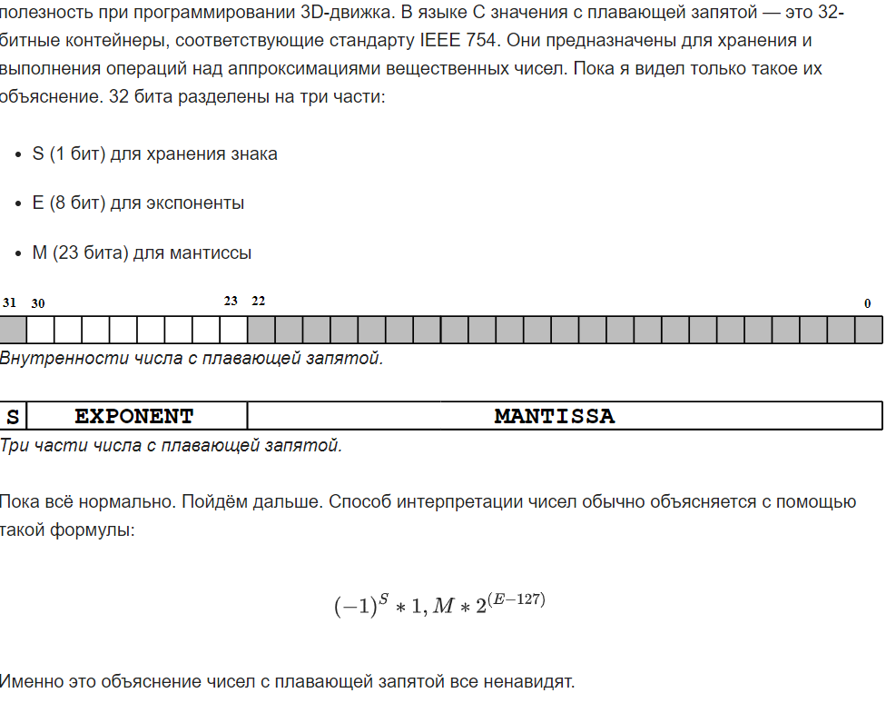
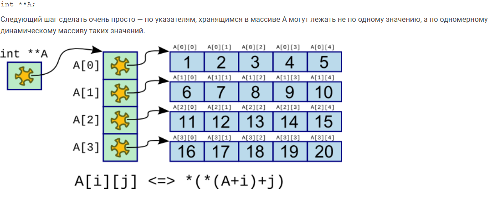
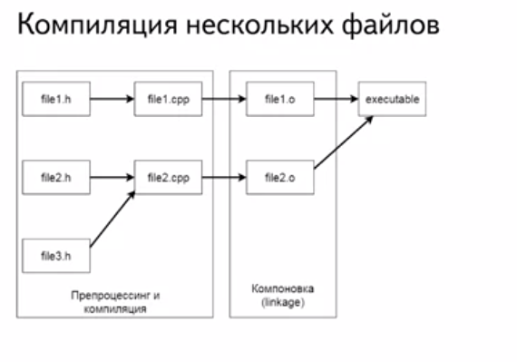

1)  **Встроенные типы данных. Представление чисел в памяти. Прямой,**
    **обратный и дополнительный код. Числа с плавающей точкой.**

```{=html}
<!-- -->
```
A)  ***Встроенные типы данных.***

Void(неполный тип, пустое множество значений), bool(true, false), int(+
модификаторы размера short \>= 16 бит, long \>= 32 бит, long long \>= 64
бит; модификаторы знака signed/unsigned), char(signed/unsigned,
wchar\_t, char8\_t, char16\_t, char32\_t). Floar(32 bit), double(64
bit), long double(80 bit).

Таким образом, все типы данных за исключением void могут быть разделены
на три группы: символьные (char, wchar\_t, char16\_t, char32\_t),
целочисленные (short, int, long, long long) и типы чисел с плавающей
точкой (float, double, long double).

B)  ***Представление чисел в памяти.***

В компьютере различаются два типа числовых величин: **целые числа и
вещественные числа**. Различаются способы их представления в памяти
компьютера. 

**Представление целых чисел**

**Часть памяти, в которой хранится одно число, будем называть ячейкой**.
Минимальный размер ячейки, в которой может храниться целое число,
--- **8 битов, или 1 байт**. Получим представление десятичного числа 25
в такой ячейке. Для этого нужно перевести число в двоичную систему
счисления. Мы должны вписать его в 8 разрядную ячейку

**Самый старший разряд --- первый слева --- хранит знак числа**. Если
число положительное, то в этом разряде ноль, если отрицательное ---
единица. Самому большому положительному целому числу соответствует
следующий код:

01111111

**Максимальное целое положительное число, помещающееся в 8-разрядную
ячейку, равно 127.**

Всякое вещественное число ***X*** можно записать в виде произведения
мантиссы ***m*** и основания системы счисления в некоторой целой
степени ***n***, которую называют порядком:

*X = m • р* ^n^.

Например, число 25,324 можно записать в таком виде: 0,25324 • 10^2^.
Здесь ***m*** = 0,25324 --- мантисса, ***n*** = 2 --- порядок. Порядок
указывает, на какое количество позиций и в каком направлении должна
сместиться десятичная запятая в мантиссе.

C)  ***Прямой, обратный и дополнительный код***

Выполнение арифметических операций над числами с разными знаками
представляется для аппаратной части довольно сложной процедурой. В этом
случае нужно определить большее по модулю число, произвести вычитание и
присвоить разности знак большего по модулю числа.\
Применение дополнительного кода позволяет выполнить операцию
алгебраического суммирования и вычитания на обычном сумматоре. При этом
не требуется определения модуля и знака числа.\
***Прямой код*** представляет собой одинаковое представление значимой
части числа для положительных и отрицательных чисел и отличается только
знаковым битом. В прямом коде число 0 имеет два представления «+0» и
«--0».\
***Обратный код*** для положительных чисел имеет тот же вид, что и
прямой код, а для отрицательных чисел образуется из прямого кода
положительного числа путем инвертирования всех значащих разрядов прямого
кода. В обратном коде число 0 также имеет два представления «+0» и
«--0».\
***Дополнительный код*** для положительных чисел имеет тот же вид, что и
прямой код, а для отрицательных чисел образуется путем прибавления 1 к
обратному коду. Добавление 1 к обратному коду числа 0 дает единое
представление числа 0 в дополнительном коде. Однако это приводит к
асимметрии диапазонов представления чисел относительно нуля. Так, в
восьмиразрядном представлении диапазон изменения чисел с учетом знака.

D)  ***Числа с плавающей точкой***

{width="5.842410323709537in"
height="4.633333333333334in"}

2)  **Хранение данных в памяти. Доступ к данным в памяти. Указатели.
    Операции с указателями.**

```{=html}
<!-- -->
```
A)  ***Хранение данных в памяти.***

При выполнении программы все ее данные хранятся в оперативной памяти
компьютера. Количество памяти, требуемой для экземпляров данных (в
байтах), и место их хранения зависит от используемого ими типа. При
выполнении программы для хранения данных используются два участка
оперативной памяти, которые называются *стеком* (stack) и *кучей*(heap).
На рис. 3.2 схематически показаны стек и куча и связь с ними переменных
программы.

**Стек (stack) -- **это линейный участок памяти (массив), который
действует как структура данных типа \"Последним пришел -- первым ушел\"
(last-in, first-out -- LIFO). Основной особенностью стека является то,
что данные могут добавляться только в вершину стека и удаляться из нее.
Добавление и удаление данных из произвольного места стека невозможно.
Операции по добавлению и удалению элементов из стека выполняются очень
быстро. Однако размер стека, как правило, ограничен, и время хранения
данных зависит от времени жизни переменной. Для всех локальных
переменных методов и передаваемых методам параметров память выделяется в
вершине стека. После того, как методы заканчивают работу, вся выделенная
память в стеке для их переменных автоматически освобождается.

{width="3.308333333333333in"
height="1.8833333333333333in"}

*Рис. 3.2. Использование в программе стека и кучи*

**Куча (heap) -- **это область оперативной памяти, в разных частях
которой могут выделяться участки для хранения объектов классов. В
отличие от стека, такие участки памяти в куче могут выделяться и
освобождаться в любом порядке. Хотя программа может хранить элементы
данных в куче, она не может явно удалять их из нее. Вместо этого
компонент среды CLR, называемый \"Сборщиком мусора\" (Garbage Collector,
GC), автоматически удаляет неиспользуемые участки кучи, когда он
определит, что код программы уже не имеет доступа к ним (не хранит их
адреса).

Локальные переменные методов хранятся следующим образом:

• *Значащие типы* хранятся только в одном участке памяти, который хранит
реальные данные и размещается в стеке.

• *Ссылочные типы* требуют два участка памяти: первый -- содержит
реальные данные (сами объекты) и всегда размещается в куче; второй --
размещается в стеке и содержит ссылку (адрес), которая указывает на
размещения объекта в куче.

Поля классов (переменные объектов рассмотрены в разд. 4.1) хранятся в
участке кучи, выделенном для конкретного объекта. При создании объекта
выделяется участок кучи, в котором и сохраняются все его данные (для
методов объекта память не выделяется).

B)  **Доступ к данным в памяти.**

> **?**

C)  **Указатели.** Указатели --- это с самого начала переменные, уже в
    которых хранится адрес других переменных.

Чтобы пользоваться указателями, вам нужно использовать два оператора:

\* --- показывает значение переменной по заданному адресу (показывает,
кто живет в этом номере). Если вы используете оператор \*,  то вы
занимаетесь операцией **разыменование указателя**.

& --- показывает адрес переменной (говорит, по какому адресу проживает
этот человек).

D)  **Операции с указателями**

*[Присваивание]{.underline}*

Указателю можно присвоить либо адрес объекта того же типа, либо значение
другого указателя.

*[Нулевые указатели]{.underline}*

Нулевой указатель (null pointer) - это указатель, который не указывает
ни на какой объект. Если мы не хотим, чтобы указатель указывал на
какой-то конкретный адрес, то можно присвоить ему условное нулевое
значение. Для создания нулевого указателя можно применять различные
способы(0, NULL, NullPtr).

*[Ссылки на указатели]{.underline}*

Так как ссылка не является объектом, то нельзя определить указатель на
ссылку, однако можно определить ссылку на указатель. Через подобную
ссылку можно изменять значение, на которое указывает указатель или
изменять адрес самого указателя.

*[Разыменование указателя]{.underline}*

Операция разыменования указателя представляет выражение в
виде \*имя\_указателя. Эта операция позволяет получить объект по адресу,
который хранится в указателе.

*[Адрес указателя]{.underline}*

Указатель хранит адрес переменной, и по этому адресу мы можем получить
значение этой переменной. Но кроме того, указатель, как и любая
переменная, сам имеет адрес, по которому он располагается в памяти. Этот
адрес можно получить также через операцию **&**.

*[Операции сравнения]{.underline}*

К указателям могут применяться операции
сравнения **\>**, **\>=**, **\<**, **\<=**,**==**, **!=**. Операции
сравнения применяются только к указателям одного типа и к
значениям **NULL** и **nullptr**.

*[Приведение типов]{.underline}*

Иногда требуется присвоить указателю одного типа значение указателя
другого типа. В этом случае следует выполнить операцию приведения типов
с помощью операции (тип\_указателя \*).

3)  **Массивы. Объявление и инициализация. Устройство в памяти. Операции
    над массивами. Двумерные массивы. Арифметика указателей.**

```{=html}
<!-- -->
```
A)  **Массивы.** Массив - линейный участок памяти, используемый для
    хранения набора объектов. Статические массивы имеют заранее
    известный размер, могут быть заранее инициализированы (n-мерные
    мерные хранятся в памяти линейно, неразрывно). Динамические массивы
    реализуются посредством динамического выделения памяти, n-мерные
    мерные реализуются посредством указателя на указатель.

B)  **Объявление и инициализация.** Можно сразу же его объявить и
    инициализировать через {}. Размер задается через \[\]. Либо можно по
    отдельности в каждому элементу потом присвоить свое значение. Для
    динамического массива используем new int\[размер\].

C)  **Устройство в памяти.** Массив представляется цельным куском
    памяти, размер которого вычисляется по формуле \"количество
    элементов \* количество памяти под каждый элемент\". В каждой ячейке
    памяти хранится значение массива. При динамическом массиве размер мы
    можем изменять входе программы, возможна утечка памяти поэтому нужно
    удалять эту поеботу.

D)  **Операции над массивами.** Вычисление суммы всех
    элементов(произведения итд), поиск максимального и минимального
    элемента, разного вида сортировки(Bubble, merge, quick итд),
    удаление элемента из массива.

E)  **Двумерные массивы.** Двумерный массив -- это прямоугольная таблица
    с определенным количеством строк и столбиков.  Каждая строка и
    каждый столбик имеют свой порядковый номер.

{width="4.433333333333334in"
height="1.876169072615923in"}

F)  **Арифметика указателей.** Позволяет получать произвольный доступ к
    элементам массива, зная его начало и границы arr\[10\] \*(arr + 1).
    Инкремент перекидывает тебя на другой участок памяти(в случае int +
    4 байта), инкремент в обратную сторону.

```{=html}
<!-- -->
```
4)  **Ссылки. Разница между ссылкой и указателем. Зачем в C++ были
    добавлены ссылки.**

```{=html}
<!-- -->
```
A)  **Ссылки.** Ссылки -- особый тип данных, являющийся скрытой формой
    указателя, который при использовании автоматически разыменовывается.
    Объявляется как &, должна указывать на что-либо.

B)  **Разница между ссылкой и указателем.** Указатель может быть
    переназначен любое количество раз, в то время как ссылка после
    привязки не может быть перемещена на другую ячейку памяти. Указатели
    могут указывать в никуда(NULL, nullptr), в то время как ссылка
    всегда указывает на определенный объект. Нельзя получить адрес
    ссылки. Не существует арифметический ссылок, в то время как
    существует арифметика указателя.

C)  **Зачем в C++ были добавлены ссылки.** Реализация таких методов как
    оператор присваивания, копирующий конструктор(передача объекта по
    ссылке), создание псевдонимов переменных, безопасность.

```{=html}
<!-- -->
```
5)  **Сборка программ. Препроцессор, компилятор, компоновщик. Сборка
    проекта состоящего из нескольких файлов. Макросы.**

```{=html}
<!-- -->
```
A)  **Сборка программ.** Будем использовать компилятор g++. В нем у нас
    есть cpp -- препроцессор, as -- ассемблер, g++ - сам компилятор, ld
    -- линкер.

B)  **Препроцессор, компилятор и компоновщик.** Препроцессор -- это
    макро процессор, который преобразовывает вашу программу для
    дальнейшего компилирования. На данной стадии происходит работа с
    препроцессорными директивами. Например, препроцессор добавляет
    хэддеры в код(\#include), убирает комментирования, заменяет
    макросы(\#define) их значениями, выбирает нужные куски кода в
    соответствии с условиями \#if(если константное выражение
    выполняется, то код компилируется до \#endif), \#ifdef(если имя
    макроса определено ранее в операторе \#define, то последовательность
    операторов будет компилироваться до \#endif), \#ifndef(наоборот).
    Компилятор на данном шаге выполняет свою главную задачу --
    компилирует, то есть преобразует полученное на прошлом шаге код без
    директив в ассемблерный код(это доступное понимание человеком
    представление машинного кода). Потом ассемблер преобразовывает
    ассемблерный код в машинный код, сохраняя его в объектном
    файле(промежуточный файл, хранящий кусок машинного кода). После
    компоновщик связывает все объектные файлы и статические библиотеки в
    единый исполняемый файл, который мы и сможем запустить в дальнейшем.
    Последний этап -- вызвать загрузчик для загрузки программы в память.

C)  **Сборка проекта состоящего из нескольких файлов.** Зависит от
    расширения файла. Либо h, cpp.(.o -- объектный файл). При сборке
    проекта компилируются только измененные cpp-файлы. Внесение
    изменений в h-файл, приводит к перекомпиляции всех cpp-файлов, в
    которые он включен. Если перенести определения функции и методов
    классов в cpp-файлы, то они будут пересобираться только после
    изменений.

{width="3.816666666666667in"
height="2.671666666666667in"}

D)  **Макросы.** Макросы -- это препроцессорные "функции", т.е. лексемы,
    созданные с помощью директивы \#define, которые принимают параметры
    подобно функциям. После директивы \#define указывается имя макроса,
    за которым в скобках параметры, отделенные запятыми и определение
    макроса, отделенное пробелом. Есть несколько проблем: макросы нельзя
    отлаживать, при разворачивании макроса могут появиться странные
    побочные эффекты, макросы не имеют пространства имен, макросы могут
    делать что-то, о чем Вы не подозреваете(все их можно решить).

```{=html}
<!-- -->
```
6)  **Запуск программ.** **Процессы и потоки. Виды памяти. Стек вызова
    функций.**

```{=html}
<!-- -->
```
A)  **Запуск программ.**

B)  **Процессы и потоки.**

C)  **Виды памяти.**

D)  **Стек вызова функций.**

```{=html}
<!-- -->
```
7)  **ООП. Базовые принципы. Абстракция, инкапсуляция, наследование,
    полиморфизм. Принцип подстановки Барбары-Лисков.**

```{=html}
<!-- -->
```
A)  **Базовые принципы.** Это основа основ. 4 главные особенности,
    которые вместе образуют парадигму ООП.

B)  **Абстракция.** Придание объекту характеристик, которые четко
    определяют его концептуальные границы, отличая от всех других
    объектов. Абстракция означает выделение главных, наиболее значимых
    характеристик предмета и наоборот -- отбрасывание второстепенных,
    незначительных. (класс работник, важно его ФИО, дата рождения итд,
    но не важен рост, цвет глаз и волос, информация о сотруднике ни к
    чему).

C)  **Инкапсуляция.** Механизм языка, позволяющий ограничить доступ
    одних компонентов программы к другим. Инкапсуляция означает
    ограничение доступа к данным и возможностям их изменения(у меня есть
    ФИО, все его знают, но у них нет доступа к изменению моего ФИО).

D)  **Наследование.** Позволяет описать новый класс на основе
    существующего с частично или полностью заимствующейся
    функциональностью.

E)  **Полиморфизм.** Свойство системы, позволяющее использовать объекты
    с одинаковым интерфейсов без информации о типе и внутренней
    структуре объекта(есть новости, объявления и статьи, они в чем-то
    похожи и в чем-то нет(абстрактный класс)).

F)  **Принцип подстановки Барбары-Лисков.** Наследующий класс должен
    дополнять, а не замещать поведение базового класса. Если у нас есть
    не виртуальный класс А и отнаследованный от него класс B, то если мы
    заменим все использования класса A на B, ничего не должно измениться
    в работе программы. Ведь класс B всего лишь расширяет функционал
    класса A. Если эта проверка работает, то программа соответствует
    принципу подстановки Лисков. Если нет, то стоит задуматься: "а
    правильно ли спроектированы классы?".

```{=html}
<!-- -->
```
8)  **ООП. Классы. Устройство в памяти. Инкапсуляция. Модификаторы
    доступа. Наследование. Множественное наследование. Проблемы
    множественного наследования.**

```{=html}
<!-- -->
```
A)  **Классы.** Это универсальный, комплексный тип данных, состоящий из
    тематически единого набора "полей"(переменный более элементарных
    типов) и "методов"(функций для работы с этими полями), то есть он
    является моделью информационной сущности с внутренним и внешним
    интерфейсами для оперирования своим содержимым(значениями полей).

B)  **Устройство в памяти.** При компиляции выполняется расчет объема
    памяти, который необходимо будет выделить на стеке под объект,
    исходя из полей (\"формирование стека\"). Ф-ции компилируются как
    обычно и лежат отдельно. Но во время компиляции им передается
    указатель this, благодаря чему они могут оперировать с полями класса
    без ошибок. Их можно вызвать только через объект (про статические не
    говорим), так как написанные ф-ции входят в обл-ть видимости класса,
    то есть они как бы \"локальные\". При линковке происходит разрешение
    имен: вместо имени объекта ставится адрес, а уже относительно него
    рассчитываются адреса полей этого исходя из их типов. И, конечно,
    навешиваются адреса на ф-ции.

C)  **Модификаторы доступа.** Private, public, protected (ты умный все
    знаешь сам).

D)  **Наследование.** Прошлый вопрос.

E)  **Множественное наследование.** Оно позволяет порожденному классу
    наследовать элементы более, чем от одного базового класса (class A :
    public X, public Y, public Z).

F)  **Проблемы множественного наследования.**
    <http://www.amse.ru/courses/cpp1/2010.05.14.html> тут вся хуйня

```{=html}
<!-- -->
```
9)  **ООП. Классы. Инициализация и уничтожение. Виды конструкторов.
    Виртуальные методы. Таблица виртуальных функций. Виртуальные
    деструкторы.**

```{=html}
<!-- -->
```
A)  **Классы.** Прошлый вопрос.

B)  **Инициализация и уничтожение.** Инициализировать можно сетерами или
    же конструктором класса. Конструкторов разное количество, сетеры же
    просто функции меняющие поля классов. Уничтожение происходит после
    завершения программы в main(return 0). После этого вызываются
    деструкторы, удаляющие объекты каждого класса.

C)  **Виды конструкторов.** Конструктор -- это особый тип метода класса,
    который автоматический вызывается при создании объекта этого класса.
    Конструктор по умолчанию(не имеет параметров), конструктор с
    параметрами(имеет параметры), конструктор копирования(создание
    реальных копий объектов класса A(const &obj){})

D)  **Виртуальные методы.** Метод класса, который может быть
    переопределен в классах-наследниках. Чистая виртуальная функция --
    это метод класса, тело которого не определено (virtual void foo() =
    0).

E)  **Таблица виртуальных функций.** <https://habr.com/ru/post/51229/>

F)  **Виртуальные деструкторы.** У нас есть 2 класса А и B (работаем в
    них с динамической памятью, создаем конструктор и деструктор, B
    наследник А). Если у нас в программе идет работа с динам памятью
    (выделяем A\* ptr = new B, потом в main delete ptr), то у нас не
    вызовется деструктор класса B (останется висеть, утечка памяти),
    надо сделать деструктор класса A виртуальным, а в B переопределить
    его.

```{=html}
<!-- -->
```
10) **ООП. Операторы. Перегрузка операторов.**

```{=html}
<!-- -->
```
A)  **Операторы.** Бывают арифметические(+, - \*, /, %, ++, \--),
    реляционные(==, =, \>. \<, \>=, \<=), логические(&&, \|\|, !),
    побитовые (&, \|, \^, \~, \<\<, \>\>) операторы, а также операторы
    присваивания(=, += итд) и другие.

B)  **Перегрузка операторов.** Перегрузка операторов это некоторое
    переопределение их функционала, то есть мы не можем просто сложить
    два объекта, нужно перегрузить оператор. Синтаксис же выглядит как
    (ТИП) operator (перегружаемый оператор) (принимаемые значения(обычно
    const A& other)).

```{=html}
<!-- -->
```
11) **Исключения. Обработка ошибок в Си. Assert. Исключения.
    Преимущества и недостатки исключений.**

```{=html}
<!-- -->
```
A)  **Исключения.** Исключение -- это некое действие, которое вступает в
    силу, при наступлении нестандартной ситуации.

B)  **Обработка ошибок в Си.** В C++ это все обрабатывается с помощью
    команд try, throw и catch. Try пробует, если что-то не так мы
    бросаем исключение. Потом ловим его и выводим сообщение о ошибке.
    Также можно сделать свой класс исключений, унаследовав его от
    стандартного класса исключений (class MyExceptinon:public
    std::exception, конструктор: MyExceptinon(const char\*
    msg):std::exception(msg)). Тогда мы уже будем бросать класс наших
    исключений и передавать туда сообщение о ошибке. И ловим мы тот же
    класс исключений. С помощью встроенного функционала (.what) выводим
    какая именно ошибка произошла.

C)  **Assert.** Это специальная конструкция, позволяющая проверять
    предположения о произвольных данных в произвольном месте программы.
    Она может автоматически сигнализировать при обнаружении некорректных
    данных (приводит к аварийному завершению программы с указанием места
    обнаружения некорректных данных). Assert позволяет отлавливать
    ошибки в программах на этапе компиляции либо во время исполнения.

D)  **Преимущества и недостатки исключений. + :** Исключения отделяют
    код обработки ошибок от нормального алгоритма программы, тем самым
    повышая разборчивость, надежность и расширяемость кода. Это
    единственный чистый способ сообщить об ошибке из конструктора.
    Исключения трудно игнорировать. Исключения легко передаются из
    глубоко вложенных функций. Исключения являются определяемыми
    пользователем типами. - : Исключения нарушают структуру кода.
    Исключения легко вызывают утечки ресурсов. Трудно писать код
    исключений. Они дорогостоящие. Их тяжело внести в устаревший код.
    Неверно используются для выполнения задач, относящихся к нормальному
    алгоритму программы.

```{=html}
<!-- -->
```
12) **Шаблоны. Шаблоны функций и классов. Частичная специализация.**

```{=html}
<!-- -->
```
A)  **Шаблоны.** Это когда мы пишем код с полиморфным поведением, но
    само поведение определяется на этапе компиляции -- т.е. в противовес
    полиморфизму виртуальных функций, полученный бинарный код уже будет
    иметь постоянное поведение. Мы используем шаблоны для красоты
    (компактный, понятный и быстрый код).

B)  **Шаблоны функций и классов.** Шаблоны функций -- это функции,
    которые служат образцом для создания других подобных функций.
    Главная идея -- создание функций без указания точного типа некоторых
    или всех переменных(template \<TypeName T\>). Вместо этого мы
    определяем функцию, указывая тип параметра шаблона, который
    используется вместо любого типа данных. Шаблоны классов тоже самое
    только это не функция, а класс(только если мы хотим передавать в
    качестве пользовательского типа array -- класс описывающий массив,
    то мы должны написать template\<class T\>).

C)  **Частичная специализация.** Есть полная реализация шаблона, но она
    является костылем(сначала все параметры шаблона должны быть явно
    определены, но потом возникает другая проблема: мы должны явно
    указывать длину передаваемого массива, но это не эффективно).
    Частичная специализация шаблона позволяет выполнить специализацию
    шаблона класса (но не функции), где некоторые, но не все параметры
    шаблона явно определены(функция print должен работать с array(класс)
    типа char, но при этом размер массива не являлся фиксированным
    значением и мог варьироваться).
    <https://ravesli.com/urok-179-chastichnaya-spetsializatsiya-shablona/>

```{=html}
<!-- -->
```
13) **Variadic template.** <https://habr.com/ru/post/228031/>

14) **Стандартная библиотека.** **Итераторы. Алгоритмы. Основные классы
    алгоритмов**

```{=html}
<!-- -->
```
A)  **Стандартная библиотека.** Стандартные C++ библиотеки представляют
    собой набор функций, констант, классов, объектов и шаблонов, которые
    расширяют язык C++, предоставляя базовую функциональность для
    выполнения различных задач, таких как: классы для взаимодействия с
    операционной системой, контейнеры данных, манипуляторы для работы с
    этими данными и наиболее используемые алгоритмы. STL состоит из:
    контейнеров, итераторов, алгоритмов, адаптеров, функциональных
    объектов.

B)  **Итераторы.** Итератор -- это такая структура данных, которая
    используется для обращения к определенному элементу в контейнерах
    STL. Обычно их используют с контейнерами set, list, а у вектора для
    этого применяют индексы. Подключаем библиотеку iterator.
    \<контейнер\> \<его тип\> :: iterator \<имя итератора\>. Категории:
    входные(operator !=, ++iterator, iterator++, value = \*iterator,
    operator==, O(1)), выходные(\*iterator = value, ++iterator,
    iterator++, O(1)), однонаправленные(входной итератор, выходной
    итератор, сохранение для последующего использования),
    двунаправленные(однонаправленный, operator\--), произвольного
    доступа(двунаправленный итератор, достижение любой позиции за
    O(1)).<https://codelessons.ru/cplusplus/iteratory-v-c-vvedenie.html>

C)  **Алгоритмы.** В заголовочном файле algorithm определены функции для
    различных целей (н-р, поиска, сортировки, подсчета,
    манипулирования), оперирующие над диапазонами элементов. Обратите
    внимание, что диапазон определяется как \[first, last),
    где last относится к элементу, *следующему за* последним
    просматриваемым или изменяемым элементом.

D)  **Основные классы алгоритмов.** Find, Max, Merge, Replace, Sort...

```{=html}
<!-- -->
```
15) **Стандартная библиотека. Контейнеры. Последовательные контейнеры.**

```{=html}
<!-- -->
```
A)  **Стандартная библиотека.** Прошлый вопрос.

B)  **Контейнеры.** Библиотека контейнеров является универсальной
    коллекцией шаблонов классов и алгоритмов, позволяющий программистам
    легко реализовать общие структуры данных, такие как очереди, списки
    и стеки. Существует 3 вида контейнеров: последовательные,
    ассоциативные и неупорядоченные ассоциативные контейнеры.

C)  **Последовательные контейнеры.** Последовательные контейнеры
    реализуют структуры данных с возможностью последовательного доступа
    к ним (array, vector, deque(двусторонняя очередь),
    forward\_list(односвязный список), list(двусвязный список)).

```{=html}
<!-- -->
```
16) **Стандартная библиотека. Контейнеры. Ассоциативные контейнеры.**

```{=html}
<!-- -->
```
A)  **Стандартная библиотека.** Прошлый вопрос.

B)  **Контейнеры.** Прошлый вопрос.

C)  **Ассоциативные контейнеры.** Ассоциативные контейнеры реализуют
    упорядоченные структуры данных с возможностью быстрого поиска ( со
    сложностью O(log n)). Set(коллекция уникальных ключей,
    отсортированная по ключам), map(коллекция пар ключ-значение,
    отсортированная по ключам, ключи являются уникальными),
    multiset(коллекция ключей, отсортированная по ключам) и
    multimap(коллекция пар ключ-значение, отсортированная по ключам).

```{=html}
<!-- -->
```
17) **Стандартная библиотека. Адаптеры.**

```{=html}
<!-- -->
```
A)  **Стандартная библиотека.** Прошлый вопрос.

B)  **Адаптеры.** <https://purecodecpp.com/archives/3717>

```{=html}
<!-- -->
```
18) **Умные указатели. Устройство, преимущества и недостатки.**

```{=html}
<!-- -->
```
A)  **Smart pointer** --- это объект, работать с которым можно как с
    обычным указателем, но при этом, в отличии от последнего, он
    предоставляет некоторый дополнительный функционал (например,
    автоматическое освобождение закрепленной за указателем области
    памяти).

B)  **Auto ptr**. <https://habr.com/ru/post/140222/>

C)  **Shared\_ptr**. <https://habr.com/ru/post/140222/>
    <http://archive.kalnytskyi.com/2011/11/02/smart-pointers-in-cpp11/>

D)  **Weack\_ptr.**
    <http://archive.kalnytskyi.com/2011/11/02/smart-pointers-in-cpp11/>
