 Полезные ссылки
===============

[[https://drive.google.com/drive/folders/1-7hDKd-Te3lNvOBPXt4JqypTDbbJc6HK]{.underline}](https://drive.google.com/drive/folders/1-7hDKd-Te3lNvOBPXt4JqypTDbbJc6HK)

[[https://docs.google.com/document/d/1uqpWTYiywQ\_nnGX92bhmvGprindNDWj5Str0rdOJlyo/edit]{.underline}](https://docs.google.com/document/d/1uqpWTYiywQ_nnGX92bhmvGprindNDWj5Str0rdOJlyo/edit)

Список вопросов
===============

1. Объекты управления в процессе разработки программного обеспечения
--------------------------------------------------------------------

Ссылки: [[ТРПО-1, Слайд
8]{.underline}](https://docs.google.com/presentation/d/1o4ST4LV9QRreLCVrc2_s--EDqOgnssO0/edit#slide=id.p8)

Автор: Шевелев

-   **Требования / ТЗ\
    > **Требования необходимы для четкого понимания того, каким должен
    > быть итоговый продукт

-   **Ресурсы\
    > **В ресурсы входит и имеющаяся техника, и ПО, и время сотрудников.
    > Этим необходимо управлять для более эффективного выполнения задач.

-   **Архитектура / технологии\
    > **Используемый стек и архитектурные решения, с помощью которых
    > будет реализовываться ПО. Необходимо выбирать правильный стек и
    > формировать архитектуру с учетом особенностей продукта, поскольку
    > правильный выбор повышает эффективность системы

-   **Разработка, тестирование, внедрение и сопровождение,
    > документирование\
    > **Не думаю, что стоит пояснять что это и зачем этим управлять
    > (хотя я ваще хз, что из всего списка нужно было пояснять)))

-   **Коммуникации\
    > **Способы общения между всеми людьми, относящимися к проекту. Это
    > и заказчик, и менеджеры, и непосредственно разработчики и т.д.
    > Управление коммуникациями позволяет наладить процесс общения и
    > обмена информацией.

-   **Жизненный цикл\
    > **Процесс от зарождения идеи до окончания сопровождения системы.
    > Его необходимо контролировать, чтобы не пропустить какой-либо шаг,
    > что может привести к большому количеству проблем в результате.

-   **Бюджет\
    > **Количество денежных средств, имеющихся для реализации продукта.
    > Бюджет может расходоваться на заработные платы сотрудникам,
    > покупку необходимой техники или ПО. Необходимо учитывать этот
    > параметр, чтобы не выйти за его рамки и не оказаться без денежных
    > средств на необходимые для реализации вещи.

2. Проблемы (сложности для управления) и их причины в современной индустрии программного обеспечения
----------------------------------------------------------------------------------------------------

Ссылки:

1.  [[ТРПО-1, слайд
    > №9-11]{.underline}](https://docs.google.com/presentation/d/1o4ST4LV9QRreLCVrc2_s--EDqOgnssO0/edit#slide=id.p9);

2.  [[Value, Meaning and Engagement: The 3 pillars of great experienc
    > (начало
    > статьи)]{.underline}](https://medium.com/@NathanKinch/value-meaning-and-engagement-the-3-pillars-of-great-experience-51ac6fa53570)

Автор: Залкин В.

Сложности для управления:

-   **Сложность (техническая и архитектурная) программных продуктов**\
    > Разрабатываемые в настоящее время программные решения являются
    > многомодульными комплексами, для которых нужно придумать общую
    > архитектуру и конкретную реализацию каждого из компонентов.
    > которые может разрабатывать несколько команд разработчиков. К
    > таким сложным решениям относятся: ERP-системы, системы принятия
    > решений, системы для досуга, системы автоматизации процессов.
    > Такие системы могут разрабатываться несколькими командами
    > разработчиков, которыми нужно управлять.

-   **Необходима экспертиза в различных областях\
    > **Для того, чтобы написать программный продукт для определённой
    > сферы деятельности, необходимы эксперты из этой сферы, которые
    > скажут как выглядят их бизнес-процессы, чтобы разработчики могли
    > эти процессы автоматизировать. Также нужны специалисты из IT
    > сферы, помимо, разработчиков: тестировщики, DevOps-специалисты,
    > сис. админы.

-   **Высокая конкуренция на рынке программного обеспечения\
    > **В последнее время рынок IT является одним из наиболее активно
    > развивающихся. Появляются новые компании, которые предлагают свои
    > программные решения для различных сфер деятельности, что и ведёт к
    > повышению уровня конкуренции. Для того, чтобы быть
    > конкурентоспособным, нужно делать востребованные и качественные
    > продукты.

-   **Быстрые изменения внешней среды и потребностей пользователей\
    > **Если программный продукт разрабатывается не для военной отрасли
    > или другой такой, где процессы достаточно стабильны и
    > регламентированы, то его неизбежно ждут сложности, связанные с
    > изменениями потребностей пользователей, которые вызываются, в том
    > числе, изменениями в окружающем мире. Если проект не будет
    > реагировать на изменения, то в скором времени может оказаться
    > никому не нужен и досрочно завершится.

Стандартные методологии управления (Agile, Waterfall и т.д.) проектами
не отвечают на вопрос: что делать при значительных изменениях в проекте:
изменения в законах, неправильный изначальный анализ рынка, изменения в
фундаменте проекта и т.д. Поэтому решения в таких ситуациях принимаются
индивидуально на основе опыта и знаний управляющего проектом.

Не относится напрямую к вопросу, но, возможно, будет полезно:

*Управление должно быть построено на трёх понятиях:*

-   ***Value** --- ценность.\
    > Управление приносит практическую пользу --- помогает достичь
    > результата.*

-   ***Meaning** --- значимость.\
    > Управление поддерживает управляемых эмоционально.*

-   ***Engagement** --- вовлечённость.\
    > Участники процесса эмоционально вовлечены в него. Если управление
    > слишком формализовано, то вовлечённость страдает.*

*Описанными выше понятиями часто оценивают отношение клиента к
продукту.*

3. Требования к процессу разработки программного обеспечения (РПО)
------------------------------------------------------------------

Ссылки: Лекция 1, слайды 12-13

Автор: Егоров О.

-   **Координация** распределенных групп разноплановых специалистов.

-   **Планирование** и прогнозирование течения процесса разработки.

-   **Прозрачность** для всех участников процесса (заинтересованных
    > лиц).

-   **Оценка**. Доступны средства оценки содержания, качества, сроков и
    > затраченных средств.

-   **Управление рисками**. Есть средства прогнозирования
    > неблагоприятных изменений в будущем и предотвращения их.

-   **Управляемость** содержания конечного результата в зависимости от
    > внешних изменений.

4. Основные подходы к управлению РПО
------------------------------------

Ссылки: Лекция 1, слайд 14 (более подробно подходы расписаны в вопросах
5-7 ниже, соответствующие 15-25 слайдам).

Автор: Зеновская Ю.М.

Основные подходы:

1\. **Водопадная модель** --- разработка разбивается на этапы по
содержанию работ:

-   выделяются этапы работ, исходя из содержания деятельности

-   проектирование

-   планирование

-   осуществление разработки

-   приемка

-   испытания и внедрение

-   сопровождение

2\. **Итерационный процесс** --- разработка осуществляется итерациями по
результату:

-   работа разделяется на этапы, исходя из содержания результата

-   на каждом этапе осуществляются все виды работ, меняются акценты:

    -   проектирование-планирование на начальных стадиях

    -   Quality Assurance на завершающих

    -   менеджмент процесса постоянно, в больших объемах

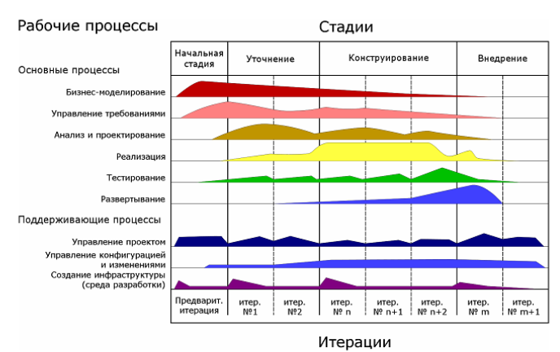

3\. **Гибкие технологии разработки (agile)** --- разработка обеспечивает
плавное эволюционное развитие системы при постоянном наличии
законченного решения:

-   работа разделяется на небольшие итерации (2 недели - 1 месяц)

-   разделение специалистов по функциям максимально нивелируется

-   на каждом этапе осуществляются все виды работ, каждый этап дает
    > законченный результат

-   цель этапа (требования к результату) фиксируется непосредственно
    > перед началом этапа

1. Управление РПО в водопадной модели -- особенности, применимость
------------------------------------------------------------------

Ссылки: Презентация 1 слайды 15-17

[[https://habr.com/ru/company/edison/blog/269789/]{.underline}](https://habr.com/ru/company/edison/blog/269789/)
- тут можно просто почитать про модели

Автор: Шараева К.В.

В водопадной модели каждый следующий этап разработки начинается только
после успешного завершения предыдущего. Если на каком-то этапе требуются
изменения на предыдущих стадиях, то все начинается сначала.

Плюсы

-   На ранних стадиях есть полное видение ожидаемого результата

-   Понятно содержание, сроки, необходимые ресурсы, инвестиции.

-   Участие специалистов различного профиля разделено во времени

-   Процесс хорошо формализуем и не требует высоких навыков управления

Минусы

-   Любое изменение обесценивает все предыдущие работы.

-   Получение результата далеко отстоит по времени от постановки задачи.

-   Результат чувствителен к рискам -- реакция на изменения внешней
    > среды не заложена в процесс.

Водопадную модель разработки можно применить в следующих случаях:

-   Требования известны, понятны и зафиксированы. В процессе много
    > формальных и неизменных ограничений (законодательных, технических,
    > ресурсных и т.п.). Противоречивых требований не имеется.

-   Необходимость заложить основу для длительного развития (создание
    > программной платформы, ОС)

-   Создание процесса массового производства (конвейерное производство).

-   Реализация системы с высокой защитой от рисков (системы
    > безопасности, управление особыми объектами и т.п.).

-   В маленьких проектах

6. Управление РПО в итерационной модели -- особенности, применимость
--------------------------------------------------------------------

Работа разделяется на этапы по содержанию результата.

На каждом этапе осуществляются все виды работ, меняются акценты:

-   Проектирование-планирование -- на начальных стадиях

-   Quality Assurance - на завершающих

-   Менеджмент процесса -- постоянно, в больших объемах.

Плюсы

-   Результат достигается последовательным приближением, обеспечивается
    > оценка и корректировка содержания.

-   Процесс неплохо формализуем и широко применим.

-   Имеется возможность реакции на события внешней среды.

-   Процесс применяется крупными игроками рынка производства ПО (RUP,
    > MSF, Motorola, SixSigma и т.п.).

Минусы

-   Требуется постоянное участие специалистов всех профилей.

-   Менеджмент представляет собой нетривиальную, сложную и трудоемкую
    > задачу.

-   Имеется доля неопределенности в треугольнике
    > «содержание-время-инвестиции».

-   Высокие накладные расходы на управление.

Применимость

-   Создание уникальных крупных систем, обладающих перспективой
    > развития.

-   Производство продуктовых линий (коробочных продуктов).

-   Сопряжение процесса производства ПО и экономической деятельности
    > фирмы.

-   Компромисс между управляемостью и адаптивностью.

Ссылки: Лекция 1, слайды 18-21

Автор: Пчелкин

7. Управление РПО в гибких моделях -- особенности, применимость
---------------------------------------------------------------

Ссылки: Презентация 1 слайды 22-25

Автор: Шараева К.В.

В данной модели управления работа разделяется на небольшие итерации (2
нед. -- 1 мес.), в течение каждой из которых реализуются отобранные
задачи из бэклога. На каждом этапе осуществляются все виды работ, каждый
этап дает законченный результат.

*Плюсы*

-   Обновление системы происходит практически постоянно, непрерывно.
    > Всегда есть готовая «свежая версия».

-   Адаптивность к внешним изменениям очень высока.

-   Накладные расходы на управление серьезно снижены.

-   Акцентируется «командность» работы -- общая вовлеченность и
    > самоорганизация.

-   Прозрачность текущего состояния системы, непрерывность оценки
    > содержания результата.

*Минусы*

-   Низкая управляемость в долгосрочной перспективе.

-   Необходимость обеспечивать рефакторинг и реинжиниринг.

-   Крайне трудно создать «с нуля» крупную систему.

*Применимость*

-   Разработка небольших уникальных проектов.

-   Создание систем, ориентированных на высококонкурентный рынок.

-   Реализация очень крупных проектов.

-   Способ организации работ в высокопрофессиональных коллективах.

8. Роль заказчика в процессах РПО, правила построения коммуникации с ним, сложности.
------------------------------------------------------------------------------------

-   Обеспечивает жизнь проекту - Оплачивает банкет. Не было бы
    > заказчика - не было бы и проекта

-   Использует результат как инструмент - Проект - способ улучшения
    > бизнеса.

-   Ценит то, что помогает ему делать свой бизнес - Интересует только
    > его проект.

-   Требует гарантий - Заказчик хочет быть уверен, что получит именно
    > то, что он хочет и в обговоренные сроки =\> необходимо формально
    > закрепить.

-   Может менять постановку задачи - Бизнес заказчика меняется =\>
    > меняются и требования.

-   Знает предметную область лучше - Заказчик работает в этой области.

Ссылки: Лекция 1, слайд 26

-   Роль заказчика в процессах РПО.\
    > Заказчик - главное заинтересованное лицо =\> эффективная
    > коммуникация с заказчиком повышает вероятность успешного
    > завершения проекта. (Если организовать коммуникацию с заказчиком
    > неправильно (неэффективно) и(или) мало, то по завершению проекта
    > можно услышать от заказчика, что это совсем не то, что он ожидал).

-   Правила построения коммуникации с ним.\
    > Для предотвращения разногласий с заказчиком необходимо составить
    > формальные требования к процессу коммуникации, например:

    -   Формат, содержание, уровень детализации передаваемой информации.

    -   ФИО, должность сотрудников, ответственных за передачу/получение
        > информации.

    -   Способы передачи информации.

    -   Частота коммуникации.

    -   Глоссарий терминов.

> Также необходимо обговорить формат / период оповещения заказчика о
> ходе выполнения проекта. Например каждую неделю / после выполнения
> фичи. Формат в виде презентации или просто оповещение и т.д.\
> Так как требования к проекту по мере его выполнения могут меняться,
> необходимо формализовать процесс их рассмотрения / принятия.

-   Сложности.\
    > Сложности заключаются в том, что коммуникация включает в себя
    > разные аспекты (психологический (процессы формирования идей и
    > восприятия информации человеком), социальный (роль и место
    > коммуникации) и др.). Для эффективной коммуникации надо учитывать
    > их все. Цель коммуникации = передача информации =\> Если процесс
    > передачи информации эффективен, то эффективен и процесс
    > коммуникации.

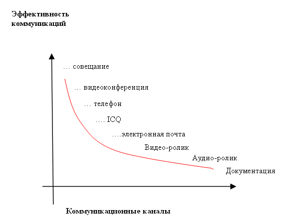

Проблемы могут быть связаны с неоднозначным пониманием информации
(непонимание терминов, сленга заказчика) решение - составление
глоссария.

\*Только основное, без воды

Ссылки:
[[http://journal.itmane.ru/node/312]{.underline}](http://journal.itmane.ru/node/312)

Автор: Егоров О.

1. Этапы создания продукта -- ценность и результат.
---------------------------------------------------

Обычно выделяют восемь этапов создания продукта:

-   генерация идей;

-   отбор идей;

-   разработка концепции и ее проверка;

-   разработка маркетинговой стратегии;

-   анализ бизнеса;

-   разработка непосредственно продукта;

-   пробный маркетинг;

-   коммерческое производство.

1)  **Генерация идей** --- систематический поиск идей о новых продуктах.
    > Поиск новых идей осуществляется главным образом на основе
    > внутренних источников организации (в отделе новой техники, в
    > службе НИОКР, в отделе маркетинга и сбыта и т. п.), изучения
    > мнений потребителей, конкурентов, поставщиков и дистрибьюторов,
    > консультационных организаций, работы выставок и различных печатных
    > изданий, путем использования специальных методов генерации идей.

2)  **Отбор идей** --- анализ всех выдвинутых идей о новом продукте с
    > целью отсеивания неперспективных на наиболее ранней стадии
    > разработки. В результате отбираются идеи о возможном продукте,
    > который организация может предложить рынку.
    > 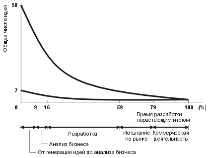

> Как видно из рисунка, со временем и ходом остальных этапов создания
> многие идеи отсеиваются. Следовательно, стоит сказать, что отбор идей
> происходит на протяжении и всех остальных этапов.

1)  **Разработка концепции и ее проверка** --- идея о новом продукте
    > трансформируется в концепцию продукта, которая испытывается на
    > группе целевых потребителей с целью определения степени ее
    > привлекательности. Концепция может быть представлена потребителям
    > словесно или в виде иллюстраций.

2)  **Разработка маркетинговой стратегии** --- определение маркетинговой
    > стратегии выхода на рынок с новым продуктом. Здесь рассматриваются
    > следующие вопросы. Прежде всего описываются размер, структура и
    > характер целевого рынка, осуществляется позиционирование нового
    > продукта. Далее даются оценки объему продаж, рыночной доле, цене,
    > прибыли, осуществляется выбор каналов сбыта. Безусловно, что в
    > большинстве случаев такие прогнозные оценки носят весьма
    > ориентировочный характер. Однако использование даже
    > ориентировочных оценок лучше, чем их полное отсутствие.

3)  **Анализ бизнеса** --- оценка для нового продукта предполагаемых
    > величин объема продаж, издержек и прибыли на предмет их
    > соответствия целям организации. Другими словами, речь идет об
    > оценке привлекательности для компании данного нового продукта.

4)  **Разработка непосредственно продукта** --- трансформация концепции
    > нового продукта в материальный продукт; цель --- убедиться в том,
    > что идея продукта может быть доведена до работающего образца.
    > Разработка продукта --- широкое понятие, которое представляет
    > трансформацию концепции нового продукта в материальный продукт,
    > имеющий законченный товарный вид, т. е. она включает также
    > маркетинговую разработку продукта.

5)  **Пробный маркетинг** --- это проверка продукта и маркетинговой
    > программы в реальных рыночных условиях. Цель пробного маркетинга
    > --- еще до начала полномасштабной реализации продукта оценить сам
    > продукт и его маркетинговую программу (цену, рекламу, марку,
    > упаковку, сервис и т. д.) и узнать, как на все это будут
    > реагировать потребители и посредники. Результаты пробного
    > маркетинга могут быть использованы при прогнозировании объема
    > продаж и прибыли.

6)  **Коммерческое производство** --- полномасштабный выпуск и
    > реализация нового продукта на выбранном рынке. На данной стадии
    > разработки нового продукта производитель должен выбрать правильное
    > время выхода на рынок, последовательность и объем деятельности на
    > разных рынках, наиболее эффективные методы распределения и
    > продвижения продукта, разработать детальный оперативный план
    > маркетинговой деятельности.

Для оценки ценности продукта и результата создания нового продукта
выделяют наборы факторов, позволяющие оценить успех нового продукта.

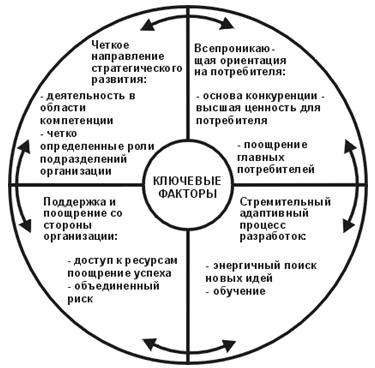

Помимо ключевых факторов есть также более обобщенный набор, составленный
по результатам опроса менеджеров, занимающихся созданием новых
продуктов. Столбец "%" показывает процентное количество респондентов,
отметивших важность фактора:

+-----------------------------------------------------------+---------+
| > **Факторы**                                             | > **%** |
+===========================================================+=========+
| > Адаптированность продукта к требованиям рынка           | > 85    |
+-----------------------------------------------------------+---------+
| > Соответствие продукта особым возможностям фирмы         | > 62    |
+-----------------------------------------------------------+---------+
| > Технологическое превосходство продукта                  | > 52    |
+-----------------------------------------------------------+---------+
| > Поддержка новых продуктов руководством фирмы            | > 45    |
+-----------------------------------------------------------+---------+
| > Использование оценочных процедур при выборе новых       | > 33    |
| > моделей                                                 |         |
+-----------------------------------------------------------+---------+
| > Благоприятная конкурентная среда                        | > 31    |
+-----------------------------------------------------------+---------+
| > Соответствие организационной структуры задачам          | > 15    |
| > разработки нового продукта                              |         |
+-----------------------------------------------------------+---------+

Из представленных данных вытекает, что главными факторами успеха
являются, с одной стороны, соответствие продукта требованиям рынка, а с
другой --- возможности организации по его разработке и производству.
Важно располагать превосходной технологией, опираться на поддержку
руководства и адаптировать многостадийную разработку к процессу принятия
товара рынком.

Ссылки:
[[http://www.grandars.ru/student/marketing/novyy-produkt.html]{.underline}](http://www.grandars.ru/student/marketing/novyy-produkt.html)

Автор: Певнев Г.

1.  Ценность продукта, оценка возможностей продукта.
----------------------------------------------------

Ссылки: Лекция 2, слайды 6-9,

[[http://marketnotes.ru/about\_marketing/canvas/]{.underline}](http://marketnotes.ru/about_marketing/canvas/)

Автор: Наумов О.

При оценки возможностей продукта необходимо ответить на следующие
вопросы:

-   *Предложение ценности*: какую конкретно проблему решает продукт?
    > Зачем нам это разрабатывать?

-   *Целевой рынок*: для кого мы решаем эту проблему? Кому и какая от
    > этого польза?

-   *Метрики успеха*: как мы будем измерять успех? Какие ключевые
    > показатели призван улучшить данный продукт?

-   *Объем рынка*: насколько велики возможности?

-   *Текущие конкуренты*: какие есть альтернативы?

-   *Наши отличия*: почему наш продукт лучше подходит для решения

проблемы?

-   *Окно рынка*: почему сейчас подходящее время?

-   *Стратегия выхода*: как мы будем запускать продукт?

-   *Требования и риски*: какие факторы критичны для успеха?

По сути оценка возможностей продукта сводится к определению
бизнес-ценностей проекта, чем мы занимались на 1-ом этапе выполнения
лабораторных работ.

*Ценность = Польза / Сложность.*

Стоит помнить, что ценность должна быть:

-   конкретна

-   измерима

-   ориентирована на совершение действий

-   достижима

-   ограничена во времени

Определение из задания на ЛР:

**Ценность** - что улучшается / создается уникального в проекте
(конкретные, лучше измеримые тезисы).

При оценке возможностей продукта пользуются инструментом, который
называется *Business Model Canvas* и представляет из себя схему,
состоящую из 9 блоков:

1.  Ключевые партнёры (Key partners)

2.  Ключевые действия (Key activities)

3.  Ключевые ценности (Value propositions)

4.  Взаимоотношения с клиентами (Customer relationships)

5.  Сегменты потребителей (Customer segments)

6.  Ключевые ресурсы (Key resources)

7.  Каналы сбыта (Channels)

8.  Структура расходов (Cost structure)

9.  Потоки доходов (Revenue structure)

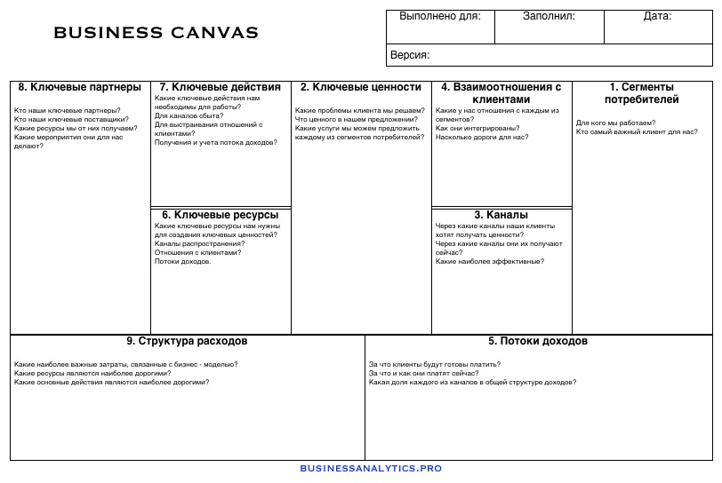

-   Убедитесь, что вы не создаете 'подвисшие' элементы в своей
    > бизнес-модели.

-   Не смешивайте настоящее и будущее.

-   Слишком много идей в одном холсте.

1.  Ключевые клиенты для продукта, пользователи, описание персон
----------------------------------------------------------------

Идентификация ключевых клиентов:

1.  Описание персон - помогает команде понимать нужды ключевых групп
    > пользователей и формулировать требования с учетом:

    a.  демографических данных

    b.  образа жизни

    c.  других общих характеристик.

2.  Карты эмпатии (см. рисунок ниже) - схема, в центре которой
    > размещается представитель определенного пользовательского
    > сегмента, по разные стороны от него -- 4 блока:

    a.  "думаю и чувствую"

    b.  "говорю и делаю"

    c.  "вижу"

    d.  "слышу".

Выводы приводятся в двух дополнительных блоках:

e.  "проблемы и болевые точки"

f.  "ценности и достижения".

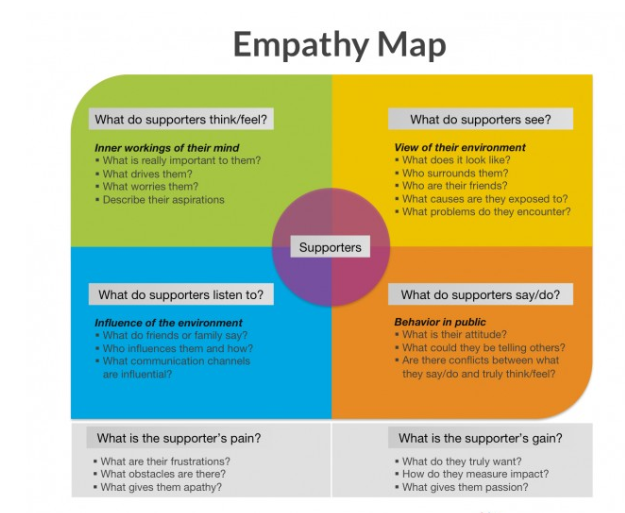

1.  Impact mapping -- карты влияния гипотез:

    a.  Как должно измениться поведение действующих лиц?

    b.  Как они могут помочь нам достичь цели?

    c.  Как они могут создать нам препятствия или помешать добиться
        > успеха?

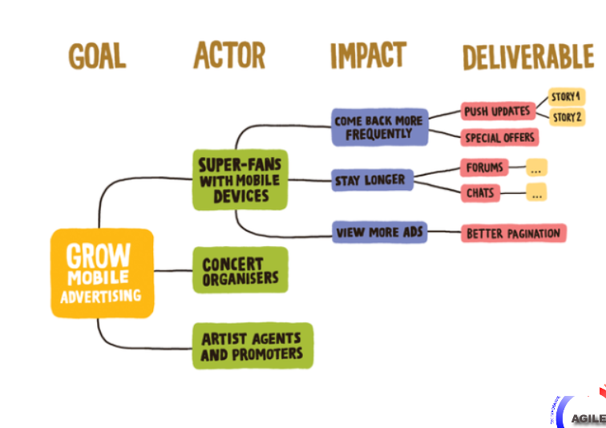

Ссылки: 2 лекция ТРПО

Автор: Касаткина

1.  Карта опыта пользователя: суть, назначение, принципы построения, ценность для проекта.
------------------------------------------------------------------------------------------

Customer Journey Map (CJM) -- это инструмент визуализации взаимодействия
потребителя с продуктом или услугой. Карта составляется от лица
покупателя и выглядит как график с точками и каналами его взаимодействия
с продуктом.

CJM отображает взаимодействие, развёртываемое во времени, разложенное на
атомарные составляющие. Составляющие взаимодействия относятся как к
процессу так и к психоэмоциональному состоянию потребителя.

CJM бывают разными. В зависимости от особенностей продукта
взаимодействие может быть удобно отразить линейно (самый частый случай),
нелинейно или даже в виде круга (особенно полезно для циклических
процессов).

**Зачем использовать?**

CJM при правильном использовании позволяет обеспечить высокий уровень
качества во всех точках соприкосновения клиентов с продуктом, выявить
проблемные места и причины недовольства и фрустрации у клиентов.

На карту можно наложить KPI и отслеживать эффективность работы в каждой
точке.

Кроме того, такой анализ зачастую помогает выявить зоны с размытой
ответственностью, которые в следствие этого не получают должного
внимания (а это значит, что пользовательский опыт в этих точках далек от
совершенства).

**Принципы построения:**

1.  Выделить все этапы и точки взаимодействия персоны с компанией

2.  Присваиваем этапам названия, - это колонки. Точки соприкосновения
    > сразу же указываются в соответствующей строке под каждым из этапов

3.  Указываем ожидания пользователя от взаимодействия с компанией

4.  Описываем сам процесс взаимодействия, разбивая каждый крупный этап
    > на конкретные действия

5.  Описываем проблемы

6.  Описываем эмоциональное состояние клиента

7.  Генерируем идеи для решения проблем (командно)

Ссылки: 2 лекция ТРПО. Слайды 16-19.
[[https://uxexperience.net/useful/artefakty-cjm]{.underline}](https://uxexperience.net/useful/artefakty-cjm)

Автор: Низовкин

13. Видение продукта: составляющие, правила формирования.
---------------------------------------------------------

Способность представить себе то, как должен выглядеть новый продукт или
его новая версия, необходима для того, чтобы куда-то прийти.
Представления о продукте выливаются в видение --- набросок будущего
продукта.

Составляющие видения:

-   **Цель** - то, чего продукт должен достичь на текущей итерации его
    > продумывания;

-   **Ценность** - зачем это вообще, какие потребности он будет решать;

-   **Пользователи** - кто будет покупать этот продукт? Кто его целевой
    > клиент? Кто будет использовать продукт? Кто его целевые
    > пользователи?

-   **Каналы взаимодействия** - каким образом пользователи будут
    > узнавать о продукте, его новых фичах;

-   **Основные процессы** - какие основные процессы необходимы для
    > создания продукта (логистические, производственные и тд)

-   **Бизнес-процессы** - совокупность взаимосвязанных функций, которые
    > имеют один или более входов и выходов и завершаются созданием
    > продукта, необходимого клиенту

-   **Существующие проблемы** - проблемы, которые есть у пользователя и
    > которые призван решить продукт; проблемы у аналогов продукта,
    > которые решает создаваемый продукт; проблемы самого продукта;

-   **Риски** - то, с какими проблемами может столкнуться продукт и как
    > эти проблемы можно решить; учет возможных ситуаций и способ их
    > решения.

Формирование видения продукта должно происходить не в виде какого-то
плана разработки, планирования ресурсов, а прибегая к описанию:

-   Бизнес-процессов и бизнес-сценариев;

-   Метрик успеха;

-   Взаимодействия пользователя с продуктом.

Необходимо четко описать все то, что что было исследовано ранее, описать
все процессы как словами, так и диаграммами, создать бэклог и прототип
продукта.

Процессы могут выстраивать иерархию

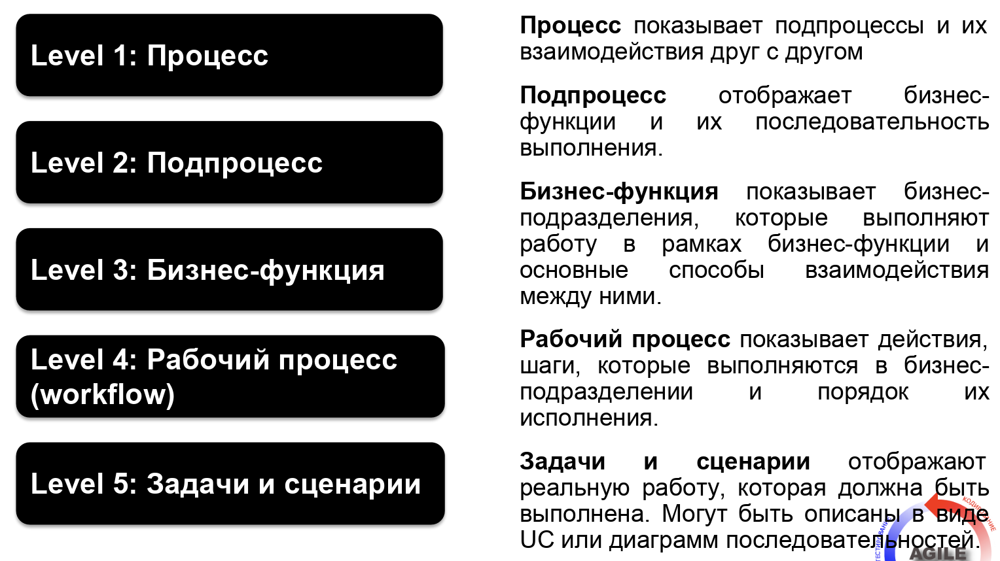

Ссылки: Слайды 20-23, Лекция 2

Автор: Клочков

1.  Метрики успеха продукта: назначение, правила определения, ценность для проекта.
-----------------------------------------------------------------------------------

**Метрика** --- это качественный или количественный показатель, который
отражает ту или иную характеристику и уровень успешности продукта.

Зачастую предлагается выбирать количественные метрики, т.к. они больше
отражают реальную картину.

Всегда стоит четко понимать, что:

-   **Нужно быть ближе к реальности**: не увеличить объем продаж, а
    > просчитать все необходимые затраты на производство одной единицы
    > продукта и определить реальную производительность;

-   Стоит **отдавать предпочтение вычислимым метрикам**, т.к. их легче
    > проверить и посчитать - к тому же они интуитивно понятны;

-   **Избегать метрик,** которые всегда **показывают продукт с лучшей
    > стороны** - вы не будете реально оценивать продукт, а значит это и
    > вовсе не метрика.

Разнообразие метрик - большое количество. Каждая их них несет свою
ценность для проекта. В целом можно разделить метрики на 2 категории:

-   **Продуктовые** - показывают, как работает и используется продукт. С
    > их помощью можно понять, насколько ценят продукт сами
    > пользователи, всё ли с ним хорошо или что-то не так. Эти метрики
    > не так просто посчитать и зачастую их не используют для оценки
    > успешности продукта;

-   **Маркетинговые** - показывают, как продукт продвигается на рынке.
    > Поскольку это тоже относится к продукту, можно сказать, что
    > маркетинговые метрики входят в состав продуктовых. Это вычислимые
    > метрики, которые могут дать некоторую информацию о успешности
    > продукта.

***Пример**: Например, когда в Apple захотели улучшить пользовательский
опыт и решили отказаться от привычных USB-разъёмов и карт памяти в
ноутбуках, сначала пользователи были недовольны. Им казалось, что
продукт станет хуже, его будет неудобно использовать. То есть показатель
«счастье пользователя» ухудшился. Но потом все стало ок.*

Пример явно показывает, что продуктовые метрики не так хороши, как
хотелось бы и не отражают реальную картину продукта.

Ссылки: Слайды 24-26, лекция 2. Лучше описано
[[здесь]{.underline}](https://skillbox.ru/media/management/chto_takoe_produktovye_metriki_i_zachem_oni_nuzhny/)

Автор: Клочков

15. Minimum Viable Product: суть, назначение, ценность для проекта.
-------------------------------------------------------------------

Ссылки: Презентация 2, слайды 17-20

Автор: Зеновская Ю.М.

**MVP - минимально жизнеспособный продукт** - самая ранняя версия
продукта, которая отвечает нарративу, обладает только необходимыми
функциями и позволяет получить обратную связь от пользователей, чтобы
понять что им нужно и не создавать то, что им неинтересно. Это может
сэкономить деньги, не вкладывая их в провальный проект.
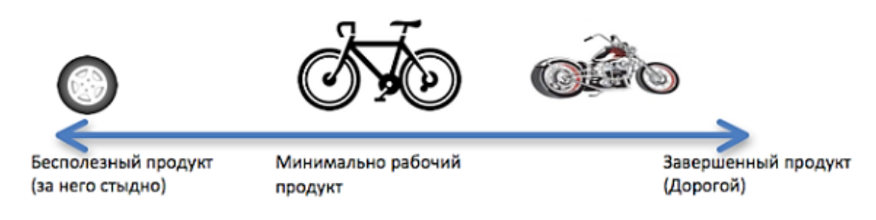

Предлагая пользователям колеса, детали, каркас машины, и наконец
собранный автомобиль - тратите время и бюджет, а машина может не
понравиться. Дайте пользователям прокатиться на велосипеде, узнайте их
мнение и поэтапно усовершенствуйте продукт. Что важно, на каждой
итерации клиенты смогут пользоваться продуктом (велосипед -\> мотоцикл
-\> машина -\> самолет). Пусть он не идеален, но поможет частично решить
их проблему. Вы сэкономите ресурсы на разработку и наверняка будете
знать, что сделать лучше.

*Как правильно сделать MVP:*

1.  Обозначьте проблему, которую нужно решить (цель продукта, для чего
    > он нужен). Изложите ценность продукта.

2.  Определите целевую аудиторию (удовлетворить потребности широкой
    > аудитории - ошибочное суждение), это поможет понять, будет ли ваш
    > продукт решать регулярные проблемы потенциальных покупателей.

3.  Проанализируйте конкурентов, их слабые и сильные стороны, чтобы
    > определить функциональность своего продукта.

4.  Определите карту путей пользователя. User flow --- путь, который
    > проходит пользователь при взаимодействии с продуктом. Карта путей
    > пользователей --- руководство с требованиями к контенту и дизайну
    > сайтов / приложений.

5.  Перечислите обязательный функционал, важность и ценность функции и
    > расставьте приоритеты.

6.  Workflow sequence - путь пользователя. Сбоку стрелка приоритета от
    > высокого к низкому. Первый ряд - walking skeleton - ходячий скелет
    > или каркас - наименьшая полезная версия продукта, которой
    > недостает «мяса», то есть функциональности. Иногда MVP совпадает с
    > каркасом, а иногда обладает ограниченной функциональностью. Чтобы
    > понять, какие есть отличия между каркасом, MVP и его дальнейшей
    > концепцией, вы должны классифицировать функции.

> 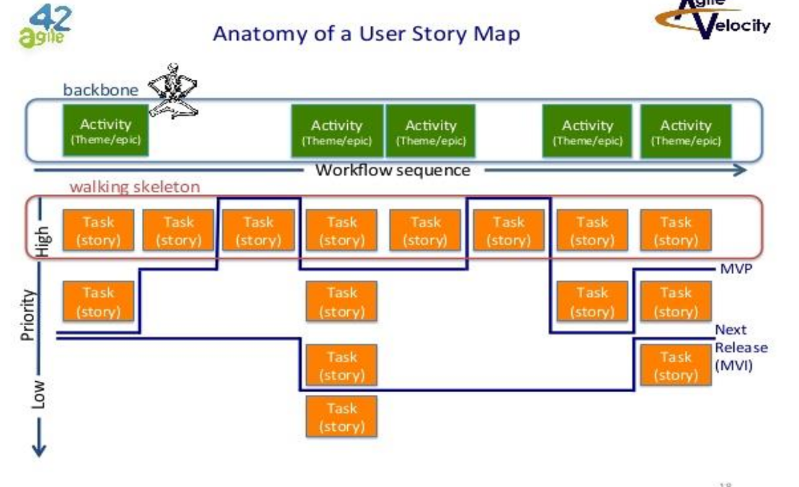

1.  Тестируем продукт на ограниченной группе людей(альфа-тестирование),
    > они оценивают. И если продукт прошел этот тест, то начинается
    > бета-тестирование (реальные пользователи пользуются продуктом 1-2
    > недели)

**Бумажное прототипирование как вид MVP:** строим грамотную структуру
для взаимодействия посетителем (без увлечения, это не финальный дизайн).
С помощью такого прототипа можно показать структуру будущего сайта или
приложения и получить мгновенную обратную связь от заказчика,
нарисовали, обсудили, нарисовали еще раз, если это необходимо. После
представления прототипа клиент знает чего ожидать в результате, а
разработчик уверен в целях и требованиях.

16. Целеполагание с точки зрения продукта: как ставятся цели для команды, как обеспечивается коммуникация.
----------------------------------------------------------------------------------------------------------

Что нужно транслировать команде?

1.  Цели нашего продукта

2.  Цели итерации разработки

3.  Что планируется дальше

4.  Кто может помочь с ответами на вопросы

5.  Открытость к предложениям и совместной работе

С какими трудностями часто сталкиваются?

1.  "Бизнесу" не хватает времени на проработку требований.

2.  "Бизнес" и "разработка" говорят на разных языках. Как следствие ---
    > ложное понимание требований, непроясненные предположения,
    > вытекающие из них \'сюрпризы\' в момент демонстрации. Бизнес не
    > понимает процесса разработки и технологических возможностей.
    > Спецификация содержит представление заказчика о решении проблемы,
    > докопаться до сути которой по документу сложно. Часть вариантов
    > использования системы, не продуманная заранее, вбрасывается в ходе
    > разработки. Чем меньше практик, поддерживающих итеративный процесс
    > (CI, автоматизированное тестирование, ограничение по количеству
    > фич в работе), тем сложнее вносить изменения в требования.
    > Несуществующую систему сложно описать на бумаге. Отсюда вытекают
    > проблемы, которые можно обобщить словами заказчика: "Я не знаю
    > точно чего хочу, но точно знаю чего не хочу".

3.  'Аналитики' придумывают функциональность, не подкрепленную
    > бизнес-сценариями, даже инновационные фантазии нужно подкреплять
    > жизненной необходимостью.

4.  'Разработчики' не понимают зачем создается продукт или их не
    > устраивает предлагаемое решение.

Для правильной постановки целей важно четко понимать, что нам даст
достижение той или иной цели, в чём это будет полезно, зачем нам это
нужно?

Один из методов целеполагания --- SMART (в том числе и для постановки
конкретных целей команде):

1.  **Specific** -- цель должна быть конкретной и простой. Для
    > достижения данного критерия советуют применять правило 5 вопросов:
    > кто, что нужно сделать, зачем мы это делаем, кто вовлечен в
    > процесс, каковы критерии успешного выполнения и где происходит
    > действие? Если цель не может ответить на данные вопросы, возможно,
    > стоит сделать шаг назад и несколько укрупнить ее, либо же наоборот
    > -- сфокусироваться на составных ее частях, которые отвечают
    > заданным критериям.

2.  **Measurable** -- необходимо делать цель измеримой. В зависимости от
    > критериев, система оценки может варьироваться. Любой показатель
    > может быть оценен количественно, вопрос только в том, какая оценка
    > будет применена --- относительная или абсолютная. В большинстве
    > случаев, мы можем с точностью сказать, сколько и чего мы хотим
    > получить, однако, когда речь заходит о качественных целях, бывают
    > ситуации, когда нет возможности определить четкое количество. В
    > таком случае применяются относительные показатели (снизить на 40%,
    > увеличить в 2 раза и т.д.). Необходимость измерить цель
    > обусловлена тем, что это позволяет отслеживать достигнутый
    > прогресс, оценить полученный результат и помогает с большей
    > вероятностью выполнить намеченную цель, поскольку можно посчитать,
    > что и в каком количестве необходимо сделать для успешной
    > реализации планов.

3.  **Achievable** -- критерий адекватности и достижимости планов. Очень
    > важный показатель в данной стратегии, который позволяет не просто
    > проверить, насколько оторвана от реальности желаемая цель, но и
    > дает возможность оценить стремления и желания человека,
    > поставившего цель. На данном этапе также можно проверить
    > соответствие цели возможностям человека, команды или компании.
    > Конечно, существует масса примеров, когда благодаря всплеску
    > адреналина люди совершали поступки, которые раньше казались
    > невозможными или же высоко мотивированные и увлеченные своей
    > работой команды и компании совершали реальный прорыв или создавали
    > поистине восхищающие продукты или услуги, но нет ни одного
    > примера, когда человек мог полететь в космос, словно супермен или
    > за день выучил несколько языков.

4.  **Relevant** -- актуальность, позволяет оценить, насколько данная
    > цель (или задача) необходимы в данный момент и помогут достичь
    > реальных результатов. В данном случае полезно задаваться
    > следующими вопросами: стоит ли эта цель предполагаемых сил и
    > затрат по времени; насколько это осуществимо в реальных условиях,
    > насколько именно данная задача помогает в осуществлении
    > задуманного и есть ли более эффективные методы достижения
    > глобальных целей?

5.  **Time-bound** -- временные рамки. Мы можем быть максимально
    > мотивированными и вовлеченными в процесс, поставленная перед нами
    > цель может быть самой желанной и приоритетной, но пока нет четкого
    > понимания сроков и конкретных дат, ее выполнение с большой долей
    > вероятности будет откладываться на неопределенный срок.

Оптимизация коммуникаций в команде:

1.  **Четкое распределение ролей:** каждый точно знает сферу своей
    > ответственности, известно, кто в случае затруднений принимает
    > окончательное решение.

2.  **Создание словаря внутренних терминов:** во избежание недопонимания
    > другими специалистами, специалистами других отделов, новичками
    > команды. А лучше "жаргон" не использовать.

3.  **Назначение ответственного исполнителя:** обмен информацией может
    > быть затруднен, если запросы не передаются ответственному
    > сотруднику, который занимается дальнейшим распределением
    > обязанностей. Условно говоря, если у вас на кухне несколько
    > поваров, нужно назначить одного «шефа», который будет в курсе всей
    > входящей информации, относящейся к тому или иному проекту или
    > задаче. Возможно, есть смысл сделать таким ответственным
    > исполнителем менеджера проектов. Или начальника отдела. Главное
    > --- кто-нибудь должен выполнять функцию контактного лица и
    > собирать всю поступающую информацию, чтобы ничто не потерялось.
    > Когда множество сообщений стекаются к вам из различных источников,
    > удобно направить их к одному организованному и знающему
    > сотруднику, способному в них разобраться.

4.  **Ведение записей:** следует фиксировать все, о чем вы договорились,
    > это поможет в дальнейшей разработке и проверке, в ведении
    > документации, вносит ясность в происходящее.

5.  **Подтверждающие фразы:** бывает, что участники обсуждения могут
    > неправильно друг друга понять из-за разного бэкграунда, жаргонных
    > терминов, в силу особенностей своего восприятия и т.д. Поэтому
    > имеет смысл в конце обсуждения подытожить(подтвердить свое
    > понимание): "Давайте проверим, правильно ли я вас понял...",
    > "Давайте подведем итог: нам с вами нужно\..." . Это позволит
    > поправить ошибки восприятия задачи на раннем этапе.

6.  **Использование разных каналов связи для разных задач**. К примеру,
    > в чатах обмен новостями, а в системе управления проектами все
    > вопросы по проекту. Это позволит упростить ведение документации,
    > проще искать нужную информацию и т.д.

Ссылки: Лекция 2, слайды 31-32,
[[https://advance.ag/chto-takoe-celi-i-pochemu-eto-vazhno/]{.underline}](https://advance.ag/chto-takoe-celi-i-pochemu-eto-vazhno/)

[[https://www.wrike.com/ru/blog/shest-strategicheskih-sposobov-optimizirovat-obshhenie-v-komande/]{.underline}](https://www.wrike.com/ru/blog/shest-strategicheskih-sposobov-optimizirovat-obshhenie-v-komande/)

Автор: Слобода

17. Создание и эволюция продукта: жизненный цикл компонент программного обеспечения.
------------------------------------------------------------------------------------

**Компонента** --- это составляющая часть продукта.

В процессе жизненного цикла компоненты разрабатываются и внедряются ее
новые версии, а старые отменяются.

Состояния компоненты:

-   В процессе (In Progress)

-   Реализована (Implemented)

-   Интегрирована (Integrated)

-   Устарела (Deprecated)

-   Отменена (Canceled)

-   В ожидании (On Hold)

Главные активности BA (бизнес аналитик):

-   Создание, обновление, архивация спецификаций

-   Согласование документации

-   Отслеживание устаревших связей

Ссылки: Лекция 2, слайды 35-38

Автор: Луцев А.

18. Контроль изменений и версионирование в процессе эволюции продукта: суть, цель, ценность для продукта.
---------------------------------------------------------------------------------------------------------

**Контроль запросов на изменение системы**

1.  Запросы на изменения регистрируются в едином реестре во внутренней
    > системе контроля изменений

2.  Каждый запрос анализируется и по нему может быть запрошена
    > дополнительная информация

3.  Запросу придается статус и назначается исполнитель на каждом этапе

4.  По запросу могут проходить дискуссии на предмет включения в план
    > разработки

5.  Запросы могут объединяться с другими или, наоборот, приниматься в
    > план разработки частично

Во-первых, всё это необходимо для формализации процесса, и чтобы ничего
не потерять. Во-вторых, для более удобного планирования работ. Когда все
запросы на изменение собраны в одном месте - можно их проанализировать и
расставить приоритеты в их выполнении, сгруппировать при необходимости и
т.д. Это позволит сделать процесс изменений продукта более
контролируемым и предсказуемым.

**Правила версионирования документов на систему**

-   [Вручную]{.underline}

    -   Версия компоненты системы

    -   Версия выдачи

-   [Автоматическое (e.g. Share Point)]{.underline}

    -   Вспомогательная версия (промежуточная)

    -   Основная версия (утвержденная)

    -   Версия выдач

Под версией компоненты (или вспомогательной и основной) понимается
версия части системы, а под версией выдачи - версия документации на
систему.

Пример версионирования компоненты системы

System 1.0.1.0, тогда числа будут означать следующее:

1 -- Основные изменения

0 -- Незначительная новая функция

1 -- исправление, исправление ошибок

0 -- дополнительный знак для обозначения промежуточных или планируемых
изменений

*При этом необходимо строго соблюдать соответствие между версиями
системы и документации, т.е. если появилась новая фича / что-то ещё -
это должно быть отражено в документации к данной версии.*

Версионирование нужно опять же для формализации процесса. Это показывает
прогресс в развитии продукта - вышли такие-то версии, в которых был
добавлен такой-то функционал. К тому же, в случае возникновения багов на
стороне пользователя разработчикам будет проще понять, когда этот баг
возник, если они будут знать по крайней мере версию, в которой его
нашли.

Ссылки: Лекция 2, 42-44 слайды.

Автор: Арестов

19. Работа с заинтересованными лицами: цель, принципы, техники.
---------------------------------------------------------------

Техники:

1.  RASCI model - выявление ролей и их ответственности

    -   Responsible (n \>= 1) - исполнитель требований

    -   Accountable (n = 1) - принимает решения, несет ответственность,
        > подписывает документы

    -   Supportive - предоставляет ресурсы, помогает в выполнении задачи

    -   Consulted - предоставляет информацию / экспертизу

    -   Informed - должен быть проинформирован

Для каждой задачи stakeholder (заинтересованное лицо) может принимать
одну из ролей и нести соответствующую ей ответственность.

Если в таблице в строках задачи, а в столбцах стейкхолдеры, можно
выявлять организационные проблемы, например:

-   Много R в строке - много исполнителей, возможны накладки при
    > управлении

-   Нет R или A в строке - нет принимающего решения или выполняющего
    > работу

-   Несколько A в строке - не понятно, кто ответственен за результат

-   Много S, C, I в строке - действительно ли они нужны

-   Много R или отсутствуют свободные ячейки в столбце - возможна
    > перегрузка работника

-   Отсутствует R или A в столбце - действительно ли нужна роль

2.  Управление ожиданиями

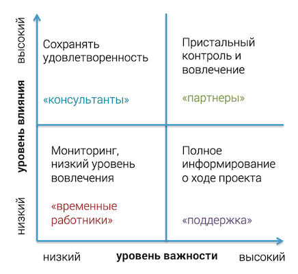

-   Партнеры максимально вовлечены в процесс, принимают решения

-   Консультанты согласовывают важные стратегические решения

-   Поддержка должна быть ознакомлена со всеми решениями, рекомендуется
    > заручиться у них поддержкой

-   Временные работники не погружены в проблемы, а решают конкретные,
    > отданные им задачи

Ссылки: 3 лекция, 5-9 слайды, [[про управление
ожиданиями]{.underline}](http://powerbranding.ru/biznes-analiz/stakeholders/)

Автор: Горохов Н.

1.  Методы выявления требований: подходы, их особенности и применимость.
------------------------------------------------------------------------

1.  Интервью - системный подход, предназначенный для выявления
    > информации путем общения с интервьюируемым, задавания релевантных
    > вопросов и документирования ответов.\
    > Успех интервью зависит от понимания интервьюером прикладной
    > области и его опыта, готовности интервьюируемого предоставлять
    > информацию.

2.  Генерация идей

    a.  Психологическая активизация мышления (шляпы мышления, мозговой
        > штурм, синектика)

    b.  Систематизированный поиск (морфологический и функциональный
        > анализ, метод контрольных вопросов, проектирование Мэтчета)

    c.  Методы направленного поиска (теория решения изобретательских
        > задач)

3.  Мастерские (workshops) - сбор всех представителей заинтересованных
    > сторон для разработки и согласования требований.

> Повестка:

-   Вводная часть

-   Презентация проекта

-   Мозговой штурм

-   Определение возможностей и ограничений

-   Определение приоритетов и фаз проекта

-   Определение дальнейших шагов

-   Обработка результатов

4.  Опросы / анкетирование

5.  Storyboarding / story mapping - история пользователя, по иксу время
    > (номер действия пользователя), по игрику - важность задач для
    > поддержания действия

6.  Макетирование (prototyping) - создание черновой версии для проверки
    > пригодности предлагаемых концепций и решений

Ссылки: 3 лекция, 10-23 слайды, [[статья на
medium]{.underline}](https://medium.com/product-design/%D0%BA%D0%B0%D0%BA-%D0%BF%D0%BE%D1%81%D1%82%D1%80%D0%BE%D0%B8%D1%82%D1%8C-%D0%BA%D0%B0%D1%80%D1%82%D1%83-%D0%B8%D1%81%D1%82%D0%BE%D1%80%D0%B8%D0%B9-user-story-mapping-%D0%B5%D1%81%D0%BB%D0%B8-%D0%BF%D1%80%D0%BE%D0%B5%D0%BA%D1%82-%D1%83%D0%B6%D0%B5-%D0%B2-%D1%80%D0%B0%D0%B1%D0%BE%D1%82%D0%B5-b53424880e27),
[[википедия про
прототипирование]{.underline}](https://ru.wikipedia.org/wiki/%D0%9F%D1%80%D0%BE%D1%82%D0%BE%D1%82%D0%B8%D0%BF%D0%B8%D1%80%D0%BE%D0%B2%D0%B0%D0%BD%D0%B8%D0%B5_%D0%BF%D1%80%D0%BE%D0%B3%D1%80%D0%B0%D0%BC%D0%BC%D0%BD%D0%BE%D0%B3%D0%BE_%D0%BE%D0%B1%D0%B5%D1%81%D0%BF%D0%B5%D1%87%D0%B5%D0%BD%D0%B8%D1%8F)

Автор: Горохов Н.

21. Управление требованиями: основные составляющие, этапы, ценность.
--------------------------------------------------------------------

Ссылки:[[https://habr.com/ru/post/114571/]{.underline}](https://habr.com/ru/post/114571/)

Автор: Панаиотиди

**Требование -** условие, которому должна соответствовать
разрабатываемая система.

Требование должно обладать следующими характеристиками:

1.  Единичность - описывать одну и только одну вещь

2.  Завершенность - требование полностью определено в одном месте и вся
    > необходимая информация присутствует

3.  Атомарность - нельзя разделить на более мелкие

4.  Последовательность - не противоречит другим требованиям

5.  Отслеживаемость - соответствует деловым нуждам как заявлено
    > заинтересованными лицами и задокументировано

6.  Актуальность - требование не стало устаревшим с течением времени

7.  Выполнимость - может быть реализовано

8.  Недвусмысленность - выражает объекты и факты,а не мнения.

9.  Обязательность - представляет собой характеристику, отсутствие
    > которой ведет к неполноценности решения, т.е ее нельзя
    > игнорировать.

10. Проверяемость - реализованность требования может быть проверена

**Управление требованиями** - процесс,включающий идентификацию,
выявление, документацию, анализ, отслеживание, приоритезацию требований,
достижение соглашений по требованиям и затем управление изменениями и
уведомление заинтересованных лиц. Данный процесс является непрерывным на
протяжении всего жизненного цикла продукта.

Цель управления требованиями состоит в том, чтобы гарантировать, что
организация документирует, проверяет и удовлетворяет потребности и
ожидания её клиентов и внутренних или внешних заинтересованных лиц

22. Definition of Done, определение готовности продукта.
--------------------------------------------------------

Definition Of Done (DoD) --- критерии, определяющие степень готовности
задачи.

DoD --- это чек-лист, c помощью которого можно понять, что задача
готова. Каждая команда имеет свои критерии готовности. Они определяются
в зависимости от контекста и состава команды. Очень важно, чтобы каждый
член команды полностью понимал и принимал каждый пункт в этом списке.
Другими словами DoD это разновидность командного соглашения по
конкретному вопросу.

Критерии готовности, которые выбрала команда, это открытая информация,
доступная всем заинтересованным лицам. Их наличие обеспечивает
прозрачность, как внутри команды, так и во вне по отношению ко всей
организации. Со временем команда улучшает критерии готовности путем
ретроспективных изменений. Уровень DoD является показателем зрелости
команды.

**Пример DoD Scrum команды:**

-   Код опубликован на Dev среде

-   Unit тесты пройдены

-   Истории соответствуют реализации

-   Автотесты

-   Регресс пройден

-   CRQ --- done

Ссылки: Лекция 3, слайды 28-30

Автор: Луцев А.

23. Критерии приемки: суть, ценность для продукта, правила определения.
-----------------------------------------------------------------------

Определение критериев приемки и оценки - определение требований, которые
должны быть удовлетворены для того, чтобы решение считалось приемлемым
для ключевых заинтересованных сторон.

Критерий приемки описывает минимальный набор требований, которые должны
быть удовлетворены для того, чтобы конкретное решение стоило
реализовывать.

Критерий оценки представляет собой набор требований, которые будут
использоваться для выбора между несколькими решениями.

**(все, что выше, из его презентации)**

Проще говоря, критерии приемки - это те критерии, которым должен
удовлетворять продукт, прежде чем клиент его примет; т.е. поддающееся
измерению определение того, что следует сделать с набором продуктов,
чтобы они были приняты основными заинтересованными сторонами проекта.

Зачастую критерии приемки определяют исходя из **User Story** - с
помощью User Story определяются требования пользователя.

**Ценность, то есть зачем они нужны?**

Хорошо написанные критерии приемки помогают команде разработчиков
понять, что именно должно быть разработано, чтобы требования
пользователя достаточно удовлетворены. Исходя из этого можно выделить
конкретные задачи для разработки.

Также эти критерии используются для тестирования

В конечном итоге, это позволяет избегать неприятностей в конце стадии
разработки и гарантировать, что все заинтересованные стороны и
пользователи удовлетворены финальным результатом;

***Критерий приемки может включать в себя такие детали, как:***

-   Пользовательский опыт

-   Влияние текущей User Story на существующие функции

-   Ключевая метрика производительности (например, скорость)

-   Что User Story должна делать

***Как определить хорошие критерии приемки?***

-   Они должны быть написаны с точки зрения пользователя

-   Должны быть простыми, четкими и понятными

-   Критерий должен представлять собой не задачу, а технологию

**Пример того, как может выглядеть критерий приемки:**\
*Учитывая \[контекст\], когда \[выполняется конкретное*

*действие\], тогда \[должно произойти следствие\]*

**Реальный пример описания критериев приемки на основе одного из User
Story:**

**User Story:** *«Как писатель, я хочу получать уведомления, когда
другие добавляют комментарии, чтобы я был в курсе»*

**Acceptance Criteria:**

1)  *Поскольку у меня не открыто приложение, когда мой телефон
    > заблокирован, я должен получить уведомление в виде баннера.*

2)  *Поскольку у меня есть открытое приложение, когда я пишу в
    > документе, значок колокольчика должен обновиться, чтобы показать
    > непрочитанные уведомления с количеством.*

3)  *Если пользователь был упомянут в комментарии с помощью @
    > упоминания, когда упомянутый пользователь читает комментарии, то в
    > той же цепочке комментариев должно появиться флэш сообщение о
    > новом комментарии.*

Ссылки:
[[https://leadstartup.ru/db/acceptance-criteria]{.underline}](https://leadstartup.ru/db/acceptance-criteria)

[[https://www.altexsoft.com/blog/business/acceptance-criteria-purposes-formats-and-best-practices/]{.underline}](https://www.altexsoft.com/blog/business/acceptance-criteria-purposes-formats-and-best-practices/)
- тут подробные примеры

Автор: Малкова

24. Аудит процесса управления продуктом: мероприятия, ценность и методы.
------------------------------------------------------------------------

Ссылки: стр11,14. ТРПО-4.

Автор: Панаиотиди

Аудит процесса управления --- это оценивание того, насколько хорошо
выстроены все процессы, насколько хорошо происходит управление ими.
Позволяет повысить эффективность команды.

Методы.

1.  Опрос аналитиков

2.  Рецензирование требований для установления планки качества

3.  Проверка планов

4.  Рецензирование регламентов работы - выявление проблемных зон

**Lessons Learned Process** - сбор и документирование успехов,
возможностей для улучшения,неудач и рекомендаций для повышения
эффективности.

Данные процесс включает в себя рассмотрение деятельности, результатов и
процессов бизнес-анализа. А также конечного продукта.

Преимуществом данного подхода является выявление возможностей для
улучшения процессов и построение духа команды после трудного периода.

К недостаткам можно отнести то,что избегается прямое обвинение других
участников,а проблемы неохотно документируются и обсуждаются.

25. Метрики процесса управления продуктом.
------------------------------------------

Ссылки:

-   Презентация \#5, слайды 5-6

-   [[https://habr.com/ru/post/173565/]{.underline}](https://habr.com/ru/post/173565/) -
    > статья про метрики с хорошей картинкой

Автор: Салин Сергей

Метрики, приведённые Штумпфом:

-   **Cycle Time** --- время с того момента, как проект берется в
    > разработку и доводится до завершения;

-   **Lead Time** --- время с момента ожидания проекта в очереди до
    > выпуска;

-   **Wasted Time** --- время простоя задачи в очередях, сюда не
    > включается время, которое задача находилась непосредственно в
    > работе;

-   **Effectiveness** --- время, затраченное непосредственно на работу
    > над проектом, сюда не включается ожидание в очередях.

Эти метрики относятся только к Kanban, в Scrum этих метрик нет.
Существует метрика Velocity (количество выполненных Story Points,
командой или индивидуально, за один спринт), но эта метрика не даёт
никакой информации о том, насколько хорошо работает каждый член команды
или даже команда в целом.

В Scrum метрики снимаются в основном в конце спринта (раз в 2 недели).
Это может приводить к проблемам: "Всю итерацию ситуация была из рук вон
плохая, а в конце все сделали нечеловеческое усилие и вуаля -- все
готово и метрики в порядке."

Из хороших метрик для Scrum упоминается Burn-up/Burn-down диаграмма -
данные в неё поставляются каждый день (можно и по спринтам, но тогда для
оценки будет меньше информации), в качестве данных выступает количество
выполненных Story Points/задач в целом.

У Штумпфа в презентации упоминается Control Chart - тип диаграммы,
который показывает, насколько ситуация контролируется. Нижний
контрольный предел, верхний контрольный предел и среднее значение
формируются из исторических данных; если значение выходит за пределы
верхней/нижней границы или в принципе отходит сильно от среднего
значения или колеблется, то ситуация не контролируется и зависит от
каких-то случайных факторов.

26. Управление бэклогом: общий подход, типы бэклога, подходы к его формированию.
--------------------------------------------------------------------------------

Ссылки:

-   Презентация \#5, слайды 11, 14, 16-19

-   [[https://habr.com/ru/company/hygger/blog/354168/]{.underline}](https://habr.com/ru/company/hygger/blog/354168/) -
    > нормальным языком о бэклоге

Автор: Салин Сергей

Бэклог это: (Штупмф)

-   Постоянно обновляемый список фич

-   Приоритезированных и оцененных

Типы бэклога с точки зрения артефактов Scrum:

-   **Бэклог продукта (Product Backlog)** -- приоритезированный список
    > историй с оценкой трудозатрат. Обычно он состоит из
    > бизнес-требований, которые приносят конкретную бизнес-ценность и
    > называются «элементы беклога».

Product manager или product owner представляют бэклог команде и
управляют им, описывает его главные элементы во время митинга по
планированию спринта. Описание бэклога следует производить на простом и
доступном языке, без технических спецификаций, чтобы оно было понятно
каждому в команде. Любые изменения и требования по продукту должны быть
своевременно отражены в этой очереди задач.

-   **Бэклог спринта (Sprint Backlog)** -- часть беклога продукта, с
    > самой высокой важностью и суммарной оценкой, не превышающей
    > скорость команды, отобранная для спринта; это список определенных
    > задач по воплощению в жизнь выбранных элементов бэклога продукта.
    > Это список для оптимизации, которой команда займется в ближайший
    > спринт, а также описание, каким образом они эту оптимизацию будут
    > реализовывать.

Типы бэклога с точки зрения Enterprise Backlog model:

-   Portfolio backlog (состоит из элементов Epic)

-   Product backlog (состоит из элементов Feature)

-   Team backlog (состоит из элементов User Story)

Организация бэклога:

-   Product owner ведет бэклоги

-   Приоритеты пересматриваются каждую итерацию

-   Это действительно ВСЕ, что нужно сделать.

    -   User stories

    -   Back-end поддержка сценариев

    -   Исследования

    -   Рефакторинг

    -   Конфигурации

-   Он представляет собой возможности, а не обязательства

-   Элементы могут быть оценены в соответствии с принятой шкалой оценки,
    > но оценки не подразумевают обязательную поставку

-   Он имеет одного владельца

27. Оценка требований: назначение, ценность для продукта, правила применения, методы оценки.
--------------------------------------------------------------------------------------------

*Назначение*: Оценка требования используется для углубления понимания
возможного диапазона стоимости и усилий, связанных с реализацией

*Ценность для продукта:*

-   Принятие решений более обосновано

-   Есть четкость понимания вероятных исходов

*Возможные проблемы:*

-   Ошибка в оценке

-   Оценки часто меняются, чтобы соответствовать желаниям влиятельных
    > заинтересованных сторон

*Правила применения:*

-   Оценка может затормозить развитие продукта, если накладывает слишком
    > много обязательств на исполнителя или перекладывается на
    > исполнителя

> То есть управленец заставляет исполнителя дать более привлекательную
> для заказчика, но не реальную оценку, тем самым перекладывая на
> исполнителя ответственность за правильность этой оценки.

*Методы оценки:*

-   Аналогичная оценка

-   Параметрическая оценка

-   Оценки снизу-вверх

-   Набегающая волна

-   Трехточечная оценка

-   Исторический анализ

-   Экспертное заключение

-   Delphi - оценка

Ссылки: 4 Лекция, первые слайды + конспект Вити

Автор: Касаткина

28. Приоритезация задач: суть, ценность для проекта, основные методы.
---------------------------------------------------------------------

**Приоритеты** --- это способ разрешения борьбы между конкурирующими
требованиями за ограниченные ресурсы. Расстановка приоритетов помогает
проекту обеспечить максимальную пользу для бизнеса как можно быстрее и в
рамках ограничений.

Для успешного определения приоритетов требуется понимание шести
характеристик:

-   потребностей клиентов;

-   относительной важности требований для клиентов;

-   последовательности, в которой должны предоставляться функции;

-   требований, служащих основой для других требований, и других связей
    > между требованиями;

-   потребности реализовывать какие-то группы требований целиком;

-   затраты на удовлетворение каждого требования

**Методы приоритезации:**

1.  **«Включать или не включать»\
    > **Группа заинтересованных лиц просматривает список требований и по
    > каждому принимает простое бинарное решение --- включать требование
    > в следующий выпуск или нет? При этом надо держать в уме
    > бизнес-цели проекта и пытаться свести список к абсолютному
    > минимуму, необходимому в первом выпуске.\
    > Далее, после начала реализации этого выпуска, можно вернуться к
    > ранее исключенным требованиям и повторить весь процесс снова для
    > следующего выпуска.

2.  **«Попарное сравнение и ранжирование»\
    > **Ранжирование списка требований предусматривает выполнение
    > попарного сравнения между всеми требованиями, чтобы можно было
    > определить, что в каждой паре приоритетнее.\
    > Такое сравнение становится трудноуправляемым, если требований
    > больше нескольких десятков. Оно может работать на уровне отдельных
    > функций, но не для всех функциональных требований к системе в
    > целом.

3.  **«100 долларов»\
    > **Дайте команде, занимающейся определением приоритетов сто
    > воображаемых долларов. Члены команды должны потратить эти доллары
    > на «покупку» конкретных требований из всего набора
    > требований-кандидатов. На более приоритетные требования надо
    > выделить больше денег. Если одно требование в три раза важнее для
    > заинтересованного лица, чем другое, оно должно выделить, скажем,
    > десять долларов на первое и три --- на второе. Но каждый получает
    > только 100 долларов --- когда деньги кончаются, ничего больше
    > нельзя реализовать, по крайней мере не в том выпуске, над которым
    > сейчас идет работа. К процессу приоритизации привлекают различных
    > участников для распределения своих долларов, после чего
    > суммируются доллары по каждому требованию, чтобы определить, за
    > какие требования было отдано больше всего долларов.

4.  **«Схема классификации приоритетов MoSCoW»\
    > **Четыре заглавных буквы в схеме определения приоритетов MoSCoW
    > обозначают четыре возможных классификации приоритетов в наборе:

    a.  **Must** --- требование должно быть удовлетворено, чтобы решение
        > было успешным;

    b.  **Should** --- требование важно и по возможности должно быть
        > включено в решение, но оно не является условием успеха
        > решения;

    c.  **Could** --- это желательная функция, но ее можно отложить или
        > удалить. Реализуйте ее, только если позволяет время и ресурсы;

    d.  **Won't** --- так обозначается требование, которое в этот раз
        > реализовываться не будет, но может быть включено в будущий
        > выпуск.

> Схема MoSCoW неоднозначна в том, что касается временных характеристик,
> особенно когда речь идет о рейтинге «Won't» --- это может означать «не
> в следующем выпуске» или «никогда». Такие различия должны определяться
> четко, чтобы у всех заинтересованных лиц было единое представление о
> последствиях данного конкретного рейтинга. Трехуровневая шкала более
> точна в отношении приоритетов (лучше пользоваться ею).

5.  **«Трехуровневая шкала приоритетов»**\
    > Предлагает учитывать два измерения: важность и срочность.

    a.  Требования с высоким приоритетом (**high priority**) --- важные
        > и срочные (они необходимы уже в следующем выпуске). Если
        > реализацию требования можно отложить без последствий, тогда,
        > его нельзя считать высокоприоритетным;

    b.  Требования со средним приоритетом (**medium priority**) ---
        > важные, но не срочные (они могут ждать следующего выпуска);

    c.  Требования с низким приоритетом (**low priority**) --- не важные
        > и не срочные;

    d.  Требования в четвертой клетке не важны для достижения
        > бизнес-целей. Если они не важны, присвойте им низкий приоритет
        > или вообще удалите

6.  **«Определение приоритетов на основе ценности, стоимости и риска»\
    > **Quality Function Deployment (QFD) --- всесторонний метод
    > определения относительной ценности предлагаемых функций продукта
    > для клиента

Ссылки: Лекция 4, слайды 4-10

Автор: Пчелкин

29. Правила управления и декомпозиции бэклога, способы разделения элементов бэклога.
------------------------------------------------------------------------------------

Ссылки: Лекция 5 слайды 21-36

Автор: Баркалов М\
\
Необходимо соотносить скорость работы команды и наполнение, которое
команда может сделать в течение итерации и останавливать себя (тот же
самый принцип "коричневой бумаги").\
\
Для эффективной системы оценки, задачи должны быть гранулярны и
максимально конкретны.

Можно рассмотреть свою задачу (систему) с трех точек зрения (ролей):

1.  Те роли, которые непосредственно используют этот продукт

2.  Те, кто принимает решения, что можно продлить эту подписку, купить
    > этот продукт.

3.  Тот, кто использует систему как инструмент бизнеса. Т.е. роли
    > которые получают деньги (финансовый результат) от продукта. Те кто
    > продает подписки, получает заказы на дальнейшее развитие системы

> Например:

1.  Бухгалтерия, которая использует 1С. Бухгалтера работают с
    > конкретными проводками, отчетами.

2.  Главный бухгалтер и финансовый директор. Видят насколько хорошо у
    > тех, кто на 1 ступени получается. Они принимают решение, надо ли
    > продлить подписку (все отчеты хорошие, эффективно работает),
    > заменить систему (отчеты плохие, не сходятся)

3.  Вендор этого ПО

Важны все три ступени. Истории (user story) надо писать от лица всех
трех.

Чтобы были хорошие истории, они должны быть

1.  Полные

2.  Нарезаны по архитектуре (по вертикали)

3.  Нарезаны по инкременту функциональности (только описание того, что
    > должно поменяться)

4.  Максимально независимы друг от друга

**Ценность для пользователя.**

Все, что делается для третьей роли стоит рассмотреть для двух других.\
Например Рефакторинг, система логирования.\
\
Для пользователей: "Я хочу получать консистентное и ясное сообщение об
ошибке в любом месте продукта, чтобы я знал, как решить проблему"

Для сотрудника поддержки: "Я хочу, чтобы пользователь получал
исчерпывающее и четкое сообщение в любом месте приложения, чтобы они
могли исправить проблему, не обращаясь в поддержку"

Если мы как поставщик системы (3 уровень) хотим снизить нагрузку на
поддержку. 1 роль говорит второй "да, в системе есть глюки, но тексты
ошибок ясные и понятно как всё исправить".\
\
Это лучше чем "ничего не работает, звоним в поддержку, она перегружена"

Поэтому написали для одной роли --- проверьте для других.\
\
*[Это работает и в другую сторону.]{.underline}*

Например, пользователи просят в каких-то ситуациях перекрашивать экран в
красный.\
\
Для 3 роли это "надо переделать всю архитектуру системы и это выльется
вот в такую стоимость"

Для 2 роли это "Эта стоимость много \$, а ценность слишком мала. Лучше
отрегулировать процесс у роли 1"

Истории пишут все. Владельцем (лицом, принимающим решения) является один
человек (руководитель продукта). Но создание истории --- общая
ответственность команды.

Процесс создания --- итерационный с обратной связью.

Как дробить истории?

- По шагам рабочего процесса:  
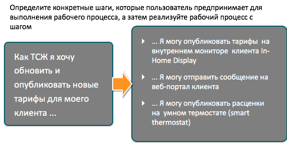
- По критериям. Есть описание рабочего процесса и несколько критериев, как удовлетворить этому рабочему процессу. Задача разбивается на удовлетворение каждого из критериев.  
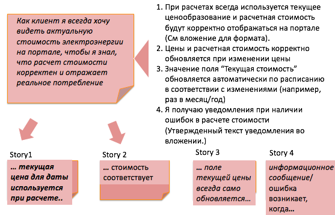
- По бизнес-целям. Ради чего нужно это или то?  

- По трудности реализации  
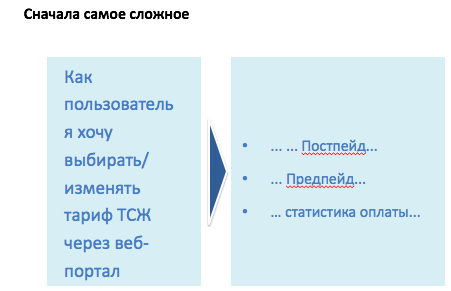
- По итерациям результата. Сначала простой вариант, потом сложный (дом ветвления, условия). Концепция схожа с MVP  
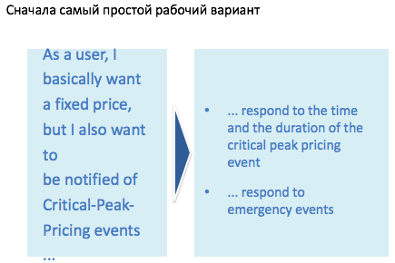
- По обработке данных (откуда данные, как представляются). Например данные на экране, в виде файла, на родном языке, на машинном языке  
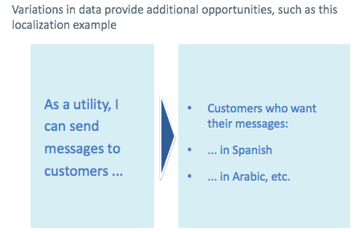
- По представлению данных. Один и тот же интерфейс может быть командной строки, в виде граф. интерфейса, офлайнового файла.
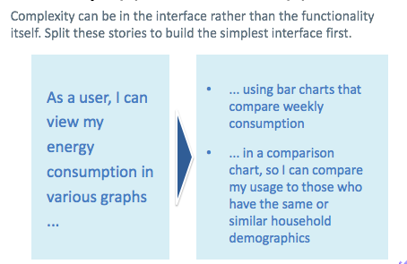
- По качествам системы. Например Яндекс.Транспорт (они ползут по алгоритму, но иногда сверяются с реальными датчиками)  
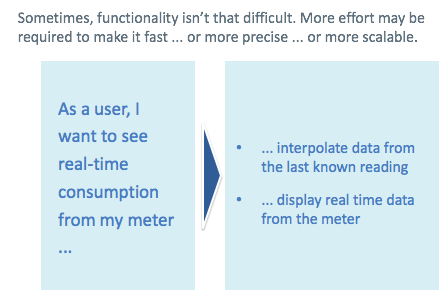
- По типу операций  
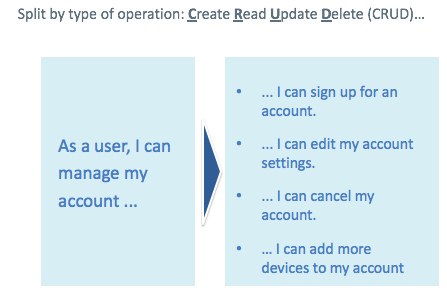
- Use Case Scenarios. Дробим сложный юзкейс на сценарии.  
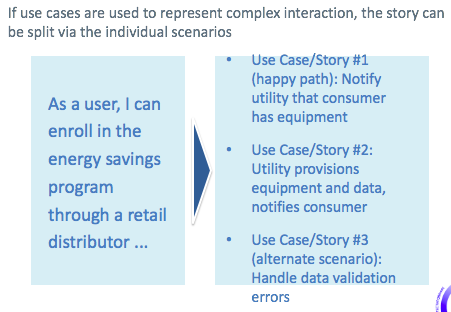
