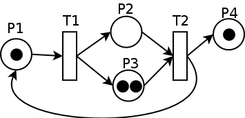
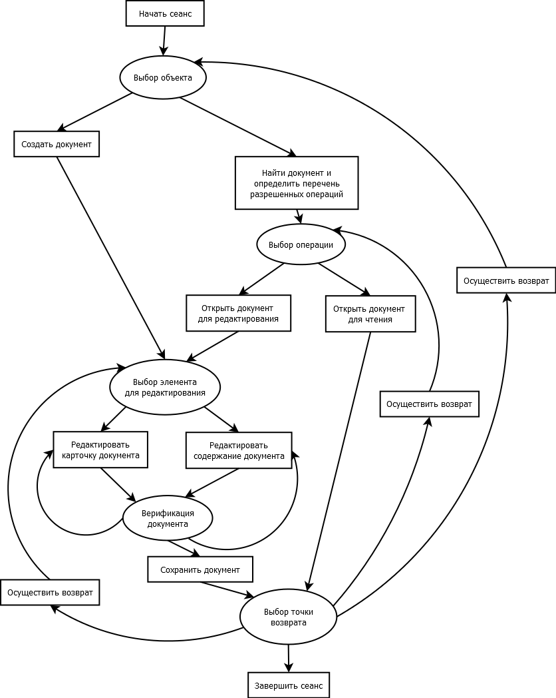

**Лабораторная работа №4. Анализ динамических характеристик
информационной системы на основе ее функциональной модели**

**Цель:** Ознакомиться с методиками оценки динамических характеристик
информационной системы (ИС) с применением сетей Петри

**1°. Основные определения.** На базе созданной в предыдущих
лабораторных работах структурной схемы (функциональной модели) ИС можно
построить модель для оценивания динамических характеристики ИС. Для
этого чаще всего используется аппарат сетей Петри.

Сеть Петри PN = (P,T,F) определяется как двудольный граф, т.е. все
вершины графа относятся к одному из двух классов -- позициям Р
(изображаются окружностями) и переходам Т (изображаются отрезками
прямой). Дуги в сетях Петри -- направленные, причем каждая дуга
связывает вершины только разных классов. В позициях могут размещаться
метки F (изображаются черными кружками), способные перемещаться по сети.
Событием называют срабатывание перехода, при котором метки из входных
позиций этого перехода перемещаются в выходные позиции.

{width="2.375in"
height="1.1458333333333333in"}

Рис. 1. Пример сети Петри

Для моделирования потоков работ (активностей в бизнес-процессах) или
потоков операций в технологических процессах целесообразно использовать
WF-сети -- подкласс сетей Петри, называемый также сетями потоков работ.
Сеть Петри PN = (P,T,F) называется сетью потоков работ (WF-сетью), если
выполняются следующие условия:

-   существует только одна исходная позиция i, такая что отсутствуют
    переходы, входящие в i;

-   существует только одна конечная позиция o, такая, что отсутствуют
    переходы, выходящие из o;

-   каждый узел данной сети расположен на пути от i к о.

**2°. Представление функциональной модели ИС в виде WF-сети.**

Вершинами графа описываются операции, которые осуществляет ИС. Дугами
описываются переходы между операциями, сопровождающиеся передачей данных
от предыдущего этапа. Под передаваемыми данными могут пониматься как
собственно данные для обработки на следующем этапе, так и как параметры
управления следующим этапом.

Граф строится как двудольный, т.е. выделяются вершины двух типов:

1.  Операция, реализующая осуществленное на одном из предыдущих этапов
    управление (реализация управления). Обозначены прямоугольниками.
    Такая операция может иметь **не более двух** выходов -- выход в
    случае успешного и выход в случае неуспешного выполнения операции.
    Для упрощения модели допускается обозначать для таких операций
    только выход в случае успешного выполнения операции, если
    результатом неуспешного выполнения является завершение
    соответствующего процесса и переход к точке выхода.

2.  Операция, определяющая дальнейший путь процесса (осуществление
    управления). Обозначены овалами. Такая операция должна иметь не
    менее двух выходов, приводящих к двум разным вершинам.

Граф имеет одну вершину имеющую только выходящие дуги и не имеющую
входящих дуг. Такую вершину будем называть точкой входа. Она обозначает
начало работы с информационной системой. Аналогично существует одна
вершина, которая имеет только входящие дуги и не имеет выходящих. Такую
вершину будем называть точкой выхода. Она обозначает окончание работы с
информационной системой.

{width="4.416666666666667in"
height="5.53125in"}

Рис. 2. Пример графа

**3°. Проверка двудольности графа**

Рис. 3. Проверка двудольности с помощью чётности расстояний

Чтобы проверить граф на предмет двудольности, достаточно в каждой
[компоненте
связности](http://ru.wikipedia.org/wiki/%D0%9A%D0%BE%D0%BC%D0%BF%D0%BE%D0%BD%D0%B5%D0%BD%D1%82%D0%B0_%D1%81%D0%B2%D1%8F%D0%B7%D0%BD%D0%BE%D1%81%D1%82%D0%B8_%D0%B3%D1%80%D0%B0%D1%84%D0%B0)
выбрать любую вершину и помечать оставшиеся вершины во время обхода
графа (например, [поиском в
ширину](http://ru.wikipedia.org/wiki/%D0%9F%D0%BE%D0%B8%D1%81%D0%BA_%D0%B2_%D1%88%D0%B8%D1%80%D0%B8%D0%BD%D1%83)
или в
[глубину](http://ru.wikipedia.org/wiki/%D0%9F%D0%BE%D0%B8%D1%81%D0%BA_%D0%B2_%D0%B3%D0%BB%D1%83%D0%B1%D0%B8%D0%BD%D1%83))
поочерёдно как чётные и нечётные (см. рис. 2). Если при этом не
возникнет конфликта, все чётные вершины образуют множество вершин одного
гипа (например, позиций), а все нечётные --- множество вершин другого
гипа (переходов) соответственно.

**4°. Анализ свойств ИС с применением WF-сети**

**4.1°.** WF-сети используются для проверки графов потоков работ на
отсутствие структурных конфликтов (бездефектность). Свойство
бездефектности, или правильной завершаемости, соответствует следующим
требованиям:

-   конечная позиция o достижима при любой последовательности переходов
    от начальной позиции i;

-   WF-сеть не содержит лишних позиций (которые никогда не будут
    выполнены);

-   при достижении конечной позиции i данной сети не должно оставаться
    меток в промежуточных позициях.

**4.2°.** WF-сети также используются для выявления ошибок абстрактного
сценария ИС. Применительно к сценарию проверяются три свойства сети:

-   сеть должна быть ограниченной. Позиция сети Петри ограничена
    (k-ограничена), если существует такое целое число k, что число
    объектов в этой позиции никогда не превышает k. Число k называют
    емкостью позиции. Сеть Петри ограничена, если ограничены все ее
    позиции;

-   при работе сети не должны появляться неконечные тупиковые состояния,
    в которых не активирован ни один переход;

-   при работе сети не должно возникать \"ловушек\" - циклов без выхода
    (объект может попасть в \"ловушку\", циклически циркулировать в ней,
    но не может выйти из \"ловушки\").

Сценарий бизнес-системы будем считать корректным, если:

-   корректны все образующие его сценарные модули

-   модули корректно согласованы

**Задания на работу**

1.  Рассматривая функциональную модель ИС, построенную в предыдущих
    лабораторных работах, как граф, постройте на его основе WF-сеть в
    соответствии с требованиями пункта 2, руководствуясь следующими
    рекомендациями:

    a.  Замените название каждого компонента системы, являющегося
        вершиной исходного графа, на название операции, которую
        выполняет этот компонент. При невозможности выделить одну
        операцию, рекомендуется разбить такой компонент на несколько,
        установив связи между ними.

    b.  Осуществите проверку двудольности получившегося графа, получив
        разделение на два типа вершин, указанных в пункте 2. При
        нарушении двудольности внесите соответствующие изменения в
        схему.

    c.  Осуществите проверку на наличие и единственность входной и
        выходной вершин. При нарушении этого требования внесите
        соответствующие изменения в схему.

2.  Составьте таблицы, характеризующую вершины обоих типов.

Пример таблицы, характеризующей вершины первого типа:

  №     Название операции                          Характеристика результата успешного выполнения   Характеристика результата неуспешного выполнения (завершения процесса и перехода к точке выхода)
  ----- ------------------------------------------ ------------------------------------------------ --------------------------------------------------------------------------------------------------
  1\.   Найти документ                             Ссылка на найденный документ                     Документ отсутствует
  2\.   Определить перечень разрешенных операций   Список разрешенных операций                      Отсутствуют разрешенные операции
  3\.   Создать документ                           Сообщение о создании документа                   Не предполагается
  4\.   Создать карточку документа                 Сообщение о создании карточки документа          Не предполагается
        ...                                                                                         

Пример таблицы, характеризующей вершины второго типа:

  №     Название операции                   Параметры управления                                                                                                                          Результаты принятия решения (условия переходов к другим операциям)
  ----- ----------------------------------- --------------------------------------------------------------------------------------------------------------------------------------------- ---------------------------------------------------------------------------------------------------------------------------------------------------------
  1\.   Выбор объекта                       Результат выбора варианта пользователем                                                                                                       Переход к поиску объекта или к созданию нового документа
  2\.   Выбор операции                      Результат выбора варианта пользователем                                                                                                       Переход к открытию документа для ознакомления или редактирования
  3\.   Выбор элемента для редактирования   Результат выбора варианта пользователем                                                                                                       Выбор для редактирования карточки документа или его содержания
  4\.   Верификация документа               Выбор возврата к редактированию элемента документа или переход к сохранению документа в зависимости от формальной проверки внесенных данных   Разрешение сохранить документ или возврат к редактированию элемента
  5\.   Выбор точки возврата                Результат выбора варианта пользователем                                                                                                       Завершение работы с системой, возврат к выбору элемента документа для редактирования, возврат к выбору операции над документом, возврат выбору объекта.

3.  Выполните анализ свойств ИС с применением WF-сети (пп. 4.1° и 4.2°).
    Для выполнения п. 4.2° составьте один типичный сценарий
    использования ИС. Дайте содержательную интерпретацию полученных
    результатов.
