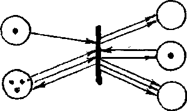
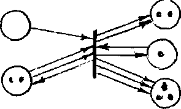
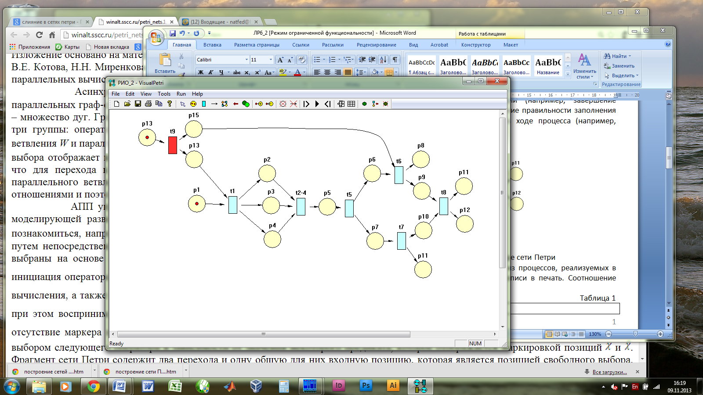
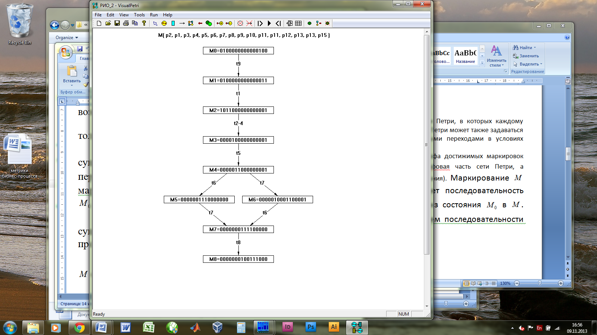

**Лабораторная работа №6. Оценка характеристик бизнес-процесса с
применением аппарата сетей Петри**

**Цель:** Ознакомиться с возможностями оценки характеристик
бизнес-процесса (и поддерживающего его документооборота),
предоставляемыми аппаратом сетей Петри

**Основные определения**

**1° .** При использовании аппарата сетей Петри моделируемые процессы
описываются множеством событий (действий) и условий, определяющих
возможность наступления этих событий, а также причинно-следственными
отношениями, устанавливаемыми на множестве пар \"события-условия\". В
сетях Петри условия − это позиции, а события - переходы. Как правило,
позиции отражают выделяемые состояния процесса или его компонентов.
Наличие метки в одной из позиций соответствует состоянию выполнения
некоторой из технологических операций либо состояние, в котором
пребывают некоторые из компонентов процесса.

Переходы соответствуют событиям, отображающим начало или завершение
текущего состояния (например, завершение операции транспортирования
заготовки к станку и начало операции ее обработки).

Присвоение меток позициям сети Петри называют маркировкой сети. Динамика
сетей Петри связана с механизмом изменения маркировок позиций и
соглашениями о правилах срабатывания переходов. Переход срабатывает,
если в каждой его входной позиции (предусловии) число меток не меньше
числа дуг, исходящих из позиции в данный переход (рис. 1, а). Такие
переходы называют возбужденными, их срабатывание может наступить через
любой конечный промежуток времени после возбуждения. В результате
срабатывания из всех входных позиций перехода исключается число меток,
равное числу дуг, выходящих из соответствующей позиции в переход, а в
выходные позиции данного перехода добавляется число меток, равное числу
дуг, исходящих из перехода в соответствующую выходную позицию (рис. 1,
б).

{width="1.59375in" height="0.9375in"}
{width="1.4791666666666667in"
height="0.8854166666666666in"}

а) б)

Рис. 1. а − возбужденный переход, б − переход после срабатывания

**2°.** При моделировании производственных процессов позиции отражают
отдельные операции (например: транспортировка заготовки к конвейеру,
обработка детали на станке, заполнение поля документа) или состояния
отдельных компонентов (например, робота, конвейера, станка) процесса.
Переходы соответствуют событиям, отображающим начало или завершение
моделируемых операций (например, завершение транспортирования заготовки
роботом и ее установки на конвейере, подтверждение правильности
заполнения документа). Метка, как правило, связывается с сущностью,
обрабатываемой в ходе процесса (например, обрабатываемой деталью,
сопроводительным документом).

{width="5.0in"
height="2.5208333333333335in"}

Рис. 1. Представление процесса подготовки рукописи в печать в виде сети
Петри

В качестве примера на рис. 1 показана сеть Петри, моделирующая один из
процессов, реализуемых в редакционно-издательском отделе (РИО) НИУ ИТМО
-- процесс подготовки рукописи в печать. Соотношение компонентов
процесса и сети Петри представлено в табл. 1

Таблица 1

  Компонент сети Петри   Компонент процесса в РИО
  ---------------------- --------------------------------------------------------------------------------------------------------------
  p1                     подготовка и комплектование рукописи
  t1                     входной контроль пройден
  p2, p3, p4             обработка компонентов рукописи (графика, текст, таблицы и формулы)
  t2-4                   контроль компонентов рукописи пройден (художественный редактор, литературный редактор, технический редактор)
  p5                     верстка оригинал-макета
  t5                     подписание оригинал-макета (ответственный редактор)
  p6                     согласование с учебным отделом
  t6                     контроль учебного отдела пройден
  p7                     подготовка электронной копии оригинал-макета
  t7                     электронная копия оригинал-макета сдана в информационный отдел
  p8                     формирование отчета о выполнении плана изданий
  p9, 10                 визирование подписного листа
  p11                    публикация на портале НИУ ИТМО
  t8                     подписание оригинал-макета в печать (проректор)
  p11                    передача оригинал-макета в типографию
  p12                    передача подписного листа в РИО

**3°.** Базовая конфигурация сети Петри позволяет описать:

-   возможности параллелизма и синхронизации процессов;

-   взаимодействие процессов и ресурсов, представленных метками;

-   независимые действия, представленные переходами;

Для учета временных характеристик можно использовать временные сети
Петри, в которых каждому переходу t~i~ сопоставляется время срабатывания
τ~i~. На множестве переходов в сети Петри может также задаваться
отношение порядка, определяющее порядок потребления меток возбужденными
переходами в условиях конфликта за метку.

**4°.** Формальный подход к анализу сетей Петри основан на использовании
графа достижимых маркировок (диаграммы состояний сети). Статические
свойства системы определяет графовая часть сети Петри, а динамические --
начальное маркирование и правила возбуждения переходов. Маркирование М
называют достижимым из маркирования М~0~, если существует
последовательность срабатывающих переходов σ= t~1~,\..., t~n~,
переводящая сеть из состояния М~0~ в М. Отношение следования
маркирований, возбуждаемых действием последовательности σ, имеет вид .
Графическое представление всех состояний сети Петри, достижимых из
конкретной разметки, называется деревом достижимости. Дерево
достижимости для сети Петри с маркировкой, показанной на рис. 1,
представлено на рис. 2.

{width="2.71875in" height="3.5in"}

Рис. 2. Дерево достижимости для сети рис. 1.

Анализ сетей Петри заключается в изучении их основных свойств,
определения которых даны в лабораторной работе № 4: безопасность,
ограниченность, сохранение, активность, достижимость, покрываемость.

Вопрос ограниченности сети Петри решается перебором и проверкой
конечного множества всех достижимых маркировок. Безопасность сети Петри
является частным случаем ограниченности.

Свойство сохранения проверяется по дереву достижимости вычислением для
каждой маркировки суммы меток. Если метки взвешены, то вычисляется
взвешенная сумма. Если сумма одинакова для каждой достижимой маркировки,
сеть - сохраняющая.

Задача покрываемости маркировки М маркировкой М' сводится к поиску на
дереве такой вершины х, состояние которой покрывает состояние М. Если
такой вершины М(х) не существует, маркировка М не покрывается никакой
достижимой маркировкой.

Сеть, дерево достижимости которой содержит терминальную вершину, не
активна. Аналогично искомая маркировка M' в задаче достижимости может
встретиться в дереве достижимости, что означает ее достижимость. Кроме
того, если маркировка не покрывается некоторой вершиной дерева
достижимости, то она недостижима.

**5°.** Важной характеристикой является время перевода сети из состояния
М~0~ в М, если с каждым переходом связано время τ~i~. Для этого на
дереве достижимости нужно отыскать соответствующий путь с вектором
запусков счёта срабатывания S={s~i~}, переводящих сеть из состояния М~0~
в состояние М. Тогда время перевода сети из состояния М~0~ в состояние М
определится суммой

,

где - компонента вектора S для перехода t~j~ (число срабатываний
перехода t~j~). При использовании этой формулы нужно учитывать возможный
параллелизм в срабатывании переходов.

**Задания на работу**

> 1\. Для сценариев обработки объектов управления ЕСМ, сформированных в
> лабораторной работе №5, построить таблицы соответствия (см. табл. 1) и
> реализовать сети Петри (см. п. **1, 2°)**.
>
> Для построения сетей использовать программу, позволяющую не только
> графически построить сеть Петри, но и запустить ее на исполнение.
> Программа доступна по адресу:
>
> <http://sourceforge.net/projects/visual-petri/>
>
> Для получения справок по построению сетей Петри можно использовать
> ресурсы
>
> <http://winalt.sscc.ru/petri_nets.1/control_p_net.1/ru.htm>
>
> portal.tpu.ru/SHARED/v/VKP/UR/Tab2/L5\_0.doc‎
>
> 2\. Запустить построенные сети Петри на исполнение, проверить их
> адекватность моделируемым сценариям.
>
> 3\. Для построенных сетей Петри построить деревья достижимости.
>
> Произвести их анализ (см. п. **4°), дать его содержательную
> интерпретацию в терминах моделируемого бизнес-процесса.**
>
> 4\. Провести экспертную оценку времен исполнения отдельных операций
> анализируемого процесса (см. п. **3°), рассчитать характерные времени
> исполнения всего процесса** (см. п. **5°).**
>
> **5. Выполнить пп. 1-4 для рассмотренных в лабораторной работе №4
> сценариев обработки исключений. Произвести качественное и
> количественное сравнение показателей по пп. 3, 4.**
