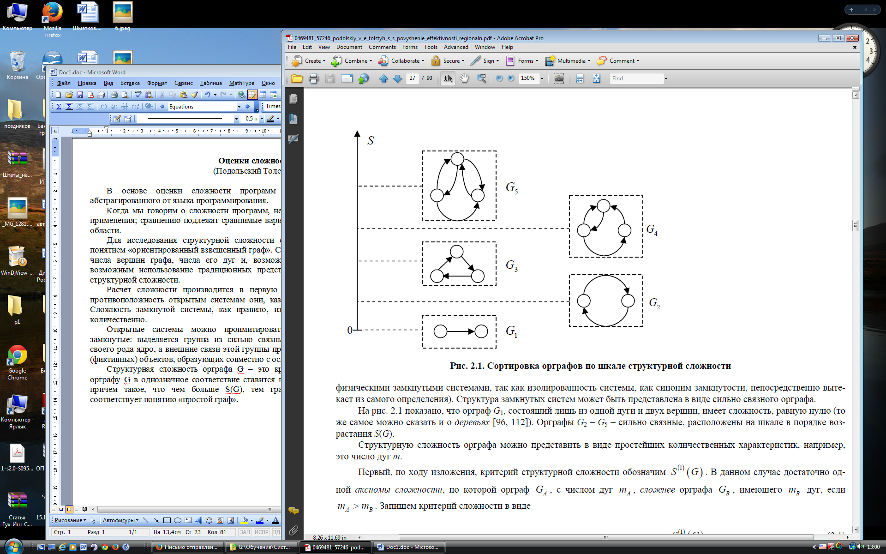
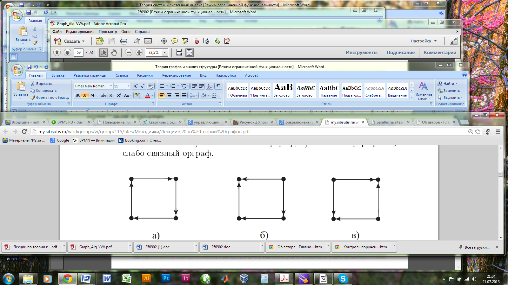
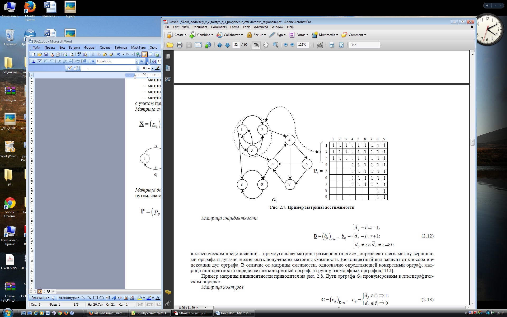
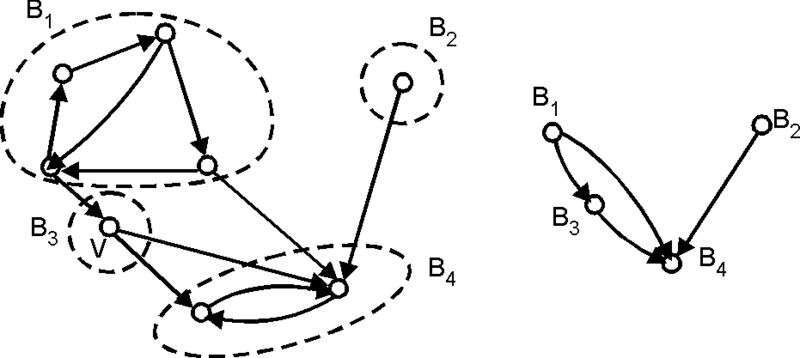
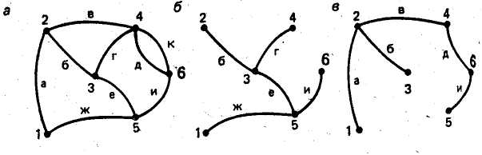
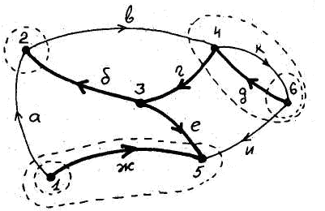
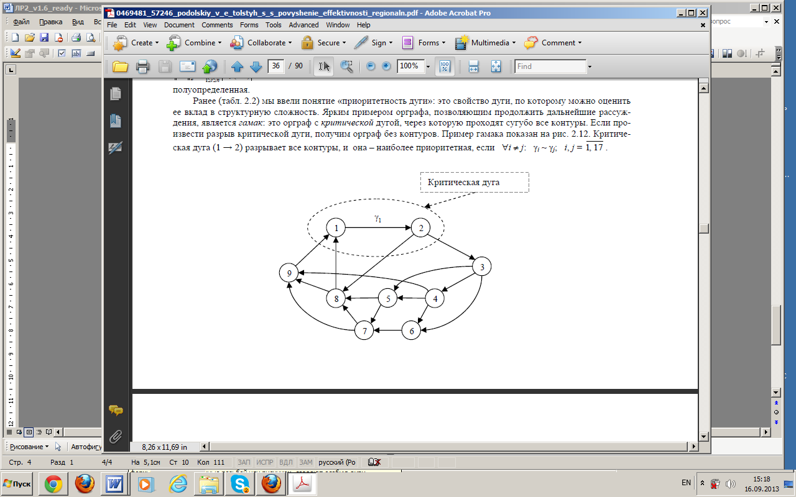

**Лабораторная работа №2. Оценка структурной сложности информационной
системы**

Цель: Научиться оценивать структурную сложность информационной системы.

Оценка структурной сложности информационной системы -- важный инструмент
для прогнозирования трудоемкости ее разработки и тестирования, оценки
характеристик ее надежности.

В лабораторной работе мы будет интерпретировать рассматриваемые критерии
структурной сложности в одном из аспектов -- оценки трудоемкости
тестирования разрабатываемой ИС. При выполнении лабораторной работы вам
будет необходимо определить значения по этим критериям и найти для них
интерпретацию в других аспектах жизненного цикла информационной системы.

**Задание на лабораторную работу: постройте оценки структурной сложности
для выбранной вами информационной системы по приведенным ниже критериям
и сформулируйте содержательные выводы о возможном применении этих
оценок.**

Для исследования структурной сложности структура системы ассоциируется с
понятием «ориентированный взвешенный граф». Сложность графа, очевидно,
зависит от числа вершин графа, числа его дуг и, возможно, от числа
контуров. Становится возможным использование традиционных представлений
теории графов для оценки структурной сложности.

Расчет сложности производится в первую очередь для замкнутых систем. В
противоположность открытым системам они, как правило, наблюдаемы, а их
сложность измерима, т.е. ее можно представить количественно.

Структурная сложность орграфа G -- это критерий S(G), посредством
которого орграфу G в однозначное соответствие ставится целое
неотрицательное число S(G), причем такое, что чем больше S(G), тем граф
G сложнее (рис. 1). Нулевая сложность соответствует понятию «простой
граф» (*G*~1~).

{width="4.041666666666667in"
height="2.7291666666666665in"}

Рис.1. Ранжировка типичных графовых структур по шкале структурной
сложности

Структурную сложность орграфа можно представить в виде простейших
количественных характеристик -- критериев.

**Первый критерий** -- число дуг в графе:

S^(1)^(G)=m,

где m -- это число дуг графа. Для описания этого числа можно
использовать матрицу инциденций.

Применение критерия: В качестве интерпретации значения по этому критерию
можно привести количество простых интеграционных тестов системы --
тестов, проверяющих попарную интеграцию компонентов. Однако этот
критерий не позволяет учесть структуру графа при расчете сложности.

***Задание 1.*** Определите число дуг в графе вашей системы, используя
матрицу инциденций, построенную в ЛР 1.

**Второй критерий** -- количество и состав бикомпонентов графа,

S^(2)^(G)={v~i,j~}.

Для введения понятия бикомпонента графа вспомним терминологию:

-   Связный неориентированный граф -- для любых двух вершин существует
    соединяющий их маршрут.

-   Связный орграф (б) -- для любой пары вершин u, v либо u достижима из
    v, либо наоборот.

-   Сильно связный орграф (а) -- любые две вершины достижимы друг из
    друга.

-   Слабо связный орграф (в) -- не является связным, но при замене всех
    дуг на ребра порождает связный неориентированный граф.

{width="3.4375in"
height="0.9270833333333334in"}

Рис. 2. К понятию связности графа

Тогда бикомпонент (компонент сильной связности) -- это максимальный по
включению сильно связанный подграф графа. Пример построения бикомпонента
графа приведен ниже. Орграф G3 содержит 3 бикомпоненты (сильно связные
подграфы максимальной размерности): {ν~1..3~}, {ν~4..7~} и {ν~8..9~}.

{width="4.177083333333333in"
height="2.5833333333333335in"}

Рис.3. Бикомпонент графа и его место в матрице достижимости

Матрица достижимости Р (рис. 3) отражает возможности достижения вершин в
орграфе по путям, слагаемых из смежных дуг. Каждой бикомпоненте в
матрице достижимости P~3~ соответствует свой уникальный набор строк.
Таким образом, по матрице достижимости можно выявить бикомпоненты
орграфа.

Очевидно, что любой граф можно рассматривать как набор бикомпонент,
соединенных ребрами, не входящими ни в одну из его бикомпонент, при этом
все контуры графа входят в бикомпоненты. Очевидно также, что, если
входное воздействие попадает в одну из вершин бикомпоненты, то оно
беспрепятственно распространится по всем другим ее вершинам. Поэтому с
точки зрения прохождения информации через граф (а) можно рассматривать
каждую бикомпоненту как одну вершину. Такое преобразование (б)
называется графом Герца G\* (другое название -- граф конденсаций).
Пример построения графа Герца приведен на рис. 4.

Рис. 4. Граф Герца для орграфа

Применение критерия: Количество выделенных бикомпонент может быть
интерпретировано как количество подсистем, разработку и тестирование
которых имеет смысл выполнять независимо с последующей интеграцией.
Однако сравнительную оценку сложности каждой бикомпоненты этот критерий
не дает.

***Задание 2.*** Определите количество и структуру бикомпонент для вашей
системы. Постройте для нее граф Герца. Дайте содержательное описание
построенных артефактов.

**Третий критерий** сложности графов -- число K элементарных контуров:

S^(3)^(G) = K . (2.2)

Контур --- это конечный путь М, у которого начальная и конечная вершина
совпадают. Контур называется элементарным, если все его вершины различны
(за исключением начальной и конечной вершины).

Для определения количества контуров необходимо построить из исходного
графа остовное дерево. *Остовное дерево* (*остов*) --- это подграф
данного графа, содержащий все его вершины и являющийся деревом. Рёбра
графа, не входящие в остов, называются **хордами** графа относительно
остова. Выбор остовного дерева графа неоднозначен, для одного и того же
графа их может быть несколько. На рис. 1, *а* представлен пример
связного графа, а на рис. 1, б и рис. 1, *в* - его остовные деревья. Для
дерева 1, б, ветви - это ребра *б, г, е, ж, и*, хорды - ребра *а, в, д,
к*; для дерева рис. 1, *в,* ветви- это ребра *а, б, в, д, и*, хорды -
*г, е, ж, к*.

{width="3.5208333333333335in"
height="1.1354166666666667in"}
{width="2.1145833333333335in"
height="1.3645833333333333in"}

Рис. 5. Граф (а) и его остовные деревья (б, в). Рис. 6. Орграф,
соответствующий графу рис. 5, а.

Соотношение ветвей и хорд в графе описывается с помощью матрицы
контуров. Количество столбцов матрицы контуров равно числу ветвей
выбранного для графа остовного дерева, а количество строк - числу хорд.
В случае орграфа при построении матрицы контуров нужно учитывать
направление ребер, входящих в контур, а именно: каждая хорда графа
поочередно включается в остовное дерево, при этом образуется замкнутый
контур. Обход этого контура выполняется в направлении, заданном
направлением хорды; в строке матрицы, соответствующей данной хорде,
ставится +1, если направление ветви дерева совпадает с направлением
обхода контура, -1, если направление ветви дерева противоположно, 0,
если ветвь не входит в данный контур.

Получение матрицы контуров для графа, показанного на рис. 5, а,
представлено в табл. 1.

Таблица 1.

        *б*   *г*   *д*   *е*   *ж*
  ----- ----- ----- ----- ----- -----
  *а*   -1    0     0     +1    -1
  *в*   +1    +1    0     0     0
  *к*   0     0     +1    0     0
  *и*   0     -1    -1    -1    0

При подключении хорды *а* образуется контур из ветвей дерева *б, е, ж*,
в столбцах матрицы, соответствующих ветвям *б* и *ж*, появится -1, в
столбце, соответствующем ветви *е*, будет +1, остальные столбцы содержат
0. Аналогично заполняются и другие строки.

Матрица контуров для примера структуры системы из лабораторной работы №1
представлена в табл. 2

> *Таблица 2. Пример матрицы контуров*

         *1*   *3*   *5*    *7*   *8*   *11*   *12*   *14*   *16*   *17*   *20*   *21*   *23*   *24*   *27*   *28*   *29*   *33*
  ------ ----- ----- ------ ----- ----- ------ ------ ------ ------ ------ ------ ------ ------ ------ ------ ------ ------ ------
  *2*    *1*                                                                                                                
  *4*          *1*                                                                                                          
  *6*                *1*                                                                                                    
  *9*                *-1*   *1*   *1*                                                                                       
  *10*                                  *1*                                                                                 
  *13*                                         *1*                                                                          
  *15*                                                *1*                                                                   
  *18*                                                       *1*    *1*                                                     
  *19*                                                                     *1*                                              
  *22*                                                                            *1*                                       
  *25*                                                                                   *-1*   *-1*   *-1*   *-1*          
  *26*                                                                                   *1*    *1*    *1*    *1*           
  *30*                                                                                                               *1*    
  *31*                                                                                   *-1*   *-1*   *-1*   *-1*   *-1*   
  *32*                                                                                   *1*    *1*    *1*    *1*    *1*    
  *34*                                                                                                                      *1*

Применение критерия: Практически любая связь компонентов информационной
системы работает по принципу «посыл-отклик». Количество контуров может
определить количество соответствующих тестов.

***Задание 3.*** Постройте матрицу контуров для вашей системы, дайте ее
содержательную интерпретацию.

Однако любые кольца (независимо от числа вершин в них) в соответствии с
этим критерием одинаково сложны. В то же время очевидно, что любое
увеличение длины контура значительно увеличивает сложность локализации
ошибки при тестировании: при большем количестве элементов и связей в
контуре обнаружить несоответствие отклика посылу мы, как правило, можем
только в одной точке для всего контура целиком, но это не дает нам
информации о том, где именно дефект.

Поэтому большой интерес представляет оценка приоритетности дуг. Дуга di
является более приоритетной, чем dj, если ее удаление приводит к более
существенному уменьшению структурной сложности. В замкнутой системе,
имеющей структуру сильно связного орграфа, дуга di будет более
приоритетной, чем dj, если

1\) ее вес *γ~i~* минимален в D;

2\) через дугу di проходит максимальное число контуров.

Примером может служить орграф типа *гамак* - орграф с критической дугой,
через которую проходят сугубо все контуры. Если произвести разрыв
критической дуги, получим орграф без контуров. Пример гамака показан на
рис. 7. Критическая дуга (1 → 2) разрывает все контуры, и она --
наиболее приоритетная, если ∀*i ≠ j: γ~i~ ≅ γ~j~; i, j = 1, 17 .* Однако
если предположить, что веса дуг существенно различны, γ~1~ \>\> γ~i~ , i
= 2, 17 , то наиболее приоритетной дугой может оказаться отнюдь не
критическая дуга.

{width="3.5833333333333335in"
height="2.4375in"}

Рис. 7. Гамак с критической дугой

Поэтому дуги, входящие в граф системы, сотрируются по следующим
признакам (перечислены в последовательности проверки):

1\) числу контуров, проходящих через дугу (по убыванию);

2\) весу дуги (по возрастанию);

3\) индексу начала дуги (по возрастанию);

4\) индексу конца дуги (по возрастанию).

При таком упорядочении наиболее приоритетной окажется дуга, входящая в
максимальное число контуров, и, если таких дуг несколько, то более
приоритетной будет дуга, имеющая меньший вес. Наоборот, наименее
приоритетной окажется дуга, входящая в минимальное число контуров, и,
если таких дуг несколько -- дуга с максимальным весом.

Сортировка дуг сопровождается перестановкой столбцов матрицы контуров:

1\) столбцы матрицы контуров группируются по убыванию суммарного
количества единичных элементов в этих столбцах;

2\) если возникли подматрицы из столбцов с одинаковым количеством
единиц, расставляем столбцы по убыванию веса соответствующих им дуг;

3\) если в одной подматрице находятся дуги с одинаковым весом и
одинаковым числом единиц в соответствующих столбцах, расставляем их в
лексиграфическом порядке по индексам дуг.

***Задание 4.*** Перестройте полученную матрицу контуров, отсортировав
ее строки по убыванию количества связей, входящих в контур. Дайте
содержательное описание назначения каждого контура в информационной
системе, инициатора (инициаторов) и конечных потребителей информации в
каждом контуре, определите, являются ли однородными отдельные связи,
входящие в контур (используют одинаковый способ связи, одинаковый или
просто преобразуемый формат данных и т.п.).

Перестройте полученную матрицу контуров, отсортировав ее столбцы по
убыванию количества контуров в которые входит соответствующая связь.
Дайте содержательное описание различий в работе связи при ее
использовании в различных контурах.

**Выводы:**

В общем случае сложность невзвешенного орграфа можно оценить как
произведение числа дуг на число контуров. Взвешенный орграф представляет
собой совокупность вершин, дуг и их весов. Эта совокупность представлена
двумя матрицами -- взвешенными матрицами смежности (Х) и инцидентности
(В). Контуры представлены взвешенной матрицей контуров (С).

Таким образом, чтобы оценить сложность взвешенного орграфа,
моделирующего конкретную систему, в общем случае необходимо:

-   найти произведение матриц: взвешенная матрица смежности умножается
    на взвешенную матрицу инцидентности, а затем полученное произведение
    -- на транспонированную взвешенную матрицу контуров (С\*);

-   произвести спектральное разложение полученной матрицы по собственным
    числам;

-   полученный спектр матрицы может использоваться для сравнительной
    оценки сложности сопоставляемых систем.

Выполнение указанной программы связано с большими вычислительными
сложностями; с другой стороны, редко удается задать веса дуг графа
системы с адекватной точностью. Поэтому на практике часто ограничиваются
ориентировочными оценками.
