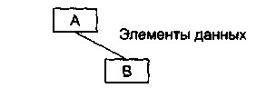
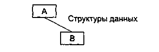
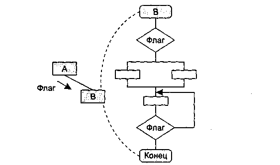
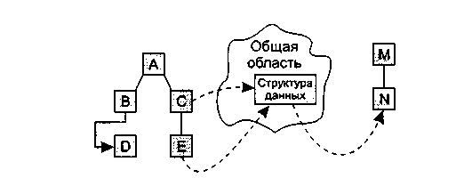

**Лабораторная работа №3. Оценка структурной сложности информационной
системы**

**Цель:** Научиться оценивать проектные характеристики архитектурной
модели информационной системы.

Архитектурные модели ПО имеют следующие классические проектные
характеристики: модульность, информационная закрытость, связность,
сцепление, сложность.

***Модульност**ь* --- свойство системы, которая может подвергаться
декомпозиции на ряд внутренне связанных и слабо зависящих друг от друга
модулей.

Выбор оптимального количества модулей приводит к минимальной стоимости
разработки ПО. Для оценки оптимального числа модулей существуют только
требования:

-   Интерфейсы модуля должны быть проще, чем его внутренняя организация;

-   Эффективнее использовать готовый модуль, чем реализовывать его
    > функциональность в другом модуле.

***Информационная закрытость*** означает, что ПО удовлетворяет следующим
требованиям:

-   все модули независимы, обмениваются только информацией, необходимой
    для работы;

-   доступ к операциям и структурам данных модуля ограничен.

Для оценки информационной закрытости необходимо рассматривать два типа
связей -- внутренние и внешние. Соответственно, появляются две
подхарактеристики -- связность внутри модуля и сцепление между модулями.

***Связность модуля*** (Cohesion) -- это мера зависимости его частей.
Связность --- внутренняя характеристика модуля. Чем выше связность
модуля, тем лучше результат проектирования.

Для измерения связности используют метрику силы связности (СС). Чем выше
значение СС, тем лучше. Существует 7 типов связности, для которых
значения СС определены экспертным путем.

1\. Связность по совпадению (СС=0). В модуле отсутствуют явно выраженные
внутренние связи, например:

Модуль Разные функции (какие-то параметры)

поздравить с Новым годом (\...)

проверить исправность аппаратуры (\...)

заполнить анкету героя (\...)

измерить температуру (\...)

2\. Логическая связность (СС=1). Части модуля объединены по принципу
функционального подобия. Например, модуль состоит из разных подпрограмм
обработки ошибок.

3\. Временная связность (СС=3). Части модуля не связаны, но необходимы в
один и тот же период работы системы. Пример -- модуль инициализации
компьютера.

4\. Процедурная связность (СС=5). Части модуля связаны порядком
выполняемых ими действий, реализующих некоторый сценарий поведения.
Например:

Модуль Вычисление средних значений

используется Таблица-А, Таблица-В

вычислить среднее по Таблица-А

вычислить среднее по Таблица-В

вернуть среднееТабл-А, среднееТабл-В

5\. Коммуникативная связность (СС=7). Части модуля связаны по данным
(работают с одной и той же структурой данных). Пример -- Модуль «Отчет и
средняя зарплата».

6\. Информационная (последовательная) связность (СС=9). Выходные данные
одной части используются как входные данные в другой части модуля.

7\. Функциональная связность (СС=10). Модуль содержит элементы,
участвующие в выполнении одной и только одной, проблемной функции
(единой с точки зрения клиента) -- например, вычислить зарплату
сотрудника.

Возможны более сложные случаи, когда с модулем ассоциируются несколько
уровней связности. В этих случаях следует применять одно из двух правил:

-   правило параллельной цепи. Если все действия модуля имеют несколько
    уровней связности, то модулю присваивают самый сильный уровень
    связности;

-   правило последовательной цепи. Если действия в модуле имеют разные
    уровни связности, то модулю присваивают самый слабый уровень
    связности.

Например, модуль может содержать некоторые действия, которые связаны
процедурно, а также другие действия, связные по совпадению. В этом
случае применяют правило последовательной цепи и в целом модуль считают
связным по совпадению.

***Сцепление модулей*** (Coupling) -- мера взаимозависимости модулей по
данным. Сцепление -- внешняя характеристика модуля, которую желательно
уменьшать.

Количественно сцепление измеряется метрикой «степень сцепления» (СЦ).
Чем ниже СЦ, тем лучше. Выделяют 6 типов сцепления, для которых значение
СЦ определяется экспертно.

1.  Сцепление по данным (СЦ=1). Модуль А вызывает модуль В.

Все входные и выходные параметры вызываемого модуля --- простые элементы
данных (рис. 1).

{width="2.0229166666666667in"
height="0.6465277777777778in"}

Рис. 1. Сцепление по данным

2.  Сцепление по образцу (СЦ=3). В качестве параметров используются
    структуры данных (рис. 2).

{width="2.1868055555555554in"
height="0.7097222222222223in"}

Рис. 2. Сцепление по образцу

3.  Сцепление по управлению (СЦ=4). Модуль А явно управляет
    функционированием модуля В (с помощью флагов или переключателей),
    посылая ему управляющие данные (рис. 3).

{width="3.75in"
height="2.209722222222222in"}

Рис. 3. Сцепление по управлению

4.  Сцепление по внешним ссылкам (СЦ=5). Модули А и В ссылаются на один
    и тот же глобальный элемент данных.

5.  Сцепление по общей области (СЦ=7). Модули разделяют одну и ту же
    глобальную структуру данных (рис. 4).

6.  Сцепление по содержанию (СЦ=9). Один модуль прямо ссылается на
    содержание другого модуля (не через его точку входа). Например, коды
    их команд перемежаются друг с другом (рис. 4).

{width="3.479861111111111in"
height="1.3333333333333333in"}

Рис. 4. Сцепление по общей области и содержанию

На рис. 4 видим, что модули В и D сцеплены по содержанию, а модули С, Е
и N сцеплены по общей области.

Каждый из выделенных модулей можно рассматривать как вершину графа --
модели более высокого уровня абстракции. Для него правомерно применить
***топологическую сортировку*** --найти перестановку вершин
(топологический порядок), соответствующую порядку, задаваемому всеми
рёбрами графа. То есть требуется перенумеровать его вершины таким
образом, чтобы каждое ребро вело из вершины с меньшим номером в вершину
с большим.

Топологическая сортировка может быть не единственной (например, если
граф --- пустой; или если есть три такие вершины a, b, c, что из a есть
пути в b и в c, но ни из b в c, ни из c в b добраться нельзя).
Топологической сортировки может не существовать вовсе --- если граф
содержит циклы (поскольку при этом возникает противоречие: есть путь и
из одной вершины в другую, и наоборот).

В общем случае при помощи топологической сортировки строится корректная
последовательность выполнения действий, всякое из которых может зависеть
от другого: последовательность прохождения учебных курсов студентами,
установки программ при помощи [пакетного
менеджера](http://ru.wikipedia.org/wiki/%D0%9F%D0%B0%D0%BA%D0%B5%D1%82%D0%BD%D1%8B%D0%B9_%D0%BC%D0%B5%D0%BD%D0%B5%D0%B4%D0%B6%D0%B5%D1%80),
сборки исходных текстов программ при
помощи [Makefile](http://ru.wikipedia.org/wiki/Makefile)\'ов.

**Задания на работу:**

**Взяв за основу программно-техническую архитектуру ИС, построенную на
предыдущих лабораторных работах, выделите модули в соответствии с
обозначенными выше требованиями. Полученная структура может как
совпадать с уже построенным ранее графом, так и отличаться от него.**

**Задание 1.** Для каждого модуля определить степень внутренней
связности по предложенной классификации.

**Задание 2.** Для каждой связи определить тип сцепления по предложенной
классификации.

**Задание 3.** Для полученной структуры модулей проверить на
содержательном уровне выполнение требований к модульности и
информационной закрытости. Построить диаграмму размещения модулей по
физическим узлам для тех систем, где это возможно, или по изолированно
выполняющимся процессам для всех остальных. За основу взять в первом
случае требования к платформе и технологии реализации, а во втором
случае -- оценку взаимовлияния сбоев и критического повышения
потребляемых ресурсов, приводящих к взаимной блокировке.

**Задание 4.** Выполнить топологическую сортировку построенных модулей и
ответить на следующие вопросы:

-   В каком порядке должны быть разработаны модули, чтобы каждый из них
    после разработки сразу можно было бы протестировать на полную
    функциональность (то есть появление потом новых модулей не приводило
    бы к необходимости его перетестирования)

-   В каком порядке нужно принимать проектные решения по модулям (какие
    выбрать технологии, структуры данных, интерфейсы и т.п.), чтобы
    потом не менять эти решения в процессе проектирования остальных
    модулей.

**Примечание**. Если исходный граф модулей имеет циклы, перед
осуществлением топологической сортировки его нужно преобразовать в
остовное дерево, как это было описано в лабораторной работе №2.
