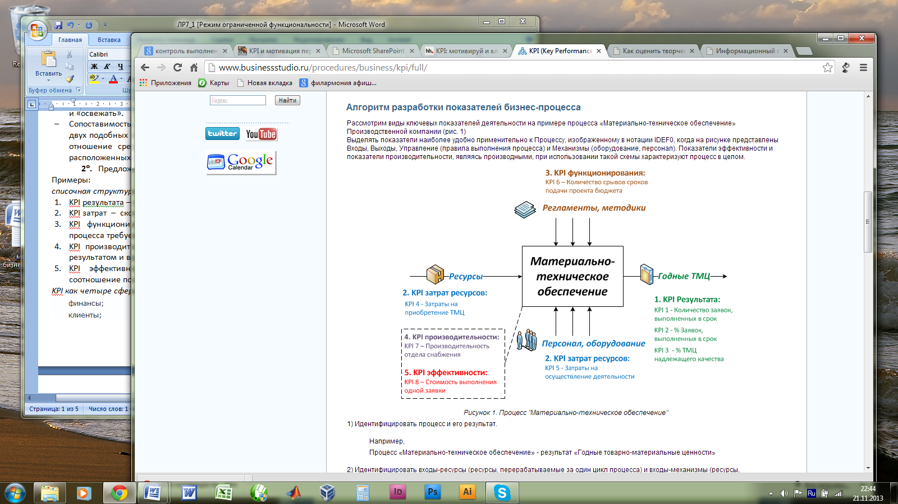

**Лабораторная работа №7. Интегральная оценка качества бизнес-процесса с
применением метрик**

**Цель:** Ознакомиться с методами интегральной оценки качества
бизнес-процесса

**Основные определения**

**1°.** KPI (Key Performance Indicator) -- это показатель достижения
успеха в определенной деятельности или в достижении определенных целей.
В управлении бизнес-процессами KPI являются измерителями
результативности, эффективности, производительности бизнес-процессов.
KPI рабочих процессов - набор метрик, определяемых для оценки
эффективности выполнения рабочих процессов в организации.
Соответствующие метрики определяются для каждого процесса и
декомпозируются на показатели для отдельных сотрудников, ролей,
подразделений и организации в целом. Помимо самой метрики, оценивающей
эффективность того или иного процесса, определяется ее целевое значение
и шкала оценки фактического показателя метрики к ее целевому значению.

К KPI предъявляются следующие требования:

-   Адресная принадлежность. Каждый KPI должен закрепляться за
    > конкретным сотрудником или группой из сферы бизнеса (далее --
    > пользователи), несущими ответственность за соответствующие
    > результаты.

-   Правильная ориентация. KPI должны быть привязаны к корпоративным
    > стратегическим целям, ключевым бизнес-процессам и проектам
    > развития.

-   Достижимость. Утвержденные показатели и нормативы должны быть
    > достижимы. Достижение цели должно быть связано с приложением
    > значительных усилий, но в то же время вероятность ее достижения
    > должна быть не менее 70 -- 80%.

-   Открытость к действиям. Значения KPI рассчитываются на основе
    > актуальных данных, то есть пользователи должны иметь возможность
    > вмешиваться в процессы, чтобы улучшить результаты работы, пока
    > время еще не упущено.

-   Обеспечение прогнозирования. KPI количественно оценивают факторы,
    > влияющие на стоимость бизнеса, то есть они являются показателями,
    > определяющими желательные будущие результаты.

-   Ограниченность. KPI должны фокусировать усилия исполнителей на
    > достижении нескольких высокоприоритетных задач, а не рассеивать их
    > на слишком многие предметы.

-   Легкость восприятия. KPI должны быть легкими для понимания.

-   Сбалансированность и взаимосвязанность. KPI должны быть
    > сбалансированы и «поддерживать» друг друга, а не конфликтовать
    > друг с другом.

-   Инициирование изменений. Измерения KPI должны вызывать в организации
    > цепную реакцию положительных изменений, особенно если за процессом
    > следит руководство компании.

-   Простота измерения. KPI должны быть понятны и доступны для измерения
    > пользователям.

-   Подкрепленность соответствующими индивидуальными стимулами.
    > Показатели должны способствовать мотивации пользователей.

-   Релевантность. Воздействие KPI со временем ослабевает, поэтому их
    > следует периодически пересматривать и «освежать».

-   Сопоставимость. KPI должны быть сопоставимыми, чтобы одни и те же
    > показатели можно было сравнить в двух подобных ситуациях.
    > Например, нельзя сравнивать значения такого показателя, как
    > средний чек (KPI -- отношение среднедневной выручки к количеству
    > чеков за день), для магазинов одного формата, но расположенных в
    > областном центре и «в глубинке».

**2°. Предложены различные подходы к структурированию совокупности** KPI
для бизнес-процессов. Примеры:

*списочная структура KPI*

1.  KPI результата -- сколько и какой результат произвели;

2.  KPI затрат -- сколько ресурсов было затрачено;

3.  KPI функционирования -- показатели выполнения бизнес-процессов
    > (позволяет оценить соответствие процесса требуемому алгоритму его
    > выполнения);

4.  KPI производительности -- производные показатели, характеризующие
    > соотношение между полученным результатом и временем, затраченным
    > на его получение;

5.  KPI эффективности (показатели эффективности) - это производные
    > показатели, характеризующие соотношение полученного результата к
    > затратам ресурсов.

*KPI как четыре сферы (проекции) сбалансированной системы показателей
(balanced scorecard -- BSC)*

финансы;

клиенты;

процессы;

персонал и развитие.

В свою очередь, KPI в каждой сфере должны быть конкретизированы,
например:

*KPI для процесса*

F. Финансы

F1. Доля операционных затрат процесса в обороте организации

F2. Степень выполнения бюджета процесса

F3. Стоимость выполнения процесса

F4. Эффективность процесса

C. Клиенты и продукты

C1. Результативность процесса

C2. Степень удовлетворенности внешнего/внутреннего клиента процесса

C3. Качество результата процесса

C4. Своевременность предоставления результата процесса

P. Бизнес-процессы

P1. Длительность выполнения процесса

P2. Доля простоев при выполнении процесса

P3. Качество выполнения процесса

P4. Степень организационной фрагментарности процесса

P5. Степень выполнения плана по улучшению процесса

R. Персонал и ресурсы

R1. Доля участников процесса соответствующих требованиям

R2. Степень удовлетворенности участников процесса

R3. Степень гибкости (универсальности, взаимозаменяемости) участников
процесса

R4. Степень автоматизации процесса

R5. Степень информационной фрагментарности процесса

*KPI для подразделения*

F. Финансы

F1. Доля операционных затрат отдела в обороте организации

F2. Степень выполнения бюджета отдела

C. Клиенты и продукты

C1. Результативность работы отдела

C2. Степень удовлетворенности внешнего/внутреннего клиента отдела

C3. Индекс SLA (Service Level Agreement) отдела

P. Бизнес-процессы

P1. Степень соблюдения регламентов отдела

P2. Степень выполнения планов работ отдела

R. Персонал и ресурсы

R1. Доля сотрудников отдела соответствующих требованиям

R2. Степень удовлетворенности сотрудников отдела

R3. Степень гибкости (универсальности, взаимозаменяемости) сотрудников
отдела

R4. Степень автоматизации процессов отдела

**3°. Рекомендуемое количество реально назначаемых KPI зависит от уровня
конкретного участника бизнес-процесса в организационной иерархии. Более
детально:**

-   **10-12 для генерального директора;**

-   **5-7 для департамента и его руководителя;**

-   **3-7 для отдела и его руководителя;**

-   **3-5 на индивидуальном уровне.**

**В целом среднее рекомендуемое количество KPI для одного сотрудника = 5
± 2.**

**4°. Выбранные KPI для каждого структурного уровня должны быть
согласованы, т.е. объединены в единый критерий.** Для оценки соотношения
важности отдельных **KPI** необходимо декомпозировать стратегические
приоритеты компании до уровня конкретного подразделения. При
взвешивании, то есть при выборе целей с большим весом, необходимо
ставить акцент именно на достижение стратегических целей конкретного
подразделения и KPI на ближайший период. Кроме того, полезны следующие
рекомендации:

-   **веса надо расставлять, начиная с более важных KPI.**

-   **KPI, соответствующие плохо измеряемым и нерелевантным целям,
    должны иметь относительно небольшой вес (15--20%).**

**При построении единого критерия возможны следующие принципы
объединения:**

**(1). свертка отдельных KPI q~1~(x), ..., q~i~(x), ..., q~p~(x),
i=1,\...,p, в один \"суперкритерий\" q~0~ путем введения аддитивной
функции**

,

**где -- весовые коэффициенты, отражающие вклад каждого частного
критерия в суперкритерий. Выбор коэффициентов осуществляется с точки
зрения вклада целей, соответствующих конкретному KPI, в стратегические
цели бизнеса в целом.**

**(2). Условная максимизация -- выделение основного KPI q~1~(x) и
нахождение его условного экстремума при условии, что дополнительные KPI
q~i~(x) не превосходят заданных уровней:**

.

**(3). Установление относительной важности отдельных KPI методом парных
сравнений с дальнейшим использованием принципа (1).**

**5°. Ниже приведены примеры построения KPI в соответствии с п. 2°**

**Пример 1. KPI для отдела рекламы и маркетинга**

+-------------+-------------+-------------+-------------+-------------+
| **[         | [Подр       | [Должность  | [KPI]{      | [Формула    |
| Перспектива | азделение]{ | с           | .underline} | расчета]{   |
| ф           | .underline} | отрудника]{ |             | .underline} |
| инансы.]{.u |             | .underline} |             |             |
| nderline}** |             |             |             |             |
|             |             |             |             |             |
| Учитываются |             |             |             |             |
| цели,       |             |             |             |             |
| связанные   |             |             |             |             |
| с *         |             |             |             |             |
| финансовыми |             |             |             |             |
| ре          |             |             |             |             |
| зультатами* |             |             |             |             |
| (ожиданиями |             |             |             |             |
| ру          |             |             |             |             |
| ководства). |             |             |             |             |
+=============+=============+=============+=============+=============+
|             | **Отдел     | Р           | Выполнение  | *((SVфакт.  |
|             | рекламы     | уководитель | плана       | /SVплан.) - |
|             | и м         | отдела      | по объему   | 1) х 100%,  |
|             | аркетинга** |             | продаж, %   | где         |
|             |             |             |             | SVфакт -    |
|             |             |             |             | объем       |
|             |             |             |             | продаж      |
|             |             |             |             | ф           |
|             |             |             |             | актический; |
|             |             |             |             | SVплан -    |
|             |             |             |             | объем       |
|             |             |             |             | продаж      |
|             |             |             |             | плановый.*  |
+-------------+-------------+-------------+-------------+-------------+
|             |             |             | Увеличение  | *((Vм.      |
|             |             |             | мар         | п./         |
|             |             |             | жинальности | Vобщ.)наст. |
|             |             |             | групп       | период -    |
|             |             |             | продуктов   | (Vм.        |
|             |             |             | к а         | п./         |
|             |             |             | налогичному | Vобщ.)прош. |
|             |             |             | периоду     | период)     |
|             |             |             | предыдущего | х 100%,     |
|             |             |             | года, %     | где Vм.     |
|             |             |             |             | п. - объем  |
|             |             |             |             | м           |
|             |             |             |             | аржинальной |
|             |             |             |             | продукции;  |
|             |             |             |             | V общ. -    |
|             |             |             |             | общий объем |
|             |             |             |             | продукции.* |
+-------------+-------------+-------------+-------------+-------------+
| **[         | **Отдел     | Р           | Мар         | *(Pпрод. -  |
| Перспектива | рекламы     | уководитель | жинальность | Pзаку       |
| к           | и м         | отдела      | марок       | п./Pзакуп.) |
| лиенты.]{.u | аркетинга** |             | (Процент    | х 100%, где |
| nderline}** |             |             | маржи), %   | Pпрод.      |
|             |             |             |             | - стоимость |
| Учитываются |             |             |             | продаж;     |
| цели и KPI, |             |             |             | Pзакуп. -   |
| которые     |             |             |             | стоимость   |
| связаны     |             |             |             | закупок     |
| с фактором  |             |             |             | продукции.* |
| «*удовле    |             |             |             |             |
| творенность |             |             |             |             |
| клиентов*», |             |             |             |             |
| в том числе |             |             |             |             |
| и н         |             |             |             |             |
| аправленные |             |             |             |             |
| на          |             |             |             |             |
|  устранение |             |             |             |             |
| недостатков |             |             |             |             |
| внутренних  |             |             |             |             |
| бизнес      |             |             |             |             |
| -процессов. |             |             |             |             |
+-------------+-------------+-------------+-------------+-------------+
|             |             |             | Уровень     | *(Nзн/Nопр) |
|             |             |             | знания      | х 100%, где |
|             |             |             | торговых    | Nзн -       |
|             |             |             | марок       | количество  |
|             |             |             | компании, % | опрошенных, |
|             |             |             |             | знающих     |
|             |             |             |             | торговую    |
|             |             |             |             | марку;      |
|             |             |             |             | Nопр -      |
|             |             |             |             | общее       |
|             |             |             |             | количество  |
|             |             |             |             | опрошенных  |
|             |             |             |             | пот         |
|             |             |             |             | ребителей.* |
+-------------+-------------+-------------+-------------+-------------+
|             |             |             | Изменения   | *Из отчета  |
|             |             |             | доли рынка  | внешних     |
|             |             |             | по маркам,  | ма          |
|             |             |             | %           | ркетинговых |
|             |             |             |             | агентств.*  |
+-------------+-------------+-------------+-------------+-------------+
|             |             |             | Значимое    | *((Nзн      |
|             |             |             | изменение   | /Nопр)наст. |
|             |             |             | знания      | пе          |
|             |             |             | марок, %    | риод - (Nзн |
|             |             |             |             | /Nопр)прош. |
|             |             |             |             | период))    |
|             |             |             |             | х 100%,*    |
|             |             |             |             |             |
|             |             |             |             | *где Nзн -  |
|             |             |             |             | количество  |
|             |             |             |             | опрошенных, |
|             |             |             |             | знающих     |
|             |             |             |             | торговую    |
|             |             |             |             | марку;      |
|             |             |             |             | Nопр -      |
|             |             |             |             | общее       |
|             |             |             |             | количество  |
|             |             |             |             | опрошенных  |
|             |             |             |             | пот         |
|             |             |             |             | ребителей.* |
+-------------+-------------+-------------+-------------+-------------+
|             |             |             | Количество  | *Nп/Nнп,    |
|             |             |             | запусков    | где Nп -    |
|             |             |             | новых       | количество  |
|             |             |             | продуктов,  | продуктов;  |
|             |             |             | шт.         | Nнп -       |
|             |             |             |             |  количество |
|             |             |             |             | новых       |
|             |             |             |             | продуктов.* |
+-------------+-------------+-------------+-------------+-------------+
|             |             |             | Отклонение  | *(          |
|             |             |             | доли новых  | (SVнов./SVо |
|             |             |             | продуктов   | бщ.)факт. - |
|             |             |             | в объеме    | (           |
|             |             |             | продаж      | (SVнов./SVо |
|             |             |             | о           | бщ.)план.)х |
|             |             |             | т плановой, | 100%, где   |
|             |             |             | %           | SVнов. -    |
|             |             |             |             | объем       |
|             |             |             |             | продаж      |
|             |             |             |             | новых       |
|             |             |             |             | продуктов   |
|             |             |             |             | (фа         |
|             |             |             |             | ктический и |
|             |             |             |             | плановый);  |
|             |             |             |             | SVобщ. -    |
|             |             |             |             | общий объем |
|             |             |             |             | продаж      |
|             |             |             |             | (           |
|             |             |             |             | фактический |
|             |             |             |             | и           |
|             |             |             |             | плановый).* |
+-------------+-------------+-------------+-------------+-------------+
|             |             | Маркетолог  | Доля рынка  | *Из отчета  |
|             |             |             | по маркам,  | внешних     |
|             |             |             | %           | ма          |
|             |             |             |             | ркетинговых |
|             |             |             |             | агентств.*  |
+-------------+-------------+-------------+-------------+-------------+
|             |             |             | Оценка      | *Анке       |
|             |             |             | дилеров,    | тирование.* |
|             |             |             | балл        |             |
+-------------+-------------+-------------+-------------+-------------+
| **[         | **Отдел     | Р           | Отклонение  | *((Nпп/     |
| Перспектива | рекламы     | уководитель | роста       | Nобщ.)наст. |
| пр          | и м         | отдела      | продаж      | пер         |
| оцессы.]{.u | аркетинга** |             | групп       | иод - (Nпп/ |
| nderline}** |             |             | продуктов   | Nобщ.)прош. |
|             |             |             | о           | период))    |
| Учитываются |             |             | т планового | х 100%, где |
| показатели, |             |             | роста, %    | Nпп - объем |
| характер    |             |             |             | продаж      |
| изующие *эф |             |             |             | продукции   |
| фективность |             |             |             | о           |
| ключевых    |             |             |             | пределяемой |
| бизн        |             |             |             | группы;     |
| ес-процессо |             |             |             | Nо          |
| в*компании, |             |             |             | бщ. - общий |
| по          |             |             |             | объем       |
| дразделения |             |             |             | продаж.*    |
| или         |             |             |             |             |
| должности.  |             |             |             |             |
+-------------+-------------+-------------+-------------+-------------+
|             |             |             | Суммарный   | *(SVнизкопр |
|             |             |             | вес         | од./SVобщ.) |
|             |             |             | низко       | х 100%, где |
|             |             |             | продаваемых | SVн         |
|             |             |             | продуктов   | изкопрод. - |
|             |             |             | в общем     | объем       |
|             |             |             | объеме      | продаж      |
|             |             |             | продаж, %   | низко       |
|             |             |             |             | продаваемых |
|             |             |             |             | продуктов;  |
|             |             |             |             | SVобщ. -    |
|             |             |             |             | общий объем |
|             |             |             |             | продаж.*    |
+-------------+-------------+-------------+-------------+-------------+
|             |             |             | Доля        | *(Nбр/Nасс) |
|             |             |             | брендов     | х 100%, где |
|             |             |             | в а         | Nбр - доля  |
|             |             |             | ссортименте | п           |
|             |             |             | п           | роизводимых |
|             |             |             | роизводимых | и           |
|             |             |             | и           | реализуемых |
|             |             |             | реализуемых | брендов;    |
|             |             |             | продуктов,  | Nасс - весь |
|             |             |             | %           | ассортимент |
|             |             |             |             | п           |
|             |             |             |             | роизводимой |
|             |             |             |             | и           |
|             |             |             |             | реализуемой |
|             |             |             |             | продукции.* |
+-------------+-------------+-------------+-------------+-------------+
|             |             |             | Процент     | *(Nнал      |
|             |             |             | наличия     | ич./Nплан.) |
|             |             |             | фокусного   | х 100%, где |
|             |             |             | а           | Nналич. -   |
|             |             |             | ссортимента | количество  |
|             |             |             | в ключевых  | фокусного   |
|             |             |             | точках      | ас          |
|             |             |             | продаж, %   | сортимента, |
|             |             |             |             | н           |
|             |             |             |             | аходящегося |
|             |             |             |             | в наличии   |
|             |             |             |             | в ключевых  |
|             |             |             |             | точках      |
|             |             |             |             | продаж;     |
|             |             |             |             | Nплан.      |
|             |             |             |             |  - плановое |
|             |             |             |             | количество  |
|             |             |             |             | фокусного   |
|             |             |             |             | ас          |
|             |             |             |             | сортимента, |
|             |             |             |             | которое     |
|             |             |             |             | должно быть |
|             |             |             |             | в ключевых  |
|             |             |             |             | точках      |
|             |             |             |             | продаж.*    |
+-------------+-------------+-------------+-------------+-------------+

**Пример 2.** **KPI для процесса материально-технического снабжения**

{width="5.416666666666667in"
height="3.78125in"}

**Задания на работу**

> 1\. Для сценариев обработки объектов управления ЕСМ, сформированных в
> лабораторной работе №5, предложить набор **KPI.**
>
> Для получения справок по построению **KPI** можно использовать ресурсы
> Интернет
>
> <http://planetahr.ru/publication/3321>
>
> <http://www.sitebuilder.ru/sharepointKPI.htm>
>
> <http://lib.rus.ec/b/218866/read>
>
> 2\. Проверить соответствие предложенных **KPI требованиям п. 1°**.
>
> 3\. Для каждого из предложенных **KPI составить формулу расчета** (см.
> п. **5°, пример 1).**
>
> **4. Задать входящие в формулы п. 3 количественные значения
> коэффициентов, проведя экспертную оценку деятельности подразделения.**
>
> 4\. Построить единый критерий эффективности структурного подразделения
> (см. п. **4°).**
>
> **5. Проверить эффективность разработанной системы KPI в условиях
> действия исключений, выявленных в лабораторных работах** №5, 6.
