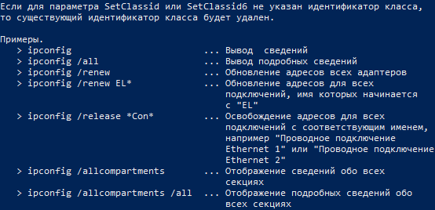
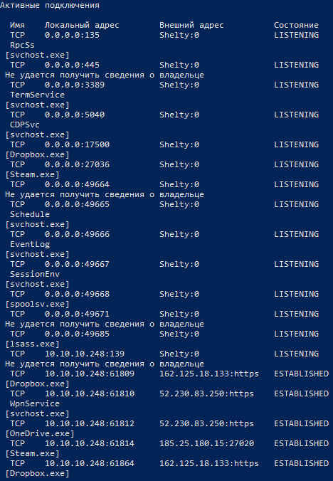
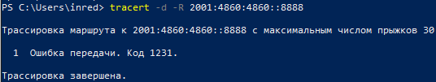

МИНИСТЕРСТВО ОБРАЗОВАНИЯ И НАУКИ РОССИЙСКОЙ ФЕДЕРАЦИИ\
ФЕДЕРАЛЬНОЕ ГОСУДАРСТВЕННОЕ АВТОНОМНОЕ ОБРАЗОВАТЕЛЬНОЕ УЧРЕЖДЕНИЕ
ВЫСШЕГО ОБРАЗОВАНИЯ

«Санкт-Петербургский национальный исследовательский университет

информационных технологий, механики и оптики»

Факультет информационных технологий и программирования

Кафедра информационных систем

Лабораторная работа № 1

Изучение функциональных возможностей сетевых утилит командной строки

> Выполнил студент группы M3205\
> Ивницкий Алексей
>
> Проверил:
>
> Аксенов Владимир Олегович

САНКТ--ПЕТЕРБУРГ\
2018

Цель работы: Формирование представлений о функциональных возможностях
основных сетевых утилит, доступных через командную строку в ОС Windows
или через терминал в ОС Linux.

1\. arp

{width="5.697916666666667in"
height="5.104166666666667in"}

*Рис. 1.1 -- "arp вывод без параметра"*

*Рис. 1.2 -- "arp вывод с параметром справки" -- аналогично рис. 1.1*

Таблица 1.1.1 -- Параметры сетевой утилиты arp

+----------+----------+----------+----------+----------+----------+
| **Группа |          |          |          |          |          |
| пара     |          |          |          |          |          |
| метров** |          |          |          |          |          |
+==========+==========+==========+==========+==========+==========+
| **1      | **2      |          |          |          |          |
| группа   | группа   |          |          |          |          |
| --       | --       |          |          |          |          |
| п        | п        |          |          |          |          |
| араметры | араметры |          |          |          |          |
| нас      | отобр    |          |          |          |          |
| тройки** | ажения** |          |          |          |          |
+----------+----------+----------+----------+----------+----------+
| **№      | **Обозн  | **Назн   | **№      | **Обозн  | **Назн   |
| п\\п**   | ачение** | ачение** | п\\п**   | ачение** | ачение** |
+----------+----------+----------+----------+----------+----------+
| **1**    | **-d**   | Удаляет  | **1**    | **-a**   | От       |
|          |          | за       |          |          | ображает |
|          |          | даваемый |          |          | текущие  |
|          |          | узел     |          |          | ARP      |
|          |          |          |          |          | -записи, |
|          |          |          |          |          | о        |
|          |          |          |          |          | прашивая |
|          |          |          |          |          | текущие  |
|          |          |          |          |          | данные   |
|          |          |          |          |          |          |
|          |          |          |          |          | п        |
|          |          |          |          |          | ротокола |
+----------+----------+----------+----------+----------+----------+
| **2**    | **-s**   | Д        | **2**    | **-g**   | То же,   |
|          |          | обавляет |          |          | что и    |
|          |          | узел и   |          |          | параметр |
|          |          | с        |          |          | -a       |
|          |          | вязывает |          |          |          |
|          |          | адрес в  |          |          |          |
|          |          | И        |          |          |          |
|          |          | нтернете |          |          |          |
|          |          | с        |          |          |          |
|          |          | фи       |          |          |          |
|          |          | зическим |          |          |          |
+----------+----------+----------+----------+----------+----------+
|          |          |          | **3**    | **-v**   | От       |
|          |          |          |          |          | ображает |
|          |          |          |          |          | текущие  |
|          |          |          |          |          | AR       |
|          |          |          |          |          | P-записи |
|          |          |          |          |          | в режиме |
|          |          |          |          |          | подр     |
|          |          |          |          |          | обного \ |
|          |          |          |          |          | протокол |
|          |          |          |          |          | ирования |
+----------+----------+----------+----------+----------+----------+

Таблица 1.1.2 -- Значения параметров 1 группы сетевой утилиты arp

  **№ п\\п**   **Обозначение параметра**   **Значение параметра**
  ------------ --------------------------- ---------------------------------------
  **1**        **-s**                      inet\_addreth\_addr \[if\_addr\]
  **2**        **-d**                      inet\_addr \[if\_addr\]
  **3**        **-a**                      \[inet\_addr\] \[-N if\_addr\] \[-v\]

Обозначения: inet\_addr Определяет IP-адрес.

-   -N if\_addr Отображает ARP-записи для заданного в if\_addr сетевого

> интерфейса.

-   eth\_addr Определяет физический адрес.

-   if\_addr Если параметр задан, он определяет адрес интерфейса в

> Интернете, чья таблица преобразования адресов должна
>
> измениться. Если параметр не задан, будет использован
>
> первый доступный интерфейс.
>
> {width="4.31196084864392in"
> height="3.0829483814523186in"}\
> Рис. 1.3.1 -- arp с параметром -a и параметром -d
>
> {width="4.270299650043745in"
> height="1.1977668416447944in"}\
> Рис. 1.3.1 -- arp с параметром -a

У arp отсутствуют сочетаемые параметры

*\
*

*2.ipconfig*

{width="5.124359142607174in"
height="4.634837051618548in"}*\
Рис. 2.1 -- "ipconfig вывод без параметра"*

{width="5.728450349956256in"
height="5.405574146981627in"}\
{width="5.7701115485564305in"
height="2.791317804024497in"}*\
Рис. 2.2 -- "ipconfig вывод с параметром справки"*

Таблица 2.1.1 -- Параметры сетевой утилиты ipconfig

+----------+----------+----------+----------+----------+----------+
| **Группа |          |          |          |          |          |
| пара     |          |          |          |          |          |
| метров** |          |          |          |          |          |
+==========+==========+==========+==========+==========+==========+
| **1      | **2      |          |          |          |          |
| группа   | группа   |          |          |          |          |
| --       | --       |          |          |          |          |
| п        | п        |          |          |          |          |
| араметры | араметры |          |          |          |          |
| нас      | отобр    |          |          |          |          |
| тройки** | ажения** |          |          |          |          |
+----------+----------+----------+----------+----------+----------+
| **№      | **Обозн  | **Назн   | **№      | **Обозн  | **Назн   |
| п\\п**   | ачение** | ачение** | п\\п**   | ачение** | ачение** |
+----------+----------+----------+----------+----------+----------+
| **1**    | **/r     | Осво     | **1**    | **/?**   | Вывод    |
|          | elease** | бождение |          |          | спр      |
|          |          | адреса   |          |          | авочного |
|          |          | IPv4 для |          |          | с        |
|          |          | ук       |          |          | ообщения |
|          |          | азанного |          |          |          |
|          |          | адаптера |          |          |          |
+----------+----------+----------+----------+----------+----------+
| **2**    | **/re    | Ан       | **2**    | **/all** | От       |
|          | lease6** | алогично |          |          | ображает |
|          |          | **/rele  |          |          | со       |
|          |          | ase**для |          |          | держимое |
|          |          | адреса   |          |          | кэша     |
|          |          | IPv6     |          |          | сопостав |
|          |          |          |          |          | ителяDNS |
+----------+----------+----------+----------+----------+----------+
| **3**    | **       | Об       | **3**    | **/showc | Ото      |
|          | /renew** | новление |          | lassid** | бражение |
|          |          | адреса   |          |          | всех     |
|          |          | IPv4 для |          |          | до       |
|          |          | ук       |          |          | пустимых |
|          |          | азанного |          |          | для      |
|          |          | адпатера |          |          | этого    |
|          |          |          |          |          | адаптера |
|          |          |          |          |          |          |
|          |          |          |          |          | идентиф  |
|          |          |          |          |          | икаторов |
|          |          |          |          |          | классов  |
|          |          |          |          |          | DHCP.    |
+----------+----------+----------+----------+----------+----------+
| **4**    | **/      | Ан       | **4**    | *        | Ан       |
|          | renew6** | алогично |          | */showcl | алогично |
|          |          | **/re    |          | assid6** | **/showc |
|          |          | new**для |          |          | lassid** |
|          |          | адреса   |          |          | для      |
|          |          | IPv6     |          |          | кассов   |
|          |          |          |          |          | DHCPIPv6 |
+----------+----------+----------+----------+----------+----------+
| **5**    | **/fl    | Очистка  |          |          |          |
|          | ushdns** | кэша     |          |          |          |
|          |          | сопостав |          |          |          |
|          |          | ителяDNS |          |          |          |
+----------+----------+----------+----------+----------+----------+
| **6**    | **/regis | Об       |          |          |          |
|          | terdns** | новление |          |          |          |
|          |          | всех     |          |          |          |
|          |          | DH       |          |          |          |
|          |          | CP-аренд |          |          |          |
|          |          | и        |          |          |          |
|          |          | перерег  |          |          |          |
|          |          | истрация |          |          |          |
|          |          | DNS-имен |          |          |          |
+----------+----------+----------+----------+----------+----------+
| **7**    | **/setc  | И        |          |          |          |
|          | lassid** | зменение |          |          |          |
|          |          | иденти   |          |          |          |
|          |          | фикатора |          |          |          |
|          |          | класса   |          |          |          |
|          |          | DHCP     |          |          |          |
+----------+----------+----------+----------+----------+----------+
| **8**    | **/setcl | А        |          |          |          |
|          | assid6** | налогичн |          |          |          |
|          |          | о**/setc |          |          |          |
|          |          | lassid** |          |          |          |
|          |          | для IPv6 |          |          |          |
+----------+----------+----------+----------+----------+----------+

Таблица 2.1.2 -- Значения параметров 1 группы сетевой утилиты ipconfig

  **№ п\\п**   **Обозначение параметра**   **Значение параметра**
  ------------ --------------------------- ----------------------------------------------
  **1**        **/renew**                  \[Имя подключения\]
  **2**        **/renew6**                 \[Имя подключения\]
  **3**        **/release**                \[Имя подключения\]
  **4**        **/release6**               \[Имя подключения\]
  **5**        **/showclassid**            Имя подключения
  **6**        **/setclassid**             Имя подключения \[идентификатор\_класса\]
  **7**        **/showclassid6**           Имя подключения
  **8**        **/setclassid6**            Имя подключения \[идентификатор\_класса\] \]

{width="6.405449475065617in"
height="5.270174978127734in"}*\
Рис. 2.3.1 - ipconfig с параметром /renew*

{width="6.45752624671916in"
height="4.811898512685914in"}*\
Рис. 2.3.2 - ipconfig с параметром /release*

{width="6.415865048118985in"
height="5.561804461942257in"}*\
Рис. 2.3.3 - ipconfig с параметром /renew6*

{width="6.374202755905512in"
height="1.1456900699912511in"}*\
Рис. 2.3.4 - ipconfig с параметром /release6*

{width="6.496527777777778in"
height="1.363888888888889in"}*\
Рис. 2.3.5 - ipconfig с параметром /showclassid \**

{width="6.496527777777778in"
height="1.0951388888888889in"}*\
Рис. 2.3.6 - ipconfig с параметром /setclassid \**

{width="6.496527777777778in"
height="1.5868055555555556in"}*\
Рис. 2.3.7 - ipconfig с параметром /showclassid6 \**

{width="6.496527777777778in"
height="1.3173611111111112in"}*\
Рис. 2.3.8 - ipconfig с параметром /setclassid6 \**

*\
*

3\. netstat

{width="5.811773840769904in"
height="6.113818897637795in"}\
Рис 3.1 - «netstat вывод без параметра»

Таблица 3.1.1 -- Параметры сетевой утилиты netstat

+----------+----------+----------+----------+----------+----------+
| **Группа |          |          |          |          |          |
| пара     |          |          |          |          |          |
| метров** |          |          |          |          |          |
+==========+==========+==========+==========+==========+==========+
| **1      | **2      |          |          |          |          |
| группа   | группа   |          |          |          |          |
| --       | --       |          |          |          |          |
| п        | п        |          |          |          |          |
| араметры | араметры |          |          |          |          |
| нас      | отобр    |          |          |          |          |
| тройки** | ажения** |          |          |          |          |
+----------+----------+----------+----------+----------+----------+
| **№      | **Обозн  | **Назн   | **№      | **Обозн  | **Назн   |
| п\\п**   | ачение** | ачение** | п\\п**   | ачение** | ачение** |
+----------+----------+----------+----------+----------+----------+
|          |          |          | **1**    | **-a**   | Ото      |
|          |          |          |          |          | бражение |
|          |          |          |          |          | всех     |
|          |          |          |          |          | под      |
|          |          |          |          |          | ключений |
|          |          |          |          |          | и        |
|          |          |          |          |          | о        |
|          |          |          |          |          | жидающих |
|          |          |          |          |          | портов   |
+----------+----------+----------+----------+----------+----------+
|          |          |          | **2**    | **-b**   | Ото      |
|          |          |          |          |          | бражение |
|          |          |          |          |          | испо     |
|          |          |          |          |          | лняемого |
|          |          |          |          |          | файла,   |
|          |          |          |          |          | учас     |
|          |          |          |          |          | твующего |
|          |          |          |          |          | в        |
|          |          |          |          |          | создании |
|          |          |          |          |          |          |
|          |          |          |          |          | каждого  |
|          |          |          |          |          | подк     |
|          |          |          |          |          | лючения, |
|          |          |          |          |          | или      |
|          |          |          |          |          | ож       |
|          |          |          |          |          | идающего |
|          |          |          |          |          | порта    |
+----------+----------+----------+----------+----------+----------+
|          |          |          | **3**    | **-e**   | Ото      |
|          |          |          |          |          | бражение |
|          |          |          |          |          | ст       |
|          |          |          |          |          | атистики |
|          |          |          |          |          | Ethernet |
+----------+----------+----------+----------+----------+----------+
|          |          |          | **4**    | **-f**   | Ото      |
|          |          |          |          |          | бражение |
|          |          |          |          |          | полного  |
|          |          |          |          |          | имени    |
|          |          |          |          |          | домена   |
|          |          |          |          |          | (FQDN)   |
|          |          |          |          |          | для      |
|          |          |          |          |          | внешних  |
|          |          |          |          |          | адресов  |
+----------+----------+----------+----------+----------+----------+
|          |          |          | **5**    | **-n**   | Ото      |
|          |          |          |          |          | бражение |
|          |          |          |          |          | адресов  |
|          |          |          |          |          | и        |
|          |          |          |          |          | номеров  |
|          |          |          |          |          | портов в |
|          |          |          |          |          | числовом |
|          |          |          |          |          | формате  |
+----------+----------+----------+----------+----------+----------+
|          |          |          | **6**    | **-o**   | Ото      |
|          |          |          |          |          | бражение |
|          |          |          |          |          | кода     |
|          |          |          |          |          | (ID)     |
|          |          |          |          |          | процесса |
|          |          |          |          |          | каждого  |
|          |          |          |          |          | под      |
|          |          |          |          |          | ключения |
+----------+----------+----------+----------+----------+----------+
|          |          |          | **7**    | **-p**   | Протокол |
|          |          |          |          |          | Ото      |
|          |          |          |          |          | бражение |
|          |          |          |          |          | под      |
|          |          |          |          |          | ключений |
|          |          |          |          |          | для      |
|          |          |          |          |          | пр       |
|          |          |          |          |          | отокола, |
|          |          |          |          |          | за       |
|          |          |          |          |          | даваемых |
|          |          |          |          |          | этим     |
|          |          |          |          |          |          |
|          |          |          |          |          | па       |
|          |          |          |          |          | раметром |
+----------+----------+----------+----------+----------+----------+
|          |          |          | **8**    | **-r**   | Ото      |
|          |          |          |          |          | бражение |
|          |          |          |          |          | сод      |
|          |          |          |          |          | ержимого |
|          |          |          |          |          | таблицы  |
|          |          |          |          |          | м        |
|          |          |          |          |          | аршрутов |
+----------+----------+----------+----------+----------+----------+
|          |          |          | **9**    | **-s**   | Ото      |
|          |          |          |          |          | бражение |
|          |          |          |          |          | ст       |
|          |          |          |          |          | атистики |
|          |          |          |          |          | п        |
|          |          |          |          |          | ротокола |
+----------+----------+----------+----------+----------+----------+
|          |          |          | **10**   | **-t**   | Ото      |
|          |          |          |          |          | бражение |
|          |          |          |          |          | текущего |
|          |          |          |          |          | под      |
|          |          |          |          |          | ключения |
|          |          |          |          |          | в        |
|          |          |          |          |          | с        |
|          |          |          |          |          | остоянии |
|          |          |          |          |          | \"o      |
|          |          |          |          |          | ffload\" |
+----------+----------+----------+----------+----------+----------+

Таблица 3.1.2 -- Значения параметров 1 группы сетевой утилиты netstat

  **№ п\\п**   **Обозначение параметра**   **Значение параметра**
  ------------ --------------------------- ------------------------
  **1**        **-p**                      Протокол

Допустимые значения протокола: IP, IPv6, ICMP, ICMPv6, TCP, TCPv6, UDP
или UDPv6

{width="4.749406167979003in"
height="0.4270297462817148in"}\
Рис. 3.3.1 -- netstat с параметром -p IP

Таблица 3.2 - параметры сетевой утилиты netstat

+----------+----------+----------+----------+----------+----------+
| **Группа |          |          |          |          |          |
| пара     |          |          |          |          |          |
| метров** |          |          |          |          |          |
+==========+==========+==========+==========+==========+==========+
| **1      | > **2    |          |          |          |          |
| группа 1 | > группа |          |          |          |          |
| кат      | > 1      |          |          |          |          |
| егория** | > кат    |          |          |          |          |
|          | егория** |          |          |          |          |
+----------+----------+----------+----------+----------+----------+
| **№      | **Обозн  | **Назн   | **№      | **Обозн  | **Назн   |
| п\\п**   | ачение** | ачение** | п\\п**   | ачение** | ачение** |
+----------+----------+----------+----------+----------+----------+
| 1        | -a -b    | получить | 1        |          |          |
|          |          | список   |          |          |          |
|          |          | всех     |          |          |          |
|          |          | сетевых  |          |          |          |
|          |          | со       |          |          |          |
|          |          | единений |          |          |          |
|          |          | и        |          |          |          |
|          |          | с        |          |          |          |
|          |          | вязанных |          |          |          |
|          |          | с ними   |          |          |          |
|          |          | п        |          |          |          |
|          |          | рограмм. |          |          |          |
+----------+----------+----------+----------+----------+----------+
| 2        | -e -v    | кроме    | 2        |          |          |
|          |          | с        |          |          |          |
|          |          | уммарной |          |          |          |
|          |          | ста      |          |          |          |
|          |          | тистики, |          |          |          |
|          |          | отоб     |          |          |          |
|          |          | ражается |          |          |          |
|          |          | ин       |          |          |          |
|          |          | формация |          |          |          |
|          |          | об       |          |          |          |
|          |          | обмене   |          |          |          |
|          |          | данными  |          |          |          |
|          |          | через    |          |          |          |
|          |          | о        |          |          |          |
|          |          | тдельные |          |          |          |
|          |          | сетевые  |          |          |          |
|          |          | инт      |          |          |          |
|          |          | ерфейсы. |          |          |          |
+----------+----------+----------+----------+----------+----------+
| 3        | -e -s    | допол    |          |          |          |
|          |          | нительно |          |          |          |
|          |          | к        |          |          |          |
|          |          | ст       |          |          |          |
|          |          | атистике |          |          |          |
|          |          | E        |          |          |          |
|          |          | thernet, |          |          |          |
|          |          | отоб     |          |          |          |
|          |          | ражается |          |          |          |
|          |          | ст       |          |          |          |
|          |          | атистика |          |          |          |
|          |          | для      |          |          |          |
|          |          | пр       |          |          |          |
|          |          | отоколов |          |          |          |
|          |          | IP ,     |          |          |          |
|          |          | ICMP ,   |          |          |          |
|          |          | TCP ,    |          |          |          |
|          |          | UDP      |          |          |          |
+----------+----------+----------+----------+----------+----------+
| 4        | \[-a     | Ото      |          |          |          |
|          | \]\[-b\] | бражение |          |          |          |
|          |          | для      |          |          |          |
|          | \[-f     | зад      |          |          |          |
|          | \]\[-n\] | аваемого |          |          |          |
|          | \[-o\]-p | п        |          |          |          |
|          |          | ротокола |          |          |          |
+----------+----------+----------+----------+----------+----------+
| **5**    | **\[     | Ото      |          |          |          |
|          | -n\|-f\| | бражение |          |          |          |
|          | -v\|-t\] | адресов  |          |          |          |
|          | -o**     | и        |          |          |          |
|          |          | номеров  |          |          |          |
|          |          | портов в |          |          |          |
|          |          | числовом |          |          |          |
|          |          | формате  |          |          |          |
|          |          | вместе c |          |          |          |
|          |          | PID.     |          |          |          |
+----------+----------+----------+----------+----------+----------+

{width="4.874390857392826in"
height="7.040786307961505in"}\
Рис. 3.5.1 - netstat -ab

{width="4.22863845144357in"
height="6.363788276465442in"}\
Рис. 3.5.2 - netstat -ev

{width="4.207807305336833in"
height="7.15535542432196in"}\
Рис. 3.5.3 - netstat -es

{width="4.186976159230096in"
height="4.22863845144357in"}\
Рис. 3.5.4 - netstat -esp ICMP

{width="5.561804461942257in"
height="4.968128827646544in"}\
Рис. 3.5.5 - netstat -no*\
*

*4. ping*

{width="5.780527121609799in"
height="5.853435039370079in"}*\
Рис 4.1 - «ping вывод без параметра»*

{width="5.780527121609799in"
height="5.895096237970254in"}*\
Рис 4.2- «ping вывод с параметром справки»*

Таблица 4.1.1 -- Параметры сетевой утилиты ping

+----------+----------+----------+----------+----------+----------+
| **Группа |          |          |          |          |          |
| пара     |          |          |          |          |          |
| метров** |          |          |          |          |          |
+==========+==========+==========+==========+==========+==========+
| **1      | **2      |          |          |          |          |
| группа   | группа   |          |          |          |          |
| --       | --       |          |          |          |          |
| п        | п        |          |          |          |          |
| араметры | араметры |          |          |          |          |
| нас      | отобр    |          |          |          |          |
| тройки** | ажения** |          |          |          |          |
+----------+----------+----------+----------+----------+----------+
| **№      | **Обозн  | **Назн   | **№      | **Обозн  | **Назн   |
| п\\п**   | ачение** | ачение** | п\\п**   | ачение** | ачение** |
+----------+----------+----------+----------+----------+----------+
| **1**    | **-t**   | Проверка |          |          |          |
|          |          | связи с  |          |          |          |
|          |          | у        |          |          |          |
|          |          | казанным |          |          |          |
|          |          | узлом    |          |          |          |
+----------+----------+----------+----------+----------+----------+
| **2**    | **-a**   | Опр      |          |          |          |
|          |          | еделение |          |          |          |
|          |          | имен     |          |          |          |
|          |          | узлов по |          |          |          |
|          |          | адресам  |          |          |          |
+----------+----------+----------+----------+----------+----------+
| **3**    | **-n**   | Число    |          |          |          |
|          |          | отпр     |          |          |          |
|          |          | авляемых |          |          |          |
|          |          | запросов |          |          |          |
|          |          | эха      |          |          |          |
+----------+----------+----------+----------+----------+----------+
| **4**    | **-l**   | Размер   |          |          |          |
|          |          | буфера   |          |          |          |
|          |          | отправки |          |          |          |
+----------+----------+----------+----------+----------+----------+
| **5**    | **-f**   | У        |          |          |          |
|          |          | становка |          |          |          |
|          |          | запрета  |          |          |          |
|          |          | фраг     |          |          |          |
|          |          | ментации |          |          |          |
|          |          | для IPv4 |          |          |          |
+----------+----------+----------+----------+----------+----------+
| **6**    | **-i**   | Задание  |          |          |          |
|          |          | срока    |          |          |          |
|          |          | жизни    |          |          |          |
|          |          | пакетов  |          |          |          |
+----------+----------+----------+----------+----------+----------+
| **7**    | **-v**   | Задание  |          |          |          |
|          |          | типа     |          |          |          |
|          |          | службы   |          |          |          |
+----------+----------+----------+----------+----------+----------+
| **8**    | **-r**   | Запись   |          |          |          |
|          |          | маршрута |          |          |          |
|          |          | для      |          |          |          |
|          |          | ук       |          |          |          |
|          |          | азанного |          |          |          |
|          |          | числа    |          |          |          |
|          |          | прыжков  |          |          |          |
+----------+----------+----------+----------+----------+----------+
| **9**    | **-s**   | Отметка  |          |          |          |
|          |          | времени  |          |          |          |
|          |          | для      |          |          |          |
|          |          | ук       |          |          |          |
|          |          | азанного |          |          |          |
|          |          | числа    |          |          |          |
|          |          | прыжков  |          |          |          |
+----------+----------+----------+----------+----------+----------+
| **10**   | **-j**   | С        |          |          |          |
|          |          | вободный |          |          |          |
|          |          | выбор    |          |          |          |
|          |          | маршрута |          |          |          |
|          |          | по       |          |          |          |
|          |          | списку   |          |          |          |
|          |          | узлов    |          |          |          |
+----------+----------+----------+----------+----------+----------+
| **11**   | **-k**   | Жесткий  |          |          |          |
|          |          | выбор    |          |          |          |
|          |          | маршрута |          |          |          |
|          |          | по       |          |          |          |
|          |          | списку   |          |          |          |
|          |          | узлов    |          |          |          |
+----------+----------+----------+----------+----------+----------+
| **12**   | **-w**   | Тайм-аут |          |          |          |
|          |          | для      |          |          |          |
|          |          | каждого  |          |          |          |
|          |          | ответа   |          |          |          |
+----------+----------+----------+----------+----------+----------+
| **13**   | **-R**   | Испол    |          |          |          |
|          |          | ьзование |          |          |          |
|          |          | з        |          |          |          |
|          |          | аголовка |          |          |          |
|          |          | для      |          |          |          |
|          |          | проверки |          |          |          |
|          |          | также и  |          |          |          |
|          |          |          |          |          |          |
|          |          | о        |          |          |          |
|          |          | братного |          |          |          |
|          |          | маршрута |          |          |          |
+----------+----------+----------+----------+----------+----------+
| **14**   | **-S**   | Испо     |          |          |          |
|          |          | льзуемый |          |          |          |
|          |          | адрес    |          |          |          |
|          |          | и        |          |          |          |
|          |          | сточника |          |          |          |
+----------+----------+----------+----------+----------+----------+
| **15**   | **-4**   | Принуд   |          |          |          |
|          |          | ительное |          |          |          |
|          |          | Испол    |          |          |          |
|          |          | ьзование |          |          |          |
|          |          | IPv4     |          |          |          |
+----------+----------+----------+----------+----------+----------+
| **16**   | **-6**   | Принуд   |          |          |          |
|          |          | ительное |          |          |          |
|          |          | Испол    |          |          |          |
|          |          | ьзование |          |          |          |
|          |          | IPv6     |          |          |          |
+----------+----------+----------+----------+----------+----------+

Таблица 4.1.2 -- Значения параметров 1 группы сетевой утилиты ping

  **№ п\\п**   **Обозначение параметра**   **Значение параметра**
  ------------ --------------------------- ------------------------
  **1**        **-n**                      Число
  **2**        **-l**                      Размер
  **3**        **-i**                      TTL
  **4**        **-v**                      TOS
  **5**        **-r**                      Число
  **6**        **-s**                      Число
  **7**        **-j**                      Список узлов
  **8**        **-k**                      Список узлов
  **9**        **-w**                      Тайм-аут
  **10**       **-S**                      Адрес источника

Обозначения:

-   TTL -- Time To Live

-   TOS -- Type Of System

{width="4.905636482939633in"
height="1.7497812773403325in"}*\
Рис 4.3.1 - ping с параметром -n 5*

{width="4.916052055993001in"
height="1.6039665354330708in"}*\
Рис 4.3.2 - ping с параметром -l 5*

{width="4.999375546806649in"
height="1.3123359580052494in"}*\
Рис 4.3.3 - ping с параметром -i 5*

{width="4.895220909886264in"
height="1.6247965879265092in"}*\
Рис 4.3.4 - ping с параметром -v 100*

{width="4.0619925634295715in"
height="1.333167104111986in"}*\
Рис 4.3.5 - ping с параметром -r 9*

{width="4.020330271216098in"
height="1.333167104111986in"}*\
Рис 4.3.6 - ping с параметром -s 4*

{width="4.041161417322835in"
height="1.333167104111986in"}*\
Рис 4.3.7 - ping с параметром -j 192.168.43.1*

{width="4.0619925634295715in"
height="1.3123359580052494in"}*\
Рис 4.3.8 - ping с параметром -k 192.168.43.1*

{width="4.999375546806649in"
height="1.6039665354330708in"}*\
Рис 4.3.9 - ping с параметром -w 10*

{width="4.624421478565179in"
height="1.3123359580052494in"}*\
Рис 4.3.10 - ping с параметром -S 192.168.43.1*

Таблица 4.2 - параметры сетевой утилиты Ping

+----------+----------+----------+----------+----------+----------+
| **Группа |          |          |          |          |          |
| пара     |          |          |          |          |          |
| метров** |          |          |          |          |          |
+==========+==========+==========+==========+==========+==========+
| **1      | > **2    |          |          |          |          |
| группа 1 | > группа |          |          |          |          |
| кат      | > 1      |          |          |          |          |
| егория** | > кат    |          |          |          |          |
|          | егория** |          |          |          |          |
+----------+----------+----------+----------+----------+----------+
| **№      | **Обозн  | **Назн   | **№      | **Обозн  | **Назн   |
| п\\п**   | ачение** | ачение** | п\\п**   | ачение** | ачение** |
+----------+----------+----------+----------+----------+----------+
|          |          |          | **1**    | **-\[t   | **Все    |
|          |          |          |          | \|n\<чис | переч    |
|          |          |          |          | ло\>\]l\ | исленные |
|          |          |          |          | <число\> | п        |
|          |          |          |          | i\<TTL\> | араметры |
|          |          |          |          | v\       | в        |
|          |          |          |          | <TOS\>** | ыполняют |
|          |          |          |          |          | свои     |
|          |          |          |          | **w\     | функции  |
|          |          |          |          | <таймаут | однов    |
|          |          |          |          | \>f\[k\| | рменно** |
|          |          |          |          | j\<списо |          |
|          |          |          |          | к\>\]ar\ |          |
|          |          |          |          | <число\> |          |
|          |          |          |          | s\<ч     |          |
|          |          |          |          | исло\>** |          |
+----------+----------+----------+----------+----------+----------+

{width="5.718034776902887in"
height="3.812023184601925in"}*\
*Рис. 4.5.1 *ping -t -l 10 -a -f -i 50 -v 2 -w 10 8.8.8.8*

*\
*

{width="5.790942694663167in"
height="5.572220034995626in"}{width="5.665958005249344in"
height="4.686913823272091in"}*\
Рис 5.1 - «route вывод без параметра»*

{width="5.665958005249344in"
height="4.686913823272091in"}*\
Рис 5.2- «route вывод с параметром справки»*

Таблица 5.1.1 -- Параметры сетевой утилиты route

+----------+----------+----------+----------+----------+----------+
| **Группа |          |          |          |          |          |
| пара     |          |          |          |          |          |
| метров** |          |          |          |          |          |
+==========+==========+==========+==========+==========+==========+
| **1      | **2      |          |          |          |          |
| группа   | группа   |          |          |          |          |
| --       | --       |          |          |          |          |
| п        | п        |          |          |          |          |
| араметры | араметры |          |          |          |          |
| нас      | отобр    |          |          |          |          |
| тройки** | ажения** |          |          |          |          |
+----------+----------+----------+----------+----------+----------+
| **№      | **Обозн  | **Назн   | **№      | **Обозн  | **Назн   |
| п\\п**   | ачение** | ачение** | п\\п**   | ачение** | ачение** |
+----------+----------+----------+----------+----------+----------+
| **1**    | **       | Удаление | **1**    | **-f**   | Очистка  |
|          | DELETE** | маршрута |          |          | таблиц   |
|          |          |          |          |          | м        |
|          |          |          |          |          | аршрутов |
|          |          |          |          |          | от       |
|          |          |          |          |          | записей  |
|          |          |          |          |          | всех     |
|          |          |          |          |          | шлюзов   |
+----------+----------+----------+----------+----------+----------+
| **2**    | **       | И        | **2**    | **-p**   | Задает   |
|          | CHANGE** | зменение |          |          | со       |
|          |          | сущес    |          |          | хранение |
|          |          | твующего |          |          | маршрута |
|          |          | маршрута |          |          |          |
|          |          |          |          |          | при      |
|          |          |          |          |          | пере     |
|          |          |          |          |          | загрузке |
|          |          |          |          |          | системы  |
+----------+----------+----------+----------+----------+----------+
| **3**    | **ADD**  | До       | **3**    | *        | Печать   |
|          |          | бавление |          | *PRINT** | маршрута |
|          |          | маршрута |          |          |          |
+----------+----------+----------+----------+----------+----------+
|          |          |          |          | **-4**   | Обяз     |
|          |          |          |          |          | ательное |
|          |          |          |          |          | испол    |
|          |          |          |          |          | ьзование |
|          |          |          |          |          | п        |
|          |          |          |          |          | ротокола |
|          |          |          |          |          | IPv4.    |
+----------+----------+----------+----------+----------+----------+
|          |          |          |          | **-6**   | Ан       |
|          |          |          |          |          | алогично |
|          |          |          |          |          | -4 для   |
|          |          |          |          |          | IPv6     |
+----------+----------+----------+----------+----------+----------+

Таблица 5.1.2 -- Значения параметров 1 группы сетевой утилиты route

+------------+---------------------------+---------------------------+
| **№ п\\п** | **Обозначение параметра** | **Значение параметра**    |
+============+===========================+===========================+
| **1**      | **ADD**                   | \[destination\]           |
|            |                           |                           |
|            |                           | \[MASK netmask\]          |
|            |                           | \[gateway\] \[METRIC      |
|            |                           | metric\] \[IF interface\] |
+------------+---------------------------+---------------------------+
| **2**      | **DELETE**                | \[destination\]           |
|            |                           |                           |
|            |                           | \[MASK netmask\]          |
|            |                           | \[gateway\] \[METRIC      |
|            |                           | metric\] \[IF interface\] |
+------------+---------------------------+---------------------------+
| **3**      | **CHANGE**                | \[destination\]           |
|            |                           |                           |
|            |                           | \[MASK netmask\]          |
|            |                           | \[gateway\] \[METRIC      |
|            |                           | metric\] \[IF interface\] |
+------------+---------------------------+---------------------------+
| **4**      | **PRINT**                 | \[destination\]           |
|            |                           |                           |
|            |                           | \[MASK netmask\]          |
|            |                           | \[gateway\] \[METRIC      |
|            |                           | metric\] \[IF interface\] |
+------------+---------------------------+---------------------------+

Обозначение:

-   CHANGE Изменение существующего маршрута 

-   destination Адресуемый узел. 

-   MASK Указывает, что следующий параметр интерпретируется как маска \
    сети. 

-   netmask Значение маски подсети для записи данного маршрута. \
    Если этот параметр не задан, по умолчанию используется \
    значение 255.255.255.255. 

-   gateway Шлюз. 

-   interface Номер интерфейса для указанного маршрута. 

-   METRIC Определение метрики, т.е. цены для адресуемого узла.

{width="6.082573272090989in"
height="6.249219160104987in"}*\
Рис 5.3.1 - route с параметром print*

{width="2.812148950131234in"
height="0.31246062992125984in"}*\
Рис 5.3.2 - route с параметром DELETE \**

Таблица 5.2 - параметры сетевой утилиты route

+----------+----------+----------+----------+----------+----------+
| **Группа |          |          |          |          |          |
| пара     |          |          |          |          |          |
| метров** |          |          |          |          |          |
+==========+==========+==========+==========+==========+==========+
| **1      | > **2    |          |          |          |          |
| группа 1 | > группа |          |          |          |          |
| кат      | > 1      |          |          |          |          |
| егория** | > кат    |          |          |          |          |
|          | егория** |          |          |          |          |
+----------+----------+----------+----------+----------+----------+
| **№      | **Обозн  | **Назн   | **№      | **Обозн  | **Назн   |
| п\\п**   | ачение** | ачение** | п\\п**   | ачение** | ачение** |
+----------+----------+----------+----------+----------+----------+
|          |          |          | **1**    | **PRINT  | от       |
|          |          |          |          | -4**     | образить |
|          |          |          |          |          | таблицу  |
|          |          |          |          |          | м        |
|          |          |          |          |          | аршрутов |
|          |          |          |          |          | только   |
|          |          |          |          |          | для IPv4 |
+----------+----------+----------+----------+----------+----------+
|          |          |          | **2**    | **PRINT  | от       |
|          |          |          |          | -6**     | образить |
|          |          |          |          |          | таблицу  |
|          |          |          |          |          | м        |
|          |          |          |          |          | аршрутов |
|          |          |          |          |          | только   |
|          |          |          |          |          | для IPv6 |
+----------+----------+----------+----------+----------+----------+

{width="6.082573272090989in"
height="2.749656605424322in"}*\
Рис. 5.5.1 - route PRINT -4*

{width="6.0721576990376205in"
height="2.3226268591426074in"}*\
Рис. 5.5.2 - route PRINT -6*

*\
*

*6. tracert*

{width="5.645127952755906in"
height="1.781026902887139in"}*\
Рис 6.1- «tracert вывод без параметра»\
Рис 6.2- «tracert вывод с параметром справки»*

Таблица 6.1.1 -- Параметры сетевой утилиты tracert

  **Группа параметров**                                                                                                                                   
  ------------------------------------- --------------------------------------- ------------------------------------------ ------------ ----------------- --------------------------------------------
  **1 группа -- параметры настройки**   **2 группа -- параметры отображения**                                                                             
  **№ п\\п**                            **Обозначение**                         **Назначение**                             **№ п\\п**   **Обозначение**   **Назначение**
  **1**                                 **-d**                                  Без разрешения в имена узлов.              **1**        **-h**            Максимальное число прыжков при поиске узла
  **2**                                 **-j**                                  Свободный выбор маршрута по списку узлов   **2**        **-w**            Таймаут каждого ответа в миллисекундах
  **3**                                 **-R**                                  Трассировка пути                                                          
  **4**                                 **-S**                                  Используемый адрес источника                                              
  **5**                                 **-4**                                  Принудительное использование IPv4                                         
  **6**                                 **-6**                                  Аналогично -4 для IPv6                                                    

Таблица 6.1.2 -- Значения параметров 1 группы сетевой утилиты tracert

  **№ п\\п**   **Обозначение параметра**   **Значение параметра**
  ------------ --------------------------- ------------------------
  **1**        **-h**                      Максимальное число
  **2**        **-j**                      Список узлов
  **3**        **-w**                      Таймаут
  **4**        **-S**                      Адрес источника

{width="5.218098206474191in"
height="1.4477362204724409in"}*\
Рис 6.3.1 - tracert с параметром -h 5*

{width="5.2493438320209975in"
height="2.6559175415573053in"}*\
Рис 6.3.2 - tracert с параметром -j 20*

{width="5.270174978127734in"
height="2.312211286089239in"}*\
Рис 6.3.3 - tracert с параметром -w 10*

{width="4.697329396325459in"
height="0.31246062992125984in"}*\
Рис 6.3.4 - tracert с параметром -S 91.122.108.1*

Таблица 6.2 - параметры сетевой утилиты tracert

+----------+----------+----------+----------+----------+----------+
| **Группа |          |          |          |          |          |
| пара     |          |          |          |          |          |
| метров** |          |          |          |          |          |
+==========+==========+==========+==========+==========+==========+
| **1      | > **2    |          |          |          |          |
| группа 1 | > группа |          |          |          |          |
| кат      | > 1      |          |          |          |          |
| егория** | > кат    |          |          |          |          |
|          | егория** |          |          |          |          |
+----------+----------+----------+----------+----------+----------+
| **№      | **Обозн  | **Назн   | **№      | **Обозн  | **Назн   |
| п\\п**   | ачение** | ачение** | п\\п**   | ачение** | ачение** |
+----------+----------+----------+----------+----------+----------+
| **1**    | **-d -R  |          | **1**    | **-h     | Макс     |
|          | -6**     |          |          | -w**     | имальное |
|          |          |          |          |          | число    |
|          |          |          |          |          | прыжков  |
|          |          |          |          |          | при      |
|          |          |          |          |          | заданном |
|          |          |          |          |          | таймауте |
|          |          |          |          |          | ответа   |
+----------+----------+----------+----------+----------+----------+
| **2**    | **-d     |          |          |          |          |
|          | -R**     |          |          |          |          |
+----------+----------+----------+----------+----------+----------+
| **3**    | **-d -j  |          |          |          |          |
|          | -4**     |          |          |          |          |
+----------+----------+----------+----------+----------+----------+

{width="5.603465660542432in"
height="1.0311209536307961in"}*\
Рис. 6.5.1 -- «tracert -d -R -6»*

{width="5.582635608048994in"
height="1.051952099737533in"}*\
Рис. 6.5.2 -- «tracert -d -R»*

{width="5.228512685914261in"
height="2.218472222222222in"}*\
Рис. 6.5.2 -- «tracert -d -j -4»*

*\
*

Вывод: В ходе выполнения лабораторной работы были изучены следующие
сетевые утилиты: Arp, Ipconfig, Netstat, Ping, Route, Tracert. Они
предназначены для произведения анализа и настройки сетевых подключений.
Посредством параметров можно получать дополнительные сведения или
настраивать их вывод. Таким образом можно установить значения для
широковещательного адреса, dns-сервера, маски подсети, маршрутов.

Используя утилиту без каких-либо параметров, мы получаем краткую справку
по её использованию. Так же информацию об использовании интересующей
утилиты можно получить используя специальный параметр справки.
Посредством параметров настройки можно настраивать сетевые параметры.
Запуская утилиту с параметром отображения позволяет настроить
отображение произведённой выборки данных. Параметры разделяются на
отображения и настройки, отвечающие за особенности представления
результатов и определяющие определённые настройки производимого
соединения с узлом, соответственно. Сами же параметры дополнительно
разделяются на совместные, которые можно использовать одновременно, для
достижения необходимого вида и параметров работы утилиты, и
несовместные, корректная одновременная работа которых не возможна.
