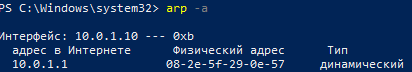
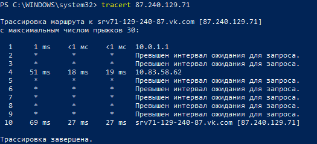

МИНИСТЕРСТВО ОБРАЗОВАНИЯ И НАУКИ РОССИЙСКОЙ ФЕДЕРАЦИИ\
ФЕДЕРАЛЬНОЕ ГОСУДАРСТВЕННОЕ АВТОНОМНОЕ ОБРАЗОВАТЕЛЬНОЕ УЧРЕЖДЕНИЕ
ВЫСШЕГО ОБРАЗОВАНИЯ

«Санкт-Петербургский национальный исследовательский университет

информационных технологий, механики и оптики»

Факультет информационных технологий и программирования

Кафедра информационных систем

Лабораторная работа № 3

Изучение принципов удаленного управления устройствами сетей связи

> Выполнил студент группы M3205\
> Ивницкий Алексей
>
> Проверил:
>
> Аксенов Владимир Олегович

САНКТ--ПЕТЕРБУРГ\
2018**\
**

**Сценарий 1**

{width="5.927083333333333in"
height="2.6875in"}

Рис. 1.1 - «Сетевые параметры компьютера DESKTOP-PCRUHN5»

{width="4.34375in"
height="1.6458333333333333in"}

Рис. 1.2 - «Сетевые устройства в локальной сети»

{width="4.75in"
height="1.9166666666666667in"}

Рис. 1.3 - «Проверка доступности 10.0.1.1»

{width="4.083333333333333in"
height="1.6041666666666667in"}

Рис. 1.4 - «Проверка доступности 10.0.1.255»

Таблица 1.1 -- Сетевые параметры

  Устройство   \[Шлюз\] 10.0.1.1                       
  ------------ ------------------- ------------------- -----------------------------------
  №            Сетевой параметр    Значение            Назначение
  1            Адрес в интернете   10.0.1.1            Адрес устройства в локальной сети
  2            Физический адрес    08-2e-5f-29-0e-57   Mac-адрес устройства
  3            Тип                 динамический        Может меняться

Таблица 1.2 -- Доступность узла

+---+--------------------------+-------------------------+---------------+
| № | Сетевой адрес устройства | Доменное имя устройства | Среднее время |
|   |                          |                         |               |
|   |                          |                         | приема-       |
|   |                          |                         |               |
|   |                          |                         | передачи, мс  |
+===+==========================+=========================+===============+
| 1 | 10.0.1.1                 | \-                      | 0             |
+---+--------------------------+-------------------------+---------------+

**Сценарий 2**

{width="5.90625in"
height="2.6979166666666665in"}

Рис. 2.1 - «Сетевые параметры компьютера»

{width="4.291666666666667in"
height="0.75in"}

Рис. 2.2 - «Сетевые параметры маршрутизатора»

> {width="5.614583333333333in"
> height="2.6354166666666665in"}\
> Рис. 2.3 - «Маршрутизация на устройстве DESKTOP-PCRUHN5»

{width="4.71875in" height="1.90625in"}

Рис. 2.4 - «Проверка доступности шлюза 10.0.1.1 DNS-сервера 10.0.1.1»

{width="4.979166666666667in"
height="1.9479166666666667in"}

Рис. 2.5 - «Проверка доступности 173.194.222.100»

{width="4.9375in" height="1.90625in"}

Рис. 2.6 - «Проверка доступности 87.240.129.71»

{width="5.427083333333333in"
height="4.229166666666667in"}

Рис. 2.7 - «Сетевые устройства между DESKTOP-PCRUHN5 и 173.194.222.100»

{width="5.46875in" height="2.5in"}

Рис. 2.8 - «Сетевые устройства между DESKTOP-PCRUHN5 и 87.240.129.71»

  №   Сетевой адрес устройства   Доменное имя устройства   Среднее время приёма-передачи, мс
  --- -------------------------- ------------------------- -----------------------------------
  1   10.0.1.10                  \-                        0
  2   173.194.222.100            google.com                26
  3   87.240.129.71              vk.com                    18

Таблица 2.1 -- Доступность узла

{width="4.90625in"
height="1.3541666666666667in"}

Рис. 3.1 - «Netstat соединения по loopback»

{width="4.947916666666667in"
height="8.041666666666666in"}

Рис. 3.2 - «Netstat соединения по TCP»

{width="4.833333333333333in"
height="0.78125in"}

Рис. 3.3 - «Netstat соединения по UDP»

Таблица 2.2

  №   Название параметра        Значение параметра    
  --- ------------------------- --------------------- ----------------
                                TCP-соединение        UDP-соединение
  1   Сетевой адрес локальный   2 столбец до ":"      \-
  2   Порт локальный            2 столбец после ":"   \-
  3   Сетевой адрес внешний     3 столбец до ":"      \-
  4   Порт внешний              3 столбец после ":"   \-
  5   Состояние                 4 столбец             \-

{width="5.177083333333333in"
height="7.135416666666667in"}

Рис. 4.1 - «Google Chrome соединения по TCP»

{width="4.916666666666667in"
height="0.7708333333333334in"}

Рис. 4.2 - «Google Chrome соединения по UDP»

{width="5.5in"
height="8.479166666666666in"}

Рис. 4.3 - «Microsoft Edge соединения по TCP»

{width="4.927083333333333in"
height="0.7604166666666666in"}

Рис. 4.4 - «Microsoft Edge соединения по UDP»

> {width="4.947916666666667in"
> height="2.1354166666666665in"}**\
> **Сайт: google.com

Рис. 4.5 - «Google Chrome соединения по TCP две копии»

{width="4.791666666666667in"
height="0.7708333333333334in"}

Рис. 4.6 - «Google Chrome соединения по UDP две копии»

> {width="4.78125in"
> height="4.239583333333333in"}**\
> **Сайты: google.com, github.com

Рис. 4.7 - «Google Chrome соединения по TCP несколько сайтов»

{width="5.385416666666667in"
height="0.7916666666666666in"}

Рис. 4.8 - «Google Chrome соединения по UDP несколько сайтов»

**Вывод**

1.  ipconfig

    a.  Тип интерфейса зависит от сетевой карты

    b.  Обязательные параметры подключения:

        -   DNS-суффикс подключения

        -   состояние среды

        -   описание

        -   физический адрес

        -   статус Автонастройки

        -   статус DHCP

    c.  По наличию маршрутизатора можно определить наличие выхода в сеть
        > у интерфейса

2.  arp

    a.  Используется протокол ARP

    b.  Динамический адрес добавляется при опросе узла самой утилитой.
        Статический адрес добавляется при ручном добавлении узла

    c.  Широковещательный адрес всегда будет в таблице для любого
        сетевого интерфейса

3.  ping

    a.  Используется протокол ICMP

    b.  Разница в использовании для проводных/беспроводных соединений
        заключается в максимально допустимом размере пакета

    c.  ring -r, где -r ограничивает количество прыжков

4.  netstat

    a.  С помощью этой утилиты можно вывести все соединения и посчитать
        их количество

    b.  Для выхода в глобальную сеть используются порты 80 (http) и 443
        (https)

    c.  Адрес 0.0.0.0 - специальный шлюз, который может заменять любой
        IP адрес. Так же на этот адрес отправляют пакеты, если
        невозможно отправить по другим маршрутам.

5.  route

    a.  По умолчанию в утилите 1 маршрут

    b.  Для добавления дополнительных адресов в таблицу, необходимо
        использовать route ADD, указав адрес, маску и шлюз

    c.  Таблицу маршрутизации можно посмотреть, используя netstat -r
