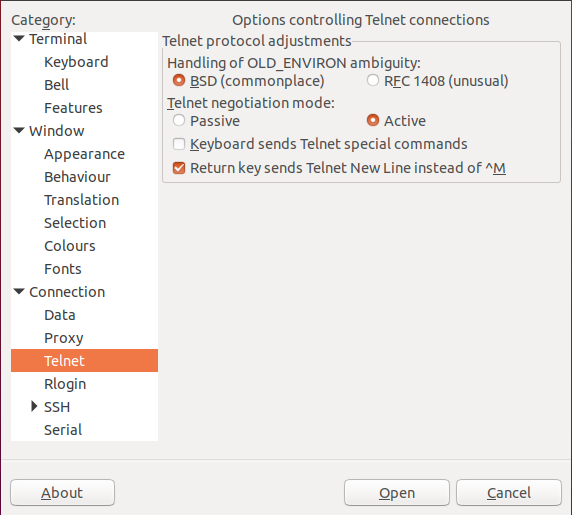
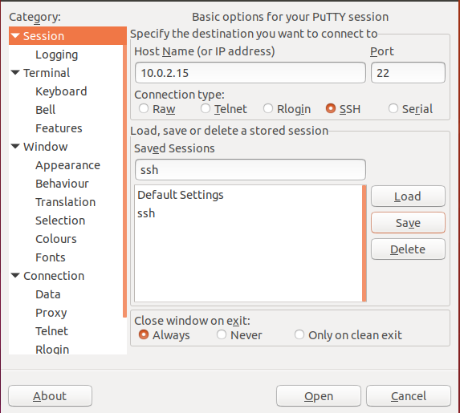

МИНИСТЕРСТВО ОБРАЗОВАНИЯ И НАУКИ РОССИЙСКОЙ ФЕДЕРАЦИИ\
ФЕДЕРАЛЬНОЕ ГОСУДАРСТВЕННОЕ АВТОНОМНОЕ ОБРАЗОВАТЕЛЬНОЕ УЧРЕЖДЕНИЕ
ВЫСШЕГО ОБРАЗОВАНИЯ

«Санкт-Петербургский национальный исследовательский университет

информационных технологий, механики и оптики»

Факультет информационных технологий и программирования

Кафедра информационных систем

Лабораторная работа № 3

Изучение принципов удаленного управления устройствами сетей связи

> Выполнил студент группы M3205\
> Ивницкий Алексей
>
> Проверил:
>
> Аксенов Владимир Олегович

САНКТ--ПЕТЕРБУРГ\
2018

{width="5.947916666666667in"
height="4.583333333333333in"}

Рис. 1 - «Сетевые параметры для организации сеанса управления по
протоколу Telnet»

{width="5.958333333333333in"
height="4.572916666666667in"}

Рис. 2 - «Дополнительные параметры соединения по протоколу Telnet»

{width="5.9375in"
height="4.614583333333333in"}

Рис. 3 - «Настройки записи сеанса управления по протоколу Telnet в
журнал событий»

{width="6.489583333333333in"
height="0.20833333333333334in"}

Рис. 4 - «Таблица сетевых соединений протокол Telnet»

Таблица 1 -- Соединение по протоколу Telnet

  **№**   **Название устройства**   **Сетевой адрес устройства**   **Название протокола**   **Номер порта**   **Роль агента, реализующего протокол**
  ------- ------------------------- ------------------------------ ------------------------ ----------------- ----------------------------------------
  1       ПК                        10.0.2.4                       telnet                   netstat           Клиент
  2       Сервер                    10.0.2.15                      telnet                   23                Cервер

{width="5.96875in"
height="4.604166666666667in"}

Рис. 5 - «Cетевые параметры для организации сеанса управления по
протоколу SSH»

{width="5.96875in"
height="4.614583333333333in"}

Рис. 6 - «Дополнительные параметры соединения по протоколу SSH»

{width="5.947916666666667in"
height="4.59375in"}

Рис. 7 - «Дополнительные параметры соединения по протоколу SSH»

{width="5.947916666666667in"
height="4.583333333333333in"}

Рис. 8 - «Дополнительные параметры соединения по протоколу SSH»

{width="5.958333333333333in"
height="4.572916666666667in"}

Рис. 9 - «Настройки записи сеанса управления по протоколу SSH в журнал
событий»

{width="6.489583333333333in"
height="0.1875in"}

Рис. 10 - «Таблица сетевых соединений протокол SSH»

Таблица 2 -- Соединение по протоколу ssh

  **№**   **Название устройства**   **Сетевой адрес устройства**   **Название протокола**   **Номер порта**   **Роль агента, реализующего протокол**
  ------- ------------------------- ------------------------------ ------------------------ ----------------- ----------------------------------------
  1       ПК                        10.0.2.4                       ssh                      netstat           Клиент
  2       Сервер                    10.0.2.15                      ssh                      22                Сервер

{width="6.496527777777778in"
height="3.77923009623797in"}

Рис. 11 - «Информация файла журнала событий
Telnet\_Session\_Logging.log»

{width="6.489583333333333in"
height="3.59375in"}

Рис. 12 - «Информация файла журнала событий SSH\_Session\_Logging.log»

**\
**

**Вывод**

Особенности организации удаленного управления устройствами сетей связи

-   Организация удаленного управления предусматривает выполнение
    > следующих шагов:

1.  Проверка настроек брандмауэра

2.  Проверка настроек сервера --- разрешение доступа по SSH

3.  Открыть порт для внешнего подключения

-   Необходимо выполнять записи в журнал событий для отслеживания и
    > исправления ошибок.

-   Удаленное управление через небезопасные сетевые соединения

    -   Telnet используется для организации небезопасных сетевых
        > соединений

    -   Отсутствие параметров безопасности в Telnet:

        -   Шифрование

        -   Проверка подлинности данных

-   Удаленное управление через безопасные сетевые соединения

    -   SSH используется для организации безопасных сетевых соединений

    -   Параметры безопасности SSH

        -   Шифрование

        -   Запрет на удалённый root-доступ

        -   Запрет подключения с пустым паролем или отключения входа по
            > паролю

        -   Ограничение списка IP-адресов, с которых разрешён доступ

        -   Проверка подлинности данных
