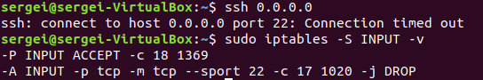
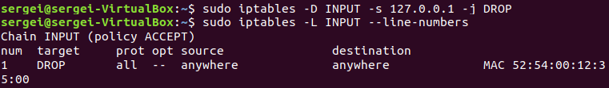

МИНИСТЕРСТВО ОБРАЗОВАНИЯ И НАУКИ РОССИЙСКОЙ ФЕДЕРАЦИИ\
ФЕДЕРАЛЬНОЕ ГОСУДАРСТВЕННОЕ АВТОНОМНОЕ ОБРАЗОВАТЕЛЬНОЕ УЧРЕЖДЕНИЕ
ВЫСШЕГО ОБРАЗОВАНИЯ

«Санкт-Петербургский национальный исследовательский университет

информационных технологий, механики и оптики»

Факультет информационных технологий и программирования

Кафедра информационных систем

Лабораторная работа № 4

Исследование основных способов обеспечения безопасности в сетях связи

> Выполнил студент группы M3205\
> Ивницкий Алексей
>
> Проверил:
>
> Аксенов Владимир Олегович

САНКТ--ПЕТЕРБУРГ\
2018

1.  Установить пакет iptables и включить его

Уже был предустановлен и включён, поэтому приведём его версию.

{width="3.9375in" height="0.375in"}

Рис. 1 - «Включение iptables»

2.  Отображение списка правил

{width="6.489583333333333in"
height="1.78125in"}

> Рис. 2.1 - «Список правил таблицы filter»

{width="6.489583333333333in"
height="2.4375in"}

> Рис. 2.2 - «Список правил таблицы nat»

{width="6.489583333333333in"
height="3.1041666666666665in"}

Рис. 2.3 - «Список правил таблицы mangle»

3.  Настройка политики по умолчанию

> Изменить политику по умолчанию для проходящего трафика. Проверить
> отработку команды через отображение списка правил.

{width="6.489583333333333in"
height="2.0in"}

Рис. 3 - «Изменение политики по умолчанию на DROP»

4.  Настройка входящих подключений

    a.  Фильтрация трафика по порту источника (iptables --t filter --A
        > INPUT --p \<протокол\> \--sport \<номер порта\> -j DROP).
        > Написать правило, блокирующее произвольный порт.

{width="6.489583333333333in"
height="0.15625in"}

Рис. 4.1.1 - «Входящее подключение. Блокировка порта 22»

{width="6.489583333333333in"
height="0.5416666666666666in"}

Рис. 4.1.2 - «Входящее подключение. Блокировка порта 22. Проверка 1»

{width="5.666666666666667in"
height="0.9375in"}

Рис. 4.1.3 - «Входящее подключение. Блокировка порта 22. Проверка 2»

b.  Фильтрация трафика по сетевому адресу (iptables --t filter --A INPUT
    > --s \<сетевой адрес источника\> -j DROP). Написать правило,
    > отбрасывающее пакеты пришедшие с \<сетевой адрес\>.

{width="6.489583333333333in"
height="2.03125in"}

Рис. 4.2.1 - «Входящее подключение. Блокировка сетевого адреса источника
127.0.0.1»

> Рис. 4.2.2 - «Входящее подключение. Блокировка сетевого адреса
> источника 127.0.0.1. Проверка1»
>
> Рис. 4.2.3 - «Входящее подключение. Блокировка сетевого адреса
> источника 127.0.0.1. Проверка 2»

c.  Фильтрация трафика по физическому адресу (iptables --t filter --A
    > INPUT --m mac --mac-source \<физический адрес\> -j DROP). Написать
    > правило отбрасывающее все пакеты, отправленные с маршрутизатора.

{width="6.489583333333333in"
height="3.0729166666666665in"}

> Рис. 4.3.1 - «Входящее подключение. Блокировка физического адреса
> источника 52:54:00:12:35:00»
>
> Рис. 4.3.2 - «Входящее подключение. Блокировка физического адреса
> источника 52:54:00:12:35:00. Проверка 2»
>
> Рис. 4.3.3 - «Входящее подключение. Блокировка физического адреса
> источника 52:54:00:12:35:00. Проверка 2»

5.  Настройка исходящих подключений

    a.  Фильтрация трафика по порту назначения (iptables --t filter --A
        > OUTPUT --p udp --dport \<номер порта\> -j DROP). Написать
        > правило отбрасывающее все пакеты, используемые утилитой
        > traceroute по умолчанию.

{width="6.489583333333333in"
height="0.1875in"}

> Рис. 5.1.1 - «Исходящее подключение. Блокировка портов назначения 443»

{width="6.375in"
height="5.666666666666667in"}

Рис. 5.1.2 - «Исходящее подключение. Блокировка портов назначения 443.
Проверка 1»

{width="6.5in"
height="0.5104166666666666in"}

Рис. 5.1.3 - «Исходящее подключение. Блокировка портов назначения 443.
Проверка 2»

b.  Фильтрация трафика по сетевому адресу (iptables --t filter --A
    > OUTPUT --d \<сетевой адрес\> -j DROP). Написать правило,
    > отбрасывающее пакеты, отправленные на маршрутизатор.

{width="6.489583333333333in"
height="0.1875in"}

> Рис. 5.2.1 - «Исходящее подключение. Блокировка сетевого адреса
> назначения 8.8.8.8»

{width="6.1875in" height="2.90625in"}

> Рис. 5.2.2 - «Исходящее подключение. Блокировка сетевого адреса
> назначения 8.8.8.8. Проверка 1»

{width="5.166666666666667in"
height="0.7604166666666666in"}

> Рис. 5.2.3 - «Исходящее подключение. Блокировка сетевого адреса
> назначения 8.8.8.8. Проверка 2»

c.  Фильтрация по физическому адресу (iptables --t filter --A OUTPUT --m
    > --mac-destination \<физический адрес\> -j DROP). Написать правило
    > отбрасывающее все пакеты, отправленные на устройство из локальной
    > сети.

{width="6.5in"
height="0.7604166666666666in"}

> Рис. 5.3.1 - «Входящее подключение. Блокировка физического адреса
> источника 52:54:00:12:35:00»\
> Так как блокировка по физическому адресу не удалась, проверки 1 и 2 не
> проводились.

6.  Удаление правил в iptables

    a.  Удаление правила по номеру (iptables-D \<цепочка\> \<номер
        > правила\>). Удалить первое правило с цепочки INPUT таблицы
        > filter.

{width="6.489583333333333in"
height="1.0625in"}

> Рис. 6.1 - «Удаление правила по номеру»

b.  Удаление правила по адресу источника (iptables --D \<цепочка\> -s
    > \<сетевой адрес\> -j \<политика\>).

{width="6.489583333333333in"
height="0.9479166666666666in"}

Рис. 6.2 - «Удаление правила по адресу источника 127.0.0.1»

c.  Удалить все правила с таблицы (iptables --t \<таблица\> -F).
    > Отчистить произвольную таблицу.

{width="6.46875in" height="1.3125in"}

Рис. 6.3 - «Удаление всех правил таблицы filter»

**Вывод**

**Особенности обеспечения безопасности в сетях связи**

1.  Процедура обеспечения безопасности в сетях связи заключается в
    правильной настройке фильтров трафика. Фильтрация трафика --
    отсечение части трафика по какому-либо признаку. Фильтрация трафика
    позволяет отсеять нежелательный или вредоносный контент.

2.  Для обеспечения безопасности применяются инструменты такие как:
    брандмауэр, таблицы правил фильтрации.

**Структура и функции инструментов**

1.  При поступлении пакета на сетевую карту сначала происходит
    фильтрация на сетевом уровне (по протоколам ICMP, IPv4/6 и др),
    далее на транспортном уровне (TCP, UDP и др), и, наконец, на уровне
    приложений (IMAP, HTTP, SMTP и др).

2.  Фильтрация: Пропуск пакета (allow), отброс пакета (deny), отброс с
    оповещением отправителя (reject)
