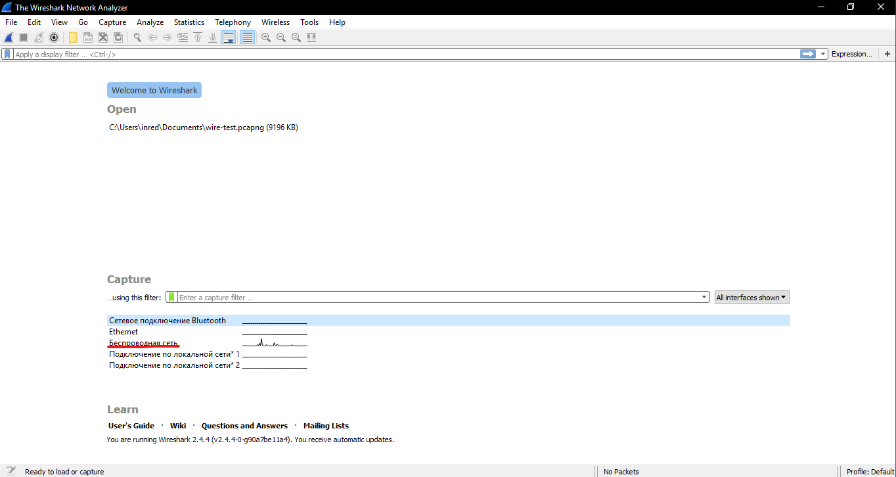
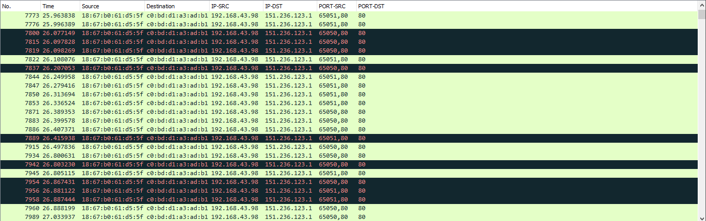
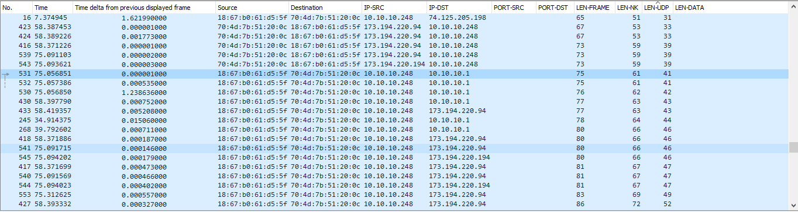
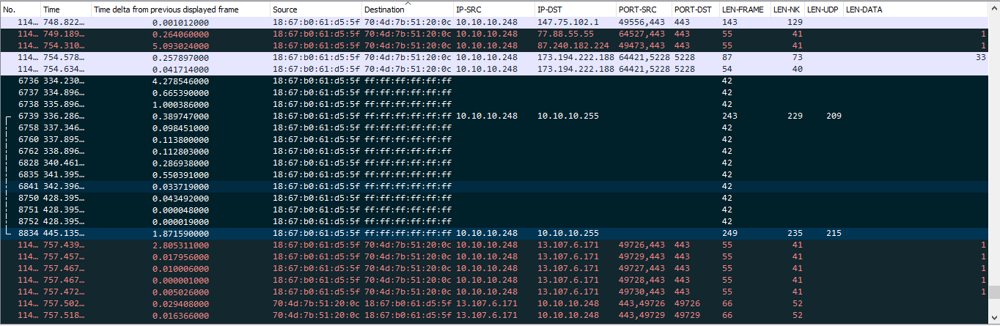
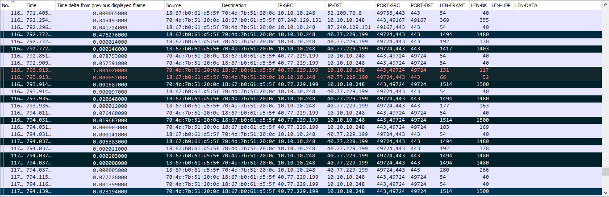
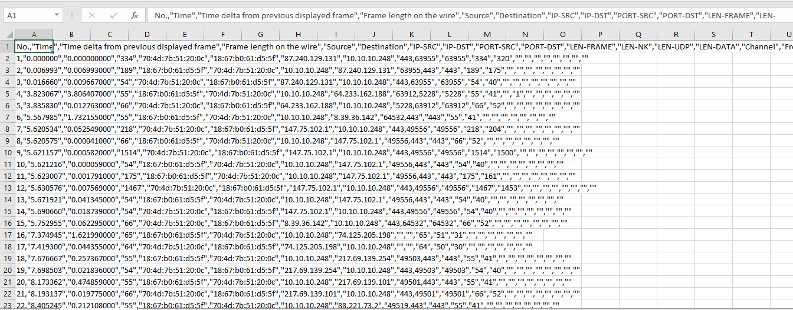
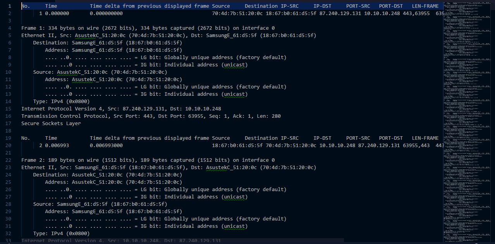

МИНИСТЕРСТВО ОБРАЗОВАНИЯ И НАУКИ РОССИЙСКОЙ ФЕДЕРАЦИИ\
ФЕДЕРАЛЬНОЕ ГОСУДАРСТВЕННОЕ АВТОНОМНОЕ ОБРАЗОВАТЕЛЬНОЕ УЧРЕЖДЕНИЕ
ВЫСШЕГО ОБРАЗОВАНИЯ

«Санкт-Петербургский национальный исследовательский университет

информационных технологий, механики и оптики»

Факультет информационных технологий и программирования

Кафедра информационных систем

Лабораторная работа № 5

Изучение функциональных возможностей программ для анализа сетевого
трафика

> Выполнил студент группы M3205\
> Ивницкий Алексей
>
> Проверил:
>
> Аксенов Владимир Олегович

САНКТ--ПЕТЕРБУРГ\
2018

Цель работы: Формирование навыков по использованию основных программных
инструментов анализа сетевого трафика.

{width="6.496527777777778in"
height="3.457638888888889in"}\
Рис. 1 - «Список доступных интерфейсов для захвата»

{width="6.496527777777778in"
height="2.0430555555555556in"}\
Рис. 2 - «Отображение по адресам»

{width="6.496527777777778in"
height="1.7333333333333334in"}\
Рис. 3 - «Отображение по длинам»

Таблица 1 -- Длины протоколов

  №   Параметр                                        Значение
  --- ----------------------------------------------- ----------------
  1   Длина протокола канального уровня               14 байт
  2   Длина протокола сетевого уровня                 20 байт
  3   Длина протокола транспортного уровня(UDP/TCP)   8 байт/20 байт

Таблица 2 -- Фильтры отображения в wireshark

  №    Название фильтра                                                               Фильтр в Wireshark
  ---- ------------------------------------------------------------------------------ ------------------------------------------------------------------
  1    Кадров Ethernet, отправляемых с сетевого интерфейса.                           eth.src == 18:67:b0:61:d5:5f
  2    Кадров Ethernet, только принимаемых на сетевой интерфейс.                      eth.dst == 18:67:b0:61:d5:5f
  3    Кадров Ethernet и отправляемых, и принимаемых сетевым интерфейсом.             eth.addr == 18:67:b0:61:d5:5f
  4    Пакетов IP, только отправляемых с сетевого интерфейса                          ip.src == 10.10.10.248
  5    Пакетов IP, только принимаемых на сетевой интерфейс                            ip.dst == 10.10.10.248
  6    Пакетов IP и отправляемых, и принимаемых сетевым интерфейсом                   ip.addr == 10.10.10.248
  7    Сегментов TCP, только отправляемых с сетевого интерфейса -- на порты 80, 443   (tcp.port == 80 \|\| tcp.port == 443) && ip.src == 10.10.10.248
  8    Сегментов TCP, только принимаемых на сетевой интерфейс -- с портов 80, 443     (tcp.port == 80 \|\| tcp.port == 443) && ip.dst == 10.10.10.248
  9    Сегментов TCP и отправляемых, и принимаемых сетевым интерфейсом                (tcp.port == 80 \|\| tcp.port == 443) && ip.addr == 10.10.10.248
  10   Датаграмм UDP, только отправляемых с сетевого интерфейса -- на порт 53         (udp.port == 53) && ip.src == 10.10.10.248
  11   Датаграмм UDP, только принимаемых на сетевой интерфейс -- с порта 53           (udp.port == 53) && ip.dst == 10.10.10.248
  12   Датаграмм UDP и отправляемых, и принимаемых сетевым интерфейсом                udp && ip.addr == 10.10.10.248
  13   Сообщений протокола arp                                                        arp
  14   Сообщений протокола icmp                                                       icmp
  15   Сообщений протокола dns                                                        dns
  16   Сообщений протокола http                                                       http

{width="6.496527777777778in"
height="2.1194444444444445in"}\
Рис. 4 - «Маркировка широковещательных кадров ethernet»

{width="6.496527777777778in"
height="2.104861111111111in"}\
Рис. 5 - «Маркировка пакетов по размеру»

{width="6.496527777777778in"
height="2.547222222222222in"}\
Рис. 6 - «Экспорт захвата в excel»

{width="6.496527777777778in"
height="3.2125in"}\
Рис. 7 - «Экспорт захвата в txt»

6\. Выводы

Особенности процедуры анализа сетевого трафика:

Процедура анализа заключается в написании фильтров для выборки нужных
данных. Для анализа используются пакеты данных. Результаты анализа
представляются в виде таблицы, где строки -- пакеты, а столбцы --
параметры этих пакетов.

Структура и функции программных инструментов анализа сетевого трафика:

Структура инструментов анализа сетевого трафика представляется собой
модуль перехвата трафика и инструменты его анализа. Основные функции:

1 Захват трафика\
2 Декодирование сетевых протоколов всех уровней, включая уровень
приложения.\
3 Фильтр трафика
