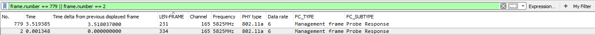
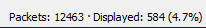

МИНИСТЕРСТВО ОБРАЗОВАНИЯ И НАУКИ РОССИЙСКОЙ ФЕДЕРАЦИИ\
ФЕДЕРАЛЬНОЕ ГОСУДАРСТВЕННОЕ АВТОНОМНОЕ ОБРАЗОВАТЕЛЬНОЕ УЧРЕЖДЕНИЕ
ВЫСШЕГО ОБРАЗОВАНИЯ

«Санкт-Петербургский национальный исследовательский университет

информационных технологий, механики и оптики»

Факультет информационных технологий и программирования

Кафедра информационных систем

Лабораторная работа № 7

Исследование процессов организации обмена данными в беспроводных
локальных сетях связи

> Выполнил студент группы M3205\
> Ивницкий Алексей
>
> Проверил:
>
> Аксенов Владимир Олегович

САНКТ--ПЕТЕРБУРГ\
2018

**Цель работы**: Формирование навыков по использованию основных
программных инструментов анализа сетевого трафика для поиска и
устранения неисправностей, связанных с обменом данными в беспроводных
локальных сетях связи.

1.  Формирование и обработка выборки, содержащей кадры заданного типа

{width="6.496527777777778in"
height="0.7569444444444444in"}\
Рис. 5.1.1 - «Кадр управления отображение по видам»

{width="6.496527777777778in"
height="0.6138888888888889in"}\
Рис. 5.1.2 - «Кадр контроля отображение по видам»
{width="6.496527777777778in"
height="0.45694444444444443in"}\
Рис. 5.1.3 - «Кадр данных отображение по видам»

2.  Формирование и обработка выборки, содержащей кадры заданного вида

Таблица 5.1

  **Тип кадра**     **Вид кадра**            **Порядковый номер**
  ----------------- ------------------------ ----------------------
  Кадр Управления   Association Request      3185
                    Association Response     3188
                    Authentication           3181
                    Beacon Frame             1
                    Disassociate             4401
                    Probe Request            4
                    Probe Response           2
  Кадр Контроля     802.11 Block Ack Reg     883
                    802.11 Block Ack         6356
                    Acknowledgement          9
                    Clear-to-send            6349
                    Request-to-send          6348
                    Data                     421
                    Null Function(No data)   920
                    +Qos Data                3191

{width="2.0205807086614174in"
height="0.2916305774278215in"}\
Рис. 5.2.1.1 - Запрос на ассоциацию количество кадров»

{width="6.496527777777778in"
height="0.4756944444444444in"}\
Рис. 5.2.1.2 - «Запрос на ассоциацию размеры кадров»

{width="6.496527777777778in"
height="0.48541666666666666in"}\
Рис. 5.2.1.3 - «Запрос на ассоциацию интервал между кадрами»

{width="2.0622419072615923in"
height="0.2916305774278215in"}\
Рис. 5.2.2.1 -- «Ответ на ассоциацию количество кадров»

{width="6.496527777777778in"
height="0.9479166666666666in"}\
Рис. 5.2.2.2 - «Ответ на ассоциацию размеры кадров»

{width="6.496527777777778in"
height="0.9430555555555555in"}\
Рис. 5.2.2.3 - «Ответ на ассоциацию интервал между кадрами»

{width="2.0622419072615923in"
height="0.2916305774278215in"}\
Рис. 5.2.3.1 -- «Запрос на повторную ассоциацию количество кадров»

{width="2.0622419072615923in"
height="0.2916305774278215in"}\
Рис. 5.2.4.1 -- «Ответ на повторную ассоциацию количество кадров»

{width="2.2913801399825022in"
height="0.31246062992125984in"}\
Рис. 5.2.5.1 -- «Пробный запрос количество кадров»

{width="6.496527777777778in"
height="2.78125in"}\
Рис. 5.2.5.2 - «Пробный запрос размеры кадров»

{width="6.496527777777778in"
height="2.238888888888889in"}\
Рис. 5.2.5.3 - «Пробный запрос интервал между кадрами»

{width="2.2913801399825022in"
height="0.2916305774278215in"}\
Рис. 5.2.6.1 -- «Ответ на пробный запрос количество кадров»

{width="6.496527777777778in"
height="0.3902777777777778in"}\
Рис. 5.2.6.2 - «Ответ на пробный запрос размеры кадров»

{width="6.496527777777778in"
height="2.234027777777778in"}\
Рис. 5.2.6.3 - «Ответ на пробный запрос интервал между кадрами»

{width="2.1455653980752407in"
height="0.2916305774278215in"}\
Рис. 5.2.7.1 -- «Оповещение о параметрах сети количество кадров»

{width="6.496527777777778in"
height="0.4666666666666667in"}\
Рис. 5.2.7.2 - «Оповещение о параметрах сети размеры кадров»

{width="6.496527777777778in"
height="2.2430555555555554in"}\
Рис. 5.2.7.3 - «Оповещение о параметрах сети интервал между кадрами»

{width="2.0309962817147857in"
height="0.2916305774278215in"}\
Рис. 5.2.8.1 -- «Оповещение в режиме энергосбережения количество кадров»

{width="2.041411854768154in"
height="0.3020450568678915in"}\
Рис. 5.2.9.1 -- «Запрос на разрыв ассоциации количество кадров»

{width="6.496527777777778in"
height="2.234027777777778in"}\
Рис. 5.2.9.2 - «Запрос на разрыв ассоциации размеры кадров»

{width="6.496527777777778in"
height="2.2430555555555554in"}\
Рис. 5.2.9.3 - «Запрос на разрыв ассоциации интервал между кадрами»

{width="1.9997495625546806in"
height="0.2916305774278215in"}\
Рис. 5.2.10.1 -- «Запрос на аутентификацию количество кадров»

{width="6.496527777777778in"
height="2.2430555555555554in"}\
Рис. 5.2.10.2 - «Запрос на аутентификацию размеры кадров»

{width="6.496527777777778in"
height="2.2430555555555554in"}\
Рис. 5.2.10.3 - «Запрос на аутентификацию интервал между кадрами»

{width="2.0205807086614174in"
height="0.2916305774278215in"}\
Рис. 5.2.11.1 -- «Оповещение о прекращении аутентификации количество
кадров»

{width="2.010165135608049in"
height="0.2916305774278215in"}\
Рис. 5.2.12.1 -- «Запрос на действие количество кадров»

{width="1.9997495625546806in"
height="0.27079943132108486in"}\
Рис. 5.2.13.1 -- «Запрос на действие без подтверждения количество
кадров»

{width="2.041411854768154in"
height="0.27079943132108486in"}\
Рис. 5.2.14.1 -- «Оповещение о параметрах синхронизации количество
кадров»

{width="2.041411854768154in"
height="0.2916305774278215in"}\
Рис. 5.2.15.1 -- «Запрос на переход в режим энергосбережения количество
кадров»

{width="2.083073053368329in"
height="0.27079943132108486in"}\
Рис. 5.2.16.1 -- «Запрос на возможность передачи данных количество
кадров»

{width="6.496527777777778in"
height="2.2527777777777778in"}\
Рис. 5.2.16.2 - «Запрос на возможность передачи данных размеры кадров»

{width="6.496527777777778in"
height="2.2625in"}\
Рис. 5.2.16.3 - «Запрос на возможность передачи данных интервал между
кадрами»

{width="2.103904199475066in"
height="0.31246062992125984in"}\
Рис. 5.2.17.1 -- «Подтверждение возможности передачи данных количество
кадров»

{width="6.496527777777778in"
height="2.2527777777777778in"}\
Рис. 5.2.17.2 - «Подтверждение возможности передачи данных размеры
кадров»

{width="2.280964566929134in"
height="0.24996828521434822in"}\
Рис. 5.2.18.1 -- «Подтверждение приема данных количество кадров»

{width="6.496527777777778in"
height="2.0430555555555556in"}\
Рис. 5.2.18.2 - «Подтверждение приема данных размеры кадров»

{width="6.496527777777778in"
height="2.0430555555555556in"}\
Рис. 5.2.18.3 - «Подтверждение приема данных интервал между кадрами»

{width="2.041411854768154in"
height="0.2916305774278215in"}\
Рис. 5.2.19.1 -- «Информирование об окончании режима нерегулируемого
доступа к среде передачи количество кадров»

{width="2.041411854768154in"
height="0.2916305774278215in"}\
Рис. 5.2.20.1 -- «Информирование об окончании режима нерегулируемого
доступа к среде передачи и подтверждение приема данных количество
кадров»

{width="2.0309962817147857in"
height="0.26038385826771654in"}\
Рис. 5.2.21.1 -- «Запрос на отправку подтверждения о приеме
последовательности кадров количество кадров»\
{width="6.496527777777778in"
height="0.5569444444444445in"}\
Рис. 5.2.21.2 - «Запрос на отправку подтверждения о приеме
последовательности кадров размеры кадров»

{width="6.496527777777778in"
height="0.5569444444444445in"}\
Рис. 5.2.21.3 - «Запрос на отправку подтверждения о приеме
последовательности кадров интервал между кадрами»

{width="2.041411854768154in"
height="0.2812150043744532in"}\
Рис. 5.2.22.1 -- «Подтверждение о приеме последовательности кадров
количество кадров»

{width="6.496527777777778in"
height="0.31875in"}\
Рис. 5.2.22.2 - «Подтверждение о приеме последовательности кадров
размеры кадров»

{width="6.496527777777778in"
height="0.31875in"}\
Рис. 5.2.22.3 - «Подтверждение о приеме последовательности кадров
интервал между кадрами»

{width="2.083073053368329in"
height="0.27079943132108486in"}\
Рис. 5.2.23.1 -- «Простой кадр данных количество кадров»

{width="6.496527777777778in"
height="0.4423611111111111in"}\
Рис. 5.2.23.2 - «Простой кадр данных размеры кадров»

{width="6.496527777777778in"
height="1.2381944444444444in"}\
Рис. 5.2.23.3 - «Простой кадр данных интервал между кадрами»

{width="2.155980971128609in"
height="0.2916305774278215in"}\
Рис. 5.2.24.1 -- «Пустой кадр данных количество кадров»

{width="6.496527777777778in"
height="2.0479166666666666in"}\
Рис. 5.2.24.2 - «Пустой кадр данных размеры кадров»

{width="6.496527777777778in"
height="2.0479166666666666in"}\
Рис. 5.2.24.3 - «Пустой кадр данных интервал между кадрами»

{width="2.0205807086614174in"
height="0.2916305774278215in"}\
Рис. 5.2.25.1 -- «Кадр данных с заполненными полями данных подтверждения
приема количество кадров»

{width="2.0205807086614174in"
height="0.2916305774278215in"}\
Рис. 5.2.26.1 -- «Кадр данных с заполненными полями данных опроса
количество кадров»

{width="2.0205807086614174in"
height="0.2916305774278215in"}\
Рис. 5.2.27.1 -- «Кадр данных с заполненными полями данных подтверждения
приема и опроса количество кадров»

{width="2.155980971128609in"
height="0.2916305774278215in"}\
Рис. 5.2.28.1 -- «Пустой кадр данных с заполненными полями данных
подтверждения приема количество кадров»

{width="6.496527777777778in"
height="2.0430555555555556in"}\
Рис. 5.2.28.2 - «Пустой кадр данных с заполненными полями данных
подтверждения приема размеры кадров»

{width="6.496527777777778in"
height="2.0430555555555556in"}\
Рис. 5.2.28.3 - «Пустой кадр данных с заполненными полями данных
подтверждения приема интервал между кадрами»

{width="2.0309962817147857in"
height="0.27079943132108486in"}\
Рис. 5.2.29.1 -- «Пустой кадр данных с заполненными полями данных опроса
количество кадров»

{width="2.0309962817147857in"
height="0.27079943132108486in"}\
Рис. 5.2.30.1 -- «Пустой кадр данных с заполненными полями данных
подтверждения приема и опроса количество кадров»

{width="2.0622419072615923in"
height="0.27079943132108486in"}\
Рис. 5.2.31.1 -- «Кадр данных с установленными метками QoS количество
кадров»

{width="6.496527777777778in"
height="2.0243055555555554in"}\
Рис. 5.2.31.2 - «Кадр данных с установленными метками QoS размеры
кадров»

{width="6.496527777777778in"
height="2.057638888888889in"}\
Рис. 5.2.31.3 - «Кадр данных с установленными метками QoS интервал между
кадрами»

{width="2.0309962817147857in"
height="0.27079943132108486in"}\
Рис. 5.2.32.1 -- «Пустой кадр данных с установленными метками QoS
количество кадров»

{width="2.0309962817147857in"
height="0.27079943132108486in"}\
Рис. 5.2.33.1 -- «Кадр данных с установленными метками QoS и
заполненными полями данных подтверждения приема количество кадров»

{width="2.0309962817147857in"
height="0.27079943132108486in"}\
Рис. 5.2.34.1 -- «Кадр данных с установленными метками QoS и
заполненными полями данных опроса количество кадров»

{width="2.0309962817147857in"
height="0.27079943132108486in"}\
Рис. 5.2.35.1 -- «Кадр данных с установленными метками QoS и
заполненными полями данных подтверждения приема и опроса количество
кадров»

{width="2.0309962817147857in"
height="0.27079943132108486in"}\
Рис. 5.2.36.1 -- «Пустой кадр данных с установленными метками QoS и
заполненными полями данных опроса количество кадров»

{width="2.0309962817147857in"
height="0.27079943132108486in"}\
Рис. 5.2.37.1 -- «Пустой кадр данных с установленными метками QoS и
заполненными полями данных подтверждения приема и опроса количество
кадров»

3.  Исследование информации, содержащейся в кадрах заданного вида

Таблица 5.2

  Вид кадра                                                                                                    Количество кадров   Размер кадров   Интервал времени между кадрами
  ------------------------------------------------------------------------------------------------------------ ------------------- --------------- --------------------------------
  Запрос на ассоциацию                                                                                         2                   165             0,001 секунд
  Ответ на ассоциацию                                                                                          8                   252             0,001-18 секунд
  Запрос на повторную ассоциацию                                                                               0                                   
  Ответ на повторную ассоциацию                                                                                0                                   
  Пробный запрос                                                                                               2177                54-347          0,001-0,3 секунд
  Ответ на пробный запрос                                                                                      7448                231-334         0,001-0,09 секунд
  Оповещение о параметрах сети                                                                                 0                                   
  Оповещение в режиме энергосбережения                                                                         0                                   
  Запрос на разрыв ассоциации                                                                                  7                   39-1606         0,6-13 секунд
  Запрос на аутентификацию                                                                                     6                   48-72           0,001-18 секунд
  Оповещение о прекращении аутентификации                                                                      0                                   
  Запрос на действие                                                                                           0                                   
  Запрос на действие без подтверждения                                                                         0                                   
  Оповещение о параметрах синхронизации                                                                        0                                   
  Запрос на переход в режим энергосбережения                                                                   0                                   
  Запрос на возможность передачи данных                                                                        11                  34              0,001-0,06 секунд
  Подтверждение возможности передачи данных                                                                    11                  28              \< 0,001 секунд
  Подтверждение приема данных                                                                                  1889                28              0,001-0,38 секунд
  Информирование об окончании режима нерегулируемого доступа к среде передачи                                  0                                   
  Информирование об окончании режима нерегулируемого доступа к среде передачи и подтверждение приема данных    0                                   
  Запрос на отправку подтверждения о приеме последовательности кадров                                          4                   38              1-28 секунд
  Подтверждение о приеме последовательности кадров                                                             1                   46              
  Простой кадр данных                                                                                          13                  112-160         0,01-16 секунд
  Пустой кадр данных                                                                                           264                 42              0,01-20 секунд
  Кадр данных с заполненными полями данных подтверждения приема                                                0                                   
  Кадр данных с заполненными полями данных опроса                                                              0                                   
  Кадр данных с заполненными полями данных подтверждения приема и опроса                                       0                                   
  Пустой кадр данных с заполненными полями данных подтверждения приема                                         264                 42              0,001-20 секунд
  Пустой кадр данных с заполненными полями данных опроса                                                       0                                   
  Пустой кадр данных с заполненными полями данных подтверждения приема и опроса                                0                                   
  Кадр данных с установленными метками QoS                                                                     38                  104-177         0,001-7,8 секунд
  Пустой кадр данных с установленными метками                                                                  0                                   
  Кадр данных с установленными метками QoS и заполненными полями данных подтверждения приема                   0                                   
  Кадр данных с установленными метками QoS и заполненными полями данных опроса                                 0                                   
  Кадр данных с установленными метками QoS и заполненными полями данных подтверждения приема и опроса          0                                   
  Пустой кадр данных с установленными метками QoS и заполненными полями данных опроса                          0                                   
  Пустой кадр данных с установленными метками QoS и заполненными полями данных подтверждения приема и опроса   0                                   

{width="6.496527777777778in"
height="1.9340277777777777in"}\
Рис. 5.3.1 - «Оповещение о параметрах сети (beacon) полезная информация»

{width="6.496527777777778in"
height="1.9340277777777777in"}\
Рис. 5.3.2 - «Пробный запрос (probe request) полезная информация»

{width="6.496527777777778in"
height="1.9340277777777777in"}\
Рис. 5.3.3 - «Ответ на пробный запрос (probe response) полезная
информация»

{width="6.496527777777778in"
height="1.8381944444444445in"}\
Рис. 5.3.4 - «Простой кадр данных (Data frame) полезная информация»

{width="6.496527777777778in"
height="1.9291666666666667in"}\
Рис. 5.3.5 - «Кадр данных с установленными метками QoS (QoS Data)
полезная информация»

{width="6.496527777777778in"
height="1.1803138670166229in"}\
Рис. 5.3.6 - «Подтверждение приёма данных (Acknowledgment, ACK) полезная
информация»

  Вид кадра                                             Категория информации                       Содержание
  ----------------------------------------------------- ------------------------------------------ ----------------------------------------
  Оповещение о параметрах сети (beacon)                 Номер канала                               165
                                                        Рабочая частота                            5825 MHz
                                                        Ширина канала                              802.11a (5)
                                                        Скорость передачи                          6 Mb/s
                                                        Адресная информация                        
                                                        Источник (source address)                  Ubiquiti\_70:07:94 (80:2a:a8:70:07:94)
                                                        Передающая сторона (transmitter address)   Ubiquiti\_70:07:94 (80:2a:a8:70:07:94)
                                                        Принимающая сторона (receiver address)     Broadcast (ff:ff:ff:ff:ff:ff)
                                                        Получатель (destination address)           Broadcast (ff:ff:ff:ff:ff:ff)
                                                        Имя сети (SSID)                            ubnt
                                                        Идентификатор сетевого узла (BSSID)        Ubiquiti\_70:07:94 (80:2a:a8:70:07:94)
  Пробный запрос (probe request)                        Номер канала                               165
                                                        Рабочая частота                            5825 MHz
                                                        Ширина канала                              802.11a (5)
                                                        Скорость передачи                          6 Mb/s
                                                        Адресная информация                        
                                                        Источник (source address)                  SonyMobi\_5d:57:69 (1c:7b:21:5d:57:69)
                                                        Передающая сторона (transmitter address)   SonyMobi\_5d:57:69 (1c:7b:21:5d:57:69)
                                                        Принимающая сторона (receiver address)     Broadcast (ff:ff:ff:ff:ff:ff)
                                                        Получатель (destination address)           Broadcast (ff:ff:ff:ff:ff:ff)
                                                        Имя сети (SSID)                            
                                                        Идентификатор сетевого узла (BSSID)        Broadcast (ff:ff:ff:ff:ff:ff)
  Ответ на пробный запрос (probe response)              Номер канала                               165
                                                        Рабочая частота                            5825 MHz
                                                        Ширина канала                              802.11a (5)
                                                        Скорость передачи                          6 Mb/s
                                                        Адресная информация                        
                                                        Источник (source address)                  Ubiquiti\_70:07:94 (80:2a:a8:70:07:94)
                                                        Передающая сторона (transmitter address)   Ubiquiti\_70:07:94 (80:2a:a8:70:07:94)
                                                        Принимающая сторона (receiver address)     Apple\_c5:e9:77 (68:db:ca:c5:e9:77)
                                                        Получатель (destination address)           Apple\_c5:e9:77 (68:db:ca:c5:e9:77)
                                                        Имя сети (SSID)                            ubnt
                                                        Идентификатор сетевого узла (BSSID)        Ubiquiti\_70:07:94 (80:2a:a8:70:07:94)
  Простой кадр данных (Data frame)                      Номер канала                               165
                                                        Рабочая частота                            5825 MHz
                                                        Ширина канала                              802.11a (5)
                                                        Скорость передачи                          6 Mb/s
                                                        Адресная информация                        
                                                        Источник (source address)                  Ubiquiti\_3e:f7:2f (80:2a:a8:3e:f7:2f)
                                                        Передающая сторона (transmitter address)   Ubiquiti\_70:07:94 (80:2a:a8:70:07:94)
                                                        Принимающая сторона (receiver address)     IPv4mcast\_01 (01:00:5e:00:00:01)
                                                        Получатель (destination address)           IPv4mcast\_01 (01:00:5e:00:00:01)
                                                        Имя сети (SSID)                            \-
                                                        Идентификатор сетевого узла (BSSID)        AsustekC\_91:a4:28 (e0:3f:49:91:a4:28)
                                                        Протокол сетевого уровня                   \-
                                                        Протокол транспортного уровня              \-
  Кадр данных с установленными метками QoS (QoS Data)   Номер канала                               165
                                                        Рабочая частота                            5825 MHz
                                                        Ширина канала                              802.11a (5)
                                                        Скорость передачи                          6 Mb/s
                                                        Адресная информация                        
                                                        Источник (source address)                  Ubiquiti\_70:07:94 (80:2a:a8:70:07:94)
                                                        Передающая сторона (transmitter address)   Ubiquiti\_70:07:94 (80:2a:a8:70:07:94)
                                                        Принимающая сторона (receiver address)     Apple\_56:ee:df (20:3c:ae:56:ee:df)
                                                        Получатель (destination address)           Apple\_56:ee:df (20:3c:ae:56:ee:df)
                                                        Имя сети (SSID)                            \-
                                                        Идентификатор сетевого узла (BSSID)        Ubiquiti\_70:07:94 (80:2a:a8:70:07:94)
                                                        Параметры qos                              \-
                                                        Протокол сетевого уровня                   \-
                                                        Протокол транспортного уровня              \-
  Подтверждение приёма данных (Acknowledgment, ACK)     Номер канала                               165
                                                        Рабочая частота                            5825 MHz
                                                        Ширина канала                              802.11a (5)
                                                        Скорость передачи                          6 Mb/s
                                                        Адресная информация                        
                                                        Источник (source address)                  \-
                                                        Передающая сторона (transmitter address)   \-
                                                        Принимающая сторона (receiver address)     Ubiquiti\_70:07:94 (80:2a:a8:70:07:94)
                                                        Получатель (destination address)           \-
                                                        Имя сети (SSID)                            \-
                                                        Идентификатор сетевого узла (BSSID)        \-

Выводы.

Кадры управления используются для управления связью станций и точек
доступа (например, кадры аутентификации пользователя или отмены
аутентификации). Кадры контроля предназначены для проверки правильности
передачи информации (предотвращение коллизий и др). Кадры данных
содержат в себе полезные данные.

В ходе лабы были использованы такие кадры:

  **Тип кадра**     **Вид кадра**
  ----------------- ------------------------
  Кадр Управления   Association Request
                    Association Response
                    Authentication
                    Beacon Frame
                    Disassociate
                    Probe Request
                    Probe Response
  Кадр Контроля     802.11 Block Ack Reg
                    802.11 Block Ack
                    Acknowledgement
                    Clear-to-send
                    Request-to-send
                    Data
                    Null Function(No data)
                    +Qos Data

Назначение кадров каждого вида:

Запрос на ассоциацию --- association request\
Ответ на ассоциацию --- association response\
Запрос на повторную ассоциацию --- reassociation request\
Ответ на повторную ассоциацию --- reassociation response\
Пробный запрос --- probe request\
Ответ на пробный запрос --- probe response\
Оповещение о параметрах сети --- beacon\
Оповещение в режиме энергосбережения --- ATIM\
Запрос на разрыв ассоциации --- Disassiciation\
Запрос на аутентификацию --- Authentication\
Оповещение о прекращении аутентификации --- Deauthentication\
Запрос на действие --- Action\
Запрос на действие без подтверждения --- Action No Ack\
Оповещение о параметрах синхронизации --- Timing advertisement\
Запрос на переход в режим энергосбережения ---Power Save Poll, PS-Poll\
Запрос на возможность передачи данных --- Request to Send, RTS\
Подтверждение возможности передачи данных --- Clear to Send, CTS\
Подтверждение приема данных --- Acknowledgement, ACK\
Информирование об окончании режима нерегулируемого доступа к среде
передачи --- Contention Free-End, CF-End\
Информирование об окончании режима нерегулируемого доступа к среде
передачи и подтверждение приема данных --- CF-End + CF-ACK\
Запрос на отправку подтверждения о приеме последовательности кадров ---
Block ACK Request, BlockAckReq\
Подтверждение о приеме последовательности кадров --- Block ACK,
BlockAck\
Простой кадр данных --- Data frame\
Пустой кадр данных --- Null function\
Кадр данных с заполненными полями данных подтверждения приема --- Data +
CF-ACK\
Кадр данных с заполненными полями данных опроса --- Data + CF Poll\
Кадр данных с заполненными полями данных подтверждения приема и опроса
--- Data + CF-ACK + CF-Poll\
Пустой кадр данных с заполненными полями данных подтверждения приема ---
CF-ACK\
Пустой кадр данных с заполненными полями данных опроса --- CF-Poll\
Пустой кадр данных с заполненными полями данных подтверждения приема и
опроса --- CF-ACK + CF-Poll\
Кадр данных с установленными метками QoS --- QoS Data\
Пустой кадр данных с установленными метками QoS --- QoS Null\
Кадр данных с установленными метками QoS и заполненными полями данных
подтверждения приема --- QoS Data + CF-ACK\
Кадр данных с установленными метками QoS и заполненными полями данных
опроса --- QoS Data + CF-Poll\
Кадр данных с установленными метками QoS и заполненными полями данных
подтверждения приема и опроса --- QoS Data + CF-ACK + CF-Poll\
Пустой кадр данных с установленными метками QoS и заполненными полями
данных опроса --- QoS CF-Poll\
Пустой кадр данных с установленными метками QoS и заполненными полями
данных подтверждения приема и опроса --- QoS CF-ACK + CF-Poll

Количество кадров каждого вида изменяет, размер переменный. В
зависимости от вида, кадры передаются постоянно или переменно. Это может
быть переменная передача (beacon), передача по событию (request) либо
передача по запросу(response) Кадры содержат различную информацию, как
служебную, так и непосредственно данные. Основное название информации:
реализовать обмен данными между устройствами.
