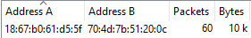
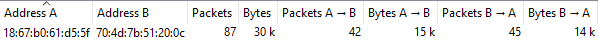
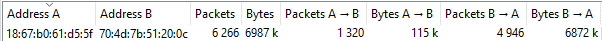
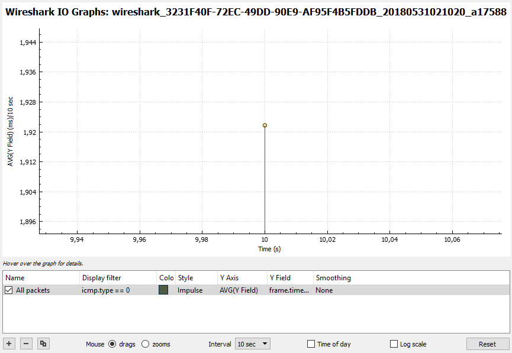
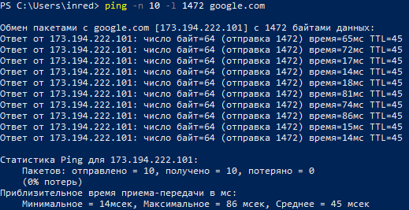
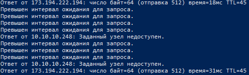

МИНИСТЕРСТВО ОБРАЗОВАНИЯ И НАУКИ РОССИЙСКОЙ ФЕДЕРАЦИИ\
ФЕДЕРАЛЬНОЕ ГОСУДАРСТВЕННОЕ АВТОНОМНОЕ ОБРАЗОВАТЕЛЬНОЕ УЧРЕЖДЕНИЕ
ВЫСШЕГО ОБРАЗОВАНИЯ

«Санкт-Петербургский национальный исследовательский университет

информационных технологий, механики и оптики»

Факультет информационных технологий и программирования

Кафедра информационных систем

Лабораторная работа № 8

Изучение основных характеристик производительности сетей связи

> Выполнил студент группы M3205\
> Ивницкий Алексей
>
> Проверил:
>
> Аксенов Владимир Олегович

САНКТ--ПЕТЕРБУРГ\
2018

**Цель работы:** Формирование навыков по оцениванию основных показателей
производительности сетей связи -- скорости передачи, задержки передачи,
разброса задержки передачи, потерь при передаче.

1.  Измерение скорости передачи данных в канале между двумя сетевыми
    устройствами, подключенными к одной локальной сети (канал через
    локальную сеть).

{width="2.92671697287839in"
height="0.44786089238845145in"}\
Рисунок 1.1.1 - «Канал LAN скорость передачи к маршрутизатору, выборка
10 секунд»

{width="3.062117235345582in"
height="0.4374453193350831in"}\
Рисунок 1.1.2 - «Канал LAN скорость передачи к маршрутизатору, выборка
60 секунд»

{width="2.92671697287839in"
height="0.4270297462817148in"}\
Рисунок 1.1.3 «Канал LAN скорость передачи к маршрутизатору, выборка 300
секунд»

{width="2.9163024934383204in"
height="0.4686909448818898in"}\
Рисунок 1.2.1 - «Канал LAN скорость передачи к ПК, выборка 10 секунд»

{width="2.905886920384952in"
height="0.4270297462817148in"}\
Рисунок 1.2.2 - «Канал LAN скорость передачи к ПК, выборка 60 секунд»

{width="2.9163024934383204in"
height="0.44786089238845145in"}\
Рисунок 1.2.3 «Канал LAN скорость передачи к ПК, выборка 300 секунд»

Таблица 1. LAN скорость передачи

  Время        К маршрутизатору   К ПК
  ------------ ------------------ ---------
  10 секунд    1 KB/s             9 KB/s
  60 секунд    0,5 KB/s           2 KB/s
  300 секунд   1,5 KB/s           28 KB/s

2.  Произведем измерение скорости передачи данных в канале между двумя
    сетевыми устройствами, подключенными к разным локальным сетям (канал
    через глобальную сеть).

{width="6.22838801399825in"
height="0.4374453193350831in"}\
Рисунок 2.1.1 - «Канал WAN скорость передачи просмотра Web-страниц
выборка 10 секунд»

{width="6.22838801399825in"
height="0.44786089238845145in"}\
Рисунок 2.1.2 - «Канал WAN скорость передачи просмотра Web-страниц
выборка 60 секунд»

{width="6.197142388451444in"
height="0.4270297462817148in"}\
Рисунок 2.1.3 - «Канал WAN скорость передачи просмотра Web-страниц
выборка 300 секунд»

{width="6.270049212598425in"
height="0.4270297462817148in"}\
Рисунок 2.2.1 - «Канал WAN скорость передачи скачивания файлов выборка
10 секунд»

{width="6.270049212598425in"
height="0.4270297462817148in"}\
Рисунок 2.2.2 - «Канал WAN скорость передачи скачивания файлов выборка
60 секунд»

{width="6.238803587051619in"
height="0.4270297462817148in"}\
Рисунок 2.2.3 - «Канал WAN скорость передачи скачивания файлов выборка
300 секунд»

{width="6.238803587051619in"
height="0.4270297462817148in"}\
Рисунок 2.3.1 - «Канал WAN скорость передачи просмотра видеозаписей
выборка 10 секунд»

{width="6.249219160104987in"
height="0.4061996937882765in"}\
Рисунок 2.3.2 - «Канал WAN скорость передачи просмотра видеозаписей
выборка 60 секунд»

{width="6.249219160104987in"
height="0.4061996937882765in"}\
Рисунок 2.3.3 - «Канал WAN скорость передачи просмотра видеозаписей
выборка 300 секунд»

Таблица 2. WAN скорость передачи

  Время                                   К маршрутизатору   К ПК
  --------------------------------------- ------------------ ------------
  просмотра Web-страниц 10 секунд         1,5 KB/s           1,4 KB/s
  просмотра Web-страниц 60 секунд         5,1 KB/s           12,5 KB/s
  просмотра Web-страниц 300 секунд        11 KB/s            93 KB/s
  передачи скачивания файлов 10 секунд    11,5 KB/s          687,2 KB/s
  передачи скачивания файлов 60 секунд    14 KB/s            730 KB/s
  передачи скачивания файлов 300 секунд   13 KB/s            666 KB/s
  просмотра видеозаписей 10 секунд        0,6 KB/s           19,3 KB/s
  просмотра видеозаписей 60 секунд        1,1 KB/s           38 KB/s
  просмотра видеозаписей 300 секунд       1,9 KB/s           76 KB/s

3.  Задержка и разброс задержки (джиттер) передачи данных в канале между
    двумя сетевыми устройствами, подключенными к одной локальной сети
    (канал через локальную сеть)

{width="4.801482939632546in"
height="2.8225634295713036in"}\
Рисунок 3.1 -- «Канал LAN задержка передачи утилита Ping»

{width="6.496527777777778in"
height="3.751388888888889in"}\
Рисунок 3.2 - «Канал LAN задержка передачи утилита Wireshark»

{width="6.496527777777778in"
height="4.483333333333333in"}\
Рисунок 3.3 - «Канал LAN задержка передачи утилита Wireshark»

Минимальная: 0.886\
Средняя: 1.92\
Максимальная: 4.392

4.  Задержка и разброс задержки (джиттер) передачи данных в канале между
    двумя сетевыми устройствами, подключенными к разным локальным сетям
    (канал через глобальную сеть)

{width="5.405574146981627in"
height="2.7809022309711287in"}\
Рисунок 4.1.1 -- «Канал WAN задержка передачи утилита Ping»

{width="6.496527777777778in"
height="4.204861111111111in"}\
Рисунок 4.1.2 - «Канал LAN задержка передачи утилита Wireshark»

{width="6.496527777777778in"
height="4.208333333333333in"}\
Рисунок 4.1.3 - «Канал LAN задержка передачи утилита Wireshark»

Минимальная: 13.94\
Средняя: 45.5\
Максимальная: 86.03

{width="5.8430194663167105in"
height="2.812148950131234in"}\
Рисунок 4.2.1 -- «Канал WAN задержка передачи утилита Ping»

{width="6.496527777777778in"
height="3.7444444444444445in"}\
Рисунок 4.2.2 - «Канал LAN задержка передачи утилита Wireshark»

{width="6.496527777777778in"
height="4.445138888888889in"}\
Рисунок 4.2.3 - «Канал LAN задержка передачи утилита Wireshark»

Минимальная: 13.01\
Средняя: 18.5\
Максимальная: 24.6

{width="5.322251749781278in"
height="2.7704866579177603in"}\
Рисунок 4.3.1 -- «Канал WAN задержка передачи утилита Ping»

{width="6.496527777777778in"
height="3.782638888888889in"}\
Рисунок 4.3.2 - «Канал LAN задержка передачи утилита Wireshark»

{width="6.496527777777778in"
height="4.678472222222222in"}\
Рисунок 4.3.3 - «Канал LAN задержка передачи утилита Wireshark»

Минимальная: 13.33\
Средняя: 16.2\
Максимальная: 22.71

5.  Потери при передаче данных в канале между двумя сетевыми
    устройствами, подключенными к одной локальной сети (канал через
    локальную сеть)

{width="4.124484908136483in"
height="1.2915048118985126in"}\
Рисунок 5.1.1 Канал LAN потери передачи разрыв соединения --- консоль

{width="4.166146106736658in"
height="3.4474857830271217in"}\
Рисунок 5.1.2 Канал LAN потери передачи разрыв соединения Wireshark (1)

{width="6.496527777777778in"
height="1.6in"}\
Рисунок 5.1.3 Канал LAN потери передачи разрыв соединения Wireshark (2)

{width="4.072407042869641in"
height="2.197642169728784in"}\
Рисунок 5.2.1 Канал LAN потери передачи отключении питания--- консоль

{width="6.496527777777778in"
height="1.1902777777777778in"}\
Рисунок 5.2.2 Канал LAN потери передачи отключении питания Wireshark (1)

{width="6.496527777777778in"
height="1.2048611111111112in"}\
Рисунок 5.2.3 Канал LAN потери передачи отключении питания Wireshark (2)

6.  Потери при передаче данных в канале между двумя сетевыми
    устройствами, подключенными к разным локальным сетям (канал через
    глобальную сеть)

    a.  Google.com

{width="5.2910050306211724in"
height="0.8748906386701663in"}\
Рисунок 6.1.1.1 Канал WAN потери передачи разрыв соединения --- консоль

{width="6.496527777777778in"
height="1.7430555555555556in"}\
Рисунок 6.1.1.2 Канал WAN потери передачи разрыв соединения Wireshark
(1)

{width="6.496527777777778in"
height="1.7444444444444445in"}\
Рисунок 6.1.1.3 Канал WAN потери передачи разрыв соединения Wireshark
(2)

{width="5.301420603674541in"
height="3.0725328083989503in"}\
Рисунок 6.1.2.1 Канал WAN потери передачи отключении питания --- консоль

{width="6.496527777777778in"
height="1.1284722222222223in"}\
Рисунок 6.1.2.2 Канал WAN потери передачи отключении питания ---
Wireshark (1)

{width="6.496527777777778in"
height="1.0569444444444445in"}\
Рисунок 6.1.2.3 Канал WAN потери передачи отключении питания ---
Wireshark (2)

b.  Docs.google.com

{width="5.311836176727909in"
height="1.6039665354330708in"}\
Рисунок 6.2.1.1 Канал WAN потери передачи разрыв соединения --- консоль

{width="6.496527777777778in"
height="1.6333333333333333in"}\
Рисунок 6.2.1.2 -- «Канал WAN потери передачи разрыв соединения ---
Wireshark (1)»

{width="6.496527777777778in"
height="1.4333333333333333in"}\
Рисунок 6.2.1.3 -- «Канал WAN потери передачи разрыв соединения ---
Wireshark (2)»

{width="5.311836176727909in"
height="1.6039665354330708in"}\
Рисунок 6.2.2.1 Канал WAN потери передачи отключении питания --- консоль

{width="6.496527777777778in"
height="1.4194444444444445in"}\
Рисунок 6.2.2.2 -- «Канал WAN потери передачи отключении питания ---
Wireshark (1)»

{width="6.496527777777778in"
height="1.4201388888888888in"}\
Рисунок 6.2.2.3 -- «Канал WAN потери передачи отключении питания ---
Wireshark (2)»

c.  youtube.com

{width="5.332666229221347in"
height="1.3227515310586178in"}\
Рисунок 6.3.1.1 Канал WAN потери передачи разрыв соединения --- консоль

{width="6.496527777777778in"
height="2.104861111111111in"}\
Рисунок 6.3.1.2 -- «Канал WAN потери передачи разрыв соединения ---
Wireshark (1)»

{width="6.496527777777778in"
height="2.104861111111111in"}\
Рисунок 6.3.1.3 -- «Канал WAN потери передачи разрыв соединения ---
Wireshark (2)»

{width="5.311836176727909in"
height="1.885181539807524in"}\
Рисунок 6.3.2.1 Канал WAN потери передачи отключении питания --- консоль

{width="6.496527777777778in"
height="1.4951388888888888in"}\
Рисунок 6.3.2.2 -- «Канал WAN потери передачи отключении питания ---
Wireshark (1)»

{width="6.496527777777778in"
height="1.4909722222222221in"}\
Рисунок 6.3.2.3 -- «Канал WAN потери передачи отключении питания ---
Wireshark (2)»

                    Ping (разрыв соединения)   Wireshark (разрыв соединения)   Ping (отключение питания)   Wireshark (отключение питания)
  ----------------- -------------------------- ------------------------------- --------------------------- --------------------------------
  Канал LAN         7                          7                               13                          12
  Web-cервер        4                          4                               19                          17
  Файловый сервер   9                          9                               9                           16
  Видеосервер       7                          7                               11                          9
